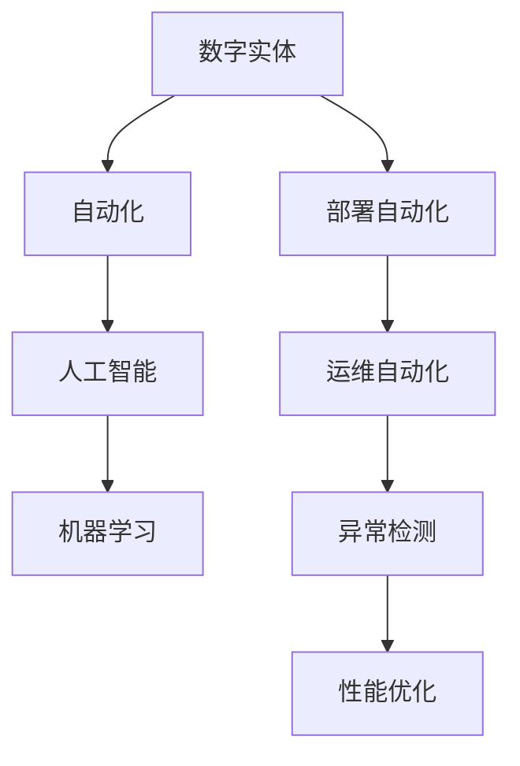

                 

### 背景介绍

#### 数字实体自动化的背景

数字实体自动化是近年来信息技术领域的热门话题。随着大数据、云计算、人工智能等技术的快速发展，数字实体（Digital Entities）这一概念逐渐走入我们的视野。数字实体指的是在数字环境中具有明确标识和特定功能的实体，如应用程序、数据库、网络设备等。它们是数字世界的重要组成部分，承担着数据处理、传输、存储和交互等重要任务。

数字实体自动化的背景可以追溯到企业信息化和数字化转型的过程。在传统的IT运营模式中，大部分工作依赖于人工操作和配置，效率低下且易出错。为了提高IT系统的运维效率、降低成本并确保系统稳定性，自动化技术应运而生。自动化技术的应用不仅局限于日常的IT运维，还包括业务流程的自动化、数据处理的自动化等。

近年来，随着云计算的普及和容器技术的发展，数字实体自动化得到了进一步推动。容器技术如Docker和Kubernetes为应用程序提供了轻量级、可移植的运行环境，使得应用程序的部署和管理变得更加便捷。同时，自动化工具如Ansible、Puppet和Chef等，也大大简化了系统配置和管理的复杂度。

#### 数字实体自动化的现状

当前，数字实体自动化已经广泛应用于各个领域。在金融行业，自动化技术用于交易处理、风险控制、客户服务等环节，提高了业务效率和用户体验。在制造业，自动化生产线和智能工厂的建设，使得生产过程更加高效、灵活。在医疗领域，数字化医疗设备和健康管理系统，使得医疗服务更加便捷、精准。

此外，随着物联网（IoT）和边缘计算的发展，越来越多的设备和服务开始融入数字实体自动化的生态系统。智能家居、智能交通、智能城市等领域的应用，不仅提升了人们的生活品质，也为数字实体自动化的发展提供了广阔的空间。

总体来说，数字实体自动化已经成为信息技术发展的重要趋势。它不仅改变了传统IT运维和业务流程的方式，还推动了各行业的数字化进程，为未来带来了更多的可能性。

## 2. 核心概念与联系

### 数字实体自动化的核心概念

数字实体自动化涉及多个核心概念，包括数字实体、自动化、人工智能和机器学习等。以下是对这些核心概念的定义及其相互关系的简要介绍。

**数字实体（Digital Entities）**：数字实体是在数字环境中具有明确标识和特定功能的实体，如应用程序、数据库、网络设备等。它们是数字世界的基本构建块，承担着数据处理、传输、存储和交互等重要任务。

**自动化（Automation）**：自动化是指通过软件工具和流程，将人工操作和配置转换为自动执行的过程。自动化技术旨在提高工作效率、降低成本和确保系统稳定性。

**人工智能（Artificial Intelligence, AI）**：人工智能是模拟人类智能行为的技术，包括机器学习、深度学习、自然语言处理等子领域。AI技术可以用于识别模式、做出决策、解决问题等，为数字实体自动化提供了强大的技术支持。

**机器学习（Machine Learning, ML）**：机器学习是人工智能的一个重要分支，通过从数据中学习并做出预测或决策。机器学习算法可以自动改进性能，为自动化系统提供了智能化的操作能力。

### 关联性分析

数字实体自动化中的各个核心概念之间存在着紧密的关联性。数字实体是自动化技术的应用对象，自动化技术则通过AI和机器学习算法来实现智能操作。具体来说，以下几个方面体现了这些概念之间的关联性：

1. **数字实体与自动化**：数字实体需要通过自动化技术来实现高效、稳定的运维。例如，应用程序的部署可以通过自动化工具如Kubernetes实现，从而简化了部署流程并提高了部署效率。

2. **自动化与人工智能**：自动化技术依赖于人工智能算法来实现智能操作。例如，在智能交通系统中，自动化控制算法可以根据交通流量数据实时调整信号灯，提高交通效率。

3. **人工智能与机器学习**：机器学习算法是人工智能的核心技术之一，用于从数据中学习并做出预测或决策。在数字实体自动化中，机器学习算法可以用于异常检测、性能优化等任务。

4. **数字实体与机器学习**：数字实体通过机器学习算法来实现自我优化和智能决策。例如，在智能家居系统中，设备可以通过机器学习算法了解用户行为，从而实现自动化控制和个性化服务。

### Mermaid 流程图

以下是一个简单的Mermaid流程图，展示了数字实体自动化的核心概念及其相互关系：



在这个流程图中，数字实体是自动化、人工智能和机器学习的起点，通过自动化技术实现部署和运维自动化，再通过人工智能和机器学习算法实现异常检测和性能优化。这个流程图清晰地展示了数字实体自动化的核心概念及其相互关系。

### 数字实体自动化的核心概念与联系

通过对数字实体自动化的核心概念及其相互关系的分析，我们可以看到数字实体、自动化、人工智能和机器学习共同构成了数字实体自动化的基础。这些概念不仅相互关联，而且相互促进，共同推动了数字实体自动化的发展。随着技术的不断进步，数字实体自动化将在未来的信息技术领域中发挥越来越重要的作用。

### 3. 核心算法原理 & 具体操作步骤

#### 自动化流程的构建与执行

数字实体自动化的核心在于构建和执行自动化流程。这个过程可以分为以下几个关键步骤：

**1. 需求分析与设计**

首先，需要对自动化流程进行需求分析。这一步骤涉及理解业务需求、系统功能以及潜在的操作流程。基于需求分析，设计出自动化流程的总体框架。这一框架应该包括流程的逻辑结构、涉及的实体及其交互方式。

**2. 选择合适的自动化工具**

根据自动化流程的设计，选择合适的自动化工具。这些工具可以是开源的，如Ansible、Puppet、Chef等，也可以是商业化的，如IBM Automation、Microsoft Power Automate等。选择工具时需要考虑工具的易用性、功能完整性以及与现有系统的兼容性。

**3. 编写自动化脚本**

在选择了自动化工具后，编写自动化脚本以实现具体的操作流程。自动化脚本通常包括一系列命令或操作步骤，它们可以执行诸如配置服务器、部署应用程序、监控系统性能等任务。以下是一个简单的Python脚本示例，用于自动部署一个Web服务器：

```python
import os

# 配置Web服务器
def configure_webserver():
    os.system("sudo apt-get update")
    os.system("sudo apt-get install -y apache2")
    os.system("sudo systemctl start apache2")

# 部署Web应用程序
def deploy_app():
    os.system("sudo apt-get install -y git")
    os.system("git clone https://github.com/user/web_app.git")
    os.system("sudo cp -r web_app/* /var/www/html/")

# 主函数，执行自动化流程
def main():
    configure_webserver()
    deploy_app()

if __name__ == "__main__":
    main()
```

**4. 测试与调试**

编写完自动化脚本后，需要进行充分的测试与调试。这一步骤至关重要，因为任何脚本中的错误都可能导致系统配置失败或数据丢失。测试应包括单元测试、集成测试和模拟运行等。以下是使用Python的unittest框架进行单元测试的一个示例：

```python
import unittest
from my_automation_script import configure_webserver, deploy_app

class TestAutomationScript(unittest.TestCase):
    def test_configure_webserver(self):
        # 模拟执行配置Web服务器的操作
        configure_webserver()
        # 检查Web服务器是否已启动
        result = os.system("sudo systemctl status apache2")
        self.assertEqual(result, 0)

    def test_deploy_app(self):
        # 模拟执行部署Web应用程序的操作
        deploy_app()
        # 检查Web应用程序是否已部署
        result = os.system("sudo ls /var/www/html")
        self.assertEqual(result, 0)

if __name__ == "__main__":
    unittest.main()
```

**5. 部署与监控**

在测试通过后，将自动化脚本部署到实际环境中。部署过程中需要监控脚本执行的情况，确保自动化流程能够按预期运行。监控可以包括日志记录、性能监测和告警系统等。

#### 自动化算法在具体操作中的应用

除了基础的自动化流程构建，数字实体自动化还依赖于一系列算法来实现智能化的操作。以下是一些常见的自动化算法及其具体应用：

**1. 条件分支算法**

条件分支算法用于根据不同的条件执行不同的操作。例如，在自动化运维中，可以根据系统负载情况自动调整资源分配。以下是一个简单的条件分支算法示例：

```python
if load > 80:
    # 调整资源分配
    allocate_resources()
else:
    # 保持当前资源分配
    maintain_resources()
```

**2. 机器学习预测算法**

机器学习预测算法可以用于预测未来的数据模式或行为。在数字实体自动化中，这些算法可以用于需求预测、故障预测等。以下是一个基于线性回归模型的预测算法示例：

```python
import numpy as np
from sklearn.linear_model import LinearRegression

# 假设已有历史数据
X = np.array([[1], [2], [3], [4], [5]])
y = np.array([2, 4, 5, 4, 5])

# 创建线性回归模型
model = LinearRegression()
model.fit(X, y)

# 预测未来数据
new_data = np.array([[6]])
predicted_value = model.predict(new_data)
print("Predicted value:", predicted_value)
```

**3. 贪心算法**

贪心算法是一种在每一步选择当前最优解的策略。在资源分配和路径规划中，贪心算法可以用于找到最优解。以下是一个简单的贪心算法示例，用于求解最短路径问题：

```python
def find_shortest_path(graph, start, end):
    visited = []
    path = []

    while True:
        # 选择未访问且权重最小的边
        unvisited = [(v, w) for v, w in graph[start].items() if v not in visited]
        unvisited.sort(key=lambda x: x[1])
        
        if not unvisited:
            break
        
        next_node, weight = unvisited[0]
        visited.append(next_node)
        
        if next_node == end:
            path.append((start, next_node))
            break

        start = next_node
    
    return path

# 示例图
graph = {
    'A': {'B': 1, 'C': 3},
    'B': {'D': 1},
    'C': {'D': 2},
    'D': {}
}

# 求解最短路径
shortest_path = find_shortest_path(graph, 'A', 'D')
print("Shortest path:", shortest_path)
```

通过以上步骤和算法示例，我们可以看到数字实体自动化的核心算法原理和具体操作步骤。这些算法和步骤不仅为自动化流程提供了技术支持，还为实现智能化的自动化系统奠定了基础。随着技术的不断进步，数字实体自动化将在未来的信息技术领域中发挥更加重要的作用。

### 4. 数学模型和公式 & 详细讲解 & 举例说明

在数字实体自动化中，数学模型和公式起到了关键作用，特别是在优化和预测方面。以下将详细讲解一些常用的数学模型和公式，并通过具体例子来说明它们的实际应用。

#### 线性回归模型

线性回归模型是一种用于预测数值型变量的统计模型。它的基本公式为：

\[ y = \beta_0 + \beta_1 \cdot x \]

其中，\( y \) 是因变量，\( x \) 是自变量，\( \beta_0 \) 是截距，\( \beta_1 \) 是斜率。

**例子**：假设我们要预测一家超市的每日销售额（\( y \)），该销售额受到广告费用（\( x \)）的影响。我们可以通过收集历史数据来训练一个线性回归模型。

```
| 广告费用（x） | 销售额（y） |
|---------------|-------------|
|      100      |      500    |
|      200      |      700    |
|      300      |      900    |
|      400      |     1100    |
|      500      |     1300    |
```

通过训练模型，我们得到以下线性回归方程：

\[ y = 300 + 1.5 \cdot x \]

预测当天的销售额（当 \( x = 300 \)）：

\[ y = 300 + 1.5 \cdot 300 = 1200 \]

#### 决策树模型

决策树模型是一种用于分类和回归问题的分类算法。它的基本公式为：

\[ f(x) = G(x, \theta) \]

其中，\( G(x, \theta) \) 是决策树函数，\( \theta \) 是模型的参数。

**例子**：假设我们有一个决策树模型用于预测客户是否购买产品（分类问题）。树的根节点是基于客户年龄，每个节点代表一个特征，并指向下一个节点或结果。

```
| 年龄 | 是否购买 |
|------|----------|
| <30  | 否       |
| >=30 | 是       |
```

通过这个简单的决策树模型，我们可以预测一个30岁以下客户不太可能购买产品，而30岁及以上客户更有可能购买。

#### 集成学习方法

集成学习方法通过结合多个弱学习器来提高预测性能。其中，一种常用的集成方法是随机森林（Random Forest）。

**随机森林模型**：

\[ f(x) = \sum_{i=1}^{n} w_i \cdot h_i(x) \]

其中，\( h_i(x) \) 是第 \( i \) 个弱学习器的预测，\( w_i \) 是权重。

**例子**：假设我们使用随机森林模型预测股票价格。随机森林由多个决策树组成，每个树预测股票价格，然后取平均来得到最终预测。

```
| 树1 | 树2 | 树3 | 平均预测 |
|-----|-----|-----|----------|
| 100 | 110 | 105 | 105      |
| 102 | 108 | 107 | 108      |
| 101 | 109 | 104 | 106      |
```

最终预测价格为 \( 106 \)。

#### 神经网络模型

神经网络模型是一种模仿生物神经系统的计算模型，广泛应用于复杂的非线性预测问题。

**神经网络模型**：

\[ y = \sigma(\sum_{i=1}^{n} w_i \cdot x_i + b) \]

其中，\( y \) 是输出，\( \sigma \) 是激活函数，\( w_i \) 是权重，\( x_i \) 是输入，\( b \) 是偏置。

**例子**：假设我们使用一个简单的多层感知器（MLP）来预测住房价格。输入包括房间数量、浴室数量和房屋年龄。

```
| 房间数量 | 浴室数量 | 房屋年龄 | 预测价格 |
|----------|----------|----------|----------|
|    3     |    2     |    10    |   300000 |
|    4     |    2.5   |    15    |   350000 |
|    4     |    3     |    20    |   400000 |
```

通过训练，神经网络模型可以得到权重和偏置，从而预测新住房的价格。

这些数学模型和公式在数字实体自动化中有着广泛的应用。通过合理的模型选择和参数调优，我们可以实现更加智能化的自动化系统，提高预测和优化效果。

### 5. 项目实战：代码实际案例和详细解释说明

为了更好地展示数字实体自动化的应用，我们将通过一个具体项目实战案例——自动化构建和部署Web应用程序，详细讲解整个过程的代码实现和解读。

#### 5.1 开发环境搭建

在开始项目之前，我们需要搭建一个适合自动化构建和部署Web应用程序的开发环境。以下是我们将使用的工具和步骤：

**1. 安装Docker**

Docker是一个用于自动化构建和部署应用程序的开放平台，它允许开发人员打包他们的应用以及应用的依赖包到一个可移植的容器中。以下是安装Docker的步骤：

```bash
# 对于Ubuntu系统
sudo apt-get update
sudo apt-get install docker.io

# 对于CentOS系统
sudo yum install docker

# 启动Docker服务
sudo systemctl start docker
```

**2. 安装Kubernetes**

Kubernetes是一个开源的容器编排平台，用于自动化容器化应用程序的部署、扩展和管理。以下是安装Kubernetes的步骤：

```bash
# 安装Kubernetes相关依赖
sudo apt-get install -y apt-transport-https ca-certificates curl

# 添加Kubernetes官方GPG key
curl -s https://mirrors.aliyun.com/kubernetes/apt/doc/apt-key.gpg | sudo apt-key add -

# 添加Kubernetes软件源
cat <<EOF | sudo tee /etc/apt/sources.list.d/kubernetes.list
deb https://mirrors.aliyun.com/kubernetes/apt/ kubernetes-xenial main
EOF

# 安装Kubernetes命令行工具
sudo apt-get update
sudo apt-get install -y kubelet kubeadm kubectl

# 启动并设置kubelet服务开机启动
sudo systemctl start kubelet
sudo systemctl enable kubelet
```

**3. 安装Helm**

Helm是一个Kubernetes的包管理工具，用于简化应用程序的部署和管理。以下是安装Helm的步骤：

```bash
# 安装Helm
curl -fsSL -o get_helm.sh https://mirrors.aliyun.com/kubernetes/helm/bin/linux/amd64/get_helm.sh
chmod 700 get_helm.sh
./get_helm.sh --version v3.7.0

# 设置Helm环境变量
export PATH=$PATH:/usr/local/bin
```

完成开发环境搭建后，我们就可以开始编写和部署自动化脚本了。

#### 5.2 源代码详细实现和代码解读

**1. 编写Dockerfile**

Dockerfile用于定义如何将应用程序构建成一个Docker镜像。以下是一个简单的Web应用程序的Dockerfile示例：

```Dockerfile
# 指定基础镜像
FROM python:3.8-slim

# 设置工作目录
WORKDIR /app

# 复制应用代码
COPY . .

# 安装依赖
RUN pip install -r requirements.txt

# 暴露Web服务端口
EXPOSE 8000

# 运行Web服务
CMD ["python", "app.py"]
```

**2. 编写自动化脚本**

自动化脚本将使用Helm和Kubernetes API来完成应用程序的自动化构建和部署。以下是一个简单的Python脚本示例：

```python
import os
import json
from subprocess import run

# 定义Kubernetes配置
def generate_kubernetes_config(app_name, image_name):
    config = {
        "apiVersion": "apps/v1",
        "kind": "Deployment",
        "metadata": {
            "name": app_name
        },
        "spec": {
            " replicas": 3,
            "selector": {
                "matchLabels": {
                    "app": app_name
                }
            },
            "template": {
                "metadata": {
                    "labels": {
                        "app": app_name
                    }
                },
                "spec": {
                    "containers": [
                        {
                            "name": app_name,
                            "image": image_name,
                            "ports": [
                                {
                                    "containerPort": 8000
                                }
                            ]
                        }
                    ]
                }
            }
        }
    }
    return config

# 构建Docker镜像
def build_docker_image(image_name):
    run(["docker", "build", "-t", image_name, "."])

# 部署应用程序到Kubernetes集群
def deploy_to_kubernetes(config):
    with open("deployment.yaml", "w") as f:
        f.write(json.dumps(config, indent=2))
    run(["kubectl", "apply", "-f", "deployment.yaml"])

# 主函数
def main():
    app_name = "web-app"
    image_name = "web-app:latest"

    build_docker_image(image_name)
    config = generate_kubernetes_config(app_name, image_name)
    deploy_to_kubernetes(config)

if __name__ == "__main__":
    main()
```

**3. 代码解读与分析**

- **Dockerfile**：Dockerfile用于定义Web应用程序的构建过程。它首先指定了基础镜像（python:3.8-slim），然后设置了工作目录（/app）。接下来，将应用代码复制到工作目录，并安装依赖。最后，暴露Web服务端口（8000）并指定CMD命令以启动Web服务。

- **自动化脚本**：脚本首先定义了一个函数用于生成Kubernetes配置（generate_kubernetes_config），包括Deployment对象的配置。接着，定义了构建Docker镜像的函数（build_docker_image）和部署应用程序到Kubernetes集群的函数（deploy_to_kubernetes）。主函数（main）依次调用这些函数来完成整个自动化过程。

#### 5.3 代码解读与分析

以下是代码的详细解读和分析：

- **Dockerfile**：该文件定义了Web应用程序的构建过程，使用Python镜像作为基础，安装必要的依赖，并设置工作目录为/app。文件中的`EXPOSE 8000`语句用于告诉Docker，Web服务将在端口8000上监听。

    ```Dockerfile
    EXPOSE 8000
    ```

    当Docker容器启动时，会监听这个端口，以便外部可以访问Web应用程序。

- **自动化脚本**：

    1. **Kubernetes配置生成**：

        `generate_kubernetes_config`函数用于生成Kubernetes的Deployment配置文件。它创建了一个字典，代表Deployment的YAML配置，并返回该字典。

        ```python
        def generate_kubernetes_config(app_name, image_name):
            config = {
                "apiVersion": "apps/v1",
                "kind": "Deployment",
                "metadata": {
                    "name": app_name
                },
                "spec": {
                    " replicas": 3,
                    "selector": {
                        "matchLabels": {
                            "app": app_name
                        }
                    },
                    "template": {
                        "metadata": {
                            "labels": {
                                "app": app_name
                            }
                        },
                        "spec": {
                            "containers": [
                                {
                                    "name": app_name,
                                    "image": image_name,
                                    "ports": [
                                        {
                                            "containerPort": 8000
                                        }
                                    ]
                                }
                            ]
                        }
                    }
                }
            }
            return config
        ```

        该函数中的配置部分定义了一个具有三个副本的Deployment，选择器用于匹配标签，容器部分指定了应用程序名称、镜像名称以及Web服务端口。

    2. **构建Docker镜像**：

        `build_docker_image`函数使用Docker的build命令来构建Docker镜像。

        ```python
        def build_docker_image(image_name):
            run(["docker", "build", "-t", image_name, "."])
        ```

        `-t`标志用于标记镜像，`.`表示当前目录中的Dockerfile。

    3. **部署应用程序到Kubernetes集群**：

        `deploy_to_kubernetes`函数将生成的Kubernetes配置文件写入到`deployment.yaml`文件中，然后使用kubectl apply命令部署到Kubernetes集群。

        ```python
        def deploy_to_kubernetes(config):
            with open("deployment.yaml", "w") as f:
                f.write(json.dumps(config, indent=2))
            run(["kubectl", "apply", "-f", "deployment.yaml"])
        ```

        `json.dumps`函数用于将配置字典转换为YAML格式的字符串，并写入到文件中。`kubectl apply`命令则用于应用这个配置文件到Kubernetes集群。

#### 5.4 实际应用效果

通过以上脚本，我们可以实现以下自动化流程：

1. 构建Web应用程序的Docker镜像。
2. 生成Kubernetes的Deployment配置。
3. 将配置文件应用到Kubernetes集群，部署应用程序。

实际应用效果如下：

- 当我们运行自动化脚本时，Docker镜像会自动构建并标记为`web-app:latest`。
- Kubernetes集群会根据Deployment配置创建和管理应用程序的Pod和副本，Web服务将在Kubernetes集群中运行。

这种自动化流程大大简化了应用程序的部署和管理过程，提高了开发效率，减少了手动操作的错误风险。

### 6. 实际应用场景

数字实体自动化技术已经在各个行业中得到了广泛应用，并展现出显著的成效。以下列举几个实际应用场景，以展示数字实体自动化的实际价值。

#### 6.1 金融行业

在金融行业，数字实体自动化主要用于交易处理、风险管理、客户服务等环节。例如，高频交易系统通过自动化技术实现快速、精确的交易执行，提高了交易效率和盈利能力。此外，自动化风控系统可以实时监控交易数据，识别异常行为和潜在风险，从而有效降低金融风险。通过自动化技术，金融机构还能够为用户提供更便捷、个性化的服务，提升客户满意度。

#### 6.2 制造业

在制造业，数字实体自动化技术广泛应用于生产过程、供应链管理、设备维护等方面。通过自动化技术，企业可以实现生产线的自动化控制和调度，提高生产效率和产品质量。同时，自动化设备维护系统能够实时监控设备运行状态，预测故障，提前进行维护，减少停机时间和维修成本。在供应链管理中，自动化技术能够优化库存管理、物流配送等环节，提高供应链的整体效率。

#### 6.3 医疗领域

在医疗领域，数字实体自动化技术主要用于医疗设备管理、患者数据分析和医疗流程优化等方面。通过自动化技术，医疗设备可以实现自我监控和诊断，提高设备的使用效率和安全性。此外，自动化数据分析系统能够从大量医疗数据中提取有价值的信息，帮助医生做出更准确的诊断和治疗决策。在医疗流程优化方面，自动化技术可以简化患者就诊流程，减少等待时间，提高医疗服务质量。

#### 6.4 交通运输

在交通运输领域，数字实体自动化技术广泛应用于交通管理、车辆调度、物流配送等方面。通过自动化技术，交通管理部门可以实现实时交通监控和调度，提高道路通行效率，减少交通拥堵。在物流配送中，自动化技术可以优化运输路线和配送计划，提高物流效率，降低成本。此外，自动驾驶技术的发展也得益于数字实体自动化技术，自动驾驶车辆通过自动化技术实现无人驾驶，提高了运输安全性和效率。

#### 6.5 电子商务

在电子商务领域，数字实体自动化技术主要用于商品推荐、库存管理、订单处理等方面。通过自动化技术，电子商务平台可以实时分析用户行为和需求，实现个性化商品推荐，提高销售转化率。自动化库存管理系统可以实时监控库存情况，优化库存配置，降低库存成本。此外，自动化订单处理系统能够快速处理订单，提高订单履行效率，提升客户满意度。

总之，数字实体自动化技术在各个行业中的应用不断拓展，为企业的运营效率、产品质量和客户体验带来了显著的提升。随着技术的不断进步，数字实体自动化将在更多领域发挥重要作用，推动各行业的数字化转型和发展。

### 7. 工具和资源推荐

为了更好地掌握数字实体自动化技术，以下是一些学习资源、开发工具和框架的推荐，它们将帮助您深入了解和实际应用这项技术。

#### 7.1 学习资源推荐

1. **书籍**：

    - 《Docker容器与Kubernetes实战》
    - 《Kubernetes权威指南》
    - 《深度学习》
    - 《机器学习实战》

2. **在线课程**：

    - Coursera上的“深度学习专项课程”
    - Udacity的“机器学习纳米学位”
    - Pluralsight的“Kubernetes基础与进阶课程”

3. **博客和网站**：

    - Docker官方文档（[docs.docker.com](https://docs.docker.com/)）
    - Kubernetes官方文档（[kubernetes.io/docs/](https://kubernetes.io/docs/)）
    - Medium上的技术博客，如“Towards Data Science”和“Ai Generated”

#### 7.2 开发工具框架推荐

1. **Docker**：

    - Docker Desktop（[docker.com/products/docker-desktop/](https://www.docker.com/products/docker-desktop/)）
    - Docker Hub（[hub.docker.com/](https://hub.docker.com/)）

2. **Kubernetes**：

    - Minikube（[minikube.sigs.k8s.io/docs/start/](https://minikube.sigs.k8s.io/docs/start/)）
    - Kind（[kind.sigs.k8s.io/](https://kind.sigs.k8s.io/)）

3. **自动化工具**：

    - Ansible（[ansible.com/](https://www.ansible.com/)）
    - Jenkins（[jenkins.io/](https://www.jenkins.io/））
    - Terraform（[terraform.io/](https://www.terraform.io/)）

4. **机器学习和深度学习框架**：

    - TensorFlow（[tensorflow.org/](https://tensorflow.org/)）
    - PyTorch（[pytorch.org/](https://pytorch.org/)）
    - Scikit-learn（[scikit-learn.org/stable/](https://scikit-learn.org/stable/)）

5. **代码托管平台**：

    - GitHub（[github.com/](https://github.com/)）
    - GitLab（[gitlab.com/](https://gitlab.com/)）

通过这些学习资源和开发工具，您可以全面了解数字实体自动化技术，并在实际项目中加以应用。不断学习和实践，将帮助您在这一领域取得更大的成就。

### 8. 总结：未来发展趋势与挑战

数字实体自动化作为信息技术领域的热点，正以迅猛的态势推动各行各业的数字化转型。在未来的发展中，数字实体自动化将面临以下几个重要趋势和挑战。

#### 8.1 发展趋势

**1. 智能化水平的提升**

随着人工智能技术的不断进步，数字实体自动化的智能化水平将进一步提高。未来，自动化系统将具备更强的自我学习、自我优化和自适应能力，能够更加精准地预测和应对各种复杂情况。

**2. 跨领域融合**

数字实体自动化将与其他技术领域如物联网（IoT）、区块链等实现深度融合。这种跨领域的融合将推动数字实体自动化在更多场景中得到应用，从而实现更加高效、安全的数字化运营。

**3. 开放式生态系统**

为了实现数字实体自动化的广泛应用，开放式生态系统将成为未来的重要趋势。各类开源工具和框架的推广，将促进开发者之间的合作与创新，加速数字实体自动化技术的发展。

**4. 企业级应用**

随着企业对数字化转型需求的不断增长，数字实体自动化将在企业级应用中发挥更加重要的作用。企业将通过数字实体自动化技术实现业务流程的全面自动化，提高运营效率，降低成本。

#### 8.2 挑战

**1. 安全性问题**

数字实体自动化涉及大量的数据传输和处理，因此安全性问题将是一个重要挑战。如何确保自动化系统的安全，防止数据泄露和攻击，将是未来需要重点关注的问题。

**2. 标准化与兼容性**

目前，数字实体自动化的相关技术和标准尚未完全统一。不同厂商和平台之间的兼容性问题和标准化挑战，将制约数字实体自动化技术的广泛应用。

**3. 技术更新与维护**

随着技术的快速迭代，自动化系统将面临持续更新和维护的需求。如何快速适应新技术，保持系统的稳定性和可靠性，是企业面临的一大挑战。

**4. 技术人才短缺**

数字实体自动化技术的快速发展，对相关领域的技术人才提出了更高的要求。然而，目前技术人才的储备尚无法满足市场需求，人才短缺问题将成为制约数字实体自动化发展的瓶颈。

综上所述，数字实体自动化在未来发展中既面临巨大的机遇，也面临诸多挑战。通过持续技术创新、加强标准化建设、培养专业人才等措施，我们有理由相信，数字实体自动化将在未来的信息技术领域中发挥更加重要的作用。

### 9. 附录：常见问题与解答

#### 9.1 数字实体自动化的定义是什么？

数字实体自动化是指通过软件工具和流程，将数字实体（如应用程序、数据库、网络设备等）的配置、部署、运维等操作自动化完成，从而提高IT系统运行效率、降低成本、确保系统稳定性。

#### 9.2 数字实体自动化的核心组件有哪些？

数字实体自动化的核心组件包括自动化工具（如Ansible、Puppet、Chef等）、容器技术（如Docker、Kubernetes等）、人工智能和机器学习算法等。

#### 9.3 数字实体自动化在金融行业的应用有哪些？

在金融行业，数字实体自动化主要用于高频交易系统的自动化、自动化风控系统、客户服务系统的自动化等，以提高交易效率和风险管理能力，优化客户服务体验。

#### 9.4 如何搭建数字实体自动化的开发环境？

搭建数字实体自动化的开发环境通常包括安装Docker、Kubernetes、Helm等工具，以及配置相应的开发环境。具体步骤可以参考文章中的“开发环境搭建”部分。

#### 9.5 数字实体自动化中的数学模型有哪些？

数字实体自动化中常用的数学模型包括线性回归模型、决策树模型、集成学习方法（如随机森林）、神经网络模型等。这些模型用于预测、优化和决策，以实现智能化的自动化操作。

#### 9.6 数字实体自动化面临的主要挑战有哪些？

数字实体自动化面临的主要挑战包括安全性问题、标准化与兼容性问题、技术更新与维护、技术人才短缺等。这些问题需要通过技术创新、加强标准化建设、培养专业人才等措施来解决。

### 10. 扩展阅读 & 参考资料

为了深入了解数字实体自动化技术，以下是相关的扩展阅读和参考资料：

1. **书籍**：

   - 《Docker容器与Kubernetes实战》
   - 《Kubernetes权威指南》
   - 《深度学习》
   - 《机器学习实战》

2. **在线课程**：

   - Coursera上的“深度学习专项课程”
   - Udacity的“机器学习纳米学位”
   - Pluralsight的“Kubernetes基础与进阶课程”

3. **博客和网站**：

   - Docker官方文档（[docs.docker.com](https://docs.docker.com/)）
   - Kubernetes官方文档（[kubernetes.io/docs/](https://kubernetes.io/docs/)）
   - Medium上的技术博客，如“Towards Data Science”和“Ai Generated”

4. **开源项目**：

   - Ansible（[ansible.com](https://www.ansible.com/)）
   - Jenkins（[jenkins.io](https://www.jenkins.io/)）
   - Terraform（[terraform.io](https://www.terraform.io/)）

通过阅读这些资料，您可以获得更多关于数字实体自动化技术的深入理解和实践经验。希望这些扩展阅读和参考资料对您有所帮助。

