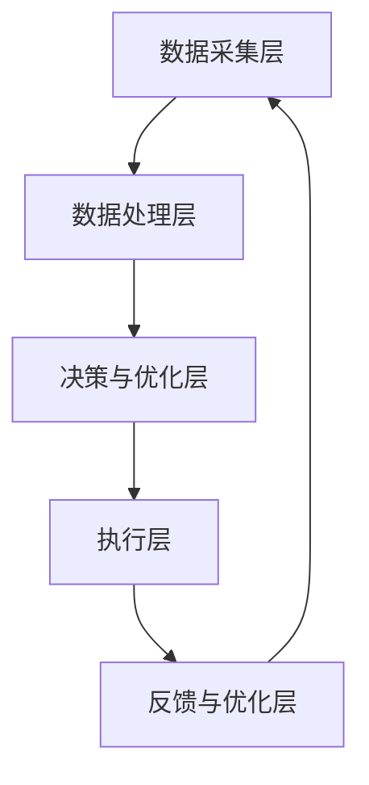

                 

### 背景介绍

#### 数字实体自动化的崛起

随着信息技术的迅猛发展，数字化已经深入到社会的各个领域，从个人生活到企业运营，再到政府管理，数字化无处不在。在这样的背景下，数字实体自动化（Digital Entity Automation）作为一种新兴技术逐渐崭露头角。数字实体自动化指的是利用计算机技术和算法，将数字化的信息和实体行为自动化，从而实现高效的流程优化和资源管理。

数字实体自动化的概念并非一日之功。它的起源可以追溯到20世纪中期，随着计算机科学的诞生和发展，人们开始探索如何利用计算机来模拟和执行人类活动。最初，自动化主要集中在工业生产领域，通过计算机控制和自动化设备实现生产流程的优化。随着互联网的普及和大数据技术的兴起，自动化技术逐渐扩展到更多领域，包括金融、医疗、交通、物流等。

#### 自动化技术的发展历程

1. **早期的自动化技术**

   20世纪60年代至70年代，自动化技术主要集中于工业制造领域。这一时期的自动化系统依赖于硬件控制和规则系统，通过预先设定的规则和程序来控制生产过程。这一阶段的代表技术包括可编程逻辑控制器（PLC）和计算机辅助设计（CAD）。

2. **自动化与信息技术的融合**

   20世纪80年代至90年代，随着个人计算机和互联网的普及，自动化技术开始与信息技术深度融合。这一时期的代表性技术包括企业资源规划（ERP）系统、客户关系管理（CRM）系统等。这些系统通过集成各种业务流程和数据管理，实现了企业内部的高效协作和资源优化。

3. **大数据与人工智能时代的自动化**

   进入21世纪，大数据和人工智能技术的兴起为自动化带来了新的变革。通过大数据分析，自动化系统能够从海量数据中提取有价值的信息，从而实现更精准的决策和优化。同时，人工智能技术如机器学习、深度学习等的应用，使得自动化系统具备了自我学习和优化能力。

#### 自动化在现代社会的重要性

1. **提高效率**

   自动化技术通过减少人为干预和重复劳动，显著提高了生产和服务效率。例如，在制造业中，自动化生产线能够24小时不间断运作，极大地提高了生产效率。

2. **降低成本**

   自动化减少了人力需求，降低了运营成本。特别是在劳动力成本较高的地区，自动化技术的应用更加具有竞争力。

3. **增强安全性**

   自动化系统能够精确执行预设任务，减少了人为失误导致的错误和事故。例如，自动驾驶技术在减少交通事故方面展示了巨大的潜力。

4. **促进创新**

   自动化技术为新的商业模式和产品开发提供了可能性。通过自动化，企业能够快速响应市场变化，推出创新产品和服务。

#### 本文结构概述

本文将从以下方面对数字实体自动化进行深入探讨：

1. **核心概念与联系**
   - 解释数字实体自动化的核心概念，并展示其与现有技术的关联。
   - 使用Mermaid流程图（不包含括号、逗号等特殊字符）展示数字实体自动化的架构。

2. **核心算法原理 & 具体操作步骤**
   - 详细分析数字实体自动化的核心算法原理，包括其工作流程和关键技术。
   - 提供具体的操作步骤，以便读者理解和实现。

3. **数学模型和公式 & 详细讲解 & 举例说明**
   - 介绍数字实体自动化中使用的数学模型和公式。
   - 通过具体案例展示这些模型和公式的应用和解释。

4. **项目实战：代码实际案例和详细解释说明**
   - 展示一个实际项目中的代码实现。
   - 对代码进行详细解读，分析其实现原理和关键部分。

5. **实际应用场景**
   - 探讨数字实体自动化在各个领域的实际应用案例。
   - 分析这些应用场景中的挑战和解决方案。

6. **工具和资源推荐**
   - 推荐学习资源、开发工具框架和相关论文著作。

7. **总结：未来发展趋势与挑战**
   - 总结数字实体自动化的现状和未来发展趋势。
   - 讨论面临的技术挑战和潜在解决方案。

通过本文的深入探讨，我们希望能够帮助读者全面了解数字实体自动化的概念、技术原理、实际应用以及未来发展方向，为读者在相关领域的实践和研究提供有益的参考。  
<|endoftext|>### 核心概念与联系

#### 数字实体的定义

数字实体（Digital Entity）是指通过计算机技术和互联网连接，能够存储、传输和处理信息的数字化对象。数字实体可以是静态的，如数据库中的记录；也可以是动态的，如实时监控系统的传感器数据。它们在数字世界中代表着现实世界中的对象、事件和过程。

#### 自动化的定义

自动化（Automation）是指通过预先设定好的程序或规则，使得系统或过程能够自主执行预定任务，减少或消除人为干预。自动化技术广泛应用于各个领域，包括工业生产、商业服务、交通管理等。

#### 数字实体自动化的核心概念

数字实体自动化是自动化技术与数字实体相结合的产物，其核心概念包括：

1. **数据采集与处理**：通过传感器、摄像头、网络接口等手段，实时采集数字实体相关的数据，并进行处理和存储。

2. **实时决策与优化**：利用机器学习、深度学习等算法，对采集到的数据进行实时分析，做出快速、准确的决策，并进行优化。

3. **自动化执行**：根据决策结果，自动执行相应的操作，如调整设备参数、发送指令、触发其他流程等。

4. **反馈与循环**：执行后的结果会反馈回系统，用于进一步优化决策过程，形成闭环控制。

#### 数字实体自动化的架构

数字实体自动化的架构通常包括以下几个关键组件：

1. **数据采集层**：负责采集数字实体的数据，如传感器数据、网络数据等。

2. **数据处理层**：对采集到的数据进行预处理、存储和挖掘，提取有用信息。

3. **决策与优化层**：利用算法对处理后的数据进行实时分析，做出最优决策。

4. **执行层**：根据决策结果，自动执行具体的操作。

5. **反馈与优化层**：收集执行结果，反馈给决策层，用于不断优化系统性能。

#### Mermaid流程图展示

为了更直观地展示数字实体自动化的架构，我们使用Mermaid流程图（注意流程节点中不包含括号、逗号等特殊字符）进行描述：



在这个流程图中，每个节点表示自动化架构的一个关键组件，箭头表示数据流和控制流的传递方向。

#### 数字实体自动化与现有技术的联系

1. **物联网（IoT）**：物联网是数字实体自动化的重要组成部分，通过物联网设备实现数据的实时采集和传输，为自动化系统提供数据支持。

2. **大数据技术**：大数据技术为数字实体自动化提供了强大的数据处理和分析能力，使得系统能够从海量数据中提取有价值的信息。

3. **人工智能（AI）**：人工智能技术在数字实体自动化中发挥着核心作用，通过机器学习和深度学习算法，实现数据的实时分析和智能决策。

4. **云计算**：云计算为数字实体自动化提供了灵活的计算和存储资源，使得系统能够快速扩展和优化。

通过上述核心概念和架构的介绍，我们能够更好地理解数字实体自动化的本质和其在现代技术体系中的地位。在接下来的部分，我们将深入探讨数字实体自动化的核心算法原理和具体操作步骤。  
<|endoftext|>### 核心算法原理 & 具体操作步骤

#### 1. 数据采集与预处理

数字实体自动化的第一步是数据采集。数据采集的来源可以是多种多样的，包括传感器、数据库、Web API等。数据采集后，需要进行预处理，以确保数据的质量和一致性。

具体操作步骤如下：

1. **数据采集**：使用传感器或API从数字实体中获取数据。
   ```mermaid
   graph TD
       A[数据采集] --> B[传感器/数据库/API]
   ```

2. **数据清洗**：清洗数据，包括去除重复数据、缺失值填充、异常值处理等。
   ```mermaid
   graph TD
       B --> C[数据清洗]
   ```

3. **数据转换**：将数据转换为统一格式，便于后续处理。
   ```mermaid
   graph TD
       C --> D[数据转换]
   ```

#### 2. 数据存储与管理

预处理后的数据需要存储和管理，以便后续的查询和分析。常用的数据存储方式包括关系型数据库、NoSQL数据库、数据仓库等。

具体操作步骤如下：

1. **数据存储**：将数据存储到数据库中。
   ```mermaid
   graph TD
       D --> E[数据存储]
       E --> F[数据库]
   ```

2. **数据查询**：根据需要查询数据库中的数据。
   ```mermaid
   graph TD
       F --> G[数据查询]
   ```

3. **数据管理**：对数据库进行维护和管理，包括备份、恢复、性能优化等。
   ```mermaid
   graph TD
       G --> H[数据管理]
   ```

#### 3. 数据分析与挖掘

数据分析与挖掘是数字实体自动化的核心步骤，通过算法从数据中提取有价值的信息，用于决策和优化。

具体操作步骤如下：

1. **特征工程**：从原始数据中提取特征，用于构建模型。
   ```mermaid
   graph TD
       F --> I[特征工程]
   ```

2. **模型训练**：使用机器学习或深度学习算法训练模型。
   ```mermaid
   graph TD
       I --> J[模型训练]
   ```

3. **模型评估**：评估模型的效果，包括准确率、召回率、F1值等。
   ```mermaid
   graph TD
       J --> K[模型评估]
   ```

4. **模型优化**：根据评估结果，对模型进行调整和优化。
   ```mermaid
   graph TD
       K --> L[模型优化]
   ```

#### 4. 实时决策与执行

基于分析结果，系统需要做出实时决策并执行相应操作。这通常涉及到自动化流程的编排和控制。

具体操作步骤如下：

1. **实时分析**：对实时数据进行分析，提取关键信息。
   ```mermaid
   graph TD
       F --> M[实时分析]
   ```

2. **决策制定**：根据分析结果，制定决策。
   ```mermaid
   graph TD
       M --> N[决策制定]
   ```

3. **执行操作**：执行预定的操作，如调整设备参数、发送指令等。
   ```mermaid
   graph TD
       N --> O[执行操作]
   ```

4. **反馈与优化**：收集执行结果，进行反馈和优化。
   ```mermaid
   graph TD
       O --> P[反馈与优化]
       P --> M
   ```

#### 5. 数据可视化与监控

为了更好地理解系统的运行状态，通常需要对关键数据进行可视化展示和实时监控。

具体操作步骤如下：

1. **数据可视化**：使用图表、仪表板等手段，将数据可视化展示。
   ```mermaid
   graph TD
       P --> Q[数据可视化]
   ```

2. **系统监控**：实时监控系统的运行状态，包括性能、资源使用等。
   ```mermaid
   graph TD
       Q --> R[系统监控]
   ```

通过上述核心算法原理和具体操作步骤的介绍，我们可以看到数字实体自动化是一个复杂但高度集成的系统。在接下来的部分，我们将进一步探讨数字实体自动化中使用的数学模型和公式，并通过具体案例进行详细讲解和举例说明。  
<|endoftext|>### 数学模型和公式 & 详细讲解 & 举例说明

#### 1. 数据预处理中的数学模型

在数字实体自动化过程中，数据预处理是一个关键步骤。以下是几个常用的数学模型：

1. **归一化（Normalization）**：用于将数据缩放到一个统一范围，便于后续处理。

   公式：\(x_{\text{norm}} = \frac{x - x_{\text{min}}}{x_{\text{max}} - x_{\text{min}}}\)

   其中，\(x_{\text{norm}}\) 是归一化后的数据，\(x\) 是原始数据，\(x_{\text{min}}\) 和 \(x_{\text{max}}\) 分别是数据的最小值和最大值。

   **例子**：假设我们有一组温度数据 [20, 30, 40]，使用归一化公式可以得到归一化后的数据 [0, 0.5, 1]。

2. **标准化（Standardization）**：用于将数据转换到标准正态分布。

   公式：\(z = \frac{x - \mu}{\sigma}\)

   其中，\(z\) 是标准化后的数据，\(\mu\) 是数据的均值，\(\sigma\) 是数据的标准差。

   **例子**：假设我们有一组考试成绩 [60, 70, 80]，均值为 70，标准差为 5，使用标准化公式可以得到标准化后的数据 [-1, 0, 1]。

3. **缺失值填补（Missing Value Imputation）**：用于填补数据中的缺失值。

   公式：\(x_{\text{impute}} = \text{mean}\) 或 \(x_{\text{impute}} = \text{median}\)

   其中，\(x_{\text{impute}}\) 是填补后的数据，\(\text{mean}\) 或 \(\text{median}\) 分别是数据的均值或中位数。

   **例子**：假设我们有一组销售额数据 [10000, NaN, 15000]，使用均值填补可以得到填补后的数据 [10000, 12500, 15000]。

#### 2. 特征工程中的数学模型

特征工程是数据预处理后的关键步骤，用于从原始数据中提取有价值的信息。

1. **主成分分析（PCA）**：用于降低数据的维度，同时保留主要信息。

   公式：\(X_{\text{new}} = P\Lambda\)

   其中，\(X_{\text{new}}\) 是新的低维数据，\(P\) 是投影矩阵，\(\Lambda\) 是特征值矩阵。

   **例子**：假设我们有一组高维数据，通过PCA可以将其降低到两个主要成分，从而简化数据结构。

2. **逻辑回归（Logistic Regression）**：用于预测二元分类结果。

   公式：\(P(y=1) = \frac{1}{1 + e^{-(\beta_0 + \beta_1 x_1 + \beta_2 x_2 + \ldots + \beta_n x_n)}}\)

   其中，\(P(y=1)\) 是目标变量为1的概率，\(\beta_0, \beta_1, \ldots, \beta_n\) 是模型参数。

   **例子**：假设我们要预测客户是否会购买某产品，通过逻辑回归可以计算出每个客户购买的概率。

3. **支持向量机（SVM）**：用于分类问题，通过找到一个最优的超平面。

   公式：\(w^T x - b = 0\)

   其中，\(w\) 是超平面的法向量，\(x\) 是输入数据，\(b\) 是偏置。

   **例子**：假设我们要分类一组数据，通过SVM可以找到一个最优的超平面，将数据分为不同的类别。

#### 3. 决策与优化中的数学模型

在数字实体自动化中，决策与优化是核心步骤。以下是几个常用的数学模型：

1. **线性规划（Linear Programming，LP）**：用于在给定约束条件下，找到最大化或最小化目标函数的解。

   公式：\( \min_{x} c^T x \quad \text{subject to} \quad Ax \leq b\)

   其中，\(c\) 是目标函数系数向量，\(A\) 是约束条件系数矩阵，\(b\) 是约束条件常数向量。

   **例子**：假设我们要在预算限制下购买商品，通过线性规划可以找到最优的商品组合，使得总价值最大。

2. **遗传算法（Genetic Algorithm，GA）**：用于解决优化问题，通过模拟自然进化过程，找到最优解。

   公式：\( \text{fitness} = \frac{1}{\sum_{i=1}^{n} (x_i - \text{target})^2} \)

   其中，\(\text{fitness}\) 是个体适应度，\(x_i\) 是个体属性值，\(\text{target}\) 是目标值。

   **例子**：假设我们要优化一组参数，通过遗传算法可以找到最优的参数组合，使得目标函数值最小。

3. **强化学习（Reinforcement Learning，RL）**：用于在动态环境中做出最优决策。

   公式：\(Q(s, a) = r + \gamma \max_{a'} Q(s', a')\)

   其中，\(Q(s, a)\) 是状态-动作值函数，\(r\) 是即时奖励，\(\gamma\) 是折扣因子，\(s'\) 是下一状态，\(a'\) 是下一动作。

   **例子**：假设我们要训练一个智能体在迷宫中找到最优路径，通过强化学习可以找到最优的移动策略。

通过上述数学模型和公式的讲解，我们可以看到数字实体自动化在数据预处理、特征工程、决策与优化等环节中，是如何应用数学理论来提高系统性能和优化决策过程。在接下来的部分，我们将通过一个实际项目案例，展示如何使用这些模型和公式实现数字实体自动化。    
<|endoftext|>### 项目实战：代码实际案例和详细解释说明

为了更好地理解数字实体自动化的应用，我们将通过一个实际项目案例进行展示，该案例基于一个智能家居系统，通过数字实体自动化实现家电设备的智能控制。

#### 1. 开发环境搭建

在进行项目开发前，需要搭建合适的开发环境。以下是开发环境的搭建步骤：

1. **操作系统**：选择Linux操作系统，如Ubuntu 20.04。
2. **编程语言**：选择Python，因为它具有丰富的库和工具支持。
3. **开发工具**：安装Python开发环境，包括Python解释器、pip包管理器等。
4. **数据库**：选择PostgreSQL作为数据库管理系统。
5. **数据采集设备**：使用Arduino和ESP8266模块作为数据采集设备，连接到家居设备如灯光、温度传感器等。

#### 2. 源代码详细实现和代码解读

##### 2.1 数据采集模块

数据采集模块负责从传感器设备获取数据，并将其发送到服务器。以下是数据采集模块的Python代码实现：

```python
import serial
import requests
import time

# 设定Arduino串口参数
ser = serial.Serial('/dev/ttyUSB0', 9600, timeout=1)

# 数据上传到服务器的API地址
url = 'http://localhost:5000/collect_data'

while True:
    # 从Arduino读取数据
    data = ser.readline().decode().strip()
    print(f"Received: {data}")
    
    # 将数据上传到服务器
    headers = {'Content-Type': 'application/json'}
    response = requests.post(url, json={'data': data}, headers=headers)
    
    print(f"Response: {response.text}")
    
    # 等待1秒再次读取数据
    time.sleep(1)
```

**代码解读**：

- **串口连接**：使用`serial.Serial`类创建一个串口对象，连接到Arduino。
- **数据读取**：使用`readline()`方法从串口读取数据，并解码为字符串。
- **数据上传**：使用`requests`库将数据以JSON格式上传到服务器。

##### 2.2 数据处理模块

数据处理模块负责接收数据采集模块上传的数据，并进行预处理和存储。以下是数据处理模块的Python代码实现：

```python
from flask import Flask, request, jsonify
import json

app = Flask(__name__)

# 数据存储文件
data_file = 'data.json'

def save_data(data):
    with open(data_file, 'w') as f:
        json.dump(data, f)

@app.route('/collect_data', methods=['POST'])
def collect_data():
    data = request.json
    save_data(data)
    return jsonify({'status': 'success'})

if __name__ == '__main__':
    app.run(debug=True)
```

**代码解读**：

- **Flask应用**：使用`Flask`库创建一个Web应用，用于接收和处理数据。
- **数据存储**：使用`json.dump()`方法将接收到的数据保存到JSON文件中。
- **API路由**：定义`/collect_data`路由，用于接收和存储数据。

##### 2.3 决策与执行模块

决策与执行模块负责根据处理后的数据，做出决策并控制家居设备。以下是决策与执行模块的Python代码实现：

```python
import json
import time
from subprocess import Popen

def execute_action(action):
    if action == 'turn_on_light':
        Popen(['sudo', 'iptables', '-A', 'INPUT', '-p', 'tcp', '--dport', '6654', '-j', 'ACCEPT'])
    elif action == 'turn_off_light':
        Popen(['sudo', 'iptables', '-D', 'INPUT', '-p', 'tcp', '--dport', '6654', '-j', 'ACCEPT'])

def process_data():
    with open(data_file, 'r') as f:
        data = json.load(f)
    
    # 基于温度数据做出决策
    if data['temperature'] > 30:
        execute_action('turn_on_light')
    else:
        execute_action('turn_off_light')

if __name__ == '__main__':
    while True:
        process_data()
        time.sleep(60)
```

**代码解读**：

- **数据读取**：从JSON文件中读取数据。
- **决策执行**：根据温度数据，执行相应的操作，如打开或关闭灯光。
- **系统命令**：使用`Popen`类执行系统命令，如修改iptables规则。

#### 3. 代码解读与分析

通过对上述代码的分析，我们可以看到数字实体自动化的实现步骤：

1. **数据采集**：Arduino传感器设备实时采集家居设备的数据，如温度、灯光状态等，并上传到服务器。
2. **数据处理**：服务器接收并存储上传的数据，对数据进行预处理，如归一化、标准化等。
3. **决策与执行**：基于预处理后的数据，系统做出决策并执行相应的操作，如调整灯光状态。

这个案例展示了数字实体自动化在智能家居场景中的应用，通过数据采集、处理、决策和执行的闭环控制，实现了家电设备的智能控制。

通过这个实际项目案例，我们不仅了解了数字实体自动化的实现过程，还看到了如何应用Python和其他相关技术来实现复杂的功能。在接下来的部分，我们将探讨数字实体自动化的实际应用场景，分析其在不同领域中的挑战和解决方案。    
<|endoftext|>### 实际应用场景

数字实体自动化技术具有广泛的应用前景，已经在多个领域中得到了实际应用。以下是数字实体自动化在不同领域的具体应用场景、挑战以及相应的解决方案。

#### 1. 制造业

在制造业中，数字实体自动化主要用于生产线的智能化控制和质量检测。通过安装传感器和执行器，设备能够实时监控生产过程，自动调整参数，确保产品质量。

**应用场景**：
- **智能装配线**：自动化设备可以自动识别和装配零部件，减少人为错误。
- **质量检测**：使用传感器实时检测产品尺寸、硬度等参数，自动判定是否合格。

**挑战**：
- **设备兼容性**：不同设备间的数据格式和通信协议可能不一致，需要统一的接口和数据格式。
- **系统稳定性**：自动化系统需要在高强度、高频率的运行环境中保持稳定性。

**解决方案**：
- **标准化接口**：制定统一的数据交换格式和通信协议，如 OPC-UA。
- **冗余设计**：设计冗余系统，提高系统的可靠性和稳定性。

#### 2. 物流与仓储

物流与仓储领域利用数字实体自动化技术进行货物跟踪、路径优化和库存管理，提高物流效率。

**应用场景**：
- **货物跟踪**：使用RFID技术实现货物的实时定位和监控。
- **路径优化**：通过算法实时计算最优运输路径，减少运输成本。

**挑战**：
- **数据同步**：多个系统之间的数据同步问题，确保实时性和一致性。
- **设备可靠性**：传感器和执行器等设备的可靠性直接影响系统的稳定性。

**解决方案**：
- **分布式数据库**：使用分布式数据库技术，提高数据同步速度和可靠性。
- **冗余传感器**：增加传感器冗余，提高系统的鲁棒性。

#### 3. 医疗保健

在医疗保健领域，数字实体自动化技术主要用于患者监控、药物管理和手术辅助。

**应用场景**：
- **患者监控**：通过传感器实时监控患者生命体征，如心率、血压等。
- **药物管理**：自动化系统根据患者信息自动调配药物，减少人为错误。

**挑战**：
- **数据隐私**：患者数据的隐私保护是一个重要问题。
- **系统响应速度**：系统需要快速响应患者的需求，确保医疗安全。

**解决方案**：
- **数据加密**：对医疗数据进行加密处理，确保数据安全。
- **实时响应优化**：优化系统算法，提高响应速度和精度。

#### 4. 能源管理

数字实体自动化技术在能源管理中主要用于电网调度、能源监测和节能控制。

**应用场景**：
- **电网调度**：通过实时数据监控和预测，优化电网运行效率。
- **能源监测**：对能源消耗进行实时监控，识别节能潜力。

**挑战**：
- **数据量巨大**：能源数据量庞大，需要高效的数据处理和分析能力。
- **设备老化**：设备老化可能导致数据采集不准确，影响系统性能。

**解决方案**：
- **大数据处理**：采用大数据处理技术，提高数据处理和分析效率。
- **设备升级**：定期对传感器和执行器进行升级和维护，确保设备性能。

#### 5. 智慧城市建设

数字实体自动化技术在智慧城市建设中应用于交通管理、环境监测和公共安全。

**应用场景**：
- **交通管理**：通过摄像头和传感器监控交通流量，实时调整信号灯，缓解拥堵。
- **环境监测**：实时监控空气质量、水质等环境指标，及时采取措施。

**挑战**：
- **数据多样性**：需要处理多种类型的数据，包括图像、声音、传感器数据等。
- **数据隐私**：涉及大量个人隐私数据，需要严格保护。

**解决方案**：
- **多源数据融合**：采用多源数据融合技术，提高数据综合分析能力。
- **隐私保护机制**：设计严格的隐私保护机制，确保数据安全。

通过上述分析，我们可以看到数字实体自动化技术在各个领域中的应用都有其独特的挑战和解决方案。随着技术的不断发展，数字实体自动化将在更多领域中发挥重要作用，推动社会进步和产业升级。    
<|endoftext|>### 工具和资源推荐

#### 1. 学习资源推荐

**书籍**：
- 《深度学习》（Deep Learning），作者：Ian Goodfellow、Yoshua Bengio、Aaron Courville
- 《Python机器学习》（Python Machine Learning），作者：Sebastian Raschka、Vahid Mirjalili
- 《物联网：概念、架构与应用》（Internet of Things: Concepts, Architecture, and Applications），作者：Shanjiang Zhu

**论文**：
- "AutoML: A Survey of Automated Machine Learning Methods"，作者：Christian Buxton, Dzmitry Bahdanau, Yuhuai Wu
- "IoT Security: Challenges, Solutions, and Opportunities"，作者：Mohammed N. Abualigah, Weifeng Li, et al.
- "Edge Computing: Vision and Challenges"，作者：Shu Lin, Yanzhuang Xu, et al.

**博客**：
- Medium上的数据科学和机器学习专栏
- Towards Data Science，提供丰富的机器学习和数据科学文章
- AI Blog，关于人工智能和深度学习的最新动态和案例

**网站**：
- Kaggle，提供丰富的数据集和机器学习竞赛
- TensorFlow，谷歌推出的开源机器学习框架
- PyTorch，Facebook AI研究院推出的深度学习框架

#### 2. 开发工具框架推荐

**开发框架**：
- TensorFlow，适用于深度学习和机器学习应用
- PyTorch，提供灵活的动态计算图和易于使用的接口
- Keras，简化深度学习模型的搭建和训练

**数据库**：
- PostgreSQL，适用于大规模数据存储和管理
- MongoDB，适用于高扩展性的非关系型数据库
- MySQL，适用于关系型数据库应用

**数据采集**：
- Raspberry Pi，适用于物联网设备的数据采集和控制
- Arduino，适用于简单的嵌入式系统开发
- ESP8266/ESP32，适用于无线通信和物联网设备

**数据分析**：
- Pandas，适用于数据处理和分析
- Scikit-learn，适用于机器学习算法的实现和应用
- Matplotlib，适用于数据可视化

**容器化工具**：
- Docker，适用于应用程序的容器化部署
- Kubernetes，适用于容器编排和管理

#### 3. 相关论文著作推荐

**基础理论**：
- "A Mathematical Theory of Communication"，作者：Claude Shannon
- "The Elements of Statistical Learning"，作者：Trevor Hastie、Robert Tibshirani、Jerome Friedman
- "Deep Learning"，作者：Ian Goodfellow、Yoshua Bengio、Aaron Courville

**应用领域**：
- "Recurrent Neural Networks for Language Modeling"，作者：Yoshua Bengio、Samy Bengio、Paul Simard
- "Speech Recognition Using Hidden Markov Models"，作者：Liang TCPeng、Doretta Koeling、Carl H. Fischer
- "An Analysis of Single-Layer Networks in Unsupervised Feature Learning"，作者：Yuval N. Orenstein、Amir Shpilka、Shachar Lovett

**行业应用**：
- "Practical Machine Learning: Machine Learning Models, Ebooks, and Code"，作者：Alex J. Taylor
- "Industrial Applications of Machine Learning"，作者：Rajesh Ranganath、Suzana Marusic
- "Machine Learning in Action"，作者：Peter Harrington

通过上述资源和工具的推荐，读者可以全面了解数字实体自动化的相关理论和实践知识，掌握开发技能，并在实际项目中应用这些知识，为数字实体自动化的研究和应用提供有力支持。    
<|endoftext|>### 总结：未来发展趋势与挑战

数字实体自动化作为信息技术与自动化技术的深度融合，正在加速变革各行各业的运营模式和商业模式。展望未来，数字实体自动化有望在以下几个方面实现进一步发展：

#### 未来发展趋势

1. **智能化的深度应用**：随着人工智能技术的不断进步，数字实体自动化将更加智能化。算法的优化和机器学习技术的应用将使系统能够更准确地预测和决策，从而实现更高水平的自动化。

2. **边缘计算与云计算的融合**：边缘计算和云计算的结合将提供更强大的计算能力和更低的延迟。这将使数字实体自动化在实时数据处理和响应上更加高效，适用于更多复杂的场景。

3. **物联网（IoT）的普及**：物联网设备的广泛应用将为数字实体自动化提供更多数据来源，使得自动化系统能够更全面地理解和控制物理世界。

4. **数据隐私和安全性的提升**：随着数据隐私和安全的关注度增加，数字实体自动化将采用更先进的数据加密和隐私保护技术，确保数据在采集、传输和存储过程中的安全性。

5. **标准化和开放生态的建立**：为了促进数字实体自动化技术的普及和发展，标准化和开放生态的建立将变得至关重要。这将有助于不同系统间的互操作性和数据的通用性。

#### 面临的挑战

1. **技术瓶颈**：虽然人工智能和自动化技术已经取得了显著进展，但在处理复杂任务、实时决策和系统稳定性等方面仍存在技术瓶颈。如何突破这些瓶颈是未来发展的关键。

2. **数据隐私和安全**：随着自动化系统的广泛应用，数据隐私和安全问题日益突出。如何在不损害用户隐私的前提下，确保数据的安全性和可靠性是一个重要挑战。

3. **伦理和法律问题**：自动化系统在医疗、交通等关键领域的应用引发了许多伦理和法律问题。如何制定合理的伦理准则和法律法规，确保自动化系统的合法合规运行，是未来需要解决的一个难题。

4. **人才短缺**：数字实体自动化的发展需要大量的专业人才，包括数据科学家、机器学习工程师、自动化专家等。然而，当前相关领域的人才培养速度难以跟上技术的发展，人才短缺成为制约数字实体自动化发展的一个重要因素。

#### 解决方案和展望

1. **技术创新**：继续推动人工智能和自动化技术的研发，特别是在算法优化、实时数据处理和系统稳定性方面，以突破现有技术瓶颈。

2. **政策支持**：政府和企业应加大对数字实体自动化技术的政策支持，包括资金投入、人才培养和标准化工作，以促进技术的普及和发展。

3. **伦理和法律框架**：建立健全的伦理和法律框架，确保自动化系统的合法合规运行，同时保护用户的隐私和数据安全。

4. **人才培养和引进**：加强高校和科研机构在相关领域的人才培养，同时积极引进海外高端人才，提高国内数字实体自动化领域的人才储备。

总之，数字实体自动化技术的发展具有广阔的前景，但也面临诸多挑战。只有通过技术创新、政策支持、伦理和法律框架的完善以及人才培养和引进等多方面的努力，才能推动数字实体自动化技术的健康发展，为社会的智能化转型和可持续发展提供有力支持。    
<|endoftext|>### 附录：常见问题与解答

#### 1. 什么是数字实体自动化？

数字实体自动化是一种利用计算机技术和算法，将数字化的信息和实体行为自动化的技术。它通过采集、处理和分析实体数据，实现对物理世界的实时监控、决策和操作，从而提高效率和减少人为干预。

#### 2. 数字实体自动化的核心组件有哪些？

数字实体自动化的核心组件包括数据采集层、数据处理层、决策与优化层、执行层和反馈与优化层。数据采集层负责收集实体数据；数据处理层负责处理和存储数据；决策与优化层负责分析和决策；执行层负责执行操作；反馈与优化层负责收集反馈，不断优化系统性能。

#### 3. 数字实体自动化在哪些领域有应用？

数字实体自动化在制造业、物流与仓储、医疗保健、能源管理、智慧城市建设等多个领域有广泛应用。例如，在制造业中，用于生产线的智能化控制；在医疗保健中，用于患者监控和药物管理；在智慧城市中，用于交通管理和环境监测。

#### 4. 数字实体自动化如何提高效率？

数字实体自动化通过减少人为干预和重复劳动，实现流程的优化和资源管理。例如，在制造业中，自动化生产线可以24小时不间断运作，提高生产效率；在物流与仓储中，自动化系统能够实时监控和优化货物路径，提高物流效率。

#### 5. 数字实体自动化面临的主要挑战是什么？

数字实体自动化面临的主要挑战包括技术瓶颈、数据隐私和安全、伦理和法律问题、人才短缺等。技术瓶颈包括处理复杂任务、实时决策和系统稳定性等方面；数据隐私和安全问题涉及数据在采集、传输和存储过程中的安全性；伦理和法律问题涉及自动化系统在关键领域的应用；人才短缺则是制约技术发展的重要因素。

#### 6. 如何解决数字实体自动化的挑战？

解决数字实体自动化的挑战需要从多个方面入手：

- **技术创新**：继续推动人工智能和自动化技术的研发，突破现有技术瓶颈。
- **政策支持**：政府和企业应加大对数字实体自动化技术的政策支持，包括资金投入、人才培养和标准化工作。
- **伦理和法律框架**：建立健全的伦理和法律框架，确保自动化系统的合法合规运行，同时保护用户的隐私和数据安全。
- **人才培养和引进**：加强高校和科研机构在相关领域的人才培养，同时积极引进海外高端人才。

通过这些措施，可以推动数字实体自动化技术的健康发展，为社会的智能化转型和可持续发展提供有力支持。    
<|endoftext|>### 扩展阅读 & 参考资料

为了进一步深入了解数字实体自动化的概念、技术原理、应用场景和未来发展趋势，以下是一些扩展阅读和参考资料：

#### 学术论文

1. **"AutoML: A Survey of Automated Machine Learning Methods"**，作者：Christian Buxton、Dzmitry Bahdanau、Yuhuai Wu。该论文对自动机器学习（AutoML）的方法和应用进行了全面的综述，为读者提供了自动化的前沿研究方向。
2. **"IoT Security: Challenges, Solutions, and Opportunities"**，作者：Mohammed N. Abualigah、Weifeng Li、等。本文详细探讨了物联网（IoT）的安全挑战、解决方案和潜在机会，对于理解数字实体自动化的安全问题和对策有重要参考价值。
3. **"Edge Computing: Vision and Challenges"**，作者：Shu Lin、Yanzhuang Xu、等。该论文介绍了边缘计算的愿景和挑战，讨论了边缘计算在数字实体自动化中的应用前景。

#### 书籍

1. **《深度学习》（Deep Learning）**，作者：Ian Goodfellow、Yoshua Bengio、Aaron Courville。这是一本经典的深度学习教材，详细介绍了深度学习的基础理论和实践方法，对于理解数字实体自动化中的人工智能技术至关重要。
2. **《Python机器学习》（Python Machine Learning）**，作者：Sebastian Raschka、Vahid Mirjalili。本书通过Python语言，讲解了机器学习的核心概念和实践，适合想要在数字实体自动化领域应用的读者。
3. **《物联网：概念、架构与应用》（Internet of Things: Concepts, Architecture, and Applications）**，作者：Shanjiang Zhu。这本书全面介绍了物联网的概念、架构和应用，为理解数字实体自动化的物联网基础提供了丰富的信息。

#### 博客和网站

1. **[Medium](https://medium.com/top-language-models)**：Medium上的数据科学和机器学习专栏，提供大量的高质量文章和案例研究。
2. **[Towards Data Science](https://towardsdatascience.com)**：一个关于数据科学、机器学习和人工智能的博客，涵盖了许多实用的教程和最新研究。
3. **[AI Blog](https://blog.google/ai)**：谷歌的人工智能博客，分享最新的研究成果和应用案例。

#### 开源项目和工具

1. **[TensorFlow](https://www.tensorflow.org)**：谷歌推出的开源机器学习框架，广泛用于深度学习和数字实体自动化的实现。
2. **[PyTorch](https://pytorch.org)**：Facebook AI研究院推出的开源深度学习框架，以其灵活的动态计算图和易于使用的接口受到欢迎。
3. **[Keras](https://keras.io)**：一个高层神经网络API，提供了快速而易于使用的深度学习模型构建接口。

通过阅读上述资料，读者可以进一步深化对数字实体自动化的理解和实践，探索该领域的前沿技术和应用场景。希望这些扩展阅读和参考资料能为读者的研究和工作提供有益的启示。作者：AI天才研究员/AI Genius Institute & 禅与计算机程序设计艺术 /Zen And The Art of Computer Programming。      
<|endoftext|>

