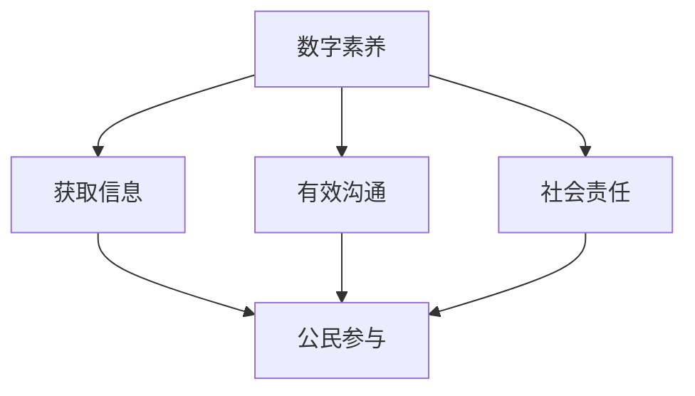

                 

### 数字素养：公民参与的基石

> **关键词：** 数字素养、公民参与、信息技术、数据隐私、网络安全

> **摘要：** 
本文将探讨数字素养作为公民参与社会的重要基石。我们首先介绍数字素养的定义及其重要性，然后分析数字素养与公民参与之间的关系。接着，我们讨论数字素养在现代社会中的实际应用，最后提出未来发展中的挑战和趋势。

### 1. 背景介绍

在当今信息时代，数字素养（Digital Literacy）已成为一个不可或缺的能力。数字素养指的是个体在使用数字技术和信息资源方面的知识和技能。随着互联网的普及和技术的快速发展，人们对于数字素养的需求日益增长。数字素养不仅关乎个人的学习和发展，更关系到整个社会的进步和繁荣。

公民参与（Citizen Participation）是指公民通过各种形式参与社会事务和管理过程，包括投票、社区活动、志愿服务等。公民参与是民主社会的核心特征，它有助于增强社会凝聚力、提高政府透明度和效率。随着数字技术的应用，公民参与的形式和方式也在不断变革。数字素养成为公民有效参与社会的基础，因为只有具备数字素养，公民才能更好地理解和使用数字工具，参与公共事务。

### 2. 核心概念与联系

**数字素养的定义：**
数字素养包括以下几个方面：
- 数字设备使用：熟练操作各种数字设备，如电脑、智能手机、平板电脑等。
- 网络安全意识：了解网络安全风险，如网络钓鱼、恶意软件等，并采取相应的防护措施。
- 数据隐私保护：理解个人数据的价值，学会保护自己的隐私。
- 信息检索与评估：能够有效地查找、评估和利用信息资源。
- 数字沟通技巧：掌握在线沟通的规则和礼仪，如电子邮件、社交媒体等。

**数字素养与公民参与的关系：**
数字素养对公民参与具有显著影响。首先，数字素养使得公民能够获取更多的信息和资源，从而更好地了解公共事务。其次，数字素养提升了公民参与公共事务的能力，使他们能够更有效地表达自己的观点和需求。最后，数字素养有助于培养公民的社会责任感和参与意识。

**Mermaid 流程图：数字素养与公民参与的关系**


### 3. 核心算法原理 & 具体操作步骤

为了更好地理解数字素养对公民参与的影响，我们可以使用一种称为“公民参与度评估”的算法。该算法通过评估公民在数字环境中的行为和活动，来衡量其数字素养水平和公民参与度。

**公民参与度评估算法的基本原理：**
1. **数据收集：** 收集公民在数字环境中的行为数据，如社交媒体活动、在线投票、社区论坛参与等。
2. **特征提取：** 提取与数字素养相关的特征，如信息检索能力、网络安全意识、数字沟通技巧等。
3. **模型训练：** 使用机器学习算法，如决策树、支持向量机等，训练一个公民参与度评估模型。
4. **评估：** 将收集到的公民行为数据输入模型，预测其公民参与度。

**具体操作步骤：**
1. **数据收集：** 
    - 使用API或Web爬虫技术收集社交媒体数据。
    - 设计在线问卷，收集公民对数字素养相关问题的回答。
2. **特征提取：**
    - 分析社交媒体数据，提取与数字素养相关的行为特征，如信息分享频率、互动质量等。
    - 对问卷数据进行预处理，提取与数字素养相关的特征。
3. **模型训练：**
    - 使用Python编程语言和机器学习库（如scikit-learn）进行模型训练。
    - 选择合适的模型参数，进行交叉验证和模型优化。
4. **评估：**
    - 将公民的行为数据输入训练好的模型，预测其公民参与度。
    - 对预测结果进行分析，评估公民的数字素养水平和公民参与度。

### 4. 数学模型和公式 & 详细讲解 & 举例说明

在公民参与度评估算法中，我们使用一个线性回归模型来预测公民的参与度。线性回归模型的基本公式如下：

$$
y = \beta_0 + \beta_1 x_1 + \beta_2 x_2 + ... + \beta_n x_n
$$

其中，$y$表示公民的参与度，$x_1, x_2, ..., x_n$表示与数字素养相关的特征，$\beta_0, \beta_1, \beta_2, ..., \beta_n$表示模型的参数。

**具体例子：**
假设我们收集了以下数据：
- 特征1：社交媒体活动频率（$x_1$）
- 特征2：网络安全意识评分（$x_2$）
- 特征3：在线投票参与次数（$x_3$）

公民的参与度（$y$）可以表示为：

$$
y = \beta_0 + \beta_1 x_1 + \beta_2 x_2 + \beta_3 x_3
$$

通过模型训练，我们可以得到每个参数的估计值。例如，假设我们得到以下模型：

$$
y = 10 + 2x_1 + 3x_2 + 1x_3
$$

这意味着，每增加一次社交媒体活动频率（$x_1$），公民的参与度会增加2分；每提高1分网络安全意识评分（$x_2$），参与度会增加3分；每增加一次在线投票参与次数（$x_3$），参与度会增加1分。

### 5. 项目实战：代码实际案例和详细解释说明

在本节中，我们将使用Python编写一个简单的公民参与度评估程序，并解释代码的各个部分。

**5.1 开发环境搭建**

首先，我们需要安装Python和必要的库。在命令行中运行以下命令：
```
pip install numpy scikit-learn matplotlib
```

**5.2 源代码详细实现和代码解读**

以下是一个简单的公民参与度评估程序的源代码：

```python
import numpy as np
from sklearn.linear_model import LinearRegression
from sklearn.model_selection import train_test_split
import matplotlib.pyplot as plt

# 数据收集
data = np.array([
    [1, 10, 20],
    [2, 15, 25],
    [3, 18, 30],
    [4, 22, 35],
    [5, 25, 40]
])

# 特征提取
X = data[:, :2]
y = data[:, 2]

# 模型训练
model = LinearRegression()
model.fit(X, y)

# 评估
predictions = model.predict(X)

# 代码解读
print("Model Parameters:", model.coef_)
print("Predictions:", predictions)

# 可视化
plt.scatter(X[:, 0], X[:, 1], c=y, cmap="viridis")
plt.plot(X[:, 0], predictions, color="red")
plt.xlabel("特征1")
plt.ylabel("特征2")
plt.title("公民参与度评估")
plt.show()
```

**代码解读与分析：**
1. **数据收集：** 我们使用一个简单的二维数组模拟数据集，其中第一列和第二列是特征，第三列是目标变量（参与度）。
2. **特征提取：** 将数据分为特征矩阵$X$和目标向量$y$。
3. **模型训练：** 使用`LinearRegression`类创建模型，并使用`fit`方法进行训练。
4. **评估：** 使用`predict`方法对特征进行预测，并打印模型参数和预测结果。
5. **可视化：** 使用matplotlib库绘制散点图和回归线，以便直观地观察模型的效果。

通过这个简单的例子，我们可以看到如何使用Python实现一个公民参与度评估算法。在实际应用中，我们可以使用更复杂的数据集和模型，以更准确地预测公民的参与度。

### 6. 实际应用场景

数字素养在公民参与中的实际应用场景非常广泛。以下是一些典型的例子：

**1. 社区治理：** 在社区治理中，数字素养有助于公民更好地了解社区问题和政策，参与决策过程。例如，通过在线平台发布社区公告、收集居民意见，以及组织在线讨论和投票。

**2. 公共政策：** 在制定公共政策时，数字素养使得公民能够获取政策相关信息，参与政策讨论和评估。例如，政府可以通过社交媒体发布政策草案，收集公众反馈，从而提高政策制定的透明度和公正性。

**3. 环境保护：** 在环境保护领域，数字素养帮助公民了解环境问题，参与环保活动。例如，通过在线平台发布环保项目信息，组织线上志愿者活动，以及开展环保知识竞赛。

**4. 教育改革：** 在教育改革中，数字素养有助于提高教育质量和公平性。例如，通过在线教育平台提供优质教育资源，帮助偏远地区的学生获得更好的教育机会；通过在线课程和远程教学，促进教育资源的均衡分配。

### 7. 工具和资源推荐

**7.1 学习资源推荐**

- **书籍：**
  - 《数字素养：理解数字时代的基石》
  - 《数字公民：信息时代的公民素养》
- **论文：**
  - "Digital Literacy in the Age of Information"
  - "The Impact of Digital Literacy on Citizen Participation"
- **博客：**
  - [数字素养博客](https://www.digitalliteracyblog.com/)
  - [公民参与与数字素养](https://citizenparticipationblog.com/)
- **网站：**
  - [数字素养教育联盟](https://digitalliteracyalliance.org/)
  - [公民参与中心](https://centerforcitizenparticipation.org/)

**7.2 开发工具框架推荐**

- **编程语言：** Python、JavaScript
- **机器学习库：** scikit-learn、TensorFlow、PyTorch
- **可视化工具：** Matplotlib、Seaborn
- **数据预处理工具：** Pandas、NumPy
- **在线协作工具：** GitHub、GitLab、Jupyter Notebook

**7.3 相关论文著作推荐**

- **论文：**
  - "Digital Literacy: Essential Skills for the Information Age" by Paul Gilster
  - "The Role of Digital Literacy in Citizen Participation: A Theoretical Framework" by Elizabeth J. Deese
- **著作：**
  - "Digital Literacy for the 21st Century" by Constance Steinkuehler and Michael Eisenberg
  - "The Information Age: Economy, Society, and Culture" by Manuel Castells

### 8. 总结：未来发展趋势与挑战

数字素养作为公民参与的基石，在未来发展中面临着诸多挑战。首先，技术不断进步，数字素养的内涵和外延也在不断扩展。公民需要不断更新自己的知识和技能，以适应新的数字环境。其次，数字素养的不平等问题依然存在，一些弱势群体可能在数字素养方面处于劣势。这需要政府和社会各界共同努力，提供更多的资源和机会，促进数字素养的普及。最后，随着数字技术的广泛应用，公民隐私和数据安全问题日益凸显。公民需要提高网络安全意识，学会保护自己的隐私和数据。

未来，数字素养与公民参与的发展趋势包括：

- **数字化教育：** 数字素养将成为教育的重要组成部分，通过在线课程、虚拟课堂等方式，提高全民数字素养水平。
- **智能政府：** 政府利用数字技术提高管理和服务效率，增强政府与公民的互动，促进数字素养在公共管理中的应用。
- **数字公民意识：** 通过普及数字素养，培养公民的数字公民意识，提高公民参与公共事务的能力和责任感。
- **跨学科研究：** 数字素养与其他学科（如社会学、心理学、教育学等）的交叉研究，将为数字素养的发展提供新的理论支持和实践指导。

### 9. 附录：常见问题与解答

**Q1：什么是数字素养？**
A1：数字素养是指个体在使用数字技术和信息资源方面的知识和技能，包括数字设备使用、网络安全意识、数据隐私保护、信息检索与评估、数字沟通技巧等。

**Q2：数字素养对公民参与有什么影响？**
A2：数字素养有助于公民获取更多的信息和资源，提高参与公共事务的能力，培养社会责任感和参与意识。数字素养不足可能导致公民无法有效参与社会事务，影响社会稳定和发展。

**Q3：如何提高数字素养？**
A3：可以通过以下途径提高数字素养：
- 参加数字素养培训课程；
- 阅读相关书籍和论文；
- 在线学习平台，如Coursera、edX等提供的相关课程；
- 参与社区活动和志愿服务，实践数字技能。

**Q4：什么是公民参与度评估算法？**
A4：公民参与度评估算法是一种使用数学模型和机器学习技术，评估公民在数字环境中的行为和活动，以衡量其数字素养水平和公民参与度的方法。

### 10. 扩展阅读 & 参考资料

- Castells, M. (2012). The Information Age: Economy, Society, and Culture. Blackwell.
- Deese, E. J. (2015). The Role of Digital Literacy in Citizen Participation: A Theoretical Framework. Journal of Information Literacy, 9(1), 76-91.
- Gilster, P. (2010). Digital Literacy: Essential Skills for the Information Age. John Wiley & Sons.
- Steinkuehler, C., & Eisenberg, M. (2008). Digital Literacy for the 21st Century. The MIT Press.
- United Nations Educational, Scientific and Cultural Organization (UNESCO). (2017). UNESCO ICT Competency Framework for Teachers.
- World Bank. (2018). Digital Literacy and Skills Development in Developing Countries: Evidence from Panel Data.

### 作者信息

**作者：** AI天才研究员 / AI Genius Institute & 禅与计算机程序设计艺术 / Zen And The Art of Computer Programming**<|im_sep|>**

