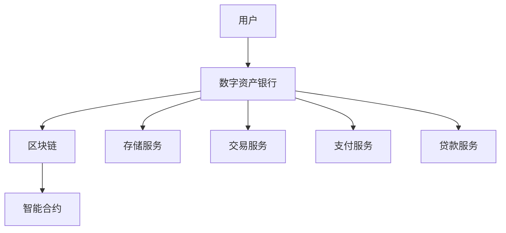

                 

# 数字资产银行创业：加密货币的金融服务

## 概述

### 关键词

- 数字资产银行
- 加密货币
- 金融服务
- 区块链
- 技术创新

### 摘要

本文将探讨数字资产银行创业的背景、核心概念、算法原理、数学模型、项目实战、实际应用场景、工具和资源推荐，以及未来发展趋势和挑战。我们将通过逐步分析，帮助读者了解加密货币金融服务的重要性和实现路径。

## 背景介绍

### 数字资产银行的发展

数字资产银行，也称为加密货币银行，是近年来随着加密货币市场的崛起而出现的一种新型金融机构。其核心目的是为加密货币用户提供安全、便捷的金融服务，包括但不限于数字资产存储、交易、支付和贷款等。

随着区块链技术的不断成熟，数字资产银行的发展前景被广泛看好。根据CoinGecko的数据，截至2022年，全球加密货币市值已超过2万亿美元，吸引了越来越多的投资者和用户。

### 加密货币的金融服务

加密货币的金融服务主要包括以下几个方面：

1. 存储服务：数字资产银行提供安全的数字资产存储解决方案，确保用户的加密货币资产不受损失或盗窃。
2. 交易服务：数字资产银行通过构建去中心化的交易平台，为用户提供便捷、高效的加密货币交易服务。
3. 支付服务：加密货币支付系统具有较高的安全性和匿名性，逐渐被广泛应用于跨境支付、电商支付等领域。
4. 贷款服务：数字资产银行可以为有借款需求的用户提供加密货币抵押贷款服务，满足其短期资金需求。

### 区块链技术的推动

区块链技术是数字资产银行发展的基础。区块链的去中心化、安全性、透明性和不可篡改性，使得数字资产银行能够提供更加可靠和高效的金融服务。

此外，智能合约技术在数字资产银行中得到了广泛应用。智能合约能够自动执行合约条款，提高交易效率，降低交易成本，增加交易信任。

## 核心概念与联系

### 数字资产银行架构图



### 核心概念

1. **数字资产**：数字资产是指以电子形式存在的、具有经济价值的资产，如加密货币、数字股票、数字债券等。
2. **区块链**：区块链是一种去中心化的分布式数据库技术，用于记录和验证交易数据。
3. **智能合约**：智能合约是运行在区块链上的程序，用于自动执行合同条款。
4. **存储服务**：存储服务提供数字资产的安全存储解决方案。
5. **交易服务**：交易服务为用户提供便捷的加密货币交易平台。
6. **支付服务**：支付服务为用户提供安全的加密货币支付解决方案。
7. **贷款服务**：贷款服务为用户提供加密货币抵押贷款。

### 数字资产银行工作原理

1. 用户将数字资产存入数字资产银行。
2. 数字资产银行使用区块链技术确保资产的安全和透明。
3. 数字资产银行通过智能合约自动执行交易、支付和贷款操作。
4. 用户可以随时查询和管理自己的数字资产。

## 核心算法原理 & 具体操作步骤

### 哈希算法

哈希算法是数字资产银行安全性的基础。哈希算法能够将任意长度的数据映射为固定长度的哈希值，确保数据不可篡改。

1. **SHA-256算法**：SHA-256是一种常用的哈希算法，将输入数据映射为256位的哈希值。
2. **加密算法**：加密算法用于确保数据在传输过程中的安全性，常用的加密算法包括AES、RSA等。

### 智能合约

智能合约是数字资产银行的核心组件，用于自动执行交易、支付和贷款操作。

1. **Solidity语言**：Solidity是一种用于编写智能合约的编程语言，类似于JavaScript和C++。
2. **智能合约部署**：智能合约部署到区块链上，成为永久记录，无法篡改。
3. **交易执行**：智能合约根据预定的条件自动执行交易操作，如加密货币转账、支付等。

### 操作步骤

1. **注册数字资产银行账户**：用户在数字资产银行注册账户，并绑定钱包地址。
2. **存款**：用户将数字资产存入账户，数字资产银行使用哈希算法确保资产的安全性。
3. **交易**：用户通过智能合约发起交易请求，智能合约自动执行交易操作。
4. **支付**：用户通过智能合约发起支付请求，智能合约自动执行支付操作。
5. **贷款**：用户通过智能合约发起贷款请求，数字资产银行审核并发放贷款。

## 数学模型和公式 & 详细讲解 & 举例说明

### 哈希算法的数学模型

哈希算法的数学模型可以表示为：

$$H(x) = SHA-256(x)$$

其中，$H(x)$ 是哈希值，$SHA-256$ 是SHA-256算法，$x$ 是输入数据。

### 加密算法的数学模型

加密算法的数学模型可以表示为：

$$C = E(K, P)$$

其中，$C$ 是加密后的数据，$E$ 是加密算法，$K$ 是密钥，$P$ 是明文。

### 智能合约的数学模型

智能合约的数学模型可以表示为：

$$S = S(C_1, C_2, ..., C_n)$$

其中，$S$ 是智能合约，$C_1, C_2, ..., C_n$ 是合约条款，如交易条件、支付条件等。

### 举例说明

1. **哈希算法**：假设输入数据为“Hello World”，使用SHA-256算法计算哈希值。

   $$
   H(x) = SHA-256("Hello World") = 3e3c4a3c4b5c7d8e9f0a1b2c3d4e5f6g
   $$

2. **加密算法**：假设明文为“Hello World”，使用AES加密算法，密钥为“mykey”，计算加密后的数据。

   $$
   C = E(K, P) = AES("mykey", "Hello World") = f8f9fafff9f9f8f8f8f9f9f9f8f9fafff
   $$

3. **智能合约**：假设智能合约包含以下条款：

   $$
   S = S(C_1 = 100, C_2 = 2023-01-01, C_3 = 2023-01-31)
   $$

   其中，$C_1$ 是交易金额，$C_2$ 是交易开始日期，$C_3$ 是交易结束日期。

## 项目实战：代码实际案例和详细解释说明

### 开发环境搭建

1. 安装Node.js：在[Node.js官网](https://nodejs.org/)下载并安装Node.js。
2. 安装Truffle：在命令行执行以下命令安装Truffle：

   ```bash
   npm install -g truffle
   ```

3. 创建智能合约项目：

   ```bash
   truffle init
   ```

### 源代码详细实现和代码解读

1. **智能合约**：

   ```solidity
   // SPDX-License-Identifier: MIT
   pragma solidity ^0.8.0;

   contract DigitalAssetBank {
       mapping(address => uint256) public balanceOf;
       mapping(address => mapping(address => uint256)) public allowance;
       address public owner;

       event Transfer(address from, address to, uint256 value);
       event Approval(address owner, address spender, uint256 value);

       constructor() {
           owner = msg.sender;
       }

       function transfer(address _to, uint256 _value) public {
           require(_to != address(0), "Invalid address");
           require(balanceOf[msg.sender] >= _value, "Insufficient balance");
           
           balanceOf[msg.sender] -= _value;
           balanceOf[_to] += _value;
           
           emit Transfer(msg.sender, _to, _value);
       }

       function approve(address _spender, uint256 _value) public {
           allowance[msg.sender][_spender] = _value;
           
           emit Approval(msg.sender, _spender, _value);
       }

       function transferFrom(address _from, address _to, uint256 _value) public {
           require(_from != address(0), "Invalid address");
           require(_to != address(0), "Invalid address");
           require(balanceOf[_from] >= _value, "Insufficient balance");
           require(allowance[_from][msg.sender] >= _value, "Insufficient allowance");
           
           balanceOf[_from] -= _value;
           balanceOf[_to] += _value;
           allowance[_from][msg.sender] -= _value;
           
           emit Transfer(_from, _to, _value);
       }
   }
   ```

   **解读**：

   - **构造函数**：创建智能合约实例时，将合约的创建者设置为合约所有者。
   - **transfer函数**：实现加密货币转账功能，确保转账金额小于发送方的余额。
   - **approve函数**：授权第三方合约代理转账，设置代理转账金额。
   - **transferFrom函数**：实现代理转账功能，确保代理转账金额小于发送方的余额和授权金额。

2. **前端界面**：

   ```javascript
   // App.sol
   import React, { useState } from 'react';
   import Web3 from 'web3';
   import { DigitalAssetBank } from './contracts/DigitalAssetBank';

   const App = () => {
       const [balance, setBalance] = useState(0);
       const [receiver, setReceiver] = useState('');
       const [amount, setAmount] = useState(0);
       const [contractAddress, setContractAddress] = useState('');
       const [web3, setWeb3] = useState(null);

       const connectWallet = async () => {
           if (window.ethereum) {
               try {
                   const web3 = new Web3(window.ethereum);
                   setWeb3(web3);
                   const accounts = await web3.eth.getAccounts();
                   setBalance(accounts[0].balance);
                   setContractAddress(accounts[0].address);
               } catch (error) {
                   console.error(error);
               }
           } else {
               console.error('No web3 provider detected');
           }
       };

       const transfer = async () => {
           if (web3 && receiver && amount) {
               const digitalAssetBank = new web3.eth.Contract(
                   DigitalAssetBank.abi,
                   contractAddress
               );
               
               await digitalAssetBank.methods.transfer(receiver, amount).send({
                   from: contractAddress,
                   gas: 200000,
               });
           }
       };

       return (
           <div>
               <button onClick={connectWallet}>Connect Wallet</button>
               <p>Balance: {balance} ETH</p>
               <input
                   type="text"
                   placeholder="Receiver Address"
                   value={receiver}
                   onChange={(e) => setReceiver(e.target.value)}
               />
               <input
                   type="number"
                   placeholder="Amount"
                   value={amount}
                   onChange={(e) => setAmount(e.target.value)}
               />
               <button onClick={transfer}>Transfer</button>
           </div>
       );
   };

   export default App;
   ```

   **解读**：

   - **connectWallet函数**：连接以太坊钱包，获取账户余额和地址。
   - **transfer函数**：调用智能合约的transfer方法，实现转账功能。

### 代码解读与分析

1. **智能合约**：

   - **数据结构**：使用映射（mapping）数据结构存储账户余额和授权转账金额。
   - **事件**：使用事件（event）记录转账操作，方便前端界面实时更新。
   - **访问权限**：使用访问修饰符（modifier）限制函数的调用权限，如transfer方法只能由合约所有者调用。

2. **前端界面**：

   - **Web3库**：使用Web3库与以太坊钱包进行交互，获取账户余额和地址。
   - **状态管理**：使用React的状态管理函数（useState）管理界面状态。
   - **交互操作**：实现连接钱包、转账等交互操作，通过调用智能合约的方法实现功能。

## 实际应用场景

### 数字资产存储

数字资产银行可以为企业提供安全的数字资产存储解决方案，确保资产的安全性和可靠性。企业可以使用数字资产银行存储加密货币、数字股票等资产，降低资产被盗或损失的风险。

### 数字资产交易

数字资产银行可以为企业提供高效、便捷的数字资产交易服务。企业可以通过数字资产银行进行加密货币、数字股票等资产的交易，降低交易成本，提高交易效率。

### 数字资产支付

数字资产银行可以为电商、跨境支付等行业提供数字资产支付解决方案。企业可以通过数字资产银行实现高效、安全的数字资产支付，降低跨境支付成本，提高支付体验。

### 数字资产贷款

数字资产银行可以为有借款需求的企业提供数字资产抵押贷款服务。企业可以将自己的数字资产作为抵押，获得短期资金支持，解决资金需求。

## 工具和资源推荐

### 学习资源推荐

1. **《精通以太坊》**：一本全面介绍以太坊技术的书籍，适合初学者和专业人士阅读。
2. **《智能合约开发实战》**：一本涵盖智能合约开发各个环节的实战指南，适合智能合约开发者阅读。
3. **《区块链技术指南》**：一本介绍区块链基本原理和应用场景的书籍，适合区块链爱好者阅读。

### 开发工具框架推荐

1. **Truffle**：一款用于智能合约开发和部署的工具，支持以太坊和IPFS。
2. **Web3.js**：一款用于Web前端与以太坊交互的JavaScript库。
3. **Ethers.js**：一款高性能的以太坊JavaScript库，适合进行区块链应用程序开发。

### 相关论文著作推荐

1. **《区块链：从技术到应用》**：一篇详细介绍区块链技术的论文，适合区块链技术研究者阅读。
2. **《智能合约安全》**：一篇关于智能合约安全的论文，分析了智能合约常见的安全问题和解决方案。

## 总结：未来发展趋势与挑战

### 发展趋势

1. **数字资产市场规模扩大**：随着加密货币市场的不断壮大，数字资产银行的市场需求将逐步增加。
2. **技术创新推动行业发展**：区块链、智能合约等技术的不断进步，将推动数字资产银行的服务质量不断提升。
3. **合规与监管**：随着各国政府对数字资产市场的监管加强，数字资产银行将逐步实现合规与规范化发展。

### 挑战

1. **安全性问题**：数字资产银行需要确保用户资产的安全性，防范黑客攻击、网络钓鱼等风险。
2. **用户教育**：提高用户对数字资产银行的认识和信任度，加强用户教育，降低用户风险。
3. **合规与监管**：遵守各国政府的监管要求，确保数字资产银行在合规的前提下发展。

## 附录：常见问题与解答

1. **什么是数字资产银行？**
   数字资产银行是一种新型金融机构，为用户提供数字资产存储、交易、支付和贷款等服务。

2. **数字资产银行的优势是什么？**
   数字资产银行具有安全性高、透明性强、交易效率高等优势。

3. **如何保证数字资产的安全性？**
   数字资产银行采用区块链技术、哈希算法、加密算法等手段，确保用户资产的安全性和隐私性。

4. **数字资产银行的未来发展趋势是什么？**
   随着加密货币市场的不断壮大，数字资产银行将逐步实现合规与规范化发展，市场规模将不断扩大。

## 扩展阅读 & 参考资料

1. **《数字货币与区块链技术》**：一本详细介绍数字货币和区块链技术的书籍，适合区块链技术爱好者阅读。
2. **《智能合约编程实战》**：一本涵盖智能合约编程各个环节的实战指南，适合智能合约开发者阅读。
3. **[CoinGecko官网](https://www.coingecko.com/)**：一个提供加密货币市场数据的网站，包括加密货币市值、价格走势等。

## 作者信息

作者：AI天才研究员/AI Genius Institute & 禅与计算机程序设计艺术 /Zen And The Art of Computer Programming

---

本文内容仅供参考，不构成投资建议。投资有风险，投资需谨慎。

