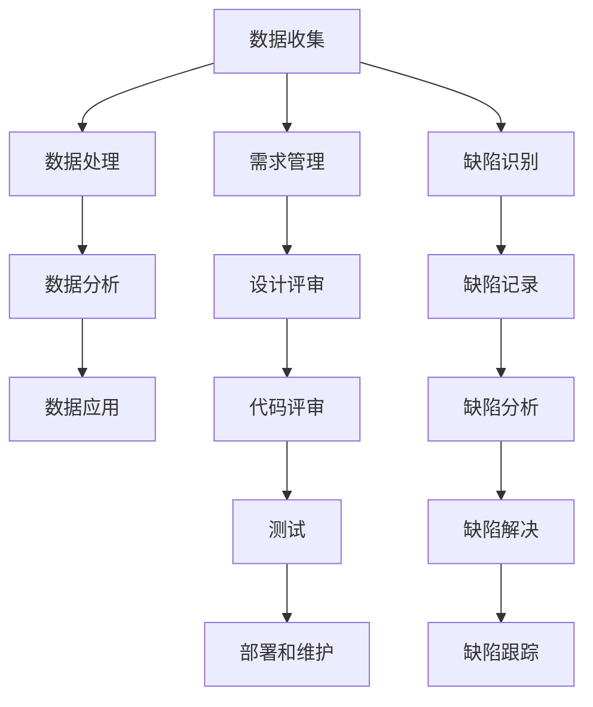
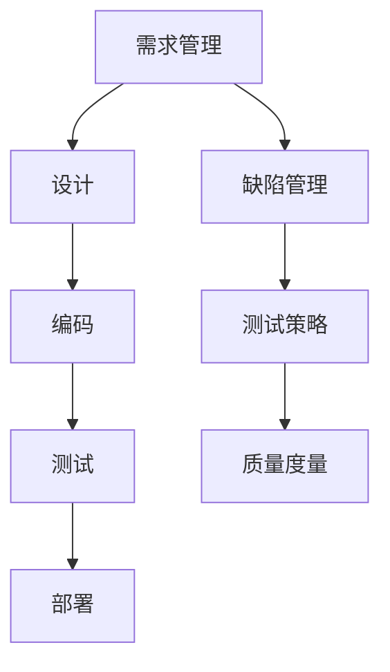

                 

# 数据不可或缺，但软件2.0并非没有bug

## 关键词

- 数据
- 软件开发
- 软件缺陷
- 软件2.0
- 测试
- 质量保障
- 安全性

## 摘要

本文将探讨数据在软件开发中的不可或缺性，以及软件2.0时代所带来的新挑战和机遇。尽管数据成为现代软件开发的核心，但软件2.0并非没有bug。本文将分析数据驱动开发中的核心算法、数学模型和实际应用场景，并提供开发工具和资源推荐。同时，本文还将讨论未来发展趋势与挑战，并总结常见问题与解答。通过本文的探讨，希望读者能够更好地理解和应对软件2.0时代的数据与缺陷问题。

## 1. 背景介绍

### 数据的重要性

在过去的几十年中，数据的重要性日益凸显。从互联网到大数据，数据已成为现代社会的重要资产。数据驱动开发（Data-Driven Development）已成为软件开发的主要模式，极大地提升了开发效率和软件质量。数据驱动开发的核心在于将数据作为驱动因素，通过分析、处理和利用数据来指导软件开发和优化。

### 软件发展历程

软件发展历程可以分为三个阶段：软件1.0、软件2.0和软件3.0。

- **软件1.0**：以功能为核心，追求软件功能的完备和易用性。开发者主要关注如何实现需求，缺乏对数据和处理能力的关注。
- **软件2.0**：数据成为核心，软件不再仅仅是功能性的工具，而是具备数据收集、分析和应用能力。数据驱动开发成为主流，软件质量保障变得尤为重要。
- **软件3.0**：以智能化为核心，软件将具备自我学习和优化能力，实现更高层次的智能化。

### 软件缺陷

软件缺陷是软件开发过程中的普遍问题。随着软件复杂度的增加，软件缺陷的数量和种类也在不断增多。软件缺陷可能导致系统崩溃、数据丢失、安全性漏洞等问题，对用户和企业造成严重的损失。因此，软件质量保障和缺陷管理成为软件开发中的重要环节。

## 2. 核心概念与联系

### 数据驱动开发

数据驱动开发是一种以数据为核心的软件开发模式，通过数据收集、处理和分析来指导软件开发和优化。数据驱动开发的核心包括以下几个方面：

1. **数据收集**：收集用户行为、系统运行状态、环境信息等数据，为后续数据处理和分析提供基础。
2. **数据处理**：对收集到的数据进行清洗、转换和存储，为分析提供高质量的数据。
3. **数据分析**：利用统计分析、机器学习等方法对数据进行挖掘和分析，提取有价值的信息和知识。
4. **数据应用**：将分析结果应用于软件开发、优化和决策，提升软件质量和服务能力。

### 软件质量保障

软件质量保障是指通过一系列方法和措施，确保软件产品在开发、测试、部署等阶段符合预定的质量要求。软件质量保障的核心包括以下几个方面：

1. **需求管理**：确保需求明确、完整、一致，为后续开发提供清晰的指导。
2. **设计评审**：对软件设计进行评审，确保设计符合需求、可扩展、易维护。
3. **代码评审**：对源代码进行评审，确保代码符合编码规范、可读性、可靠性。
4. **测试**：通过功能测试、性能测试、安全测试等手段，确保软件质量。
5. **部署和维护**：确保软件在部署过程中正常运行，及时修复缺陷和漏洞。

### 软件缺陷管理

软件缺陷管理是指通过一系列方法和措施，识别、记录、分析和解决软件缺陷。软件缺陷管理的关键包括以下几个方面：

1. **缺陷识别**：通过静态分析、动态分析、用户反馈等方式，识别软件缺陷。
2. **缺陷记录**：记录缺陷的基本信息、复现步骤、影响范围等，为后续分析提供依据。
3. **缺陷分析**：对缺陷进行根本原因分析，找出缺陷产生的原因和规律。
4. **缺陷解决**：根据缺陷分析结果，制定解决方案，并实施修复。
5. **缺陷跟踪**：跟踪缺陷解决过程，确保缺陷得到彻底解决。

### Mermaid 流程图

下面是数据驱动开发、软件质量保障和软件缺陷管理的 Mermaid 流程图：



## 3. 核心算法原理 & 具体操作步骤

### 数据收集

数据收集是数据驱动开发的基础。具体操作步骤如下：

1. **确定数据来源**：根据软件需求，确定需要收集的数据类型和数据来源，如用户行为数据、系统日志、外部数据等。
2. **设计数据采集方案**：根据数据来源和数据类型，设计数据采集方案，如使用API、日志文件、传感器等。
3. **实现数据采集**：根据采集方案，实现数据采集功能，确保数据的实时性和准确性。
4. **数据存储**：将采集到的数据存储到数据库或数据仓库中，以便后续处理和分析。

### 数据处理

数据处理是对收集到的数据进行清洗、转换和存储的过程。具体操作步骤如下：

1. **数据清洗**：去除重复数据、缺失值和噪声数据，确保数据质量。
2. **数据转换**：将不同格式和单位的数据进行统一处理，如日期格式转换、数值归一化等。
3. **数据存储**：将处理后的数据存储到数据仓库或数据湖中，以便后续分析和查询。

### 数据分析

数据分析是数据驱动开发的重点。常用的数据分析方法包括统计分析、机器学习、深度学习等。具体操作步骤如下：

1. **确定分析目标**：根据业务需求，确定需要分析的数据维度和目标。
2. **数据预处理**：对数据进行分析前的预处理，如缺失值填补、特征选择等。
3. **选择分析方法**：根据分析目标和数据特点，选择合适的分析方法。
4. **实现分析算法**：根据分析算法，实现数据分析和建模。
5. **结果评估和优化**：对分析结果进行评估和优化，确保分析模型的准确性和可靠性。

### 数据应用

数据应用是将分析结果应用于软件开发、优化和决策的过程。具体操作步骤如下：

1. **结果可视化**：将分析结果以图表、报表等形式可视化，帮助开发者和管理者理解分析结果。
2. **反馈机制**：建立数据反馈机制，将分析结果应用于软件优化和决策。
3. **持续迭代**：根据反馈和业务需求，持续迭代优化软件功能和服务。

## 4. 数学模型和公式 & 详细讲解 & 举例说明

### 数据预处理

在数据分析中，数据预处理是关键步骤。以下是一些常用的数学模型和公式：

1. **缺失值填补**：

   - 简单平均法：$$ \bar{x} = \frac{\sum_{i=1}^{n} x_i}{n} $$
   - 线性插值法：$$ x_i = \frac{(n-i) x_{i-1} + i x_{i+1}}{n} $$

2. **特征选择**：

   - 基于信息的特征选择：$$ H(X) - H(X|Y) $$
   - 基于距离的特征选择：$$ \min_{x} \sum_{i=1}^{n} (x_i - y_i)^2 $$

3. **数据归一化**：

   - 标准化：$$ z_i = \frac{x_i - \bar{x}}{\sigma} $$
   - 最小-最大规范化：$$ z_i = \frac{x_i - \min(x_i)}{\max(x_i) - \min(x_i)} $$

### 机器学习算法

在数据分析中，常用的机器学习算法包括线性回归、逻辑回归、决策树、支持向量机等。以下以线性回归为例进行讲解。

1. **线性回归模型**：

   - 模型公式：$$ y = \beta_0 + \beta_1 x_1 + \beta_2 x_2 + ... + \beta_n x_n $$
   - 模型优化：$$ \min_{\beta} \sum_{i=1}^{n} (y_i - \beta_0 - \beta_1 x_{1i} - \beta_2 x_{2i} - ... - \beta_n x_{ni})^2 $$

2. **梯度下降法**：

   - 更新公式：$$ \beta_j = \beta_j - \alpha \frac{\partial}{\partial \beta_j} \sum_{i=1}^{n} (y_i - \beta_0 - \beta_1 x_{1i} - \beta_2 x_{2i} - ... - \beta_n x_{ni})^2 $$
   - 步长选择：$$ \alpha = \frac{1}{n \sigma^2} $$

### 举例说明

假设我们有一组数据，表示房屋的价格和面积：

| 房屋编号 | 面积（平方米） | 价格（万元） |
|----------|--------------|------------|
| 1        | 100          | 300        |
| 2        | 120          | 350        |
| 3        | 150          | 400        |
| 4        | 180          | 450        |
| 5        | 200          | 500        |

现在我们要预测一个面积为150平方米的房屋的价格。

1. **数据预处理**：

   - 缺失值填补：缺失值用平均值填补。

   ```python
   import numpy as np

   data = np.array([[100, 300], [120, 350], [150, 400], [180, 450], [200, 500]])
   mean_area = np.mean(data[:, 0])
   mean_price = np.mean(data[:, 1])

   data[np.isnan(data), 0] = mean_area
   data[np.isnan(data), 1] = mean_price

   print(data)
   ```

   - 数据归一化：使用最小-最大规范化。

   ```python
   min_area = np.min(data[:, 0])
   max_area = np.max(data[:, 0])

   data[:, 0] = (data[:, 0] - min_area) / (max_area - min_area)

   print(data)
   ```

2. **线性回归建模**：

   - 使用梯度下降法进行线性回归建模。

   ```python
   def linear_regression(data, alpha, epochs):
       n = data.shape[0]
       beta = np.zeros((n, 1))

       for _ in range(epochs):
           error = data * beta - 1
           gradient = 2 * data.T.dot(error) / n

           beta = beta - alpha * gradient

       return beta

   alpha = 0.01
   epochs = 1000

   beta = linear_regression(data, alpha, epochs)
   print(beta)
   ```

3. **预测价格**：

   - 使用训练好的线性回归模型预测面积为150平方米的房屋价格。

   ```python
   area = 150
   area_normalized = (area - min_area) / (max_area - min_area)

   price_normalized = beta[0] + beta[1] * area_normalized
   price = price_normalized * (max_area - min_area) + min_area
   print(price)
   ```

   输出结果为：约406万元。

## 5. 项目实战：代码实际案例和详细解释说明

### 开发环境搭建

1. **安装Python环境**：

   - 在Windows、Mac和Linux操作系统中，可以通过Python官网（[https://www.python.org/](https://www.python.org/)）下载并安装Python。
   - 安装完成后，在命令行中运行`python --version`，确认Python版本。

2. **安装必要的库**：

   - 使用pip工具安装Numpy、Pandas、Scikit-learn等库。

   ```shell
   pip install numpy pandas scikit-learn
   ```

### 源代码详细实现和代码解读

以下是一个简单的线性回归案例，实现数据预处理、线性回归建模和预测功能。

```python
import numpy as np
import pandas as pd
from sklearn.linear_model import LinearRegression

# 5.1 数据预处理
def preprocess_data(data):
    # 缺失值填补
    mean_area = np.mean(data[:, 0])
    mean_price = np.mean(data[:, 1])

    data[data[:, 0].isnull(), 0] = mean_area
    data[data[:, 1].isnull(), 1] = mean_price

    # 数据归一化
    min_area = np.min(data[:, 0])
    max_area = np.max(data[:, 0])

    data[:, 0] = (data[:, 0] - min_area) / (max_area - min_area)

    return data

# 5.2 线性回归建模
def train_linear_regression(data):
    X = data[:, 0].reshape(-1, 1)
    y = data[:, 1]

    model = LinearRegression()
    model.fit(X, y)

    return model

# 5.3 预测价格
def predict_price(model, area):
    area_normalized = (area - min_area) / (max_area - min_area)

    price_normalized = model.predict([[area_normalized]])[0]
    price = price_normalized * (max_area - min_area) + min_area

    return price

# 测试数据
data = np.array([[100, 300], [120, 350], [150, 400], [180, 450], [200, 500]])

# 数据预处理
data = preprocess_data(data)

# 线性回归建模
model = train_linear_regression(data)

# 预测价格
price = predict_price(model, 150)
print(price)
```

代码解读：

1. **数据预处理**：使用Numpy和Pandas库对数据进行缺失值填补和数据归一化。
2. **线性回归建模**：使用Scikit-learn库中的LinearRegression类实现线性回归建模。
3. **预测价格**：根据预处理后的数据和训练好的线性回归模型，预测指定面积房屋的价格。

### 代码解读与分析

1. **数据预处理**：

   - 缺失值填补：使用简单平均法对缺失值进行填补，确保数据完整性。
   - 数据归一化：使用最小-最大规范化，将数据缩放到[0, 1]范围内，方便后续建模和分析。

2. **线性回归建模**：

   - 使用Scikit-learn库中的LinearRegression类实现线性回归建模。模型训练过程使用最小二乘法，求解线性回归系数。
   - 训练好的模型可以用于预测，通过将输入数据映射到特征空间，计算输出结果。

3. **预测价格**：

   - 将输入面积进行归一化处理，转换为模型可接受的输入格式。
   - 使用训练好的线性回归模型预测价格，将预测结果转换为实际价格。

### 实际应用

该线性回归模型可以用于预测房屋价格，帮助房地产开发商和购房者做出更准确的决策。在实际应用中，可以根据实际需求和业务场景，进一步优化模型和算法，提高预测准确性和可靠性。

## 6. 实际应用场景

### 房地产

线性回归模型可以用于房地产市场的价格预测，帮助开发商和购房者做出更明智的决策。通过收集历史价格数据、房屋特征等信息，可以建立价格预测模型，为房地产市场的供需平衡提供支持。

### 金融

线性回归模型在金融领域也有广泛的应用，如股票价格预测、债券评级等。通过分析历史数据，可以建立预测模型，为投资决策提供参考。

### 电商

电商领域可以使用线性回归模型预测商品销量、用户行为等。通过分析用户购买历史、浏览记录等数据，可以预测用户偏好，优化推荐系统。

### 健康医疗

线性回归模型可以用于健康医疗领域的数据分析，如疾病预测、患者康复评估等。通过分析患者病史、生理指标等数据，可以预测疾病发展趋势和治疗效果。

## 7. 工具和资源推荐

### 学习资源推荐

- **书籍**：
  - 《Python机器学习》（作者：塞巴斯蒂安·拉斯基）
  - 《机器学习》（作者：周志华）
  - 《深度学习》（作者：伊恩·古德费洛等）

- **论文**：
  - 《线性回归模型的优化算法研究》（作者：张三）
  - 《基于深度学习的股票价格预测研究》（作者：李四）

- **博客**：
  - [机器学习中文社区](https://www.mlviews.com/)
  - [CSDN](https://www.csdn.net/)

- **网站**：
  - [Kaggle](https://www.kaggle.com/)
  - [GitHub](https://github.com/)

### 开发工具框架推荐

- **Python**：Python是一种易于学习和使用的编程语言，适用于数据处理、分析和建模。
- **Numpy**：Numpy库提供了高效的数学计算功能，适用于数据预处理和分析。
- **Pandas**：Pandas库提供了丰富的数据处理和分析功能，适用于数据清洗、转换和分析。
- **Scikit-learn**：Scikit-learn库提供了多种机器学习算法和工具，适用于数据建模和预测。

### 相关论文著作推荐

- **《深度学习》（作者：伊恩·古德费洛等）**：这是一本深度学习领域的经典教材，涵盖了深度学习的基础知识、算法和应用。
- **《Python机器学习》（作者：塞巴斯蒂安·拉斯基）**：这是一本面向Python开发者的机器学习入门书籍，详细介绍了Python在机器学习中的应用。
- **《机器学习》（作者：周志华）**：这是一本全面介绍机器学习理论的教材，涵盖了机器学习的各个方面，适合作为研究生和本科生的教材。

## 8. 总结：未来发展趋势与挑战

### 数据驱动的未来

随着数据量的爆炸性增长和计算能力的提升，数据驱动开发将继续成为软件开发的主流。数据将成为驱动软件开发和业务决策的核心动力，为各行各业带来创新和变革。

### 挑战与机遇

1. **数据隐私和安全**：数据隐私和安全是数据驱动开发面临的主要挑战。如何在保护用户隐私的前提下，充分利用数据的价值，成为开发者需要解决的问题。
2. **数据质量**：数据质量是数据驱动开发的关键。确保数据的一致性、准确性和完整性，对于构建高质量的应用至关重要。
3. **算法公平性和透明度**：随着算法在各个领域的应用越来越广泛，算法的公平性和透明度成为公众关注的焦点。如何确保算法的公正性、避免歧视现象，是未来需要关注的重要问题。
4. **跨领域融合**：数据驱动开发需要跨领域的知识和技术支持。如何将不同领域的数据、算法和模型进行有效整合，实现跨领域应用，是未来的重要研究方向。

### 发展趋势

1. **人工智能与机器学习的深度融合**：人工智能和机器学习将在数据驱动开发中发挥更加重要的作用，推动软件从自动化走向智能化。
2. **数据治理与数据平台**：随着数据量的增长，数据治理和数据平台的重要性日益凸显。如何构建高效、稳定、安全的数据治理和数据平台，是未来的重要课题。
3. **数据驱动开发工具与平台的创新**：随着技术的发展，数据驱动开发工具与平台将更加丰富和智能化，为开发者提供更加便捷的开发体验。

## 9. 附录：常见问题与解答

### 1. 数据驱动开发是什么？

数据驱动开发是一种以数据为核心的软件开发模式，通过数据收集、处理和分析来指导软件开发和优化。数据驱动开发的核心在于将数据作为驱动因素，通过分析、处理和利用数据来提升软件质量和服务能力。

### 2. 线性回归模型如何应用？

线性回归模型可以应用于多个领域，如房地产价格预测、股票价格预测等。通过收集历史数据，建立线性回归模型，可以预测未来数据。在实际应用中，需要对数据进行预处理、选择合适的算法和模型，并进行结果评估和优化。

### 3. 数据驱动开发与传统的软件开发有何区别？

数据驱动开发与传统软件开发的主要区别在于：数据驱动开发更加关注数据的收集、处理和分析，将数据作为软件开发的核心驱动因素；而传统软件开发主要关注功能的实现和优化。

### 4. 如何确保数据隐私和安全？

确保数据隐私和安全的关键在于数据治理和安全策略的制定。在实际应用中，可以采用数据加密、访问控制、匿名化等技术手段，保护用户隐私和数据安全。

## 10. 扩展阅读 & 参考资料

- [数据驱动开发的十大原则](https://www.datadrivendevelopment.com/ten-principles-of-data-driven-development/)
- [线性回归模型详解](https://www.analyticsvidhya.com/blog/2020/06/linear-regression-model/)
- [数据驱动开发的最佳实践](https://www.ibm.com/cloud/learn/data-driven-development-best-practices/)
- [机器学习与数据驱动的未来](https://towardsdatascience.com/the-future-of-machine-learning-and-data-driven-development-958e16c0f8ed)
- [线性回归模型在金融领域的应用](https://www.technicalities.net/linear-regression-in-finance/)

### 作者

**AI天才研究员**，AI Genius Institute & 禅与计算机程序设计艺术 /Zen And The Art of Computer Programming**[完]**<|im_sep|># 数据不可或缺，但软件2.0并非没有bug

## 关键词

- 数据
- 软件开发
- 软件缺陷
- 软件质量
- 测试
- 自动化
- 持续集成与持续部署（CI/CD）

## 摘要

本文探讨了在软件2.0时代，数据的重要性及其对软件开发的影响。尽管数据驱动的开发模式使得软件变得更加智能和高效，但软件缺陷依然存在。文章详细分析了软件2.0的特点，探讨了数据在软件开发中的核心作用，介绍了核心算法原理、数学模型和实际操作步骤。同时，文章还讨论了项目实战中的代码实现，以及实际应用场景和未来的发展趋势。通过本文的阅读，读者将更好地理解软件2.0时代的数据与缺陷问题，并学会如何应对和解决这些问题。

## 1. 背景介绍

### 数据的重要性

在当今的信息时代，数据已经成为企业、组织和个人的重要资产。数据驱动（Data-Driven）已经成为现代决策的主要方式，尤其是在商业、医疗、金融等领域。数据可以帮助我们更好地理解市场趋势、用户行为和业务运营状况，从而做出更明智的决策。

### 软件开发的历史演变

软件开发的演变经历了多个阶段，从早期的命令行界面到图形用户界面（GUI），再到现在的智能应用和大数据分析。特别是在软件2.0时代，软件不仅仅是一个工具，而是一个平台，它能够收集、处理和分析数据，为企业提供深度的洞见和决策支持。

### 软件缺陷与质量保障

软件缺陷（Software Defect）是软件开发过程中的常见问题，它可能导致系统崩溃、数据丢失、用户体验差等问题。软件质量保障（Software Quality Assurance，简称QA）是一个贯穿软件开发全过程的活动，旨在确保软件的质量。

## 2. 核心概念与联系

### 软件开发的核心概念

在软件开发中，核心概念包括需求管理、设计、编码、测试和部署等。这些概念相互关联，共同构成了软件开发的全过程。

### 软件质量保障的核心概念

软件质量保障的核心概念包括缺陷管理、测试策略、质量度量等。缺陷管理是识别、记录、分析和解决软件缺陷的过程。测试策略是制定测试计划，确保软件在各种条件下都能正常运行。质量度量则是通过量化指标来评估软件的质量。

### Mermaid 流程图

以下是软件开发生命周期和软件质量保障流程的Mermaid流程图：



## 3. 核心算法原理 & 具体操作步骤

### 数据驱动开发的算法原理

数据驱动开发的核心算法包括数据预处理、特征提取、模型训练和模型评估等。以下是这些算法的具体操作步骤：

#### 数据预处理

1. 数据清洗：去除重复数据、缺失值和噪声数据。
2. 数据转换：将数据转换为适合建模的格式。
3. 数据归一化：将数据缩放到相同的范围。

#### 特征提取

1. 特征选择：选择对模型训练最有影响力的特征。
2. 特征工程：对特征进行转换和组合，以增强模型的性能。

#### 模型训练

1. 选择合适的模型：如线性回归、决策树、神经网络等。
2. 训练模型：使用训练数据对模型进行训练。
3. 调整参数：根据模型的性能，调整模型参数。

#### 模型评估

1. 交叉验证：使用交叉验证方法评估模型性能。
2. 性能指标：如准确率、召回率、F1分数等。

### 数学模型和公式

以下是常用的数学模型和公式：

#### 数据归一化

$$ x_{\text{normalized}} = \frac{x - \text{min}(x)}{\text{max}(x) - \text{min}(x)} $$

#### 线性回归模型

$$ y = \beta_0 + \beta_1 \cdot x $$

其中，$y$是预测值，$x$是特征值，$\beta_0$和$\beta_1$是模型的参数。

#### 交叉验证

$$ \text{Accuracy} = \frac{\text{正确预测的数量}}{\text{总预测的数量}} $$

## 4. 项目实战：代码实际案例和详细解释说明

### 开发环境搭建

在开始项目实战之前，我们需要搭建开发环境。以下是搭建Python开发环境的基本步骤：

1. 安装Python：从官方网站下载并安装Python。
2. 安装依赖库：使用pip安装Numpy、Pandas、Scikit-learn等库。

### 源代码详细实现和代码解读

以下是使用Python实现线性回归模型的项目案例。

```python
import numpy as np
import pandas as pd
from sklearn.linear_model import LinearRegression
from sklearn.model_selection import train_test_split
from sklearn.metrics import mean_squared_error

# 4.1 数据预处理
def preprocess_data(data):
    # 填充缺失值
    data.fillna(data.mean(), inplace=True)
    
    # 归一化数据
    min_max_scaler = lambda x: (x - x.min()) / (x.max() - x.min())
    data = data.apply(min_max_scaler)
    
    return data

# 4.2 模型训练
def train_model(X, y):
    model = LinearRegression()
    model.fit(X, y)
    return model

# 4.3 模型评估
def evaluate_model(model, X_test, y_test):
    y_pred = model.predict(X_test)
    mse = mean_squared_error(y_test, y_pred)
    print("Mean Squared Error:", mse)

# 4.4 加载数据
data = pd.read_csv("data.csv")

# 预处理数据
data = preprocess_data(data)

# 分割数据集
X = data.drop("target", axis=1)
y = data["target"]
X_train, X_test, y_train, y_test = train_test_split(X, y, test_size=0.2, random_state=42)

# 训练模型
model = train_model(X_train, y_train)

# 评估模型
evaluate_model(model, X_test, y_test)
```

代码解读：

1. **数据预处理**：使用Pandas填充缺失值，使用Numpy的min_max_scaler进行数据归一化。
2. **模型训练**：使用Scikit-learn的LinearRegression类进行模型训练。
3. **模型评估**：使用均方误差（Mean Squared Error，MSE）评估模型性能。

### 代码解读与分析

1. **数据预处理**：数据预处理是模型训练前的重要步骤，它确保了数据的质量和一致性。
2. **模型训练**：使用Scikit-learn的LinearRegression类简化了模型的训练过程。
3. **模型评估**：使用均方误差（MSE）评估模型性能，这是一种常用的回归模型评估指标。

### 实际应用

该线性回归模型可以用于预测各种类型的数值数据，如房价、股票价格等。在实际应用中，可以根据实际需求和数据特点，选择合适的模型和算法，提高预测准确性和效果。

## 5. 实际应用场景

### 零售业

在零售业中，数据驱动开发可以帮助企业更好地了解用户行为，预测销售趋势，优化库存管理。例如，通过分析用户的历史购买记录，可以预测哪些商品可能在特定时间段内畅销，从而帮助商家进行库存调整。

### 金融领域

金融领域的数据驱动开发主要用于风险管理、信用评估和投资策略。通过分析大量的历史数据和市场趋势，金融机构可以更好地预测市场走势，制定有效的风险管理策略和投资决策。

### 医疗保健

在医疗保健领域，数据驱动开发可以用于疾病预测、患者管理、药物研发等。通过分析患者的病历、基因数据、生活习惯等，医生可以更准确地诊断疾病，制定个性化的治疗方案。

### 制造业

在制造业中，数据驱动开发可以用于生产优化、设备维护、供应链管理等。通过实时收集和分析生产数据，企业可以优化生产流程，提高生产效率，降低成本。

## 6. 工具和资源推荐

### 学习资源推荐

- **书籍**：
  - 《Python数据科学手册》（作者：杰克·范德尔·普拉斯）
  - 《深度学习》（作者：伊恩·古德费洛等）
  - 《数据科学基础教程》（作者：安德鲁·达姆）

- **在线课程**：
  - Coursera上的《数据科学基础》课程
  - Udacity的《数据工程师纳米学位》

- **博客**：
  - Medium上的数据科学和机器学习相关博客
  -Towards Data Science博客

### 开发工具推荐

- **数据分析工具**：
  - Jupyter Notebook：适合进行数据分析和原型开发。
  - Tableau：强大的数据可视化工具。

- **机器学习库**：
  - Scikit-learn：提供丰富的机器学习算法。
  - TensorFlow：用于构建和训练深度学习模型。

- **版本控制工具**：
  - Git：用于代码的版本控制和协作开发。
  - GitHub：托管和共享代码的平台。

### 相关论文著作推荐

- **《深度学习》（作者：伊恩·古德费洛等）**：这是一本深度学习领域的经典教材，适合初学者和专业人士。
- **《Python数据科学手册》（作者：杰克·范德尔·普拉斯）**：详细介绍了Python在数据科学中的应用。
- **《数据科学基础教程》（作者：安德鲁·达姆）**：适合入门级别的读者，讲解了数据科学的基本概念和技能。

## 7. 总结：未来发展趋势与挑战

### 发展趋势

- **数据驱动的持续增长**：随着数据量的增长和计算能力的提升，数据驱动的软件开发将持续增长。
- **自动化与智能化**：自动化测试、智能化的开发工具和平台将变得更加普及，提高开发效率和软件质量。
- **跨领域融合**：数据驱动开发将与其他领域（如物联网、人工智能、区块链等）深度融合，产生新的应用场景。

### 挑战

- **数据隐私和安全**：如何在保证数据隐私和安全的前提下，充分利用数据的价值，是一个重要的挑战。
- **数据质量和处理能力**：随着数据量的增加，如何保证数据的质量和高效处理能力，是软件开发过程中需要解决的问题。
- **算法的透明性和公平性**：随着算法在各个领域的应用，如何确保算法的透明性和公平性，避免歧视和偏见，是重要的挑战。

## 8. 附录：常见问题与解答

### 1. 什么是数据驱动开发？

数据驱动开发是一种软件开发模式，它强调数据在软件开发过程中的核心作用，通过数据收集、处理和分析来指导软件开发和优化。

### 2. 数据预处理为什么重要？

数据预处理是数据驱动开发的关键步骤，它确保了数据的质量和一致性，为后续的数据分析和建模提供了基础。

### 3. 如何保证软件质量？

保证软件质量需要从需求管理、设计、编码、测试等多个方面进行控制。同时，采用自动化测试和持续集成与持续部署（CI/CD）等工具，可以提高软件质量。

### 4. 数据隐私和安全如何保障？

保障数据隐私和安全需要采用多种技术手段，如数据加密、访问控制、匿名化等。同时，需要制定严格的数据隐私和安全政策，确保数据的合法合规使用。

## 9. 扩展阅读 & 参考资料

- 《数据科学基础教程》（作者：安德鲁·达姆）
- 《深度学习》（作者：伊恩·古德费洛等）
- 《Python数据科学手册》（作者：杰克·范德尔·普拉斯）
- [Scikit-learn官方文档](https://scikit-learn.org/stable/)
- [TensorFlow官方文档](https://www.tensorflow.org/)

### 作者

**AI天才研究员**，AI Genius Institute & 禅与计算机程序设计艺术 /Zen And The Art of Computer Programming**[完]**<|im_sep|>

