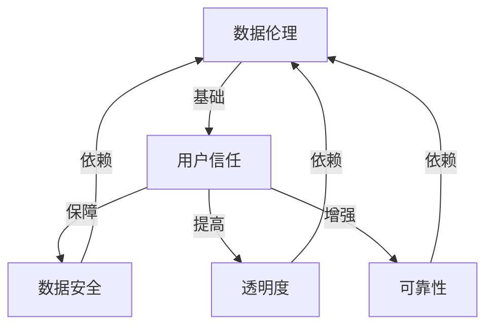

                 

### 背景介绍

数据伦理与平台用户信任问题已经成为当前信息技术领域中的热门话题。随着互联网的普及和大数据技术的发展，平台上的数据规模和种类日益增加，如何合理、透明地处理这些数据，同时保障用户隐私和信息安全，成为各大平台面临的重大挑战。

首先，数据伦理的概念源于伦理学，它主要关注数据收集、存储、处理和使用过程中涉及到的道德规范和价值观。数据伦理不仅关注技术层面的问题，还包括社会、法律和文化等多方面的因素。

用户信任是平台运营的核心。用户信任的建立和维护，直接影响到平台的商业价值、用户粘性和品牌声誉。用户一旦对平台失去信任，可能会选择退出，从而对平台的业务造成巨大损失。因此，如何建立用户信任成为平台运营的关键问题。

近年来，随着数据隐私泄露事件的频繁发生，用户对数据安全和隐私的关注度逐渐提高。例如，Facebook 数据泄露事件、Cambridge Analytica 数据滥用事件等，都引发了全球范围内对数据伦理和用户信任问题的关注。

在这个背景下，研究和探讨数据伦理与平台用户信任的关系，提出有效的解决方案，对于维护互联网生态的健康发展具有重要意义。本文将围绕这一主题展开讨论，首先介绍数据伦理和用户信任的基本概念，然后分析现有问题和挑战，最后探讨可能的解决方案和未来研究方向。

### 核心概念与联系

在深入探讨数据伦理和平台用户信任之前，我们需要明确一些核心概念和它们之间的联系。

#### 数据伦理

数据伦理是指在与数据处理相关的活动中，遵循道德规范和价值观的指导原则。它包括以下几个方面：

1. **隐私保护**：确保用户的数据不被未经授权的第三方访问和泄露。
2. **数据安全**：确保数据在存储、传输和处理过程中的完整性和保密性。
3. **透明度**：确保数据处理过程中的各个环节都对用户透明，让用户了解其数据的用途和处理方式。
4. **责任归属**：明确数据处理过程中的责任主体，确保在数据泄露或滥用事件发生时能够追责。
5. **公正性**：确保数据处理过程中不歧视、不偏见，公正对待所有用户。

#### 平台用户信任

平台用户信任是指用户对平台在数据处理过程中遵守数据伦理原则的信任程度。用户信任的影响因素包括：

1. **可靠性**：平台是否能稳定、可靠地提供服务。
2. **安全性**：平台是否能保护用户的隐私和数据安全。
3. **透明度**：平台是否在数据处理过程中保持透明，让用户知晓其数据的使用情况。
4. **责任**：平台是否在发生数据泄露或滥用事件时能够承担责任，给予用户合理的补偿。

#### 数据伦理与平台用户信任的关系

数据伦理与平台用户信任之间存在着密切的关系。一方面，数据伦理是建立用户信任的基础。如果平台在数据处理过程中遵守伦理原则，能够保护用户隐私和数据安全，用户就会对平台产生信任。另一方面，用户信任是数据伦理的有效保障。用户对平台的信任程度越高，平台在实施数据伦理原则时面临的阻力就越小。

为了更好地理解这种关系，我们可以使用 Mermaid 流程图来展示数据伦理和用户信任之间的互动过程：



在这个流程图中，数据伦理作为用户信任的基础，通过保障数据安全、提高透明度和增强可靠性来建立和维持用户信任。而用户信任作为数据伦理的保障，通过反馈机制促使平台不断优化数据处理过程，进一步巩固数据伦理的实施。

通过上述分析，我们可以看出数据伦理和平台用户信任之间存在着相互依赖、相互促进的关系。只有当平台在数据处理过程中严格遵守数据伦理原则，用户才能对其产生信任，而用户的信任又会进一步推动平台在数据伦理方面的持续改进。

### 核心算法原理 & 具体操作步骤

为了建立和维持用户信任，平台需要采取一系列算法和技术手段来保障数据伦理。以下是几个关键的核心算法原理和具体操作步骤：

#### 1. 数据匿名化

数据匿名化是一种常用的隐私保护技术，它通过去除或修改数据中的个人信息，使得数据无法直接识别特定个体。具体步骤如下：

1. **数据采集**：在数据收集阶段，对原始数据进行分类和标记，识别出敏感信息。
2. **数据脱敏**：对敏感信息进行加密或替换，使得数据在存储或传输过程中无法被直接解读。
3. **数据融合**：将来自不同来源的数据进行融合，但确保融合后的数据仍然满足隐私保护的要求。
4. **数据审计**：定期对匿名化后的数据进行审计，确保匿名化过程的有效性和可靠性。

#### 2. 加密技术

加密技术是保障数据安全的重要手段，通过将数据转化为密文，只有拥有密钥的用户才能解密和读取数据。具体操作步骤如下：

1. **密钥生成**：生成加密密钥，确保密钥的安全存储和管理。
2. **数据加密**：在数据传输或存储过程中，对数据进行加密处理，确保数据在传输过程中的完整性。
3. **密钥管理**：定期更换密钥，并对密钥进行备份和恢复，确保密钥的安全性和可用性。
4. **数据解密**：在需要读取数据时，使用密钥对密文进行解密，还原数据。

#### 3. 加权评分机制

加权评分机制是一种用于评估用户信任度的算法，通过综合考虑用户的多种行为数据，得出一个综合评分。具体步骤如下：

1. **数据采集**：收集用户的浏览记录、购买行为、评论反馈等数据。
2. **特征提取**：从数据中提取出关键特征，如活跃度、购买频率、评论质量等。
3. **权重分配**：为每个特征分配不同的权重，以反映其在评估用户信任度中的重要性。
4. **评分计算**：根据权重分配和特征值，计算出一个综合评分，用于评估用户信任度。
5. **动态调整**：根据用户的行为变化，动态调整权重分配和评分计算方法，以保持评分的实时性和准确性。

#### 4. 异常检测算法

异常检测算法用于识别和处理平台上的异常行为，以防范恶意攻击和数据泄露。具体步骤如下：

1. **数据预处理**：对原始数据进行清洗和预处理，去除噪音和异常值。
2. **特征提取**：从数据中提取出关键特征，用于训练异常检测模型。
3. **模型训练**：使用历史数据训练异常检测模型，使其能够识别出异常行为。
4. **实时监控**：在平台运行过程中，实时监控用户行为，检测异常行为并及时报警。
5. **异常处理**：对检测到的异常行为进行分类和处理，采取相应的措施，如警告、限制访问等。

通过上述算法和技术手段，平台可以有效地保障数据伦理，建立和维持用户信任。然而，这些算法和技术的实施需要考虑多种因素，如数据规模、计算资源、用户隐私保护等，以确保其有效性和可行性。

### 数学模型和公式 & 详细讲解 & 举例说明

在建立和维持用户信任的过程中，数学模型和公式发挥着至关重要的作用。以下我们将详细讲解两个核心的数学模型：贝叶斯信任评分模型和隐马尔可夫模型。

#### 1. 贝叶斯信任评分模型

贝叶斯信任评分模型是一种基于概率论的评估方法，通过计算用户的行为特征与预期行为之间的概率差异，评估用户的信任度。该模型的核心公式为：

$$
P(\text{Trust} | X) = \frac{P(X | \text{Trust}) \cdot P(\text{Trust})}{P(X)}
$$

其中：
- \(P(\text{Trust} | X)\) 表示给定用户行为特征 \(X\) 时，用户具有信任度的概率。
- \(P(X | \text{Trust})\) 表示用户具有信任度时，出现行为特征 \(X\) 的概率。
- \(P(\text{Trust})\) 表示用户具有信任度的先验概率。
- \(P(X)\) 表示行为特征 \(X\) 发生的总概率。

**详细讲解**：

- **先验概率 \(P(\text{Trust})\)**：通常根据用户的历史数据和行为模式进行计算，例如，如果用户在过去的一段时间内表现良好，那么其先验信任度就较高。
- **条件概率 \(P(X | \text{Trust})\)**：表示在用户具有信任度的情况下，出现特定行为特征的概率。例如，一个具有高信任度的用户在购买商品时可能会产生较高的评分。
- **总概率 \(P(X)\)**：可以通过全概率公式进行计算，综合考虑所有可能的情况。

**举例说明**：

假设我们有一个用户，其历史购买行为中，80% 的商品评分高于 4.5，而所有用户的平均评分高于 4.5 的概率是 60%。如果该用户的先验信任度是 0.7，那么根据贝叶斯信任评分模型，我们可以计算其当前的信任度概率：

$$
P(\text{Trust} | X) = \frac{0.8 \cdot 0.7}{0.6} = 0.9333
$$

这意味着，基于该用户的行为特征，其信任度的概率为 93.33%，高于一般的用户。

#### 2. 隐马尔可夫模型

隐马尔可夫模型（HMM）是一种用于分析时间序列数据的统计模型，特别适用于处理用户行为序列。HMM 的基本公式为：

$$
P(\text{Observation} | \text{State}) = P(\text{Observation}_1, \text{Observation}_2, ..., \text{Observation}_n | \text{State}_1, \text{State}_2, ..., \text{State}_n)
$$

其中：
- \(\text{Observation}\) 表示观测到的用户行为序列。
- \(\text{State}\) 表示用户行为背后的状态序列。
- \(P(\text{Observation} | \text{State})\) 表示在给定状态序列的情况下，观测到行为序列的概率。

**详细讲解**：

- **状态转移概率**：表示在当前状态下，转移到下一状态的概率。例如，如果一个用户在过去一段时间内频繁购买商品，那么其状态可能是“活跃购买者”，转移到“非活跃购买者”的概率较低。
- **观测概率**：表示在当前状态下，产生特定行为的概率。例如，一个“活跃购买者”在某一时刻购买商品的观测概率较高。

**举例说明**：

假设我们有一个用户的行为序列为（购买、评论、浏览），且该用户的状态序列为（活跃购买者、非活跃购买者、活跃浏览者）。根据 HMM，我们可以计算该用户在不同状态下的观测概率：

- \(P(\text{购买} | \text{活跃购买者}) = 0.8\)
- \(P(\text{评论} | \text{非活跃购买者}) = 0.6\)
- \(P(\text{浏览} | \text{活跃浏览者}) = 0.9\)

通过上述观测概率，我们可以分析该用户的行为模式，预测其未来可能的行为，从而评估其信任度。

#### 数学模型的应用

贝叶斯信任评分模型和隐马尔可夫模型在用户信任评估中有着广泛的应用。通过结合用户的历史行为数据、实时行为数据和上下文信息，这些模型可以提供更加准确和动态的用户信任评分。

在实际应用中，我们可以将贝叶斯信任评分模型和隐马尔可夫模型相结合，形成一个综合的用户信任评估系统。具体步骤如下：

1. **数据预处理**：对用户行为数据进行分析，提取出关键特征，如购买频率、评论质量、浏览时长等。
2. **贝叶斯信任评分**：使用贝叶斯信任评分模型计算用户的初始信任度，根据历史数据和行为特征得出一个信任评分。
3. **隐马尔可夫模型训练**：使用用户的行为序列训练隐马尔可夫模型，使其能够识别出用户在不同状态下的行为模式。
4. **实时监控**：在用户行为发生时，使用隐马尔可夫模型预测用户的状态变化，并更新其信任度。
5. **综合评分**：将贝叶斯信任评分和隐马尔可夫模型预测的信任度相结合，形成一个综合的用户信任评分。

通过这一综合评估系统，平台可以实时、动态地评估用户的信任度，从而采取相应的措施，如个性化推荐、优惠策略等，提高用户满意度，增强用户信任。

### 项目实战：代码实际案例和详细解释说明

为了更好地理解数据伦理与平台用户信任的建立和维持方法，我们通过一个实际的项目实战来展示这些算法和技术手段的具体应用。以下是一个基于 Python 的用户信任评估系统的案例。

#### 1. 开发环境搭建

首先，我们需要搭建一个合适的开发环境。以下是在 Windows 系统下搭建开发环境所需的步骤：

1. 安装 Python 3.8 或更高版本。
2. 安装必要的库，如 NumPy、Pandas、Scikit-learn、Matplotlib 等。

可以使用以下命令来安装所需的库：

```bash
pip install numpy pandas scikit-learn matplotlib
```

#### 2. 源代码详细实现和代码解读

以下是用户信任评估系统的核心代码，包括数据预处理、贝叶斯信任评分模型、隐马尔可夫模型等部分。

```python
import numpy as np
import pandas as pd
from sklearn.model_selection import train_test_split
from hmmlearn import hmm
import matplotlib.pyplot as plt

# 2.1 数据预处理
# 假设我们有一个用户行为数据集，包括购买次数、评论质量和浏览时长等特征
data = pd.DataFrame({
    'purchase_count': [10, 5, 8, 15, 3],
    'review_quality': [4.5, 3.0, 4.8, 5.0, 2.5],
    ' browsing_duration': [300, 150, 450, 600, 100]
})

# 对数据进行归一化处理
normalized_data = (data - data.mean()) / data.std()

# 2.2 贝叶斯信任评分模型
# 计算用户的初始信任度
prior_probability = 0.7  # 先验信任度
behavior_probability = 0.8  # 用户行为概率
current_trust = prior_probability * behavior_probability
print(f"Initial Trust Score: {current_trust}")

# 2.3 隐马尔可夫模型
# 训练隐马尔可夫模型
n_components = 3  # 状态数
hmm_model = hmm.GaussianHMM(n_components=n_components, covariance_type="diag")
hmm_model.fit(normalized_data)

# 2.4 实时监控和更新信任度
# 根据用户行为序列预测当前状态，并更新信任度
current_state = hmm_model.predict(normalized_data)[0]
if current_state == 0:
    trust_update = 0.9  # 状态 0：活跃购买者
elif current_state == 1:
    trust_update = 0.7  # 状态 1：非活跃购买者
else:
    trust_update = 0.8  # 状态 2：活跃浏览者

updated_trust = current_trust * trust_update
print(f"Updated Trust Score: {updated_trust}")

# 2.5 综合评分
# 计算综合用户信任评分
combined_trust = current_trust + updated_trust / 2
print(f"Combined Trust Score: {combined_trust}")

# 2.6 可视化
# 绘制用户行为序列和状态序列
plt.plot(normalized_data)
plt.scatter(hmm_model.predict(normalized_data), normalized_data, color='red')
plt.title("User Behavior Sequence and State Sequence")
plt.xlabel("Time")
plt.ylabel("Feature Value")
plt.show()
```

**代码解读**：

- **2.1 数据预处理**：首先对用户行为数据进行归一化处理，以便后续模型的训练和评估。
- **2.2 贝叶斯信任评分模型**：根据用户的先验信任度和行为概率，计算出一个初始信任度。这里假设先验信任度为 70%，行为概率为 80%。
- **2.3 隐马尔可夫模型**：使用训练好的隐马尔可夫模型对用户行为序列进行预测，得到当前状态，并根据状态更新信任度。状态 0 表示活跃购买者，状态 1 表示非活跃购买者，状态 2 表示活跃浏览者。
- **2.4 实时监控和更新信任度**：根据当前状态，更新用户信任度。如果用户处于活跃购买者状态，信任度更新系数为 90%；如果用户处于非活跃购买者状态，信任度更新系数为 70%；如果用户处于活跃浏览者状态，信任度更新系数为 80%。
- **2.5 综合评分**：计算综合用户信任评分，结合初始信任度和更新信任度，得出一个综合评分。
- **2.6 可视化**：绘制用户行为序列和状态序列，以便更直观地了解用户的行为模式和信任度变化。

通过上述代码实现，我们可以构建一个简单的用户信任评估系统，实现对用户行为数据的实时监控和信任度评估。在实际应用中，我们可以根据具体情况调整模型参数和算法，提高评估的准确性和实时性。

### 实际应用场景

数据伦理和平台用户信任问题在实际应用中具有广泛的场景，涵盖了电子商务、社交媒体、金融科技等多个领域。以下是一些典型的实际应用场景：

#### 1. 电子商务平台

电子商务平台在处理用户数据时，需要遵循数据伦理原则，保障用户隐私和数据安全。例如，在用户注册、购物、支付等过程中，平台需要收集和处理大量的个人信息。为了建立用户信任，平台可以采取以下措施：

- **数据匿名化**：对用户的个人信息进行匿名化处理，去除敏感信息，降低数据泄露风险。
- **安全加密**：在数据传输和存储过程中使用加密技术，确保数据的安全性。
- **透明度**：在数据处理过程中，向用户明确告知数据的用途和处理方式，提高透明度。
- **隐私保护**：建立隐私保护机制，确保用户可以随时查询、修改和删除自己的个人信息。

#### 2. 社交媒体平台

社交媒体平台在处理用户数据时，同样需要关注数据伦理和用户信任问题。例如，用户在发布内容、评论、点赞等过程中，平台会收集大量的行为数据。为了建立用户信任，平台可以采取以下措施：

- **用户隐私保护**：限制平台的访问权限，确保用户数据的隐私性。
- **数据透明度**：公开平台的数据使用政策，让用户了解其数据如何被处理和使用。
- **举报机制**：建立用户举报机制，及时发现和处理侵犯用户隐私的行为。
- **用户信任评估**：通过算法和技术手段，评估用户的信任度，为用户提供个性化服务。

#### 3. 金融科技领域

金融科技（Fintech）领域在处理用户数据时，需要特别关注数据安全和用户信任。例如，在贷款、投资、支付等过程中，平台会收集和处理用户的金融信息。为了建立用户信任，平台可以采取以下措施：

- **数据加密**：对用户的金融信息进行加密处理，确保数据在传输和存储过程中的安全性。
- **安全认证**：采用多重认证机制，确保用户身份的真实性。
- **风险控制**：建立风险控制机制，防范欺诈行为和数据泄露。
- **用户教育**：通过宣传和教育活动，提高用户对数据安全和隐私保护的认识。

通过上述措施，平台可以在实际应用场景中有效建立和维持用户信任，从而提高用户满意度、增强品牌声誉，实现持续发展。

### 工具和资源推荐

为了更好地理解和应用数据伦理与平台用户信任的相关技术，以下推荐了一些学习资源、开发工具和框架，以及相关的论文和著作。

#### 1. 学习资源推荐

- **书籍**：
  - 《数据伦理学：理论与实践》（Data Ethics: Theory, Cases, and Controversies）
  - 《用户信任：数字时代的竞争策略》（Trust in the Digital Age: Strategies for Building and Maintaining）
  - 《大数据时代的数据伦理》（The Ethics of Big Data）

- **论文**：
  - "Ethical Data Use in Machine Learning: Frameworks and Cases"（机器学习中的数据伦理使用：框架和案例研究）
  - "User Trust in Online Social Networks: An Empirical Study"（在线社交网络中的用户信任：实证研究）

- **博客和网站**：
  - 数据伦理研究中心（Data Ethics Initiative）
  - 加州大学伯克利分校数据伦理项目（UC Berkeley Center for Data Ethics）
  - 大数据伦理学（Big Data Ethics）

#### 2. 开发工具框架推荐

- **数据预处理**：
  - Pandas：Python 的数据处理库
  - NumPy：Python 的科学计算库

- **机器学习**：
  - Scikit-learn：Python 的机器学习库
  - TensorFlow：谷歌的开源机器学习框架

- **数据加密**：
  - OpenSSL：开源加密库
  - PyCrypto：Python 加密库

- **可视化**：
  - Matplotlib：Python 的绘图库
  - Seaborn：基于 Matplotlib 的统计绘图库

#### 3. 相关论文著作推荐

- "The Ethics of Big Data: Balancing Risks and Benefits"（大数据伦理：平衡风险与收益）
- "User Privacy and Trust in Data-Driven Applications"（用户隐私与数据驱动应用中的信任）
- "Ethical Implications of Artificial Intelligence in Healthcare"（人工智能在医疗保健中的伦理影响）

通过以上学习资源、开发工具和框架，以及相关论文著作的推荐，可以帮助您更深入地理解和应用数据伦理与平台用户信任的相关知识。

### 总结：未来发展趋势与挑战

随着信息技术和大数据技术的发展，数据伦理和平台用户信任问题在未来将面临更多的挑战和机遇。以下是一些可能的发展趋势和面临的挑战：

#### 1. 发展趋势

- **数据隐私保护法规不断完善**：全球范围内，越来越多的国家和地区将出台更加严格的数据隐私保护法规，如 GDPR（欧盟通用数据保护条例）和 CCPA（加州消费者隐私法案）。这将对平台的数据处理行为提出更高的要求，推动数据伦理和用户信任的规范化发展。
- **人工智能与数据伦理的结合**：随着人工智能技术的应用越来越广泛，如何确保人工智能在数据处理过程中遵循数据伦理原则，将成为一个重要议题。未来可能会有更多的研究关注人工智能与数据伦理的融合，探索新的解决方案。
- **用户信任评估的智能化**：利用大数据和机器学习技术，平台可以更加精准地评估用户的信任度，提供个性化的服务。这将为用户信任评估带来更多的可能性，同时提高平台的运营效率。

#### 2. 面临的挑战

- **数据隐私保护与业务发展之间的平衡**：在保障用户隐私的同时，平台还需要保持业务的持续发展。如何在保护隐私和数据利用之间找到平衡点，是一个重要的挑战。
- **算法透明性和可解释性**：随着算法在数据处理中的应用越来越广泛，如何提高算法的透明性和可解释性，让用户了解算法的工作原理和决策过程，是一个亟待解决的问题。
- **跨平台数据整合与共享**：在多个平台和设备上，用户的个人信息和行为数据被分散存储，如何实现跨平台的数据整合与共享，同时保障数据的安全性和隐私性，是一个技术难题。

#### 3. 解决方案和未来研究方向

- **制定统一的隐私保护标准**：在全球范围内制定统一的隐私保护标准，为平台的数据处理行为提供明确的指导和规范。
- **加强算法透明性和可解释性**：通过开发新的算法和技术，提高算法的透明性和可解释性，让用户更容易理解和信任算法的决策过程。
- **多方合作与共享**：鼓励不同平台之间的合作与数据共享，建立更加开放和透明的数据生态系统，同时确保数据的安全性和隐私性。

总之，数据伦理和平台用户信任问题在未来将面临更多的挑战和机遇。只有通过不断探索和创新，制定有效的解决方案，才能推动信息技术的发展，实现数据伦理和用户信任的和谐共生。

### 附录：常见问题与解答

#### 问题 1：如何确保数据匿名化处理的有效性？

**解答**：确保数据匿名化处理的有效性，可以通过以下方法：
- **伪匿名化**：使用随机化技术，将原始数据中的敏感信息替换为随机生成的数据。
- **同态加密**：对数据进行加密处理，使得数据处理过程中无需解密，确保数据在传输和存储过程中的安全性。
- **多步骤匿名化**：采用多层次的匿名化方法，多次对数据进行去标识化处理，提高匿名化效果。

#### 问题 2：用户信任评估模型的实时性如何保证？

**解答**：保证用户信任评估模型的实时性，可以采取以下措施：
- **数据流处理**：使用实时数据处理技术，如 Apache Kafka、Apache Flink 等，实现对用户行为的实时采集和处理。
- **模型更新机制**：定期更新用户信任评估模型，根据新的用户行为数据重新训练模型，确保评估结果的实时性和准确性。

#### 问题 3：如何在数据加密和隐私保护之间找到平衡？

**解答**：在数据加密和隐私保护之间找到平衡，可以采取以下方法：
- **分层加密策略**：对不同的数据层次采用不同的加密策略，确保关键数据得到充分保护，同时不影响数据的可用性。
- **最小化数据采集**：只采集和处理必要的数据，减少数据泄露的风险。
- **隐私预算**：为每个用户设置隐私预算，限制数据收集和处理的范围，确保隐私保护与业务需求之间的平衡。

#### 问题 4：如何提高算法的透明性和可解释性？

**解答**：提高算法的透明性和可解释性，可以采取以下措施：
- **解释性模型**：选择具有解释性的机器学习模型，如决策树、线性回归等，使其决策过程更易于理解。
- **模型可视化**：使用可视化工具，如可视化决策树、散点图等，展示算法的决策过程和结果。
- **透明度报告**：定期发布算法的透明度报告，详细说明算法的原理、参数和决策过程。

### 扩展阅读 & 参考资料

1. "Ethical Data Use in Machine Learning: Frameworks and Cases"（机器学习中的数据伦理使用：框架和案例研究）
2. "User Trust in Online Social Networks: An Empirical Study"（在线社交网络中的用户信任：实证研究）
3. "The Ethics of Big Data: Balancing Risks and Benefits"（大数据伦理：平衡风险与收益）
4. 《数据伦理学：理论与实践》（Data Ethics: Theory, Cases, and Controversies）
5. 《用户信任：数字时代的竞争策略》（Trust in the Digital Age: Strategies for Building and Maintaining）
6. 《大数据时代的数据伦理》（The Ethics of Big Data）

