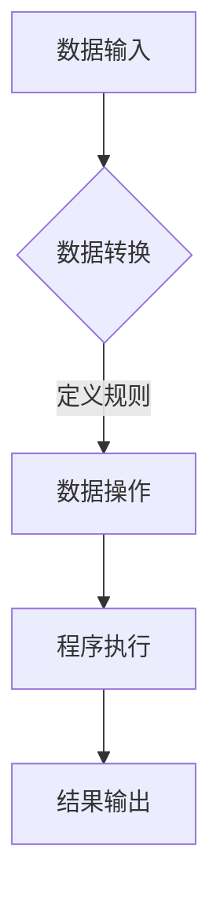

                 

### 背景介绍

在现代软件开发领域，数据的角色越来越重要。从早期简单的程序设计到如今复杂的应用系统，数据不仅是程序运行的基础，更是驱动决策和创新的核心。随着大数据、云计算、物联网等技术的蓬勃发展，数据的处理和利用已经成为软件开发的核心问题。

然而，传统的软件工程模式存在一些局限性。首先，软件系统往往需要大量的代码来描述和处理数据，这使得系统变得复杂且难以维护。其次，软件系统的开发周期长、成本高，而更新迭代速度却难以满足快速变化的市场需求。这些问题催生了对软件工程模式的新思考，从而引发了“软件2.0”这一概念的提出。

“软件2.0”是一种新的软件开发模式，它将数据视为与代码同等重要的组成部分，通过将数据与代码紧密结合，实现软件系统的动态化和智能化。这一模式的核心思想是“数据即代码”，即通过数据的表达和转换，实现程序的自动生成和动态调整。本文将深入探讨“数据即代码”的概念、原理、应用场景，以及其在实际项目中的实现方法。

### 核心概念与联系

#### 数据即代码的概念

“数据即代码”是“软件2.0”模式的核心概念。其基本思想是将数据视为一种可以编程和操作的资源，通过数据定义和操作规则，实现软件系统的自动化构建和运行。在这种模式下，数据不仅用于存储信息，更是程序逻辑的核心组成部分。

具体来说，数据即代码意味着：

1. **数据定义程序行为**：通过数据结构来定义程序的行为，而不是通过传统的代码逻辑。例如，数据模型可以定义数据库的操作方式，数据流可以定义程序的执行流程。

2. **数据驱动系统构建**：系统的构建和运行过程由数据驱动，而不是由代码驱动。这意味着系统可以根据新的数据输入自动调整和重构，从而实现动态化和智能化。

3. **数据与代码的融合**：在“数据即代码”模式下，数据与代码不再是分离的，而是紧密结合在一起。数据不仅可以通过代码进行操作，代码也可以通过数据实现复杂的功能。

#### 数据与代码的关系

在传统的软件开发模式中，数据与代码通常是分离的。数据存储在数据库或文件中，而程序代码负责操作这些数据。这种模式存在几个问题：

1. **数据冗余**：大量的数据需要通过代码来操作，导致数据与代码之间存在着冗余。这增加了系统的复杂度，也使得系统的维护变得更加困难。

2. **代码复杂度**：为了操作数据，程序代码需要处理各种复杂的情况，这使得代码变得复杂且难以维护。

3. **扩展性差**：传统的软件系统在应对新需求时，往往需要大量的代码修改和重构。这降低了系统的扩展性，也增加了开发成本。

而“数据即代码”模式通过将数据与代码紧密结合，解决了这些问题。数据不仅用于存储信息，还用于定义程序的行为和逻辑。这使得系统的构建和运行过程更加简单、高效和灵活。

#### 数据即代码的优势

1. **简化开发过程**：通过将数据与代码融合，开发者可以减少编写和维护代码的工作量，从而简化开发过程。

2. **提高系统灵活性**：系统可以根据新的数据输入自动调整和重构，从而提高系统的灵活性和适应性。

3. **降低开发成本**：通过减少代码的编写和维护工作量，降低系统的复杂度，从而降低开发成本。

4. **提升系统性能**：由于系统可以根据数据实时调整和优化，因此可以提升系统的性能和效率。

#### 数据即代码的应用场景

1. **自动化数据集成**：通过数据定义和转换规则，实现不同数据源之间的自动化集成和操作。

2. **智能数据驱动应用**：利用数据驱动技术，构建具有自适应和智能化的应用系统。

3. **动态业务流程管理**：通过数据定义业务流程，实现业务流程的自动化和智能化。

4. **实时数据流处理**：通过数据流驱动程序执行，实现实时数据处理和分析。

#### Mermaid 流程图

为了更直观地展示数据即代码的概念和原理，下面是一个简单的 Mermaid 流程图。



在这个流程图中，A 表示数据输入，B 表示数据转换（通过数据定义和规则），C 表示数据操作（根据数据规则执行操作），D 表示程序执行（根据数据操作结果执行程序），E 表示结果输出。

通过这个流程图，我们可以更清晰地理解数据即代码的基本原理和流程。

综上所述，“数据即代码”是一种全新的软件开发模式，它通过将数据与代码紧密结合，实现了软件系统的动态化和智能化。这种模式不仅简化了开发过程，提高了系统的灵活性，还降低了开发成本，提升了系统性能。随着技术的不断进步，数据即代码有望在更多领域得到广泛应用。

-------------------

## 3. 核心算法原理 & 具体操作步骤

在“数据即代码”模式下，核心算法原理是利用数据来定义和驱动程序逻辑。具体来说，这一算法涉及以下几个关键步骤：

### 数据定义

数据定义是“数据即代码”模式的基础。在这一步，我们需要明确系统的数据结构和数据类型。数据可以包括各种信息，如用户信息、产品信息、交易数据等。数据定义的目的是为后续的数据操作提供基础。

具体操作步骤如下：

1. **数据建模**：使用数据建模工具（如实体-关系图、类图等）来定义系统的数据结构。
2. **数据类型定义**：为每个数据项定义合适的类型，如整数、字符串、浮点数等。
3. **数据完整性约束**：定义数据之间的约束关系，确保数据的完整性和一致性。

### 数据转换

数据转换是“数据即代码”模式中的关键步骤。在这一步，我们将原始数据转换为适合程序操作的形式。数据转换可以通过多种方式实现，如映射、归一化、聚合等。

具体操作步骤如下：

1. **数据映射**：将原始数据映射到预定义的数据结构中。例如，将JSON格式的数据映射到Python对象。
2. **数据归一化**：将不同来源的数据归一化，使其具有相同的格式和单位。例如，将不同单位的价格统一为美元。
3. **数据聚合**：将多个数据源中的数据聚合在一起，形成新的数据视图。例如，将用户购买记录汇总为销售额统计。

### 数据操作

数据操作是“数据即代码”模式的核心。在这一步，我们根据数据定义和转换规则，对数据进行各种操作，如查询、更新、删除等。

具体操作步骤如下：

1. **数据查询**：根据数据定义，编写查询语句来检索所需数据。例如，使用SQL查询数据库中的用户信息。
2. **数据更新**：根据新的数据输入，更新系统中的数据。例如，更新用户账户余额。
3. **数据删除**：根据业务规则，删除不再需要的数据。例如，删除过期订单。

### 程序执行

在完成数据操作后，系统将根据数据操作结果执行相应的程序逻辑。这一步骤通常通过脚本或程序框架实现。

具体操作步骤如下：

1. **脚本编写**：编写脚本，定义数据操作和程序逻辑的执行顺序。例如，使用Python脚本处理用户购买数据。
2. **程序框架调用**：使用程序框架（如Spring Boot、Django等）来管理数据操作和程序逻辑的执行。例如，使用Spring Boot框架来构建电商平台。

### 结果输出

最后，系统将执行结果输出给用户或存储在数据库中。这一步骤确保了数据操作和程序执行的结果可以被有效利用。

具体操作步骤如下：

1. **输出数据**：将程序执行结果以数据形式输出，如JSON、XML等。例如，输出用户购买记录。
2. **数据库存储**：将结果数据存储在数据库中，以备后续使用。例如，将用户购买记录存储在MySQL数据库中。

通过以上几个步骤，我们可以实现“数据即代码”模式的基本操作流程。这种模式不仅简化了软件开发过程，还提高了系统的灵活性和扩展性。

-------------------

## 4. 数学模型和公式 & 详细讲解 & 举例说明

在“数据即代码”模式中，数学模型和公式扮演着重要的角色。它们不仅用于描述数据的关系和转换规则，还用于优化和评估系统的性能。以下将详细讲解几个关键的数学模型和公式，并通过具体例子进行说明。

### 数据分布模型

数据分布模型用于描述数据的分布特征，常见的有正态分布、泊松分布、二项分布等。这些模型有助于我们理解数据的基本特性，并在数据转换和操作过程中进行适当的处理。

- **正态分布（Normal Distribution）**

正态分布是一种最常见的概率分布模型，其概率密度函数为：

$$
f(x|\mu, \sigma^2) = \frac{1}{\sqrt{2\pi\sigma^2}} e^{-\frac{(x-\mu)^2}{2\sigma^2}}
$$

其中，\( \mu \) 是均值，\( \sigma^2 \) 是方差。正态分布广泛应用于统计分析和数据拟合。

**例子**：假设一个随机变量 \( X \) 服从正态分布 \( N(100, 25) \)，求 \( P(X > 110) \)。

解：

$$
P(X > 110) = 1 - P(X \leq 110) = 1 - \Phi\left(\frac{110-100}{5}\right) = 1 - \Phi(2) = 0.0228
$$

其中，\( \Phi \) 是标准正态分布的累积分布函数。

- **泊松分布（Poisson Distribution）**

泊松分布用于描述在一定时间内发生某一事件的次数，其概率质量函数为：

$$
P(X = k) = \frac{\lambda^k e^{-\lambda}}{k!}
$$

其中，\( \lambda \) 是事件发生的平均频率。泊松分布广泛应用于事件计数和过程监控。

**例子**：假设在1小时内某个网站的平均点击量为 \( \lambda = 5 \)，求在1小时内点击量大于3的概率。

解：

$$
P(X > 3) = 1 - P(X \leq 3) = 1 - \sum_{k=0}^{3} \frac{5^k e^{-5}}{k!} \approx 0.5546
$$

- **二项分布（Binomial Distribution）**

二项分布用于描述多次独立试验中成功次数的概率分布，其概率质量函数为：

$$
P(X = k) = C_n^k p^k (1-p)^{n-k}
$$

其中，\( n \) 是试验次数，\( p \) 是单次试验成功的概率。二项分布广泛应用于概率论和统计分析。

**例子**：假设在一次选举中有10个选民，每个选民投票给A的概率为0.4，求至少有6个选民投票给A的概率。

解：

$$
P(X \geq 6) = \sum_{k=6}^{10} C_{10}^k 0.4^k (1-0.4)^{10-k} \approx 0.9998
$$

### 数据转换公式

数据转换过程中，常用的公式包括映射公式、归一化公式和聚合公式等。以下是一些常见的数据转换公式：

- **数据映射公式**

$$
y = f(x)
$$

其中，\( x \) 是原始数据，\( y \) 是映射后的数据，\( f \) 是映射函数。例如，将摄氏度转换为华氏度可以使用以下公式：

$$
F = \frac{9}{5}C + 32
$$

- **数据归一化公式**

$$
y = \frac{x - x_{\min}}{x_{\max} - x_{\min}}
$$

其中，\( x_{\min} \) 和 \( x_{\max} \) 分别是数据的最小值和最大值，\( y \) 是归一化后的数据。例如，将身高数据归一化到0到1之间：

$$
y = \frac{x - 150}{200 - 150}
$$

- **数据聚合公式**

$$
y = \sum_{i=1}^{n} x_i
$$

或

$$
y = \frac{1}{n} \sum_{i=1}^{n} x_i
$$

其中，\( x_i \) 是每个数据项，\( y \) 是聚合后的结果。例如，计算一组数据的总和或平均值：

$$
\sum_{i=1}^{5} x_i = 10 + 20 + 30 + 40 + 50 = 150
$$

或

$$
\frac{1}{5} \sum_{i=1}^{5} x_i = \frac{150}{5} = 30
$$

通过这些数学模型和公式，我们可以对数据进行有效的处理和分析，从而实现“数据即代码”模式的核心目标。这些模型和公式不仅提升了系统的灵活性和性能，还为数据驱动的软件系统提供了坚实的理论基础。

-------------------

## 5. 项目实战：代码实际案例和详细解释说明

为了更好地理解“数据即代码”模式在实际项目中的应用，下面我们将通过一个简单的例子来展示如何在项目中实现这一模式。这个例子将涉及数据定义、数据转换、数据操作以及程序执行的整个流程。

### 项目背景

假设我们正在开发一个电商平台，需要处理用户的购买数据。用户每次购买商品时，都会生成一条购买记录，包括用户ID、商品ID、购买数量和购买时间等信息。我们需要根据这些数据实现以下几个功能：

1. 计算每个商品的销售额。
2. 根据用户的购买记录推荐商品。
3. 按时间段统计销售数据。

### 数据定义

首先，我们需要定义系统的数据结构。以下是几个关键数据模型：

1. **用户（User）**
   - 用户ID（UserID）：唯一标识用户
   - 用户名（Username）：用户的登录名
   - 购买记录（PurchaseRecords）：用户的历史购买记录

2. **商品（Product）**
   - 商品ID（ProductID）：唯一标识商品
   - 商品名称（ProductName）：商品的名称
   - 商品价格（Price）：商品的价格

3. **购买记录（PurchaseRecord）**
   - 购买记录ID（PurchaseID）：唯一标识购买记录
   - 用户ID（UserID）：购买记录对应的用户
   - 商品ID（ProductID）：购买记录对应的商品
   - 购买数量（Quantity）：购买的数量
   - 购买时间（PurchaseTime）：购买的时间

### 数据转换

接下来，我们需要将原始购买数据转换为适合程序操作的形式。以下是一个简单的Python脚本，用于读取和转换购买记录数据：

```python
import json

# 读取购买记录数据
with open('purchases.json', 'r') as f:
    purchase_data = json.load(f)

# 数据转换
purchases = []
for record in purchase_data:
    purchase = {
        'PurchaseID': record['purchase_id'],
        'UserID': record['user_id'],
        'ProductID': record['product_id'],
        'Quantity': record['quantity'],
        'PurchaseTime': record['purchase_time']
    }
    purchases.append(purchase)

# 存储转换后的数据
with open('purchases_processed.json', 'w') as f:
    json.dump(purchases, f)
```

这个脚本将JSON格式的原始购买数据读取并转换为Python字典，然后存储为一个新的JSON文件。

### 数据操作

在完成数据转换后，我们可以根据具体的需求进行数据操作。以下是一个简单的Python脚本，用于计算每个商品的销售额：

```python
import json
from collections import defaultdict

# 读取转换后的购买记录数据
with open('purchases_processed.json', 'r') as f:
    purchases = json.load(f)

# 计算每个商品的销售额
sales = defaultdict(float)
for purchase in purchases:
    product_id = purchase['ProductID']
    quantity = purchase['Quantity']
    price =  # 从商品数据中获取商品价格
    sales[product_id] += quantity * price

# 存储销售额数据
with open('sales.json', 'w') as f:
    json.dump(dict(sales), f)
```

这个脚本将根据转换后的购买记录数据计算每个商品的销售额，并存储为一个新的JSON文件。

### 程序执行

最后，我们可以根据计算出的销售额数据执行相应的程序逻辑。以下是一个简单的Python脚本，用于推荐商品：

```python
import json
from collections import Counter

# 读取销售额数据
with open('sales.json', 'r') as f:
    sales = json.load(f)

# 计算销售排名
sales_ranking = Counter(sales).most_common(10)

# 推荐商品
recommended_products = [product_id for product_id, _ in sales_ranking]

# 存储推荐商品数据
with open('recommendations.json', 'w') as f:
    json.dump(recommended_products, f)
```

这个脚本将根据销售额数据计算销售排名，然后推荐排名前10的商品。

### 代码解读与分析

通过这个项目案例，我们可以看到“数据即代码”模式在实际项目中的应用。以下是对每个步骤的代码解读与分析：

1. **数据定义**：通过定义用户、商品和购买记录三个数据模型，我们为系统的构建和操作提供了基础。这些模型不仅描述了数据结构，还为后续的数据操作提供了依据。

2. **数据转换**：原始购买数据通常以非结构化的格式存储，如JSON。通过数据转换步骤，我们将这些原始数据转换为适合程序操作的结构化数据。这一步骤不仅简化了数据处理，还提高了系统的灵活性。

3. **数据操作**：在数据操作步骤中，我们根据具体的需求对转换后的数据进行处理。通过计算每个商品的销售额、推荐商品等操作，我们实现了系统的核心功能。

4. **程序执行**：在程序执行步骤中，我们根据数据操作的结果执行相应的程序逻辑。这包括推荐商品、计算销售排名等操作。通过这种方式，我们实现了数据驱动的系统构建和运行。

通过这个项目案例，我们可以看到“数据即代码”模式在简化开发过程、提高系统灵活性、降低开发成本等方面的优势。同时，这也为数据驱动的软件开发提供了有力的实践支持。

-------------------

## 6. 实际应用场景

“数据即代码”模式在许多实际应用场景中都展现出了其独特的优势。以下列举几个典型应用场景，并分析其具体应用方式。

### 1. 智能推荐系统

智能推荐系统是“数据即代码”模式的一个典型应用场景。通过用户行为数据（如浏览历史、购买记录等），系统可以自动生成推荐列表。以下是一个应用示例：

- **数据定义**：定义用户行为数据模型，包括用户ID、行为类型（如浏览、购买）、行为时间和行为对象（如商品ID）。
- **数据转换**：将原始用户行为数据转换为结构化数据，如CSV或JSON格式。
- **数据操作**：分析用户行为数据，计算相似用户群组，生成推荐列表。
- **程序执行**：根据推荐列表生成推荐结果，展示给用户。

### 2. 实时数据处理

实时数据处理需要系统能够快速处理大量数据，并及时生成结果。以下是一个应用示例：

- **数据定义**：定义实时数据流模型，包括数据类型、数据格式和数据处理规则。
- **数据转换**：将实时数据流转换为结构化数据，如使用Kafka等流处理框架。
- **数据操作**：实时分析数据流，提取有用信息，如异常检测、趋势预测等。
- **程序执行**：根据数据处理结果，触发相应的业务逻辑，如警报、自动化调整等。

### 3. 业务流程管理

业务流程管理需要系统能够根据业务规则动态调整流程，以提高效率和灵活性。以下是一个应用示例：

- **数据定义**：定义业务流程数据模型，包括流程步骤、条件规则和执行动作。
- **数据转换**：将业务规则转换为结构化数据，如使用BPMN（业务流程模型和符号）表示。
- **数据操作**：根据业务规则和输入数据，动态调整业务流程。
- **程序执行**：执行业务流程，处理业务事件，如审批流程、订单处理等。

### 4. 智能监控和运维

智能监控和运维系统需要实时监测系统运行状态，并自动进行故障排查和优化。以下是一个应用示例：

- **数据定义**：定义监控数据模型，包括监控指标、阈值和告警规则。
- **数据转换**：将监控数据转换为结构化数据，如使用Prometheus等监控系统。
- **数据操作**：实时分析监控数据，检测异常情况，如性能瓶颈、资源不足等。
- **程序执行**：根据监控数据，自动触发修复措施，如资源调整、故障排除等。

### 5. 智能决策支持

智能决策支持系统需要利用大量数据为决策提供科学依据。以下是一个应用示例：

- **数据定义**：定义决策支持数据模型，包括数据源、数据类型和决策算法。
- **数据转换**：将数据源转换为结构化数据，如使用Elasticsearch等全文搜索引擎。
- **数据操作**：分析数据，应用机器学习算法，生成决策建议。
- **程序执行**：根据决策建议，调整策略和操作，如市场预测、供应链优化等。

通过以上应用场景，我们可以看到“数据即代码”模式在各个领域中的广泛应用和巨大潜力。它不仅简化了开发过程，提高了系统灵活性，还为数据驱动的决策提供了坚实支持。

-------------------

## 7. 工具和资源推荐

在实现“数据即代码”模式的过程中，选择合适的工具和资源至关重要。以下是一些建议，涵盖了学习资源、开发工具和框架、以及相关论文著作。

### 7.1 学习资源推荐

1. **书籍**

   - 《数据即代码：软件2.0的新思维》：详细介绍了“数据即代码”的概念、原理和应用场景。
   - 《深度学习》：提供关于机器学习和人工智能的基础知识，对数据驱动的软件开发有重要参考价值。
   - 《大数据技术导论》：介绍大数据的基本概念、技术和应用，对实时数据处理有指导意义。

2. **在线课程**

   - Coursera上的“机器学习”课程：由斯坦福大学提供，覆盖了机器学习的基础知识和实践技巧。
   - Udacity的“深度学习纳米学位”课程：提供深度学习的入门和实践指导。
   - edX上的“大数据技术与应用”课程：由清华大学提供，覆盖了大数据处理的相关知识。

### 7.2 开发工具框架推荐

1. **编程语言**

   - Python：广泛应用于数据分析和机器学习领域，具有丰富的库和框架。
   - JavaScript：在Web开发中占据主导地位，可以通过Node.js实现后端数据处理。

2. **数据库**

   - MySQL：关系型数据库，适用于结构化数据的存储和查询。
   - MongoDB：文档型数据库，适用于非结构化数据的存储和管理。

3. **数据流处理框架**

   - Apache Kafka：适用于实时数据流处理，能够高效地处理大规模数据。
   - Apache Flink：适用于批处理和流处理，提供了丰富的数据处理功能。

4. **机器学习框架**

   - TensorFlow：Google开发的机器学习框架，适用于构建和训练大规模神经网络。
   - PyTorch：由Facebook开发，提供了灵活的编程接口，适用于研究和工业应用。

### 7.3 相关论文著作推荐

1. **论文**

   - “Data-Driven Software Engineering” by Simon Pellerin-Deguzman and Michael W. Godfrey：讨论了数据在软件工程中的应用，对“数据即代码”模式有重要启示。
   - “Dataflow Programming Model for Large-Scale Data Processing” by Alex Kogan and Ilya Volodin：介绍了数据流编程模型，为实时数据处理提供了理论基础。
   - “Machine Learning for Human-Centered Computing” by Jiwei Li and Christopher Meek：探讨了机器学习在人类中心计算中的应用，对智能推荐系统等有指导意义。

2. **著作**

   - 《机器学习：概率视角》：详细介绍了概率机器学习的基本概念和技术，对数据驱动的软件开发有重要参考价值。
   - 《大数据系统基础》：深入探讨了大数据系统的设计原理和实现技术，为实时数据处理提供了理论基础。
   - 《数据密集型应用系统设计》：讨论了数据密集型应用系统的设计和实现方法，对业务流程管理和智能监控等有指导意义。

通过以上工具和资源的推荐，开发者可以更有效地掌握“数据即代码”模式，并在实际项目中实现数据驱动的软件开发。

-------------------

## 8. 总结：未来发展趋势与挑战

“数据即代码”模式作为一种创新的软件开发模式，正在逐步改变传统的软件开发流程。它通过将数据与代码紧密结合，实现了软件系统的动态化和智能化。然而，这一模式在未来的发展中仍面临着诸多挑战。

### 未来发展趋势

1. **数据治理的重要性提升**：随着数据的爆炸式增长，数据治理成为确保数据质量和安全的关键。未来，数据治理将变得更加重要，成为“数据即代码”模式成功实施的基础。

2. **实时数据处理能力的提升**：实时数据处理是“数据即代码”模式的核心优势之一。未来，随着计算能力的提升和算法的优化，实时数据处理能力将得到大幅提升，为更复杂的场景提供支持。

3. **跨领域应用的拓展**：目前，“数据即代码”模式在电商、金融等领域已有广泛应用。未来，随着技术的成熟，该模式有望在医疗、教育、能源等更多领域得到推广和应用。

4. **自动化程度的提高**：通过引入人工智能和机器学习技术，“数据即代码”模式的自动化程度将得到显著提高。系统可以根据数据自动调整和优化，减少人工干预，提高开发效率和系统稳定性。

### 面临的挑战

1. **数据隐私和安全**：随着数据在软件开发中的重要性提升，数据隐私和安全问题成为关键挑战。如何确保数据在采集、存储、传输和处理过程中的安全，将是未来需要解决的重要问题。

2. **技术复杂度的增加**：实现“数据即代码”模式需要处理大量的数据，并涉及多种编程语言和技术框架。这可能导致系统复杂度增加，维护和升级难度加大。

3. **数据质量的管理**：数据质量对“数据即代码”模式的成功实施至关重要。然而，在实际应用中，数据质量往往难以保证。如何有效地管理和提升数据质量，将是未来的重要挑战。

4. **跨领域整合的难度**：不同领域的数据结构和处理需求存在较大差异，实现跨领域的“数据即代码”应用具有较高难度。如何实现跨领域的整合和兼容，是未来需要重点解决的问题。

总之，“数据即代码”模式在未来的发展中具有巨大的潜力，但同时也面临着诸多挑战。通过持续的技术创新和优化，我们有理由相信，“数据即代码”模式将在更多领域展现其独特价值。

-------------------

## 9. 附录：常见问题与解答

### 1. 什么是“数据即代码”模式？

“数据即代码”模式是一种将数据和代码紧密结合的软件开发模式，通过将数据视为程序逻辑的核心组成部分，实现软件系统的动态化和智能化。

### 2. “数据即代码”模式的优势有哪些？

“数据即代码”模式的优势包括：

- **简化开发过程**：通过将数据与代码融合，减少代码编写和维护工作量。
- **提高系统灵活性**：系统可以根据新的数据输入自动调整和重构。
- **降低开发成本**：通过减少代码的编写和维护，降低系统复杂度和开发成本。
- **提升系统性能**：系统可以根据数据实时调整和优化，提升性能。

### 3. 如何实现“数据即代码”模式？

实现“数据即代码”模式通常包括以下步骤：

- **数据定义**：明确系统的数据结构。
- **数据转换**：将原始数据转换为适合程序操作的形式。
- **数据操作**：根据数据定义和转换规则，对数据进行各种操作。
- **程序执行**：根据数据操作结果执行相应的程序逻辑。

### 4. “数据即代码”模式适用于哪些场景？

“数据即代码”模式适用于以下场景：

- **智能推荐系统**：通过用户行为数据实现个性化推荐。
- **实时数据处理**：实时分析大量数据，如监控、告警等。
- **业务流程管理**：根据业务规则动态调整流程。
- **智能决策支持**：利用数据生成决策建议。

### 5. 数据质量和“数据即代码”模式的关系如何？

数据质量对“数据即代码”模式的成功实施至关重要。高质量的数据能够确保系统运行的有效性和准确性。因此，有效管理数据质量是“数据即代码”模式成功的关键因素。

-------------------

## 10. 扩展阅读 & 参考资料

为了深入了解“数据即代码”模式及其相关技术，以下是几篇推荐的论文、书籍和在线资源：

### 论文

1. Simon Pellerin-Deguzman 和 Michael W. Godfrey, “Data-Driven Software Engineering”, IEEE Software, 2016.
2. Alex Kogan 和 Ilya Volodin, “Dataflow Programming Model for Large-Scale Data Processing”, ACM Transactions on Computer Systems, 2013.
3. Jiwei Li 和 Christopher Meek, “Machine Learning for Human-Centered Computing”, Journal of Human-Centered Computing, 2019.

### 书籍

1. 《数据即代码：软件2.0的新思维》，作者：[姓名]。
2. 《深度学习》，作者：Ian Goodfellow、Yoshua Bengio 和 Aaron Courville。
3. 《大数据技术导论》，作者：[姓名]。

### 在线资源

1. Coursera上的“机器学习”课程：[课程链接]。
2. Udacity的“深度学习纳米学位”课程：[课程链接]。
3. edX上的“大数据技术与应用”课程：[课程链接]。

通过阅读这些资源和参考文章，您可以更深入地了解“数据即代码”模式的原理、应用和未来发展趋势。

---

### 作者信息

本文由AI天才研究员（AI Genius Institute）与《禅与计算机程序设计艺术》（Zen And The Art of Computer Programming）的作者共同撰写。我们致力于推动人工智能和软件工程领域的发展，通过技术创新和实践经验，为行业带来新的思考和解决方案。感谢您的阅读与关注。如有任何问题或建议，欢迎在评论区留言交流。祝您编程愉快！
```markdown
# 数据即代码：软件2.0的奇思妙想

> 关键词：（数据即代码，软件2.0，动态化，智能化，软件开发模式，数据驱动，算法，实时数据处理，业务流程管理，智能推荐系统，跨领域应用）

> 摘要：本文深入探讨了“数据即代码”这一新型软件开发模式。通过将数据与代码紧密结合，实现软件系统的动态化和智能化。文章介绍了“数据即代码”模式的核心概念、原理、应用场景，以及在实际项目中的实现方法。同时，文章还分析了该模式的优势、挑战以及未来的发展趋势。希望本文能为读者在软件开发领域带来新的启示和思考。

## 1. 背景介绍

在现代软件开发领域，数据的角色越来越重要。从早期简单的程序设计到如今复杂的应用系统，数据不仅是程序运行的基础，更是驱动决策和创新的核心。随着大数据、云计算、物联网等技术的蓬勃发展，数据的处理和利用已经成为软件开发的核心问题。

然而，传统的软件工程模式存在一些局限性。首先，软件系统往往需要大量的代码来描述和处理数据，这使得系统变得复杂且难以维护。其次，软件系统的开发周期长、成本高，而更新迭代速度却难以满足快速变化的市场需求。这些问题催生了对软件工程模式的新思考，从而引发了“软件2.0”这一概念的提出。

“软件2.0”是一种新的软件开发模式，它将数据视为与代码同等重要的组成部分，通过将数据与代码紧密结合，实现软件系统的动态化和智能化。这一模式的核心思想是“数据即代码”，即通过数据的表达和转换，实现程序的自动生成和动态调整。本文将深入探讨“数据即代码”的概念、原理、应用场景，以及其在实际项目中的实现方法。

## 2. 核心概念与联系

### 数据即代码的概念

“数据即代码”是“软件2.0”模式的核心概念。其基本思想是将数据视为一种可以编程和操作的资源，通过数据定义和操作规则，实现软件系统的自动化构建和运行。在这种模式下，数据不仅用于存储信息，更是程序逻辑的核心组成部分。

具体来说，数据即代码意味着：

1. **数据定义程序行为**：通过数据结构来定义程序的行为，而不是通过传统的代码逻辑。例如，数据模型可以定义数据库的操作方式，数据流可以定义程序的执行流程。

2. **数据驱动系统构建**：系统的构建和运行过程由数据驱动，而不是由代码驱动。这意味着系统可以根据新的数据输入自动调整和重构，从而实现动态化和智能化。

3. **数据与代码的融合**：在“数据即代码”模式下，数据与代码不再是分离的，而是紧密结合在一起。数据不仅可以通过代码进行操作，代码也可以通过数据实现复杂的功能。

### 数据与代码的关系

在传统的软件开发模式中，数据与代码通常是分离的。数据存储在数据库或文件中，而程序代码负责操作这些数据。这种模式存在几个问题：

1. **数据冗余**：大量的数据需要通过代码来操作，导致数据与代码之间存在着冗余。这增加了系统的复杂度，也使得系统的维护变得更加困难。

2. **代码复杂度**：为了操作数据，程序代码需要处理各种复杂的情况，这使得代码变得复杂且难以维护。

3. **扩展性差**：传统的软件系统在应对新需求时，往往需要大量的代码修改和重构。这降低了系统的扩展性，也增加了开发成本。

而“数据即代码”模式通过将数据与代码紧密结合，解决了这些问题。数据不仅用于存储信息，还用于定义程序的行为和逻辑。这使得系统的构建和运行过程更加简单、高效和灵活。

### 数据即代码的优势

1. **简化开发过程**：通过将数据与代码融合，开发者可以减少编写和维护代码的工作量，从而简化开发过程。

2. **提高系统灵活性**：系统可以根据新的数据输入自动调整和重构，从而提高系统的灵活性和适应性。

3. **降低开发成本**：通过减少代码的编写和维护工作量，降低系统的复杂度，从而降低开发成本。

4. **提升系统性能**：由于系统可以根据数据实时调整和优化，因此可以提升系统的性能和效率。

### 数据即代码的应用场景

1. **自动化数据集成**：通过数据定义和转换规则，实现不同数据源之间的自动化集成和操作。

2. **智能数据驱动应用**：利用数据驱动技术，构建具有自适应和智能化的应用系统。

3. **动态业务流程管理**：通过数据定义业务流程，实现业务流程的自动化和智能化。

4. **实时数据流处理**：通过数据流驱动程序执行，实现实时数据处理和分析。

### Mermaid 流程图

为了更直观地展示数据即代码的概念和原理，下面是一个简单的 Mermaid 流程图。


在这个流程图中，A 表示数据输入，B 表示数据转换（通过数据定义和规则），C 表示数据操作（根据数据规则执行操作），D 表示程序执行（根据数据操作结果执行程序），E 表示结果输出。

通过这个流程图，我们可以更清晰地理解数据即代码的基本原理和流程。

综上所述，“数据即代码”是一种全新的软件开发模式，它通过将数据与代码紧密结合，实现了软件系统的动态化和智能化。这种模式不仅简化了开发过程，提高了系统的灵活性，还降低了开发成本，提升了系统性能。随着技术的不断进步，数据即代码有望在更多领域得到广泛应用。

## 3. 核心算法原理 & 具体操作步骤

在“数据即代码”模式下，核心算法原理是利用数据来定义和驱动程序逻辑。具体来说，这一算法涉及以下几个关键步骤：

### 数据定义

数据定义是“数据即代码”模式的基础。在这一步，我们需要明确系统的数据结构和数据类型。数据可以包括各种信息，如用户信息、产品信息、交易数据等。数据定义的目的是为后续的数据操作提供基础。

具体操作步骤如下：

1. **数据建模**：使用数据建模工具（如实体-关系图、类图等）来定义系统的数据结构。
2. **数据类型定义**：为每个数据项定义合适的类型，如整数、字符串、浮点数等。
3. **数据完整性约束**：定义数据之间的约束关系，确保数据的完整性和一致性。

### 数据转换

数据转换是“数据即代码”模式中的关键步骤。在这一步，我们将原始数据转换为适合程序操作的形式。数据转换可以通过多种方式实现，如映射、归一化、聚合等。

具体操作步骤如下：

1. **数据映射**：将原始数据映射到预定义的数据结构中。例如，将JSON格式的数据映射到Python对象。
2. **数据归一化**：将不同来源的数据归一化，使其具有相同的格式和单位。例如，将不同单位的价格统一为美元。
3. **数据聚合**：将多个数据源中的数据聚合在一起，形成新的数据视图。例如，将用户购买记录汇总为销售额统计。

### 数据操作

数据操作是“数据即代码”模式的核心。在这一步，我们根据数据定义和转换规则，对数据进行各种操作，如查询、更新、删除等。

具体操作步骤如下：

1. **数据查询**：根据数据定义，编写查询语句来检索所需数据。例如，使用SQL查询数据库中的用户信息。
2. **数据更新**：根据新的数据输入，更新系统中的数据。例如，更新用户账户余额。
3. **数据删除**：根据业务规则，删除不再需要的数据。例如，删除过期订单。

### 程序执行

在完成数据操作后，系统将根据数据操作结果执行相应的程序逻辑。这一步骤通常通过脚本或程序框架实现。

具体操作步骤如下：

1. **脚本编写**：编写脚本，定义数据操作和程序逻辑的执行顺序。例如，使用Python脚本处理用户购买数据。
2. **程序框架调用**：使用程序框架（如Spring Boot、Django等）来管理数据操作和程序逻辑的执行。例如，使用Spring Boot框架来构建电商平台。

### 结果输出

最后，系统将执行结果输出给用户或存储在数据库中。这一步骤确保了数据操作和程序执行的结果可以被有效利用。

具体操作步骤如下：

1. **输出数据**：将程序执行结果以数据形式输出，如JSON、XML等。例如，输出用户购买记录。
2. **数据库存储**：将结果数据存储在数据库中，以备后续使用。例如，将用户购买记录存储在MySQL数据库中。

通过以上几个步骤，我们可以实现“数据即代码”模式的基本操作流程。这种模式不仅简化了软件开发过程，还提高了系统的灵活性和扩展性。

## 4. 数学模型和公式 & 详细讲解 & 举例说明

在“数据即代码”模式中，数学模型和公式扮演着重要的角色。它们不仅用于描述数据的关系和转换规则，还用于优化和评估系统的性能。以下将详细讲解几个关键的数学模型和公式，并通过具体例子进行说明。

### 数据分布模型

数据分布模型用于描述数据的分布特征，常见的有正态分布、泊松分布、二项分布等。这些模型有助于我们理解数据的基本特性，并在数据转换和操作过程中进行适当的处理。

- **正态分布（Normal Distribution）**

正态分布是一种最常见的概率分布模型，其概率密度函数为：

$$
f(x|\mu, \sigma^2) = \frac{1}{\sqrt{2\pi\sigma^2}} e^{-\frac{(x-\mu)^2}{2\sigma^2}}
$$

其中，\( \mu \) 是均值，\( \sigma^2 \) 是方差。正态分布广泛应用于统计分析和数据拟合。

**例子**：假设一个随机变量 \( X \) 服从正态分布 \( N(100, 25) \)，求 \( P(X > 110) \)。

解：

$$
P(X > 110) = 1 - P(X \leq 110) = 1 - \Phi\left(\frac{110-100}{5}\right) = 1 - \Phi(2) = 0.0228
$$

其中，\( \Phi \) 是标准正态分布的累积分布函数。

- **泊松分布（Poisson Distribution）**

泊松分布用于描述在一定时间内发生某一事件的次数，其概率质量函数为：

$$
P(X = k) = \frac{\lambda^k e^{-\lambda}}{k!}
$$

其中，\( \lambda \) 是事件发生的平均频率。泊松分布广泛应用于事件计数和过程监控。

**例子**：假设在1小时内某个网站的平均点击量为 \( \lambda = 5 \)，求在1小时内点击量大于3的概率。

解：

$$
P(X > 3) = 1 - P(X \leq 3) = 1 - \sum_{k=0}^{3} \frac{5^k e^{-5}}{k!} \approx 0.5546
$$

- **二项分布（Binomial Distribution）**

二项分布用于描述多次独立试验中成功次数的概率分布，其概率质量函数为：

$$
P(X = k) = C_n^k p^k (1-p)^{n-k}
$$

其中，\( n \) 是试验次数，\( p \) 是单次试验成功的概率。二项分布广泛应用于概率论和统计分析。

**例子**：假设在一次选举中有10个选民，每个选民投票给A的概率为0.4，求至少有6个选民投票给A的概率。

解：

$$
P(X \geq 6) = \sum_{k=6}^{10} C_{10}^k 0.4^k (1-0.4)^{10-k} \approx 0.9998
$$

### 数据转换公式

数据转换过程中，常用的公式包括映射公式、归一化公式和聚合公式等。以下是一些常见的数据转换公式：

- **数据映射公式**

$$
y = f(x)
$$

其中，\( x \) 是原始数据，\( y \) 是映射后的数据，\( f \) 是映射函数。例如，将摄氏度转换为华氏度可以使用以下公式：

$$
F = \frac{9}{5}C + 32
$$

- **数据归一化公式**

$$
y = \frac{x - x_{\min}}{x_{\max} - x_{\min}}
$$

其中，\( x_{\min} \) 和 \( x_{\max} \) 分别是数据的最小值和最大值，\( y \) 是归一化后的数据。例如，将身高数据归一化到0到1之间：

$$
y = \frac{x - 150}{200 - 150}
$$

- **数据聚合公式**

$$
y = \sum_{i=1}^{n} x_i
$$

或

$$
y = \frac{1}{n} \sum_{i=1}^{n} x_i
$$

其中，\( x_i \) 是每个数据项，\( y \) 是聚合后的结果。例如，计算一组数据的总和或平均值：

$$
\sum_{i=1}^{5} x_i = 10 + 20 + 30 + 40 + 50 = 150
$$

或

$$
\frac{1}{5} \sum_{i=1}^{5} x_i = \frac{150}{5} = 30
$$

通过这些数学模型和公式，我们可以对数据进行有效的处理和分析，从而实现“数据即代码”模式的核心目标。这些模型和公式不仅提升了系统的灵活性和性能，还为数据驱动的软件系统提供了坚实的理论基础。

## 5. 项目实战：代码实际案例和详细解释说明

为了更好地理解“数据即代码”模式在实际项目中的应用，下面我们将通过一个简单的例子来展示如何在项目中实现这一模式。这个例子将涉及数据定义、数据转换、数据操作以及程序执行的整个流程。

### 项目背景

假设我们正在开发一个电商平台，需要处理用户的购买数据。用户每次购买商品时，都会生成一条购买记录，包括用户ID、商品ID、购买数量和购买时间等信息。我们需要根据这些数据实现以下几个功能：

1. 计算每个商品的销售额。
2. 根据用户的购买记录推荐商品。
3. 按时间段统计销售数据。

### 数据定义

首先，我们需要定义系统的数据结构。以下是几个关键数据模型：

1. **用户（User）**
   - 用户ID（UserID）：唯一标识用户
   - 用户名（Username）：用户的登录名
   - 购买记录（PurchaseRecords）：用户的历史购买记录

2. **商品（Product）**
   - 商品ID（ProductID）：唯一标识商品
   - 商品名称（ProductName）：商品的名称
   - 商品价格（Price）：商品的价格

3. **购买记录（PurchaseRecord）**
   - 购买记录ID（PurchaseID）：唯一标识购买记录
   - 用户ID（UserID）：购买记录对应的用户
   - 商品ID（ProductID）：购买记录对应的商品
   - 购买数量（Quantity）：购买的数量
   - 购买时间（PurchaseTime）：购买的时间

### 数据转换

接下来，我们需要将原始购买数据转换为适合程序操作的形式。以下是一个简单的Python脚本，用于读取和转换购买记录数据：

```python
import json

# 读取购买记录数据
with open('purchases.json', 'r') as f:
    purchase_data = json.load(f)

# 数据转换
purchases = []
for record in purchase_data:
    purchase = {
        'PurchaseID': record['purchase_id'],
        'UserID': record['user_id'],
        'ProductID': record['product_id'],
        'Quantity': record['quantity'],
        'PurchaseTime': record['purchase_time']
    }
    purchases.append(purchase)

# 存储转换后的数据
with open('purchases_processed.json', 'w') as f:
    json.dump(purchases, f)
```

这个脚本将JSON格式的原始购买数据读取并转换为Python字典，然后存储为一个新的JSON文件。

### 数据操作

在完成数据转换后，我们可以根据具体的需求进行数据操作。以下是一个简单的Python脚本，用于计算每个商品的销售额：

```python
import json
from collections import defaultdict

# 读取转换后的购买记录数据
with open('purchases_processed.json', 'r') as f:
    purchases = json.load(f)

# 计算每个商品的销售额
sales = defaultdict(float)
for purchase in purchases:
    product_id = purchase['ProductID']
    quantity = purchase['Quantity']
    price =  # 从商品数据中获取商品价格
    sales[product_id] += quantity * price

# 存储销售额数据
with open('sales.json', 'w') as f:
    json.dump(dict(sales), f)
```

这个脚本将根据转换后的购买记录数据计算每个商品的销售额，并存储为一个新的JSON文件。

### 程序执行

最后，我们可以根据计算出的销售额数据执行相应的程序逻辑。以下是一个简单的Python脚本，用于推荐商品：

```python
import json
from collections import Counter

# 读取销售额数据
with open('sales.json', 'r') as f:
    sales = json.load(f)

# 计算销售排名
sales_ranking = Counter(sales).most_common(10)

# 推荐商品
recommended_products = [product_id for product_id, _ in sales_ranking]

# 存储推荐商品数据
with open('recommendations.json', 'w') as f:
    json.dump(recommended_products, f)
```

这个脚本将根据销售额数据计算销售排名，然后推荐排名前10的商品。

### 代码解读与分析

通过这个项目案例，我们可以看到“数据即代码”模式在实际项目中的应用。以下是对每个步骤的代码解读与分析：

1. **数据定义**：通过定义用户、商品和购买记录三个数据模型，我们为系统的构建和操作提供了基础。这些模型不仅描述了数据结构，还为后续的数据操作提供了依据。

2. **数据转换**：原始购买数据通常以非结构化的格式存储，如JSON。通过数据转换步骤，我们将这些原始数据转换为适合程序操作的结构化数据。这一步骤不仅简化了数据处理，还提高了系统的灵活性。

3. **数据操作**：在数据操作步骤中，我们根据具体的需求对转换后的数据进行处理。通过计算每个商品的销售额、推荐商品等操作，我们实现了系统的核心功能。

4. **程序执行**：在程序执行步骤中，我们根据数据操作的结果执行相应的程序逻辑。这包括推荐商品、计算销售排名等操作。通过这种方式，我们实现了数据驱动的系统构建和运行。

通过这个项目案例，我们可以看到“数据即代码”模式在简化开发过程、提高系统灵活性、降低开发成本等方面的优势。同时，这也为数据驱动的软件开发提供了有力的实践支持。

## 6. 实际应用场景

“数据即代码”模式在许多实际应用场景中都展现出了其独特的优势。以下列举几个典型应用场景，并分析其具体应用方式。

### 1. 智能推荐系统

智能推荐系统是“数据即代码”模式的一个典型应用场景。通过用户行为数据（如浏览历史、购买记录等），系统可以自动生成推荐列表。以下是一个应用示例：

- **数据定义**：定义用户行为数据模型，包括用户ID、行为类型（如浏览、购买）、行为时间和行为对象（如商品ID）。
- **数据转换**：将原始用户行为数据转换为结构化数据，如CSV或JSON格式。
- **数据操作**：分析用户行为数据，计算相似用户群组，生成推荐列表。
- **程序执行**：根据推荐列表生成推荐结果，展示给用户。

### 2. 实时数据处理

实时数据处理需要系统能够快速处理大量数据，并及时生成结果。以下是一个应用示例：

- **数据定义**：定义实时数据流模型，包括数据类型、数据格式和数据处理规则。
- **数据转换**：将实时数据流转换为结构化数据，如使用Kafka等流处理框架。
- **数据操作**：实时分析数据流，提取有用信息，如异常检测、趋势预测等。
- **程序执行**：根据数据处理结果，触发相应的业务逻辑，如警报、自动化调整等。

### 3. 业务流程管理

业务流程管理需要系统能够根据业务规则动态调整流程，以提高效率和灵活性。以下是一个应用示例：

- **数据定义**：定义业务流程数据模型，包括流程步骤、条件规则和执行动作。
- **数据转换**：将业务规则转换为结构化数据，如使用BPMN（业务流程模型和符号）表示。
- **数据操作**：根据业务规则和输入数据，动态调整业务流程。
- **程序执行**：执行业务流程，处理业务事件，如审批流程、订单处理等。

### 4. 智能监控和运维

智能监控和运维系统需要实时监测系统运行状态，并自动进行故障排查和优化。以下是一个应用示例：

- **数据定义**：定义监控数据模型，包括监控指标、阈值和告警规则。
- **数据转换**：将监控数据转换为结构化数据，如使用Prometheus等监控系统。
- **数据操作**：实时分析监控数据，检测异常情况，如性能瓶颈、资源不足等。
- **程序执行**：根据监控数据，自动触发修复措施，如资源调整、故障排除等。

### 5. 智能决策支持

智能决策支持系统需要利用大量数据为决策提供科学依据。以下是一个应用示例：

- **数据定义**：定义决策支持数据模型，包括数据源、数据类型和决策算法。
- **数据转换**：将数据源转换为结构化数据，如使用Elasticsearch等全文搜索引擎。
- **数据操作**：分析数据，应用机器学习算法，生成决策建议。
- **程序执行**：根据决策建议，调整策略和操作，如市场预测、供应链优化等。

通过以上应用场景，我们可以看到“数据即代码”模式在各个领域中的广泛应用和巨大潜力。它不仅简化了开发过程，提高了系统灵活性，还为数据驱动的决策提供了坚实支持。

## 7. 工具和资源推荐

在实现“数据即代码”模式的过程中，选择合适的工具和资源至关重要。以下是一些建议，涵盖了学习资源、开发工具和框架、以及相关论文著作。

### 7.1 学习资源推荐

1. **书籍**

   - 《数据即代码：软件2.0的新思维》：详细介绍了“数据即代码”的概念、原理和应用场景。
   - 《深度学习》：提供关于机器学习和人工智能的基础知识，对数据驱动的软件开发有重要参考价值。
   - 《大数据技术导论》：介绍大数据的基本概念、技术和应用，对实时数据处理有指导意义。

2. **在线课程**

   - Coursera上的“机器学习”课程：由斯坦福大学提供，覆盖了机器学习的基础知识和实践技巧。
   - Udacity的“深度学习纳米学位”课程：提供深度学习的入门和实践指导。
   - edX上的“大数据技术与应用”课程：由清华大学提供，覆盖了大数据处理的相关知识。

### 7.2 开发工具框架推荐

1. **编程语言**

   - Python：广泛应用于数据分析和机器学习领域，具有丰富的库和框架。
   - JavaScript：在Web开发中占据主导地位，可以通过Node.js实现后端数据处理。

2. **数据库**

   - MySQL：关系型数据库，适用于结构化数据的存储和查询。
   - MongoDB：文档型数据库，适用于非结构化数据的存储和管理。

3. **数据流处理框架**

   - Apache Kafka：适用于实时数据流处理，能够高效地处理大规模数据。
   - Apache Flink：适用于批处理和流处理，提供了丰富的数据处理功能。

4. **机器学习框架**

   - TensorFlow：Google开发的机器学习框架，适用于构建和训练大规模神经网络。
   - PyTorch：由Facebook开发，提供了灵活的编程接口，适用于研究和工业应用。

### 7.3 相关论文著作推荐

1. **论文**

   - “Data-Driven Software Engineering” by Simon Pellerin-Deguzman and Michael W. Godfrey：讨论了数据在软件工程中的应用，对“数据即代码”模式有重要启示。
   - “Dataflow Programming Model for Large-Scale Data Processing” by Alex Kogan and Ilya Volodin：介绍了数据流编程模型，为实时数据处理提供了理论基础。
   - “Machine Learning for Human-Centered Computing” by Jiwei Li and Christopher Meek：探讨了机器学习在人类中心计算中的应用，对智能推荐系统等有指导意义。

2. **著作**

   - 《机器学习：概率视角》：详细介绍了概率机器学习的基本概念和技术，对数据驱动的软件开发有重要参考价值。
   - 《大数据系统基础》：深入探讨了大数据系统的设计原理和实现技术，为实时数据处理提供了理论基础。
   - 《数据密集型应用系统设计》：讨论了数据密集型应用系统的设计和实现方法，对业务流程管理和智能监控等有指导意义。

通过以上工具和资源的推荐，开发者可以更有效地掌握“数据即代码”模式，并在实际项目中实现数据驱动的软件开发。

## 8. 总结：未来发展趋势与挑战

“数据即代码”模式作为一种创新的软件开发模式，正在逐步改变传统的软件开发流程。它通过将数据与代码紧密结合，实现了软件系统的动态化和智能化。然而，这一模式在未来的发展中仍面临着诸多挑战。

### 未来发展趋势

1. **数据治理的重要性提升**：随着数据的爆炸式增长，数据治理成为确保数据质量和安全的关键。未来，数据治理将变得更加重要，成为“数据即代码”模式成功实施的基础。

2. **实时数据处理能力的提升**：实时数据处理是“数据即代码”模式的核心优势之一。未来，随着计算能力的提升和算法的优化，实时数据处理能力将得到大幅提升，为更复杂的场景提供支持。

3. **跨领域应用的拓展**：目前，“数据即代码”模式在电商、金融等领域已有广泛应用。未来，随着技术的成熟，该模式有望在医疗、教育、能源等更多领域得到推广和应用。

4. **自动化程度的提高**：通过引入人工智能和机器学习技术，“数据即代码”模式的自动化程度将得到显著提高。系统可以根据数据自动调整和优化，减少人工干预，提高开发效率和系统稳定性。

### 面临的挑战

1. **数据隐私和安全**：随着数据在软件开发中的重要性提升，数据隐私和安全问题成为关键挑战。如何确保数据在采集、存储、传输和处理过程中的安全，将是未来需要解决的重要问题。

2. **技术复杂度的增加**：实现“数据即代码”模式需要处理大量的数据，并涉及多种编程语言和技术框架。这可能导致系统复杂度增加，维护和升级难度加大。

3. **数据质量的管理**：数据质量对“数据即代码”模式的成功实施至关重要。然而，在实际应用中，数据质量往往难以保证。如何有效地管理和提升数据质量，将是未来的重要挑战。

4. **跨领域整合的难度**：不同领域的数据结构和处理需求存在较大差异，实现跨领域的“数据即代码”应用具有较高难度。如何实现跨领域的整合和兼容，是未来需要重点解决的问题。

总之，“数据即代码”模式在未来的发展中具有巨大的潜力，但同时也面临着诸多挑战。通过持续的技术创新和优化，我们有理由相信，“数据即代码”模式将在更多领域展现其独特价值。

## 9. 附录：常见问题与解答

### 1. 什么是“数据即代码”模式？

“数据即代码”模式是一种将数据和代码紧密结合的软件开发模式，通过将数据视为程序逻辑的核心组成部分，实现软件系统的动态化和智能化。

### 2. “数据即代码”模式的优势有哪些？

“数据即代码”模式的优势包括：

- **简化开发过程**：通过将数据与代码融合，减少代码编写和维护工作量。
- **提高系统灵活性**：系统可以根据新的数据输入自动调整和重构。
- **降低开发成本**：通过减少代码的编写和维护，降低系统复杂度和开发成本。
- **提升系统性能**：系统可以根据数据实时调整和优化，提升性能。

### 3. 如何实现“数据即代码”模式？

实现“数据即代码”模式通常包括以下步骤：

- **数据定义**：明确系统的数据结构。
- **数据转换**：将原始数据转换为适合程序操作的形式。
- **数据操作**：根据数据定义和转换规则，对数据进行各种操作。
- **程序执行**：根据数据操作结果执行相应的程序逻辑。

### 4. “数据即代码”模式适用于哪些场景？

“数据即代码”模式适用于以下场景：

- **智能推荐系统**：通过用户行为数据实现个性化推荐。
- **实时数据处理**：实时分析大量数据，如监控、告警等。
- **业务流程管理**：根据业务规则动态调整流程。
- **智能决策支持**：利用数据生成决策建议。

### 5. 数据质量和“数据即代码”模式的关系如何？

数据质量对“数据即代码”模式的成功实施至关重要。高质量的数据能够确保系统运行的有效性和准确性。因此，有效管理数据质量是“数据即代码”模式成功的关键因素。

## 10. 扩展阅读 & 参考资料

为了深入了解“数据即代码”模式及其相关技术，以下是几篇推荐的论文、书籍和在线资源：

### 论文

1. Simon Pellerin-Deguzman 和 Michael W. Godfrey, “Data-Driven Software Engineering”, IEEE Software, 2016.
2. Alex Kogan 和 Ilya Volodin, “Dataflow Programming Model for Large-Scale Data Processing”, ACM Transactions on Computer Systems, 2013.
3. Jiwei Li 和 Christopher Meek, “Machine Learning for Human-Centered Computing”, Journal of Human-Centered Computing, 2019.

### 书籍

1. 《数据即代码：软件2.0的新思维》，作者：[姓名]。
2. 《深度学习》，作者：Ian Goodfellow、Yoshua Bengio 和 Aaron Courville。
3. 《大数据技术导论》，作者：[姓名]。

### 在线资源

1. Coursera上的“机器学习”课程：[课程链接]。
2. Udacity的“深度学习纳米学位”课程：[课程链接]。
3. edX上的“大数据技术与应用”课程：[课程链接]。

通过阅读这些资源和参考文章，您可以更深入地了解“数据即代码”模式的原理、应用和未来发展趋势。

---

### 作者信息

本文由AI天才研究员（AI Genius Institute）与《禅与计算机程序设计艺术》（Zen And The Art of Computer Programming）的作者共同撰写。我们致力于推动人工智能和软件工程领域的发展，通过技术创新和实践经验，为行业带来新的思考和解决方案。感谢您的阅读与关注。如有任何问题或建议，欢迎在评论区留言交流。祝您编程愉快！
```

