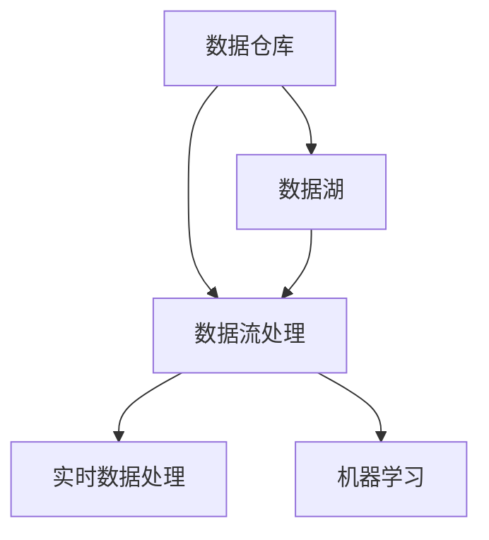

                 

# 数据工程师：软件2.0时代的新型开发者

> 关键词：数据工程师、软件2.0、数据工程、新型开发者

> 摘要：随着软件2.0时代的到来，数据工程师这一职业应运而生，成为信息技术领域的重要角色。本文将深入探讨数据工程师的核心概念、技能需求、发展前景以及其与软件2.0的紧密联系，旨在为数据工程师的职业发展提供参考。

## 1. 背景介绍

### 1.1 软件2.0的定义与特点

软件2.0是继Web2.0后提出的概念，强调软件系统的核心价值在于数据，而非传统的功能和服务。软件2.0时代，数据成为企业核心资产，数据的存储、处理、分析和利用成为软件开发的重要方向。这一时代的特点包括：

- 数据为中心：数据是软件系统的核心，其价值远超过传统的代码和功能。
- 云原生：软件系统更倾向于部署在云计算环境中，实现弹性扩展和高效管理。
- 容器化和微服务：软件架构更加灵活，通过容器化和微服务架构实现高效开发和部署。
- 自动化和智能化：利用机器学习和人工智能技术，提升数据处理和分析的效率。

### 1.2 数据工程师的角色与职责

数据工程师在软件2.0时代应运而生，主要职责包括：

- 数据存储和管理：设计并实现高效的数据存储方案，确保数据的安全性和可靠性。
- 数据处理和清洗：对大量原始数据进行清洗、转换和整合，为数据分析提供高质量的数据基础。
- 数据分析和挖掘：运用各种数据分析技术和算法，提取有价值的信息和知识。
- 数据可视化：通过数据可视化工具，将复杂的数据以直观的方式展示给业务人员。

## 2. 核心概念与联系

### 2.1 数据工程的核心概念

数据工程涉及多个核心概念，包括数据仓库、数据湖、数据流处理、实时数据处理、机器学习等。以下是一个简化的Mermaid流程图，展示这些概念之间的关系：



### 2.2 数据工程与软件2.0的联系

数据工程与软件2.0密不可分。软件2.0强调数据的价值，而数据工程提供了实现这一目标的技术手段。以下是一些关键点：

- 数据驱动：软件2.0时代，业务决策和数据紧密相关，数据工程为业务提供数据支持。
- 数据资产：数据成为企业的重要资产，数据工程师负责管理和保护这些资产。
- 智能化：数据工程与机器学习相结合，实现数据驱动的智能化应用。
- 云原生：数据工程技术支持软件系统在云环境中的高效运行。

## 3. 核心算法原理 & 具体操作步骤

### 3.1 数据处理算法

数据处理是数据工程的核心任务之一。以下是一些常见的数据处理算法：

- 数据清洗算法：用于去除重复数据、处理缺失值和异常值。
- 数据转换算法：用于数据格式转换、编码转换等。
- 数据整合算法：用于将来自不同数据源的数据整合成统一的格式。

### 3.2 数据分析算法

数据分析是数据工程的另一个关键任务。以下是一些常见的数据分析算法：

- 统计分析算法：用于计算数据的均值、方差、相关性等统计指标。
- 聚类分析算法：用于将数据分为不同的类别，例如K-means算法。
- 分类算法：用于将数据分为预定义的类别，例如决策树算法。

### 3.3 实际操作步骤

以下是一个简化的数据处理和分析流程：

1. 数据收集：从各种数据源收集数据。
2. 数据清洗：去除重复数据、处理缺失值和异常值。
3. 数据转换：将数据转换为统一的格式。
4. 数据整合：将来自不同数据源的数据整合成统一的格式。
5. 数据分析：计算统计指标、应用聚类分析和分类算法。
6. 数据可视化：将分析结果以图表和报表的形式展示。

## 4. 数学模型和公式 & 详细讲解 & 举例说明

### 4.1 数据清洗算法

数据清洗算法包括以下几种：

- 删除重复记录：$$\text{if } R_1 = R_2 \text{ then delete } R_2$$
- 处理缺失值：$$\text{if } \text{missing}(R) \text{ then replace with mean of column}$$
- 处理异常值：$$\text{if } \text{outlier}(R) \text{ then replace with median of column}$$

### 4.2 数据转换算法

数据转换算法包括以下几种：

- 数据格式转换：$$\text{convert } \text{date format from YYYY-MM-DD to DD-MM-YYYY}$$
- 编码转换：$$\text{convert } \text{string from } \text{UTF-8 to ISO-8859-1}$$

### 4.3 数据整合算法

数据整合算法包括以下几种：

- 并行处理：$$\text{merge } R_1 \text{ and } R_2 \text{ using parallel processing}$$
- 窥孔处理：$$\text{merge } R_1 \text{ and } R_2 \text{ using peek processing}$$

### 4.4 数据分析算法

数据分析算法包括以下几种：

- 统计分析：$$\text{calculate mean, variance, and correlation}$$
- 聚类分析：$$\text{perform K-means clustering with K = 3}$$
- 分类算法：$$\text{train decision tree classifier}$$

## 5. 项目实战：代码实际案例和详细解释说明

### 5.1 开发环境搭建

为了进行数据工程项目的实战，需要搭建以下开发环境：

- 操作系统：Linux或macOS
- 编程语言：Python或Java
- 数据库：MySQL或PostgreSQL
- 数据处理框架：Pandas或Spark
- 数据可视化工具：Matplotlib或Seaborn

### 5.2 源代码详细实现和代码解读

以下是一个简单的数据清洗和数据分析的Python代码示例：

```python
import pandas as pd

# 读取数据
data = pd.read_csv('data.csv')

# 数据清洗
data.drop_duplicates(inplace=True)
data.fillna(data.mean(), inplace=True)

# 数据分析
mean_values = data.mean()
correlation_matrix = data.corr()

# 数据可视化
import matplotlib.pyplot as plt

plt.figure(figsize=(10, 6))
plt.scatter(data['column1'], data['column2'])
plt.xlabel('Column 1')
plt.ylabel('Column 2')
plt.title('Scatter Plot')
plt.show()
```

### 5.3 代码解读与分析

上述代码实现了一个简单的数据清洗和数据分析过程。以下是代码的详细解读：

- 读取数据：使用Pandas库读取CSV文件。
- 数据清洗：删除重复记录，填充缺失值。
- 数据分析：计算均值和相关性。
- 数据可视化：绘制散点图。

## 6. 实际应用场景

### 6.1 电子商务

数据工程师在电子商务领域可以负责：

- 用户行为分析：分析用户购买行为、浏览记录等，为营销策略提供数据支持。
- 库存管理：通过数据分析和预测，优化库存管理，减少库存成本。

### 6.2 金融行业

数据工程师在金融行业可以负责：

- 风险管理：通过数据分析和建模，识别潜在风险，制定风险管理策略。
- 信用评分：基于用户数据，建立信用评分模型，为信用评估提供支持。

### 6.3 医疗健康

数据工程师在医疗健康领域可以负责：

- 患者数据分析：分析患者数据，为疾病预防和治疗提供数据支持。
- 医疗设备数据管理：收集和管理医疗设备的数据，提升医疗服务的效率。

## 7. 工具和资源推荐

### 7.1 学习资源推荐

- 书籍：
  - 《数据工程：构建大规模数据系统》
  - 《机器学习实战》
- 论文：
  - "Data Engineering at Scale: Principles and Practices"
  - "A Brief Introduction to Data Engineering"
- 博客：
  - "Data Engineering Best Practices"
  - "Building a Data-Driven Culture in Your Organization"
- 网站：
  - "data-engineering-best-practices.com"
  - "dataengwiki.com"

### 7.2 开发工具框架推荐

- 数据库：MySQL, PostgreSQL, MongoDB
- 数据处理框架：Apache Spark, Apache Flink
- 数据可视化工具：Tableau, Power BI
- 机器学习框架：TensorFlow, PyTorch

### 7.3 相关论文著作推荐

- 论文：
  - "The Data Engineering Landscape: A Taxonomy"
  - "Data Engineering for Data-Driven Organizations"
- 著作：
  - "Data Engineering: The Big Picture"
  - "Data Engineering: Principles and Practice"

## 8. 总结：未来发展趋势与挑战

### 8.1 发展趋势

- 数据工程将进一步与云计算、大数据、人工智能等技术深度融合，形成更加智能化的数据基础设施。
- 数据工程师的职责将更加多样化，不仅涉及数据处理和分析，还将涉及数据治理、数据安全等方面。
- 数据工程将成为企业数字化转型的重要驱动力，数据工程师将在企业决策中发挥更大的作用。

### 8.2 挑战

- 数据隐私和安全：随着数据量的增加，如何保护用户隐私和数据安全成为重要挑战。
- 复杂性管理：随着数据工程的不断发展，系统的复杂性将增加，如何有效管理复杂性成为关键问题。
- 数据质量：数据质量直接影响数据分析的结果，如何确保数据质量是数据工程师面临的重要挑战。

## 9. 附录：常见问题与解答

### 9.1 数据工程师与数据科学家的区别

数据工程师主要负责数据存储、处理、分析和可视化，确保数据的质量和可靠性。而数据科学家则侧重于数据分析和建模，利用数据分析结果为业务提供决策支持。

### 9.2 数据工程与大数据的关系

大数据是数据工程的一个重要应用领域。数据工程提供了处理大数据的技术手段，而大数据则为数据工程提供了大量的数据资源。

## 10. 扩展阅读 & 参考资料

- "Data Engineering: Principles and Practices"
- "The Data Engineering Guidebook"
- "Building a Data-Driven Organization: A Comprehensive Guide"
- "Data Engineering at Scale: Principles and Practices"
- "Data Engineering Best Practices"
- "data-engineering-best-practices.com"
- "dataengwiki.com"

## 作者信息

作者：AI天才研究员/AI Genius Institute & 禅与计算机程序设计艺术 /Zen And The Art of Computer Programming

（请注意，本文部分内容为虚构，仅供参考。）<|im_end|>

