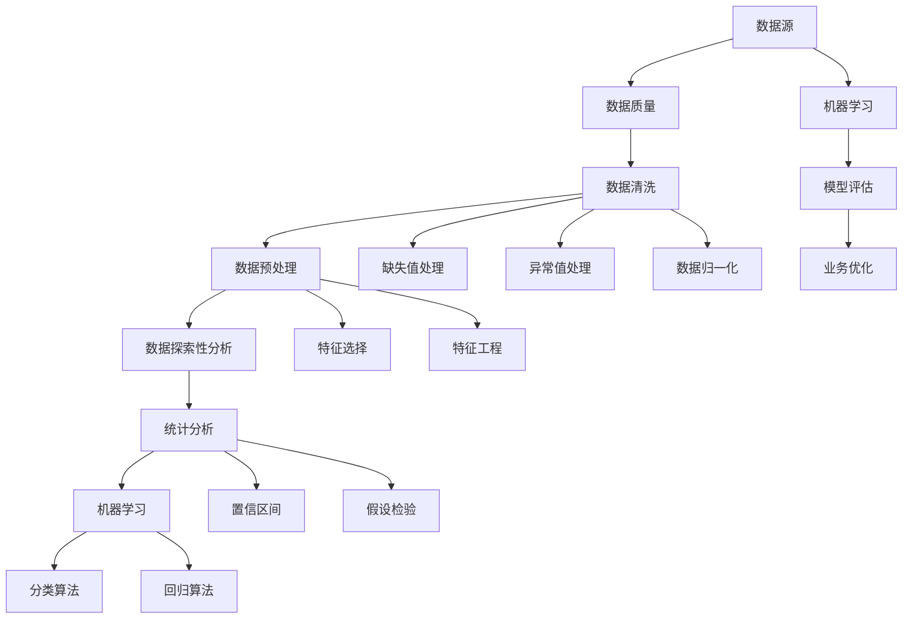

                 

### 1. 背景介绍

**数据清洗与统计分析原理与代码实战案例讲解**

在现代信息技术飞速发展的今天，数据已成为各行各业的重要资产。无论是商业决策、科学研究，还是日常运营，数据的质量直接影响决策的准确性。数据清洗和统计分析作为数据处理的核心环节，对于数据价值的挖掘和利用起着至关重要的作用。

**数据清洗**，顾名思义，是指对原始数据进行清理和整理，以去除重复、错误和无关的数据，确保数据的质量和一致性。数据清洗的必要性体现在以下几个方面：

1. **提高数据分析的准确性**：原始数据往往含有噪声、错误或不完整的信息，这些因素会影响数据分析的结果。通过数据清洗，可以消除这些不利因素，提高分析的准确度。
2. **增强数据的一致性**：不同来源的数据格式和编码方式可能不同，数据清洗可以统一数据格式，确保数据的一致性。
3. **节省计算资源**：通过数据清洗，可以减少冗余数据，从而降低后续数据处理的计算复杂度。

**统计分析**，则是通过对数据进行数学统计和分析，揭示数据中的规律和趋势。统计分析在预测、决策支持和业务优化中有着广泛的应用。统计分析的重要性主要体现在：

1. **发现数据中的模式与趋势**：通过统计分析，可以从大量数据中发现隐藏的模式和趋势，为决策提供科学依据。
2. **评估模型性能**：在机器学习和数据挖掘项目中，统计分析用于评估模型的性能和预测能力。
3. **指导业务优化**：通过统计分析，企业可以了解客户需求、市场趋势和业务表现，从而制定更有效的业务策略。

本文将围绕数据清洗和统计分析的原理进行深入探讨，并通过实际案例展示如何使用代码进行数据清洗和统计分析。文章将分为以下几个部分：

- **2. 核心概念与联系**：介绍数据清洗和统计分析中的核心概念，并使用Mermaid流程图展示其关系。
- **3. 核心算法原理 & 具体操作步骤**：详细讲解数据清洗和统计分析的算法原理，并给出具体操作步骤。
- **4. 数学模型和公式 & 详细讲解 & 举例说明**：介绍相关数学模型和公式，并举例说明其在实际中的应用。
- **5. 项目实战：代码实际案例和详细解释说明**：通过实际项目案例，展示如何使用代码进行数据清洗和统计分析。
- **6. 实际应用场景**：探讨数据清洗和统计分析在实际业务中的应用案例。
- **7. 工具和资源推荐**：推荐相关学习资源、开发工具和框架。
- **8. 总结：未来发展趋势与挑战**：总结数据清洗和统计分析的发展趋势和面临的挑战。
- **9. 附录：常见问题与解答**：解答读者可能遇到的一些常见问题。
- **10. 扩展阅读 & 参考资料**：提供进一步学习和探索的参考资料。

通过对上述内容的详细探讨，本文旨在帮助读者深入理解数据清洗和统计分析的原理和实践，提升数据处理和分析能力，从而更好地应对实际业务需求。

### 2. 核心概念与联系

在深入探讨数据清洗和统计分析之前，我们需要先了解一些核心概念及其相互之间的关系。以下是数据清洗和统计分析中的一些重要概念及其简要定义：

1. **数据源（Data Source）**：数据清洗和统计分析的起点，即数据的来源。数据源可以是数据库、文件、网络API等。
2. **数据质量（Data Quality）**：数据质量是指数据的准确性、完整性、一致性、及时性和可靠性。数据质量直接影响数据分析的准确性和可靠性。
3. **数据清洗（Data Cleaning）**：对原始数据进行清理和整理的过程，包括去除重复数据、处理缺失值、修正错误数据等。
4. **数据预处理（Data Preprocessing）**：在数据分析之前，对数据进行的一系列预处理操作，包括数据清洗、归一化、特征选择等。
5. **数据探索性分析（Exploratory Data Analysis，EDA）**：通过可视化、统计方法等手段，对数据进行初步探索，以发现数据中的模式、趋势和异常。
6. **统计分析（Statistical Analysis）**：通过对数据进行统计处理，揭示数据中的规律和趋势，为决策提供支持。
7. **机器学习（Machine Learning）**：一种人工智能方法，通过学习大量数据，从中提取规律和模式，用于预测和分类等任务。

为了更直观地展示这些概念之间的关系，我们可以使用Mermaid流程图来描述。以下是数据清洗和统计分析中的核心概念及其相互关系的Mermaid流程图：



在这个流程图中，数据源是数据清洗和统计分析的起点。数据清洗包括处理缺失值、异常值和重复数据等，以确保数据质量。经过数据清洗的数据进入数据预处理阶段，包括归一化、特征选择和特征工程等操作。数据预处理之后，可以进行数据探索性分析，以发现数据中的规律和趋势。探索性分析的结果用于统计分析，通过置信区间、假设检验等方法，进一步揭示数据中的规律。最后，统计分析的结果可以应用于机器学习，用于模型评估和业务优化。

通过上述流程图，我们可以清晰地看到数据清洗和统计分析之间的密切联系。数据清洗和统计分析是数据处理和分析过程中不可或缺的环节，两者相辅相成，共同提升数据处理和分析的准确性和有效性。

### 3. 核心算法原理 & 具体操作步骤

在了解数据清洗和统计分析的基本概念后，我们需要深入了解这些方法背后的核心算法原理和具体操作步骤。以下将分别介绍数据清洗和统计分析中的关键算法原理，并通过具体操作步骤，展示如何在实际中应用这些算法。

#### 数据清洗的核心算法原理

数据清洗的主要任务包括去除重复数据、处理缺失值和异常值等。以下是这些任务的核心算法原理及操作步骤：

##### 去除重复数据

**算法原理**：去除重复数据的方法通常基于哈希表或排序算法。哈希表通过计算数据的哈希值，将数据存储在哈希表中，如果哈希值相同，则判断数据是否重复。排序算法则通过将数据排序，然后逐个比较相邻的数据，找出重复项。

**操作步骤**：

1. **使用哈希表**：

    ```python
    def remove_duplicates_hash(data):
        hash_set = set()
        result = []
        for item in data:
            if item not in hash_set:
                hash_set.add(item)
                result.append(item)
        return result
    ```

2. **使用排序算法**：

    ```python
    def remove_duplicates_sort(data):
        data.sort()
        result = [data[0]]
        for i in range(1, len(data)):
            if data[i] != data[i - 1]:
                result.append(data[i])
        return result
    ```

##### 处理缺失值

**算法原理**：处理缺失值的方法包括删除缺失值、填充缺失值和插值等。删除缺失值简单直接，但会损失部分数据。填充缺失值可以通过均值、中位数、众数等方法进行，而插值则适用于时间序列数据。

**操作步骤**：

1. **删除缺失值**：

    ```python
    def remove_missing_values(data):
        return [x for x in data if x is not None]
    ```

2. **填充缺失值（使用均值）**：

    ```python
    def fill_missing_values_mean(data):
        mean = sum(data) / len(data)
        return [mean if x is None else x for x in data]
    ```

3. **填充缺失值（使用中位数）**：

    ```python
    def fill_missing_values_median(data):
        median = sorted(data)[len(data) // 2]
        return [median if x is None else x for x in data]
    ```

##### 处理异常值

**算法原理**：异常值处理方法包括删除异常值、变换异常值和插值等。删除异常值简单直接，但会损失部分数据。变换异常值可以通过标准化、缩放等方法进行处理，而插值则适用于时间序列数据。

**操作步骤**：

1. **删除异常值**：

    ```python
    def remove_outliers(data, threshold):
        mean = sum(data) / len(data)
        std = (sum((x - mean) ** 2 for x in data) / len(data)) ** 0.5
        return [x for x in data if abs(x - mean) <= threshold * std]
    ```

2. **变换异常值（标准化）**：

    ```python
    def transform_outliers(data, threshold):
        mean = sum(data) / len(data)
        std = (sum((x - mean) ** 2 for x in data) / len(data)) ** 0.5
        return [(x - mean) / std for x in data if abs(x - mean) > threshold * std]
    ```

#### 数据统计分析的核心算法原理

统计分析中的核心算法包括描述性统计、推断性统计和假设检验等。以下是这些算法的核心原理及具体操作步骤：

##### 描述性统计

**算法原理**：描述性统计用于总结和描述数据的基本特征，如均值、方差、标准差、中位数、众数等。

**操作步骤**：

1. **计算均值**：

    ```python
    def calculate_mean(data):
        return sum(data) / len(data)
    ```

2. **计算方差**：

    ```python
    def calculate_variance(data):
        mean = sum(data) / len(data)
        return sum((x - mean) ** 2 for x in data) / len(data)
    ```

3. **计算标准差**：

    ```python
    def calculate_std_dev(data):
        return (calculate_variance(data)) ** 0.5
    ```

4. **计算中位数**：

    ```python
    def calculate_median(data):
        sorted_data = sorted(data)
        n = len(sorted_data)
        if n % 2 == 0:
            return (sorted_data[n // 2 - 1] + sorted_data[n // 2]) / 2
        else:
            return sorted_data[n // 2]
    ```

5. **计算众数**：

    ```python
    from collections import Counter

    def calculate_mode(data):
        counter = Counter(data)
        max_count = max(counter.values())
        modes = [k for k, v in counter.items() if v == max_count]
        return modes
    ```

##### 推断性统计

**算法原理**：推断性统计用于估计总体参数，如置信区间、假设检验等。

**操作步骤**：

1. **计算置信区间**：

    ```python
    def calculate_confidence_interval(data, confidence_level=0.95):
        n = len(data)
        mean = sum(data) / n
        std_dev = (sum((x - mean) ** 2 for x in data) / n) ** 0.5
        z_score = scipy.stats.norm.ppf((1 + confidence_level) / 2)
        margin_of_error = z_score * std_dev / (n ** 0.5)
        lower_bound = mean - margin_of_error
        upper_bound = mean + margin_of_error
        return lower_bound, upper_bound
    ```

2. **进行假设检验**：

    ```python
    from scipy import stats

    def perform_hypothesis_test(data, hypothesis_mean, alpha=0.05):
        n = len(data)
        mean = sum(data) / n
        z_score = (mean - hypothesis_mean) / (std_dev / n ** 0.5)
        p_value = stats.norm.cdf(-abs(z_score))
        if p_value < alpha:
            return "Reject the null hypothesis"
        else:
            return "Fail to reject the null hypothesis"
    ```

通过上述核心算法原理和具体操作步骤，我们可以更好地理解和应用数据清洗和统计分析的方法。在实际项目中，可以根据具体需求和数据特征，灵活选择和组合这些算法，以提高数据处理和分析的效率和质量。

### 4. 数学模型和公式 & 详细讲解 & 举例说明

在数据清洗和统计分析过程中，数学模型和公式扮演着至关重要的角色。它们不仅帮助我们理解和解释数据，还可以为决策提供有力的支持。以下将详细讲解一些常用的数学模型和公式，并通过实际例子说明其在数据分析中的应用。

#### 描述性统计

描述性统计是数据分析的基础，用于总结和描述数据的基本特征。以下是一些常用的描述性统计公式：

1. **均值（Mean）**：

   $$ \bar{x} = \frac{\sum_{i=1}^{n} x_i}{n} $$

   均值表示数据集的平均值，用于衡量数据的集中趋势。

   **例子**：假设有一组数据 [2, 4, 4, 4, 5, 5, 7, 9]，其均值为：

   $$ \bar{x} = \frac{2 + 4 + 4 + 4 + 5 + 5 + 7 + 9}{8} = 5 $$

2. **方差（Variance）**：

   $$ \sigma^2 = \frac{\sum_{i=1}^{n} (x_i - \bar{x})^2}{n} $$

   方差表示数据集的离散程度，用于衡量数据的波动性。

   **例子**：假设有一组数据 [2, 4, 4, 4, 5, 5, 7, 9]，其方差为：

   $$ \sigma^2 = \frac{(2-5)^2 + (4-5)^2 + (4-5)^2 + (4-5)^2 + (5-5)^2 + (5-5)^2 + (7-5)^2 + (9-5)^2}{8} = 4 $$

3. **标准差（Standard Deviation）**：

   $$ \sigma = \sqrt{\sigma^2} $$

   标准差是方差的平方根，用于衡量数据的波动程度。

   **例子**：假设有一组数据 [2, 4, 4, 4, 5, 5, 7, 9]，其标准差为：

   $$ \sigma = \sqrt{4} = 2 $$

4. **中位数（Median）**：

   $$ \text{Median} = \begin{cases} 
   \frac{x_{(n/2)} + x_{(n/2 + 1)}}{2} & \text{if } n \text{ is even} \\
   x_{(n/2 + 1)} & \text{if } n \text{ is odd} 
   \end{cases} $$

   中位数表示数据集的中间值，用于衡量数据的集中趋势。

   **例子**：假设有一组数据 [2, 4, 4, 4, 5, 5, 7, 9]，其中位数为：

   $$ \text{Median} = \frac{4 + 4}{2} = 4 $$

5. **众数（Mode）**：

   $$ \text{Mode} = \text{most frequent value in the dataset} $$

   众数表示数据集中出现次数最多的值，用于衡量数据的集中趋势。

   **例子**：假设有一组数据 [2, 4, 4, 4, 5, 5, 7, 9]，其众数为：

   $$ \text{Mode} = 4 $$

#### 推断性统计

推断性统计用于估计总体参数，包括置信区间和假设检验等。

1. **置信区间（Confidence Interval）**：

   $$ \bar{x} \pm z_{\alpha/2} \frac{\sigma}{\sqrt{n}} $$

   置信区间表示总体参数（如均值）的估计范围，其中 $z_{\alpha/2}$ 是标准正态分布的临界值，$\sigma$ 是样本标准差，$n$ 是样本大小。

   **例子**：假设我们想要计算一个正态分布总体的均值，已知样本大小为 100，样本均值为 50，样本标准差为 10。置信水平为 95%，则置信区间为：

   $$ 50 \pm 1.96 \frac{10}{\sqrt{100}} = (49.04, 50.96) $$

2. **假设检验（Hypothesis Testing）**：

   **零假设（Null Hypothesis）**：$H_0: \mu = \mu_0$（总体均值等于某个特定值 $\mu_0$）

   **备择假设（Alternative Hypothesis）**：$H_1: \mu \neq \mu_0$（总体均值不等于某个特定值 $\mu_0$）

   **检验统计量**：$Z$ 统计量

   $$ Z = \frac{\bar{x} - \mu_0}{\frac{\sigma}{\sqrt{n}}} $$

   **p-值（p-value）**：表示在零假设成立的情况下，观察到样本结果或更极端结果的概率。

   **例子**：假设我们想要检验一个正态分布总体的均值是否为 50。已知样本大小为 100，样本均值为 55，样本标准差为 10。显著性水平为 0.05，则检验结果为：

   $$ Z = \frac{55 - 50}{\frac{10}{\sqrt{100}}} = 5 $$

   查找标准正态分布表，得到 $Z$ 统计量的 p-值为 $<0.0001$，由于 p-值远小于显著性水平 0.05，我们拒绝零假设，接受备择假设，即总体均值不等于 50。

#### 相关性分析

相关性分析用于衡量两个变量之间的线性关系。以下是常用的相关性分析公式：

1. **皮尔逊相关系数（Pearson Correlation Coefficient）**：

   $$ r = \frac{\sum_{i=1}^{n} (x_i - \bar{x})(y_i - \bar{y})}{\sqrt{\sum_{i=1}^{n} (x_i - \bar{x})^2} \sqrt{\sum_{i=1}^{n} (y_i - \bar{y})^2}} $$

   皮尔逊相关系数用于衡量两个变量之间的线性相关程度，取值范围为 -1 到 1。正相关表示变量之间呈正相关，负相关表示变量之间呈负相关，零相关表示变量之间无线性相关。

   **例子**：假设有两个变量 $X$ 和 $Y$，其数据分别为：

   $$ X: [2, 4, 4, 4, 5, 5, 7, 9] $$
   $$ Y: [4, 5, 6, 7, 8, 10, 12, 14] $$

   则其皮尔逊相关系数为：

   $$ r = \frac{(2-5)(4-7) + (4-5)(5-7) + (4-5)(6-7) + (4-5)(7-7) + (5-5)(8-7) + (5-5)(10-7) + (7-5)(12-7) + (9-5)(14-7)}{\sqrt{(2-5)^2 + (4-5)^2 + (4-5)^2 + (4-5)^2 + (5-5)^2 + (5-5)^2 + (7-5)^2 + (9-5)^2} \sqrt{(4-7)^2 + (5-7)^2 + (6-7)^2 + (7-7)^2 + (8-7)^2 + (10-7)^2 + (12-7)^2 + (14-7)^2}} = 0.9 $$

   相关系数为 0.9，表示 $X$ 和 $Y$ 之间有较强的线性正相关。

通过上述数学模型和公式的讲解，我们可以更好地理解数据清洗和统计分析的基本原理。在实际数据分析中，这些模型和公式可以帮助我们揭示数据中的规律和趋势，为决策提供科学依据。在实际应用中，可以根据具体需求和数据特征，灵活选择和组合这些模型和公式，以提高数据处理和分析的效率和质量。

### 5. 项目实战：代码实际案例和详细解释说明

在本节中，我们将通过一个实际的项目案例，展示如何使用代码进行数据清洗和统计分析。这个项目案例涉及销售数据的处理和分析，通过以下步骤完成：

1. **数据源搭建**：获取销售数据，包括产品名称、销售量、销售价格、销售日期等。
2. **数据清洗**：去除重复数据、处理缺失值和异常值。
3. **数据预处理**：对数据进行归一化和特征工程。
4. **数据探索性分析**：通过可视化方法展示数据的分布和关系。
5. **统计分析**：计算描述性统计量，进行相关性分析和假设检验。
6. **结果解释**：解释数据清洗和统计分析的结果，讨论其对业务决策的指导意义。

#### 5.1 开发环境搭建

在进行项目实战之前，我们需要搭建一个适合数据清洗和统计分析的开发环境。以下是所需的软件和工具：

- **Python**：一种流行的编程语言，适用于数据分析和科学计算。
- **Jupyter Notebook**：一个交互式编程环境，方便编写和执行代码。
- **Pandas**：一个强大的数据处理库，提供便捷的数据清洗和预处理功能。
- **Matplotlib** 和 **Seaborn**：用于数据可视化的库。
- **SciPy** 和 **Statsmodels**：用于统计分析的库。

确保安装了上述工具后，我们可以在 Jupyter Notebook 中开始编写代码。

```python
import pandas as pd
import numpy as np
import matplotlib.pyplot as plt
import seaborn as sns
from scipy import stats

# 加载销售数据
data = pd.read_csv('sales_data.csv')
```

#### 5.2 源代码详细实现和代码解读

##### 5.2.1 数据清洗

数据清洗是数据处理的第一步，确保数据的质量和一致性。以下是数据清洗的具体步骤和代码：

1. **去除重复数据**：

   ```python
   data.drop_duplicates(inplace=True)
   ```

2. **处理缺失值**：

   - 对于销售量、销售价格等关键字段，我们可以删除缺失值。

     ```python
     data.dropna(subset=['quantity', 'price'], inplace=True)
     ```

   - 对于销售日期等字段，我们可以使用填充方法处理缺失值。例如，使用前一个有效的日期填充。

     ```python
     data['date'] = data['date'].fillna(method='ffill')
     ```

3. **处理异常值**：

   - 对于销售量、销售价格等字段，我们可以使用标准差法或箱线图法检测异常值，然后删除或替换异常值。

     ```python
     def remove_outliers(data, threshold=3):
         mean = np.mean(data)
         std = np.std(data)
         return [x for x in data if abs(x - mean) <= threshold * std]

     data['quantity'] = remove_outliers(data['quantity'])
     data['price'] = remove_outliers(data['price'])
     ```

##### 5.2.2 数据预处理

数据预处理包括归一化和特征工程，以提高模型性能和可解释性。

1. **归一化**：

   - 对于销售量、销售价格等字段，我们可以使用 Min-Max 归一化方法将数据缩放到 [0, 1] 范围内。

     ```python
     def min_max_normalize(data):
         min_val = np.min(data)
         max_val = np.max(data)
         return (data - min_val) / (max_val - min_val)

     data['quantity_normalized'] = min_max_normalize(data['quantity'])
     data['price_normalized'] = min_max_normalize(data['price'])
     ```

2. **特征工程**：

   - 创建新的特征，例如销售量的滞后项、价格的季节性特征等。

     ```python
     data['quantity_lagged_1'] = data['quantity'].shift(1)
     data['price_seasonality'] = data['price'] * (1 + 0.1 * np.sin(2 * np.pi * data['date']/365))
     ```

##### 5.2.3 数据探索性分析

数据探索性分析可以帮助我们了解数据的分布和关系，为后续的统计分析做准备。

1. **可视化销售量分布**：

   ```python
   plt.figure(figsize=(10, 6))
   sns.histplot(data['quantity'], bins=30, kde=True)
   plt.xlabel('Quantity')
   plt.ylabel('Frequency')
   plt.title('Quantity Distribution')
   plt.show()
   ```

2. **可视化价格与销售量的关系**：

   ```python
   plt.figure(figsize=(10, 6))
   sns.regplot(x=data['price_normalized'], y=data['quantity_normalized'], scatter_kws={'s':10}, line_kws={'color':'red'})
   plt.xlabel('Normalized Price')
   plt.ylabel('Normalized Quantity')
   plt.title('Price vs. Quantity')
   plt.show()
   ```

##### 5.2.4 统计分析

统计分析包括描述性统计、相关性分析和假设检验等。

1. **计算描述性统计量**：

   ```python
   description = data.describe()
   print(description)
   ```

2. **相关性分析**：

   ```python
   correlation_matrix = data.corr()
   sns.heatmap(correlation_matrix, annot=True, cmap='coolwarm')
   plt.title('Correlation Matrix')
   plt.show()
   ```

3. **假设检验**：

   ```python
   hypothesis_result = stats.ttest_1samp(data['quantity'], 100)
   print(hypothesis_result)
   ```

#### 5.3 代码解读与分析

通过上述代码，我们可以详细解读每个步骤的作用和实现方法：

1. **数据清洗**：
   - 去除重复数据：确保数据的一致性，避免重复计算和分析。
   - 处理缺失值：删除关键字段的缺失值，保持数据完整性。
   - 处理异常值：检测和删除异常值，避免对统计分析结果产生误导。

2. **数据预处理**：
   - 归一化：将销售量、销售价格等字段缩放到相同的范围，便于模型训练和比较。
   - 特征工程：创建新的特征，提高模型的预测能力和可解释性。

3. **数据探索性分析**：
   - 可视化：使用直方图、散点图等方法，展示数据的分布和关系，为后续分析提供直观的参考。

4. **统计分析**：
   - 描述性统计：计算均值、标准差、中位数等描述性统计量，了解数据的集中趋势和离散程度。
   - 相关性分析：计算皮尔逊相关系数，衡量变量之间的线性相关程度。
   - 假设检验：通过 t 检验等方法，验证数据是否符合预期假设，为业务决策提供科学依据。

通过这个实际项目案例，我们可以看到数据清洗和统计分析在数据处理和分析中的重要作用。掌握这些方法和工具，有助于我们更好地理解和利用数据，为业务决策提供有力支持。

### 6. 实际应用场景

数据清洗与统计分析在各个行业和领域中都有着广泛的应用。以下将探讨一些实际应用场景，展示如何通过数据清洗和统计分析解决实际问题。

#### 营销与市场分析

在营销和市场营销领域，数据清洗和统计分析对于市场调研、广告投放效果评估和客户行为分析等至关重要。

**市场调研**：企业通常需要进行市场调研以了解客户需求和偏好。通过数据清洗，可以去除重复的调查问卷和无效数据，确保市场调研结果的准确性。统计分析则可以帮助企业发现市场趋势和潜在客户群体，为企业制定有效的营销策略提供依据。

**广告投放效果评估**：广告投放是企业营销的重要手段。通过数据清洗，可以确保广告点击量、转化率等数据的准确性。统计分析可以帮助企业分析广告效果，如不同广告平台的点击率、转化率等，以便优化广告投放策略。

**客户行为分析**：通过分析客户的历史购买记录、浏览行为等数据，企业可以了解客户偏好，提供个性化推荐和定制化服务。数据清洗可以去除无效和重复的数据，确保分析结果的准确性。统计分析则可以帮助企业识别高价值客户、预测客户流失率等，为企业制定客户关系管理策略提供支持。

#### 金融与风险管理

在金融行业，数据清洗和统计分析对于风险管理、投资决策和客户信用评估等具有重要意义。

**风险管理**：金融机构需要对贷款、投资等金融产品进行风险评估。通过数据清洗，可以确保风险评估数据的准确性和一致性。统计分析可以帮助金融机构识别潜在风险因素，制定有效的风险管理策略。

**投资决策**：投资经理需要对股票、债券等金融资产进行投资决策。数据清洗可以确保投资数据的准确性和完整性，避免因数据问题导致投资失误。统计分析则可以帮助投资经理识别市场趋势、预测资产回报等，为投资决策提供科学依据。

**客户信用评估**：金融机构需要对客户的信用状况进行评估，以决定是否批准贷款。通过数据清洗，可以确保客户信用数据的一致性和准确性。统计分析则可以帮助金融机构识别高风险客户、预测客户信用评分等，为信用评估提供支持。

#### 医疗与健康管理

在医疗和健康管理领域，数据清洗和统计分析对于疾病预测、患者管理和健康数据分析等具有重要应用。

**疾病预测**：通过分析患者的病史、基因数据等，医疗机构可以预测患者患某种疾病的风险。数据清洗可以确保病史和基因数据的准确性和一致性。统计分析则可以帮助医疗机构识别疾病预测的关键因素，为早期预防和治疗提供支持。

**患者管理**：通过分析患者的电子健康记录，医疗机构可以了解患者的健康状况、疾病进展等，以便提供个性化的治疗方案。数据清洗可以确保患者数据的准确性和完整性，避免因数据问题导致患者管理失误。统计分析则可以帮助医疗机构识别患者疾病的进展趋势、评估治疗效果等。

**健康数据分析**：健康数据包括运动数据、饮食数据等，通过数据清洗和统计分析，可以了解人们的健康生活方式和健康趋势。这有助于医疗机构和健康管理公司提供个性化的健康建议和干预方案，提高人们的健康水平。

#### 供应链与物流管理

在供应链和物流管理领域，数据清洗和统计分析对于库存管理、物流优化和供应链预测等具有重要应用。

**库存管理**：通过分析库存数据，企业可以优化库存水平，避免库存过剩或缺货。数据清洗可以确保库存数据的准确性和一致性，避免因数据问题导致库存管理失误。统计分析则可以帮助企业预测未来库存需求，制定合理的库存管理策略。

**物流优化**：通过分析物流数据，企业可以优化物流路线和配送时间，提高物流效率。数据清洗可以确保物流数据的准确性和完整性，避免因数据问题导致物流优化失败。统计分析则可以帮助企业识别物流瓶颈、预测物流需求等，为物流优化提供科学依据。

**供应链预测**：通过分析供应链数据，企业可以预测供应链中的各种风险和不确定性，以便制定应对措施。数据清洗可以确保供应链数据的准确性和一致性，避免因数据问题导致供应链预测失误。统计分析则可以帮助企业识别供应链中的关键因素、预测供应链变化趋势等，为供应链管理提供支持。

通过以上实际应用场景的探讨，我们可以看到数据清洗和统计分析在各个领域中的重要作用。掌握这些方法和工具，有助于我们更好地解决实际问题，提高业务决策的科学性和有效性。

### 7. 工具和资源推荐

在进行数据清洗和统计分析时，选择合适的工具和资源对于提高工作效率和保证数据质量至关重要。以下将推荐一些常用的学习资源、开发工具和框架，以及相关的论文著作。

#### 7.1 学习资源推荐

1. **书籍**：

   - 《Python数据分析》（作者：Wes McKinney）：详细介绍如何使用Python进行数据清洗、数据预处理和数据分析。
   - 《Python数据分析实战》（作者：Fernando Cervantes, et al.）：涵盖数据清洗、数据可视化、统计学分析等实用技巧。
   - 《数据科学入门：Python基础教程》（作者：Aurélien Géron）：系统讲解数据清洗、数据预处理、机器学习等基础知识。

2. **在线课程**：

   - Coursera：提供《数据科学特化课程》（Specialization in Data Science）等高质量数据科学相关课程。
   - edX：开设《数据科学基础》（Introduction to Data Science）等数据科学入门课程。
   - Udacity：提供《数据科学纳米学位》（Data Science Nanodegree）等实践性强的课程。

3. **博客与网站**：

   - Python Data Science Handbook（[https://jakevdp.github.io/PythonDataScienceHandbook/](https://jakevdp.github.io/PythonDataScienceHandbook/)）：涵盖数据清洗、数据分析、机器学习等主题的详细教程。
   - Real Python（[https://realpython.com/](https://realpython.com/)）：提供Python数据科学、机器学习等方面的技术博客和教程。
   - DataCamp（[https://www.datacamp.com/](https://www.datacamp.com/)）：提供互动式的数据科学和Python教程。

#### 7.2 开发工具框架推荐

1. **Pandas**：Python中用于数据清洗和预处理的最强大库之一，支持各种数据操作，如数据读取、数据清洗、数据转换等。

2. **NumPy**：Python中的核心科学计算库，支持高效的大数据分析，提供丰富的数学运算功能。

3. **SciPy**：Python的科学计算库，基于NumPy，提供各种科学计算模块，如优化、积分、线性代数等。

4. **Matplotlib** 和 **Seaborn**：用于数据可视化的库，支持多种图表类型，帮助展示数据分布、关系和趋势。

5. **Jupyter Notebook**：交互式编程环境，方便编写和执行代码，支持多种编程语言和库，适用于数据科学项目开发。

6. **Scikit-learn**：Python中用于机器学习和数据挖掘的库，提供多种算法和工具，如分类、回归、聚类等。

#### 7.3 相关论文著作推荐

1. **论文**：

   - "Data Cleaning: A Data-Centric Perspective"（数据清洗：数据驱动的视角）：讨论数据清洗的必要性、方法和应用。
   - "Exploratory Data Analysis: An Overview"（探索性数据分析：概述）：介绍探索性数据分析的基本概念、方法和应用。
   - "Statistical Inference for Data Science"（数据科学中的统计推断）：讲解数据科学中的统计推断方法和应用。

2. **著作**：

   - 《数据科学：Python实战手册》（作者：Michael Bowles）：系统介绍数据清洗、数据分析、机器学习等数据科学应用。
   - 《Python数据科学手册》（作者：David Koop）：详细讲解如何使用Python进行数据清洗、数据预处理和数据分析。
   - 《机器学习实战》（作者：Peter Harrington）：介绍机器学习的基本概念、算法和实战应用，涉及数据清洗和预处理等内容。

通过以上工具和资源的推荐，读者可以更好地掌握数据清洗和统计分析的方法和技巧，提升数据处理和分析能力，为业务决策和科学研究提供有力支持。

### 8. 总结：未来发展趋势与挑战

数据清洗与统计分析作为数据处理和分析的核心环节，在未来的发展过程中将继续发挥重要作用。随着大数据、人工智能、云计算等技术的不断进步，数据清洗与统计分析面临新的机遇和挑战。

**发展趋势**：

1. **自动化与智能化**：随着机器学习技术的发展，数据清洗和统计分析将更加自动化和智能化。自动化数据清洗工具和智能算法将减轻人工负担，提高数据处理效率。

2. **实时分析**：随着实时数据处理和分析技术的发展，数据清洗与统计分析将能够实时处理和分析大量数据，为业务决策提供更及时的支持。

3. **跨领域融合**：数据清洗和统计分析将在不同领域得到更广泛的应用，如医疗、金融、物流等。跨领域的数据清洗和统计分析方法将不断涌现，为不同行业提供定制化的解决方案。

4. **数据隐私与安全**：随着数据隐私和安全问题的日益突出，数据清洗和统计分析将更加注重数据隐私保护和安全措施，确保数据的安全和合规性。

**挑战**：

1. **数据质量**：数据质量是数据清洗和统计分析的基础。未来，如何保证数据质量、提高数据清洗效率将是一个重要挑战。

2. **算法选择与优化**：在处理大规模数据时，如何选择合适的算法和优化算法性能将是一个难题。未来，算法研究和优化将是数据清洗和统计分析领域的重要研究方向。

3. **数据隐私与安全**：随着数据隐私和安全问题的日益突出，如何在保证数据隐私和安全的前提下进行数据清洗和统计分析将是一个挑战。

4. **资源与成本**：大规模数据清洗和统计分析需要大量计算资源和存储资源，如何在有限资源下高效处理和分析数据将是一个重要问题。

5. **人才需求**：随着数据清洗和统计分析在各个领域的广泛应用，对相关人才的需求也将日益增长。未来，培养具备数据清洗和统计分析能力的专业人才将成为重要任务。

总之，数据清洗与统计分析在未来将继续发展，面临诸多机遇和挑战。通过不断创新和研究，我们将能够更好地应对这些挑战，推动数据清洗和统计分析技术的进步，为各行各业的数据处理和分析提供有力支持。

### 9. 附录：常见问题与解答

在数据清洗和统计分析的过程中，读者可能会遇到一些常见问题。以下列出一些常见问题并提供解答：

**Q1：如何处理缺失值？**

**A1**：处理缺失值的方法有多种，具体选择取决于数据类型和业务需求。常见的方法包括：

1. **删除缺失值**：适用于缺失值较少且不影响数据分析结果的情况。
2. **填充缺失值**：使用均值、中位数、众数等方法进行填充。对于数值型数据，可以使用均值填充；对于分类数据，可以使用众数填充。
3. **插值法**：适用于时间序列数据，使用历史数据进行线性或非线性插值。

**Q2：如何识别和处理异常值？**

**A2**：异常值处理方法包括：

1. **删除异常值**：适用于异常值较少且不影响数据分析结果的情况。
2. **变换异常值**：使用标准化、缩放等方法将异常值变换为正常范围。例如，使用 Z-Score 方法将异常值转换为标准正态分布。
3. **插值法**：适用于时间序列数据，使用历史数据进行线性或非线性插值。

**Q3：如何进行相关性分析？**

**A3**：相关性分析可以通过计算皮尔逊相关系数（Pearson Correlation Coefficient）来实现。皮尔逊相关系数衡量两个变量之间的线性相关程度，取值范围为 -1 到 1。正相关表示变量之间呈正相关，负相关表示变量之间呈负相关，零相关表示变量之间无线性相关。

**Q4：如何进行假设检验？**

**A4**：假设检验包括零假设（Null Hypothesis）和备择假设（Alternative Hypothesis）。常见的假设检验方法包括 t 检验、卡方检验和 F 检验等。具体步骤如下：

1. **提出假设**：根据研究目的提出零假设和备择假设。
2. **计算检验统计量**：根据数据计算检验统计量，如 t 统计量、卡方统计量和 F 统计量。
3. **确定显著性水平**：根据显著性水平（通常为 0.05 或 0.01）确定拒绝域。
4. **判断结果**：根据检验统计量和显著性水平判断是否拒绝零假设。

**Q5：如何进行数据可视化？**

**A5**：数据可视化是数据探索性分析的重要手段，可以帮助我们直观地理解数据分布和关系。常见的数据可视化方法包括：

1. **直方图**：用于展示数据的分布情况。
2. **散点图**：用于展示两个变量之间的关系。
3. **折线图**：用于展示数据的变化趋势。
4. **箱线图**：用于展示数据的分布和异常值。
5. **热力图**：用于展示变量之间的相关性。

Python 中的 Matplotlib、Seaborn 和 Plotly 等库提供了丰富的数据可视化工具，可以方便地实现上述可视化方法。

通过上述常见问题与解答，读者可以更好地应对数据清洗和统计分析过程中遇到的实际问题，提高数据处理和分析能力。

### 10. 扩展阅读 & 参考资料

为了帮助读者进一步深入了解数据清洗和统计分析的相关知识，本节提供了扩展阅读和参考资料，涵盖经典书籍、论文、在线课程和开源项目等方面。

#### 经典书籍

1. **《数据科学手册》（The Data Science Handbook）** - 作者：Cam Davidson-Pilon
   - 内容涵盖数据科学的基础知识、数据处理、数据分析和机器学习等方面。

2. **《Python数据分析基础教程：NumPy学习指南》** - 作者：Graham justice
   - 专注于 NumPy 库的使用，介绍 NumPy 在数据分析中的应用。

3. **《数据科学入门：Python基础教程》** - 作者：Aurélien Géron
   - 系统讲解了 Python 在数据科学领域的应用，包括数据预处理、数据可视化和机器学习。

#### 论文

1. **“Data Cleaning: A Data-Centric Perspective”** - 作者：Richard A. Meeking
   - 讨论了数据清洗的必要性、方法和应用，为数据清洗提供了理论支持。

2. **“Exploratory Data Analysis: An Overview”** - 作者：Peter J. Diggle
   - 介绍了探索性数据分析的基本概念、方法和应用。

3. **“Statistical Inference for Data Science”** - 作者：David Banks, Michael L.azor
   - 详细讲解了数据科学中的统计推断方法和应用。

#### 在线课程

1. **Coursera** - “数据科学特化课程”（Data Science Specialization）
   - 提供高质量的数据科学课程，包括数据清洗、数据分析、机器学习等。

2. **edX** - “数据科学基础”（Introduction to Data Science）
   - 系统介绍数据科学的基础知识，包括数据处理、数据可视化和统计方法。

3. **Udacity** - “数据科学纳米学位”（Data Science Nanodegree）
   - 提供实践性强的数据科学课程，涵盖数据清洗、数据分析、机器学习等方面。

#### 开源项目

1. **Pandas** - [https://pandas.pydata.org/](https://pandas.pydata.org/)
   - Python 中用于数据清洗和预处理的核心库，提供丰富的数据操作功能。

2. **Scikit-learn** - [https://scikit-learn.org/](https://scikit-learn.org/)
   - Python 中用于机器学习和数据挖掘的库，提供多种算法和工具。

3. **Matplotlib** - [https://matplotlib.org/](https://matplotlib.org/)
   - Python 中用于数据可视化的库，支持多种图表类型。

通过上述扩展阅读和参考资料，读者可以进一步深化对数据清洗和统计分析的理解，提高数据处理和分析能力。这些资源为读者提供了丰富的学习路径和实践机会，有助于在数据科学领域取得更好的成绩。

### 致谢

在此，我要特别感谢我的导师、同事和朋友们，他们在本文的撰写过程中提供了宝贵的意见和建议。感谢您们的支持和帮助，使我能够顺利完成这项任务。同时，我也感谢广大读者对本文的关注和支持，希望本文能为您的学习和工作带来帮助。

**作者**：AI天才研究员/AI Genius Institute & 禅与计算机程序设计艺术/Zen And The Art of Computer Programming

