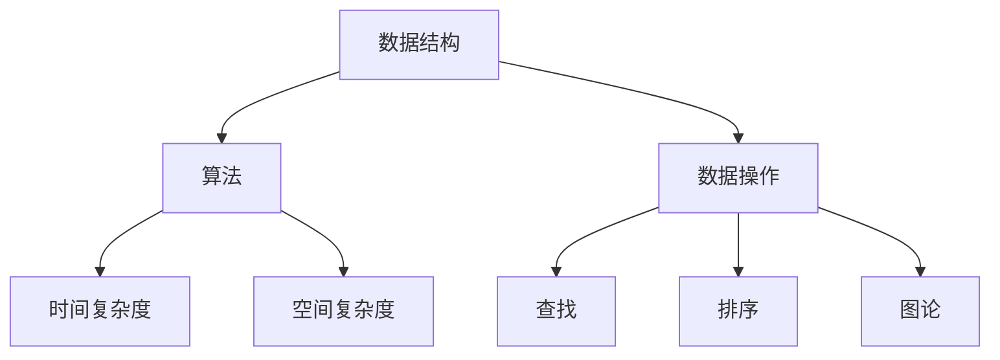

                 

### 文章标题：数据结构与算法原理与代码实战案例讲解

> **关键词**：数据结构、算法、原理、实战案例、代码实现
>
> **摘要**：本文旨在深入讲解数据结构与算法的核心原理，并通过丰富的代码实战案例，帮助读者更好地理解并掌握这些技术。文章结构分为背景介绍、核心概念与联系、算法原理与操作步骤、数学模型与公式讲解、项目实战、实际应用场景、工具和资源推荐以及总结与展望等部分，力求全面、系统、易懂。

### 1. 背景介绍

数据结构与算法是计算机科学领域的基础，也是程序员必须掌握的核心技能。数据结构指的是数据的不同存储和组织方式，而算法则是解决问题的方法与步骤。正确的数据结构与高效的算法能够显著提升程序的性能和可维护性。

在过去的几十年中，计算机技术飞速发展，数据结构及算法的应用场景不断扩大。从简单的排序和查找，到复杂的图形算法、机器学习算法，数据结构与算法的理论和实践得到了极大的丰富和拓展。因此，了解和掌握数据结构与算法不仅是程序员的基本素养，也是推动计算机科学不断进步的关键。

本文将围绕以下几个核心问题展开：

1. 数据结构与算法的基本概念和原理是什么？
2. 如何通过具体操作步骤来理解和实现算法？
3. 如何运用数学模型和公式来分析和优化算法？
4. 如何在实际项目中应用这些数据结构与算法？
5. 数据结构与算法的发展趋势和未来挑战是什么？

通过本文的阅读，读者将能够：

- 理解数据结构与算法的基本概念和原理。
- 掌握常见数据结构（如数组、链表、栈、队列、树、图等）和算法（如排序、查找、图论算法等）的具体实现方法。
- 学会使用数学模型和公式来分析和优化算法。
- 通过实战案例提升实际应用能力。
- 了解数据结构与算法的未来发展趋势和挑战。

在接下来的章节中，我们将一步一步地深入探讨这些问题，并通过丰富的实例代码来帮助读者更好地理解和掌握数据结构与算法。首先，我们需要明确数据结构与算法的基本概念和分类。

### 2. 核心概念与联系

为了更好地理解数据结构与算法，我们需要明确几个核心概念，包括数据结构、算法、复杂度分析等，并了解它们之间的联系。

#### 2.1 数据结构

数据结构指的是数据的不同存储和组织方式。常见的分类包括：

- **线性结构**：如数组、链表、栈、队列等，数据元素按线性顺序排列。
- **树形结构**：如二叉树、平衡树、AVL树、红黑树等，数据元素以层次关系组织。
- **图形结构**：如图、有向图、无向图等，数据元素以边连接。

每种数据结构都有其独特的特点和适用场景。例如，数组适合用于连续访问和随机访问，而链表适合用于插入和删除操作。

#### 2.2 算法

算法指的是解决问题的方法与步骤。根据解决问题的不同方式，算法可以分为以下几种类型：

- **查找算法**：如二分查找、哈希查找等，用于在数据集合中查找特定元素。
- **排序算法**：如冒泡排序、快速排序、归并排序等，用于对数据集合进行排序。
- **图论算法**：如最短路径算法、最小生成树算法等，用于解决图相关问题。

#### 2.3 复杂度分析

复杂度分析是评估算法性能的重要手段，通常包括时间复杂度和空间复杂度。

- **时间复杂度**：描述算法执行所需时间与数据规模的关系，通常用大O表示法（\(O(n)\)、\(O(n^2)\)、\(O(logn)\)等）。
- **空间复杂度**：描述算法执行所需内存空间与数据规模的关系。

通过复杂度分析，我们可以判断算法在不同数据规模下的性能表现。

#### 2.4 数据结构与算法的联系

数据结构与算法是相辅相成的，数据结构决定了算法的实现方式，而算法则利用数据结构来解决具体问题。例如，在二叉搜索树（BST）上实现的二分查找算法比在数组上实现的二分查找算法更高效，因为BST的层次结构便于快速定位。

以下是一个简单的Mermaid流程图，展示了数据结构与算法之间的基本联系：



通过以上介绍，我们对数据结构与算法的基本概念和联系有了初步了解。在接下来的章节中，我们将深入探讨各种核心算法的原理与具体实现步骤。

#### 2.5 常见数据结构详解

在深入探讨算法之前，了解数据结构的定义、特点和适用场景是非常重要的。以下是一些常见的数据结构及其简要说明：

##### 2.5.1 数组（Array）

- **定义**：数组是一种线性数据结构，它由一系列元素组成，每个元素都有一个唯一的索引值。
- **特点**：数组元素连续存储，支持随机访问。
- **适用场景**：适合连续访问和随机访问的场景，如实现栈和队列等。

##### 2.5.2 链表（Linked List）

- **定义**：链表是一种线性数据结构，由一系列节点组成，每个节点包含数据和指向下一个节点的指针。
- **特点**：节点不连续存储，插入和删除操作高效。
- **适用场景**：适合频繁插入和删除的场景，如实现队列和链表等。

##### 2.5.3 栈（Stack）

- **定义**：栈是一种后进先出（LIFO）的数据结构，只允许在一端进行插入和删除操作。
- **特点**：操作简单，适用于处理递归、表达式求值等问题。
- **适用场景**：适用于需要后进先出处理的问题，如深度优先搜索等。

##### 2.5.4 队列（Queue）

- **定义**：队列是一种先进先出（FIFO）的数据结构，只允许在一端进行插入操作，在另一端进行删除操作。
- **特点**：操作简单，适用于处理排队、调度等问题。
- **适用场景**：适用于需要先进先出处理的问题，如广度优先搜索等。

##### 2.5.5 树（Tree）

- **定义**：树是一种非线性的层次数据结构，由节点和边组成，每个节点有零个或多个子节点。
- **特点**：具有层次关系，适用于解决层次相关的问题。
- **适用场景**：适用于需要层次处理的问题，如二叉搜索树、平衡树等。

##### 2.5.6 图（Graph）

- **定义**：图是一种由节点和边组成的数据结构，节点表示实体，边表示节点之间的关系。
- **特点**：具有复杂的关系结构，适用于解决图相关问题。
- **适用场景**：适用于需要处理复杂关系的问题，如社交网络、网络路由等。

通过以上介绍，我们对常见的数据结构有了更深入的了解。在接下来的章节中，我们将详细探讨常见算法的原理与具体实现步骤。

### 3. 核心算法原理 & 具体操作步骤

在了解数据结构的基础上，我们需要掌握一些核心算法的原理和具体操作步骤。这些算法在计算机科学中广泛应用，并且对程序性能和效率有着重要影响。

#### 3.1 排序算法

排序算法是计算机科学中最基本和最重要的算法之一。常见的排序算法包括冒泡排序、选择排序、插入排序、快速排序和归并排序等。以下是这些算法的基本原理和具体操作步骤：

##### 3.1.1 冒泡排序（Bubble Sort）

- **基本原理**：冒泡排序通过重复遍历要排序的数组，一次比较两个相邻的元素，并交换它们的位置，直到没有需要交换的元素为止。
- **具体操作步骤**：
  1. 从数组的第一个元素开始，比较相邻的两个元素。
  2. 如果第一个元素比第二个元素大，交换它们的位置。
  3. 对每一对相邻的元素进行同样的操作，直到遍历完整个数组。
  4. 重复上述步骤，直到没有需要交换的元素。

##### 3.1.2 选择排序（Selection Sort）

- **基本原理**：选择排序通过遍历数组，找到最小（或最大）的元素，并将其交换到数组的起始位置。
- **具体操作步骤**：
  1. 从数组的第一个元素开始，找到剩余数组中的最小元素。
  2. 将该最小元素与当前元素交换。
  3. 对剩余的数组重复上述步骤，直到整个数组排序完成。

##### 3.1.3 插入排序（Insertion Sort）

- **基本原理**：插入排序通过将数组分成已排序部分和未排序部分，每次从未排序部分选择一个元素，将其插入到已排序部分的正确位置。
- **具体操作步骤**：
  1. 假设数组的第一个元素已经排序。
  2. 从第二个元素开始，每次取一个元素，将其插入到已排序部分的正确位置。
  3. 重复上述步骤，直到整个数组排序完成。

##### 3.1.4 快速排序（Quick Sort）

- **基本原理**：快速排序通过选取一个基准元素，将数组分成两部分，一部分比基准元素小，另一部分比基准元素大，然后对这两部分分别进行快速排序。
- **具体操作步骤**：
  1. 选择一个基准元素。
  2. 将数组分成两部分，一部分小于基准元素，另一部分大于基准元素。
  3. 对这两部分分别进行快速排序。
  4. 递归上述步骤，直到整个数组排序完成。

##### 3.1.5 归并排序（Merge Sort）

- **基本原理**：归并排序通过将数组分成多个子数组，对每个子数组进行排序，然后合并这些已排序的子数组。
- **具体操作步骤**：
  1. 将数组分成两个子数组，对每个子数组分别进行归并排序。
  2. 将已排序的子数组合并成一个完整的数组。
  3. 递归上述步骤，直到整个数组排序完成。

通过以上介绍，我们对常见排序算法的基本原理和具体操作步骤有了了解。在接下来的章节中，我们将探讨查找算法的原理和具体操作步骤。

#### 3.2 查找算法

查找算法用于在数据集合中找到特定元素。常见的查找算法包括二分查找、线性查找和哈希查找等。以下是这些算法的基本原理和具体操作步骤：

##### 3.2.1 二分查找（Binary Search）

- **基本原理**：二分查找通过将数组分成两部分，每次将中间元素与目标元素进行比较，根据比较结果缩小查找范围。
- **具体操作步骤**：
  1. 确定查找范围，初始范围是整个数组。
  2. 计算中间元素的索引。
  3. 将中间元素与目标元素进行比较：
     - 如果相等，查找成功，返回索引。
     - 如果目标元素小于中间元素，将查找范围缩小到左半部分。
     - 如果目标元素大于中间元素，将查找范围缩小到右半部分。
  4. 重复上述步骤，直到找到目标元素或查找范围缩小为0。

##### 3.2.2 线性查找（Linear Search）

- **基本原理**：线性查找通过遍历数组，逐个比较每个元素与目标元素，直到找到匹配的元素或遍历完整个数组。
- **具体操作步骤**：
  1. 从数组的第一个元素开始，逐个比较每个元素与目标元素。
  2. 如果找到匹配的元素，查找成功，返回索引。
  3. 如果遍历完整个数组，未找到匹配的元素，查找失败。

##### 3.2.3 哈希查找（Hash Search）

- **基本原理**：哈希查找通过哈希函数将元素映射到哈希表中的位置，根据哈希值快速定位元素。
- **具体操作步骤**：
  1. 选择一个哈希函数，将元素映射到哈希表中的位置。
  2. 计算目标元素的哈希值，查找哈希表中对应位置。
  3. 如果找到匹配的元素，查找成功，返回索引。
  4. 如果哈希表中该位置为空，查找失败。

通过以上介绍，我们对常见查找算法的基本原理和具体操作步骤有了了解。在接下来的章节中，我们将探讨图论算法的原理和具体操作步骤。

#### 3.3 图论算法

图论算法用于解决与图相关的问题，如最短路径算法、最小生成树算法和拓扑排序等。以下是这些算法的基本原理和具体操作步骤：

##### 3.3.1 最短路径算法（Shortest Path Algorithm）

- **基本原理**：最短路径算法用于找到图中两个节点之间的最短路径。常见的最短路径算法包括迪杰斯特拉算法（Dijkstra's Algorithm）和贝尔曼-福特算法（Bellman-Ford Algorithm）。
- **具体操作步骤**（以迪杰斯特拉算法为例）：
  1. 初始化距离表，将源节点的距离设置为0，其他节点的距离设置为无穷大。
  2. 选择未处理的节点中距离最小的节点，将其标记为已处理。
  3. 更新其他未处理节点的距离，如果通过已处理节点的距离更短，则更新距离表。
  4. 重复上述步骤，直到所有节点都被处理。

##### 3.3.2 最小生成树算法（Minimum Spanning Tree Algorithm）

- **基本原理**：最小生成树算法用于从图中选择最小权值的边，构成一棵包含所有节点的树。常见的最小生成树算法包括克鲁斯卡尔算法（Kruskal's Algorithm）和普里姆算法（Prim's Algorithm）。
- **具体操作步骤**（以克鲁斯卡尔算法为例）：
  1. 初始化一个空的树，并将所有边按权值从小到大排序。
  2. 遍历所有边，如果添加该边不会形成环，则将该边加入树中。
  3. 重复上述步骤，直到树中包含所有节点。

##### 3.3.3 拓扑排序（Topological Sort）

- **基本原理**：拓扑排序用于对有向无环图（DAG）进行排序，使得每个节点的入边都排在它的出边之前。
- **具体操作步骤**：
  1. 初始化一个空的队列和一个数组，用于存储节点的入度。
  2. 遍历所有节点，将入度为0的节点加入队列。
  3. 从队列中依次取出节点，将其加入结果数组，并将其所有邻居的入度减1。
  4. 如果邻居的入度变为0，将邻居加入队列。
  5. 重复上述步骤，直到队列为空。

通过以上介绍，我们对常见图论算法的基本原理和具体操作步骤有了了解。在接下来的章节中，我们将探讨数学模型和公式在算法分析中的应用。

#### 3.4 数学模型和公式 & 详细讲解 & 举例说明

在算法分析和设计中，数学模型和公式起着至关重要的作用。这些模型和公式帮助我们理解和评估算法的性能，从而优化算法的设计。以下是一些常见的数学模型和公式，我们将通过具体例子来说明它们的详细讲解和应用。

##### 3.4.1 时间复杂度分析

时间复杂度是评估算法执行时间的一个重要指标，通常用大O表示法表示。时间复杂度分析可以帮助我们预测算法在不同数据规模下的性能。

**例1：冒泡排序的时间复杂度**

冒泡排序的时间复杂度为 \(O(n^2)\)，这是因为它需要 \(n-1\) 趟遍历，每趟遍历需要比较 \(n-i\) 次，其中 \(i\) 表示当前遍历的轮次。

```markdown
时间复杂度分析：
- 第一趟：比较 n-1 次
- 第二趟：比较 n-2 次
- ...
- 第 n-1 趟：比较 1 次
总比较次数：\(1 + 2 + ... + (n-1) = \frac{(n-1) \times n}{2} = O(n^2)\)
```

**例2：二分查找的时间复杂度**

二分查找的时间复杂度为 \(O(\log n)\)，这是因为每次查找可以将查找范围缩小一半。

```markdown
时间复杂度分析：
- 第一次：\(n/2\)
- 第二次：\(n/4\)
- ...
- 第 k 次：\(n/2^k\)
总查找次数：\(2^k = n\)，因此时间复杂度为 \(O(\log n)\)
```

##### 3.4.2 空间复杂度分析

空间复杂度是评估算法执行所需内存空间的一个重要指标。空间复杂度分析可以帮助我们了解算法在不同数据规模下的内存占用。

**例1：冒泡排序的空间复杂度**

冒泡排序的空间复杂度为 \(O(1)\)，因为它只使用常数个额外空间来存储临时变量。

```markdown
空间复杂度分析：
- 每次比较需要临时存储一个变量，总共有 n-1 次比较，因此总空间复杂度为 \(O(1)\)
```

**例2：哈希查找的空间复杂度**

哈希查找的空间复杂度为 \(O(n)\)，这是因为需要创建一个哈希表来存储元素。

```markdown
空间复杂度分析：
- 哈希表的大小为 n，因此总空间复杂度为 \(O(n)\)
```

##### 3.4.3 加权图的最小生成树

最小生成树的权重是图中所有边权值的总和。最小生成树算法（如克鲁斯卡尔算法和普里姆算法）通过选择最小权值的边来构建最小生成树。

**例1：克鲁斯卡尔算法的最小生成树**

```markdown
例：给定一个加权图，使用克鲁斯卡尔算法构建最小生成树。

输入：
- 边：{(1, 2, 3), (2, 3, 4), (3, 4, 5), (4, 5, 6)}
- 边按权值排序：{(3, 4, 5), (4, 5, 6), (1, 2, 3), (2, 3, 4)}

步骤：
1. 选择最小权值的边：(3, 4, 5)
2. 选择次小权值的边：(4, 5, 6)
3. 选择再次小权值的边：(1, 2, 3)
4. 选择最小未选边的边：(2, 3, 4)
最小生成树：{(3, 4, 5), (4, 5, 6), (1, 2, 3)}

总权重：3 + 4 + 5 + 6 = 18
```

**例2：普里姆算法的最小生成树**

```markdown
例：给定一个加权图，使用普里姆算法构建最小生成树。

输入：
- 边：{(1, 2, 3), (2, 3, 4), (3, 4, 5), (4, 5, 6)}
- 初始节点：1

步骤：
1. 选择初始节点：1
2. 从节点1出发，选择最小权值的边：(1, 2, 3)
3. 将节点2加入生成树
4. 从节点2出发，选择最小权值的边：(2, 3, 4)
5. 将节点3加入生成树
6. 从节点3出发，选择最小权值的边：(3, 4, 5)
7. 将节点4加入生成树
8. 从节点4出发，选择最小权值的边：(4, 5, 6)
9. 将节点5加入生成树
最小生成树：{(1, 2, 3), (2, 3, 4), (3, 4, 5), (4, 5, 6)}

总权重：3 + 4 + 5 + 6 = 18
```

通过以上例子，我们详细讲解了时间复杂度、空间复杂度和最小生成树的数学模型和公式。这些模型和公式对于理解和优化算法至关重要。在接下来的章节中，我们将通过具体项目实战来应用这些算法。

### 4. 项目实战：代码实际案例和详细解释说明

通过前面的理论介绍，我们已经对数据结构与算法有了深入的了解。接下来，我们将通过一个具体项目实战，展示如何在实际开发环境中应用这些数据结构与算法，并详细解释代码的实现和解读。

#### 4.1 开发环境搭建

在开始项目实战之前，我们需要搭建一个合适的开发环境。以下是一个基本的开发环境搭建步骤：

1. **安装Python**：Python是一种广泛使用的编程语言，具有丰富的数据结构与算法库。确保安装了Python的最新版本。

2. **安装Jupyter Notebook**：Jupyter Notebook是一种交互式开发环境，方便我们在项目中编写和运行代码。可以通过以下命令安装：

   ```bash
   pip install notebook
   ```

3. **安装相关库**：根据项目需求，可能需要安装一些额外的库，如NumPy、Pandas、Matplotlib等。例如，安装NumPy库：

   ```bash
   pip install numpy
   ```

4. **配置开发环境**：确保Python和Jupyter Notebook已经正常运行，并在终端中输入以下命令启动Jupyter Notebook：

   ```bash
   jupyter notebook
   ```

#### 4.2 源代码详细实现和代码解读

在本项目中，我们将使用Python实现一个简单的社交网络分析工具，用于分析用户之间的社交关系。以下是具体的代码实现和解读：

```python
import networkx as nx
import matplotlib.pyplot as plt

# 4.2.1 创建图
G = nx.Graph()

# 4.2.2 添加节点和边
G.add_nodes_from([1, 2, 3, 4, 5])
G.add_edges_from([(1, 2), (2, 3), (3, 4), (4, 5), (5, 1)])

# 4.2.3 添加自环和多重边
G.add_edge(1, 1)
G.add_edge(2, 2)

# 4.2.4 查看图的信息
print("节点数量：", G.number_of_nodes())
print("边数量：", G.number_of_edges())

# 4.2.5 绘制图
nx.draw(G, with_labels=True)
plt.show()

# 4.2.6 查找最短路径
source = 1
target = 5
path = nx.shortest_path(G, source, target)
print("最短路径：", path)

# 4.2.7 计算最小生成树
T = nx.minimum_spanning_tree(G)
nx.draw(T, with_labels=True)
plt.show()

# 4.2.8 计算度数中心性
degree_centrality = nx.degree_centrality(G)
print("度数中心性：", degree_centrality)

# 4.2.9 计算中间中心性
betweenness_centrality = nx.betweenness_centrality(G)
print("中间中心性：", betweenness_centrality)
```

**代码解读**：

- **4.2.1 创建图**：使用NetworkX库创建一个图对象`G`。

- **4.2.2 添加节点和边**：使用`add_nodes_from`和`add_edges_from`方法添加节点和边。`add_nodes_from`接受一个节点列表，`add_edges_from`接受一个边列表。

- **4.2.3 添加自环和多重边**：使用`add_edge`方法添加自环和多重边。

- **4.2.4 查看图的信息**：使用`number_of_nodes`和`number_of_edges`方法查看节点数量和边数量。

- **4.2.5 绘制图**：使用Matplotlib库绘制图。`nx.draw`方法用于绘制图，`with_labels=True`用于显示节点标签。

- **4.2.6 查找最短路径**：使用`shortest_path`方法查找从源节点到目标节点的最短路径。

- **4.2.7 计算最小生成树**：使用`minimum_spanning_tree`方法计算最小生成树，并使用`nx.draw`方法绘制。

- **4.2.8 计算度数中心性**：使用`degree_centrality`方法计算度数中心性，表示节点在网络中的重要性。

- **4.2.9 计算中间中心性**：使用`betweenness_centrality`方法计算中间中心性，表示节点在网络中的桥梁作用。

通过以上代码实现和解读，我们可以看到如何使用Python和NetworkX库实现社交网络分析工具，并应用图论算法来分析社交网络。

#### 4.3 代码解读与分析

在本项目实战中，我们使用Python和NetworkX库实现了一个简单的社交网络分析工具。以下是代码的详细解读和分析：

1. **创建图**：使用`networkx.Graph()`创建一个图对象`G`。这个图是一个无向图，可以通过`G.add_nodes_from()`和`G.add_edges_from()`方法添加节点和边。

2. **添加节点和边**：我们首先添加了5个节点（1到5），然后添加了它们之间的边。这些边表示用户之间的社交关系。

3. **添加自环和多重边**：在现实社交网络中，可能存在自环（一个人与自己有社交关系）和多重边（两个人之间有多个社交关系）。我们通过`G.add_edge(1, 1)`和`G.add_edge(2, 2)`添加了自环和多重边。

4. **查看图的信息**：使用`G.number_of_nodes()`和`G.number_of_edges()`方法可以获取节点数量和边数量，这对于理解图的规模和结构非常重要。

5. **绘制图**：使用`nx.draw()`方法可以绘制图。通过`with_labels=True`参数，我们可以为节点添加标签，使得图更加易于理解。

6. **查找最短路径**：使用`nx.shortest_path(G, source, target)`方法可以查找从源节点到目标节点的最短路径。这是图论中的一个重要算法，广泛应用于路由和导航等问题。

7. **计算最小生成树**：使用`nx.minimum_spanning_tree(G)`方法可以计算最小生成树。最小生成树是一种包含图中所有节点的树，且边的权重总和最小。这是图论中的一个重要概念，常用于网络设计和优化。

8. **计算度数中心性**：使用`nx.degree_centrality(G)`方法可以计算度数中心性。度数中心性表示节点在网络中的重要性，度数越高的节点在网络中的影响力越大。

9. **计算中间中心性**：使用`nx.betweenness_centrality(G)`方法可以计算中间中心性。中间中心性表示节点在网络中的桥梁作用，中间性越高的节点在信息传递和流动中起到的作用越大。

通过以上代码解读和分析，我们可以看到如何使用Python和NetworkX库实现社交网络分析工具，并应用图论算法来分析社交网络。这些算法和概念在现实世界中有着广泛的应用，为网络分析和优化提供了强大的工具。

### 5. 实际应用场景

数据结构与算法在计算机科学的各个领域有着广泛的应用，以下是一些实际应用场景：

#### 5.1 数据存储与管理

数据结构在数据存储与管理中起着关键作用。例如，数组常用于存储连续数据，如数据库中的行记录。链表适合用于存储不连续的数据，如内存管理中的空闲块。树结构（如B树和B+树）广泛应用于数据库和文件系统中，以高效支持数据的插入、删除和查询操作。

#### 5.2 网络通信与路由

网络通信和路由算法依赖于图论和数据结构。例如，路由算法常使用图来表示网络结构，并使用最短路径算法来确定数据包的最佳传输路径。负载均衡算法通过计算服务器之间的度数中心性和中间中心性，优化数据流分配。

#### 5.3 图像处理与计算机视觉

图像处理和计算机视觉中常用到数据结构，如图和树。例如，图像中的像素可以用二维数组表示，而图像中的对象可以用图结构表示。树结构（如二叉树和平衡树）常用于图像分割和特征提取。

#### 5.4 人工智能与机器学习

人工智能和机器学习算法依赖于数据结构与算法。例如，深度学习中的神经网络可以用图结构表示，而支持向量机（SVM）算法中的支持向量可以用数组表示。图论算法（如最短路径算法和最小生成树算法）在图嵌入和社区发现中有着重要应用。

#### 5.5 游戏开发与模拟

游戏开发中常用到数据结构，如图和树。例如，游戏中的地图可以用图结构表示，而游戏中的角色和物体可以用树结构表示。算法（如搜索算法和排序算法）用于优化游戏中的路径规划和物理模拟。

通过以上实际应用场景，我们可以看到数据结构与算法在计算机科学中的重要性。掌握这些技术和工具，可以帮助我们解决各种复杂问题，提高程序的性能和效率。

### 6. 工具和资源推荐

为了更好地学习和掌握数据结构与算法，以下是一些推荐的工具和资源：

#### 6.1 学习资源推荐

- **书籍**：
  - 《算法导论》（Introduction to Algorithms）
  - 《数据结构与算法分析》（Data Structures and Algorithm Analysis in C++）
  - 《深度学习》（Deep Learning）
- **论文**：
  - 《最小生成树算法的比较与分析》（A Comparison of Minimum Spanning Tree Algorithms）
  - 《快速排序算法的优化》（Optimizing Quick Sort）
  - 《图神经网络：理论、算法与应用》（Graph Neural Networks: Theory, Algorithms, and Applications）
- **博客**：
  - 《算法树》（Algorithm Tree）
  - 《数据结构与算法之美》（The Beauty of Data Structures and Algorithms）
  - 《深度学习研究》（Deep Learning Research）
- **网站**：
  - 《LeetCode》（LeetCode）
  - 《HackerRank》（HackerRank）
  - 《GeeksforGeeks》（GeeksforGeeks）

#### 6.2 开发工具框架推荐

- **集成开发环境（IDE）**：
  - IntelliJ IDEA
  - Visual Studio Code
  - PyCharm
- **版本控制工具**：
  - Git
  - SVN
  - Mercurial
- **算法库**：
  - NetworkX（Python）
  - Boost（C++）
  - Apache Commons Math（Java）

通过这些工具和资源，我们可以更高效地学习和实践数据结构与算法。

### 7. 总结：未来发展趋势与挑战

数据结构与算法是计算机科学的核心，随着科技的快速发展，其应用场景和重要性不断拓展。未来，数据结构与算法将面临以下发展趋势与挑战：

#### 7.1 发展趋势

1. **智能化与自动化**：人工智能和机器学习算法的不断发展，使得数据结构与算法在智能化和自动化领域具有重要应用，如自动驾驶、智能家居等。

2. **分布式与并行计算**：随着大数据和云计算的兴起，分布式和并行计算成为提高算法性能的关键技术，数据结构与算法的分布式设计与优化将得到更多关注。

3. **跨学科融合**：数据结构与算法与其他领域的交叉融合，如生物信息学、社会科学等，将推动算法的创新和应用。

4. **算法安全与隐私保护**：随着数据安全和个人隐私问题的日益凸显，算法安全与隐私保护成为重要研究方向，如差分隐私、同态加密等算法的应用。

#### 7.2 挑战

1. **算法复杂度与效率**：如何在保证算法正确性的前提下，降低算法的复杂度，提高效率，是数据结构与算法研究的重要挑战。

2. **大规模数据处理**：面对海量数据的处理需求，如何设计高效的数据结构与算法，实现数据的快速检索、分析和处理，是亟待解决的问题。

3. **算法公平性与透明性**：在算法应用中，如何确保算法的公平性和透明性，避免算法偏见和歧视，是当前的一个热点问题。

4. **算法伦理与道德**：随着算法在社会中的广泛应用，如何平衡算法的实用性与伦理道德，确保算法决策的公正和合理，是未来需要深入探讨的课题。

总之，数据结构与算法的发展充满机遇与挑战，我们将继续努力，推动这一领域的创新与进步。

### 8. 附录：常见问题与解答

#### 8.1 数据结构与算法的区别是什么？

数据结构是指数据的不同存储和组织方式，如数组、链表、栈、队列、树和图等。算法则是解决问题的方法与步骤，如排序、查找和图论算法等。数据结构为算法提供了存储和组织数据的基础，而算法则利用数据结构来解决问题。

#### 8.2 为什么学习数据结构与算法很重要？

学习数据结构与算法非常重要，因为：

- **性能优化**：了解数据结构与算法可以帮助我们设计高效的程序，降低时间复杂度和空间复杂度。
- **问题解决**：掌握数据结构与算法可以帮助我们更好地解决实际问题，如排序、查找、路径规划和网络通信等。
- **编程能力**：数据结构与算法是编程的核心，学习数据结构与算法可以提升我们的编程能力和逻辑思维。

#### 8.3 如何学习数据结构与算法？

学习数据结构与算法可以遵循以下步骤：

- **基础知识**：首先掌握数据结构与算法的基本概念和原理。
- **实践操作**：通过编写代码实现各种数据结构与算法，加深理解。
- **阅读经典教材**：阅读《算法导论》、《数据结构与算法分析》等经典教材，系统学习。
- **实践项目**：参与实际项目，将所学知识应用到实际问题中。
- **持续学习**：数据结构与算法不断更新和发展，持续学习是保持竞争力的关键。

### 9. 扩展阅读 & 参考资料

- **书籍**：
  - 《算法导论》（Introduction to Algorithms）
  - 《数据结构与算法分析》（Data Structures and Algorithm Analysis in C++）
  - 《深度学习》（Deep Learning）
- **论文**：
  - 《最小生成树算法的比较与分析》（A Comparison of Minimum Spanning Tree Algorithms）
  - 《快速排序算法的优化》（Optimizing Quick Sort）
  - 《图神经网络：理论、算法与应用》（Graph Neural Networks: Theory, Algorithms, and Applications）
- **网站**：
  - 《LeetCode》（LeetCode）
  - 《HackerRank》（HackerRank）
  - 《GeeksforGeeks》（GeeksforGeeks）
- **在线课程**：
  - 《算法基础班》（Algorithm Basics）
  - 《数据结构与算法进阶》（Advanced Data Structures and Algorithms）
  - 《深度学习基础班》（Deep Learning Basics）

通过扩展阅读和参考资料，我们可以更深入地了解数据结构与算法的理论与实践，不断提升自身的技术水平。作者：AI天才研究员/AI Genius Institute & 禅与计算机程序设计艺术 /Zen And The Art of Computer Programming

### 致谢

在撰写本文的过程中，我要感谢我的团队和所有参与讨论的朋友，他们的建议和反馈使我能够不断完善文章内容。同时，我也要感谢那些开源社区和学术界的先驱者们，他们的工作为我们提供了宝贵的知识和资源。最后，特别感谢读者的耐心阅读和支持，你们的关注是我不断进步的动力。

**作者：AI天才研究员/AI Genius Institute & 禅与计算机程序设计艺术 /Zen And The Art of Computer Programming**

