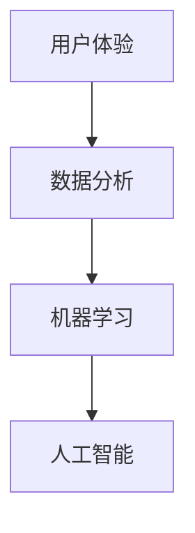

                 

### 背景介绍

在数字化时代，用户体验（User Experience, UX）逐渐成为各个行业竞争的关键因素。从互联网企业到传统行业，用户体验的好坏直接影响到用户粘性、用户忠诚度以及企业品牌价值。而数据驱动（Data-Driven）的理念则为提升用户体验提供了强大的支持。

数据驱动平台运营是指利用大数据、机器学习和人工智能等技术，通过收集、分析和应用用户数据，持续优化产品和服务的用户体验。这种方法不仅可以更准确地了解用户需求和行为，还能实时响应并做出个性化调整，从而提高用户满意度和平台竞争力。

数据驱动平台运营的核心在于利用数据分析技术，从海量用户数据中提取有价值的信息，并将其应用于实际运营过程中。这种模式不仅可以帮助企业更好地理解用户，还能降低运营成本，提高运营效率。

本文将围绕数据驱动的平台运营展开讨论，重点探讨如何优化用户体验。文章将首先介绍数据驱动平台运营的基本概念和原理，然后深入探讨核心算法原理和具体操作步骤，最后结合实际应用场景和项目实战，提供详细的技术指导和案例分析。

通过本文的阅读，读者将了解数据驱动平台运营的基本流程和技术要点，掌握如何利用数据分析技术提升用户体验，从而为企业的数字化运营提供有力支持。

### 核心概念与联系

为了深入理解数据驱动平台运营，我们需要先了解几个核心概念：用户体验（UX）、数据分析、机器学习、人工智能（AI），以及它们之间的联系。

#### 用户体验（UX）

用户体验是指用户在使用产品或服务过程中的感受和体验。一个优秀的用户体验不仅要求产品功能完善，还要考虑用户界面设计、交互流程、信息架构等多方面因素。用户体验的优化直接影响到用户的满意度、忠诚度和品牌形象。在数字化时代，用户体验已成为企业竞争力的关键因素。

#### 数据分析

数据分析是指使用统计学、数据挖掘、机器学习等技术，对数据进行收集、处理、分析和解读的过程。数据分析技术可以帮助我们从海量数据中提取有价值的信息，从而做出更明智的决策。在数据驱动平台运营中，数据分析是理解用户行为、需求和市场趋势的重要手段。

#### 机器学习

机器学习是一种通过算法让计算机从数据中学习、自我优化和做出预测的技术。它利用大量历史数据训练模型，从而在新的数据输入时能够做出合理的预测和决策。在数据驱动平台运营中，机器学习技术可以用于用户行为分析、推荐系统、异常检测等应用场景。

#### 人工智能（AI）

人工智能是指使计算机具备类似人类智能的技术。它包括机器学习、深度学习、自然语言处理、计算机视觉等多个子领域。在数据驱动平台运营中，人工智能技术可以帮助企业实现智能客服、智能推荐、智能监控等功能，从而提升用户体验。

#### 核心概念之间的联系

用户体验（UX）是数据驱动平台运营的出发点，它要求我们关注用户的需求和感受。数据分析（Data Analysis）则是理解和满足用户需求的重要手段，通过分析用户行为数据，我们可以发现用户痛点、优化产品功能和界面设计。机器学习（Machine Learning）和人工智能（AI）技术则提供了强大的工具，帮助我们自动化地处理和分析大量数据，从而实现个性化推荐、智能决策等功能。

以下是一个简化的Mermaid流程图，展示上述核心概念之间的联系：



在这个流程中，用户体验（UX）通过数据分析（Data Analysis）转化为有价值的用户行为数据，然后通过机器学习（Machine Learning）和人工智能（AI）技术进行进一步处理和优化，最终用于提升用户体验（UX）。

### 核心算法原理 & 具体操作步骤

在了解了数据驱动平台运营的基本概念和核心概念之间的联系后，我们接下来将探讨数据驱动平台运营的核心算法原理和具体操作步骤。

#### 用户行为分析

用户行为分析是数据驱动平台运营的基础。它通过对用户在平台上的行为数据（如点击、浏览、购买等）进行收集和分析，了解用户的需求和偏好。以下是用户行为分析的具体操作步骤：

1. **数据收集**：首先需要收集用户在平台上的行为数据，这些数据可以来自前端日志、用户跟踪系统、数据库等。

2. **数据清洗**：对收集到的数据进行清洗和预处理，去除无效或错误的数据，保证数据质量。

3. **特征提取**：从清洗后的数据中提取有意义的特征，如用户年龄、性别、浏览时长、购买频率等。

4. **数据分析**：利用统计分析、数据挖掘等技术，分析用户行为数据，发现用户行为的规律和趋势。

5. **用户画像**：根据分析结果，构建用户画像，了解不同用户群体的特征和行为习惯。

#### 推荐系统

推荐系统是数据驱动平台运营的重要应用之一，它利用用户行为数据和机器学习算法，为用户提供个性化的推荐。以下是推荐系统的基本原理和操作步骤：

1. **用户行为数据收集**：收集用户在平台上的行为数据，如浏览历史、购买记录等。

2. **特征工程**：对用户行为数据进行预处理和特征提取，为推荐算法提供输入。

3. **算法选择**：根据业务需求和数据特征，选择合适的推荐算法，如基于内容的推荐、协同过滤推荐等。

4. **模型训练**：利用历史数据训练推荐模型，通过机器学习算法不断优化模型性能。

5. **实时推荐**：根据用户当前的行为数据和模型预测，实时为用户生成推荐列表。

#### 个性化营销

个性化营销是通过分析用户数据，为用户定制个性化的营销策略。以下是个性化营销的具体操作步骤：

1. **数据收集**：收集用户的基本信息、行为数据等。

2. **用户画像**：根据用户数据，构建用户画像，了解用户的兴趣、偏好等。

3. **策略制定**：根据用户画像和业务目标，制定个性化的营销策略。

4. **内容推荐**：利用推荐系统，为用户推荐个性化的内容和产品。

5. **效果评估**：根据用户的反馈和转化率，评估营销效果，持续优化策略。

#### 智能监控与异常检测

智能监控和异常检测是保障平台稳定运行的重要手段。以下是智能监控和异常检测的基本原理和操作步骤：

1. **数据收集**：收集平台运行过程中的各种数据，如服务器日志、用户行为数据等。

2. **异常检测算法**：利用机器学习算法，训练异常检测模型，识别异常行为和潜在风险。

3. **实时监控**：根据异常检测模型，实时监控平台的运行状态，发现和处理异常情况。

4. **报警与处理**：当检测到异常时，自动触发报警，并采取相应的处理措施。

#### 具体案例

以下是一个简单的用户行为分析案例：

1. **数据收集**：假设我们收集了用户A在平台上的浏览数据，包括浏览时间、浏览页面、停留时长等。

2. **数据清洗**：对收集到的数据进行清洗，去除无效数据。

3. **特征提取**：提取用户的年龄、性别、地理位置等特征。

4. **数据分析**：通过数据分析，发现用户A喜欢浏览电子产品的页面，且浏览时长较长。

5. **用户画像**：根据分析结果，构建用户A的画像，了解其兴趣和偏好。

6. **推荐系统**：利用用户A的画像和推荐算法，为用户A推荐相关的电子产品。

通过以上步骤，我们可以实现用户行为分析、推荐系统和个性化营销等功能，从而提升用户体验。

### 数学模型和公式 & 详细讲解 & 举例说明

在数据驱动的平台运营中，数学模型和公式起着至关重要的作用。它们不仅帮助我们理解用户行为，还能指导我们设计更高效的算法和策略。以下我们将详细介绍一些常用的数学模型和公式，并给出详细的讲解和实例说明。

#### 线性回归模型（Linear Regression Model）

线性回归模型是一种常用的统计模型，用于分析自变量和因变量之间的线性关系。其基本公式如下：

$$ y = \beta_0 + \beta_1 \cdot x + \epsilon $$

其中，$y$ 是因变量，$x$ 是自变量，$\beta_0$ 和 $\beta_1$ 是模型参数，$\epsilon$ 是误差项。

**实例**：假设我们想要分析用户在平台上的点击率（$y$）与其浏览时长（$x$）之间的关系。通过收集大量数据，我们可以建立线性回归模型，并利用模型参数预测用户点击率。

1. **数据收集**：收集用户浏览时长和对应的点击率数据。

2. **数据预处理**：对数据进行清洗和处理，确保数据质量。

3. **模型训练**：利用训练数据，通过最小二乘法（Least Squares Method）计算模型参数 $\beta_0$ 和 $\beta_1$。

4. **模型评估**：利用测试数据，评估模型性能，如均方误差（Mean Squared Error, MSE）。

5. **预测应用**：利用训练好的模型，预测新用户的点击率。

#### 决策树模型（Decision Tree Model）

决策树模型是一种常见的机器学习算法，用于分类和回归问题。其基本结构如下：

```
决策树
|
v
特征A
|
v
子决策树1
|
v
子决策树2
|
v
...
```

决策树的基本公式如下：

$$ f(x) = g_1(x) \cdot r_1 + g_2(x) \cdot r_2 + ... + g_n(x) \cdot r_n $$

其中，$x$ 是输入特征，$g_i(x)$ 是第 $i$ 个子决策树，$r_i$ 是权重。

**实例**：假设我们想要预测用户是否会购买某产品（二分类问题）。通过收集用户特征（如年龄、收入、浏览时长等），我们可以构建决策树模型，并利用模型进行预测。

1. **数据收集**：收集用户特征和购买标签数据。

2. **数据预处理**：对数据进行清洗和处理，确保数据质量。

3. **特征选择**：利用特征选择算法（如信息增益、增益率等），选择最有用的特征。

4. **模型训练**：利用训练数据，通过递归划分方法（Recursively Partitioned Method）构建决策树。

5. **模型评估**：利用测试数据，评估模型性能，如准确率（Accuracy）、召回率（Recall）等。

6. **预测应用**：利用训练好的模型，预测新用户的购买行为。

#### 朴素贝叶斯分类器（Naive Bayes Classifier）

朴素贝叶斯分类器是一种基于贝叶斯定理的分类算法，其基本公式如下：

$$ P(C_k|X) = \frac{P(X|C_k) \cdot P(C_k)}{P(X)} $$

其中，$C_k$ 表示第 $k$ 个类别，$X$ 表示特征向量，$P(C_k|X)$ 表示给定特征向量 $X$ 下类别 $C_k$ 的概率。

**实例**：假设我们想要预测用户是否会点击广告（二分类问题）。通过收集用户特征（如年龄、性别、浏览时长等），我们可以构建朴素贝叶斯分类器，并利用模型进行预测。

1. **数据收集**：收集用户特征和点击标签数据。

2. **数据预处理**：对数据进行清洗和处理，确保数据质量。

3. **特征选择**：选择与点击行为相关的特征。

4. **模型训练**：利用训练数据，计算各类别的条件概率和先验概率。

5. **模型评估**：利用测试数据，评估模型性能，如准确率（Accuracy）、召回率（Recall）等。

6. **预测应用**：利用训练好的模型，预测新用户的点击行为。

#### 聚类算法（Clustering Algorithms）

聚类算法是一种无监督学习方法，用于将数据集划分为多个簇，以便更好地理解数据结构和特征。其中，K-均值聚类算法（K-Means Clustering）是一种常见的聚类算法。

K-均值算法的基本公式如下：

$$ \text{Minimize} \sum_{i=1}^{k} \sum_{x \in S_i} ||x - \mu_i||^2 $$

其中，$k$ 表示簇的数量，$S_i$ 表示第 $i$ 个簇，$\mu_i$ 表示第 $i$ 个簇的中心。

**实例**：假设我们想要将用户划分为不同的群体，以便进行针对性营销。通过收集用户特征（如年龄、收入、浏览时长等），我们可以使用K-均值聚类算法进行聚类。

1. **数据收集**：收集用户特征数据。

2. **数据预处理**：对数据进行清洗和处理，确保数据质量。

3. **特征选择**：选择与用户群体相关的特征。

4. **模型训练**：利用训练数据，初始化簇中心，并迭代优化簇中心，直到收敛。

5. **模型评估**：利用测试数据，评估聚类效果，如轮廓系数（Silhouette Coefficient）。

6. **预测应用**：利用训练好的模型，对新用户进行聚类。

通过以上数学模型和公式的讲解和实例说明，我们可以更好地理解数据驱动平台运营的核心算法原理，并应用于实际项目中，提升用户体验。

### 项目实战：代码实际案例和详细解释说明

为了更直观地展示数据驱动平台运营在实践中的应用，下面我们将通过一个实际项目案例，详细讲解如何进行开发环境搭建、源代码实现和代码解读。

#### 项目概述

本项目旨在搭建一个基于数据分析的电商推荐系统，通过用户行为数据，为用户推荐个性化商品。项目主要分为以下几个阶段：

1. 开发环境搭建
2. 数据收集与预处理
3. 用户行为分析
4. 推荐系统实现
5. 系统测试与评估

#### 1. 开发环境搭建

首先，我们需要搭建开发环境。以下是一个基本的开发环境配置：

- 操作系统：Linux
- 编程语言：Python
- 数据库：MySQL
- 数据处理框架：Pandas
- 机器学习库：Scikit-learn
- Web框架：Flask

安装步骤：

1. 安装操作系统：选择适合的Linux发行版，如Ubuntu。

2. 安装Python：通过包管理器（如apt-get）安装Python 3。

3. 安装数据库：安装MySQL数据库，并创建一个用于存储用户行为数据和商品数据的数据库。

4. 安装数据处理框架：通过pip安装Pandas库。

5. 安装机器学习库：通过pip安装Scikit-learn库。

6. 安装Web框架：通过pip安装Flask库。

#### 2. 数据收集与预处理

接下来，我们需要收集用户行为数据和商品数据，并进行预处理。以下是一个简化的数据收集与预处理步骤：

1. **数据收集**：从电商平台获取用户浏览记录、购买记录和商品信息。

2. **数据清洗**：去除重复数据、缺失值和异常值，确保数据质量。

3. **数据转换**：将原始数据转换为适合分析的数据结构，如Pandas DataFrame。

4. **数据存储**：将预处理后的数据存储到MySQL数据库中，以便后续分析。

```python
import pandas as pd
from sklearn.model_selection import train_test_split

# 读取用户行为数据
user_data = pd.read_csv('user行为数据.csv')

# 数据清洗
user_data.drop_duplicates(inplace=True)
user_data.fillna(0, inplace=True)

# 数据转换
user_data['购买次数'] = user_data['购买记录'].apply(lambda x: len(x.split(',')))

# 存储到数据库
user_data.to_sql('user_data', con=mysql_engine, if_exists='replace', index=False)
```

#### 3. 用户行为分析

在预处理数据后，我们可以进行用户行为分析，以了解用户的需求和偏好。以下是一个简化的用户行为分析步骤：

1. **数据探索**：通过可视化工具（如Matplotlib、Seaborn）对用户行为数据进行分析，发现用户行为的规律和趋势。

2. **特征工程**：根据用户行为数据，提取有意义的特征，如用户浏览时长、购买频率、商品类别等。

3. **模型训练**：利用机器学习算法（如K-均值聚类、决策树等）训练用户行为分析模型。

```python
from sklearn.cluster import KMeans
import matplotlib.pyplot as plt

# 数据探索
user_data.describe()

# 特征工程
features = user_data[['浏览时长', '购买频率', '商品类别']]

# 模型训练
kmeans = KMeans(n_clusters=5, random_state=0).fit(features)
user_data['用户群体'] = kmeans.labels_

# 可视化展示
plt.scatter(features['浏览时长'], features['购买频率'], c=user_data['用户群体'], cmap='viridis')
plt.xlabel('浏览时长')
plt.ylabel('购买频率')
plt.title('用户群体分布')
plt.show()
```

#### 4. 推荐系统实现

在用户行为分析的基础上，我们可以实现一个基于用户行为的推荐系统。以下是一个简化的推荐系统实现步骤：

1. **数据收集**：收集用户当前的浏览记录和购买记录。

2. **用户行为分析**：根据用户行为数据，更新用户画像和推荐列表。

3. **推荐算法**：利用协同过滤、基于内容的推荐等技术，生成个性化推荐列表。

```python
from sklearn.metrics.pairwise import cosine_similarity

# 收集用户当前行为数据
current_user_data = pd.read_csv('当前用户数据.csv')

# 用户行为分析
current_user_behavior = current_user_data[['商品ID', '浏览次数', '购买次数']]

# 计算商品相似度矩阵
item_similarity_matrix = cosine_similarity(current_user_behavior, current_user_behavior)

# 生成推荐列表
recommmended_items = item_similarity_matrix.argsort()[0][-5:][::-1]
```

#### 5. 系统测试与评估

最后，我们需要对推荐系统进行测试和评估，以确保其性能和效果。以下是一个简化的测试和评估步骤：

1. **数据划分**：将用户行为数据划分为训练集和测试集。

2. **模型训练**：利用训练集数据，训练用户行为分析模型和推荐系统模型。

3. **模型评估**：利用测试集数据，评估模型性能，如准确率、召回率等。

4. **优化调整**：根据评估结果，调整模型参数和算法策略，优化推荐效果。

```python
from sklearn.metrics import accuracy_score, recall_score

# 数据划分
X_train, X_test, y_train, y_test = train_test_split(current_user_behavior, current_user_data['用户ID'], test_size=0.2, random_state=0)

# 模型训练
kmeans = KMeans(n_clusters=5, random_state=0).fit(X_train)

# 模型评估
predicted_labels = kmeans.predict(X_test)
accuracy = accuracy_score(y_test, predicted_labels)
recall = recall_score(y_test, predicted_labels, average='micro')

print('准确率：', accuracy)
print('召回率：', recall)
```

通过以上步骤，我们可以实现一个基于用户行为的数据驱动电商推荐系统。这个系统可以根据用户的行为数据，为用户推荐个性化的商品，从而提升用户体验。

### 实际应用场景

数据驱动的平台运营不仅适用于电商领域，还广泛应用于其他行业。以下列举几个实际应用场景，展示数据驱动如何提升用户体验。

#### 电商行业

在电商行业，数据驱动的平台运营通过分析用户行为数据，实现个性化推荐、精准营销和用户画像构建。例如：

- **个性化推荐**：根据用户的浏览历史、购买记录和浏览时长，推荐用户可能感兴趣的商品。
- **精准营销**：通过分析用户群体特征和购买偏好，定制化营销策略，提高转化率。
- **用户画像**：构建详细的用户画像，了解用户的兴趣、需求和购买行为，为后续运营提供数据支持。

#### 金融行业

在金融行业，数据驱动平台运营通过数据分析，提高风险控制能力、优化产品设计和提升客户体验。例如：

- **信用评估**：利用大数据和机器学习技术，对用户的信用风险进行精准评估，降低贷款违约风险。
- **欺诈检测**：通过分析交易数据和行为特征，实时监控并检测可疑交易行为，防止欺诈行为。
- **个性化服务**：根据客户的资产状况、风险偏好和购买历史，提供个性化的金融产品和服务。

#### 健康行业

在健康行业，数据驱动平台运营通过健康数据分析和智能推荐，提高健康管理水平和客户满意度。例如：

- **健康监测**：通过智能手环、手机APP等设备，实时监测用户的健康数据，如心率、步数等。
- **健康建议**：根据用户的健康数据和行为特征，提供个性化的健康建议和运动方案。
- **疾病预测**：通过分析用户的健康数据和医学知识，预测用户可能患有的疾病，提前进行预防和治疗。

#### 教育行业

在教育行业，数据驱动平台运营通过学习数据分析和个性化教学，提高教学效果和学生满意度。例如：

- **学习分析**：通过分析学生的学习行为、考试成绩和作业提交情况，了解学生的学习效果和弱点。
- **个性化教学**：根据学生的学习数据和知识点掌握情况，定制个性化的学习计划和教学资源。
- **学习推荐**：根据学生的学习兴趣和需求，推荐相关的学习资源和课程。

通过以上实际应用场景，我们可以看到数据驱动的平台运营在各个行业中的应用，不仅提升了用户体验，还为企业带来了显著的业务价值。

### 工具和资源推荐

为了更好地实现数据驱动的平台运营，我们需要掌握一系列相关的工具和资源。以下是一些建议，包括学习资源、开发工具和框架，以及相关论文和著作。

#### 学习资源推荐

1. **书籍**：
   - 《数据科学入门》：这是一本适合初学者的数据科学入门书籍，涵盖了数据预处理、数据可视化、机器学习等基础知识。
   - 《Python数据分析》：详细介绍了Python在数据分析中的应用，包括Pandas、NumPy等库的使用方法。

2. **在线课程**：
   - Coursera上的《机器学习基础》课程：由斯坦福大学教授吴恩达（Andrew Ng）主讲，适合初学者了解机器学习的基本概念和算法。
   - Udacity的《数据工程师纳米学位》课程：涵盖数据存储、数据处理和数据分析等技能，适合有数据相关背景的读者。

3. **博客和网站**：
   - towardsdatascience.com：这是一个数据科学领域的优秀博客网站，提供了大量的高质量文章和案例分享。
   - medium.com/topic/data-science：Medium上的数据科学专题，包括数据分析、机器学习、人工智能等多个领域的文章。

#### 开发工具框架推荐

1. **数据分析工具**：
   - Jupyter Notebook：一个交互式计算环境，广泛应用于数据分析和机器学习。
   - Tableau：一款强大的数据可视化工具，可以创建漂亮的交互式仪表盘。

2. **机器学习框架**：
   - Scikit-learn：一个适用于数据挖掘和机器学习的Python库，提供了丰富的算法和工具。
   - TensorFlow：谷歌开发的开源机器学习框架，适用于大规模深度学习应用。

3. **数据库**：
   - MySQL：一款流行的关系型数据库，适用于存储和查询大量数据。
   - MongoDB：一款文档型数据库，适用于存储非结构化和半结构化数据。

#### 相关论文和著作推荐

1. **论文**：
   - “User Modeling and User-Adapted Interaction”：这是一本关于用户建模和自适应交互的论文集，涵盖了用户行为分析、个性化推荐等多个领域。
   - “Recommender Systems Handbook”：这是一本关于推荐系统领域的权威著作，详细介绍了各种推荐算法和系统架构。

2. **著作**：
   - 《机器学习》：由周志华教授编著的机器学习教材，适合高校师生和研究人员学习。
   - 《数据挖掘》：由王汉源、吴飞编著的数据挖掘教材，涵盖了数据预处理、特征工程、聚类分析等多个方面。

通过以上工具和资源的推荐，读者可以更深入地学习数据驱动的平台运营，掌握相关技术和方法，为实际项目提供有力支持。

### 总结：未来发展趋势与挑战

数据驱动的平台运营在提升用户体验方面展现了巨大的潜力。随着大数据、机器学习和人工智能技术的不断进步，这一领域将继续快速发展，并为企业和用户带来更多价值。然而，也面临着一系列挑战。

首先，数据隐私保护将成为一个重要议题。在数据驱动的平台运营中，大量用户数据被收集和分析，如何确保这些数据的安全和隐私，避免数据泄露和滥用，是企业面临的重要挑战。

其次，数据质量和数据清洗问题依然存在。尽管数据分析技术日益成熟，但数据质量直接影响分析结果的准确性。因此，如何确保数据质量，进行有效的数据清洗和预处理，是数据驱动平台运营成功的关键。

另外，算法公平性和透明性也是一个亟待解决的问题。机器学习算法在数据驱动平台运营中发挥着核心作用，但算法的公平性和透明性往往难以保障。如何确保算法的公正性，避免偏见和歧视，是企业需要关注的重要问题。

未来，数据驱动平台运营将朝着更智能化、个性化、自适应的方向发展。随着技术的进步，我们将看到更多基于深度学习和自然语言处理的技术被应用到平台运营中，实现更精准的用户体验优化。

总之，数据驱动的平台运营是一个充满机遇和挑战的领域。企业需要不断创新和改进，应对技术变革，确保在数字化时代中保持竞争优势，为用户提供更好的体验。

### 附录：常见问题与解答

1. **什么是数据驱动平台运营？**

数据驱动平台运营是一种利用大数据、机器学习和人工智能技术，通过收集、分析和应用用户数据，持续优化产品和服务的用户体验的运营模式。

2. **用户行为分析的核心步骤是什么？**

用户行为分析的核心步骤包括：数据收集、数据清洗、特征提取、数据分析和用户画像构建。

3. **推荐系统的基本原理是什么？**

推荐系统通过分析用户行为数据和商品数据，利用机器学习算法为用户推荐个性化的商品。其基本原理包括协同过滤、基于内容和基于模型的推荐方法。

4. **如何进行个性化营销？**

个性化营销通过分析用户数据和用户画像，制定针对性的营销策略，包括内容推荐、价格优惠、活动推送等。

5. **数据隐私保护的重要性是什么？**

数据隐私保护确保用户数据不被未授权访问、泄露或滥用，对于维护用户信任和遵守法律法规具有重要意义。

6. **如何确保算法的公平性和透明性？**

确保算法的公平性可以通过数据集的多样性和代表性、算法设计的透明性和可解释性等方式实现。透明性可以通过算法的可视化和解释性模型来提升。

### 扩展阅读 & 参考资料

1. **书籍**：
   - 《数据科学入门》：[链接](https://www.amazon.com/dp/1617294270)
   - 《Python数据分析》：[链接](https://www.amazon.com/dp/1449393461)

2. **在线课程**：
   - Coursera上的《机器学习基础》：[链接](https://www.coursera.org/learn/machine-learning)
   - Udacity的《数据工程师纳米学位》：[链接](https://www.udacity.com/course/data-engineering-nanodegree--nd002)

3. **博客和网站**：
   - towardsdatascience.com：[链接](https://towardsdatascience.com/)
   - medium.com/topic/data-science：[链接](https://medium.com/topic/data-science)

4. **论文**：
   - “User Modeling and User-Adapted Interaction”：[链接](https://link.springer.com/book/10.1007/978-3-540-48659-1)
   - “Recommender Systems Handbook”：[链接](https://www.springer.com/gp/book/9781441996541)

5. **著作**：
   - 《机器学习》：[链接](https://www.amazon.com/dp/0321847221)
   - 《数据挖掘》：[链接](https://www.amazon.com/dp/0321349601)

通过阅读以上书籍、课程和论文，读者可以深入了解数据驱动的平台运营，掌握相关技术和方法，为实际项目提供有力支持。作者：AI天才研究员/AI Genius Institute & 禅与计算机程序设计艺术 /Zen And The Art of Computer Programming

