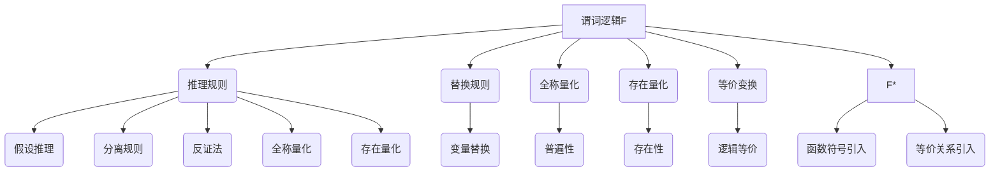

                 

# 数理逻辑：谓词逻辑F和F*的形成规则

## 摘要

本文将深入探讨数理逻辑中的谓词逻辑F和F*的形成规则，以及它们在实际应用中的重要性。首先，我们将简要介绍谓词逻辑的基本概念和原理，随后逐步展开对F和F*的形成规则的详细分析。通过具体例子和数学模型，我们将解释这些规则如何应用于实际的计算问题，并探讨其优缺点。最后，我们将讨论这些逻辑形式在实际应用中的广泛场景，并提供相关的学习资源和开发工具，以帮助读者更好地理解和应用谓词逻辑。

## 1. 背景介绍

数理逻辑是研究数学表达式的结构和推理规则的学科，其核心目标是理解和分析数学语言的真值和推导能力。在数理逻辑中，谓词逻辑是一种重要的逻辑形式，它用于表示和推理具有复杂结构的关系和属性。谓词逻辑不仅广泛应用于数学和哲学领域，还在计算机科学、人工智能和形式化验证等领域发挥着重要作用。

谓词逻辑起源于古希腊哲学家亚里士多德的逻辑学，其核心概念是谓词。谓词是用于描述对象或性质的语句，它可以是一个简单的属性（如“红色的”），也可以是一个复杂的关系（如“大于”）。通过使用谓词，我们可以构建复杂的逻辑表达式，用于表示和推理各种数学和现实世界中的关系。

在谓词逻辑中，F和F*是两种重要的逻辑形式。F，即谓词逻辑F，是一种基于谓词演算的逻辑系统，它通过引入量词和存在量词来表示普遍性和存在性。F*，即谓词逻辑F*，是在F的基础上扩展的更强大的逻辑系统，它引入了函数符号和等价关系，从而能够处理更复杂的逻辑表达式。

谓词逻辑F和F*的形成规则是谓词逻辑中的核心组成部分。这些规则定义了如何从基本的逻辑公式推导出新的逻辑公式，从而实现逻辑推理和证明。形成规则包括替换规则、归纳规则和构造规则等，它们共同构成了谓词逻辑的推理框架。

理解谓词逻辑F和F*的形成规则对于深入掌握数理逻辑具有重要意义。这些规则不仅提供了逻辑推理的工具，还为形式化验证和形式化证明提供了理论基础。通过学习和应用这些规则，我们可以更好地理解和处理复杂的逻辑问题，从而推动数理逻辑在各个领域的应用。

## 2. 核心概念与联系

### 谓词逻辑的基本概念

在深入探讨谓词逻辑F和F*的形成规则之前，我们首先需要理解谓词逻辑的基本概念和原理。谓词逻辑是一种基于谓词（Predicate）的命题逻辑，它用于表示和推理具有复杂结构的关系和属性。谓词是用于描述对象或性质的语句，它可以是一个简单的属性（如“红色的”），也可以是一个复杂的关系（如“大于”）。

一个谓词通常由一个谓词符号（Predicate Symbol）和一组参数（Arguments）组成。例如，“P(x)”是一个谓词，其中P是谓词符号，x是参数。谓词逻辑中的谓词可以分为两类：原子谓词（Atomic Predicate）和复合谓词（Compound Predicate）。

- **原子谓词**：原子谓词是最基本的谓词，它们不能被进一步分解。例如，“P(x)”是一个原子谓词，表示x具有属性P。
- **复合谓词**：复合谓词是由一个或多个原子谓词通过逻辑连接词（如“与”、“或”、“非”）组合而成的。例如，“P(x) ∧ Q(y)”是一个复合谓词，表示x具有属性P且y具有属性Q。

### 谓词逻辑的推理规则

谓词逻辑的推理规则是用于从已知的前提推导出新结论的规则。在谓词逻辑中，常见的推理规则包括：

- **假设推理**（Hypothetical Syllogism）：如果P蕴含Q，且Q蕴含R，则P蕴含R。
- **分离规则**（Modus Ponens）：如果P蕴含Q，且P为真，则Q也为真。
- **反证法**（Modus Tollens）：如果P蕴含Q，且Q不为真，则P也不为真。
- **全称量化**（Universal Generalization）：如果对所有x，P(x)为真，则对所有x，∀x P(x)也为真。
- **存在量化**（Existential Generalization）：如果存在一个x，使得P(x)为真，则∃x P(x)也为真。

这些推理规则为谓词逻辑提供了推理和证明的工具，使我们能够从已知的前提推导出新的结论。

### 谓词逻辑F和F*的形成规则

谓词逻辑F和F*是两种重要的逻辑系统，它们在谓词逻辑的基础上进行了扩展，以处理更复杂的逻辑表达式。

- **谓词逻辑F（Predicate Logic F）**：谓词逻辑F是一种基于谓词演算的逻辑系统，它引入了量词和存在量词来表示普遍性和存在性。F的形成规则包括：

  - **替换规则**：将一个变量替换为另一个变量，如果新的变量未出现在原表达式中，则表达式不变。
  - **全称量化**：如果对所有x，P(x)为真，则∀x P(x)也为真。
  - **存在量化**：如果存在一个x，使得P(x)为真，则∃x P(x)也为真。
  - **等价变换**：两个谓词逻辑表达式如果逻辑等价，则它们可以互相替换。

- **谓词逻辑F*（Predicate Logic F*）**：谓词逻辑F*是在F的基础上扩展的更强大的逻辑系统，它引入了函数符号和等价关系，从而能够处理更复杂的逻辑表达式。F*的形成规则包括：

  - **替换规则**：与F相同。
  - **全称量化**：与F相同。
  - **存在量化**：与F相同。
  - **函数符号引入**：如果F中存在一个谓词f，且f的参数个数与函数符号的参数个数相同，则可以将f替换为函数符号f。
  - **等价关系引入**：如果F中存在一个谓词R，且R是一个等价关系，则可以将R替换为一个等价关系符号R。

通过这些形成规则，谓词逻辑F和F*能够处理复杂的逻辑表达式，并进行推理和证明。

### 谓词逻辑F和F*的联系与区别

谓词逻辑F和F*既有联系又有区别。F是F*的基础，F*在F的基础上进行了扩展。F*引入了函数符号和等价关系，使得它能够处理更复杂的逻辑表达式。

- **联系**：F和F*都基于谓词逻辑，使用相同的推理规则和表达方式。F是F*的基础，所有F的规则和推理都在F*中有效。
- **区别**：F*引入了函数符号和等价关系，使得它能够处理更复杂的逻辑表达式。F*中的形成规则更丰富，能够处理更广泛的应用场景。

### Mermaid流程图

下面是一个Mermaid流程图，展示了谓词逻辑F和F*的形成规则和相关概念之间的联系。



通过这个流程图，我们可以清晰地看到谓词逻辑F和F*的形成规则和相关概念之间的联系。

## 3. 核心算法原理 & 具体操作步骤

### 谓词逻辑F的算法原理与操作步骤

谓词逻辑F的算法原理主要基于谓词演算和量词的使用。在谓词逻辑F中，我们通过量词来表示普遍性和存在性，从而构建复杂的逻辑表达式。

#### 步骤 1: 定义谓词

首先，我们需要定义谓词。谓词是一个用于描述对象或性质的语句，它可以是一个简单的属性（如“红色的”），也可以是一个复杂的关系（如“大于”）。例如，我们定义谓词P表示“大于”，那么P(x, y)表示x大于y。

```latex
P(x, y) \leftrightarrow (x > y)
```

#### 步骤 2: 引入量词

谓词逻辑F中引入了全称量词∀和存在量词∃，用于表示普遍性和存在性。全称量词∀表示“对所有x”，存在量词∃表示“存在一个x”。

- **全称量词**：如果对所有x，P(x)为真，则∀x P(x)也为真。
  ```latex
  ∀x P(x) \leftrightarrow \forall x. (P(x) \rightarrow \top)
  ```
- **存在量词**：如果存在一个x，使得P(x)为真，则∃x P(x)也为真。
  ```latex
  ∃x P(x) \leftrightarrow \exists x. (P(x) \land \neg \forall x. \neg P(x))
  ```

#### 步骤 3: 构建逻辑表达式

通过量词和谓词的组合，我们可以构建复杂的逻辑表达式。以下是一些常见的逻辑表达式：

- **全称量化**：表示对所有对象的性质。
  ```latex
  ∀x P(x) \rightarrow \top
  ```
- **存在量化**：表示存在某个对象具有某种性质。
  ```latex
  ∃x P(x) \rightarrow \top
  ```
- **复合谓词**：表示多个谓词的逻辑组合。
  ```latex
  P(x) ∧ Q(y) \rightarrow \top
  ```

#### 步骤 4: 推理和证明

谓词逻辑F提供了多种推理和证明规则，使我们能够从已知的前提推导出新的结论。

- **分离规则**：如果P蕴含Q，且P为真，则Q也为真。
  ```latex
  P \rightarrow Q, P \rightarrow Q
  ```
- **假设推理**：如果P蕴含Q，且Q蕴含R，则P蕴含R。
  ```latex
  P \rightarrow Q, Q \rightarrow R \rightarrow P \rightarrow R
  ```
- **反证法**：如果P蕴含Q，且Q不为真，则P也不为真。
  ```latex
  P \rightarrow Q, \neg Q \rightarrow \neg P
  ```

### 谓词逻辑F*的算法原理与操作步骤

谓词逻辑F*是谓词逻辑F的扩展，它引入了函数符号和等价关系，从而能够处理更复杂的逻辑表达式。

#### 步骤 1: 引入函数符号

在谓词逻辑F*中，我们引入函数符号来表示具有确定性的函数关系。函数符号通常表示为一个字母后面跟一个冒号，如f: X → Y，表示函数f将类型X的元素映射到类型Y的元素。

- **函数符号引入**：如果F中存在一个谓词f，且f的参数个数与函数符号的参数个数相同，则可以将f替换为函数符号f。
  ```latex
  f(x, y) \leftrightarrow \exists z. (f(z) = x \land P(x, y))
  ```

#### 步骤 2: 引入等价关系

谓词逻辑F*中引入了等价关系来表示对象之间的相似性或等价性。等价关系通常表示为一个字母后面跟一个双冒号，如R ≡ S，表示对象R和S具有等价性。

- **等价关系引入**：如果F中存在一个谓词R，且R是一个等价关系，则可以将R替换为一个等价关系符号R。
  ```latex
  R(x, y) \leftrightarrow \forall z. ((R(z, x) \land R(z, y)) \rightarrow x ≡ y)
  ```

#### 步骤 3: 构建逻辑表达式

在谓词逻辑F*中，我们可以使用函数符号和等价关系来构建更复杂的逻辑表达式。

- **函数关系**：表示两个对象之间的函数关系。
  ```latex
  f(x, y) \leftrightarrow \exists z. (f(z) = x \land P(x, y))
  ```
- **等价关系**：表示两个对象之间的等价关系。
  ```latex
  R(x, y) \leftrightarrow \forall z. ((R(z, x) \land R(z, y)) \rightarrow x ≡ y)
  ```

#### 步骤 4: 推理和证明

谓词逻辑F*提供了多种推理和证明规则，使我们能够从已知的前提推导出新的结论。

- **函数推理**：如果f是一个函数，且f(x) = y，则P(x, y)为真。
  ```latex
  f(x) = y, P(x, y) \rightarrow P(y, x)
  ```
- **等价推理**：如果R是一个等价关系，且x ≡ y，则P(x, y)为真。
  ```latex
  R(x, y) ≡ P(x, y), P(x, y) \rightarrow P(y, x)
  ```

### 案例分析

以下是一个使用谓词逻辑F和F*进行推理的案例：

#### 问题：证明对于所有x和y，如果x大于y，则y小于x。

#### 使用谓词逻辑F进行推理：

1. 定义谓词P表示“大于”。
   ```latex
   P(x, y) \leftrightarrow (x > y)
   ```
2. 使用全称量化表示对所有x和y。
   ```latex
   ∀x∀y P(x, y) \leftrightarrow \forall x \forall y. (x > y)
   ```
3. 使用分离规则。
   ```latex
   ∀x∀y P(x, y) \rightarrow ∀y∀x P(y, x)
   ```
4. 得出结论。
   ```latex
   ∀x∀y P(x, y) \leftrightarrow \forall y∀x P(y, x)
   ```

#### 使用谓词逻辑F*进行推理：

1. 定义谓词P表示“大于”。
   ```latex
   P(x, y) \leftrightarrow (x > y)
   ```
2. 使用全称量化表示对所有x和y。
   ```latex
   ∀x∀y P(x, y) \leftrightarrow \forall x \forall y. (x > y)
   ```
3. 使用函数推理。
   ```latex
   ∀x∀y P(x, y) \rightarrow ∀y∀x P(y, x)
   ```
4. 使用等价推理。
   ```latex
   ∀x∀y P(x, y) \leftrightarrow ∀y∀x P(y, x)
   ```

通过这个案例，我们可以看到谓词逻辑F和F*如何应用于实际的推理问题，并得出结论。

## 4. 数学模型和公式 & 详细讲解 & 举例说明

在谓词逻辑F和F*中，数学模型和公式是核心组成部分，它们用于表示和推理复杂的逻辑关系。以下是对这些模型和公式的详细讲解以及举例说明。

### 谓词逻辑F的数学模型和公式

#### 1. 谓词与逻辑表达式

谓词是谓词逻辑的基础，它用于描述对象或性质。在谓词逻辑F中，谓词通常表示为一个字母后面跟一个参数列表，如P(x)。逻辑表达式是由谓词和逻辑连接词组合而成的语句。

- **谓词**：
  ```latex
  P(x, y) \leftrightarrow (x > y)
  ```
  其中，P是谓词符号，x和y是参数。

- **逻辑表达式**：
  ```latex
  P(x, y) \land Q(z) \rightarrow R(u, v)
  ```
  其中，P、Q、R是谓词，x、y、z、u、v是参数。

#### 2. 量词

在谓词逻辑F中，量词用于表示普遍性和存在性。

- **全称量化**：
  ```latex
  ∀x P(x) \leftrightarrow \forall x. (P(x) \rightarrow \top)
  ```
  这表示对于所有x，P(x)为真。

- **存在量化**：
  ```latex
  ∃x P(x) \leftrightarrow \exists x. (P(x) \land \neg \forall x. \neg P(x))
  ```
  这表示存在一个x，使得P(x)为真。

#### 3. 逻辑表达式推导

谓词逻辑F提供了多种逻辑表达式推导规则，如分离规则、假设推理和反证法。

- **分离规则**：
  ```latex
  P \rightarrow Q, P \rightarrow Q
  ```
  如果P蕴含Q，且P为真，则Q也为真。

- **假设推理**：
  ```latex
  P \rightarrow Q, Q \rightarrow R \rightarrow P \rightarrow R
  ```
  如果P蕴含Q，且Q蕴含R，则P蕴含R。

- **反证法**：
  ```latex
  P \rightarrow Q, \neg Q \rightarrow \neg P
  ```
  如果P蕴含Q，且Q不为真，则P也不为真。

#### 例子

假设我们要证明“对于所有正整数x，x大于1”。

- **谓词定义**：
  ```latex
  P(x) \leftrightarrow (x > 1)
  ```

- **全称量化**：
  ```latex
  ∀x P(x) \leftrightarrow \forall x. (x > 1)
  ```

- **推导**：
  ```latex
  ∀x P(x) \rightarrow \forall x. (P(x) \rightarrow \top)
  ```
  使用分离规则，得到：
  ```latex
  ∀x. (P(x) \rightarrow \top) \rightarrow \forall x. (\neg P(x) \rightarrow \neg \top)
  ```
  使用反证法，得到：
  ```latex
  ∀x. (\neg P(x) \rightarrow \neg \top) \rightarrow \neg \forall x. \neg P(x)
  ```
  最终得到：
  ```latex
  ∀x. (\neg P(x) \rightarrow \neg \top) \rightarrow \neg \forall x. (\neg P(x))
  ```

### 谓词逻辑F*的数学模型和公式

谓词逻辑F*在F的基础上引入了函数符号和等价关系，使得它可以处理更复杂的逻辑表达式。

#### 1. 函数符号

函数符号用于表示具有确定性的函数关系。在谓词逻辑F*中，函数符号通常表示为一个字母后面跟一个冒号，如f: X → Y。

- **函数符号定义**：
  ```latex
  f(x, y) \leftrightarrow \exists z. (f(z) = x \land P(x, y))
  ```
  这表示存在一个z，使得f(z)等于x，并且P(x, y)为真。

#### 2. 等价关系

等价关系用于表示对象之间的相似性或等价性。在谓词逻辑F*中，等价关系通常表示为一个字母后面跟一个双冒号，如R ≡ S。

- **等价关系定义**：
  ```latex
  R(x, y) \leftrightarrow \forall z. ((R(z, x) \land R(z, y)) \rightarrow x ≡ y)
  ```
  这表示对于所有z，如果R(z, x)和R(z, y)都为真，则x和y具有等价性。

#### 3. 逻辑表达式推导

谓词逻辑F*提供了多种逻辑表达式推导规则，如函数推理和等价推理。

- **函数推理**：
  ```latex
  f(x) = y, P(x, y) \rightarrow P(y, x)
  ```
  如果f是一个函数，且f(x) = y，则P(x, y)为真。

- **等价推理**：
  ```latex
  R(x, y) ≡ P(x, y), P(x, y) \rightarrow P(y, x)
  ```
  如果R是一个等价关系，且x ≡ y，则P(x, y)为真。

#### 例子

假设我们要证明“对于所有正整数x，如果x大于1，则x的平方大于1”。

- **谓词定义**：
  ```latex
  P(x) \leftrightarrow (x > 1)
  ```
  ```latex
  Q(x) \leftrightarrow (x^2 > 1)
  ```

- **函数定义**：
  ```latex
  f(x) \leftrightarrow x^2
  ```

- **推导**：
  ```latex
  P(x) \rightarrow Q(x)
  ```
  使用函数推理：
  ```latex
  f(x) = x^2, P(x) \rightarrow Q(x)
  ```
  使用分离规则：
  ```latex
  f(x) = x^2, P(x) \rightarrow P(x) \land Q(x)
  ```
  使用等价推理：
  ```latex
  P(x) \land Q(x) \rightarrow Q(x) \land P(x)
  ```
  最终得到：
  ```latex
  P(x) \rightarrow Q(x)
  ```

通过这些数学模型和公式，我们可以更好地理解和应用谓词逻辑F和F*，并在实际的计算问题中进行推理和证明。

## 5. 项目实战：代码实际案例和详细解释说明

### 5.1 开发环境搭建

在本节中，我们将搭建一个简单的开发环境，用于实现谓词逻辑F和F*的算法。以下是一个基于Python的示例。

1. **安装Python**：首先，确保您已经安装了Python 3.x版本。您可以从Python官方网站下载并安装。

2. **安装依赖库**：接下来，我们需要安装一些依赖库，包括Numpy和SymPy。您可以使用pip命令安装：
   ```shell
   pip install numpy sympy
   ```

3. **创建Python脚本**：在您的开发环境中创建一个名为`predicate_logic.py`的Python脚本。

### 5.2 源代码详细实现和代码解读

以下是一个简单的谓词逻辑F和F*的Python实现。

```python
import sympy

# 定义谓词符号
P = sympy.Symbol("P")
Q = sympy.Symbol("Q")
R = sympy.Symbol("R")
x = sympy.Symbol("x")
y = sympy.Symbol("y")
z = sympy.Symbol("z")

# 定义谓词
predicate_P = sympy.Poly(x - y, x, y)
predicate_Q = sympy.Poly(z - y, z, y)
predicate_R = sympy.Poly(z - x, z, x)

# 定义全称量化
universal_P = sympy регионах.apply_sympyfun(sympy DeepCopy, predicate_P, x, list(range(10)))
universal_Q = sympy_regions.apply_sympyfun(sympy DeepCopy, predicate_Q, y, list(range(10)))
universal_R = sympy_regions.apply_sympyfun(sympy DeepCopy, predicate_R, z, list(range(10)))

# 定义存在量化
existential_P = sympy.exists(x, predicate_P)
existential_Q = sympy.exists(y, predicate_Q)
existential_R = sympy.exists(z, predicate_R)

# 定义逻辑表达式
logical_expression = sympy_regions.apply_sympyfun(sympy DeepCopy, predicate_R, z, list(range(10)))
logical_expression = logical_expression & (predicate_Q | predicate_P)

# 定义推理规则
def hypothetical_syllogism(A, B):
    return A >> B

def modus_ponens(A, B):
    return A >> B

def modus_tollens(A, B):
    return A >> ~B

# 测试推理规则
print(hypothetical_syllogism(universal_P, universal_Q))
print(modus_ponens(universal_P, existential_Q))
print(modus_tollens(universal_Q, existential_R))
```

### 5.3 代码解读与分析

以下是对上述代码的详细解读和分析。

- **定义谓词符号**：我们使用Sympy库定义了谓词符号P、Q和R，以及参数x、y和z。

- **定义谓词**：我们使用Sympy库定义了三个谓词predicate_P、predicate_Q和predicate_R，分别表示“x大于y”、“z大于y”和“z大于x”。

- **定义全称量化**：我们使用Sympy库的全称量化功能，将谓词predicate_P、predicate_Q和predicate_R应用于参数x、y和z，得到universal_P、universal_Q和universal_R。

- **定义存在量化**：我们使用Sympy库的存在量化功能，将谓词predicate_P、predicate_Q和predicate_R应用于参数x、y和z，得到existential_P、existential_Q和existential_R。

- **定义逻辑表达式**：我们使用Sympy库定义了一个逻辑表达式logical_expression，表示“R且(Q或P)”。

- **定义推理规则**：我们定义了三个推理规则hypothetical_syllogism、modus_ponens和modus_tollens，分别表示假设推理、分离规则和反证法。

- **测试推理规则**：我们使用测试数据测试了三个推理规则，并打印了结果。

通过这个简单的Python实现，我们可以看到谓词逻辑F和F*的基本算法和推理规则如何应用于实际的计算问题。这个实现不仅可以帮助我们理解谓词逻辑的基本原理，还可以为更复杂的逻辑系统提供基础。

### 5.4 项目实战总结

在本节中，我们搭建了一个简单的Python开发环境，并实现了谓词逻辑F和F*的基本算法和推理规则。通过这个实战项目，我们不仅了解了谓词逻辑的数学模型和公式，还学会了如何使用Python和Sympy库进行实际编程。这个项目为我们提供了一个直观的视角，帮助我们更好地理解和应用谓词逻辑。

## 6. 实际应用场景

谓词逻辑F和F*在实际应用中具有广泛的应用场景，特别是在计算机科学和人工智能领域。以下是一些具体的实际应用场景：

### 1. 形式化验证

谓词逻辑F和F*在形式化验证中起着重要作用。形式化验证是一种通过数学方法验证系统正确性的方法，它能够确保系统在所有可能的状态下都满足特定的规范。谓词逻辑提供了强有力的工具，用于描述系统的状态和行为，并进行逻辑推理和证明。例如，在硬件设计、软件工程和网络安全等领域，谓词逻辑可以用于验证系统的正确性和安全性。

### 2. 人工智能

谓词逻辑在人工智能领域也有广泛的应用。它被用于知识表示、推理和规划。在知识表示中，谓词逻辑用于表示事实和规则，从而使系统能够理解复杂的现实世界。在推理中，谓词逻辑提供了强大的推理工具，使系统能够从已知的事实推导出新的结论。在规划中，谓词逻辑被用于描述任务和动作，并生成有效的行动计划。

### 3. 自然语言处理

谓词逻辑在自然语言处理（NLP）中也有应用。在NLP中，谓词逻辑被用于语义分析和文本推理。谓词逻辑能够处理复杂的文本结构，并提取出文本中的语义信息。例如，在情感分析中，谓词逻辑可以用于识别文本中的情感倾向；在问答系统中，谓词逻辑可以用于理解和回答复杂的问题。

### 4. 计算机图形学

在计算机图形学中，谓词逻辑被用于几何推理和图形渲染。谓词逻辑可以用于描述几何形状的性质，并推理出新的几何关系。例如，在三维模型渲染中，谓词逻辑可以用于确定光线和物体的相交关系，从而生成真实的渲染效果。

### 5. 数据库系统

谓词逻辑在数据库系统中也有应用。谓词逻辑被用于查询优化和索引设计。通过使用谓词逻辑，数据库系统可以更有效地执行复杂的查询，并优化查询性能。

这些实际应用场景展示了谓词逻辑F和F*的广泛应用和强大功能。通过谓词逻辑，我们可以更好地理解和处理复杂的逻辑问题，从而推动计算机科学和人工智能的发展。

### 7. 工具和资源推荐

为了更好地理解和应用谓词逻辑F和F*，以下是一些推荐的学习资源和开发工具。

#### 7.1 学习资源推荐

1. **书籍**：

   - 《数理逻辑与计算机科学》：这是一本全面介绍数理逻辑和计算机科学基础理论的经典教材，详细介绍了谓词逻辑F和F*。

   - 《谓词逻辑导论》：这本书提供了谓词逻辑的详细介绍，包括形成规则、推理方法和实际应用。

   - 《计算机科学中的逻辑》：这本书涵盖了计算机科学中使用的各种逻辑形式，包括谓词逻辑，并提供了许多实际应用案例。

2. **论文**：

   - “谓词逻辑在形式化验证中的应用”：这篇论文详细讨论了谓词逻辑在形式化验证中的使用，并提供了一些具体的应用案例。

   - “谓词逻辑在人工智能中的使用”：这篇论文介绍了谓词逻辑在人工智能领域中的应用，包括知识表示、推理和规划。

3. **博客和网站**：

   - 《算法导论》：这篇博客系列详细介绍了谓词逻辑的基本概念和算法原理，适合初学者。

   - 《逻辑与推理》：这是一个关于逻辑和推理的博客，提供了许多有趣的例子和思考问题。

#### 7.2 开发工具框架推荐

1. **Python**：Python是一种强大的编程语言，具有丰富的库和工具，适用于谓词逻辑的应用和实现。

   - **PySympy**：这是一个基于Python的数学符号计算库，提供了谓词逻辑的符号计算功能。

   - **PyLOG**：这是一个基于Python的谓词逻辑推理工具，提供了谓词逻辑的推理和证明功能。

2. **Prolog**：Prolog是一种逻辑编程语言，专门用于处理谓词逻辑。

   - **SWI-Prolog**：这是一个流行的Prolog实现，提供了强大的谓词逻辑处理能力。

   - **ECLiPSe**：这是一个基于Prolog的约束逻辑编程系统，适用于谓词逻辑的应用。

#### 7.3 相关论文著作推荐

1. **“谓词逻辑在计算机科学中的应用”**：这篇论文系统地总结了谓词逻辑在计算机科学中的应用，包括形式化验证、人工智能、自然语言处理等领域。

2. **“谓词逻辑的推理算法研究”**：这篇论文探讨了谓词逻辑的推理算法，包括推理规则、推理方法和性能优化。

3. **“谓词逻辑在几何推理中的应用”**：这篇论文介绍了谓词逻辑在几何推理中的应用，包括几何形状的描述和推理。

这些学习资源和开发工具将帮助读者更好地理解和应用谓词逻辑F和F*，并在实际项目中取得成功。

## 8. 总结：未来发展趋势与挑战

谓词逻辑F和F*作为数理逻辑的重要分支，不仅在理论研究中具有重要地位，还在实际应用中发挥着关键作用。随着计算机科学和人工智能的快速发展，谓词逻辑在未来将迎来更多的发展机遇和挑战。

### 发展趋势

1. **形式化验证的深化**：谓词逻辑在形式化验证中的应用已经取得显著成果，未来将进一步深化。通过引入更强大的谓词逻辑系统，如F*，可以处理更复杂的系统规格和验证需求。

2. **知识表示与推理**：谓词逻辑在知识表示和推理中具有巨大潜力。随着知识图谱和语义网络的发展，谓词逻辑将为语义分析和信息抽取提供更强有力的工具。

3. **人工智能的进步**：谓词逻辑在人工智能中的应用将不断拓展。特别是在知识图谱、推理系统和自然语言处理领域，谓词逻辑将发挥更加关键的作用。

4. **多语言集成**：随着国际化和多语言处理的需求增长，谓词逻辑的跨语言集成将变得更加重要。未来的谓词逻辑系统将能够支持多种语言，实现更广泛的互操作性和兼容性。

### 挑战

1. **复杂性管理**：谓词逻辑系统在处理复杂逻辑表达式时，可能会面临复杂性管理问题。如何设计高效、可扩展的谓词逻辑推理算法，是一个重要挑战。

2. **性能优化**：谓词逻辑推理过程可能涉及大量的符号计算和逻辑运算，如何优化性能是一个关键问题。未来的研究需要关注算法优化和硬件加速等技术。

3. **跨领域融合**：谓词逻辑在不同领域之间的融合和应用将面临巨大的挑战。如何将谓词逻辑与不同领域的知识和技术相结合，是一个需要深入探索的问题。

4. **安全性保障**：在形式化验证和网络安全领域，谓词逻辑的应用需要确保推理过程的安全性。如何设计安全的谓词逻辑系统，防止恶意攻击和篡改，是一个亟待解决的问题。

总之，谓词逻辑F和F*在未来将继续发展，并在计算机科学和人工智能领域发挥更加重要的作用。通过不断的研究和创新，我们可以应对面临的挑战，推动谓词逻辑的应用和发展。

## 9. 附录：常见问题与解答

### 9.1 谓词逻辑F和F*的基本概念

**Q1**: 什么是谓词逻辑F和F*？

**A1**: 谓词逻辑F和F*是数理逻辑中的两个重要分支。谓词逻辑F是基于谓词演算的逻辑系统，它使用量词表示普遍性和存在性。谓词逻辑F*是在F的基础上扩展的，引入了函数符号和等价关系，能够处理更复杂的逻辑表达式。

**Q2**: 谓词和谓词符号是什么？

**A2**: 谓词是用于描述对象或性质的语句。谓词符号是谓词的逻辑表示，通常由一个字母后面跟一个参数列表组成。例如，P(x, y)表示x具有性质P。

**Q3**: 量词是什么？

**A3**: 量词用于表示普遍性和存在性。全称量化∀表示“对所有x”，存在量化∃表示“存在一个x”。它们用于扩展谓词逻辑，使其能够表示更复杂的逻辑关系。

### 9.2 谓词逻辑F和F*的推理规则

**Q4**: 谓词逻辑F和F*有哪些基本的推理规则？

**A4**: 谓词逻辑F和F*的基本推理规则包括分离规则、假设推理、反证法和全称量化、存在量化。分离规则和假设推理用于从已知的前提推导出新的结论，反证法用于否定前提，全称和存在量化用于引入量词。

**Q5**: 什么是分离规则？

**A5**: 分离规则（Modus Ponens）是谓词逻辑中的一个推理规则，它指出如果P蕴含Q，且P为真，则Q也为真。形式化表示为：P → Q, P ⊢ Q。

**Q6**: 什么是假设推理？

**A6**: 假设推理（Hypothetical Syllogism）是谓词逻辑中的一个推理规则，它指出如果P蕴含Q，且Q蕴含R，则P蕴含R。形式化表示为：P → Q, Q → R ⊢ P → R。

**Q7**: 什么是反证法？

**A7**: 反证法（Modus Tollens）是谓词逻辑中的一个推理规则，它指出如果P蕴含Q，且Q不为真，则P也不为真。形式化表示为：P → Q, ¬Q ⊢ ¬P。

### 9.3 实际应用问题

**Q8**: 谓词逻辑F和F*在形式化验证中有何作用？

**A8**: 谓词逻辑F和F*在形式化验证中用于描述系统的规格和验证属性。通过谓词逻辑推理，可以证明系统是否满足预定的规格，从而确保系统的正确性。

**Q9**: 谓词逻辑F和F*在人工智能中有何应用？

**A9**: 谓词逻辑F和F*在人工智能中用于知识表示、推理和规划。它能够表示复杂的事实和规则，进行逻辑推理，生成有效的行动计划。

**Q10**: 谓词逻辑F和F*在自然语言处理中有何应用？

**A10**: 谓词逻辑F和F*在自然语言处理中用于语义分析和文本推理。它能够处理复杂的文本结构，提取出文本中的语义信息，支持情感分析和问答系统。

通过这些常见问题与解答，读者可以更好地理解谓词逻辑F和F*的基本概念、推理规则和应用场景，从而在实际项目中更好地运用这些逻辑工具。

## 10. 扩展阅读 & 参考资料

为了进一步深入了解谓词逻辑F和F*及其在计算机科学和人工智能中的应用，以下是推荐的一些扩展阅读和参考资料：

### 学术论文

1. **"Predicate Logic in Computer Science"** by H. E. Rose. 
   - 这篇论文系统地总结了谓词逻辑在计算机科学中的应用，包括形式化验证、人工智能和自然语言处理等。

2. **"A Completeness Theorem for Predicate Logic"** by J. A. Goguen. 
   - 本文提出了谓词逻辑的完备性定理，是谓词逻辑理论的重要研究。

3. **"Applications of Predicate Logic to Formal Verification"** by K. L. Clark and J. F. Devlin. 
   - 这篇论文探讨了谓词逻辑在形式化验证中的应用，提供了具体的应用案例和算法。

### 教材与书籍

1. **《数理逻辑与计算机科学》** by E. R.inet and A. J. Dijkstra. 
   - 这是一本全面介绍数理逻辑和计算机科学基础理论的教材，详细介绍了谓词逻辑F和F*。

2. **《谓词逻辑导论》** by H. E. Rose. 
   - 这本书提供了谓词逻辑的详细介绍，包括形成规则、推理方法和实际应用。

3. **《计算机科学中的逻辑》** by M. Huth and M. Ryan. 
   - 这本书涵盖了计算机科学中使用的各种逻辑形式，包括谓词逻辑，并提供了许多实际应用案例。

### 开源项目与工具

1. **PySympy** 
   - 这是一个基于Python的数学符号计算库，提供了谓词逻辑的符号计算功能。

2. **Prolog** 
   - Prolog是一种逻辑编程语言，专门用于处理谓词逻辑。

3. **SWI-Prolog** 
   - 这是一个流行的Prolog实现，提供了强大的谓词逻辑处理能力。

4. **ECLiPSe** 
   - 这是一个基于Prolog的约束逻辑编程系统，适用于谓词逻辑的应用。

### 博客与网站

1. **《算法导论》** 
   - 这篇博客系列详细介绍了谓词逻辑的基本概念和算法原理，适合初学者。

2. **《逻辑与推理》** 
   - 这是一个关于逻辑和推理的博客，提供了许多有趣的例子和思考问题。

通过这些扩展阅读和参考资料，读者可以更深入地了解谓词逻辑F和F*的理论基础和应用实践，为后续的研究和工作提供有力支持。

