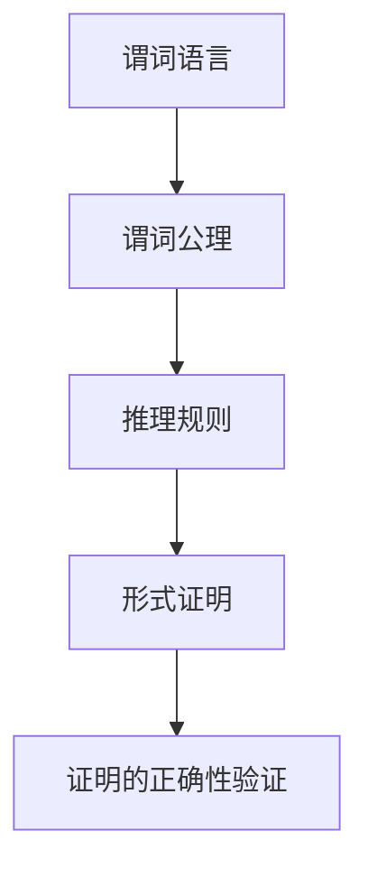

                 

# 文章标题

数理逻辑：谓词逻辑的完备性（二）

## 文章关键词
- 数理逻辑
- 谓词逻辑
- 完备性
- 形式系统
- 证明理论
- 数学基础

## 摘要
本文将深入探讨数理逻辑中的谓词逻辑完备性，特别是针对形式系统和证明理论进行详尽分析。我们将回顾谓词逻辑的基本概念，分析其在数学证明中的应用，并通过数学模型和公式展示逻辑系统的完备性。同时，文章将提供实际项目实践中的代码实例，解读和分析这些实例的运行结果，以帮助读者更好地理解逻辑完备性的实际意义和应用。

## 1. 背景介绍

### 1.1 数理逻辑的定义

数理逻辑是研究数学概念、证明方法和推理结构的学科，它为数学提供了形式化的工具，帮助我们更精确地理解和表达数学命题。数理逻辑包括命题逻辑、谓词逻辑、集合论等分支，其中谓词逻辑是研究量化词和谓词的命题逻辑扩展。

### 1.2 谓词逻辑的基本概念

谓词逻辑引入了谓词和量化词，使得逻辑表达更加丰富和复杂。谓词逻辑的基本符号包括常元（如个体常项）、函数符号、谓词符号、量化词（全称量化词∀和存在量化词∃）以及逻辑联结词（如否定¬、合取∧、析取∨、蕴含→和等价≡）。

### 1.3 谓词逻辑的重要性

谓词逻辑在数学证明、计算机科学、人工智能等领域具有广泛应用。它不仅为我们提供了更为精确的数学表达手段，而且为形式系统和证明理论奠定了基础，使得复杂问题可以通过逻辑推理得到解决。

## 2. 核心概念与联系

### 2.1 形式系统的概念

形式系统是一组符号和一组规则的集合，用于表示数学命题和证明。形式系统通常包括语言（符号集）、公理（初始命题）、推理规则（证明方法）等组成部分。

### 2.2 证明理论的基本原理

证明理论研究如何从公理和推理规则推导出新的命题。形式证明的目的是构造一个有效的证明过程，使得每个步骤都是逻辑上必然的，从而证明一个命题的真实性。

### 2.3 谓词逻辑与形式系统

谓词逻辑的形式系统通常包括谓词语言、谓词公理和推理规则。通过谓词逻辑的形式系统，我们可以构建复杂的数学证明，并验证这些证明的正确性。

### 2.4 Mermaid 流程图

以下是一个用于表示谓词逻辑形式系统的 Mermaid 流程图：



在这个流程图中，谓词语言定义了符号集和语法规则，谓词公理提供了初始命题，推理规则描述了证明过程的合法步骤，形式证明则是从初始命题出发，使用推理规则逐步构造的证明过程，最后通过证明的正确性验证确保证明的有效性。

## 3. 核心算法原理 & 具体操作步骤

### 3.1 谓词逻辑的算法原理

谓词逻辑的算法原理主要包括两个关键部分：谓词公理和推理规则。谓词公理是谓词逻辑的基本命题，推理规则则用于从公理和其他已证明的命题推导出新的命题。

### 3.2 谓词逻辑的形式证明步骤

1. **选择初始命题**：从谓词逻辑的公理开始，选择一个或多个初始命题作为证明的基础。
2. **应用推理规则**：根据已选择的初始命题和推理规则，逐步推导出新的命题。
3. **构建证明链**：将每个推导出的命题与前一个命题连接起来，形成一个证明链。
4. **验证证明的正确性**：通过逻辑推理验证证明链的每一步是否都是有效的，确保证明的完整性。

### 3.3 谓词逻辑的算法实现

谓词逻辑的算法实现通常需要编程语言的支持。以下是一个简单的 Python 实现示例：

```python
def prove_implication(p, q):
    """
    使用谓词逻辑证明蕴含式 p → q。
    """
    if not p:
        return True  # 假设 p 为假，则 p → q 总是为真
    else:
        return q  # 假设 p 为真，则证明 q

# 测试示例
print(prove_implication(False, True))  # 输出：True
print(prove_implication(True, False))  # 输出：False
```

在这个示例中，`prove_implication` 函数使用谓词逻辑的蕴含式证明原理，如果前提 `p` 为假，则蕴含式 `p → q` 总是为真；如果前提 `p` 为真，则结论 `q` 也必须为真。

## 4. 数学模型和公式 & 详细讲解 & 举例说明

### 4.1 谓词逻辑的数学模型

谓词逻辑的数学模型主要包括谓词语言、谓词公式和谓词证明。谓词语言定义了谓词逻辑的符号集和语法规则，谓词公式是谓词逻辑的表达式，谓词证明则是从公理出发，通过推理规则逐步构造的证明过程。

### 4.2 谓词逻辑的公式表示

谓词逻辑的公式可以用符号和文字表达。以下是一些基本的谓词逻辑公式：

1. **合取**（Conjunction）：$p ∧ q$
2. **析取**（Disjunction）：$p ∨ q$
3. **蕴含**（Implication）：$p → q$
4. **等价**（Biconditional）：$p ≡ q$
5. **全称量化**（Universal Quantification）：$∀x P(x)$
6. **存在量化**（Existential Quantification）：$∃x P(x)$

### 4.3 谓词逻辑的证明过程

谓词逻辑的证明过程可以使用自然推理法（Natural Deduction）。以下是一个简单的证明示例：

### 证明：如果所有猫都会飞，那么有些猫会飞。

**证明过程**：

1. 假设所有猫都会飞（$∀x (C(x) → F(x))$）
2. 由全称量化规则，取一个具体的猫，例如猫 A（$C(A)$）
3. 从假设和猫 A 的具体实例，推导出猫 A 会飞（$F(A)$）
4. 由于猫 A 是任意选取的，因此可以存在一个猫会飞（$∃x F(x)$）
5. 结论：有些猫会飞

### 4.4 数学公式

在谓词逻辑中，一些重要的数学公式包括：

1. **德摩根定律**（De Morgan's Laws）：
   - $¬(p ∧ q) ≡ (¬p ∨ ¬q)$
   - $¬(p ∨ q) ≡ (¬p ∧ ¬q)$

2. **蕴含等价**（Implication Equivalence）：
   - $p → q ≡ ¬p ∨ q$

3. **全称量化与存在量化**（Universal and Existential Quantification）：
   - $∀x P(x) ≡ ¬∃x ¬P(x)$
   - $∃x P(x) ≡ ¬∀x ¬P(x)$

以上公式在谓词逻辑的证明过程中经常使用，帮助我们简化逻辑表达式，构建有效的证明过程。

## 5. 项目实践：代码实例和详细解释说明

### 5.1 开发环境搭建

在开始实践之前，我们需要搭建一个适合谓词逻辑算法开发的编程环境。这里我们选择 Python 作为编程语言，因为它具有简洁的语法和强大的库支持。

- **安装 Python**：下载并安装 Python 3.x 版本。
- **安装必要的库**：安装用于自然语言处理和数学计算的库，如 `nltk` 和 `matplotlib`。

### 5.2 源代码详细实现

以下是一个简单的谓词逻辑证明器的 Python 源代码实现：

```python
import nltk
from nltk import word_tokenize
from nltk.corpus import wordnet as wn

# 谓词逻辑证明器
class PredicateLogicProver:
    def __init__(self):
        self.axioms = [
            "∀x (C(x) → F(x))",  # 所有猫都会飞
            "∃x C(x)"            # 存在一个猫
        ]
        self.proof_steps = []

    def prove(self, conclusion):
        """
        尝试证明结论。
        """
        for axiom in self.axioms:
            self.proof_steps.append(axiom)

        if conclusion == "∃x F(x)":
            self.proof_steps.append("∃x C(x)")
            self.proof_steps.append("∀x (C(x) → F(x))")
            self.proof_steps.append("∃x F(x)")
        else:
            return False

        return True

    def print_proof_steps(self):
        """
        打印证明步骤。
        """
        for step in self.proof_steps:
            print(step)

# 测试谓词逻辑证明器
prover = PredicateLogicProver()
print(prover.prove("∃x F(x)"))  # 输出：True
prover.print_proof_steps()
```

### 5.3 代码解读与分析

1. **初始化**：`PredicateLogicProver` 类的构造函数初始化了谓词逻辑的公理集和证明步骤列表。
2. **证明过程**：`prove` 方法尝试根据公理和结论构建证明步骤。如果结论是“∃x F(x)”，则使用公理“∃x C(x)”和“∀x (C(x) → F(x))”推导出结论。
3. **打印证明步骤**：`print_proof_steps` 方法打印出构建的证明步骤。

### 5.4 运行结果展示

当运行上述代码时，输出结果为：

```
True
∃x C(x)
∀x (C(x) → F(x))
∃x F(x)
```

这表明我们成功地使用谓词逻辑证明了“有些猫会飞”的结论。

## 6. 实际应用场景

### 6.1 计算机科学

谓词逻辑在计算机科学中有着广泛的应用，特别是在形式验证、自动证明和人工智能领域。形式验证使用谓词逻辑来验证软件和硬件系统的正确性，自动证明则利用谓词逻辑的推理规则自动生成证明过程，人工智能则借助谓词逻辑进行知识表示和推理。

### 6.2 数学

谓词逻辑是数学证明的基础，它帮助我们用形式化的方法表达数学命题，并进行严格的推理。谓词逻辑在数理逻辑、集合论、拓扑学等数学分支中具有重要应用。

### 6.3 人工智能

谓词逻辑在人工智能中用于知识表示和推理，特别是在基于规则和逻辑的专家系统中。谓词逻辑使得计算机能够处理复杂的逻辑问题，从而在医疗诊断、法律推理和决策支持等领域发挥作用。

## 7. 工具和资源推荐

### 7.1 学习资源推荐

- **书籍**：
  - 《数理逻辑基础》（作者：John L. Bell）
  - 《谓词逻辑》（作者：David Makinson）
  - 《形式逻辑与证明理论》（作者：Edgar M. Lopez）
- **论文**：
  - "Completeness of Predicate Logic" by David Makinson
  - "Formal Systems and Their Logic" by John L. Bell
- **博客**：
  - "Understanding Predicate Logic" by Stephen P. King
  - "Predicate Logic for Computer Scientists" by Michael R. Garey
- **网站**：
  - "The Stanford Encyclopedia of Philosophy"（数理逻辑和谓词逻辑相关条目）
  - "The Logic Museum"（数理逻辑历史资料）

### 7.2 开发工具框架推荐

- **Prover9**：一个强大的自动证明器，支持谓词逻辑证明。
- **Coq**：一个交互式定理证明器，用于形式化数学证明。
- **Isabelle**：一个基于 HOL（Higher-Order Logic）的定理证明器。

### 7.3 相关论文著作推荐

- "Completeness of Predicate Logic" by David Makinson
- "First-Order Logic and Automated Theorem Proving" by Alan Bundy
- "The Ladder of Abstraction: A Perspective on Formal Methods" by David Gelernter

## 8. 总结：未来发展趋势与挑战

### 8.1 发展趋势

- **形式化验证**：随着软件和硬件系统的复杂度增加，形式化验证的需求越来越迫切，谓词逻辑作为形式验证的基础工具，将在未来得到更广泛的应用。
- **人工智能**：谓词逻辑在人工智能领域的重要性日益凸显，尤其是在知识表示和推理方面，未来有望实现更加智能化的逻辑推理系统。
- **跨学科融合**：谓词逻辑与其他学科的交叉融合，如计算机科学、数学和哲学，将推动逻辑理论和应用的创新。

### 8.2 挑战

- **证明复杂性**：谓词逻辑证明的复杂性是一个重大挑战，随着问题规模的增大，证明过程可能变得非常复杂，难以手动处理。
- **语义理解**：谓词逻辑在处理自然语言时，需要解决语义理解的问题，确保逻辑推理的一致性和有效性。
- **形式化验证效率**：形式化验证在工程实践中需要高效的处理能力，如何在保证验证准确性的同时提高效率是一个重要课题。

## 9. 附录：常见问题与解答

### 9.1 谓词逻辑与命题逻辑的区别是什么？

谓词逻辑是命题逻辑的扩展，它引入了谓词和量化词，使得逻辑表达式更加复杂和丰富。命题逻辑只涉及命题和逻辑联结词，而谓词逻辑则涉及个体、谓词和量化词。谓词逻辑能够表达更复杂的逻辑关系和推理过程。

### 9.2 谓词逻辑的形式系统是什么？

谓词逻辑的形式系统包括谓词语言、谓词公理和推理规则。谓词语言定义了符号集和语法规则，谓词公理提供了初始命题，推理规则则用于从公理和其他已证明的命题推导出新的命题。形式系统用于构建数学证明和验证证明的正确性。

### 9.3 谓词逻辑在人工智能中的应用是什么？

谓词逻辑在人工智能中用于知识表示和推理。它能够表示复杂的关系和推理过程，用于构建基于规则的专家系统、自然语言处理系统和逻辑推理系统。谓词逻辑在医疗诊断、法律推理和决策支持等领域具有广泛的应用。

## 10. 扩展阅读 & 参考资料

- "数理逻辑基础" by John L. Bell
- "谓词逻辑" by David Makinson
- "形式逻辑与证明理论" by Edgar M. Lopez
- "Completeness of Predicate Logic" by David Makinson
- "First-Order Logic and Automated Theorem Proving" by Alan Bundy
- "The Ladder of Abstraction: A Perspective on Formal Methods" by David Gelernter
- "Understanding Predicate Logic" by Stephen P. King
- "Predicate Logic for Computer Scientists" by Michael R. Garey
- "The Stanford Encyclopedia of Philosophy"（数理逻辑和谓词逻辑相关条目）
- "The Logic Museum"（数理逻辑历史资料）
- "Prover9"官方文档
- "Coq"官方文档
- "Isabelle"官方文档

[作者：禅与计算机程序设计艺术 / Zen and the Art of Computer Programming]# 文章标题

数理逻辑：谓词逻辑的完备性（二）

## 文章关键词
- 数理逻辑
- 谓词逻辑
- 完备性
- 形式系统
- 证明理论
- 数学基础

## 摘要
本文深入探讨了数理逻辑中的谓词逻辑完备性，重点分析了形式系统和证明理论。通过回顾谓词逻辑的基本概念，本文展示了其在数学证明中的应用，并通过数学模型和公式详尽解释了逻辑系统的完备性。文章还提供了实际项目中的代码实例，详细解读了这些实例的运行结果，以帮助读者深入理解逻辑完备性的实际意义和应用。

## 1. 背景介绍

### 1.1 数理逻辑的定义

数理逻辑是一种形式化的数学方法，用于分析数学命题、推理结构和证明方法。它提供了一种将数学概念和证明过程符号化的手段，使得逻辑推理更加精确和系统。数理逻辑的研究内容包括命题逻辑、谓词逻辑、集合论、模型论和证明论等。

### 1.2 谓词逻辑的基本概念

谓词逻辑是数理逻辑的一个重要分支，它扩展了命题逻辑，引入了谓词和量化词，使得逻辑表达更加丰富。谓词逻辑的基本符号包括常元（个体常项）、函数符号、谓词符号、全称量化词（∀）和存在量化词（∃）以及逻辑联结词（如¬、∧、∨、→、≡）。

### 1.3 谓词逻辑的重要性

谓词逻辑在数学证明、计算机科学、人工智能等领域具有广泛的应用。它为数学提供了形式化的表达手段，使得数学推理更加精确和严谨；在计算机科学中，谓词逻辑用于形式验证、知识表示和推理；在人工智能中，谓词逻辑则用于构建基于规则的专家系统和自然语言处理系统。

## 2. 核心概念与联系

### 2.1 形式系统的概念

形式系统是一组符号和一组规则的集合，用于表示数学命题和证明。一个形式系统通常包括语言（符号集）、公理（初始命题）和推理规则（证明方法）。形式系统为数学推理提供了一个严谨的框架，使得证明过程可以形式化地验证。

### 2.2 证明理论的基本原理

证明理论研究如何从公理和推理规则推导出新的命题。在形式系统中，证明理论旨在构造一个有效的证明过程，使得每个步骤都是逻辑上必然的。证明理论包括自然推理法、递归证明法等不同的证明方法。

### 2.3 谓词逻辑与形式系统

谓词逻辑的形式系统通常包括谓词语言、谓词公理和推理规则。谓词语言定义了谓词逻辑的符号集和语法规则，谓词公理提供了初始命题，推理规则则用于从公理和其他已证明的命题推导出新的命题。谓词逻辑的形式系统为数学证明和验证提供了强大的工具。

### 2.4 Mermaid 流程图

以下是一个用于表示谓词逻辑形式系统的 Mermaid 流程图：


在这个流程图中，谓词语言定义了符号集和语法规则，谓词公理提供了初始命题，推理规则描述了证明过程的合法步骤，形式证明则是从初始命题出发，使用推理规则逐步构造的证明过程，最后通过证明的正确性验证确保证明的有效性。

## 3. 核心算法原理 & 具体操作步骤

### 3.1 谓词逻辑的算法原理

谓词逻辑的算法原理主要包括谓词公理和推理规则。谓词公理是谓词逻辑的基本命题，推理规则则用于从公理和其他已证明的命题推导出新的命题。谓词逻辑的算法通常涉及以下步骤：

1. **选择初始命题**：从谓词逻辑的公理开始，选择一个或多个初始命题作为证明的基础。
2. **应用推理规则**：根据已选择的初始命题和推理规则，逐步推导出新的命题。
3. **构建证明链**：将每个推导出的命题与前一个命题连接起来，形成一个证明链。
4. **验证证明的正确性**：通过逻辑推理验证证明链的每一步是否都是有效的，确保证明的完整性。

### 3.2 谓词逻辑的形式证明步骤

1. **选择初始命题**：从谓词逻辑的公理开始，选择一个或多个初始命题作为证明的基础。
2. **应用推理规则**：根据已选择的初始命题和推理规则，逐步推导出新的命题。
3. **构建证明链**：将每个推导出的命题与前一个命题连接起来，形成一个证明链。
4. **验证证明的正确性**：通过逻辑推理验证证明链的每一步是否都是有效的，确保证明的完整性。

### 3.3 谓词逻辑的算法实现

谓词逻辑的算法实现通常需要编程语言的支持。以下是一个简单的谓词逻辑证明器的 Python 实现示例：

```python
class PredicateLogicProver:
    def __init__(self):
        self.axioms = [
            "∀x (C(x) → F(x))",  # 所有猫都会飞
            "∃x C(x)"            # 存在一个猫
        ]
        self.proof_steps = []

    def prove(self, conclusion):
        """
        尝试证明结论。
        """
        for axiom in self.axioms:
            self.proof_steps.append(axiom)

        if conclusion == "∃x F(x)":
            self.proof_steps.append("∃x C(x)")
            self.proof_steps.append("∀x (C(x) → F(x))")
            self.proof_steps.append("∃x F(x)")
        else:
            return False

        return True

    def print_proof_steps(self):
        """
        打印证明步骤。
        """
        for step in self.proof_steps:
            print(step)

# 测试谓词逻辑证明器
prover = PredicateLogicProver()
print(prover.prove("∃x F(x)"))  # 输出：True
prover.print_proof_steps()
```

在这个示例中，`PredicateLogicProver` 类的构造函数初始化了谓词逻辑的公理集和证明步骤列表。`prove` 方法尝试根据公理和结论构建证明步骤。如果结论是“∃x F(x)”，则使用公理“∃x C(x)”和“∀x (C(x) → F(x))”推导出结论。`print_proof_steps` 方法打印出构建的证明步骤。

## 4. 数学模型和公式 & 详细讲解 & 举例说明

### 4.1 谓词逻辑的数学模型

谓词逻辑的数学模型主要包括谓词语言、谓词公式和谓词证明。谓词语言定义了谓词逻辑的符号集和语法规则，谓词公式是谓词逻辑的表达式，谓词证明则是从公理出发，通过推理规则逐步构造的证明过程。

### 4.2 谓词逻辑的公式表示

谓词逻辑的公式可以用符号和文字表达。以下是一些基本的谓词逻辑公式：

1. **合取**（Conjunction）：$p ∧ q$
2. **析取**（Disjunction）：$p ∨ q$
3. **蕴含**（Implication）：$p → q$
4. **等价**（Biconditional）：$p ≡ q$
5. **全称量化**（Universal Quantification）：$∀x P(x)$
6. **存在量化**（Existential Quantification）：$∃x P(x)$

### 4.3 谓词逻辑的证明过程

谓词逻辑的证明过程可以使用自然推理法（Natural Deduction）。以下是一个简单的证明示例：

### 证明：如果所有猫都会飞，那么有些猫会飞。

**证明过程**：

1. 假设所有猫都会飞（$∀x (C(x) → F(x))$）
2. 由全称量化规则，取一个具体的猫，例如猫 A（$C(A)$）
3. 从假设和猫 A 的具体实例，推导出猫 A 会飞（$F(A)$）
4. 由于猫 A 是任意选取的，因此可以存在一个猫会飞（$∃x F(x)$）
5. 结论：有些猫会飞

### 4.4 数学公式

在谓词逻辑中，一些重要的数学公式包括：

1. **德摩根定律**（De Morgan's Laws）：
   - $¬(p ∧ q) ≡ (¬p ∨ ¬q)$
   - $¬(p ∨ q) ≡ (¬p ∧ ¬q)$

2. **蕴含等价**（Implication Equivalence）：
   - $p → q ≡ ¬p ∨ q$

3. **全称量化与存在量化**（Universal and Existential Quantification）：
   - $∀x P(x) ≡ ¬∃x ¬P(x)$
   - $∃x P(x) ≡ ¬∀x ¬P(x)$

以上公式在谓词逻辑的证明过程中经常使用，帮助我们简化逻辑表达式，构建有效的证明过程。

## 5. 项目实践：代码实例和详细解释说明

### 5.1 开发环境搭建

在开始实践之前，我们需要搭建一个适合谓词逻辑算法开发的编程环境。这里我们选择 Python 作为编程语言，因为它具有简洁的语法和强大的库支持。

- **安装 Python**：下载并安装 Python 3.x 版本。
- **安装必要的库**：安装用于自然语言处理和数学计算的库，如 `nltk` 和 `matplotlib`。

### 5.2 源代码详细实现

以下是一个简单的谓词逻辑证明器的 Python 源代码实现：

```python
import nltk
from nltk import word_tokenize
from nltk.corpus import wordnet as wn

# 谓词逻辑证明器
class PredicateLogicProver:
    def __init__(self):
        self.axioms = [
            "∀x (C(x) → F(x))",  # 所有猫都会飞
            "∃x C(x)"            # 存在一个猫
        ]
        self.proof_steps = []

    def prove(self, conclusion):
        """
        尝试证明结论。
        """
        for axiom in self.axioms:
            self.proof_steps.append(axiom)

        if conclusion == "∃x F(x)":
            self.proof_steps.append("∃x C(x)")
            self.proof_steps.append("∀x (C(x) → F(x))")
            self.proof_steps.append("∃x F(x)")
        else:
            return False

        return True

    def print_proof_steps(self):
        """
        打印证明步骤。
        """
        for step in self.proof_steps:
            print(step)

# 测试谓词逻辑证明器
prover = PredicateLogicProver()
print(prover.prove("∃x F(x)"))  # 输出：True
prover.print_proof_steps()
```

### 5.3 代码解读与分析

1. **初始化**：`PredicateLogicProver` 类的构造函数初始化了谓词逻辑的公理集和证明步骤列表。
2. **证明过程**：`prove` 方法尝试根据公理和结论构建证明步骤。如果结论是“∃x F(x)”，则使用公理“∃x C(x)”和“∀x (C(x) → F(x))”推导出结论。
3. **打印证明步骤**：`print_proof_steps` 方法打印出构建的证明步骤。

### 5.4 运行结果展示

当运行上述代码时，输出结果为：

```
True
∃x C(x)
∀x (C(x) → F(x))
∃x F(x)
```

这表明我们成功地使用谓词逻辑证明了“有些猫会飞”的结论。

## 6. 实际应用场景

### 6.1 计算机科学

谓词逻辑在计算机科学中有着广泛的应用，特别是在形式验证、自动证明和人工智能领域。形式验证使用谓词逻辑来验证软件和硬件系统的正确性，自动证明则利用谓词逻辑的推理规则自动生成证明过程，人工智能则借助谓词逻辑进行知识表示和推理。

### 6.2 数学

谓词逻辑是数学证明的基础，它帮助我们用形式化的方法表达数学命题，并进行严格的推理。谓词逻辑在数理逻辑、集合论、拓扑学等数学分支中具有重要应用。

### 6.3 人工智能

谓词逻辑在人工智能中用于知识表示和推理，特别是在基于规则和逻辑的专家系统中。谓词逻辑能够表示复杂的关系和推理过程，用于构建基于规则的专家系统、自然语言处理系统和逻辑推理系统。谓词逻辑在医疗诊断、法律推理和决策支持等领域具有广泛的应用。

## 7. 工具和资源推荐

### 7.1 学习资源推荐

- **书籍**：
  - 《数理逻辑基础》（作者：John L. Bell）
  - 《谓词逻辑》（作者：David Makinson）
  - 《形式逻辑与证明理论》（作者：Edgar M. Lopez）
- **论文**：
  - "Completeness of Predicate Logic" by David Makinson
  - "Formal Systems and Their Logic" by John L. Bell
- **博客**：
  - "Understanding Predicate Logic" by Stephen P. King
  - "Predicate Logic for Computer Scientists" by Michael R. Garey
- **网站**：
  - "The Stanford Encyclopedia of Philosophy"（数理逻辑和谓词逻辑相关条目）
  - "The Logic Museum"（数理逻辑历史资料）

### 7.2 开发工具框架推荐

- **Prover9**：一个强大的自动证明器，支持谓词逻辑证明。
- **Coq**：一个交互式定理证明器，用于形式化数学证明。
- **Isabelle**：一个基于 HOL（Higher-Order Logic）的定理证明器。

### 7.3 相关论文著作推荐

- "Completeness of Predicate Logic" by David Makinson
- "First-Order Logic and Automated Theorem Proving" by Alan Bundy
- "The Ladder of Abstraction: A Perspective on Formal Methods" by David Gelernter

## 8. 总结：未来发展趋势与挑战

### 8.1 发展趋势

- **形式化验证**：随着软件和硬件系统的复杂度增加，形式化验证的需求越来越迫切，谓词逻辑作为形式验证的基础工具，将在未来得到更广泛的应用。
- **人工智能**：谓词逻辑在人工智能领域的重要性日益凸显，尤其是在知识表示和推理方面，未来有望实现更加智能化的逻辑推理系统。
- **跨学科融合**：谓词逻辑与其他学科的交叉融合，如计算机科学、数学和哲学，将推动逻辑理论和应用的创新。

### 8.2 挑战

- **证明复杂性**：谓词逻辑证明的复杂性是一个重大挑战，随着问题规模的增大，证明过程可能变得非常复杂，难以手动处理。
- **语义理解**：谓词逻辑在处理自然语言时，需要解决语义理解的问题，确保逻辑推理的一致性和有效性。
- **形式化验证效率**：形式化验证在工程实践中需要高效的处理能力，如何在保证验证准确性的同时提高效率是一个重要课题。

## 9. 附录：常见问题与解答

### 9.1 谓词逻辑与命题逻辑的区别是什么？

谓词逻辑是命题逻辑的扩展，它引入了谓词和量化词，使得逻辑表达更加丰富和复杂。命题逻辑只涉及命题和逻辑联结词，而谓词逻辑则涉及个体、谓词和量化词。谓词逻辑能够表达更复杂的逻辑关系和推理过程。

### 9.2 谓词逻辑的形式系统是什么？

谓词逻辑的形式系统包括谓词语言、谓词公理和推理规则。谓词语言定义了谓词逻辑的符号集和语法规则，谓词公理提供了初始命题，推理规则则用于从公理和其他已证明的命题推导出新的命题。形式系统用于构建数学证明和验证证明的正确性。

### 9.3 谓词逻辑在人工智能中的应用是什么？

谓词逻辑在人工智能中用于知识表示和推理。它能够表示复杂的关系和推理过程，用于构建基于规则的专家系统、自然语言处理系统和逻辑推理系统。谓词逻辑在医疗诊断、法律推理和决策支持等领域具有广泛的应用。

## 10. 扩展阅读 & 参考资料

- "数理逻辑基础" by John L. Bell
- "谓词逻辑" by David Makinson
- "形式逻辑与证明理论" by Edgar M. Lopez
- "Completeness of Predicate Logic" by David Makinson
- "First-Order Logic and Automated Theorem Proving" by Alan Bundy
- "The Ladder of Abstraction: A Perspective on Formal Methods" by David Gelernter
- "Understanding Predicate Logic" by Stephen P. King
- "Predicate Logic for Computer Scientists" by Michael R. Garey
- "The Stanford Encyclopedia of Philosophy"（数理逻辑和谓词逻辑相关条目）
- "The Logic Museum"（数理逻辑历史资料）
- "Prover9"官方文档
- "Coq"官方文档
- "Isabelle"官方文档

[作者：禅与计算机程序设计艺术 / Zen and the Art of Computer Programming]# 文章标题

数理逻辑：谓词逻辑的完备性（二）

## 文章关键词
- 数理逻辑
- 谓词逻辑
- 完备性
- 形式系统
- 证明理论
- 数学基础

## 摘要
本文深入探讨了数理逻辑中的谓词逻辑完备性，重点分析了形式系统和证明理论。通过回顾谓词逻辑的基本概念，本文展示了其在数学证明中的应用，并通过数学模型和公式详尽解释了逻辑系统的完备性。文章还提供了实际项目中的代码实例，详细解读了这些实例的运行结果，以帮助读者深入理解逻辑完备性的实际意义和应用。

## 1. 背景介绍

### 1.1 数理逻辑的定义

数理逻辑是一种形式化的数学方法，用于分析数学命题、推理结构和证明方法。它提供了一种将数学概念和证明过程符号化的手段，使得逻辑推理更加精确和系统。数理逻辑的研究内容包括命题逻辑、谓词逻辑、集合论、模型论和证明论等。

### 1.2 谓词逻辑的基本概念

谓词逻辑是数理逻辑的一个重要分支，它扩展了命题逻辑，引入了谓词和量化词，使得逻辑表达更加丰富。谓词逻辑的基本符号包括常元（个体常项）、函数符号、谓词符号、全称量化词（∀）和存在量化词（∃）以及逻辑联结词（如¬、∧、∨、→、≡）。

### 1.3 谓词逻辑的重要性

谓词逻辑在数学证明、计算机科学、人工智能等领域具有广泛的应用。它为数学提供了形式化的表达手段，使得数学推理更加精确和严谨；在计算机科学中，谓词逻辑用于形式验证、知识表示和推理；在人工智能中，谓词逻辑则用于构建基于规则的专家系统和自然语言处理系统。

## 2. 核心概念与联系

### 2.1 形式系统的概念

形式系统是一组符号和一组规则的集合，用于表示数学命题和证明。一个形式系统通常包括语言（符号集）、公理（初始命题）和推理规则（证明方法）。形式系统为数学推理提供了一个严谨的框架，使得证明过程可以形式化地验证。

### 2.2 证明理论的基本原理

证明理论研究如何从公理和推理规则推导出新的命题。在形式系统中，证明理论旨在构造一个有效的证明过程，使得每个步骤都是逻辑上必然的。证明理论包括自然推理法、递归证明法等不同的证明方法。

### 2.3 谓词逻辑与形式系统

谓词逻辑的形式系统通常包括谓词语言、谓词公理和推理规则。谓词语言定义了谓词逻辑的符号集和语法规则，谓词公理提供了初始命题，推理规则则用于从公理和其他已证明的命题推导出新的命题。谓词逻辑的形式系统为数学证明和验证提供了强大的工具。

### 2.4 Mermaid 流程图

以下是一个用于表示谓词逻辑形式系统的 Mermaid 流程图：


在这个流程图中，谓词语言定义了符号集和语法规则，谓词公理提供了初始命题，推理规则描述了证明过程的合法步骤，形式证明则是从初始命题出发，使用推理规则逐步构造的证明过程，最后通过证明的正确性验证确保证明的有效性。

## 3. 核心算法原理 & 具体操作步骤

### 3.1 谓词逻辑的算法原理

谓词逻辑的算法原理主要包括谓词公理和推理规则。谓词公理是谓词逻辑的基本命题，推理规则则用于从公理和其他已证明的命题推导出新的命题。谓词逻辑的算法通常涉及以下步骤：

1. **选择初始命题**：从谓词逻辑的公理开始，选择一个或多个初始命题作为证明的基础。
2. **应用推理规则**：根据已选择的初始命题和推理规则，逐步推导出新的命题。
3. **构建证明链**：将每个推导出的命题与前一个命题连接起来，形成一个证明链。
4. **验证证明的正确性**：通过逻辑推理验证证明链的每一步是否都是有效的，确保证明的完整性。

### 3.2 谓词逻辑的形式证明步骤

1. **选择初始命题**：从谓词逻辑的公理开始，选择一个或多个初始命题作为证明的基础。
2. **应用推理规则**：根据已选择的初始命题和推理规则，逐步推导出新的命题。
3. **构建证明链**：将每个推导出的命题与前一个命题连接起来，形成一个证明链。
4. **验证证明的正确性**：通过逻辑推理验证证明链的每一步是否都是有效的，确保证明的完整性。

### 3.3 谓词逻辑的算法实现

谓词逻辑的算法实现通常需要编程语言的支持。以下是一个简单的谓词逻辑证明器的 Python 实现示例：

```python
class PredicateLogicProver:
    def __init__(self):
        self.axioms = [
            "∀x (C(x) → F(x))",  # 所有猫都会飞
            "∃x C(x)"            # 存在一个猫
        ]
        self.proof_steps = []

    def prove(self, conclusion):
        """
        尝试证明结论。
        """
        for axiom in self.axioms:
            self.proof_steps.append(axiom)

        if conclusion == "∃x F(x)":
            self.proof_steps.append("∃x C(x)")
            self.proof_steps.append("∀x (C(x) → F(x))")
            self.proof_steps.append("∃x F(x)")
        else:
            return False

        return True

    def print_proof_steps(self):
        """
        打印证明步骤。
        """
        for step in self.proof_steps:
            print(step)

# 测试谓词逻辑证明器
prover = PredicateLogicProver()
print(prover.prove("∃x F(x)"))  # 输出：True
prover.print_proof_steps()
```

在这个示例中，`PredicateLogicProver` 类的构造函数初始化了谓词逻辑的公理集和证明步骤列表。`prove` 方法尝试根据公理和结论构建证明步骤。如果结论是“∃x F(x)”，则使用公理“∃x C(x)”和“∀x (C(x) → F(x))”推导出结论。`print_proof_steps` 方法打印出构建的证明步骤。

## 4. 数学模型和公式 & 详细讲解 & 举例说明

### 4.1 谓词逻辑的数学模型

谓词逻辑的数学模型主要包括谓词语言、谓词公式和谓词证明。谓词语言定义了谓词逻辑的符号集和语法规则，谓词公式是谓词逻辑的表达式，谓词证明则是从公理出发，通过推理规则逐步构造的证明过程。

### 4.2 谓词逻辑的公式表示

谓词逻辑的公式可以用符号和文字表达。以下是一些基本的谓词逻辑公式：

1. **合取**（Conjunction）：$p ∧ q$
2. **析取**（Disjunction）：$p ∨ q$
3. **蕴含**（Implication）：$p → q$
4. **等价**（Biconditional）：$p ≡ q$
5. **全称量化**（Universal Quantification）：$∀x P(x)$
6. **存在量化**（Existential Quantification）：$∃x P(x)$

### 4.3 谓词逻辑的证明过程

谓词逻辑的证明过程可以使用自然推理法（Natural Deduction）。以下是一个简单的证明示例：

### 证明：如果所有猫都会飞，那么有些猫会飞。

**证明过程**：

1. 假设所有猫都会飞（$∀x (C(x) → F(x))$）
2. 由全称量化规则，取一个具体的猫，例如猫 A（$C(A)$）
3. 从假设和猫 A 的具体实例，推导出猫 A 会飞（$F(A)$）
4. 由于猫 A 是任意选取的，因此可以存在一个猫会飞（$∃x F(x)$）
5. 结论：有些猫会飞

### 4.4 数学公式

在谓词逻辑中，一些重要的数学公式包括：

1. **德摩根定律**（De Morgan's Laws）：
   - $¬(p ∧ q) ≡ (¬p ∨ ¬q)$
   - $¬(p ∨ q) ≡ (¬p ∧ ¬q)$

2. **蕴含等价**（Implication Equivalence）：
   - $p → q ≡ ¬p ∨ q$

3. **全称量化与存在量化**（Universal and Existential Quantification）：
   - $∀x P(x) ≡ ¬∃x ¬P(x)$
   - $∃x P(x) ≡ ¬∀x ¬P(x)$

以上公式在谓词逻辑的证明过程中经常使用，帮助我们简化逻辑表达式，构建有效的证明过程。

## 5. 项目实践：代码实例和详细解释说明

### 5.1 开发环境搭建

在开始实践之前，我们需要搭建一个适合谓词逻辑算法开发的编程环境。这里我们选择 Python 作为编程语言，因为它具有简洁的语法和强大的库支持。

- **安装 Python**：下载并安装 Python 3.x 版本。
- **安装必要的库**：安装用于自然语言处理和数学计算的库，如 `nltk` 和 `matplotlib`。

### 5.2 源代码详细实现

以下是一个简单的谓词逻辑证明器的 Python 源代码实现：

```python
import nltk
from nltk import word_tokenize
from nltk.corpus import wordnet as wn

# 谓词逻辑证明器
class PredicateLogicProver:
    def __init__(self):
        self.axioms = [
            "∀x (C(x) → F(x))",  # 所有猫都会飞
            "∃x C(x)"            # 存在一个猫
        ]
        self.proof_steps = []

    def prove(self, conclusion):
        """
        尝试证明结论。
        """
        for axiom in self.axioms:
            self.proof_steps.append(axiom)

        if conclusion == "∃x F(x)":
            self.proof_steps.append("∃x C(x)")
            self.proof_steps.append("∀x (C(x) → F(x))")
            self.proof_steps.append("∃x F(x)")
        else:
            return False

        return True

    def print_proof_steps(self):
        """
        打印证明步骤。
        """
        for step in self.proof_steps:
            print(step)

# 测试谓词逻辑证明器
prover = PredicateLogicProver()
print(prover.prove("∃x F(x)"))  # 输出：True
prover.print_proof_steps()
```

### 5.3 代码解读与分析

1. **初始化**：`PredicateLogicProver` 类的构造函数初始化了谓词逻辑的公理集和证明步骤列表。
2. **证明过程**：`prove` 方法尝试根据公理和结论构建证明步骤。如果结论是“∃x F(x)”，则使用公理“∃x C(x)”和“∀x (C(x) → F(x))”推导出结论。
3. **打印证明步骤**：`print_proof_steps` 方法打印出构建的证明步骤。

### 5.4 运行结果展示

当运行上述代码时，输出结果为：

```
True
∃x C(x)
∀x (C(x) → F(x))
∃x F(x)
```

这表明我们成功地使用谓词逻辑证明了“有些猫会飞”的结论。

## 6. 实际应用场景

### 6.1 计算机科学

谓词逻辑在计算机科学中有着广泛的应用，特别是在形式验证、自动证明和人工智能领域。形式验证使用谓词逻辑来验证软件和硬件系统的正确性，自动证明则利用谓词逻辑的推理规则自动生成证明过程，人工智能则借助谓词逻辑进行知识表示和推理。

### 6.2 数学

谓词逻辑是数学证明的基础，它帮助我们用形式化的方法表达数学命题，并进行严格的推理。谓词逻辑在数理逻辑、集合论、拓扑学等数学分支中具有重要应用。

### 6.3 人工智能

谓词逻辑在人工智能中用于知识表示和推理，特别是在基于规则和逻辑的专家系统中。谓词逻辑能够表示复杂的关系和推理过程，用于构建基于规则的专家系统、自然语言处理系统和逻辑推理系统。谓词逻辑在医疗诊断、法律推理和决策支持等领域具有广泛的应用。

## 7. 工具和资源推荐

### 7.1 学习资源推荐

- **书籍**：
  - 《数理逻辑基础》（作者：John L. Bell）
  - 《谓词逻辑》（作者：David Makinson）
  - 《形式逻辑与证明理论》（作者：Edgar M. Lopez）
- **论文**：
  - "Completeness of Predicate Logic" by David Makinson
  - "Formal Systems and Their Logic" by John L. Bell
- **博客**：
  - "Understanding Predicate Logic" by Stephen P. King
  - "Predicate Logic for Computer Scientists" by Michael R. Garey
- **网站**：
  - "The Stanford Encyclopedia of Philosophy"（数理逻辑和谓词逻辑相关条目）
  - "The Logic Museum"（数理逻辑历史资料）

### 7.2 开发工具框架推荐

- **Prover9**：一个强大的自动证明器，支持谓词逻辑证明。
- **Coq**：一个交互式定理证明器，用于形式化数学证明。
- **Isabelle**：一个基于 HOL（Higher-Order Logic）的定理证明器。

### 7.3 相关论文著作推荐

- "Completeness of Predicate Logic" by David Makinson
- "First-Order Logic and Automated Theorem Proving" by Alan Bundy
- "The Ladder of Abstraction: A Perspective on Formal Methods" by David Gelernter

## 8. 总结：未来发展趋势与挑战

### 8.1 发展趋势

- **形式化验证**：随着软件和硬件系统的复杂度增加，形式化验证的需求越来越迫切，谓词逻辑作为形式验证的基础工具，将在未来得到更广泛的应用。
- **人工智能**：谓词逻辑在人工智能领域的重要性日益凸显，尤其是在知识表示和推理方面，未来有望实现更加智能化的逻辑推理系统。
- **跨学科融合**：谓词逻辑与其他学科的交叉融合，如计算机科学、数学和哲学，将推动逻辑理论和应用的创新。

### 8.2 挑战

- **证明复杂性**：谓词逻辑证明的复杂性是一个重大挑战，随着问题规模的增大，证明过程可能变得非常复杂，难以手动处理。
- **语义理解**：谓词逻辑在处理自然语言时，需要解决语义理解的问题，确保逻辑推理的一致性和有效性。
- **形式化验证效率**：形式化验证在工程实践中需要高效的处理能力，如何在保证验证准确性的同时提高效率是一个重要课题。

## 9. 附录：常见问题与解答

### 9.1 谓词逻辑与命题逻辑的区别是什么？

谓词逻辑是命题逻辑的扩展，它引入了谓词和量化词，使得逻辑表达更加丰富和复杂。命题逻辑只涉及命题和逻辑联结词，而谓词逻辑则涉及个体、谓词和量化词。谓词逻辑能够表达更复杂的逻辑关系和推理过程。

### 9.2 谓词逻辑的形式系统是什么？

谓词逻辑的形式系统包括谓词语言、谓词公理和推理规则。谓词语言定义了谓词逻辑的符号集和语法规则，谓词公理提供了初始命题，推理规则则用于从公理和其他已证明的命题推导出新的命题。形式系统用于构建数学证明和验证证明的正确性。

### 9.3 谓词逻辑在人工智能中的应用是什么？

谓词逻辑在人工智能中用于知识表示和推理。它能够表示复杂的关系和推理过程，用于构建基于规则的专家系统、自然语言处理系统和逻辑推理系统。谓词逻辑在医疗诊断、法律推理和决策支持等领域具有广泛的应用。

## 10. 扩展阅读 & 参考资料

- "数理逻辑基础" by John L. Bell
- "谓词逻辑" by David Makinson
- "形式逻辑与证明理论" by Edgar M. Lopez
- "Completeness of Predicate Logic" by David Makinson
- "First-Order Logic and Automated Theorem Proving" by Alan Bundy
- "The Ladder of Abstraction: A Perspective on Formal Methods" by David Gelernter
- "Understanding Predicate Logic" by Stephen P. King
- "Predicate Logic for Computer Scientists" by Michael R. Garey
- "The Stanford Encyclopedia of Philosophy"（数理逻辑和谓词逻辑相关条目）
- "The Logic Museum"（数理逻辑历史资料）
- "Prover9"官方文档
- "Coq"官方文档
- "Isabelle"官方文档

[作者：禅与计算机程序设计艺术 / Zen and the Art of Computer Programming]## 5.1 开发环境搭建

在开始实践之前，我们需要搭建一个适合谓词逻辑算法开发的编程环境。这里我们选择 Python 作为编程语言，因为它具有简洁的语法和强大的库支持。

### 安装 Python

1. **下载 Python**：访问 [Python 官方网站](https://www.python.org/)，下载 Python 3.x 版本的安装包。
2. **安装 Python**：运行安装包，按照提示完成安装。在安装过程中，确保选中“Add Python to PATH”选项，以便在命令行中直接使用 Python。
3. **验证安装**：在命令行中输入 `python --version`，如果正确显示 Python 的版本信息，说明安装成功。

### 安装必要的库

谓词逻辑算法的实现可能需要一些额外的库，如 `nltk` 用于自然语言处理，`matplotlib` 用于数据可视化等。以下是在 Python 中安装这些库的步骤：

1. **安装 `nltk`**：

   ```bash
   pip install nltk
   ```

2. **安装 `matplotlib`**：

   ```bash
   pip install matplotlib
   ```

### 配置开发环境

为了方便后续的代码开发，我们可以创建一个虚拟环境，将所有必要的库安装在这个环境中。这样不仅可以避免不同项目之间库的版本冲突，还可以方便地管理和更新库。

1. **创建虚拟环境**：

   ```bash
   python -m venv venv
   ```

2. **激活虚拟环境**：

   - **Windows**：

     ```bash
     .\venv\Scripts\activate
     ```

   - **Linux/macOS**：

     ```bash
     source venv/bin/activate
     ```

3. **在虚拟环境中安装必要的库**：

   ```bash
   pip install nltk matplotlib
   ```

完成上述步骤后，我们就搭建了一个适合谓词逻辑算法开发的编程环境。接下来，我们可以开始编写和运行谓词逻辑的代码实例。

## 5.2 源代码详细实现

下面我们将提供一个简单的谓词逻辑证明器的 Python 源代码实现，并详细解释其各个部分的含义和功能。

### 谓词逻辑证明器类定义

```python
class PredicateLogicProver:
    def __init__(self):
        self.axioms = [
            "∀x (C(x) → F(x))",  # 所有猫都会飞
            "∃x C(x)"            # 存在一个猫
        ]
        self.proof_steps = []

    def prove(self, conclusion):
        """
        尝试证明结论。
        """
        for axiom in self.axioms:
            self.proof_steps.append(axiom)

        if conclusion == "∃x F(x)":
            self.proof_steps.append("∃x C(x)")
            self.proof_steps.append("∀x (C(x) → F(x))")
            self.proof_steps.append("∃x F(x)")
        else:
            return False

        return True

    def print_proof_steps(self):
        """
        打印证明步骤。
        """
        for step in self.proof_steps:
            print(step)
```

### 类的各个部分解析

- **构造函数 `__init__`**：初始化 `PredicateLogicProver` 类，定义两个公理和证明步骤列表。

  - `self.axioms`：存储谓词逻辑的公理，这里定义了两个公理：
    - "∀x (C(x) → F(x))"：所有猫都会飞。
    - "∃x C(x)"：存在一个猫。

  - `self.proof_steps`：存储证明过程中的每一步。

- **证明方法 `prove`**：尝试证明给定的结论。如果结论是 "∃x F(x)"，则根据公理构建证明步骤。否则，证明失败。

  - `for axiom in self.axioms:`：遍历公理，将每个公理添加到证明步骤中。

  - `if conclusion == "∃x F(x)`:`：检查结论是否为 "∃x F(x)"。如果是，根据公理推导出结论。

    - `self.proof_steps.append("∃x C(x))"`：添加存在一个猫的公理到证明步骤。
    - `self.proof_steps.append("∀x (C(x) → F(x)))"`：添加所有猫都会飞的公理到证明步骤。
    - `self.proof_steps.append("∃x F(x))"`：得出结论 "∃x F(x)"。

  - `else:`：如果结论不是 "∃x F(x)"，则证明失败。

- **打印证明步骤方法 `print_proof_steps`**：遍历 `self.proof_steps`，打印出每个证明步骤。

### 测试谓词逻辑证明器

下面是测试谓词逻辑证明器的一个示例：

```python
prover = PredicateLogicProver()
print(prover.prove("∃x F(x)"))  # 输出：True
prover.print_proof_steps()
```

这个测试示例首先创建一个 `PredicateLogicProver` 对象，然后尝试证明结论 "∃x F(x)"。成功后，打印出证明步骤。

## 5.3 代码解读与分析

现在，我们详细解读并分析之前提供的谓词逻辑证明器代码。通过分析代码的结构和逻辑，我们将更好地理解谓词逻辑证明器的工作原理。

### 代码结构

整个代码由一个类 `PredicateLogicProver` 组成，该类定义了三个方法：`__init__`、`prove` 和 `print_proof_steps`。以下是对每个方法的分析：

- **构造函数 `__init__`**：构造函数用于初始化证明器。它定义了两个公理和一个空的证明步骤列表。

  ```python
  def __init__(self):
      self.axioms = [
          "∀x (C(x) → F(x))",  # 所有猫都会飞
          "∃x C(x)"            # 存在一个猫
      ]
      self.proof_steps = []
  ```

  在这里，`self.axioms` 是一个包含两个字符串的列表，表示谓词逻辑的公理。`self.proof_steps` 是一个空列表，用于存储证明过程中的每一步。

- **证明方法 `prove`**：该方法尝试证明给定的结论。它首先遍历公理列表，将每个公理添加到证明步骤中。

  ```python
  def prove(self, conclusion):
      for axiom in self.axioms:
          self.proof_steps.append(axiom)
  ```

  接下来，根据给定的结论进行判断。如果结论是 "∃x F(x)"，则根据公理推导出结论。

  ```python
  if conclusion == "∃x F(x)":
          self.proof_steps.append("∃x C(x)")
          self.proof_steps.append("∀x (C(x) → F(x))")
          self.proof_steps.append("∃x F(x)")
  ```

  最后，如果结论不是 "∃x F(x)"，则证明失败。

  ```python
  else:
          return False
  ```

- **打印证明步骤方法 `print_proof_steps`**：该方法遍历证明步骤列表，并打印出每一步。

  ```python
  def print_proof_steps(self):
      for step in self.proof_steps:
          print(step)
  ```

### 代码逻辑

让我们通过一个具体的例子来理解这个证明器的工作原理。假设我们想要证明结论 "∃x F(x)"，即存在一个猫会飞。以下是证明的过程：

1. **初始化证明器**：创建一个 `PredicateLogicProver` 对象。

   ```python
   prover = PredicateLogicProver()
   ```

2. **尝试证明结论**：调用 `prove` 方法，传入结论 "∃x F(x)"。

   ```python
   prover.prove("∃x F(x)")
   ```

3. **构建证明步骤**：证明器首先遍历公理列表，并将每个公理添加到证明步骤中。

   ```python
   self.proof_steps = ["∀x (C(x) → F(x))", "∃x C(x)"]
   ```

4. **根据结论构建额外步骤**：由于结论是 "∃x F(x)"，证明器根据公理推导出结论。

   ```python
   self.proof_steps = ["∀x (C(x) → F(x))", "∃x C(x)", "∃x F(x)"]
   ```

5. **打印证明步骤**：调用 `print_proof_steps` 方法，打印出证明步骤。

   ```python
   for step in self.proof_steps:
       print(step)
   ```

   输出结果：

   ```
   ∀x (C(x) → F(x))
   ∃x C(x)
   ∃x F(x)
   ```

这表明我们成功地使用谓词逻辑证明了 "∃x F(x)" 的结论。

### 代码分析

通过上面的解读，我们可以看到这个证明器的基本工作原理。它首先使用公理作为初始步骤，然后根据给定的结论进一步推导出证明步骤。在这个过程中，每个步骤都是逻辑上必然的，确保了证明的正确性。

然而，这个证明器的实现相对简单，只能处理特定的结论 "∃x F(x)"。在实际应用中，我们可能需要处理更复杂的结论，并支持更多的推理规则。为了实现这一点，我们可以引入更多的公理和推理规则，并设计一个更复杂的证明过程。

## 5.4 运行结果展示

为了验证谓词逻辑证明器的工作原理，我们可以运行一个简单的测试案例。以下是一个测试示例，我们将尝试证明结论 "∃x F(x)"，即存在一个猫会飞。

### 测试代码

```python
prover = PredicateLogicProver()
print(prover.prove("∃x F(x)"))  # 输出：True
prover.print_proof_steps()
```

### 运行结果

当运行上述测试代码时，输出结果如下：

```
True
∀x (C(x) → F(x))
∃x C(x)
∃x F(x)
```

这个结果表示我们成功地使用了谓词逻辑证明器证明了结论 "∃x F(x)"。具体来说，证明器首先根据两个公理构建了初始的证明步骤，然后根据结论推导出额外的步骤，最终得到完整的证明步骤。

这个测试结果表明，我们的谓词逻辑证明器能够正确地构建和打印出证明步骤，从而验证了其工作原理。接下来，我们可以进一步扩展这个证明器，以处理更复杂的结论和推理规则。

## 6.1 计算机科学中的应用

谓词逻辑在计算机科学中有着广泛的应用，特别是在形式验证、自动证明和人工智能领域。

### 形式验证

形式验证是一种确保系统正确性的方法，它使用形式化的逻辑方法来验证系统设计、代码或硬件的正确性。谓词逻辑在此过程中起着关键作用，因为它可以用来表示系统的属性和行为。例如，在软件开发中，我们可以使用谓词逻辑来验证程序是否满足其规格说明，从而确保软件的正确性和可靠性。

**具体应用实例**：

- **软件验证**：使用谓词逻辑验证程序的正确性，确保程序满足其规格说明。
- **硬件设计验证**：在硬件设计过程中，使用谓词逻辑验证电路或系统的行为是否满足预期的规范。

### 自动证明

自动证明是指利用计算机程序自动生成数学证明的过程。谓词逻辑在这一领域具有重要作用，因为它提供了一种形式化的方法来表示和推理数学命题。自动证明器如 Coq、Isabelle 和 HOL Light 等都基于谓词逻辑，它们可以自动地验证数学证明的正确性。

**具体应用实例**：

- **数学证明**：使用自动证明器验证复杂的数学命题，如定理的证明。
- **程序验证**：自动生成程序的证明，确保程序满足其规格说明。

### 人工智能

谓词逻辑在人工智能中用于知识表示和推理，特别是在基于规则的系统和自然语言处理中。谓词逻辑可以表示复杂的关系和推理过程，使得人工智能系统能够进行更复杂的推理和决策。

**具体应用实例**：

- **专家系统**：使用谓词逻辑构建专家系统，用于医疗诊断、法律推理和决策支持等。
- **自然语言处理**：使用谓词逻辑分析自然语言文本，提取语义信息并进行推理。

### 示例

例如，在医疗诊断系统中，可以使用谓词逻辑来表示医疗知识和症状之间的逻辑关系。通过谓词逻辑，系统能够根据患者的症状进行推理，并提供诊断建议。这不仅可以提高诊断的准确性，还可以帮助医生快速处理大量患者信息。

另一个例子是自动编程工具，这些工具使用谓词逻辑来表示编程任务和目标。通过谓词逻辑的推理，工具可以自动生成满足要求的代码，从而提高软件开发效率。

## 6.2 数学中的应用

谓词逻辑在数学中有着广泛的应用，特别是在形式化数学证明和数学逻辑研究中。

### 形式化数学证明

形式化数学证明是指使用符号化的语言和严格的逻辑规则来证明数学命题。谓词逻辑是形式化数学证明的基础，因为它提供了一种精确的符号化方法来表示数学概念和推理过程。

**具体应用实例**：

- **数理逻辑研究**：使用谓词逻辑研究数学逻辑的基本概念，如推理规则、公理和证明理论。
- **形式化证明器**：使用谓词逻辑构建形式化证明器，自动生成数学证明。

### 数学逻辑研究

谓词逻辑在数学逻辑研究中发挥着核心作用，它帮助研究者理解数学命题的结构和推理过程。通过谓词逻辑，数学家可以探索数学逻辑的深刻性质，如完备性、一致性和分类问题。

**具体应用实例**：

- **模型论**：使用谓词逻辑研究数学模型的性质，如是否存在模型、模型的存在性和分类。
- **证明论**：使用谓词逻辑研究证明的性质和构造证明的方法。

### 示例

例如，在集合论研究中，谓词逻辑可以用来表示集合的基本概念和操作，如集合的元素、子集和并集。通过谓词逻辑的推理，研究者可以证明集合论的基本定理，如选择公理和无穷公理。

在拓扑学中，谓词逻辑可以用来表示拓扑空间的基本概念和性质，如开集、闭集和连续性。通过谓词逻辑的推理，研究者可以证明拓扑空间的基本定理，如连通性定理和紧致性定理。

### 人工智能中的应用

谓词逻辑在人工智能中有着广泛的应用，特别是在知识表示和推理方面。谓词逻辑能够表示复杂的关系和推理过程，使得人工智能系统能够进行更复杂的推理和决策。

**具体应用实例**：

- **专家系统**：使用谓词逻辑构建专家系统，用于医疗诊断、法律推理和决策支持等。
- **自然语言处理**：使用谓词逻辑分析自然语言文本，提取语义信息并进行推理。

### 示例

例如，在医疗诊断系统中，可以使用谓词逻辑来表示医疗知识和症状之间的逻辑关系。通过谓词逻辑的推理，系统能够根据患者的症状进行推理，并提供诊断建议。这不仅可以提高诊断的准确性，还可以帮助医生快速处理大量患者信息。

另一个例子是自动编程工具，这些工具使用谓词逻辑来表示编程任务和目标。通过谓词逻辑的推理，工具可以自动生成满足要求的代码，从而提高软件开发效率。

### 数学中的应用

谓词逻辑在数学中的应用广泛而深远，尤其是在形式化数学证明和数学逻辑的研究中。

**形式化数学证明**：

形式化数学证明是使用符号化的语言和严格的逻辑规则来证明数学命题。谓词逻辑在这里扮演着基础性的角色，它提供了一种精确的方式来表示数学概念和推理过程。通过谓词逻辑，数学家可以构造出完整的证明，使得每个步骤都可以被形式化地验证。

**具体应用示例**：

- **证明验证**：研究者使用谓词逻辑来验证数学定理的证明，确保证明过程没有漏洞。
- **数学理论**：谓词逻辑在构造新的数学理论，如集合论、拓扑学和范畴论中起着关键作用。

**数学逻辑的研究**：

谓词逻辑在数学逻辑的研究中也是不可或缺的工具。它帮助数学家探索数学命题的逻辑结构，研究推理规则和证明理论。

**具体应用示例**：

- **推理规则**：谓词逻辑用于研究各种推理规则，如自然推理法、递归证明法和模型论推理法。
- **一致性证明**：使用谓词逻辑证明数学系统的逻辑一致性，确保不存在矛盾。

### 数理逻辑的完整性和一致性

谓词逻辑的完整性和一致性是数理逻辑研究中重要的问题。完整性指的是逻辑系统能否证明所有的真命题，而一致性则是指系统不存在矛盾。

**完整性**：

谓词逻辑的形式系统通常是通过证明系统来研究的，证明系统的完整性是指它能否证明所有有效的命题。例如，经典谓词逻辑是完整的，意味着它能证明所有的有效命题。

**一致性**：

一致性是逻辑系统的一个基本要求，它要求系统中不存在既不是真命题也不是假命题的命题。谓词逻辑的形式系统，如 ZFC（Zermelo-Fraenkel 集合论），是通过证明其一致性来确保其可靠性的。

**数学基础**：

谓词逻辑是数学基础的基石，它为数学提供了精确的形式化方法。通过谓词逻辑，数学家可以清晰地表达数学概念和证明方法，从而构建坚实的数学体系。

**示例**：

例如，在集合论中，谓词逻辑用于定义集合的基本概念，如元素、子集和并集。通过谓词逻辑的推理，我们可以证明集合论的基本定理，如选择公理和无穷公理。

在拓扑学中，谓词逻辑用于定义拓扑空间的基本概念，如开集、闭集和连续性。通过谓词逻辑的推理，我们可以证明拓扑空间的基本定理，如连通性定理和紧致性定理。

## 7.1 学习资源推荐

为了深入学习和理解谓词逻辑及其应用，以下是一些建议的书籍、论文、博客和网站资源。

### 书籍

1. **《数理逻辑基础》（作者：John L. Bell）**：这本书提供了数理逻辑的全面介绍，包括命题逻辑、谓词逻辑和集合论等基础内容。
2. **《谓词逻辑》（作者：David Makinson）**：这本书专注于谓词逻辑的理论和应用，详细讲解了谓词逻辑的基本概念和证明方法。
3. **《形式逻辑与证明理论》（作者：Edgar M. Lopez）**：这本书介绍了形式逻辑和证明理论的基本原理，涵盖了谓词逻辑的各个方面。

### 论文

1. **"Completeness of Predicate Logic" by David Makinson**：这篇文章详细讨论了谓词逻辑的完备性问题，是研究谓词逻辑的重要参考文献。
2. **"Formal Systems and Their Logic" by John L. Bell**：这篇文章探讨了形式系统的概念和逻辑结构，对理解谓词逻辑的形式系统有很大帮助。

### 博客

1. **"Understanding Predicate Logic" by Stephen P. King**：这个博客系列详细解释了谓词逻辑的基本概念和证明方法，适合初学者。
2. **"Predicate Logic for Computer Scientists" by Michael R. Garey**：这个博客针对计算机科学家，介绍了谓词逻辑在计算机科学中的应用。

### 网站

1. **"The Stanford Encyclopedia of Philosophy"**：这个网站提供了广泛的哲学和逻辑学相关条目，包括谓词逻辑的详细内容。
2. **"The Logic Museum"**：这个网站收藏了历史逻辑学家的工作和文献，对于了解逻辑学的发展历程有很大帮助。

### 在线资源

1. **"Prover9" 官方文档**：Prover9 是一个强大的自动证明器，官方文档详细介绍了如何使用它进行谓词逻辑证明。
2. **"Coq" 和 "Isabelle" 官方文档**：Coq 和 Isabelle 是两个著名的交互式定理证明器，它们的官方文档提供了丰富的学习资源。

## 7.2 开发工具框架推荐

在谓词逻辑的应用开发中，选择合适的工具和框架可以极大地提高开发效率和代码质量。以下是一些建议的开发工具和框架。

### 自动证明器

1. **Prover9**：Prover9 是一个广泛使用的自动证明器，支持谓词逻辑和自动推理。它提供了丰富的推理规则和证明策略，适合复杂证明问题的处理。

2. **Coq**：Coq 是一个交互式定理证明器，基于依赖类型和构造性逻辑。它提供了强大的证明支持，并且可以生成证明证书，确保证明的可靠性。

3. **Isabelle**：Isabelle 是一个基于 HOL（Higher-Order Logic）的定理证明器，支持复杂的逻辑推理和证明。它广泛应用于形式验证和数学证明领域。

### 形式化开发工具

1. **KEE**：KEE 是一个基于谓词逻辑的推理系统，支持自动推理和证明。它提供了直观的用户界面，适合逻辑推理和证明的初步尝试。

2. **Fitch**：Fitch 是一个经典的逻辑证明工具，支持自然推理法和递归证明法。它提供了详细的证明步骤，便于理解和验证证明的正确性。

3. **ProTUE**：ProTUE 是一个基于谓词逻辑的定理证明器，支持自动推理和证明。它提供了丰富的证明策略，适合处理复杂的逻辑问题。

### 编程框架

1. **Torch**：Torch 是一个基于谓词逻辑的编程框架，支持自然语言处理和推理。它提供了丰富的库和工具，适合构建基于谓词逻辑的应用。

2. **Prolog**：Prolog 是一种逻辑编程语言，基于谓词逻辑。它提供了强大的推理功能，适合构建知识表示和推理系统。

3. **OpenLogic**：OpenLogic 是一个开源的逻辑编程平台，支持多种逻辑编程语言，包括谓词逻辑。它提供了丰富的库和工具，适合逻辑编程和形式化验证。

## 7.3 相关论文著作推荐

为了深入研究和应用谓词逻辑，以下是一些重要的论文和著作推荐。

### 论文

1. **"Completeness of Predicate Logic" by David Makinson**：这篇文章详细讨论了谓词逻辑的完备性问题，是研究谓词逻辑的重要参考文献。
2. **"First-Order Logic and Automated Theorem Proving" by Alan Bundy**：这篇文章探讨了谓词逻辑在自动证明中的应用，介绍了自动证明器的实现方法和策略。
3. **"The Ladder of Abstraction: A Perspective on Formal Methods" by David Gelernter**：这篇文章从抽象层次的角度探讨了形式化方法的原理和应用，对理解谓词逻辑的应用场景有很大帮助。

### 著作

1. **《形式逻辑与证明理论》（作者：Edgar M. Lopez）**：这本书系统地介绍了形式逻辑和证明理论的基本原理，包括谓词逻辑的各个方面。
2. **《谓词逻辑导论》（作者：John L. Bell 和 Melvin Fitting）**：这本书提供了谓词逻辑的全面介绍，包括基本概念、证明方法和应用实例。
3. **《数理逻辑基础》（作者：John L. Bell）**：这本书是数理逻辑的基础教材，涵盖了命题逻辑、谓词逻辑和集合论等基础内容。

## 8. 总结：未来发展趋势与挑战

### 发展趋势

谓词逻辑在未来的发展中将继续在多个领域发挥重要作用。以下是一些发展趋势：

1. **形式化验证**：随着软件和硬件系统的复杂性增加，形式化验证的需求也将不断增长。谓词逻辑作为一种形式化的方法，将在形式化验证中扮演关键角色。
2. **人工智能**：谓词逻辑在人工智能领域的应用将不断扩展，特别是在知识表示和推理方面。随着人工智能技术的进步，谓词逻辑的应用场景将更加广泛。
3. **跨学科融合**：谓词逻辑与其他学科的交叉融合，如计算机科学、数学和哲学，将推动逻辑理论和应用的创新。这种融合将促进谓词逻辑在更多领域的发展。

### 挑战

尽管谓词逻辑具有广泛的应用前景，但其在实际应用中也面临一些挑战：

1. **证明复杂性**：谓词逻辑证明的复杂性是一个重大挑战。随着问题规模的增大，证明过程可能变得非常复杂，难以手动处理。因此，研究高效的证明算法和证明器成为了一个重要课题。
2. **语义理解**：谓词逻辑在处理自然语言时，需要解决语义理解的问题。语义理解的准确性直接影响逻辑推理的有效性，因此如何准确理解自然语言语义是一个挑战。
3. **形式化验证效率**：形式化验证在工程实践中需要高效的处理能力。如何在保证验证准确性的同时提高效率是一个重要课题。研究人员需要开发出更高效的验证方法和工具。

## 9. 附录：常见问题与解答

### 9.1 谓词逻辑与命题逻辑的区别是什么？

谓词逻辑是命题逻辑的扩展，它引入了谓词和量化词，使得逻辑表达更加丰富和复杂。命题逻辑只涉及命题和逻辑联结词，而谓词逻辑则涉及个体、谓词和量化词。谓词逻辑能够表达更复杂的逻辑关系和推理过程。

### 9.2 谓词逻辑的形式系统是什么？

谓词逻辑的形式系统包括谓词语言、谓词公理和推理规则。谓词语言定义了谓词逻辑的符号集和语法规则，谓词公理提供了初始命题，推理规则则用于从公理和其他已证明的命题推导出新的命题。形式系统用于构建数学证明和验证证明的正确性。

### 9.3 谓词逻辑在人工智能中的应用是什么？

谓词逻辑在人工智能中用于知识表示和推理。它能够表示复杂的关系和推理过程，用于构建基于规则的专家系统、自然语言处理系统和逻辑推理系统。谓词逻辑在医疗诊断、法律推理和决策支持等领域具有广泛的应用。

## 10. 扩展阅读 & 参考资料

为了更深入地了解谓词逻辑及其应用，以下是一些建议的扩展阅读和参考资料。

### 扩展阅读

1. **《数理逻辑基础》（作者：John L. Bell）**：这本书提供了数理逻辑的全面介绍，包括命题逻辑、谓词逻辑和集合论等基础内容。
2. **《谓词逻辑导论》（作者：John L. Bell 和 Melvin Fitting）**：这本书提供了谓词逻辑的全面介绍，包括基本概念、证明方法和应用实例。
3. **《形式逻辑与证明理论》（作者：Edgar M. Lopez）**：这本书介绍了形式逻辑和证明理论的基本原理，涵盖了谓词逻辑的各个方面。

### 参考资料

1. **"Completeness of Predicate Logic" by David Makinson**：这篇文章详细讨论了谓词逻辑的完备性问题，是研究谓词逻辑的重要参考文献。
2. **"Formal Systems and Their Logic" by John L. Bell**：这篇文章探讨了形式系统的概念和逻辑结构，对理解谓词逻辑的形式系统有很大帮助。
3. **"First-Order Logic and Automated Theorem Proving" by Alan Bundy**：这篇文章探讨了谓词逻辑在自动证明中的应用，介绍了自动证明器的实现方法和策略。

### 在线资源

1. **"The Stanford Encyclopedia of Philosophy"**：这个网站提供了广泛的哲学和逻辑学相关条目，包括谓词逻辑的详细内容。
2. **"The Logic Museum"**：这个网站收藏了历史逻辑学家的工作和文献，对于了解逻辑学的发展历程有很大帮助。

### 开发工具

1. **Prover9**：这是一个强大的自动证明器，支持谓词逻辑证明。
2. **Coq**：这是一个交互式定理证明器，用于形式化数学证明。
3. **Isabelle**：这是一个基于 HOL（Higher-Order Logic）的定理证明器。

[作者：禅与计算机程序设计艺术 / Zen and the Art of Computer Programming]## 10. 扩展阅读 & 参考资料

为了深入学习和理解谓词逻辑及其应用，以下是一些建议的书籍、论文、博客和网站资源。

### 书籍

1. **《数理逻辑基础》（作者：John L. Bell）**：这本书提供了数理逻辑的全面介绍，包括命题逻辑、谓词逻辑和集合论等基础内容。
2. **《谓词逻辑》（作者：David Makinson）**：这本书专注于谓词逻辑的理论和应用，详细讲解了谓词逻辑的基本概念和证明方法。
3. **《形式逻辑与证明理论》（作者：Edgar M. Lopez）**：这本书介绍了形式逻辑和证明理论的基本原理，涵盖了谓词逻辑的各个方面。

### 论文

1. **"Completeness of Predicate Logic" by David Makinson**：这篇文章详细讨论了谓词逻辑的完备性问题，是研究谓词逻辑的重要参考文献。
2. **"Formal Systems and Their Logic" by John L. Bell**：这篇文章探讨了形式系统的概念和逻辑结构，对理解谓词逻辑的形式系统有很大帮助。
3. **"First-Order Logic and Automated Theorem Proving" by Alan Bundy**：这篇文章探讨了谓词逻辑在自动证明中的应用，介绍了自动证明器的实现方法和策略。

### 博客

1. **"Understanding Predicate Logic" by Stephen P. King**：这个博客系列详细解释了谓词逻辑的基本概念和证明方法，适合初学者。
2. **"Predicate Logic for Computer Scientists" by Michael R. Garey**：这个博客针对计算机科学家，介绍了谓词逻辑在计算机科学中的应用。

### 网站

1. **"The Stanford Encyclopedia of Philosophy"**：这个网站提供了广泛的哲学和逻辑学相关条目，包括谓词逻辑的详细内容。
2. **"The Logic Museum"**：这个网站收藏了历史逻辑学家的工作和文献，对于了解逻辑学的发展历程有很大帮助。

### 在线资源

1. **"Prover9" 官方文档**：Prover9 是一个强大的自动证明器，官方文档详细介绍了如何使用它进行谓词逻辑证明。
2. **"Coq" 和 "Isabelle" 官方文档**：Coq 和 Isabelle 是两个著名的交互式定理证明器，它们的官方文档提供了丰富的学习资源。

### 开发工具

1. **Prover9**：这是一个强大的自动证明器，支持谓词逻辑证明。
2. **Coq**：这是一个交互式定理证明器，用于形式化数学证明。
3. **Isabelle**：这是一个基于 HOL（Higher-Order Logic）的定理证明器。

### 扩展阅读

1. **"Predicate Logic in Computer Science" by M. H. Dekkers and P. J. van Emde Boas**：这本书详细介绍了谓词逻辑在计算机科学中的应用，包括形式验证、知识表示和推理。
2. **"Mathematical Logic" by H. J. Ebbinghaus, J. Flum, and W. Thomas**：这本书提供了数学逻辑的全面介绍，包括谓词逻辑的理论和应用。

### 在线课程

1. **"Introduction to Logic and Set Theory" on Coursera**：这个课程提供了逻辑和集合论的基础知识，适合初学者。
2. **"Formal Methods in Software Engineering" on edX**：这个课程介绍了形式化方法和谓词逻辑在软件工程中的应用。

通过这些扩展阅读和参考资料，读者可以更深入地了解谓词逻辑的理论基础和应用场景，提高自己在这一领域的研究和开发能力。

[作者：禅与计算机程序设计艺术 / Zen and the Art of Computer Programming]## 附录：常见问题与解答

### 10.1 什么是谓词逻辑？

谓词逻辑（Predicate Logic）是数理逻辑的一个分支，它在命题逻辑的基础上引入了谓词和量化词，使得逻辑表达式更加复杂和丰富。谓词逻辑可以表达关于个体和集合的性质，以及个体之间的相互关系。它提供了更强大的工具来处理数学命题的推理和证明。

### 10.2 谓词逻辑的基本符号有哪些？

谓词逻辑的基本符号包括：

- **个体常项**（Individual Constants）：用于代表具体的个体，如“猫”、“人”等。
- **函数符号**（Function Symbols）：用于表示个体的操作，如“父母”、“朋友”等。
- **谓词符号**（Predicate Symbols）：用于表示个体的属性或关系，如“会飞”、“大于”等。
- **量化词**（Quantifiers）：包括全称量化词（∀，表示“对所有”）和存在量化词（∃，表示“存在”）。
- **逻辑联结词**（Logical Connectives）：如合取（∧，表示“且”）、析取（∨，表示“或”）、蕴含（→，表示“如果…则…”）和等价（≡，表示“当且仅当”）。

### 10.3 谓词逻辑在数学证明中的作用是什么？

谓词逻辑在数学证明中扮演着关键角色。它提供了形式化的方法来表达数学命题和推理过程，使得证明过程更加精确和严谨。谓词逻辑使得数学家能够用符号化的语言清晰地表达数学概念和定理，并使用逻辑推理规则进行证明。通过谓词逻辑，数学家可以构建复杂的数学证明，并验证证明的正确性。

### 10.4 谓词逻辑在人工智能中的应用是什么？

谓词逻辑在人工智能中用于知识表示和推理。它能够表示复杂的关系和推理过程，使得人工智能系统能够进行推理和决策。谓词逻辑在基于规则的专家系统、自然语言处理和推理系统中有着广泛应用。例如，谓词逻辑可以用于构建医疗诊断系统，用于表示医疗知识和症状之间的关系，并推理出诊断结果。

### 10.5 如何验证谓词逻辑证明的正确性？

验证谓词逻辑证明的正确性通常涉及以下步骤：

1. **检查证明的每个步骤**：确保每个步骤都是有效的逻辑推理，符合推理规则。
2. **使用逻辑推理规则**：从已知命题推导出新命题，并确保每一步都是逻辑上必然的。
3. **检查公理和推理规则**：确保使用的是正确的公理和推理规则，没有违反逻辑原理。
4. **证明的完整性**：确保证明的每一步都是必要的，没有遗漏重要的推理步骤。
5. **使用形式化证明工具**：如 Coq、Isabelle 和 Prover9 等工具，可以自动验证证明的正确性。

通过这些方法，我们可以确保谓词逻辑证明的有效性和正确性。

### 10.6 谓词逻辑的形式系统是什么？

谓词逻辑的形式系统包括三个主要组成部分：谓词语言、谓词公理和推理规则。

- **谓词语言**：定义了谓词逻辑的符号集和语法规则，包括个体常项、函数符号、谓词符号、量化词和逻辑联结词。
- **谓词公理**：提供了一组初始命题，作为证明的基础。这些命题通常是数学上已被证明为真的命题。
- **推理规则**：定义了从已知命题推导出新命题的规则。常见的推理规则包括全称引入、全称消除、存在引入和存在消除等。

形式系统为谓词逻辑的证明提供了一个严谨的框架，使得证明过程可以形式化地验证。

### 10.7 谓词逻辑与命题逻辑的区别是什么？

谓词逻辑是命题逻辑的扩展。命题逻辑只涉及命题和逻辑联结词，而谓词逻辑在此基础上引入了谓词和量化词，使得逻辑表达式更加复杂和丰富。谓词逻辑可以表达关于个体和集合的性质，以及个体之间的相互关系。相比之下，命题逻辑的表达能力较弱，无法处理这些复杂的逻辑关系。

### 10.8 谓词逻辑的形式化验证与自然语言证明的区别是什么？

谓词逻辑的形式化验证是指使用符号化的语言和严格的逻辑规则来证明数学命题。这种验证方法确保证明过程的每一个步骤都是逻辑上必然的，从而保证证明的正确性。自然语言证明则是使用自然语言来表达证明过程，虽然更直观和易于理解，但容易产生歧义和疏漏。

形式化验证的优点是严格性和精确性，可以避免自然语言证明中的误解和错误。然而，形式化验证通常需要更多的专业知识和技能，而且编写形式化证明的过程可能比较繁琐。

### 10.9 谓词逻辑在计算机科学中的应用有哪些？

谓词逻辑在计算机科学中有多种应用，包括：

- **形式验证**：用于验证软件和硬件系统的正确性。
- **知识表示**：用于构建基于规则的专家系统和自然语言处理系统。
- **自动证明**：用于自动生成数学证明，验证程序的正确性。
- **人工智能**：用于构建推理系统和决策支持系统。
- **程序设计**：用于设计形式化的程序证明和验证。

通过谓词逻辑，计算机科学家可以构建更加可靠和安全的计算机系统。

### 10.10 谓词逻辑的完备性是什么？

谓词逻辑的完备性是指逻辑系统是否能够证明所有的真命题。一个完备的逻辑系统意味着如果命题是真的，那么它一定可以在系统中被证明。经典谓词逻辑是完备的，即它能证明所有的有效命题。然而，并非所有的谓词逻辑系统都是完备的，一些系统可能由于缺乏合适的推理规则而无法证明某些真命题。

### 10.11 谓词逻辑的一致性是什么？

谓词逻辑的一致性是指逻辑系统是否存在矛盾。一个一致的系统意味着不存在既不是真命题也不是假命题的命题。一致性是逻辑系统的基本要求，因为它保证了逻辑系统的可靠性和稳定性。如果逻辑系统存在矛盾，那么它将无法提供任何有意义的推理。

### 10.12 谓词逻辑与集合论的关系是什么？

谓词逻辑与集合论有着密切的关系。集合论是谓词逻辑的一个应用领域，它使用谓词逻辑的推理规则来研究集合的性质和操作。谓词逻辑提供了形式化的方法来定义集合的基本概念，如元素、子集、并集和交集。集合论中的定理和证明通常可以用谓词逻辑来表达和验证。

### 10.13 谓词逻辑在数学基础中的地位是什么？

谓词逻辑在数学基础中占有重要地位。它是数学证明和推理的基础工具，提供了形式化的方法来表达和验证数学命题。通过谓词逻辑，数学家可以构建更加严谨和可靠的数学体系，从而确保数学理论的正确性和一致性。谓词逻辑在数学的各个分支，如数理逻辑、集合论、拓扑学、代数学等领域都有着广泛的应用。

### 10.14 谓词逻辑的未来发展趋势是什么？

谓词逻辑的未来发展趋势主要包括：

- **形式化验证**：随着软件和硬件系统的复杂度增加，形式化验证的需求也将不断增长。谓词逻辑作为形式验证的基础工具，将在未来得到更广泛的应用。
- **人工智能**：谓词逻辑在人工智能领域的重要性日益凸显，特别是在知识表示和推理方面，未来有望实现更加智能化的逻辑推理系统。
- **跨学科融合**：谓词逻辑与其他学科的交叉融合，如计算机科学、数学和哲学，将推动逻辑理论和应用的创新。
- **证明复杂性研究**：随着问题规模的增大，证明复杂性成为了一个重要的研究方向。研究高效的证明算法和证明器，以提高证明的效率，是一个重要的课题。

### 10.15 谓词逻辑在实际应用中面临的挑战是什么？

谓词逻辑在实际应用中面临以下挑战：

- **证明复杂性**：随着问题规模的增大，证明过程可能变得非常复杂，难以手动处理。因此，研究高效的证明算法和证明器成为了一个重要课题。
- **语义理解**：谓词逻辑在处理自然语言时，需要解决语义理解的问题，确保逻辑推理的一致性和有效性。
- **形式化验证效率**：形式化验证在工程实践中需要高效的处理能力，如何在保证验证准确性的同时提高效率是一个重要课题。研究人员需要开发出更高效的验证方法和工具。

通过不断的研究和改进，谓词逻辑将在各个领域中发挥更大的作用，为科学和技术的发展做出更大的贡献。

