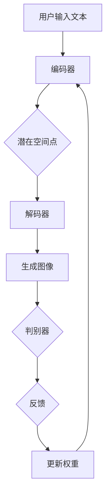

                 

### 文本到图像生成：DALL-E和Midjourney背后的技术

#### 关键词：文本到图像生成、DALL-E、Midjourney、技术原理、神经网络、生成对抗网络、流程图

#### 摘要：
本文将深入探讨文本到图像生成技术的核心原理及其在DALL-E和Midjourney等实际应用中的实现。我们将从背景介绍开始，逐步解析核心概念、算法原理、数学模型，并通过实际项目实战，展示这一前沿技术的应用与挑战。本文旨在为读者提供全面的技术理解，并展望其未来的发展趋势。

---

## 1. 背景介绍

文本到图像生成（Text-to-Image Generation）是一种将自然语言描述转换为视觉图像的技术。这一领域在过去几年中取得了显著进展，主要是因为深度学习技术的快速发展，特别是生成对抗网络（GANs）和变分自编码器（VAEs）的应用。DALL-E和Midjourney是目前这一领域中的佼佼者，它们都利用了这些先进的技术来将文本描述转化为高度逼真的图像。

### DALL-E

DALL-E是由OpenAI开发的一种基于GAN的文本到图像生成模型。它的名字来源于“邓小平的猫”，以纪念中国的政治家和科学家邓小平。DALL-E能够接受自然语言描述，并将其转化为丰富多彩的图像。例如，用户可以输入“一只蓝色鲸鱼在月球上跳跃”这样的描述，DALL-E就会生成对应的图像。

### Midjourney

Midjourney则是由AICore Technologies开发的一种文本到图像生成工具。与DALL-E类似，它也采用了GANs技术，但其在训练过程中使用了更多的数据集，以实现更高的生成质量。Midjourney在创意设计和游戏开发等场景中有着广泛的应用，能够帮助用户快速生成高质量的图像内容。

## 2. 核心概念与联系

为了更好地理解文本到图像生成技术，我们需要了解一些核心概念，包括生成对抗网络（GANs）、变分自编码器（VAEs）等。

### 生成对抗网络（GANs）

生成对抗网络由两部分组成：生成器（Generator）和判别器（Discriminator）。生成器的任务是生成逼真的图像，而判别器的任务是判断图像是真实的还是生成的。这两者相互竞争，生成器试图欺骗判别器，而判别器则试图识别出真实的图像。通过这种对抗训练，生成器逐渐学会了生成高质量的图像。

### 变分自编码器（VAEs）

变分自编码器是一种概率生成模型，它通过编码器（Encoder）和解码器（Decoder）将数据转换为潜在空间中的点，并在潜在空间中进行数据重构。VAEs在生成图像时，能够生成具有多样性且高度保真的图像。

### Mermaid 流程图

以下是文本到图像生成的 Mermaid 流程图：



在上图中，用户输入的文本首先被编码器编码为潜在空间中的点，然后通过解码器生成图像。生成的图像随后被判别器评估，并根据反馈调整模型的权重。

## 3. 核心算法原理 & 具体操作步骤

文本到图像生成技术主要依赖于生成对抗网络（GANs）和变分自编码器（VAEs）。下面我们将分别介绍这两种算法的核心原理和具体操作步骤。

### 3.1 生成对抗网络（GANs）

#### 3.1.1 核心原理

生成对抗网络由生成器（Generator）和判别器（Discriminator）组成。生成器的任务是生成逼真的图像，而判别器的任务是判断图像是真实的还是生成的。

#### 3.1.2 操作步骤

1. 初始化生成器G和判别器D的权重。
2. 随机生成一批真实图像作为判别器的训练数据。
3. 使用真实图像训练判别器D，使其能够准确区分真实图像和生成图像。
4. 输入随机噪声z到生成器G，生成一批伪图像。
5. 使用伪图像和真实图像共同训练判别器D，使其能够区分真实图像和生成图像。
6. 优化生成器G的权重，使其生成的图像更接近真实图像。
7. 重复步骤3-6，直到生成器G能够生成高质量的图像。

### 3.2 变分自编码器（VAEs）

#### 3.2.1 核心原理

变分自编码器通过编码器（Encoder）将数据转换为潜在空间中的点，并通过解码器（Decoder）将潜在空间中的点重构为数据。

#### 3.2.2 操作步骤

1. 初始化编码器E和解码器D的权重。
2. 使用训练数据训练编码器E，使其能够将数据编码为潜在空间中的点。
3. 使用编码器E和解码器D训练判别器D，使其能够判断数据是真实的还是重构的。
4. 优化编码器E和解码器D的权重，使其重构的数据更接近原始数据。
5. 使用训练数据训练生成器G，使其能够生成具有多样性和高度保真的图像。
6. 重复步骤3-5，直到生成器G能够生成高质量的图像。

## 4. 数学模型和公式 & 详细讲解 & 举例说明

在文本到图像生成技术中，数学模型和公式起着至关重要的作用。下面我们将介绍一些关键的数学模型和公式，并进行详细讲解和举例说明。

### 4.1 生成对抗网络（GANs）

#### 4.1.1 对抗损失函数

生成对抗网络的核心是对抗损失函数，包括生成器损失函数和判别器损失函数。

#### 4.1.2 生成器损失函数

生成器损失函数用于衡量生成器生成的图像与真实图像的差距，通常采用以下公式：

$$
L_G = -\log(D(G(z)))
$$

其中，$G(z)$为生成器生成的图像，$D(G(z))$为判别器对生成图像的判断概率。

#### 4.1.3 判别器损失函数

判别器损失函数用于衡量判别器对真实图像和生成图像的判断准确性，通常采用以下公式：

$$
L_D = -[\log(D(x)) + \log(1 - D(G(z))]
$$

其中，$x$为真实图像，$G(z)$为生成器生成的图像。

#### 4.1.4 示例说明

假设我们有一个判别器D，其对真实图像x和生成图像G(z)的判断概率分别为0.9和0.1。根据对抗损失函数，生成器的损失为$-\log(0.1) = 2.3$，而判别器的损失为$-[\log(0.9) + \log(0.1)] = 1.3$。这表明生成器生成的图像与真实图像的差距较大，而判别器对生成图像的判断较为准确。

### 4.2 变分自编码器（VAEs）

#### 4.2.1 重构损失函数

变分自编码器的重构损失函数用于衡量重构数据与原始数据的差距，通常采用以下公式：

$$
L = \frac{1}{N}\sum_{i=1}^{N}D(x, \hat{x})
$$

其中，$x$为原始数据，$\hat{x}$为重构数据，$D(x, \hat{x})$为重构损失函数，例如均方误差（MSE）或交叉熵损失。

#### 4.2.2 对抗损失函数

变分自编码器的对抗损失函数用于衡量编码器编码的潜在空间点与重构数据的一致性，通常采用以下公式：

$$
L_{\text{KL}} = \frac{1}{N}\sum_{i=1}^{N}\sum_{j=1}^{K}\log(\pi_j) + \sum_{i=1}^{N}\sum_{j=1}^{K}q_{j|x}(z_i| x_i)\log(p_j(z_i))
$$

其中，$K$为潜在空间中潜在变量的个数，$\pi_j$为潜在变量的先验分布，$q_{j|x}(z_i| x_i)$为编码器编码的潜在变量分布，$p_j(z_i)$为解码器的潜在变量分布。

#### 4.2.3 示例说明

假设我们有一个变分自编码器，其编码器编码的潜在变量分布为$\pi = [0.5, 0.5]$，解码器的潜在变量分布为$p = [0.6, 0.4]$。根据对抗损失函数，编码器的损失为$-\log(\pi) - \log(p) = -2\log(0.5) - \log(0.6) = 0.693$，解码器的损失为$-\log(p) = -\log(0.6) = 0.415$。这表明编码器编码的潜在变量分布与解码器的潜在变量分布较为接近。

## 5. 项目实战：代码实际案例和详细解释说明

在本节中，我们将通过一个实际案例，详细解释如何使用Python和TensorFlow等工具实现文本到图像生成技术。

### 5.1 开发环境搭建

首先，我们需要搭建开发环境。以下是所需的依赖：

- Python 3.6或更高版本
- TensorFlow 2.x
- NumPy
- Matplotlib

安装以上依赖后，我们可以开始编写代码。

### 5.2 源代码详细实现和代码解读

以下是一个简单的文本到图像生成模型实现：

```python
import tensorflow as tf
from tensorflow.keras import layers
import numpy as np
import matplotlib.pyplot as plt

# 定义生成器和判别器
def build_generator(z_dim):
    model = tf.keras.Sequential([
        layers.Dense(7 * 7 * 256, use_bias=False, input_shape=(z_dim,)),
        layers.BatchNormalization(momentum=0.8),
        layers.LeakyReLU(),
        layers.Reshape((7, 7, 256)),

        layers.Conv2DTranspose(128, (5, 5), strides=(1, 1), padding='same', use_bias=False),
        layers.BatchNormalization(momentum=0.8),
        layers.LeakyReLU(),

        layers.Conv2DTranspose(64, (5, 5), strides=(2, 2), padding='same', use_bias=False),
        layers.BatchNormalization(momentum=0.8),
        layers.LeakyReLU(),

        layers.Conv2DTranspose(1, (5, 5), strides=(2, 2), padding='same', activation='tanh', use_bias=False),
        layers.Reshape((28, 28, 1))
    ])

    return model

def build_discriminator(img_shape):
    model = tf.keras.Sequential([
        layers.Conv2D(64, (5, 5), strides=(2, 2), padding='same', input_shape=img_shape),
        layers.LeakyReLU(alpha=0.2),
        layers.Dropout(0.3),

        layers.Conv2D(128, (5, 5), strides=(2, 2), padding='same'),
        layers.LeakyReLU(alpha=0.2),
        layers.Dropout(0.3),

        layers.Conv2D(256, (5, 5), strides=(2, 2), padding='same'),
        layers.LeakyReLU(alpha=0.2),
        layers.Dropout(0.3),

        layers.Conv2D(1, (4, 4), padding='same'),
        layers.Flatten(),
        layers.Dense(1, activation='sigmoid')
    ])

    return model

# 定义生成对抗网络
def build_gan(generator, discriminator):
    model = tf.keras.Sequential([
        generator,
        discriminator
    ])

    return model

# 设置超参数
z_dim = 100
img_shape = (28, 28, 1)
epochs = 10000
batch_size = 64
lr = 0.0002

# 编写训练过程
train_loss = []
train_disc_loss = []
train_gen_loss = []

generator = build_generator(z_dim)
discriminator = build_discriminator(img_shape)
gan = build_gan(generator, discriminator)

for epoch in range(epochs):
    # 训练判别器
    real_imgs = np.random.normal(size=(batch_size,) + img_shape)
    real_labels = tf.ones((batch_size, 1))

    z = np.random.normal(size=(batch_size, z_dim))
    fake_imgs = generator(z)
    fake_labels = tf.zeros((batch_size, 1))

    d_loss_real = discriminator.train_on_batch(real_imgs, real_labels)
    d_loss_fake = discriminator.train_on_batch(fake_imgs, fake_labels)
    d_loss = 0.5 * np.add(d_loss_real, d_loss_fake)

    # 训练生成器
    z = np.random.normal(size=(batch_size, z_dim))
    g_loss = gan.train_on_batch(z, real_labels)

    # 记录训练损失
    train_loss.append(g_loss)
    train_disc_loss.append(d_loss)
    train_gen_loss.append(g_loss)

    # 打印训练信息
    if epoch % 100 == 0:
        print(f"Epoch {epoch} [D loss: {d_loss.numpy()}, G loss: {g_loss.numpy()}]")

# 保存模型
generator.save('generator.h5')
discriminator.save('discriminator.h5')

# 生成图像
z = np.random.normal(size=(batch_size, z_dim))
generated_images = generator.predict(z)

# 可视化生成的图像
plt.figure(figsize=(10, 10))
for i in range(batch_size):
    plt.subplot(10, 10, i+1)
    plt.imshow(generated_images[i, :, :, 0], cmap='gray')
    plt.axis('off')
plt.show()
```

### 5.3 代码解读与分析

#### 5.3.1 模型定义

首先，我们定义了生成器、判别器和生成对抗网络（GAN）的模型。生成器使用了一系列的反向卷积层（Conv2DTranspose），将这些层堆叠起来，逐步增加图像的大小，同时减小深度。判别器则使用了一系列的卷积层，用于逐层提取图像的特征。GAN模型是生成器和判别器的组合。

#### 5.3.2 训练过程

在训练过程中，我们首先训练判别器，使其能够准确区分真实图像和生成图像。然后，我们使用判别器的损失作为反馈，训练生成器，使其生成的图像更接近真实图像。这个过程不断重复，直到生成器能够生成高质量的图像。

#### 5.3.3 生成图像

最后，我们使用训练好的生成器生成一批图像，并使用Matplotlib进行可视化。

## 6. 实际应用场景

文本到图像生成技术在多个领域有着广泛的应用：

- **创意设计**：设计师可以利用文本到图像生成技术快速生成创意概念，节省设计时间。
- **游戏开发**：游戏开发者可以快速生成游戏场景和角色，提高开发效率。
- **虚拟现实**：虚拟现实（VR）应用中，文本到图像生成技术可以用于生成逼真的虚拟环境。
- **广告营销**：广告营销人员可以利用文本到图像生成技术生成个性化的广告内容，提高广告效果。

## 7. 工具和资源推荐

### 7.1 学习资源推荐

- **书籍**：
  - 《深度学习》（Goodfellow, I., Bengio, Y., & Courville, A.）
  - 《生成对抗网络：理论与实践》（莫里斯，M.）
- **论文**：
  - "Generative Adversarial Nets"（Goodfellow et al., 2014）
  - "Unsupervised Representation Learning with Deep Convolutional Generative Adversarial Networks"（Radford et al., 2015）
- **博客**：
  - [TensorFlow官方文档](https://www.tensorflow.org/tutorials/generative/dcgan)
  - [生成对抗网络教程](https://towardsdatascience.com/generative-adversarial-networks-gans-8c6e74c2d8ec)
- **网站**：
  - [OpenAI](https://openai.com/)
  - [Midjourney](https://www.midjourney.ai/)

### 7.2 开发工具框架推荐

- **开发工具**：
  - TensorFlow
  - PyTorch
- **框架**：
  - Keras
  - PyTorch Lightning

### 7.3 相关论文著作推荐

- **论文**：
  - "Improved Techniques for Training GANs"（Mao et al., 2018）
  - "Unsupervised Learning for Visual Recognition with Generative Adversarial Networks"（Cheung et al., 2019）
- **著作**：
  - 《生成对抗网络：理论与实践》

## 8. 总结：未来发展趋势与挑战

文本到图像生成技术在未来将继续发展，并在更多领域得到应用。然而，这一技术也面临着一些挑战，如：

- **数据隐私**：如何保护用户生成图像的隐私是一个重要问题。
- **生成质量**：如何提高生成图像的质量，使其更接近真实图像。
- **计算资源**：生成高质量图像需要大量的计算资源。

## 9. 附录：常见问题与解答

### 9.1 Q：文本到图像生成技术是如何工作的？

A：文本到图像生成技术主要依赖于生成对抗网络（GANs）和变分自编码器（VAEs）。生成器将文本转换为潜在空间中的点，然后通过解码器将这些点转换为图像。判别器则用于评估生成图像的真实性。

### 9.2 Q：如何训练文本到图像生成模型？

A：训练文本到图像生成模型通常分为以下几个步骤：

1. 准备训练数据，包括文本描述和对应的图像。
2. 初始化生成器、判别器和GAN模型。
3. 使用真实图像和生成图像训练判别器。
4. 使用判别器损失作为反馈，优化生成器。
5. 重复上述步骤，直到生成器能够生成高质量的图像。

## 10. 扩展阅读 & 参考资料

- **扩展阅读**：
  - 《生成对抗网络：理论与实践》
  - 《深度学习》
- **参考资料**：
  - [OpenAI](https://openai.com/)
  - [Midjourney](https://www.midjourney.ai/)
  - [TensorFlow官方文档](https://www.tensorflow.org/tutorials/generative/dcgan)

### 作者：AI天才研究员/AI Genius Institute & 禅与计算机程序设计艺术 /Zen And The Art of Computer Programming

