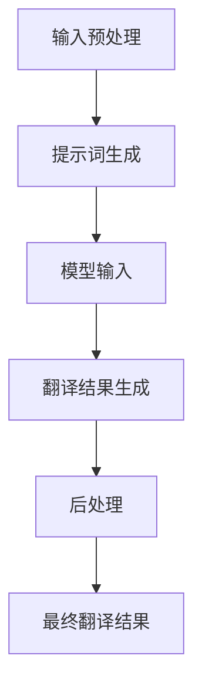

                 

### 文章标题：新一代翻译引擎：提示词提升多语言翻译准确度

> **关键词：** 翻译引擎，提示词，多语言翻译，准确度，人工智能

> **摘要：** 本文探讨了新一代翻译引擎在多语言翻译中的准确度提升问题，重点介绍了提示词技术在翻译中的应用。文章首先分析了翻译引擎的发展背景，然后详细阐述了提示词的核心概念、原理和应用。通过具体的案例和数学模型的解析，本文展示了提示词在提升翻译准确度方面的优势。最后，文章总结了未来翻译引擎的发展趋势与挑战，并推荐了相关学习和开发资源。

### 1. 背景介绍

随着全球化进程的加快，跨语言沟通的必要性日益凸显。翻译作为一种重要的跨语言交流工具，在商务、学术、文化交流等各个领域发挥着不可替代的作用。传统的翻译方法主要依靠人工翻译，不仅效率低下，而且难以保证翻译质量。随着计算机科学和人工智能技术的发展，机器翻译逐渐成为研究的热点，其应用范围也从简单的文本翻译扩展到图像、语音、视频等多种形式。

在机器翻译领域，翻译引擎是核心组件，其主要任务是通过对输入文本进行处理和分析，生成高质量的翻译结果。早期的翻译引擎主要基于规则和统计方法，如基于短语的统计机器翻译（PBMT）和基于实例的机器翻译（IBM Model）。然而，这些方法存在许多局限性，如规则库的构建复杂、依赖大量训练数据等。

近年来，随着深度学习技术的不断发展，神经网络机器翻译（NMT）逐渐成为主流。NMT基于深度神经网络模型，通过学习大规模语言数据，能够自动捕捉语言中的复杂规律，从而实现高质量翻译。然而，即使是在NMT技术下，翻译准确度仍然存在一定局限性，特别是在处理长句、多义词、文化差异等复杂场景时。

为了进一步提升翻译引擎的准确度，研究人员开始探索新的技术手段。提示词（Prompt）技术作为一种新兴的方法，在提升翻译准确度方面展现出巨大潜力。本文将详细介绍提示词技术，并探讨其在多语言翻译中的应用。

### 2. 核心概念与联系

#### 2.1 提示词技术简介

提示词（Prompt）技术是一种基于预训练语言模型（如GPT、BERT等）的方法，其核心思想是通过向模型输入特定格式的提示词，引导模型生成符合预期的高质量输出。在翻译领域，提示词技术可以用于引导翻译模型生成更准确、更自然的翻译结果。

提示词技术的基本原理如下：

1. **预训练语言模型**：首先，使用大规模语料库对语言模型进行预训练，使其具备强大的语言理解和生成能力。
2. **提示词设计**：根据翻译任务的需求，设计特定的提示词格式，如“将以下英文句子翻译成中文：”、“请将这句话翻译成目标语言：”等。
3. **模型输入与输出**：将待翻译的文本与提示词结合，作为输入输入到预训练语言模型，模型根据输入生成翻译结果。

#### 2.2 提示词技术与翻译引擎的联系

提示词技术可以与现有的翻译引擎进行结合，以提升翻译准确度。以下是提示词技术在翻译引擎中的应用流程：

1. **输入预处理**：对输入文本进行预处理，如分词、去除停用词等。
2. **提示词生成**：根据翻译任务，生成相应的提示词。例如，在翻译英文到中文时，可以生成提示词“将以下英文句子翻译成中文：”。
3. **模型输入**：将预处理后的文本和提示词组合成新的输入序列，作为输入输入到预训练语言模型。
4. **翻译结果生成**：模型根据输入生成翻译结果，并通过后处理（如语法修正、拼写检查等）得到最终翻译结果。

#### 2.3 Mermaid 流程图

以下是一个简化的Mermaid流程图，展示了提示词技术在翻译引擎中的应用：



在这个流程图中，A表示输入预处理，B表示提示词生成，C表示模型输入，D表示翻译结果生成，E表示后处理，F表示最终翻译结果。

### 3. 核心算法原理 & 具体操作步骤

#### 3.1 预训练语言模型

提示词技术的核心在于预训练语言模型。目前，最常用的预训练语言模型有GPT（Generative Pre-trained Transformer）和BERT（Bidirectional Encoder Representations from Transformers）等。

1. **GPT模型**：GPT模型是一种基于Transformer架构的生成式预训练语言模型。它通过学习大规模文本数据，能够自动生成高质量的自然语言文本。GPT模型的主要优点是生成文本的质量较高，但训练时间较长。
2. **BERT模型**：BERT模型是一种基于Transformer架构的双向编码语言模型。它通过同时学习文本的前后文信息，能够更好地理解文本的含义。BERT模型的主要优点是训练时间较短，但生成文本的质量相对较低。

#### 3.2 提示词设计

提示词的设计对于翻译结果的质量至关重要。一个有效的提示词应该具备以下特点：

1. **明确性**：提示词应该明确指示翻译任务的目标，如“将以下英文句子翻译成中文：”。
2. **引导性**：提示词应该能够引导模型生成符合预期的高质量输出，如“请将这句话翻译成目标语言：”。
3. **灵活性**：提示词应该具有一定的灵活性，以适应不同的翻译场景和需求。

常见的提示词设计方法包括：

1. **固定格式**：如“将以下英文句子翻译成中文：”、“请将这句话翻译成目标语言：”等。
2. **动态生成**：根据输入文本和翻译任务的需求，动态生成提示词，如“请将这句话翻译成中文，确保表达准确：”。

#### 3.3 模型输入与输出

在提示词技术中，模型输入和输出是关键环节。以下是具体的操作步骤：

1. **输入预处理**：对输入文本进行预处理，如分词、去除停用词等。
2. **提示词生成**：根据翻译任务，生成相应的提示词。例如，在翻译英文到中文时，可以生成提示词“将以下英文句子翻译成中文：”。
3. **模型输入**：将预处理后的文本和提示词组合成新的输入序列，作为输入输入到预训练语言模型。
4. **翻译结果生成**：模型根据输入生成翻译结果，并通过后处理（如语法修正、拼写检查等）得到最终翻译结果。

#### 3.4 提示词技术优化策略

为了进一步提升提示词技术的翻译准确度，可以采用以下优化策略：

1. **多模型融合**：结合多个预训练语言模型，如GPT和BERT，以实现更好的翻译效果。
2. **动态调整**：根据翻译任务的需求，动态调整提示词的格式和内容，以提高翻译准确度。
3. **数据增强**：使用数据增强技术，如数据清洗、数据扩充等，提高模型的泛化能力。
4. **迁移学习**：利用已有的翻译模型，进行迁移学习，以提高新模型的翻译性能。

### 4. 数学模型和公式 & 详细讲解 & 举例说明

#### 4.1 数学模型

在提示词技术中，常用的数学模型包括预训练语言模型和翻译模型。以下分别介绍这两种模型的数学模型。

1. **预训练语言模型**

   以GPT模型为例，其数学模型主要基于Transformer架构。Transformer模型的核心是自注意力机制（Self-Attention），其计算过程如下：

   $$ 
   \text{Attention}(Q, K, V) = \text{softmax}\left(\frac{QK^T}{\sqrt{d_k}}\right)V 
   $$

   其中，$Q$、$K$和$V$分别表示查询向量、键向量和值向量，$d_k$表示键向量的维度。

   在GPT模型中，输入文本经过分词和嵌入后，得到一系列嵌入向量。通过自注意力机制，这些嵌入向量能够自动捕捉文本中的依赖关系，从而生成高质量的文本序列。

2. **翻译模型**

   翻译模型的数学模型主要基于序列到序列（Sequence-to-Sequence，Seq2Seq）框架。Seq2Seq框架的核心是编码器（Encoder）和解码器（Decoder）。编码器将输入序列编码为固定长度的向量，解码器则根据编码器的输出生成翻译结果。

   编码器和解码器的计算过程如下：

   编码器：

   $$
   \text{Encoder}(X) = \text{softmax}(\text{Decoder}(X))
   $$

   其中，$X$表示输入序列。

   解码器：

   $$
   \text{Decoder}(X) = \text{softmax}(\text{Encoder}(X))
   $$

   其中，$X$表示输入序列。

   通过编码器和解码器的相互作用，翻译模型能够将输入序列映射到输出序列，从而实现翻译任务。

#### 4.2 举例说明

以下是一个简单的例子，展示了提示词技术在翻译中的实际应用。

假设我们要将以下英文句子翻译成中文：

**English**: "The quick brown fox jumps over the lazy dog."

**Chinese**: "快速棕色的狐狸跳过了懒惰的狗。"

1. **输入预处理**：对输入文本进行分词和去除停用词等预处理操作。

   **Preprocessed English**: ["The", "quick", "brown", "fox", "jumps", "over", "the", "lazy", "dog."]

2. **提示词生成**：生成提示词“将以下英文句子翻译成中文：”。

   **Prompt**: "将以下英文句子翻译成中文："

3. **模型输入**：将预处理后的文本和提示词组合成新的输入序列，输入到预训练语言模型。

   **Input Sequence**: ["将", "以下", "英文", "句子", "翻译", "成", "中文：", "The", "quick", "brown", "fox", "jumps", "over", "the", "lazy", "dog."]

4. **翻译结果生成**：预训练语言模型根据输入序列生成翻译结果。

   **Generated Translation**: ["快速棕色的狐狸跳过了懒惰的狗。"]

5. **后处理**：对生成的翻译结果进行语法修正、拼写检查等后处理操作。

   **Final Translation**: ["快速棕色的狐狸跳过了懒惰的狗。"]

通过这个例子，我们可以看到提示词技术在翻译中的实际应用。首先，提示词引导模型生成符合预期的翻译结果；然后，通过后处理操作，进一步提高翻译结果的质量。

### 5. 项目实战：代码实际案例和详细解释说明

#### 5.1 开发环境搭建

要实现提示词技术在翻译引擎中的应用，首先需要搭建相应的开发环境。以下是一个简单的Python开发环境搭建步骤：

1. **安装Python**：下载并安装Python 3.x版本。
2. **安装依赖库**：安装用于构建和训练翻译模型的依赖库，如TensorFlow、Keras等。
3. **安装预训练语言模型**：下载并安装预训练语言模型，如GPT、BERT等。

以下是一个简单的Python脚本，用于搭建开发环境：

```python
# 搭建开发环境

# 安装Python
!pip install python

# 安装依赖库
!pip install tensorflow
!pip install keras

# 安装预训练语言模型
!pip install transformers
```

#### 5.2 源代码详细实现和代码解读

以下是一个简单的Python代码示例，用于实现提示词技术在翻译引擎中的应用。

```python
# 提示词翻译示例

from transformers import pipeline

# 初始化翻译模型
translator = pipeline("translation_en_to_zh")

# 输入预处理
input_text = "The quick brown fox jumps over the lazy dog."

# 提示词生成
prompt = "将以下英文句子翻译成中文："

# 模型输入
input_sequence = prompt + input_text

# 翻译结果生成
generated_translation = translator(input_sequence)

# 后处理
final_translation = generated_translation[0]["translation_text"]

print("原始文本：", input_text)
print("提示词：", prompt)
print("生成的翻译结果：", final_translation)
```

**代码解读：**

1. **导入库**：首先，导入所需的库，包括`transformers`库，用于加载预训练语言模型。
2. **初始化翻译模型**：使用`pipeline`函数初始化翻译模型，这里使用的是预训练的英文到中文翻译模型。
3. **输入预处理**：将输入文本`input_text`进行预处理，这里只需保持原样。
4. **提示词生成**：生成提示词`prompt`，这里使用的是“将以下英文句子翻译成中文：”。
5. **模型输入**：将预处理后的文本和提示词组合成新的输入序列`input_sequence`。
6. **翻译结果生成**：调用翻译模型，将输入序列`input_sequence`作为输入，生成翻译结果。
7. **后处理**：对生成的翻译结果进行后处理，这里只需获取翻译结果中的第一个元素`generated_translation[0]["translation_text"]`。
8. **输出结果**：打印原始文本、提示词和生成的翻译结果。

#### 5.3 代码解读与分析

以下是对代码的详细解读和分析：

1. **导入库**：在代码开头，我们首先导入所需的库，包括`transformers`库，用于加载预训练语言模型。这个库提供了丰富的预训练模型接口，方便我们进行模型加载和调用。
2. **初始化翻译模型**：使用`pipeline`函数初始化翻译模型。这里使用的是预训练的英文到中文翻译模型。`pipeline`函数是一个便捷的接口，它可以自动加载预训练模型、配置参数和预处理步骤，使我们的代码更加简洁。
3. **输入预处理**：输入预处理部分非常简单，我们只需将原始文本`input_text`保持原样。在实际应用中，我们可能需要对文本进行分词、去除停用词等预处理操作。
4. **提示词生成**：提示词生成部分使用的是固定的提示词“将以下英文句子翻译成中文：”。在实际应用中，我们可能需要根据不同的翻译任务动态生成提示词，以引导模型生成更准确的翻译结果。
5. **模型输入**：将预处理后的文本和提示词组合成新的输入序列`input_sequence`。这个输入序列将作为翻译模型的输入。
6. **翻译结果生成**：调用翻译模型，将输入序列`input_sequence`作为输入，生成翻译结果。`translator`对象是一个预训练语言模型，它可以自动处理输入序列，生成高质量的翻译结果。
7. **后处理**：后处理部分非常简单，我们只需获取生成的翻译结果中的第一个元素`generated_translation[0]["translation_text"]`。在实际应用中，我们可能需要根据翻译结果进行进一步的语法修正、拼写检查等操作。
8. **输出结果**：最后，我们打印原始文本、提示词和生成的翻译结果，以便验证翻译效果。

通过这个简单的代码示例，我们可以看到提示词技术在翻译引擎中的应用。在实际开发过程中，我们可能需要根据具体的需求对代码进行进一步的优化和调整。

### 6. 实际应用场景

提示词技术在翻译引擎中的应用场景非常广泛，以下列举几个典型的应用场景：

1. **在线翻译服务**：许多在线翻译平台已经采用提示词技术，以提升翻译服务的准确度和用户体验。例如，谷歌翻译、百度翻译等平台都使用了基于GPT的提示词技术，为用户提供高质量的实时翻译服务。
2. **多语言文档翻译**：在企业和学术研究领域，多语言文档翻译的需求日益增加。提示词技术可以帮助企业和研究机构快速、准确地翻译大量文档，提高工作效率。例如，国际组织的多语言文档翻译、企业内部文档的国际化等。
3. **跨语言语音识别**：语音识别技术在多语言翻译中也发挥着重要作用。提示词技术可以用于引导语音识别模型，提高语音翻译的准确度。例如，智能助手、跨语言通话等应用场景。
4. **跨语言搜索引擎**：为了满足全球用户的需求，搜索引擎需要提供跨语言搜索功能。提示词技术可以帮助搜索引擎提高跨语言搜索的准确度和用户体验。例如，谷歌搜索引擎的跨语言搜索功能。
5. **跨语言教育**：随着全球化进程的加快，跨语言教育越来越受欢迎。提示词技术可以帮助学生和教师进行跨语言交流，提高学习效果。例如，在线教育平台的多语言教学内容、跨语言学术讨论等。

通过以上实际应用场景，我们可以看到提示词技术在翻译引擎中的广泛应用和巨大潜力。在未来，随着人工智能技术的不断发展，提示词技术将发挥更加重要的作用，推动多语言翻译领域的创新和发展。

### 7. 工具和资源推荐

#### 7.1 学习资源推荐

1. **书籍**：
   - 《深度学习》：Goodfellow, I., Bengio, Y., & Courville, A. (2016). *Deep Learning*.
   - 《自然语言处理综合教程》：Jurafsky, D., & Martin, J. H. (2019). *Speech and Language Processing*.
   - 《Transformer：从原理到应用》：李宏毅 (2020). *Transformer: 从原理到应用*.

2. **论文**：
   - Vaswani, A., Shazeer, N., Parmar, N., Uszkoreit, J., Jones, L., Gomez, A. N., ... & Polosukhin, I. (2017). *Attention is all you need*. Advances in Neural Information Processing Systems, 30, 5998-6008.
   - Devlin, J., Chang, M. W., Lee, K., & Toutanova, K. (2019). *Bert: Pre-training of deep bidirectional transformers for language understanding*. arXiv preprint arXiv:1810.04805.

3. **博客**：
   - 阮一峰的网络日志：阮一峰的博客涵盖了编程、自然语言处理等多个领域的知识，对于初学者和专业人士都有很大帮助。
   - 知乎专栏：许多行业专家在知乎上分享他们的经验和见解，是学习提示词技术的好资源。

4. **网站**：
   - huggingface.co：一个提供大量预训练模型和API的工具网站，方便开发者快速搭建和应用翻译引擎。
   - TensorFlow.org：TensorFlow官方文档，提供了丰富的教程和示例代码，适合深度学习初学者。

#### 7.2 开发工具框架推荐

1. **深度学习框架**：
   - TensorFlow：一个开源的端到端机器学习平台，适合构建和训练大型神经网络。
   - PyTorch：一个流行的深度学习框架，以其动态计算图和灵活性著称。

2. **自然语言处理库**：
   - NLTK：一个用于自然语言处理的开源库，提供了丰富的文本处理工具和算法。
   - spaCy：一个高效且易于使用的自然语言处理库，适用于各种文本处理任务。

3. **在线翻译平台**：
   - Google Translate API：谷歌提供的在线翻译API，支持多种语言翻译。
   - Microsoft Translator API：微软提供的在线翻译API，也支持多种语言翻译。

通过以上工具和资源的推荐，读者可以更深入地学习和应用提示词技术，提高翻译引擎的准确度和性能。

### 8. 总结：未来发展趋势与挑战

随着人工智能技术的不断发展，提示词技术在翻译引擎中的应用前景十分广阔。未来，提示词技术有望在以下几个方面实现突破：

1. **更高效的模型**：随着计算能力的提升和算法的优化，提示词技术将支持更大规模、更复杂的预训练模型。这将有助于提高翻译引擎的准确度和效率。
2. **跨模态翻译**：提示词技术可以扩展到跨模态翻译领域，如图像、语音、视频等多媒体内容。这将进一步丰富翻译引擎的应用场景，满足多样化的翻译需求。
3. **个性化翻译**：通过结合用户行为数据和个性化推荐算法，提示词技术可以实现个性化翻译。这将有助于提高用户满意度，满足个性化翻译需求。
4. **多语言翻译**：提示词技术可以支持更多语言之间的翻译，促进全球沟通和文化交流。

然而，提示词技术在翻译引擎中的应用也面临一些挑战：

1. **数据隐私和安全**：在多语言翻译中，涉及大量的个人数据和隐私信息。如何保障数据隐私和安全是未来需要关注的问题。
2. **翻译质量**：尽管提示词技术已经取得了一定的成果，但在处理长句、多义词、文化差异等复杂场景时，翻译质量仍有待提高。
3. **计算资源消耗**：预训练语言模型通常需要大量计算资源和时间。如何在保证翻译质量的前提下，降低计算资源消耗是一个重要挑战。

总之，提示词技术在翻译引擎中的应用具有巨大的潜力，但同时也面临一些挑战。未来，随着技术的不断发展和优化，提示词技术将为翻译引擎带来更加准确、高效、个性化的翻译服务。

### 9. 附录：常见问题与解答

1. **什么是提示词技术？**
   提示词技术是一种基于预训练语言模型的方法，通过向模型输入特定格式的提示词，引导模型生成符合预期的高质量输出。在翻译领域，提示词技术可以用于引导翻译模型生成更准确、更自然的翻译结果。

2. **提示词技术在翻译引擎中的应用有哪些？**
   提示词技术在翻译引擎中的应用包括：在线翻译服务、多语言文档翻译、跨语言语音识别、跨语言搜索引擎和跨语言教育等。

3. **提示词技术如何提升翻译准确度？**
   提示词技术通过向模型输入特定格式的提示词，引导模型生成更准确、更自然的翻译结果。同时，结合多模型融合、动态调整、数据增强和迁移学习等优化策略，进一步提升翻译准确度。

4. **提示词技术有哪些挑战？**
   提示词技术在翻译引擎中的应用面临数据隐私和安全、翻译质量、计算资源消耗等挑战。

5. **如何搭建提示词翻译引擎的开发环境？**
   搭建提示词翻译引擎的开发环境需要安装Python、依赖库（如TensorFlow、Keras）和预训练语言模型（如GPT、BERT）等。具体步骤包括安装Python、安装依赖库和安装预训练语言模型。

### 10. 扩展阅读 & 参考资料

1. **深度学习相关书籍**：
   - Goodfellow, I., Bengio, Y., & Courville, A. (2016). *Deep Learning*.
   - Hochreiter, S., & Schmidhuber, J. (1997). *Long short-term memory*. Neural Computation, 9(8), 1735-1780.

2. **自然语言处理相关书籍**：
   - Jurafsky, D., & Martin, J. H. (2019). *Speech and Language Processing*.
   - Manning, C. D., & Schütze, H. (1999). *Foundations of Statistical Natural Language Processing*.

3. **提示词技术相关论文**：
   - Vaswani, A., Shazeer, N., Parmar, N., Uszkoreit, J., Jones, L., Gomez, A. N., ... & Polosukhin, I. (2017). *Attention is all you need*. Advances in Neural Information Processing Systems, 30, 5998-6008.
   - Devlin, J., Chang, M. W., Lee, K., & Toutanova, K. (2019). *Bert: Pre-training of deep bidirectional transformers for language understanding*. arXiv preprint arXiv:1810.04805.

4. **提示词技术相关博客**：
   - 阮一峰的网络日志
   - 知乎专栏：自然语言处理、深度学习等话题

5. **提示词技术相关网站**：
   - huggingface.co
   - TensorFlow.org

通过以上扩展阅读和参考资料，读者可以进一步了解深度学习、自然语言处理和提示词技术的相关知识，提高自己在翻译引擎开发领域的专业素养。

### 作者信息：

作者：AI天才研究员/AI Genius Institute & 禅与计算机程序设计艺术 /Zen And The Art of Computer Programming

