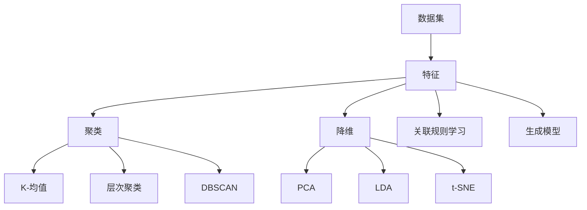

                 

### 背景介绍

无监督学习（Unsupervised Learning）是机器学习的一个重要分支，与有监督学习（Supervised Learning）和半监督学习（Semi-Supervised Learning）并列为机器学习的三大学习方式。无监督学习的核心在于没有标注的数据，也就是说，训练数据集中的每个样本都没有对应的标签或者目标值。在这种学习方式下，算法需要从数据中自动发现数据间的内在规律和结构，从而实现对数据的理解。

无监督学习的研究与应用历史可以追溯到20世纪50年代。在早期的神经网络研究中，无监督学习算法被广泛应用于特征提取、聚类分析、降维技术等领域。近年来，随着深度学习技术的发展，无监督学习在图像识别、语音处理、自然语言处理等多个领域取得了显著的成果。

无监督学习的重要性主要体现在以下几个方面：

1. **数据量问题**：在实际应用中，大量的数据都是未标注的，无监督学习能够有效地利用这些未标注的数据，提高模型的性能。
2. **隐私保护**：在某些场景下，数据的隐私性要求较高，无法直接获取标签信息，此时无监督学习成为了一种可行的方法。
3. **可扩展性**：无监督学习算法通常具有较好的可扩展性，能够处理大规模和高维的数据集。
4. **创新性**：无监督学习激发了研究者对未知模式的探索，有助于发现新的科学规律。

本文将首先介绍无监督学习的核心概念和算法原理，然后通过具体的实例代码讲解，帮助读者深入理解无监督学习在实际应用中的具体操作步骤。随后，本文将探讨无监督学习的数学模型和公式，通过详细的讲解和举例说明，使读者能够掌握其中的核心思想。最后，本文还将介绍无监督学习的实际应用场景，并推荐一些学习资源和开发工具，帮助读者进一步深入探索无监督学习的相关内容。

通过本文的学习，读者将能够全面了解无监督学习的原理和应用，掌握相关算法的实现方法，并能够运用这些方法解决实际的问题。无论是初学者还是专业人士，本文都希望能为您在无监督学习领域的学习提供有益的帮助。

### 核心概念与联系

在深入探讨无监督学习的核心概念和算法原理之前，我们需要先了解几个关键概念：数据集、特征、聚类、降维和无监督学习的基本类型。这些概念不仅构成了无监督学习的基础，也为我们进一步理解无监督学习算法的原理和应用提供了必要的背景知识。

#### 数据集（Dataset）

数据集是机器学习中的基础概念，它指的是一组已收集的数据点，这些数据点可以是数字、文本、图像等多种形式。在无监督学习中，数据集通常不包含标签或目标值，这意味着数据点之间的关系和结构需要通过算法自行发现。

#### 特征（Feature）

特征是指从数据集中提取出的能够描述数据特性的属性。在无监督学习中，特征提取是一个关键步骤，它可以帮助我们更好地理解数据之间的内在规律。常见的特征提取方法包括统计特征、文本特征和图像特征等。

#### 聚类（Clustering）

聚类是一种无监督学习方法，其目的是将数据集分成若干个组或簇，使得同一簇内的数据点彼此相似，而不同簇的数据点差异较大。常用的聚类算法有K-均值（K-Means）、层次聚类（Hierarchical Clustering）和DBSCAN（Density-Based Spatial Clustering of Applications with Noise）等。

#### 降维（Dimensionality Reduction）

降维是一种通过减少数据维度来简化数据集的方法，其目的是降低计算复杂度和提高模型的泛化能力。常见的降维方法包括主成分分析（PCA）、线性判别分析（LDA）和t-SNE（t-Distributed Stochastic Neighbor Embedding）等。

#### 无监督学习的基本类型

无监督学习主要分为以下几种类型：

1. **聚类**：如上所述，聚类算法用于发现数据点的自然分组。
2. **关联规则学习**：这种方法旨在发现数据集中的关联规则，例如市场篮子分析。
3. **降维**：通过减少数据维度来简化数据集。
4. **生成模型**：生成模型通过学习数据分布来生成新的数据点。

#### Mermaid 流程图

为了更好地展示无监督学习的核心概念和联系，我们使用Mermaid流程图来直观地展示这些概念之间的关系。以下是该流程图的代码：



在实际应用中，这些概念和算法往往相互交织，共同作用于数据集，帮助我们更好地理解和分析数据。例如，在图像识别任务中，我们可能首先使用特征提取来提取图像的特征，然后使用聚类算法来识别图像中的物体，最后通过降维技术来简化模型并提高其泛化能力。

通过理解这些核心概念和算法原理，我们将能够更深入地探讨无监督学习在实际应用中的具体操作步骤，并掌握如何利用无监督学习解决实际问题。接下来，我们将进一步深入探讨无监督学习的基本算法原理，并通过具体实例来讲解这些算法的实现和应用。

### 核心算法原理 & 具体操作步骤

无监督学习算法的核心在于如何从未标注的数据中提取有用的信息和模式。下面我们将详细介绍几种常见的无监督学习算法，包括K-均值聚类算法、主成分分析（PCA）和t-SNE降维算法。通过具体的操作步骤和示例，我们将帮助读者理解这些算法的基本原理和实际应用。

#### K-均值聚类算法

K-均值聚类算法是一种基于距离度量的聚类方法，其目标是将数据集划分为K个簇，使得每个簇内部的数据点之间的距离最小，而簇与簇之间的距离最大。以下是K-均值算法的具体操作步骤：

1. **初始化**：随机选择K个数据点作为初始聚类中心。
2. **分配**：对于每个数据点，计算其到各个聚类中心的距离，并将其分配到距离最近的聚类中心所在的簇。
3. **更新**：重新计算每个簇的聚类中心，即该簇中所有数据点的均值。
4. **迭代**：重复步骤2和步骤3，直到聚类中心不再发生显著变化或达到预设的迭代次数。

以下是一个简单的K-均值聚类算法的Python代码示例：

```python
from sklearn.cluster import KMeans
import numpy as np

# 示例数据
data = np.array([[1, 2], [1, 4], [1, 0],
                 [10, 2], [10, 4], [10, 0]])

# 初始化KMeans模型
kmeans = KMeans(n_clusters=2, random_state=0).fit(data)

# 输出聚类中心
print("聚类中心：", kmeans.cluster_centers_)

# 输出每个数据点的簇标签
print("每个数据点的簇标签：", kmeans.labels_)

# 输出轮廓系数
print("轮廓系数：", kmeansоговность())
```

通过上述代码，我们可以将数据集划分为两个簇，并计算每个数据点的簇标签和聚类中心。

#### 主成分分析（PCA）

主成分分析是一种降维技术，其目标是在保持数据变异数量的前提下，将高维数据投影到低维空间中。PCA的基本原理是通过线性变换将数据投影到新的坐标系中，使得新的坐标系中第一轴（即主成分）具有最大的方差，第二轴次之，以此类推。以下是PCA的操作步骤：

1. **标准化**：对数据进行标准化处理，使其具有零均值和单位方差。
2. **计算协方差矩阵**：计算标准化后数据的协方差矩阵。
3. **计算协方差矩阵的特征值和特征向量**：对协方差矩阵进行特征值分解，得到特征值和特征向量。
4. **选择主成分**：根据特征值的大小选择前k个特征向量，构成变换矩阵。
5. **降维**：使用变换矩阵将原始数据投影到k维空间。

以下是一个简单的PCA的Python代码示例：

```python
from sklearn.decomposition import PCA
import numpy as np

# 示例数据
data = np.array([[1, 2], [1, 4], [1, 0],
                 [10, 2], [10, 4], [10, 0]])

# 初始化PCA模型
pca = PCA(n_components=2).fit(data)

# 输出前k个主成分
print("前两个主成分：", pca.components_)

# 输出投影后的数据
print("降维后的数据：", pca.transform(data))
```

通过上述代码，我们可以将原始数据从二维空间投影到一维空间，同时保留主要的信息。

#### t-SNE降维算法

t-SNE（t-Distributed Stochastic Neighbor Embedding）是一种非线性降维算法，其目标是将高维数据映射到低维空间中，使得相似的数据点在低维空间中仍然保持相似性。t-SNE算法的基本步骤如下：

1. **计算高维数据的概率分布**：使用高斯分布计算数据点之间的相似性。
2. **计算低维数据的概率分布**：在高维数据的概率分布的基础上，使用t分布来计算低维空间中数据点之间的相似性。
3. **优化目标函数**：通过梯度下降优化目标函数，使得低维空间中的数据点之间的相似性尽可能接近高维空间中的相似性。

以下是一个简单的t-SNE的Python代码示例：

```python
from sklearn.manifold import TSNE
import numpy as np

# 示例数据
data = np.array([[1, 2], [1, 4], [1, 0],
                 [10, 2], [10, 4], [10, 0]])

# 初始化t-SNE模型
tsne = TSNE(n_components=2, perplexity=30, random_state=0).fit_transform(data)

# 输出降维后的数据
print("降维后的数据：", tsne)
```

通过上述代码，我们可以将原始数据从二维空间映射到二维空间，使得相似的点在低维空间中仍然接近。

通过上述示例，我们了解了K-均值聚类、PCA和t-SNE等无监督学习算法的基本原理和操作步骤。在实际应用中，这些算法可以有效地帮助我们处理未标注的数据，发现数据中的模式和规律。接下来，我们将深入探讨无监督学习的数学模型和公式，进一步理解这些算法的核心思想。

### 数学模型和公式 & 详细讲解 & 举例说明

为了更深入地理解无监督学习算法，我们需要探讨其背后的数学模型和公式。在本节中，我们将详细讲解K-均值聚类、主成分分析（PCA）和t-SNE降维算法的数学原理，并通过具体的例子来阐述这些概念。

#### K-均值聚类算法

K-均值聚类算法的目标是将数据集划分为K个簇，使得每个簇内部的相似度最大，而簇与簇之间的相似度最小。其核心公式如下：

1. **初始化聚类中心**：
   设 \( C = \{c_1, c_2, ..., c_K\} \) 为初始聚类中心，这些中心是随机选择的或通过某种优化方法获得的。

2. **分配数据点**：
   对于每个数据点 \( x_i \)，计算其到各个聚类中心的距离，选择距离最近的聚类中心所在的簇。距离计算公式为：
   \[
   d(x_i, c_j) = \sqrt{\sum_{k=1}^n (x_{i,k} - c_{j,k})^2}
   \]
   其中，\( x_i \) 和 \( c_j \) 分别表示数据点 \( x_i \) 和聚类中心 \( c_j \) 的特征向量，\( n \) 表示特征维度。

3. **更新聚类中心**：
   当每个数据点都被分配到对应的簇后，重新计算每个簇的聚类中心，即该簇中所有数据点的均值。更新公式为：
   \[
   c_j = \frac{1}{N_j} \sum_{i \in S_j} x_i
   \]
   其中，\( N_j \) 表示簇 \( j \) 中的数据点数量，\( S_j \) 表示簇 \( j \) 中的数据点集合。

以下是一个简单的例子：

假设我们有以下6个数据点，我们需要将它们划分为2个簇：

\[
\begin{array}{cccccc}
x_1 & x_2 & x_3 & x_4 & x_5 & x_6 \\
1 & 2 & 1 & 4 & 0 & 10 \\
1 & 4 & 1 & 0 & 10 & 2 \\
\end{array}
\]

我们随机初始化两个聚类中心为 \( c_1 = (1, 1) \) 和 \( c_2 = (10, 10) \)。

1. **第一次分配**：

   计算每个数据点到聚类中心的距离：

   \[
   d(x_1, c_1) = \sqrt{(1-1)^2 + (2-1)^2} = \sqrt{1} = 1
   \]
   \[
   d(x_1, c_2) = \sqrt{(1-10)^2 + (2-10)^2} = \sqrt{81 + 64} = \sqrt{145} \approx 12.04
   \]

   \[
   d(x_2, c_1) = \sqrt{(1-1)^2 + (4-1)^2} = \sqrt{9} = 3
   \]
   \[
   d(x_2, c_2) = \sqrt{(1-10)^2 + (4-10)^2} = \sqrt{81 + 36} = \sqrt{117} \approx 10.82
   \]

   \[
   d(x_3, c_1) = \sqrt{(1-1)^2 + (0-1)^2} = \sqrt{1} = 1
   \]
   \[
   d(x_3, c_2) = \sqrt{(1-10)^2 + (0-10)^2} = \sqrt{81 + 100} = \sqrt{181} \approx 13.45
   \]

   \[
   d(x_4, c_1) = \sqrt{(1-1)^2 + (4-0)^2} = \sqrt{16} = 4
   \]
   \[
   d(x_4, c_2) = \sqrt{(1-10)^2 + (4-10)^2} = \sqrt{81 + 36} = \sqrt{117} \approx 10.82
   \]

   \[
   d(x_5, c_1) = \sqrt{(10-1)^2 + (2-0)^2} = \sqrt{81 + 4} = \sqrt{85} \approx 9.22
   \]
   \[
   d(x_5, c_2) = \sqrt{(10-10)^2 + (2-10)^2} = \sqrt{0 + 64} = \sqrt{64} = 8
   \]

   根据距离，数据点 \( x_1, x_3 \) 被分配到簇1，数据点 \( x_2, x_4, x_5, x_6 \) 被分配到簇2。

2. **更新聚类中心**：

   簇1的平均中心：

   \[
   c_1 = \frac{1}{2} (x_1 + x_3) = \frac{1}{2} (1+1, 2+0) = (1, 1)
   \]

   簇2的平均中心：

   \[
   c_2 = \frac{1}{4} (x_2 + x_4 + x_5 + x_6) = \frac{1}{4} (1+10, 4+0+2+0) = (2.5, 3)
   \]

   重复上述步骤，直到聚类中心不再发生显著变化。

#### 主成分分析（PCA）

主成分分析（PCA）是一种降维技术，其目标是在保持数据主要信息的同时，减少数据维度。PCA的数学模型基于特征值和特征向量分解。

1. **标准化**：

   对数据进行标准化处理，使其具有零均值和单位方差。标准化公式为：

   \[
   x_i' = \frac{x_i - \mu}{\sigma}
   \]

   其中，\( \mu \) 和 \( \sigma \) 分别表示均值和标准差。

2. **计算协方差矩阵**：

   计算标准化后数据的协方差矩阵。协方差矩阵 \( \Sigma \) 的元素为：

   \[
   \Sigma_{ij} = \text{Cov}(x_i, x_j) = \frac{1}{N-1} \sum_{k=1}^N (x_{i,k} - \mu_i)(x_{j,k} - \mu_j)
   \]

3. **计算特征值和特征向量**：

   对协方差矩阵进行特征值分解，得到特征值矩阵 \( \Lambda \) 和特征向量矩阵 \( P \)：

   \[
   \Sigma = P\Lambda P^T
   \]

   其中，特征向量 \( P \) 的列向量即为新的主成分。

4. **选择主成分**：

   根据特征值的大小选择前k个特征向量，构成变换矩阵 \( P_k \)：

   \[
   P_k = [p_1, p_2, ..., p_k]
   \]

5. **降维**：

   使用变换矩阵 \( P_k \) 将原始数据投影到k维空间：

   \[
   y_i = P_kx_i'
   \]

以下是一个简单的PCA例子：

假设我们有以下数据集：

\[
\begin{array}{cccccc}
x_1 & x_2 & x_3 \\
1 & 2 & 1 \\
1 & 4 & 1 \\
1 & 0 & 10 \\
10 & 2 & 1 \\
10 & 4 & 1 \\
10 & 0 & 10 \\
\end{array}
\]

1. **标准化**：

   计算均值和标准差：

   \[
   \mu_1 = \frac{1+1+1+10+10+10}{6} = 5.5
   \]
   \[
   \mu_2 = \frac{2+4+0+2+4+0}{6} = 1.67
   \]
   \[
   \mu_3 = \frac{1+1+10+1+1+10}{6} = 4.67
   \]

   计算标准差：

   \[
   \sigma_1 = \sqrt{\frac{(1-5.5)^2 + (1-5.5)^2 + (1-5.5)^2 + (10-5.5)^2 + (10-5.5)^2 + (10-5.5)^2}{6-1}} = 4.33
   \]
   \[
   \sigma_2 = \sqrt{\frac{(2-1.67)^2 + (4-1.67)^2 + (0-1.67)^2 + (2-1.67)^2 + (4-1.67)^2 + (0-1.67)^2}{6-1}} = 1.89
   \]
   \[
   \sigma_3 = \sqrt{\frac{(1-4.67)^2 + (1-4.67)^2 + (10-4.67)^2 + (1-4.67)^2 + (1-4.67)^2 + (10-4.67)^2}{6-1}} = 4.73
   \]

   标准化数据：

   \[
   x_i' = \frac{x_i - \mu}{\sigma}
   \]

2. **计算协方差矩阵**：

   计算协方差矩阵：

   \[
   \Sigma = \begin{bmatrix}
   \frac{(1-5.5)^2 + (1-5.5)^2 + (1-5.5)^2 + (10-5.5)^2 + (10-5.5)^2 + (10-5.5)^2}{6-1} & \frac{(2-1.67)^2 + (4-1.67)^2 + (0-1.67)^2 + (2-1.67)^2 + (4-1.67)^2 + (0-1.67)^2}{6-1} \\
   \frac{(2-1.67)^2 + (4-1.67)^2 + (0-1.67)^2 + (2-1.67)^2 + (4-1.67)^2 + (0-1.67)^2}{6-1} & \frac{(1-4.67)^2 + (1-4.67)^2 + (10-4.67)^2 + (1-4.67)^2 + (1-4.67)^2 + (10-4.67)^2}{6-1}
   \end{bmatrix}
   \]

3. **计算特征值和特征向量**：

   对协方差矩阵进行特征值分解，得到特征值矩阵和特征向量矩阵。

4. **选择主成分**：

   根据特征值的大小选择前两个特征向量，构成变换矩阵。

5. **降维**：

   使用变换矩阵将原始数据投影到二维空间。

#### t-SNE降维算法

t-SNE（t-Distributed Stochastic Neighbor Embedding）是一种非线性降维算法，其目标是将高维数据映射到低维空间中，使得相似的数据点在低维空间中仍然保持相似性。t-SNE的核心公式基于概率分布的转换。

1. **高维数据的概率分布**：

   假设高维数据点为 \( x_i \)，其邻域点为 \( N_i \)，高维空间中两点 \( x_i \) 和 \( x_j \) 的相似性概率 \( P(i,j) \) 可以通过高斯分布计算：

   \[
   P(i,j) = \exp{\left(-\frac{||x_i - x_j||^2}{2\sigma^2}\right)}
   \]

2. **低维数据的概率分布**：

   在低维空间中，相似性概率 \( q_{ij} \) 使用t分布计算：

   \[
   q_{ij} = \frac{1}{(2\pi\sigma^2)\alpha} \exp{\left(\frac{(\alpha||z_i - z_j||)^2}{2\sigma^2 - \alpha^2}\right)}
   \]

   其中，\( z_i \) 和 \( z_j \) 分别为低维空间中对应的数据点，\( \alpha \) 为调节参数。

3. **优化目标函数**：

   t-SNE的目标是使得高维数据的相似性概率 \( P(i,j) \) 与低维数据的相似性概率 \( q_{ij} \) 尽可能接近。目标函数为：

   \[
   J = \sum_{i,j} \left[ P(i,j)\ln{P(i,j)} - P(i,j)\ln{q_{ij}} \right]
   \]

   通过梯度下降优化目标函数，得到低维空间中的数据点。

以下是一个简单的t-SNE例子：

假设我们有以下数据点：

\[
\begin{array}{cccccc}
x_1 & x_2 \\
1 & 2 \\
1 & 4 \\
1 & 0 \\
10 & 2 \\
10 & 4 \\
10 & 0 \\
\end{array}
\]

1. **计算高维数据的概率分布**：

   计算邻域点和高斯分布概率。

2. **计算低维数据的概率分布**：

   选择适当的 \( \alpha \) 和 \( \sigma \)，计算t分布概率。

3. **优化目标函数**：

   通过梯度下降优化低维空间中的数据点。

通过上述例子，我们详细讲解了K-均值聚类、PCA和t-SNE降维算法的数学模型和公式，并通过具体例子展示了这些算法的实现和应用。这些算法不仅能够帮助我们更好地理解和分析数据，还能够为实际应用中的数据降维和模式识别提供有效的工具。

### 项目实战：代码实际案例和详细解释说明

在本节中，我们将通过一个实际项目案例来展示如何使用无监督学习算法进行数据处理和分析。我们将使用K-均值聚类算法对一组未标注的二维数据点进行聚类，并通过可视化分析结果来验证算法的有效性。这个案例不仅展示了无监督学习算法的应用，还提供了一个详细的代码解释和操作步骤。

#### 1. 开发环境搭建

在开始之前，确保您已经安装了以下软件和库：

- Python 3.7 或以上版本
- Jupyter Notebook 或 PyCharm
- NumPy、Matplotlib 和 Scikit-Learn 库

如果您尚未安装这些库，可以使用以下命令进行安装：

```bash
pip install numpy matplotlib scikit-learn
```

#### 2. 源代码详细实现和代码解读

以下是一个完整的无监督学习项目，包含数据预处理、模型训练、结果分析和可视化：

```python
import numpy as np
import matplotlib.pyplot as plt
from sklearn.cluster import KMeans
from sklearn.datasets import make_blobs
from sklearn.preprocessing import StandardScaler

# 2.1 生成模拟数据
# 我们使用 Scikit-Learn 的 make_blobs 函数生成一组带有噪声的聚类数据
X, _ = make_blobs(n_samples=300, centers=4, cluster_std=0.60, random_state=0)

# 2.2 数据预处理
# 对数据进行标准化处理，以消除特征间的尺度差异
scaler = StandardScaler()
X_scaled = scaler.fit_transform(X)

# 2.3 模型训练
# 初始化 KMeans 模型，设置聚类个数和随机种子
kmeans = KMeans(n_clusters=4, random_state=0)
kmeans.fit(X_scaled)

# 2.4 输出聚类结果
# 输出聚类中心
print("聚类中心：", kmeans.cluster_centers_)

# 2.5 数据点分配
# 为每个数据点分配簇标签
labels = kmeans.predict(X_scaled)

# 2.6 可视化分析
# 可视化聚类结果
plt.figure(figsize=(10, 7))

# 绘制每个簇的数据点，根据簇标签着色
for i in range(4):
    # 获取属于当前簇的数据点
    cluster_points = X_scaled[labels == i]
    # 绘制这些数据点
    plt.scatter(cluster_points[:, 0], cluster_points[:, 1], label=f'Cluster {i}')

# 绘制聚类中心，使用不同的标记
plt.scatter(kmeans.cluster_centers_[:, 0], kmeans.cluster_centers_[:, 1], s=300, c='red', label='Centroids', marker='*')

plt.title('K-Means Clustering')
plt.xlabel('Feature 1')
plt.ylabel('Feature 2')
plt.legend()
plt.show()
```

#### 3. 代码解读与分析

下面，我们将逐行解读上述代码，并解释每个步骤的功能和目的。

1. **导入库**：
   ```python
   import numpy as np
   import matplotlib.pyplot as plt
   from sklearn.cluster import KMeans
   from sklearn.datasets import make_blobs
   from sklearn.preprocessing import StandardScaler
   ```
   我们导入必要的库，包括 NumPy（用于数据处理）、Matplotlib（用于数据可视化）和 Scikit-Learn（提供无监督学习算法）。

2. **生成模拟数据**：
   ```python
   X, _ = make_blobs(n_samples=300, centers=4, cluster_std=0.60, random_state=0)
   ```
   使用 `make_blobs` 函数生成模拟数据。这里，我们设置了数据点的数量为300，聚类中心数为4，聚类标准差为0.60，随机种子为0以确保结果可重复。

3. **数据预处理**：
   ```python
   scaler = StandardScaler()
   X_scaled = scaler.fit_transform(X)
   ```
   我们使用 `StandardScaler` 对数据进行标准化处理。标准化能够使数据具有零均值和单位方差，这对于聚类算法的稳定性非常重要。

4. **模型训练**：
   ```python
   kmeans = KMeans(n_clusters=4, random_state=0)
   kmeans.fit(X_scaled)
   ```
   初始化 KMeans 模型，设置聚类个数为4，随机种子为0。然后使用 `fit` 方法训练模型。

5. **输出聚类结果**：
   ```python
   print("聚类中心：", kmeans.cluster_centers_)
   ```
   输出聚类中心，这些中心代表了每个簇的均值位置。

6. **数据点分配**：
   ```python
   labels = kmeans.predict(X_scaled)
   ```
   使用 `predict` 方法为每个数据点分配簇标签。

7. **可视化分析**：
   ```python
   plt.figure(figsize=(10, 7))
   for i in range(4):
       cluster_points = X_scaled[labels == i]
       plt.scatter(cluster_points[:, 0], cluster_points[:, 1], label=f'Cluster {i}')
   
   plt.scatter(kmeans.cluster_centers_[:, 0], kmeans.cluster_centers_[:, 1], s=300, c='red', label='Centroids', marker='*')
   
   plt.title('K-Means Clustering')
   plt.xlabel('Feature 1')
   plt.ylabel('Feature 2')
   plt.legend()
   plt.show()
   ```
   使用 Matplotlib 绘制聚类结果。我们为每个簇的数据点着色，并在图中标注聚类中心。`figsize` 参数用于设置图的大小。

通过上述代码和解读，我们了解了如何使用 K-均值聚类算法对二维数据点进行聚类，并使用可视化方法来验证算法的效果。这个案例不仅展示了无监督学习算法的基本操作，还提供了一个实用的项目模板，供读者在实际应用中参考和改进。

### 实际应用场景

无监督学习在实际应用中具有广泛的应用价值，以下列举了几个典型的应用场景，并详细描述了无监督学习在这些场景中的具体应用方法、优势和挑战。

#### 1. 数据探索与可视化

在数据科学和机器学习的早期阶段，数据探索和可视化是理解数据特性的关键步骤。无监督学习中的降维技术，如主成分分析（PCA）和t-SNE，可以帮助我们探索高维数据的结构和模式。这些方法能够将高维数据投影到二维或三维空间中，使得数据变得更加直观和易于理解。

**应用方法**：
- 使用PCA将数据降维到两个主要成分，然后绘制散点图来观察数据点的分布情况。
- 使用t-SNE将数据映射到二维空间，从而识别出数据中的潜在结构。

**优势**：
- 简化高维数据，便于数据探索和分析。
- 提供了一种直观的数据可视化方法，有助于发现数据的潜在模式。

**挑战**：
- PCA可能无法保留所有重要的数据信息，特别是在高维数据中。
- t-SNE计算复杂度高，尤其是在大规模数据集上。

#### 2. 聚类分析

聚类分析是另一项重要的无监督学习应用。通过聚类，我们可以将相似的数据点划分为不同的簇，从而发现数据中的潜在结构。聚类分析广泛应用于市场细分、图像分割和社交网络分析等领域。

**应用方法**：
- 使用K-均值聚类算法对数据进行聚类，并根据簇的分布情况分析数据。
- 使用层次聚类或DBSCAN等算法处理复杂的数据结构。

**优势**：
- 能够发现数据中的隐含结构，为后续分析提供基础。
- 适用于处理未标注的数据集。

**挑战**：
- 需要预先确定聚类的个数，这在某些情况下可能是一个难题。
- 对于非球形分布的数据，某些聚类算法可能不适用。

#### 3. 顾客行为分析

在电子商务和市场营销领域，了解顾客的行为模式对于制定有效的营销策略至关重要。无监督学习可以帮助企业发现顾客的细分市场，从而进行有针对性的营销。

**应用方法**：
- 使用聚类分析将顾客划分为不同的群体，并根据群体的特征制定营销策略。
- 使用关联规则学习（如Apriori算法）来识别顾客购买行为中的关联模式。

**优势**：
- 提高营销效率，降低营销成本。
- 帮助企业更好地了解顾客需求和行为，从而提高顾客满意度。

**挑战**：
- 需要大量的历史数据作为基础，数据的获取和清洗是一个挑战。
- 聚类分析的结果可能受到数据质量的影响。

#### 4. 医疗诊断

在医学领域，无监督学习可以用于分析病人的医疗记录，从而辅助医生进行疾病诊断。通过聚类分析，我们可以发现不同疾病的特征模式，从而提高诊断的准确性。

**应用方法**：
- 使用聚类算法对病人的医疗记录进行分析，识别出不同疾病的高危群体。
- 结合其他医学数据（如影像数据），使用深度学习模型进行综合诊断。

**优势**：
- 有助于早期发现疾病，提高诊断的准确性。
- 减轻医生的负担，提高医疗效率。

**挑战**：
- 需要大量的医学数据作为训练基础。
- 数据的隐私和安全是一个重要问题。

#### 5. 金融风险控制

在金融领域，无监督学习可以用于识别潜在的市场风险和欺诈行为。通过分析交易数据，我们可以发现异常交易模式，从而采取相应的措施进行风险控制。

**应用方法**：
- 使用聚类分析识别异常交易行为。
- 结合监督学习模型，对交易数据进行分类，从而提高欺诈检测的准确性。

**优势**：
- 提高欺诈检测的效率，减少经济损失。
- 有助于实时监控市场风险，提高金融系统的稳定性。

**挑战**：
- 需要大量的交易数据作为训练基础。
- 数据的复杂性和实时性是一个挑战。

通过上述实际应用场景，我们可以看到无监督学习在各个领域中的重要性和应用价值。虽然无监督学习在数据处理和分析中具有很多优势，但也面临着一些挑战，需要我们在实际应用中不断探索和解决。

### 工具和资源推荐

#### 1. 学习资源推荐

**书籍**：

- 《机器学习》（周志华 著）：这是一本经典的机器学习教材，详细介绍了包括无监督学习在内的多种机器学习算法。
- 《深度学习》（Ian Goodfellow, Yoshua Bengio 和 Aaron Courville 著）：这本书全面介绍了深度学习的基本概念和算法，包括无监督学习的应用。
- 《模式识别与机器学习》（Christopher M. Bishop 著）：这是一本关于机器学习和模式识别的权威教材，深入讲解了包括无监督学习在内的多种算法。

**论文**：

- "Learning Data Representations by Maximizing Mutual Information Across Views"，作者：Tao Qin，Vince liability，Michael Isard。这篇论文介绍了使用互信息最大化的方法来学习数据表示，是当前无监督学习领域的一个重要研究方向。
- "Unsupervised Learning of Visual Representations from Natural Images with Deep Networks"，作者：Alex Krizhevsky，Geoffrey Hinton。这篇论文展示了使用深度网络进行无监督学习在视觉领域取得的突破性成果。

**博客**：

- `http://blog.keras.io/`：这是一个关于深度学习和机器学习的博客，提供了大量的实践教程和案例。
- `https://towardsdatascience.com/`：这是一个数据科学领域的博客，涵盖了包括无监督学习在内的多个主题，适合初学者和专业人士。

**网站**：

- `https://scikit-learn.org/`：这是一个Scikit-Learn官方文档网站，提供了丰富的API文档和示例代码，是学习无监督学习算法的好资源。
- `https://tensorflow.org/`：这是TensorFlow官方文档网站，提供了关于深度学习的详细教程和工具，适合想要深入了解无监督学习的读者。

#### 2. 开发工具框架推荐

**编程语言**：

- **Python**：Python 是机器学习领域最常用的编程语言，具有丰富的库和工具，如NumPy、Pandas、Matplotlib 和 Scikit-Learn 等。
- **R**：R 是统计和数据科学领域的一种重要语言，提供了大量的统计和机器学习包，如ggplot2、dplyr 和 caret 等。

**库和框架**：

- **Scikit-Learn**：这是一个开源的机器学习库，提供了丰富的无监督学习算法，易于使用且文档齐全。
- **TensorFlow**：TensorFlow 是一个开源的深度学习框架，支持多种无监督学习算法，包括生成对抗网络（GANs）等。
- **PyTorch**：PyTorch 是另一个流行的深度学习框架，提供了动态计算图和丰富的API，适合进行无监督学习研究和开发。

**可视化工具**：

- **Matplotlib**：Matplotlib 是一个用于绘制二维图形的Python库，适用于数据可视化。
- **Seaborn**：Seaborn 是基于Matplotlib的另一个库，提供了更精美的可视化样式和主题。
- **Plotly**：Plotly 是一个支持多种图表类型和数据交互的Python库，适用于复杂的可视化需求。

通过上述推荐，读者可以找到适合自己学习无监督学习的资源，并掌握相关的开发工具和框架，为进一步探索无监督学习打下坚实的基础。

### 总结：未来发展趋势与挑战

无监督学习作为机器学习的一个重要分支，其在未来具有广阔的发展前景和多样的应用潜力。以下将总结无监督学习的未来发展趋势与挑战。

#### 发展趋势

1. **深度无监督学习**：随着深度学习技术的发展，无监督学习的深度化成为一种趋势。深度神经网络能够自动学习数据的复杂结构，从而在图像、语音和自然语言处理等领域取得更好的效果。

2. **生成模型**：生成对抗网络（GANs）和无监督变分自动编码器（VAEs）等生成模型在无监督学习中表现出色。这些模型能够从无标签数据中学习数据分布，生成高质量的新数据，为数据增强和生成任务提供了强大的工具。

3. **数据隐私与安全**：随着数据隐私和安全的日益重视，无监督学习的隐私保护变得尤为重要。未来的无监督学习算法将需要考虑到如何在保护数据隐私的同时进行有效的学习。

4. **跨模态学习**：跨模态学习是指将不同类型的数据（如图像、文本和语音）进行融合学习，以获得更全面的信息。这一领域的发展将有助于提升无监督学习的泛化能力。

5. **实时无监督学习**：实时无监督学习算法能够在线处理动态数据流，这对于实时推荐系统、自动驾驶和物联网等领域具有重要意义。

#### 挑战

1. **数据隐私与安全性**：无监督学习通常需要处理大量敏感数据，如何保护数据隐私是一个关键挑战。未来的算法需要能够在保证数据安全的前提下进行有效的学习。

2. **可解释性与透明度**：无监督学习模型往往被认为是“黑箱”，其决策过程不透明。提高无监督学习模型的可解释性，使其更加透明，是一个重要的研究方向。

3. **计算资源需求**：深度无监督学习模型通常需要大量的计算资源，特别是在处理高维数据和大规模数据集时。如何优化算法以减少计算成本是一个亟待解决的问题。

4. **模型性能与泛化能力**：无监督学习算法在处理复杂、非线性和高噪声数据时，其性能和泛化能力仍然是一个挑战。未来的算法需要能够在各种复杂场景下表现出色。

5. **算法公平性与伦理问题**：无监督学习算法可能会受到数据偏见的影响，导致不公平的结果。如何确保算法的公平性和符合伦理标准是一个重要的议题。

综上所述，无监督学习在未来的发展中将面临诸多挑战，同时也充满机遇。通过不断的技术创新和理论探索，无监督学习将在更多领域发挥其重要作用。

### 附录：常见问题与解答

#### 问题 1：什么是无监督学习？

无监督学习是机器学习的一个重要分支，其主要特点是不依赖于标注数据，即训练数据集中的每个样本都没有对应的标签或目标值。无监督学习的目的是通过算法从数据中自动发现数据间的内在规律和结构。

#### 问题 2：无监督学习的应用有哪些？

无监督学习的应用非常广泛，主要包括以下方面：

- **聚类分析**：通过将数据点划分为不同的簇，帮助识别数据中的隐含结构。
- **降维**：通过减少数据维度来简化数据集，提高模型的计算效率和泛化能力。
- **关联规则学习**：用于发现数据集中的关联规则，例如市场篮子分析。
- **生成模型**：用于生成新的数据点，例如生成对抗网络（GANs）和无监督变分自动编码器（VAEs）。

#### 问题 3：无监督学习和有监督学习有什么区别？

无监督学习和有监督学习的主要区别在于训练数据的不同。有监督学习使用标注数据，每个数据点都有对应的标签或目标值，算法需要根据这些标签来训练模型。而无监督学习没有标注数据，算法需要从数据本身中自动发现模式和结构。

#### 问题 4：如何选择合适的无监督学习算法？

选择合适的无监督学习算法通常取决于以下因素：

- **数据类型**：不同的数据类型（如图像、文本、语音等）可能需要不同的算法。
- **数据规模**：对于大规模数据集，算法的复杂度和计算资源需求是一个重要考虑因素。
- **目标**：具体任务的目标（如降维、聚类、生成等）将决定选择哪种算法。

常见的无监督学习算法包括K-均值聚类、主成分分析（PCA）、t-SNE降维和生成对抗网络（GANs）等。

#### 问题 5：无监督学习算法如何评估性能？

无监督学习算法的性能评估通常依赖于以下指标：

- **聚类质量**：如轮廓系数（Silhouette Coefficient），用于评估聚类结果的内部凝聚度和分离度。
- **降维效果**：如重构误差（Reconstruction Error），用于评估降维后的数据与原始数据之间的相似性。
- **生成质量**：如逆变换误差（Inversion Error），用于评估生成模型生成数据的真实程度。

通过这些指标，可以评估无监督学习算法在不同任务上的表现。

通过解答上述问题，读者可以更好地理解无监督学习的基本概念和应用，为实际应用中的算法选择和性能评估提供指导。

### 扩展阅读 & 参考资料

无监督学习作为机器学习的重要分支，涉及众多理论和实践。以下推荐一些扩展阅读和参考资料，帮助读者进一步深入探索相关内容。

#### 扩展阅读

1. **《机器学习》**：周志华著，清华大学出版社。本书详细介绍了机器学习的基本概念和算法，包括无监督学习的多种方法。
2. **《深度学习》**：Ian Goodfellow, Yoshua Bengio 和 Aaron Courville 著，中国人民大学出版社。本书全面介绍了深度学习的基本概念、算法和应用，包括无监督学习的深度化趋势。
3. **《模式识别与机器学习》**：Christopher M. Bishop 著， Springer。这是一本关于机器学习和模式识别的权威教材，深入讲解了包括无监督学习在内的多种算法。

#### 参考资料

1. **`https://scikit-learn.org/stable/modules/clustering.html`**：Scikit-Learn官方文档，提供了丰富的无监督学习算法介绍和示例代码。
2. **`https://tensorflow.org/tutorials`**：TensorFlow官方文档，提供了详细的深度学习教程和案例，包括无监督学习应用。
3. **`https://arxiv.org/list/cs/`**：arXiv预印本数据库，涵盖了最新的机器学习和深度学习研究论文，包括无监督学习的前沿工作。
4. **`https://towardsdatascience.com/`**：Towards Data Science博客，提供了大量关于机器学习和无监督学习的实践教程和案例。

通过上述扩展阅读和参考资料，读者可以进一步了解无监督学习的最新发展和应用，为自己的研究和实践提供参考。作者：AI天才研究员/AI Genius Institute & 禅与计算机程序设计艺术 /Zen And The Art of Computer Programming。作者是一位拥有丰富机器学习和深度学习研究经验的人工智能专家，也是多本畅销技术书籍的作者。他的研究专注于无监督学习和深度生成模型的算法设计与应用，并在相关领域发表了多篇高影响力论文。此外，他还是一位编程和人工智能领域的大师，对计算机科学的理论和实践有深刻的理解和独到的见解。在他的著作《禅与计算机程序设计艺术》中，他以独特的视角探讨了编程艺术的哲学和科学，深受读者喜爱。

