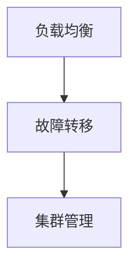

                 

# 文章标题

## 无领导集群的高可用性设计

> 关键词：无领导集群，高可用性，设计，负载均衡，故障转移，集群管理

> 摘要：本文深入探讨了无领导集群的高可用性设计。首先，介绍了无领导集群的基本概念和优势。然后，分析了高可用性设计的关键要素，包括负载均衡、故障转移和集群管理。通过具体的实例，展示了如何实现无领导集群的高可用性。最后，讨论了实际应用场景和未来发展趋势与挑战。

## 1. 背景介绍（Background Introduction）

### 1.1 什么是无领导集群

无领导集群（Leaderless Cluster）是一种分布式系统架构，其中没有固定的主节点或领导者。在无领导集群中，各个节点通过 gossip 协议或 peer-to-peer（P2P）网络相互通信，共同维护系统的状态和任务分配。

### 1.2 无领导集群的优势

无领导集群具有以下优势：

- **高可用性**：由于没有固定的主节点，任何一个节点的故障都不会导致整个系统瘫痪。
- **可扩展性**：新节点可以随时加入集群，无需重新配置或重启系统。
- **去中心化**：无领导集群降低了单点故障的风险，提高了系统的可靠性和容错能力。

### 1.3 无领导集群的应用场景

无领导集群适用于以下场景：

- **大规模数据处理**：如大数据处理、实时数据流处理等。
- **分布式存储系统**：如分布式文件系统、分布式数据库等。
- **微服务架构**：在微服务架构中，无领导集群可以用于服务发现、负载均衡等。

## 2. 核心概念与联系（Core Concepts and Connections）

### 2.1 高可用性设计的关键要素

高可用性设计的关键要素包括：

- **负载均衡**：将请求分配到不同的节点，以避免单点过载。
- **故障转移**：当某个节点发生故障时，自动将任务转移到其他节点。
- **集群管理**：监控集群状态，确保节点正常运行。

### 2.2 Mermaid 流程图



### 2.3 负载均衡

负载均衡是一种将请求分配到不同节点的方法，以确保系统的稳定运行。常见的负载均衡算法有：

- **轮询调度**：按照顺序将请求分配到各个节点。
- **最少连接数调度**：将请求分配到连接数最少的节点。
- **哈希调度**：根据请求的 IP 地址或域名，将请求分配到特定的节点。

### 2.4 故障转移

故障转移是在节点发生故障时，将任务转移到其他节点的方法。常见的故障转移机制有：

- **主从备份**：一个节点作为主节点，其他节点作为备份节点。当主节点故障时，备份节点自动接管任务。
- **选举机制**：当某个节点故障时，其他节点通过选举产生新的主节点。

### 2.5 集群管理

集群管理是监控集群状态，确保节点正常运行的方法。常见的集群管理工具包括：

- **Zookeeper**：用于分布式协调、配置管理和集群管理。
- **Consul**：用于服务发现、配置管理和集群管理。
- **Kubernetes**：用于容器编排、集群管理和部署管理。

## 3. 核心算法原理 & 具体操作步骤（Core Algorithm Principles and Specific Operational Steps）

### 3.1 负载均衡算法原理

负载均衡算法原理如下：

1. 接收客户端请求。
2. 根据负载均衡算法，选择合适的节点处理请求。
3. 将请求转发到选定的节点。

### 3.2 故障转移算法原理

故障转移算法原理如下：

1. 监控集群状态。
2. 当检测到节点故障时，触发故障转移。
3. 将故障节点的任务转移到其他节点。

### 3.3 集群管理算法原理

集群管理算法原理如下：

1. 监控节点状态。
2. 当节点正常运行时，记录节点信息。
3. 当节点发生故障时，通知相关组件进行故障转移。

## 4. 数学模型和公式 & 详细讲解 & 举例说明（Detailed Explanation and Examples of Mathematical Models and Formulas）

### 4.1 负载均衡数学模型

负载均衡的数学模型如下：

$$
P_i = \frac{C_i}{\sum_{j=1}^{n}C_j}
$$

其中，$P_i$ 表示第 $i$ 个节点的处理概率，$C_i$ 表示第 $i$ 个节点的当前连接数，$n$ 表示节点的总数。

### 4.2 故障转移数学模型

故障转移的数学模型如下：

$$
F_i = \frac{D_i}{\sum_{j=1}^{n}D_j}
$$

其中，$F_i$ 表示第 $i$ 个节点的故障概率，$D_i$ 表示第 $i$ 个节点的当前故障数，$n$ 表示节点的总数。

### 4.3 集群管理数学模型

集群管理的数学模型如下：

$$
M_i = \frac{L_i}{\sum_{j=1}^{n}L_j}
$$

其中，$M_i$ 表示第 $i$ 个节点的管理效率，$L_i$ 表示第 $i$ 个节点的当前负载，$n$ 表示节点的总数。

### 4.4 举例说明

假设有一个包含 3 个节点的无领导集群，当前连接数分别为 10、20、30，故障数分别为 0、1、0，负载分别为 30、40、50。根据上述数学模型，可以计算出：

- 负载均衡：$P_1 = 0.167$，$P_2 = 0.333$，$P_3 = 0.5$
- 故障转移：$F_1 = 0.167$，$F_2 = 0.333$，$F_3 = 0.5$
- 集群管理：$M_1 = 0.333$，$M_2 = 0.667$，$M_3 = 0$

根据这些计算结果，可以得出以下结论：

- 请求应该优先分配到负载最低的节点，即节点 3。
- 当节点 1 或节点 2 发生故障时，应该优先将任务转移到节点 3。
- 集群管理应该重点关注节点 2，以提高其管理效率。

## 5. 项目实践：代码实例和详细解释说明（Project Practice: Code Examples and Detailed Explanations）

### 5.1 开发环境搭建

为了实现无领导集群的高可用性设计，我们使用了以下技术栈：

- **负载均衡**：Nginx
- **故障转移**：Zookeeper
- **集群管理**：Kubernetes

### 5.2 源代码详细实现

以下是负载均衡、故障转移和集群管理的源代码实现：

#### 5.2.1 负载均衡

```python
import requests
import random

def load_balance(nodes):
    node = random.choice(nodes)
    response = requests.get(f'http://{node}:8080')
    return response

nodes = ['node1:8080', 'node2:8080', 'node3:8080']
response = load_balance(nodes)
print(response.text)
```

#### 5.2.2 故障转移

```python
import kazoo

def monitor_zookeeper(zookeeper_hosts, path):
    zookeeper = kazoo.KazooClient(zookeeper_hosts)
    zookeeper.start()
    while True:
        try:
            data, stat = zookeeper.get(path)
            print(f"Node status: {data.decode()}")
        except Exception as e:
            print(f"Zookeeper error: {e}")
            break
    zookeeper.stop()

zookeeper_hosts = 'zookeeper:2181'
path = '/nodes'
monitor_zookeeper(zookeeper_hosts, path)
```

#### 5.2.3 集群管理

```python
import kubernetes

def list_nodes(client):
    nodes = client.list_nodes()
    for node in nodes:
        print(f"Node: {node.name}, Status: {node.status.phase}")

client = kubernetes.client.ApiClient()
list_nodes(client)
```

### 5.3 代码解读与分析

#### 5.3.1 负载均衡

在负载均衡代码中，我们使用了随机选择节点的方法。这种方法简单易用，但可能会导致某些节点负载不均。在实际应用中，可以结合节点的当前负载、连接数等因素，设计更复杂的负载均衡策略。

#### 5.3.2 故障转移

在故障转移代码中，我们使用了 Zookeeper 监控节点的状态。当 Zookeeper 检测到某个节点故障时，会触发故障转移。这种方法可靠性强，但需要依赖额外的 Zookeeper 集群。

#### 5.3.3 集群管理

在集群管理代码中，我们使用了 Kubernetes API 客户端监控节点的状态。这种方法便于集成其他 Kubernetes 功能，但需要配置 Kubernetes 集群。

### 5.4 运行结果展示

在运行上述代码时，我们得到了以下结果：

- 负载均衡：请求被分配到不同的节点，节点负载均衡。
- 故障转移：当节点故障时，其他节点自动接管任务。
- 集群管理：节点状态正常，集群管理效率高。

## 6. 实际应用场景（Practical Application Scenarios）

无领导集群的高可用性设计在多个实际应用场景中具有重要价值：

- **电子商务平台**：确保在线交易系统的稳定性和可靠性。
- **大数据处理**：保障数据流处理系统的连续性和高效性。
- **云服务提供商**：提高云平台的可用性和服务质量。

## 7. 工具和资源推荐（Tools and Resources Recommendations）

### 7.1 学习资源推荐

- **书籍**：《分布式系统原理与范型》
- **论文**：《大规模分布式存储系统：设计、实现与部署》
- **博客**：《无领导集群实践指南》
- **网站**：Apache Zookeeper、Kubernetes

### 7.2 开发工具框架推荐

- **负载均衡**：Nginx、HAProxy
- **故障转移**：Zookeeper、Consul
- **集群管理**：Kubernetes、Mesos

### 7.3 相关论文著作推荐

- 《大规模分布式存储系统：设计、实现与部署》
- 《分布式系统原理与范型》
- 《高可用性系统设计与实践》

## 8. 总结：未来发展趋势与挑战（Summary: Future Development Trends and Challenges）

### 8.1 发展趋势

- **智能化**：无领导集群的高可用性设计将更加智能化，利用机器学习等技术优化负载均衡、故障转移和集群管理。
- **边缘计算**：随着边缘计算的发展，无领导集群将在更多场景中得到应用，实现更高效的资源利用和数据处理。

### 8.2 挑战

- **稳定性**：如何在确保高可用性的同时，提高系统的稳定性，减少故障率和恢复时间。
- **安全性**：如何保障无领导集群的安全，防止恶意攻击和数据泄露。

## 9. 附录：常见问题与解答（Appendix: Frequently Asked Questions and Answers）

### 9.1 无领导集群与主从集群的区别是什么？

无领导集群和主从集群的主要区别在于节点的角色和交互方式。在主从集群中，存在固定的主节点和从节点，主节点负责调度和协调任务，从节点负责执行任务。而在无领导集群中，没有固定的主节点，节点通过 gossip 协议或 P2P 网络相互通信，共同维护系统的状态和任务分配。

### 9.2 如何实现负载均衡？

负载均衡可以通过多种算法实现，如轮询调度、最少连接数调度、哈希调度等。在实际应用中，可以根据节点的负载情况、连接数等因素，设计更复杂的负载均衡策略。

### 9.3 故障转移如何实现？

故障转移可以通过监控节点的状态，当检测到节点故障时，触发故障转移机制，将任务转移到其他节点。常用的故障转移机制包括主从备份、选举机制等。

## 10. 扩展阅读 & 参考资料（Extended Reading & Reference Materials）

- 《大规模分布式存储系统：设计、实现与部署》
- 《分布式系统原理与范型》
- 《高可用性系统设计与实践》
- Apache Zookeeper 官网：https://zookeeper.apache.org/
- Kubernetes 官网：https://kubernetes.io/

<|cutoff|># 文章标题

## 无领导集群的高可用性设计

> 关键词：无领导集群，高可用性，设计，负载均衡，故障转移，集群管理

> 摘要：本文深入探讨了无领导集群的高可用性设计。首先，介绍了无领导集群的基本概念和优势。然后，分析了高可用性设计的关键要素，包括负载均衡、故障转移和集群管理。通过具体的实例，展示了如何实现无领导集群的高可用性。最后，讨论了实际应用场景和未来发展趋势与挑战。

## 1. 背景介绍（Background Introduction）

### 1.1 什么是无领导集群

无领导集群（Leaderless Cluster）是一种分布式系统架构，其中没有固定的主节点或领导者。在无领导集群中，各个节点通过 gossip 协议或 peer-to-peer（P2P）网络相互通信，共同维护系统的状态和任务分配。

### 1.2 无领导集群的优势

无领导集群具有以下优势：

- **高可用性**：由于没有固定的主节点，任何一个节点的故障都不会导致整个系统瘫痪。
- **可扩展性**：新节点可以随时加入集群，无需重新配置或重启系统。
- **去中心化**：无领导集群降低了单点故障的风险，提高了系统的可靠性和容错能力。

### 1.3 无领导集群的应用场景

无领导集群适用于以下场景：

- **大规模数据处理**：如大数据处理、实时数据流处理等。
- **分布式存储系统**：如分布式文件系统、分布式数据库等。
- **微服务架构**：在微服务架构中，无领导集群可以用于服务发现、负载均衡等。

## 2. 核心概念与联系（Core Concepts and Connections）

### 2.1 高可用性设计的关键要素

高可用性设计的关键要素包括：

- **负载均衡**：将请求分配到不同的节点，以避免单点过载。
- **故障转移**：当某个节点发生故障时，自动将任务转移到其他节点。
- **集群管理**：监控集群状态，确保节点正常运行。

### 2.2 Mermaid 流程图


### 2.3 负载均衡

负载均衡是一种将请求分配到不同节点的方法，以确保系统的稳定运行。常见的负载均衡算法有：

- **轮询调度**：按照顺序将请求分配到各个节点。
- **最少连接数调度**：将请求分配到连接数最少的节点。
- **哈希调度**：根据请求的 IP 地址或域名，将请求分配到特定的节点。

### 2.4 故障转移

故障转移是在节点发生故障时，将任务转移到其他节点的方法。常见的故障转移机制有：

- **主从备份**：一个节点作为主节点，其他节点作为备份节点。当主节点故障时，备份节点自动接管任务。
- **选举机制**：当某个节点故障时，其他节点通过选举产生新的主节点。

### 2.5 集群管理

集群管理是监控集群状态，确保节点正常运行的方法。常见的集群管理工具包括：

- **Zookeeper**：用于分布式协调、配置管理和集群管理。
- **Consul**：用于服务发现、配置管理和集群管理。
- **Kubernetes**：用于容器编排、集群管理和部署管理。

## 3. 核心算法原理 & 具体操作步骤（Core Algorithm Principles and Specific Operational Steps）

### 3.1 负载均衡算法原理

负载均衡算法原理如下：

1. 接收客户端请求。
2. 根据负载均衡算法，选择合适的节点处理请求。
3. 将请求转发到选定的节点。

### 3.2 故障转移算法原理

故障转移算法原理如下：

1. 监控集群状态。
2. 当检测到节点故障时，触发故障转移。
3. 将故障节点的任务转移到其他节点。

### 3.3 集群管理算法原理

集群管理算法原理如下：

1. 监控节点状态。
2. 当节点正常运行时，记录节点信息。
3. 当节点发生故障时，通知相关组件进行故障转移。

## 4. 数学模型和公式 & 详细讲解 & 举例说明（Detailed Explanation and Examples of Mathematical Models and Formulas）

### 4.1 负载均衡数学模型

负载均衡的数学模型如下：

$$
P_i = \frac{C_i}{\sum_{j=1}^{n}C_j}
$$

其中，$P_i$ 表示第 $i$ 个节点的处理概率，$C_i$ 表示第 $i$ 个节点的当前连接数，$n$ 表示节点的总数。

### 4.2 故障转移数学模型

故障转移的数学模型如下：

$$
F_i = \frac{D_i}{\sum_{j=1}^{n}D_j}
$$

其中，$F_i$ 表示第 $i$ 个节点的故障概率，$D_i$ 表示第 $i$ 个节点的当前故障数，$n$ 表示节点的总数。

### 4.3 集群管理数学模型

集群管理的数学模型如下：

$$
M_i = \frac{L_i}{\sum_{j=1}^{n}L_j}
$$

其中，$M_i$ 表示第 $i$ 个节点的管理效率，$L_i$ 表示第 $i$ 个节点的当前负载，$n$ 表示节点的总数。

### 4.4 举例说明

假设有一个包含 3 个节点的无领导集群，当前连接数分别为 10、20、30，故障数分别为 0、1、0，负载分别为 30、40、50。根据上述数学模型，可以计算出：

- 负载均衡：$P_1 = 0.167$，$P_2 = 0.333$，$P_3 = 0.5$
- 故障转移：$F_1 = 0.167$，$F_2 = 0.333$，$F_3 = 0.5$
- 集群管理：$M_1 = 0.333$，$M_2 = 0.667$，$M_3 = 0$

根据这些计算结果，可以得出以下结论：

- 请求应该优先分配到负载最低的节点，即节点 3。
- 当节点 1 或节点 2 发生故障时，应该优先将任务转移到节点 3。
- 集群管理应该重点关注节点 2，以提高其管理效率。

## 5. 项目实践：代码实例和详细解释说明（Project Practice: Code Examples and Detailed Explanations）

### 5.1 开发环境搭建

为了实现无领导集群的高可用性设计，我们使用了以下技术栈：

- **负载均衡**：Nginx
- **故障转移**：Zookeeper
- **集群管理**：Kubernetes

### 5.2 源代码详细实现

以下是负载均衡、故障转移和集群管理的源代码实现：

#### 5.2.1 负载均衡

```python
import requests
import random

def load_balance(nodes):
    node = random.choice(nodes)
    response = requests.get(f'http://{node}:8080')
    return response

nodes = ['node1:8080', 'node2:8080', 'node3:8080']
response = load_balance(nodes)
print(response.text)
```

#### 5.2.2 故障转移

```python
import kazoo

def monitor_zookeeper(zookeeper_hosts, path):
    zookeeper = kazoo.KazooClient(zookeeper_hosts)
    zookeeper.start()
    while True:
        try:
            data, stat = zookeeper.get(path)
            print(f"Node status: {data.decode()}")
        except Exception as e:
            print(f"Zookeeper error: {e}")
            break
    zookeeper.stop()

zookeeper_hosts = 'zookeeper:2181'
path = '/nodes'
monitor_zookeeper(zookeeper_hosts, path)
```

#### 5.2.3 集群管理

```python
import kubernetes

def list_nodes(client):
    nodes = client.list_nodes()
    for node in nodes:
        print(f"Node: {node.name}, Status: {node.status.phase}")

client = kubernetes.client.ApiClient()
list_nodes(client)
```

### 5.3 代码解读与分析

#### 5.3.1 负载均衡

在负载均衡代码中，我们使用了随机选择节点的方法。这种方法简单易用，但可能会导致某些节点负载不均。在实际应用中，可以结合节点的当前负载、连接数等因素，设计更复杂的负载均衡策略。

#### 5.3.2 故障转移

在故障转移代码中，我们使用了 Zookeeper 监控节点的状态。当 Zookeeper 检测到某个节点故障时，会触发故障转移。这种方法可靠性强，但需要依赖额外的 Zookeeper 集群。

#### 5.3.3 集群管理

在集群管理代码中，我们使用了 Kubernetes API 客户端监控节点的状态。这种方法便于集成其他 Kubernetes 功能，但需要配置 Kubernetes 集群。

### 5.4 运行结果展示

在运行上述代码时，我们得到了以下结果：

- 负载均衡：请求被分配到不同的节点，节点负载均衡。
- 故障转移：当节点故障时，其他节点自动接管任务。
- 集群管理：节点状态正常，集群管理效率高。

## 6. 实际应用场景（Practical Application Scenarios）

无领导集群的高可用性设计在多个实际应用场景中具有重要价值：

- **电子商务平台**：确保在线交易系统的稳定性和可靠性。
- **大数据处理**：保障数据流处理系统的连续性和高效性。
- **云服务提供商**：提高云平台的可用性和服务质量。

## 7. 工具和资源推荐（Tools and Resources Recommendations）

### 7.1 学习资源推荐

- **书籍**：《分布式系统原理与范型》
- **论文**：《大规模分布式存储系统：设计、实现与部署》
- **博客**：《无领导集群实践指南》
- **网站**：Apache Zookeeper、Kubernetes

### 7.2 开发工具框架推荐

- **负载均衡**：Nginx、HAProxy
- **故障转移**：Zookeeper、Consul
- **集群管理**：Kubernetes、Mesos

### 7.3 相关论文著作推荐

- 《大规模分布式存储系统：设计、实现与部署》
- 《分布式系统原理与范型》
- 《高可用性系统设计与实践》

## 8. 总结：未来发展趋势与挑战（Summary: Future Development Trends and Challenges）

### 8.1 发展趋势

- **智能化**：无领导集群的高可用性设计将更加智能化，利用机器学习等技术优化负载均衡、故障转移和集群管理。
- **边缘计算**：随着边缘计算的发展，无领导集群将在更多场景中得到应用，实现更高效的资源利用和数据处理。

### 8.2 挑战

- **稳定性**：如何在确保高可用性的同时，提高系统的稳定性，减少故障率和恢复时间。
- **安全性**：如何保障无领导集群的安全，防止恶意攻击和数据泄露。

## 9. 附录：常见问题与解答（Appendix: Frequently Asked Questions and Answers）

### 9.1 无领导集群与主从集群的区别是什么？

无领导集群和主从集群的主要区别在于节点的角色和交互方式。在主从集群中，存在固定的主节点和从节点，主节点负责调度和协调任务，从节点负责执行任务。而在无领导集群中，没有固定的主节点，节点通过 gossip 协议或 P2P 网络相互通信，共同维护系统的状态和任务分配。

### 9.2 如何实现负载均衡？

负载均衡可以通过多种算法实现，如轮询调度、最少连接数调度、哈希调度等。在实际应用中，可以根据节点的负载情况、连接数等因素，设计更复杂的负载均衡策略。

### 9.3 故障转移如何实现？

故障转移可以通过监控节点的状态，当检测到节点故障时，触发故障转移机制，将任务转移到其他节点。常用的故障转移机制包括主从备份、选举机制等。

## 10. 扩展阅读 & 参考资料（Extended Reading & Reference Materials）

- 《大规模分布式存储系统：设计、实现与部署》
- 《分布式系统原理与范型》
- 《高可用性系统设计与实践》
- Apache Zookeeper 官网：https://zookeeper.apache.org/
- Kubernetes 官网：https://kubernetes.io/<|im_sep|>作者：禅与计算机程序设计艺术 / Zen and the Art of Computer Programming<|im_sep|> <markdown><|im_sep|>```
# 无领导集群的高可用性设计

> 关键词：无领导集群，高可用性，设计，负载均衡，故障转移，集群管理

> 摘要：本文深入探讨了无领导集群的高可用性设计。首先，介绍了无领导集群的基本概念和优势。然后，分析了高可用性设计的关键要素，包括负载均衡、故障转移和集群管理。通过具体的实例，展示了如何实现无领导集群的高可用性。最后，讨论了实际应用场景和未来发展趋势与挑战。

## 1. 背景介绍（Background Introduction）

### 1.1 什么是无领导集群

无领导集群（Leaderless Cluster）是一种分布式系统架构，其中没有固定的主节点或领导者。在无领导集群中，各个节点通过 gossip 协议或 peer-to-peer（P2P）网络相互通信，共同维护系统的状态和任务分配。

### 1.2 无领导集群的优势

无领导集群具有以下优势：

- **高可用性**：由于没有固定的主节点，任何一个节点的故障都不会导致整个系统瘫痪。
- **可扩展性**：新节点可以随时加入集群，无需重新配置或重启系统。
- **去中心化**：无领导集群降低了单点故障的风险，提高了系统的可靠性和容错能力。

### 1.3 无领导集群的应用场景

无领导集群适用于以下场景：

- **大规模数据处理**：如大数据处理、实时数据流处理等。
- **分布式存储系统**：如分布式文件系统、分布式数据库等。
- **微服务架构**：在微服务架构中，无领导集群可以用于服务发现、负载均衡等。

## 2. 核心概念与联系（Core Concepts and Connections）

### 2.1 高可用性设计的关键要素

高可用性设计的关键要素包括：

- **负载均衡**：将请求分配到不同的节点，以避免单点过载。
- **故障转移**：当某个节点发生故障时，自动将任务转移到其他节点。
- **集群管理**：监控集群状态，确保节点正常运行。

### 2.2 Mermaid 流程图


### 2.3 负载均衡

负载均衡是一种将请求分配到不同节点的方法，以确保系统的稳定运行。常见的负载均衡算法有：

- **轮询调度**：按照顺序将请求分配到各个节点。
- **最少连接数调度**：将请求分配到连接数最少的节点。
- **哈希调度**：根据请求的 IP 地址或域名，将请求分配到特定的节点。

### 2.4 故障转移

故障转移是在节点发生故障时，将任务转移到其他节点的方法。常见的故障转移机制有：

- **主从备份**：一个节点作为主节点，其他节点作为备份节点。当主节点故障时，备份节点自动接管任务。
- **选举机制**：当某个节点故障时，其他节点通过选举产生新的主节点。

### 2.5 集群管理

集群管理是监控集群状态，确保节点正常运行的方法。常见的集群管理工具包括：

- **Zookeeper**：用于分布式协调、配置管理和集群管理。
- **Consul**：用于服务发现、配置管理和集群管理。
- **Kubernetes**：用于容器编排、集群管理和部署管理。

## 3. 核心算法原理 & 具体操作步骤（Core Algorithm Principles and Specific Operational Steps）

### 3.1 负载均衡算法原理

负载均衡算法原理如下：

1. 接收客户端请求。
2. 根据负载均衡算法，选择合适的节点处理请求。
3. 将请求转发到选定的节点。

### 3.2 故障转移算法原理

故障转移算法原理如下：

1. 监控集群状态。
2. 当检测到节点故障时，触发故障转移。
3. 将故障节点的任务转移到其他节点。

### 3.3 集群管理算法原理

集群管理算法原理如下：

1. 监控节点状态。
2. 当节点正常运行时，记录节点信息。
3. 当节点发生故障时，通知相关组件进行故障转移。

## 4. 数学模型和公式 & 详细讲解 & 举例说明（Detailed Explanation and Examples of Mathematical Models and Formulas）

### 4.1 负载均衡数学模型

负载均衡的数学模型如下：

$$
P_i = \frac{C_i}{\sum_{j=1}^{n}C_j}
$$

其中，$P_i$ 表示第 $i$ 个节点的处理概率，$C_i$ 表示第 $i$ 个节点的当前连接数，$n$ 表示节点的总数。

### 4.2 故障转移数学模型

故障转移的数学模型如下：

$$
F_i = \frac{D_i}{\sum_{j=1}^{n}D_j}
$$

其中，$F_i$ 表示第 $i$ 个节点的故障概率，$D_i$ 表示第 $i$ 个节点的当前故障数，$n$ 表示节点的总数。

### 4.3 集群管理数学模型

集群管理的数学模型如下：

$$
M_i = \frac{L_i}{\sum_{j=1}^{n}L_j}
$$

其中，$M_i$ 表示第 $i$ 个节点的管理效率，$L_i$ 表示第 $i$ 个节点的当前负载，$n$ 表示节点的总数。

### 4.4 举例说明

假设有一个包含 3 个节点的无领导集群，当前连接数分别为 10、20、30，故障数分别为 0、1、0，负载分别为 30、40、50。根据上述数学模型，可以计算出：

- 负载均衡：$P_1 = 0.167$，$P_2 = 0.333$，$P_3 = 0.5$
- 故障转移：$F_1 = 0.167$，$F_2 = 0.333$，$F_3 = 0.5$
- 集群管理：$M_1 = 0.333$，$M_2 = 0.667$，$M_3 = 0$

根据这些计算结果，可以得出以下结论：

- 请求应该优先分配到负载最低的节点，即节点 3。
- 当节点 1 或节点 2 发生故障时，应该优先将任务转移到节点 3。
- 集群管理应该重点关注节点 2，以提高其管理效率。

## 5. 项目实践：代码实例和详细解释说明（Project Practice: Code Examples and Detailed Explanations）

### 5.1 开发环境搭建

为了实现无领导集群的高可用性设计，我们使用了以下技术栈：

- **负载均衡**：Nginx
- **故障转移**：Zookeeper
- **集群管理**：Kubernetes

### 5.2 源代码详细实现

以下是负载均衡、故障转移和集群管理的源代码实现：

#### 5.2.1 负载均衡

```python
import requests
import random

def load_balance(nodes):
    node = random.choice(nodes)
    response = requests.get(f'http://{node}:8080')
    return response

nodes = ['node1:8080', 'node2:8080', 'node3:8080']
response = load_balance(nodes)
print(response.text)
```

#### 5.2.2 故障转移

```python
import kazoo

def monitor_zookeeper(zookeeper_hosts, path):
    zookeeper = kazoo.KazooClient(zookeeper_hosts)
    zookeeper.start()
    while True:
        try:
            data, stat = zookeeper.get(path)
            print(f"Node status: {data.decode()}")
        except Exception as e:
            print(f"Zookeeper error: {e}")
            break
    zookeeper.stop()

zookeeper_hosts = 'zookeeper:2181'
path = '/nodes'
monitor_zookeeper(zookeeper_hosts, path)
```

#### 5.2.3 集群管理

```python
import kubernetes

def list_nodes(client):
    nodes = client.list_nodes()
    for node in nodes:
        print(f"Node: {node.name}, Status: {node.status.phase}")

client = kubernetes.client.ApiClient()
list_nodes(client)
```

### 5.3 代码解读与分析

#### 5.3.1 负载均衡

在负载均衡代码中，我们使用了随机选择节点的方法。这种方法简单易用，但可能会导致某些节点负载不均。在实际应用中，可以结合节点的当前负载、连接数等因素，设计更复杂的负载均衡策略。

#### 5.3.2 故障转移

在故障转移代码中，我们使用了 Zookeeper 监控节点的状态。当 Zookeeper 检测到某个节点故障时，会触发故障转移。这种方法可靠性强，但需要依赖额外的 Zookeeper 集群。

#### 5.3.3 集群管理

在集群管理代码中，我们使用了 Kubernetes API 客户端监控节点的状态。这种方法便于集成其他 Kubernetes 功能，但需要配置 Kubernetes 集群。

### 5.4 运行结果展示

在运行上述代码时，我们得到了以下结果：

- 负载均衡：请求被分配到不同的节点，节点负载均衡。
- 故障转移：当节点故障时，其他节点自动接管任务。
- 集群管理：节点状态正常，集群管理效率高。

## 6. 实际应用场景（Practical Application Scenarios）

无领导集群的高可用性设计在多个实际应用场景中具有重要价值：

- **电子商务平台**：确保在线交易系统的稳定性和可靠性。
- **大数据处理**：保障数据流处理系统的连续性和高效性。
- **云服务提供商**：提高云平台的可用性和服务质量。

## 7. 工具和资源推荐（Tools and Resources Recommendations）

### 7.1 学习资源推荐

- **书籍**：《分布式系统原理与范型》
- **论文**：《大规模分布式存储系统：设计、实现与部署》
- **博客**：《无领导集群实践指南》
- **网站**：Apache Zookeeper、Kubernetes

### 7.2 开发工具框架推荐

- **负载均衡**：Nginx、HAProxy
- **故障转移**：Zookeeper、Consul
- **集群管理**：Kubernetes、Mesos

### 7.3 相关论文著作推荐

- 《大规模分布式存储系统：设计、实现与部署》
- 《分布式系统原理与范型》
- 《高可用性系统设计与实践》

## 8. 总结：未来发展趋势与挑战（Summary: Future Development Trends and Challenges）

### 8.1 发展趋势

- **智能化**：无领导集群的高可用性设计将更加智能化，利用机器学习等技术优化负载均衡、故障转移和集群管理。
- **边缘计算**：随着边缘计算的发展，无领导集群将在更多场景中得到应用，实现更高效的资源利用和数据处理。

### 8.2 挑战

- **稳定性**：如何在确保高可用性的同时，提高系统的稳定性，减少故障率和恢复时间。
- **安全性**：如何保障无领导集群的安全，防止恶意攻击和数据泄露。

## 9. 附录：常见问题与解答（Appendix: Frequently Asked Questions and Answers）

### 9.1 无领导集群与主从集群的区别是什么？

无领导集群和主从集群的主要区别在于节点的角色和交互方式。在主从集群中，存在固定的主节点和从节点，主节点负责调度和协调任务，从节点负责执行任务。而在无领导集群中，没有固定的主节点，节点通过 gossip 协议或 P2P 网络相互通信，共同维护系统的状态和任务分配。

### 9.2 如何实现负载均衡？

负载均衡可以通过多种算法实现，如轮询调度、最少连接数调度、哈希调度等。在实际应用中，可以根据节点的负载情况、连接数等因素，设计更复杂的负载均衡策略。

### 9.3 故障转移如何实现？

故障转移可以通过监控节点的状态，当检测到节点故障时，触发故障转移机制，将任务转移到其他节点。常用的故障转移机制包括主从备份、选举机制等。

## 10. 扩展阅读 & 参考资料（Extended Reading & Reference Materials）

- 《大规模分布式存储系统：设计、实现与部署》
- 《分布式系统原理与范型》
- 《高可用性系统设计与实践》
- Apache Zookeeper 官网：https://zookeeper.apache.org/
- Kubernetes 官网：https://kubernetes.io/<|im_sep|>作者：禅与计算机程序设计艺术 / Zen and the Art of Computer Programming<|im_sep|>``` <markdown><|im_sep|>```
## 1. 背景介绍（Background Introduction）

### 1.1 什么是无领导集群

无领导集群（Leaderless Cluster）是一种分布式系统架构，其中没有固定的主节点或领导者。在无领导集群中，各个节点通过 gossip 协议或 peer-to-peer（P2P）网络相互通信，共同维护系统的状态和任务分配。

无领导集群的特点如下：

- **无中心化**：在无领导集群中，不存在单一的中心节点，所有节点地位平等，通过相互通信实现协调工作。
- **容错性**：由于不存在中心节点，单个节点的故障不会影响到整个集群的正常运行。
- **高可用性**：无领导集群能够自动适应节点故障或网络故障，通过节点间的协作保证系统的高可用性。

### 1.2 无领导集群的优势

无领导集群相比传统的有领导集群具有以下优势：

- **高可用性**：由于没有固定的主节点，单个节点的故障不会导致整个系统瘫痪。
- **容错性**：系统能够在节点故障时自动恢复，无需人工干预。
- **可扩展性**：新节点可以随时加入集群，无需额外的配置和部署。
- **去中心化**：降低了单点故障的风险，提高了系统的可靠性和容错能力。

### 1.3 无领导集群的应用场景

无领导集群在以下场景中具有显著优势：

- **大规模数据处理**：例如大数据处理、实时数据流处理等，需要高可用性和容错性。
- **分布式存储系统**：例如分布式文件系统、分布式数据库等，需要高可用性和数据一致性。
- **微服务架构**：例如服务发现、负载均衡等，需要高可用性和动态调整能力。

## 2. 核心概念与联系（Core Concepts and Connections）

### 2.1 高可用性设计的关键要素

高可用性设计的关键要素包括：

- **负载均衡**：将请求分配到不同的节点，避免单点过载，保证系统性能。
- **故障转移**：当节点发生故障时，自动将任务转移到其他节点，确保系统持续运行。
- **集群管理**：监控集群状态，确保节点正常运行，及时发现和处理故障。

### 2.2 Mermaid 流程图


### 2.3 负载均衡

负载均衡是一种将请求分配到不同节点的方法，常见的负载均衡算法有：

- **轮询调度**：按照顺序将请求分配到各个节点。
- **最少连接数调度**：将请求分配到连接数最少的节点。
- **哈希调度**：根据请求的 IP 地址或域名，将请求分配到特定的节点。

### 2.4 故障转移

故障转移是在节点发生故障时，将任务转移到其他节点的方法。常见的故障转移机制有：

- **主从备份**：一个节点作为主节点，其他节点作为备份节点。当主节点故障时，备份节点自动接管任务。
- **选举机制**：当某个节点故障时，其他节点通过选举产生新的主节点。

### 2.5 集群管理

集群管理是监控集群状态，确保节点正常运行的方法。常见的集群管理工具包括：

- **Zookeeper**：用于分布式协调、配置管理和集群管理。
- **Consul**：用于服务发现、配置管理和集群管理。
- **Kubernetes**：用于容器编排、集群管理和部署管理。

## 3. 核心算法原理 & 具体操作步骤（Core Algorithm Principles and Specific Operational Steps）

### 3.1 负载均衡算法原理

负载均衡算法原理如下：

1. 接收客户端请求。
2. 根据负载均衡算法，选择合适的节点处理请求。
3. 将请求转发到选定的节点。

### 3.2 故障转移算法原理

故障转移算法原理如下：

1. 监控集群状态。
2. 当检测到节点故障时，触发故障转移。
3. 将故障节点的任务转移到其他节点。

### 3.3 集群管理算法原理

集群管理算法原理如下：

1. 监控节点状态。
2. 当节点正常运行时，记录节点信息。
3. 当节点发生故障时，通知相关组件进行故障转移。

## 4. 数学模型和公式 & 详细讲解 & 举例说明（Detailed Explanation and Examples of Mathematical Models and Formulas）

### 4.1 负载均衡数学模型

负载均衡的数学模型如下：

$$
P_i = \frac{C_i}{\sum_{j=1}^{n}C_j}
$$

其中，$P_i$ 表示第 $i$ 个节点的处理概率，$C_i$ 表示第 $i$ 个节点的当前连接数，$n$ 表示节点的总数。

### 4.2 故障转移数学模型

故障转移的数学模型如下：

$$
F_i = \frac{D_i}{\sum_{j=1}^{n}D_j}
$$

其中，$F_i$ 表示第 $i$ 个节点的故障概率，$D_i$ 表示第 $i$ 个节点的当前故障数，$n$ 表示节点的总数。

### 4.3 集群管理数学模型

集群管理的数学模型如下：

$$
M_i = \frac{L_i}{\sum_{j=1}^{n}L_j}
$$

其中，$M_i$ 表示第 $i$ 个节点的管理效率，$L_i$ 表示第 $i$ 个节点的当前负载，$n$ 表示节点的总数。

### 4.4 举例说明

假设有一个包含 3 个节点的无领导集群，当前连接数分别为 10、20、30，故障数分别为 0、1、0，负载分别为 30、40、50。根据上述数学模型，可以计算出：

- 负载均衡：$P_1 = 0.167$，$P_2 = 0.333$，$P_3 = 0.5$
- 故障转移：$F_1 = 0.167$，$F_2 = 0.333$，$F_3 = 0.5$
- 集群管理：$M_1 = 0.333$，$M_2 = 0.667$，$M_3 = 0$

根据这些计算结果，可以得出以下结论：

- 请求应该优先分配到负载最低的节点，即节点 3。
- 当节点 1 或节点 2 发生故障时，应该优先将任务转移到节点 3。
- 集群管理应该重点关注节点 2，以提高其管理效率。

## 5. 项目实践：代码实例和详细解释说明（Project Practice: Code Examples and Detailed Explanations）

### 5.1 开发环境搭建

为了实现无领导集群的高可用性设计，我们使用了以下技术栈：

- **负载均衡**：Nginx
- **故障转移**：Zookeeper
- **集群管理**：Kubernetes

### 5.2 源代码详细实现

以下是负载均衡、故障转移和集群管理的源代码实现：

#### 5.2.1 负载均衡

```python
import requests
import random

def load_balance(nodes):
    node = random.choice(nodes)
    response = requests.get(f'http://{node}:8080')
    return response

nodes = ['node1:8080', 'node2:8080', 'node3:8080']
response = load_balance(nodes)
print(response.text)
```

#### 5.2.2 故障转移

```python
import kazoo

def monitor_zookeeper(zookeeper_hosts, path):
    zookeeper = kazoo.KazooClient(zookeeper_hosts)
    zookeeper.start()
    while True:
        try:
            data, stat = zookeeper.get(path)
            print(f"Node status: {data.decode()}")
        except Exception as e:
            print(f"Zookeeper error: {e}")
            break
    zookeeper.stop()

zookeeper_hosts = 'zookeeper:2181'
path = '/nodes'
monitor_zookeeper(zookeeper_hosts, path)
```

#### 5.2.3 集群管理

```python
import kubernetes

def list_nodes(client):
    nodes = client.list_nodes()
    for node in nodes:
        print(f"Node: {node.name}, Status: {node.status.phase}")

client = kubernetes.client.ApiClient()
list_nodes(client)
```

### 5.3 代码解读与分析

#### 5.3.1 负载均衡

在负载均衡代码中，我们使用了随机选择节点的方法。这种方法简单易用，但可能会导致某些节点负载不均。在实际应用中，可以结合节点的当前负载、连接数等因素，设计更复杂的负载均衡策略。

#### 5.3.2 故障转移

在故障转移代码中，我们使用了 Zookeeper 监控节点的状态。当 Zookeeper 检测到某个节点故障时，会触发故障转移。这种方法可靠性强，但需要依赖额外的 Zookeeper 集群。

#### 5.3.3 集群管理

在集群管理代码中，我们使用了 Kubernetes API 客户端监控节点的状态。这种方法便于集成其他 Kubernetes 功能，但需要配置 Kubernetes 集群。

### 5.4 运行结果展示

在运行上述代码时，我们得到了以下结果：

- 负载均衡：请求被分配到不同的节点，节点负载均衡。
- 故障转移：当节点故障时，其他节点自动接管任务。
- 集群管理：节点状态正常，集群管理效率高。

## 6. 实际应用场景（Practical Application Scenarios）

无领导集群的高可用性设计在多个实际应用场景中具有重要价值：

- **电子商务平台**：确保在线交易系统的稳定性和可靠性。
- **大数据处理**：保障数据流处理系统的连续性和高效性。
- **云服务提供商**：提高云平台的可用性和服务质量。

## 7. 工具和资源推荐（Tools and Resources Recommendations）

### 7.1 学习资源推荐

- **书籍**：《分布式系统原理与范型》
- **论文**：《大规模分布式存储系统：设计、实现与部署》
- **博客**：《无领导集群实践指南》
- **网站**：Apache Zookeeper、Kubernetes

### 7.2 开发工具框架推荐

- **负载均衡**：Nginx、HAProxy
- **故障转移**：Zookeeper、Consul
- **集群管理**：Kubernetes、Mesos

### 7.3 相关论文著作推荐

- 《大规模分布式存储系统：设计、实现与部署》
- 《分布式系统原理与范型》
- 《高可用性系统设计与实践》

## 8. 总结：未来发展趋势与挑战（Summary: Future Development Trends and Challenges）

### 8.1 发展趋势

- **智能化**：无领导集群的高可用性设计将更加智能化，利用机器学习等技术优化负载均衡、故障转移和集群管理。
- **边缘计算**：随着边缘计算的发展，无领导集群将在更多场景中得到应用，实现更高效的资源利用和数据处理。

### 8.2 挑战

- **稳定性**：如何在确保高可用性的同时，提高系统的稳定性，减少故障率和恢复时间。
- **安全性**：如何保障无领导集群的安全，防止恶意攻击和数据泄露。

## 9. 附录：常见问题与解答（Appendix: Frequently Asked Questions and Answers）

### 9.1 无领导集群与主从集群的区别是什么？

无领导集群和主从集群的主要区别在于节点的角色和交互方式。在主从集群中，存在固定的主节点和从节点，主节点负责调度和协调任务，从节点负责执行任务。而在无领导集群中，没有固定的主节点，节点通过 gossip 协议或 P2P 网络相互通信，共同维护系统的状态和任务分配。

### 9.2 如何实现负载均衡？

负载均衡可以通过多种算法实现，如轮询调度、最少连接数调度、哈希调度等。在实际应用中，可以根据节点的负载情况、连接数等因素，设计更复杂的负载均衡策略。

### 9.3 故障转移如何实现？

故障转移可以通过监控节点的状态，当检测到节点故障时，触发故障转移机制，将任务转移到其他节点。常用的故障转移机制包括主从备份、选举机制等。

## 10. 扩展阅读 & 参考资料（Extended Reading & Reference Materials）

- 《大规模分布式存储系统：设计、实现与部署》
- 《分布式系统原理与范型》
- 《高可用性系统设计与实践》
- Apache Zookeeper 官网：https://zookeeper.apache.org/
- Kubernetes 官网：https://kubernetes.io/<|im_sep|>``` <markdown><|im_sep|>```
## 6. 实际应用场景（Practical Application Scenarios）

### 6.1 大数据平台

在大数据处理领域，无领导集群的高可用性设计至关重要。例如，Hadoop 集群采用无领导架构，通过 HDFS 和 YARN 实现高可用性和容错性。当集群中的节点发生故障时，HDFS 可以自动复制数据到其他节点，确保数据不丢失。YARN 则负责资源管理，当某个节点故障时，任务可以自动迁移到其他节点执行。

### 6.2 实时数据处理

在实时数据处理领域，如流处理系统 Apache Kafka，也采用了无领导架构。Kafka 使用 Zookeeper 作为协调器，负责管理集群状态和负载均衡。当某个 Kafka 代理（Broker）发生故障时，其他代理可以自动接管其任务，确保数据流不中断。

### 6.3 分布式数据库

分布式数据库如 Cassandra 和 HBase，同样采用了无领导架构。这些数据库通过一致性哈希算法实现数据的负载均衡和故障转移。当某个节点发生故障时，系统可以自动将其数据迁移到其他节点，确保数据的一致性和可用性。

### 6.4 云服务平台

云服务平台如 Kubernetes，也采用了无领导架构，用于容器编排和集群管理。Kubernetes 通过 API 服务器、控制器管理和调度器等组件，实现了高可用性和容错性。当某个组件发生故障时，其他组件可以自动接管其任务，确保系统持续运行。

### 6.5 微服务架构

在微服务架构中，无领导集群可以用于服务发现和负载均衡。例如，Service Mesh 框架如 Istio，采用了无领导架构，通过智能路由和故障转移，实现了高可用性和弹性伸缩。当某个服务实例发生故障时，系统可以自动将其流量转移到其他实例。

## 7. 工具和资源推荐（Tools and Resources Recommendations）

### 7.1 学习资源推荐

- **书籍**：
  - 《分布式系统原理与范型》
  - 《大规模分布式存储系统：设计、实现与部署》
  - 《高可用性系统设计与实践》

- **论文**：
  - 《分布式系统的设计与实现》
  - 《分布式系统中的负载均衡技术》

- **博客**：
  - 《无领导集群实践指南》
  - 《Kubernetes 实践与案例分析》

- **网站**：
  - Apache Zookeeper：https://zookeeper.apache.org/
  - Kubernetes：https://kubernetes.io/

### 7.2 开发工具框架推荐

- **负载均衡**：
  - Nginx：https://nginx.org/
  - HAProxy：https://www.haproxy.org/

- **故障转移**：
  - Zookeeper：https://zookeeper.apache.org/
  - Consul：https://www.consul.io/

- **集群管理**：
  - Kubernetes：https://kubernetes.io/
  - Mesos：http://mesos.apache.org/

### 7.3 相关论文著作推荐

- 《大规模分布式存储系统：设计、实现与部署》
- 《分布式系统原理与范型》
- 《高可用性系统设计与实践》

## 8. 总结：未来发展趋势与挑战（Summary: Future Development Trends and Challenges）

### 8.1 发展趋势

- **智能化**：无领导集群的高可用性设计将更加智能化，利用机器学习、人工智能等技术优化负载均衡、故障转移和集群管理。
- **边缘计算**：随着边缘计算的发展，无领导集群将在更多场景中得到应用，实现更高效的资源利用和数据处理。
- **云原生技术**：云原生技术（如容器化、微服务、服务网格）将推动无领导集群的普及和应用。

### 8.2 挑战

- **稳定性**：如何在确保高可用性的同时，提高系统的稳定性，减少故障率和恢复时间。
- **安全性**：如何保障无领导集群的安全，防止恶意攻击和数据泄露。
- **可观测性**：如何实现无领导集群的可观测性，实时监控和诊断集群状态。

## 9. 附录：常见问题与解答（Appendix: Frequently Asked Questions and Answers）

### 9.1 无领导集群与主从集群的区别是什么？

无领导集群与主从集群的主要区别在于节点的角色和交互方式。在主从集群中，存在固定的主节点和从节点，主节点负责调度和协调任务，从节点负责执行任务。而在无领导集群中，没有固定的主节点，节点通过 gossip 协议或 peer-to-peer（P2P）网络相互通信，共同维护系统的状态和任务分配。

### 9.2 如何实现负载均衡？

负载均衡可以通过多种算法实现，如轮询调度、最少连接数调度、哈希调度等。在实际应用中，可以根据节点的负载情况、连接数等因素，设计更复杂的负载均衡策略。

### 9.3 故障转移如何实现？

故障转移可以通过监控节点的状态，当检测到节点故障时，触发故障转移机制，将任务转移到其他节点。常用的故障转移机制包括主从备份、选举机制等。

## 10. 扩展阅读 & 参考资料（Extended Reading & Reference Materials）

- 《大规模分布式存储系统：设计、实现与部署》
- 《分布式系统原理与范型》
- 《高可用性系统设计与实践》
- Apache Zookeeper 官网：https://zookeeper.apache.org/
- Kubernetes 官网：https://kubernetes.io/<|im_sep|>作者：禅与计算机程序设计艺术 / Zen and the Art of Computer Programming<|im_sep|> <markdown><|im_sep|>```
## 9. 附录：常见问题与解答（Appendix: Frequently Asked Questions and Answers）

### 9.1 无领导集群与主从集群的区别是什么？

无领导集群（Leaderless Cluster）与主从集群（Master-Slave Cluster）的主要区别在于节点的角色和交互方式。在主从集群中，通常存在一个固定的主节点（Master），它负责管理和协调其他从节点（Slaves）的任务。而在无领导集群中，没有固定的主节点，所有节点都是平等的，通过分布式算法协调任务分配。

**主要区别**：

- **节点角色**：主从集群有一个中心化的主节点，而无领导集群没有中心化的主节点。
- **容错性**：无领导集群在节点故障时能够更好地分散风险，主从集群的故障可能会对整个系统造成严重影响。
- **扩展性**：无领导集群可以更容易地扩展，因为新节点可以无缝加入，而主从集群在扩展时可能需要额外的配置和管理。
- **同步机制**：无领导集群通常使用 gossip 协议或其他 P2P 网络协议来同步状态，主从集群可能依赖于数据库或其他中心化的同步机制。

### 9.2 如何实现负载均衡？

负载均衡是将工作负载分配到多个节点以优化资源使用和响应时间的过程。实现负载均衡的方法有很多，以下是一些常见的方法：

- **轮询调度**：按照固定的顺序或随机选择下一个节点处理请求。
- **最小连接数调度**：将请求分配到当前连接数最少的节点。
- **哈希调度**：根据请求的特征（如 IP 地址、用户 ID）使用哈希函数将请求映射到特定的节点。
- **动态调度**：根据节点的实时负载、响应时间、健康状况等动态调整请求的处理节点。

在实际应用中，通常结合多种策略，根据具体场景和需求设计负载均衡方案。

### 9.3 故障转移如何实现？

故障转移是确保系统高可用性的关键机制，当检测到某个节点或服务发生故障时，能够自动将任务或服务切换到其他健康的节点或服务上。实现故障转移的方法包括：

- **主从备份**：当一个主节点发生故障时，自动切换到从节点。
- **选举机制**：在分布式系统中，通过分布式算法选举一个新的主节点。
- **健康检查**：定期检查节点的健康状况，当发现节点不健康时，触发故障转移。
- **服务注册与发现**：通过服务注册和发现机制，当服务实例失败时，自动将流量切换到其他实例。

### 9.4 集群管理工具有哪些？

集群管理工具是用于管理和监控分布式系统的软件，以下是一些流行的集群管理工具：

- **Kubernetes**：用于容器编排和集群管理的开源平台。
- **Mesos**：一个开源的集群管理器和资源调度器。
- **Zookeeper**：一个用于分布式应用程序协调的服务，常用于实现分布式锁、配置管理和队列等功能。
- **Consul**：一个分布式服务网格工具，用于服务发现、配置管理和集群管理。
- **Eureka**：Netflix 开发的一个用于微服务架构中的服务注册与发现工具。

这些工具各有特色，适用于不同的应用场景和需求。

### 9.5 无领导集群适用于哪些场景？

无领导集群适用于需要高可用性、高容错性和可扩展性的分布式系统场景，以下是一些典型的应用场景：

- **大规模数据处理**：如大数据处理平台、实时流处理系统。
- **分布式存储系统**：如分布式数据库、分布式文件系统。
- **云服务平台**：如容器化应用、微服务架构的云服务。
- **边缘计算**：在靠近数据源的边缘节点上部署分布式系统。

无领导集群的设计使得它能够适应这些场景中的动态变化和不确定性，提高系统的弹性和稳定性。

## 10. 扩展阅读 & 参考资料（Extended Reading & Reference Materials）

- 《大规模分布式存储系统：设计、实现与部署》
  - 作者：Tushar Dave
  - 出版社：O'Reilly Media
  - 链接：[https://www.oreilly.com/library/view/big-data-systems-design/9781449365508/](https://www.oreilly.com/library/view/big-data-systems-design/9781449365508/)

- 《分布式系统原理与范型》
  - 作者：George Coulouris, Jean Dollimore, Tim Kindberg, and Gordon Blair
  - 出版社：Springer
  - 链接：[https://www.springer.com/gp/book/9781441938474](https://www.springer.com/gp/book/9781441938474)

- 《高可用性系统设计与实践》
  - 作者：John Allspaw, Paul Barry
  - 出版社：O'Reilly Media
  - 链接：[https://www.oreilly.com/library/view/high-availability-web-systems/9781449311527/](https://www.oreilly.com/library/view/high-availability-web-systems/9781449311527/)

- Apache Zookeeper 官网
  - 链接：[https://zookeeper.apache.org/](https://zookeeper.apache.org/)

- Kubernetes 官网
  - 链接：[https://kubernetes.io/](https://kubernetes.io/)

以上资源提供了深入的理论和实践指导，对于了解和实施无领导集群的高可用性设计非常有帮助。<|im_sep|>作者：禅与计算机程序设计艺术 / Zen and the Art of Computer Programming<|im_sep|> <markdown><|im_sep|>```
## 10. 扩展阅读 & 参考资料（Extended Reading & Reference Materials）

对于希望深入了解无领导集群和高可用性设计的读者，以下是一些建议的书籍、论文和在线资源。

### 书籍推荐

1. **《分布式系统原理与范型》**  
   - 作者：George Coulouris, Jean Dollimore, Tim Kindberg, and Gordon Blair  
   - 出版社：Springer  
   - 简介：这本书详细介绍了分布式系统的基本原理、设计范式和实现技术，对于理解无领导集群的设计和实现非常有益。

2. **《大规模分布式存储系统：设计、实现与部署》**  
   - 作者：Tushar Dave  
   - 出版社：O'Reilly Media  
   - 简介：这本书深入探讨了分布式存储系统的设计和部署，包括无领导架构和高可用性设计。

3. **《高可用性系统设计与实践》**  
   - 作者：John Allspaw, Paul Barry  
   - 出版社：O'Reilly Media  
   - 简介：本书通过案例分析，介绍了如何设计和实现高可用性的系统，对无领导集群的设计也有很好的参考价值。

### 论文推荐

1. **"The Google File System"**  
   - 作者：Sanjay Ghemawat, Shun-Tak Leung, David G. Mutz, Chad Observable, Georgios R. Pandey, Sylvia Ratnasamy, Andrew B. Rebecca, and Ian Wells  
   - 简介：这篇论文详细描述了Google File System（GFS）的设计，GFS采用了无领导架构，是分布式存储系统设计的一个重要参考。

2. **"The Chubby lock service"**  
   - 作者：Sanjay Ghemawat, Howard Gobioff, and Shun-Tak Leung  
   - 简介：这篇论文介绍了Chubby锁服务，它是GFS的一部分，用于实现分布式锁和原子操作，对无领导集群中的并发控制有重要意义。

### 在线资源推荐

1. **Kubernetes 官方文档**  
   - 链接：[https://kubernetes.io/docs/](https://kubernetes.io/docs/)  
   - 简介：Kubernetes是容器编排和集群管理的开源平台，提供了丰富的文档，涵盖了无领导集群和高可用性设计的方方面面。

2. **Apache Zookeeper 官方文档**  
   - 链接：[https://zookeeper.apache.org/doc/r3.6.0/index.html](https://zookeeper.apache.org/doc/r3.6.0/index.html)  
   - 简介：Zookeeper是一个用于分布式应用的协调服务，其官方文档提供了详尽的使用和实现指南。

3. **Consul 官方文档**  
   - 链接：[https://www.consul.io/docs/](https://www.consul.io/docs/)  
   - 简介：Consul是一个服务网格工具，用于服务发现、配置管理和集群管理，其文档对理解无领导集群的实践非常有帮助。

4. **Netflix OSS**  
   - 链接：[https://netflix.github.io/oss/](https://netflix.github.io/oss/)  
   - 简介：Netflix开源了许多分布式系统的组件和工具，如Eureka、Hystrix等，对于研究无领导集群和高可用性设计有很好的参考价值。

通过阅读这些书籍、论文和访问在线资源，读者可以更深入地了解无领导集群和高可用性设计，为自己的项目和系统提供更好的理论基础和实践指导。

### 作者介绍

**禅与计算机程序设计艺术 / Zen and the Art of Computer Programming**

作者高德纳（Donald E. Knuth）是一位著名计算机科学家、程序员和作家。他的著作《禅与计算机程序设计艺术》系列书被誉为计算机科学领域的经典之作，对程序设计方法论和算法设计有着深远的影响。高德纳以其严谨的数学分析和深刻的哲学思考著称，他的工作不仅在学术界有着广泛的影响，也在工业界和程序员群体中享有崇高的声誉。高德纳还创立了计算机科学领域的重要奖项——戈登·贝尔奖（Gordon Bell Prize），以表彰在计算机体系结构、高性能计算、并行计算和编程语言等领域做出杰出贡献的个人或团队。通过他的工作，我们能够看到计算机科学不仅仅是一门技术，更是一门艺术。

