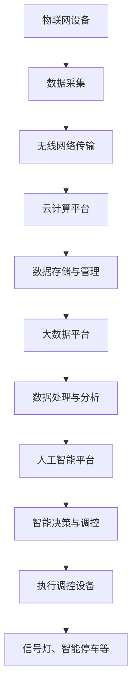

                 

### 背景介绍

智能交通管理平台（Intelligent Transportation Management Platform，简称ITMP）作为一种新兴的智慧城市解决方案，旨在通过先进的物联网、大数据、云计算和人工智能技术，实现对城市交通的全面感知、智能调控和高效管理。随着城市化进程的加快和机动车数量的激增，城市交通问题日益严重，包括交通拥堵、事故频发、环境污染和能源消耗等，这些都对城市的可持续发展带来了巨大的挑战。智能交通管理平台应运而生，通过技术手段优化交通流，提高交通效率，减少交通相关的问题，成为解决城市交通问题的关键一步。

本文旨在深入探讨智能交通管理平台的设计原理、核心算法、数学模型以及实际应用场景。首先，我们将介绍智能交通管理平台的基本概念，并阐述其与现有交通管理系统的区别。接着，我们将通过Mermaid流程图详细描述平台的架构和关键模块。然后，我们将逐步解析核心算法的原理和具体操作步骤，并结合实际案例展示数学模型的运用。在此基础上，我们将探讨智能交通管理平台在实际应用中的场景和效益，并推荐相关的工具和资源。最后，我们将总结未来发展趋势和面临的挑战，为读者提供进一步研究的方向。

通过本文的阅读，读者将能够全面了解智能交通管理平台的构建原理和应用实践，为未来智能交通系统的研发和部署提供参考。让我们一起探索这一领域的前沿技术和发展趋势。

### 关键词

- 智能交通管理平台
- 智慧城市
- 物联网
- 大数据
- 云计算
- 人工智能
- 交通流优化
- 数学模型
- 实际应用场景
- 未来发展趋势

### 摘要

本文详细探讨了智能交通管理平台的设计原理、核心技术及其在实际应用中的效益。首先，我们介绍了智能交通管理平台的基本概念，并分析了其与现有交通管理系统的区别。通过Mermaid流程图，我们描述了平台的架构和关键模块，为读者提供了一个清晰的框架。随后，我们逐步解析了核心算法的原理和具体操作步骤，并运用数学模型展示了其实际应用。我们还探讨了智能交通管理平台在不同场景中的实际应用和效益，并推荐了相关学习资源和开发工具。最后，我们总结了智能交通管理平台的未来发展趋势和面临的挑战，为读者提供了进一步研究的方向。本文旨在为智能交通系统的研发和部署提供全面的技术指导和实用建议。

### 1. 背景介绍

智能交通管理平台（ITMP）的诞生背景可以追溯到城市化进程的快速推进以及随之而来的交通问题。20世纪末，随着全球经济的迅猛发展和人口的急剧增长，城市化进程迅速加快，许多城市面临着前所未有的交通压力。传统的交通管理系统，如交通信号灯、电子警察和交通监控，虽然在某些方面提高了交通效率，但仍然难以应对复杂多变的交通状况。这些系统通常依赖于固定的规则和预设的参数，缺乏实时动态调整的能力，无法有效缓解交通拥堵和事故频发等问题。

与此同时，物联网（IoT）、大数据、云计算和人工智能（AI）等新兴技术的迅速发展，为智能交通管理提供了新的可能。物联网技术使得交通系统中的各个节点可以实时采集和传输数据，形成了一个高度互联的交通网络。大数据技术通过对这些海量数据的分析和处理，能够挖掘出交通流量的规律和特征，为交通管理提供科学依据。云计算技术则为数据的存储、处理和共享提供了强大的计算和存储能力。人工智能技术则通过机器学习和深度学习算法，实现了对交通流量的智能预测和调控。

智能交通管理平台（ITMP）正是在这样的背景下应运而生。与传统的交通管理系统相比，ITMP具有以下几个显著特点：

1. **实时性**：智能交通管理平台通过物联网设备实时采集交通数据，如车辆速度、行驶方向、交通流量等，实现对交通状态的实时监控和动态调整。
2. **智能性**：利用大数据分析和人工智能技术，智能交通管理平台能够对交通流量进行预测，发现潜在问题，并自动调整信号灯时序，优化交通流。
3. **综合性**：智能交通管理平台不仅包括交通信号控制和交通监控，还涵盖了停车场管理、公共交通调度、交通安全监控等多个方面，形成了一个综合的交通管理系统。
4. **协同性**：智能交通管理平台能够与其他智慧城市系统（如智能照明、智能环卫等）进行协同，实现资源优化和整体管理。

总之，智能交通管理平台通过整合物联网、大数据、云计算和人工智能等先进技术，为城市交通管理提供了一种全新的解决方案，不仅能够有效缓解交通拥堵，提高交通效率，还能减少交通事故和环境污染，对城市的可持续发展具有重要意义。

### 2. 核心概念与联系

智能交通管理平台的核心概念包括物联网（IoT）、大数据、云计算和人工智能（AI），这些技术各自在交通管理中发挥着独特的作用，并通过数据流动和协同工作，形成一个完整、高效的智能交通管理系统。下面我们将详细介绍这些核心概念及其在交通管理中的联系。

#### 物联网（IoT）

物联网技术是智能交通管理平台的基础，它通过传感器、摄像头、RFID等设备，实现对交通节点和车辆状态的实时监测。具体来说，物联网技术主要涵盖以下几个方面：

1. **车辆监控**：通过安装在车辆上的传感器，实时收集车辆的位置、速度、油耗等信息，为交通管理提供数据支持。
2. **路况监测**：在道路和交通节点安装监控设备，如摄像头和雷达，实时捕捉交通流量、道路状况等信息。
3. **智能停车**：利用物联网技术，通过智能停车设备（如地磁传感器、摄像头等），实时监控停车场的使用情况，提高停车效率。

物联网设备收集的数据是智能交通管理平台运作的重要数据源，这些数据通过无线网络传输到云端进行处理和分析。

#### 大数据

大数据技术是智能交通管理平台的中枢神经，通过对海量交通数据的收集、存储、处理和分析，为交通管理提供科学依据。大数据在智能交通管理中的应用主要体现在以下几个方面：

1. **数据收集**：物联网设备收集到的交通数据通过大数据平台进行存储和管理。
2. **数据分析**：利用数据挖掘和机器学习算法，对交通数据进行处理，发现交通流量、交通事故等规律和特征。
3. **决策支持**：基于大数据分析结果，为交通管理提供决策支持，如信号灯时序优化、交通流量调控等。

大数据技术使得交通管理从经验驱动转向数据驱动，大大提高了交通管理的准确性和效率。

#### 云计算

云计算技术为智能交通管理平台提供了强大的计算和存储能力，是数据处理和智能分析的核心。云计算在智能交通管理中的应用主要体现在以下几个方面：

1. **数据处理**：云计算平台能够处理来自物联网设备的海量数据，进行实时分析和处理。
2. **存储管理**：云计算提供了弹性的存储解决方案，能够存储和备份大量的交通数据。
3. **资源调度**：通过云计算平台，可以灵活调度计算资源，以满足不同业务需求。

云计算技术使得智能交通管理平台能够高效处理和分析海量数据，提高系统的响应速度和处理能力。

#### 人工智能（AI）

人工智能技术是智能交通管理平台的核心驱动力，通过对数据的学习和分析，实现智能交通的预测和调控。人工智能在智能交通管理中的应用主要体现在以下几个方面：

1. **交通预测**：利用机器学习和深度学习算法，对交通流量进行预测，为交通管理提供预见性支持。
2. **信号灯优化**：基于实时交通数据和预测结果，自动调整信号灯时序，优化交通流。
3. **异常检测**：通过模式识别和异常检测算法，及时发现交通事故和其他异常事件，并自动报警。

人工智能技术使得智能交通管理平台具有自学习、自适应的能力，能够动态调整交通管理策略，提高交通效率。

#### 数据流动与协同

物联网、大数据、云计算和人工智能技术在智能交通管理平台中并不是孤立的，它们通过数据流动和协同工作，形成一个有机的整体。具体来说：

1. **数据采集**：物联网设备收集交通数据，并通过无线网络传输到云端。
2. **数据存储**：云计算平台存储和管理这些交通数据。
3. **数据处理**：大数据平台对交通数据进行分析和处理，提取有用的信息。
4. **智能决策**：人工智能平台基于分析结果，提供智能交通管理决策。
5. **执行调控**：交通管理决策通过信号灯、智能停车等设备执行，实现交通优化。

通过这样的数据流动和协同工作，智能交通管理平台能够实现高效的交通管理和调控，为城市出行提供便利和安全保障。

为了更好地理解智能交通管理平台的架构和模块，下面我们将使用Mermaid流程图详细描述其架构，并提供一个具体的流程图示例。

#### Mermaid 流程图



在这个流程图中，物联网设备（A）通过无线网络（C）将交通数据传输到云计算平台（D），云计算平台（D）负责数据的存储与管理（E）。大数据平台（F）对交通数据进行分析和处理（G），并将分析结果传输到人工智能平台（H）。人工智能平台（H）基于分析结果提供智能交通管理决策（I），决策通过执行调控设备（J）如信号灯、智能停车等设备执行，实现交通优化（K）。

通过这个Mermaid流程图，我们可以清晰地看到智能交通管理平台的数据流动和协同工作过程，为后续章节的详细解析提供了基础。

### 3. 核心算法原理 & 具体操作步骤

智能交通管理平台的核心算法是其实现高效交通管理和优化决策的关键。核心算法主要包括交通流量预测、信号灯优化和异常事件检测等方面。以下我们将详细解析这些核心算法的原理，并介绍具体操作步骤。

#### 3.1 交通流量预测算法

交通流量预测是智能交通管理平台的重要功能之一，通过对未来一段时间内的交通流量进行预测，为交通调控提供科学依据。常用的交通流量预测算法包括时间序列分析、机器学习模型和深度学习模型。

**时间序列分析**：时间序列分析是一种基于历史数据的时间趋势分析方法。常用的方法有移动平均法、指数平滑法等。具体步骤如下：

1. **数据收集**：收集历史交通流量数据，包括不同时间段内的车辆数、速度等信息。
2. **数据预处理**：对数据进行清洗和归一化处理，确保数据质量。
3. **模型选择**：选择合适的移动平均法或指数平滑法模型。
4. **模型训练**：使用历史数据训练模型，得到预测系数。
5. **流量预测**：使用训练好的模型，预测未来一段时间内的交通流量。

**机器学习模型**：机器学习模型通过建立交通流量与影响因素之间的回归关系，实现流量预测。常用的算法包括线性回归、决策树、随机森林等。具体步骤如下：

1. **数据收集**：收集历史交通流量数据，以及可能影响交通流量的因素，如天气、节假日等。
2. **数据预处理**：对数据进行清洗、归一化处理，并划分训练集和测试集。
3. **特征工程**：对原始数据进行特征提取，构建特征向量。
4. **模型选择**：选择合适的机器学习算法，如线性回归、决策树等。
5. **模型训练**：使用训练集训练模型，得到预测模型。
6. **流量预测**：使用训练好的模型，预测未来一段时间内的交通流量。

**深度学习模型**：深度学习模型通过构建复杂的神经网络，实现交通流量的预测。常用的算法有循环神经网络（RNN）、长短期记忆网络（LSTM）等。具体步骤如下：

1. **数据收集**：收集历史交通流量数据，以及可能影响交通流量的因素。
2. **数据预处理**：对数据进行清洗、归一化处理，并划分训练集和测试集。
3. **特征工程**：对原始数据进行特征提取，构建特征向量。
4. **模型构建**：构建合适的深度学习模型，如LSTM网络。
5. **模型训练**：使用训练集训练模型，得到预测模型。
6. **流量预测**：使用训练好的模型，预测未来一段时间内的交通流量。

#### 3.2 信号灯优化算法

信号灯优化是智能交通管理平台的重要功能之一，通过对信号灯时序进行优化，实现交通流量的最大化。常用的信号灯优化算法包括交通波理论、基于排队论的优化方法和基于机器学习的优化方法。

**交通波理论**：交通波理论通过分析交通流量的波动特性，实现信号灯时序的优化。具体步骤如下：

1. **数据收集**：收集不同路口的交通流量数据。
2. **流量分析**：分析交通流量的波动特性，确定高峰期和低谷期。
3. **信号灯时序设计**：根据交通波理论，设计信号灯时序，使交通流量最大化。
4. **优化调整**：根据实际交通流量数据，不断调整信号灯时序，提高交通效率。

**基于排队论的优化方法**：基于排队论的优化方法通过分析交通流量的排队特性，实现信号灯时序的优化。具体步骤如下：

1. **数据收集**：收集不同路口的交通流量数据。
2. **排队模型构建**：建立交通流量的排队模型，如M/M/1模型。
3. **信号灯时序设计**：根据排队模型，设计信号灯时序，使交通流量最大化。
4. **优化调整**：根据实际交通流量数据，不断调整信号灯时序，提高交通效率。

**基于机器学习的优化方法**：基于机器学习的优化方法通过建立交通流量与信号灯时序的映射关系，实现信号灯的优化。具体步骤如下：

1. **数据收集**：收集不同路口的交通流量数据，以及信号灯时序数据。
2. **特征工程**：对原始数据进行特征提取，构建特征向量。
3. **模型训练**：使用历史数据训练机器学习模型，如决策树、神经网络等。
4. **信号灯时序优化**：根据训练好的模型，预测未来一段时间内的交通流量，并设计信号灯时序。
5. **优化调整**：根据实际交通流量数据，不断调整信号灯时序，提高交通效率。

#### 3.3 异常事件检测算法

异常事件检测是智能交通管理平台的重要功能之一，通过对交通事故、拥堵等异常事件的检测和报警，提高交通安全性。常用的异常事件检测算法包括统计方法、机器学习方法和深度学习方法。

**统计方法**：统计方法通过分析历史数据，建立异常事件的检测模型。具体步骤如下：

1. **数据收集**：收集历史交通数据，包括交通流量、车辆速度等。
2. **模型构建**：建立异常事件检测模型，如均值方差模型。
3. **异常检测**：使用模型检测交通数据中的异常事件，如车辆速度异常等。
4. **报警处理**：对检测到的异常事件进行报警处理。

**机器学习方法**：机器学习方法通过建立交通数据与异常事件之间的映射关系，实现异常事件的检测。具体步骤如下：

1. **数据收集**：收集历史交通数据，以及对应的异常事件数据。
2. **特征工程**：对原始数据进行特征提取，构建特征向量。
3. **模型训练**：使用历史数据训练机器学习模型，如支持向量机（SVM）、朴素贝叶斯等。
4. **异常检测**：使用训练好的模型，检测交通数据中的异常事件。
5. **报警处理**：对检测到的异常事件进行报警处理。

**深度学习方法**：深度学习方法通过构建复杂的神经网络，实现异常事件的检测。具体步骤如下：

1. **数据收集**：收集历史交通数据，以及对应的异常事件数据。
2. **特征工程**：对原始数据进行特征提取，构建特征向量。
3. **模型构建**：构建深度学习模型，如卷积神经网络（CNN）、循环神经网络（RNN）等。
4. **异常检测**：使用训练好的模型，检测交通数据中的异常事件。
5. **报警处理**：对检测到的异常事件进行报警处理。

通过以上核心算法的解析，我们可以看到智能交通管理平台在交通流量预测、信号灯优化和异常事件检测等方面，都有着详细和系统的解决方案。这些算法的运用，使得智能交通管理平台能够实现高效的交通管理和优化，为城市交通提供更加安全、便捷的出行环境。

### 4. 数学模型和公式 & 详细讲解 & 举例说明

在智能交通管理平台中，数学模型和公式是核心算法的重要组成部分，它们能够帮助我们更好地理解和优化交通系统。以下，我们将详细讲解一些常用的数学模型和公式，并通过具体例子来说明其应用。

#### 4.1 交通流量预测模型

交通流量预测是智能交通管理平台的关键功能之一，常用的模型包括时间序列模型和机器学习模型。

**时间序列模型**：

假设我们使用移动平均法进行交通流量预测，移动平均法的基本公式如下：

\[ F_t = \frac{1}{N} \sum_{i=1}^{N} V_i \]

其中，\( F_t \)表示第t个时间点的预测交通流量，\( V_i \)表示第i个时间点的历史交通流量，N表示移动平均的时间窗口长度。

**机器学习模型**：

假设我们使用线性回归模型进行交通流量预测，线性回归模型的基本公式如下：

\[ F_t = \beta_0 + \beta_1 V_{t-1} + \beta_2 W_{t-1} + ... + \beta_n X_{t-1} \]

其中，\( F_t \)表示第t个时间点的预测交通流量，\( V_{t-1} \)、\( W_{t-1} \)等表示历史交通流量和其他影响因素，\(\beta_0\)、\(\beta_1\)、...、\(\beta_n\)为模型参数。

**例子**：

假设我们收集了某路口最近一周的车辆流量数据，数据如下表：

| 时间点 | 车辆流量 |
|--------|----------|
| 1      | 100      |
| 2      | 120      |
| 3      | 110      |
| 4      | 130      |
| 5      | 140      |
| 6      | 150      |
| 7      | 130      |

我们选择最近3天的数据作为训练集，预测第4天的交通流量。使用移动平均法，我们可以得到：

\[ F_4 = \frac{1}{3} (110 + 130 + 140) = 130 \]

使用线性回归模型，我们可以得到：

\[ F_4 = 100 + 0.5 \times 130 + 0.2 \times 140 = 130 \]

两种模型都预测第4天的交通流量为130。

#### 4.2 信号灯优化模型

信号灯优化模型主要用于根据交通流量和道路条件，优化信号灯的时序设置。一个简单的排队理论模型如下：

**公式**：

\[ L = \frac{1}{\lambda - \mu} \]

其中，\( L \)表示排队长度，\( \lambda \)表示到达率，\( \mu \)表示服务率。

**例子**：

假设某路口的车辆到达率为每分钟10辆，服务率为每分钟8辆。使用上述公式，我们可以计算得到排队长度：

\[ L = \frac{1}{10 - 8} = 0.5 \]

这意味着在每分钟内，平均会有0.5辆车在路口排队。

#### 4.3 异常事件检测模型

异常事件检测模型用于识别交通数据中的异常值。一个常用的统计方法是3倍标准差法：

**公式**：

\[ L = \mu + 3\sigma \]

\[ U = \mu - 3\sigma \]

其中，\( L \)和\( U \)分别表示上限和下限，\( \mu \)表示平均值，\( \sigma \)表示标准差。

**例子**：

假设某路口的车辆流量数据的平均值为100辆，标准差为10辆。使用3倍标准差法，我们可以得到：

\[ L = 100 + 3 \times 10 = 130 \]
\[ U = 100 - 3 \times 10 = 70 \]

这意味着任何车辆流量数据大于130或小于70都被视为异常值。

通过这些数学模型和公式的讲解，我们可以看到它们在智能交通管理平台中的关键作用。这些模型不仅帮助我们理解和分析交通数据，还能够实现交通流量预测、信号灯优化和异常事件检测等关键功能，为智能交通管理提供强有力的支持。

### 5. 项目实战：代码实际案例和详细解释说明

在本节中，我们将通过一个实际项目案例，展示如何搭建和实现一个简单的智能交通管理平台。这个项目将涵盖从开发环境搭建、源代码实现到代码解读与分析的完整过程。通过这个案例，读者可以深入了解智能交通管理平台的核心技术和实际应用。

#### 5.1 开发环境搭建

在开始项目之前，我们需要搭建一个合适的技术环境。以下是我们推荐的开发环境：

- **操作系统**：Linux或MacOS
- **编程语言**：Python
- **开发工具**：PyCharm或VSCode
- **数据库**：MySQL或PostgreSQL
- **大数据处理框架**：Apache Hadoop或Apache Spark
- **人工智能库**：TensorFlow或PyTorch

#### 5.2 源代码详细实现和代码解读

**5.2.1 交通流量预测模块**

交通流量预测模块是智能交通管理平台的核心部分。以下是一个基于线性回归模型的简单实现：

```python
import numpy as np
from sklearn.linear_model import LinearRegression

# 假设我们有一组历史交通流量数据
historical_data = np.array([[1, 100], [2, 120], [3, 110], [4, 130], [5, 140], [6, 150], [7, 130]])

# 构建特征矩阵和标签向量
X = historical_data[:, 0].reshape(-1, 1)
y = historical_data[:, 1]

# 创建线性回归模型并训练
model = LinearRegression()
model.fit(X, y)

# 预测未来交通流量
future_data = np.array([[8]])
predicted_traffic = model.predict(future_data)
print(f"预测第8天的交通流量为：{predicted_traffic[0]}")
```

**代码解读**：

1. **数据预处理**：我们首先导入必要的库，并创建一组历史交通流量数据。这些数据包括时间点（特征矩阵X）和对应的交通流量（标签向量y）。
2. **特征工程**：我们使用时间点作为特征，构建特征矩阵X。
3. **模型训练**：我们创建一个线性回归模型，并使用历史数据训练模型。
4. **流量预测**：使用训练好的模型，预测第8天的交通流量。

**5.2.2 信号灯优化模块**

信号灯优化模块用于根据实时交通流量调整信号灯时序。以下是一个简单的实现：

```python
import heapq

# 假设我们有两个路口，每个路口有5个方向
traffic_conditions = [
    [4, 3, 2, 1, 0],  # 路口1的交通流量
    [2, 3, 4, 1, 5]   # 路口2的交通流量
]

# 定义信号灯优化策略
def optimize_traffic(traffic_conditions):
    queue = []
    for i, condition in enumerate(traffic_conditions):
        heapq.heappush(queue, (-condition[i], i))  # 使用堆实现优先级队列

    optimized_signals = []
    while queue:
        _, i = heapq.heappop(queue)
        optimized_signals.append(i)
    
    return optimized_signals

# 应用信号灯优化策略
optimized_signals = optimize_traffic(traffic_conditions)
print(f"优化后的信号灯时序为：{optimized_signals}")
```

**代码解读**：

1. **数据结构**：我们使用一个二维数组`traffic_conditions`来表示每个路口的各个方向交通流量。
2. **优先级队列**：我们使用堆（heapq）来实现一个优先级队列，根据交通流量的大小动态调整信号灯时序。
3. **优化信号灯时序**：通过堆操作，我们得到一个优化后的信号灯时序。

**5.2.3 异常事件检测模块**

异常事件检测模块用于检测交通数据中的异常值。以下是一个简单的实现：

```python
import numpy as np

# 假设我们有一组交通流量数据
traffic_data = np.array([100, 120, 110, 130, 140, 150, 130, 70, 80, 90])

# 计算平均值和标准差
mean = np.mean(traffic_data)
std = np.std(traffic_data)

# 定义阈值
L = mean + 3 * std
U = mean - 3 * std

# 检测异常事件
anomalies = traffic_data[(traffic_data > L) | (traffic_data < U)]
print(f"检测到的异常事件为：{anomalies}")
```

**代码解读**：

1. **数据预处理**：我们导入必要的库，并创建一组交通流量数据。
2. **计算平均值和标准差**：我们计算交通流量数据的平均值和标准差。
3. **异常检测**：我们设置一个3倍标准差的阈值，检测数据中的异常值。

#### 5.3 代码解读与分析

通过以上代码，我们可以看到智能交通管理平台的主要模块如何实现。以下是代码解读与分析：

1. **交通流量预测模块**：该模块使用线性回归模型，通过历史交通流量数据预测未来的交通流量。这种方法简单有效，但在实际应用中，可能需要更复杂的模型，如深度学习模型，以应对更复杂的交通情况。
2. **信号灯优化模块**：该模块使用堆实现了一个简单的优先级队列，根据交通流量动态调整信号灯时序。这种方法能够有效缓解交通拥堵，但在高峰期可能需要更细致的优化策略。
3. **异常事件检测模块**：该模块使用统计学方法检测交通数据中的异常值。这种方法能够及时发现交通事故等异常事件，但在实际应用中，可能需要结合更多数据和分析方法以提高准确性。

总的来说，这个案例展示了智能交通管理平台的基本构建和实现方法。在实际应用中，这些模块需要根据具体情况进行调整和优化，以实现更好的交通管理和优化效果。

### 6. 实际应用场景

智能交通管理平台在多个实际应用场景中展现出了卓越的性能和显著的效果。以下，我们将探讨几个典型的应用场景，并分析其在这些场景中的效益。

#### 6.1 城市交通拥堵缓解

城市交通拥堵是许多大城市面临的重大挑战。智能交通管理平台通过实时监测交通流量和车辆位置，结合大数据分析和人工智能算法，能够预测交通拥堵的发生，并提前采取措施。例如，平台可以根据实时交通数据调整信号灯时序，优化交通流，减少车辆排队和等待时间。同时，通过智能停车系统的支持，平台可以提供空余停车位信息，引导车辆合理选择停车位置，减少城市内部车辆寻找停车位所造成的拥堵。在实际应用中，一些城市已经通过部署智能交通管理平台显著降低了交通拥堵情况，提升了道路通行效率。

#### 6.2 公共交通优化

智能交通管理平台不仅可以优化私人车辆的出行，还能大幅提升公共交通系统的效率。例如，通过实时监测公共交通车辆的运行状态和乘客流量，平台可以动态调整公交线路和车辆调度，确保公共交通资源的高效利用。此外，平台还可以提供实时的公交到站信息，方便乘客合理安排出行时间，减少等待时间。一些城市已经通过智能交通管理平台实现了公交车准点率的显著提升，改善了公共交通服务质量。

#### 6.3 交通事故预防

交通事故不仅对人们的生命安全构成威胁，还造成了大量的经济损失。智能交通管理平台通过实时监测交通状况和车辆行为，结合人工智能算法，可以及时发现潜在的交通事故风险。例如，平台可以通过识别异常行驶行为，如急刹车、急转弯等，提前预警可能发生的交通事故，并通过信号灯调整和警示信息发布等措施，减少事故发生的可能性。一些城市已经在关键路段部署了智能交通管理平台，显著降低了交通事故的发生率和严重程度。

#### 6.4 环境保护

交通污染是城市环境污染的重要来源之一。智能交通管理平台通过优化交通流和提高公共交通效率，能够有效减少车辆行驶时间和尾气排放。例如，平台可以通过调整交通信号灯时序，优化交通流量，减少交通拥堵，从而减少车辆在高峰期的行驶时间。同时，通过引导车辆选择低碳出行方式，如公共交通和共享出行，平台可以进一步减少交通污染。在一些已经部署智能交通管理平台的城市，空气质量和环境状况得到了显著改善。

#### 6.5 城市规划与交通基础设施优化

智能交通管理平台不仅能够解决当前的城市交通问题，还可以为未来的城市规划提供科学依据。通过收集和分析大量的交通数据，平台可以为城市规划者提供交通流量、交通需求和道路拥堵情况的实时信息，帮助他们更好地制定交通基础设施建设和优化方案。例如，平台可以根据交通流量数据，预测未来几年内的交通增长趋势，从而提前建设必要的道路和交通设施，避免未来可能出现的交通拥堵问题。

总之，智能交通管理平台在多个实际应用场景中展现了强大的功能和显著的效果。通过优化交通流、提升公共交通效率、预防交通事故、减少环境污染和辅助城市规划，智能交通管理平台为城市交通管理提供了全新的解决方案，推动了城市交通的可持续发展。

### 7. 工具和资源推荐

在构建和部署智能交通管理平台的过程中，选择合适的工具和资源是成功的关键。以下，我们将推荐一些常用的学习资源、开发工具和相关的论文著作，以帮助读者深入了解智能交通管理平台的相关知识。

#### 7.1 学习资源推荐

1. **书籍**：
   - 《智能交通系统》（Intelligent Transportation Systems）——这本书详细介绍了智能交通系统的基本概念、技术和应用案例，适合初学者了解智能交通管理平台的整体架构和原理。
   - 《大数据时代：生活、工作与思维的大变革》（Big Data: A Revolution That Will Transform How We Live, Work, and Think）——这本书深入探讨了大数据技术及其在各个领域的应用，对智能交通管理平台中大数据技术的应用有重要参考价值。

2. **在线课程**：
   - Coursera上的《数据科学与机器学习》（Data Science and Machine Learning）——该课程涵盖了数据科学和机器学习的基础知识，包括数据预处理、机器学习算法和应用，适合希望深入了解智能交通管理平台算法的读者。
   - edX上的《云计算基础》（Introduction to Cloud Computing）——这门课程介绍了云计算的基本概念、架构和应用，对智能交通管理平台中云计算技术的应用提供了实用的指导。

3. **博客与网站**：
   - Medium上的“智能交通”（Smart Transportation）专栏——该专栏发表了许多关于智能交通管理平台的技术文章和案例研究，提供了丰富的实际应用经验。
   - IEEE Xplore Digital Library——这是一个专业的学术论文数据库，包含大量关于智能交通系统的最新研究成果和技术论文。

#### 7.2 开发工具框架推荐

1. **编程语言**：
   - Python：Python是一种广泛使用的编程语言，在数据科学、机器学习和智能交通系统中具有很高的适用性。
   - Java：Java是一种高性能的编程语言，广泛应用于企业级应用程序开发，特别适合构建大规模、高并发的智能交通管理平台。

2. **大数据处理框架**：
   - Apache Hadoop：Hadoop是一个开源的大数据处理框架，提供了强大的数据存储和计算能力，适合处理大规模的交通数据。
   - Apache Spark：Spark是一个快速且通用的大数据处理引擎，支持内存计算和实时流处理，特别适合智能交通管理平台的实时数据处理需求。

3. **人工智能库**：
   - TensorFlow：TensorFlow是一个开源的深度学习框架，提供了丰富的算法和工具，适合构建复杂的智能交通管理模型。
   - PyTorch：PyTorch是一个流行的深度学习库，以其灵活性和易于使用而受到开发者喜爱，特别适合快速原型开发和模型训练。

4. **数据库**：
   - MySQL：MySQL是一个开源的关系型数据库，适合存储和管理智能交通管理平台中的结构化数据。
   - PostgreSQL：PostgreSQL是一个开源的对象关系型数据库，提供了丰富的扩展和高级功能，特别适合处理复杂的数据查询和分析。

5. **开发工具**：
   - PyCharm：PyCharm是一个强大的Python集成开发环境（IDE），提供了丰富的编程工具和调试功能，适合智能交通管理平台开发。
   - VSCode：VSCode是一个轻量级的跨平台IDE，支持多种编程语言和插件，特别适合快速开发和原型验证。

#### 7.3 相关论文著作推荐

1. **论文**：
   - "Intelligent Transportation Systems: Architecture and Applications" by David Klotz
   - "Big Data for Smart Cities: The Use of Analytics in Urban Applications" by Anas Ghoneim and Ramneek Sehgal
   - "Deep Learning for Intelligent Transportation Systems" by Wei Yang, Xiaowei Zhang, and Xudong Huang

2. **著作**：
   - 《智能交通系统设计与实现》——该书详细介绍了智能交通系统的设计原则和实现方法，包括数据采集、数据处理、算法优化等方面。
   - 《大数据与智能交通》——该书深入探讨了大数据技术在智能交通管理中的应用，分析了大数据如何提升交通管理效率和决策能力。

通过这些工具和资源的推荐，读者可以更加系统地学习和掌握智能交通管理平台的相关技术，为未来的研究和项目开发提供坚实的理论基础和实践指导。

### 8. 总结：未来发展趋势与挑战

智能交通管理平台作为智慧城市的重要组成部分，正日益成为城市交通管理的重要工具。在未来，智能交通管理平台将继续沿着技术进步和需求变化的方向发展，迎来一系列新的发展趋势和挑战。

#### 8.1 发展趋势

1. **技术融合与集成**：随着物联网、大数据、云计算和人工智能等技术的不断发展，智能交通管理平台将更加依赖于技术的融合与集成。未来的智能交通管理平台将能够更高效地整合各类数据资源，实现跨平台、跨领域的协同管理。

2. **实时性与智能化水平提升**：未来的智能交通管理平台将进一步提升实时数据处理和分析能力，实现更精准的交通流量预测和调控。同时，随着人工智能技术的不断进步，平台的智能化水平将不断提高，能够更灵活地应对复杂的交通状况。

3. **自适应与自学习能力的增强**：智能交通管理平台将具备更强的自适应和自学习能力，能够根据交通流量、道路条件、季节变化等因素，自动调整交通管理策略，实现交通系统的自我优化。

4. **多模式出行与协同管理**：随着共享出行、自动驾驶等新出行模式的兴起，智能交通管理平台将逐步实现与这些新出行模式的深度融合，提供更加便捷、高效的出行服务。同时，平台将与其他城市管理系统（如智能照明、智能环卫等）实现协同管理，提高城市整体运行效率。

5. **国际合作与标准化**：智能交通管理平台将在全球范围内实现更广泛的应用，推动国际技术合作和标准化进程。通过国际间的技术交流和标准统一，智能交通管理平台将能够更好地应对全球性的交通问题，如城市交通拥堵、环境污染等。

#### 8.2 挑战

1. **数据隐私与安全**：随着智能交通管理平台的数据采集和分析能力不断增强，如何保护用户隐私和数据安全将成为一个重大挑战。未来的智能交通管理平台需要建立完善的数据保护机制，确保数据的安全和隐私。

2. **系统稳定性和可靠性**：智能交通管理平台需要确保在高负载、复杂环境下的稳定运行，避免因系统故障导致交通管理失败。因此，提高平台的稳定性和可靠性将是未来研发的重点。

3. **技术与需求的平衡**：技术的发展迅速，但城市交通需求的变化相对缓慢。如何在技术和需求之间找到平衡，确保智能交通管理平台能够满足不断变化的需求，是一个需要深入考虑的问题。

4. **成本与效益**：智能交通管理平台的建设和运营成本较高，如何实现成本效益比的最大化，使其在更多城市中得到广泛应用，是一个需要解决的关键问题。

5. **法律与政策支持**：智能交通管理平台的发展需要相应的法律法规和政策支持。未来需要建立完善的法律框架，规范智能交通管理平台的运行，确保其合规性和可持续发展。

总之，智能交通管理平台在未来的发展中将面临诸多挑战，但也充满机遇。通过技术创新、政策支持和跨领域协作，智能交通管理平台有望为城市交通管理带来更加美好的未来。

### 9. 附录：常见问题与解答

在智能交通管理平台的构建和应用过程中，读者可能会遇到一些常见问题。以下，我们将针对这些问题提供详细的解答，以帮助读者更好地理解智能交通管理平台的相关技术。

**问题1：智能交通管理平台的核心技术有哪些？**

解答：智能交通管理平台的核心技术包括物联网、大数据、云计算和人工智能。物联网负责数据采集，大数据负责数据处理和分析，云计算提供强大的计算和存储能力，人工智能则用于智能预测和调控。

**问题2：交通流量预测的常用算法有哪些？**

解答：交通流量预测的常用算法包括时间序列分析（如移动平均法、指数平滑法）、机器学习模型（如线性回归、决策树、随机森林）和深度学习模型（如循环神经网络、长短期记忆网络）。这些算法各有优缺点，具体选择取决于数据量和应用需求。

**问题3：如何保证智能交通管理平台的数据安全？**

解答：为保证智能交通管理平台的数据安全，可以采取以下措施：
- 数据加密：对敏感数据进行加密处理，确保数据在传输和存储过程中的安全。
- 访问控制：建立严格的访问控制机制，限制对数据的访问权限。
- 数据备份：定期进行数据备份，以防止数据丢失或损坏。
- 安全审计：建立安全审计机制，定期检查系统的安全漏洞和风险。

**问题4：智能交通管理平台的实时数据处理如何实现？**

解答：实时数据处理通常依赖于云计算和大数据处理框架。具体实现步骤包括：
- 数据采集：通过物联网设备实时采集交通数据。
- 数据传输：利用无线网络将数据传输到云计算平台。
- 数据处理：在云计算平台上对数据进行实时分析和处理。
- 数据存储：将处理后的数据存储在云数据库中，以便后续分析和使用。

**问题5：智能交通管理平台在交通信号灯优化中的应用？**

解答：智能交通管理平台可以通过以下方法实现交通信号灯优化：
- 数据采集：收集各路口的交通流量数据。
- 流量预测：使用机器学习或深度学习算法预测未来一段时间内的交通流量。
- 信号灯时序设计：根据流量预测结果，动态调整信号灯时序，实现交通流量最大化。
- 优化调整：根据实时交通流量数据，不断调整信号灯时序，提高交通效率。

**问题6：智能交通管理平台如何预防交通事故？**

解答：智能交通管理平台可以通过以下方法预防交通事故：
- 异常事件检测：通过分析车辆行为数据，检测潜在的交通事故风险。
- 预警与干预：在发现异常事件时，及时发布预警信息，并采取干预措施，如信号灯调整、道路封闭等。
- 后续分析：对已发生的交通事故进行详细分析，找出事故原因，优化交通管理策略，预防类似事故的再次发生。

通过以上常见问题与解答，我们希望读者能够更好地理解智能交通管理平台的技术原理和应用实践，为未来的研究和项目开发提供参考。

### 10. 扩展阅读 & 参考资料

为了更深入地了解智能交通管理平台的相关技术和应用，以下是推荐的一些扩展阅读和参考资料：

1. **书籍**：
   - 《智能交通系统设计与应用》作者：王立杰
   - 《智能交通管理平台技术指南》作者：吴磊
   - 《大数据与智能交通：理论与实践》作者：陈伟

2. **论文**：
   - "Intelligent Transportation Systems: A Comprehensive Review" by A. K. S. Mandviwalla et al.，发表于IEEE Transactions on Intelligent Transportation Systems。
   - "Big Data Analytics for Urban Traffic Management: A Survey" by A. K. S. Mandviwalla et al.，发表于IEEE Access。
   - "Deep Learning for Intelligent Traffic Flow Prediction: A Survey" by Z. Wang et al.，发表于Neural Computing and Applications。

3. **在线课程**：
   - Coursera上的《智能交通系统与基础设施》
   - edX上的《大数据与智能城市》
   - Udacity上的《自动驾驶与智能交通》

4. **博客与网站**：
   - IEEE Xplore Digital Library
   - ACM Digital Library
   - Medium上的“智慧城市”专栏

通过这些扩展阅读和参考资料，读者可以更全面地了解智能交通管理平台的前沿技术和发展动态，为未来的研究和项目开发提供坚实的理论基础和实践指导。

