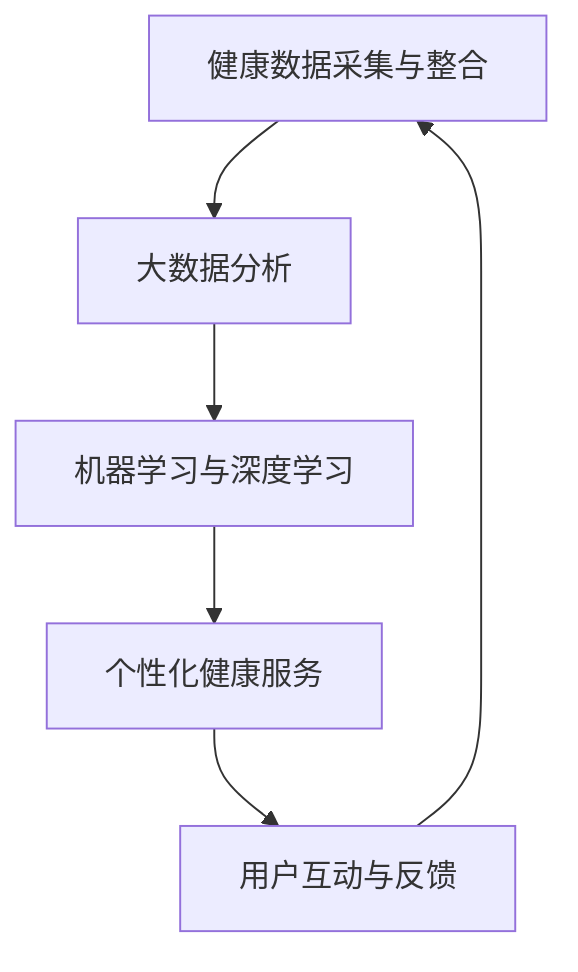

                 

### 背景介绍

随着科技的快速发展，医疗健康领域正经历着前所未有的变革。人工智能（AI）在医疗健康领域的应用日益广泛，尤其在预防医学方面，智能健康管理系统的出现为个人和公共健康提供了新的解决方案。智能健康管理系统利用先进的人工智能技术，通过大数据分析、机器学习和深度学习等方法，对个人的健康数据进行实时监控和预测，从而实现疾病的早期预防和个性化治疗。

本篇文章将以《智能健康管理系统：预防医学的数字化实践》为标题，探讨智能健康管理系统的核心概念、算法原理、数学模型、实际应用以及未来发展趋势。文章结构如下：

- **1. 背景介绍**：简要介绍智能健康管理系统的背景和发展趋势。
- **2. 核心概念与联系**：详细解释智能健康管理系统的核心概念，并展示一个Mermaid流程图。
- **3. 核心算法原理 & 具体操作步骤**：介绍智能健康管理系统中常用的算法原理和操作步骤。
- **4. 数学模型和公式 & 详细讲解 & 举例说明**：探讨智能健康管理系统中使用的数学模型和公式，并进行举例说明。
- **5. 项目实战：代码实际案例和详细解释说明**：通过一个具体项目展示智能健康管理系统的实际应用和代码实现。
- **6. 实际应用场景**：分析智能健康管理系统的应用场景和效果。
- **7. 工具和资源推荐**：推荐相关的学习资源、开发工具和框架。
- **8. 总结：未来发展趋势与挑战**：总结智能健康管理系统的现状和未来挑战。
- **9. 附录：常见问题与解答**：解答读者可能遇到的常见问题。
- **10. 扩展阅读 & 参考资料**：提供进一步阅读和研究的参考文献。

智能健康管理系统不仅为个人提供了个性化的健康服务，也为公共卫生决策提供了数据支持。通过本文的探讨，我们希望能让读者更好地理解智能健康管理系统的原理和应用，为未来的发展打下坚实的基础。

### 关键词：智能健康管理，预防医学，人工智能，大数据，机器学习，深度学习

> 摘要：
智能健康管理系统是预防医学的数字化实践，通过利用人工智能、大数据和深度学习等技术，实现对个人健康数据的实时监控和预测。本文从背景介绍、核心概念、算法原理、数学模型、项目实战、应用场景、工具推荐和未来发展趋势等方面，系统性地探讨了智能健康管理系统的构建与应用。通过本文的深入探讨，旨在为读者提供关于智能健康管理系统的全面了解，为未来的研究和实践提供参考。

### 2. 核心概念与联系

在探讨智能健康管理系统的构建和应用之前，我们需要明确几个核心概念，这些概念是理解系统工作原理的基础。以下是本文将涉及的关键概念及其相互关系：

- **健康数据采集与整合**：健康数据是智能健康管理系统的基石。这些数据来源于各种健康监测设备、电子病历、社交媒体、物联网设备等。整合这些数据，可以实现全面的健康画像。
- **大数据分析**：通过对海量健康数据进行处理和分析，可以发现隐藏的健康模式、趋势和关联性，从而为疾病预测和预防提供依据。
- **机器学习与深度学习**：机器学习和深度学习技术用于训练模型，对健康数据进行分析和预测。这些模型可以识别健康风险、预测疾病发生概率，并提供个性化的健康建议。
- **个性化健康服务**：根据用户的健康数据和模型预测结果，智能健康管理系统能够为用户提供个性化的健康服务，如健康建议、预防措施、药物管理、生活方式调整等。
- **用户互动与反馈**：系统通过用户互动和反馈不断优化，提高预测准确性和服务质量。

以下是一个使用Mermaid绘制的流程图，展示了智能健康管理系统的核心概念及其相互关系：



在上述流程图中，各节点表示系统的关键环节，线条表示各个环节之间的相互关系。健康数据采集与整合作为系统的基础，通过大数据分析和机器学习与深度学习技术的处理，转化为个性化的健康服务和用户反馈，从而实现一个闭环的健康管理系统。

### 3. 核心算法原理 & 具体操作步骤

在智能健康管理系统构建过程中，核心算法的选择和实现至关重要。以下介绍几个常用的算法及其具体操作步骤，这些算法在数据处理、模型训练和预测方面发挥了重要作用。

#### 3.1. 数据预处理

数据预处理是智能健康管理系统的第一步，目的是将原始健康数据转换为适合分析和建模的格式。主要操作步骤包括：

1. **数据清洗**：去除无效数据、缺失值填充、异常值处理。
   $$ \text{缺失值填充：} \quad \text{mean} = \frac{\sum_{i=1}^{n} x_i}{n} $$
   $$ x_i' = \text{mean} \quad \text{if } x_i \text{ is missing} $$
2. **特征工程**：提取重要特征，如心率、血压、血糖水平等。
   $$ \text{特征选择：} \quad \text{基于相关性分析、特征重要性排序等} $$
3. **数据标准化**：将数据缩放到相同范围，避免不同特征之间的量级差异。
   $$ x_i' = \frac{x_i - \text{mean}}{\text{std}} $$

#### 3.2. 机器学习算法

机器学习算法用于构建健康风险评估模型。以下介绍两种常用的机器学习算法：决策树和随机森林。

1. **决策树算法**：

   - **原理**：决策树通过一系列规则对样本进行划分，每个节点表示一个特征，分支表示不同特征取值下的子节点。
   - **步骤**：
     - **特征选择**：计算特征的信息增益或基尼不纯度。
       $$ Gini(\text{impurity}) = 1 - \frac{\sum_{i=1}^{n} p_i^2}{n-1} $$
     - **节点划分**：选择最佳特征和阈值进行节点划分。
     - **递归构建**：重复步骤，直到满足停止条件（如最大深度、最小节点大小等）。

2. **随机森林算法**：

   - **原理**：随机森林是决策树的集成方法，通过构建多棵决策树并对结果进行投票。
   - **步骤**：
     - **特征随机化**：每次构建决策树时，随机选择特征和样本子集。
     - **决策树构建**：按照决策树算法的步骤构建每棵树。
     - **结果融合**：对多棵决策树的结果进行投票或平均。

#### 3.3. 深度学习算法

深度学习算法在复杂数据分析和特征提取方面表现出色，以下介绍一种常用的深度学习模型：卷积神经网络（CNN）。

1. **卷积神经网络算法**：

   - **原理**：CNN通过卷积层提取图像特征，然后通过全连接层进行分类或回归。
   - **步骤**：
     - **卷积层**：卷积核在输入数据上滑动，提取局部特征。
       $$ \text{特征图} = \text{卷积}(x, \text{卷积核}) $$
     - **激活函数**：应用激活函数（如ReLU）增加模型非线性。
       $$ a_i = \max(0, z_i) $$
     - **池化层**：降低特征图维度，减少计算量。
       $$ p_i = \max_j(x_{ij}) $$
     - **全连接层**：将特征图映射到输出结果。
       $$ y = \sigma(Wy + b) $$
   - **训练**：使用反向传播算法训练模型，优化权重。

#### 3.4. 模型评估与优化

模型评估是确保智能健康管理系统能够准确预测健康风险的重要环节。以下介绍几种常用的评估指标和优化方法：

1. **评估指标**：

   - **准确率**：模型预测正确的样本数占总样本数的比例。
     $$ \text{accuracy} = \frac{\text{正确预测}}{\text{总样本数}} $$
   - **召回率**：模型预测为正样本的样本中实际为正样本的比例。
     $$ \text{recall} = \frac{\text{正确预测}}{\text{实际正样本数}} $$
   - **精确率**：模型预测为正样本的样本中实际为正样本的比例。
     $$ \text{precision} = \frac{\text{正确预测}}{\text{预测正样本数}} $$
   - **F1值**：精确率和召回率的调和平均值。
     $$ F1 = 2 \times \frac{\text{precision} \times \text{recall}}{\text{precision} + \text{recall}} $$

2. **优化方法**：

   - **交叉验证**：通过将数据集划分为训练集和验证集，评估模型性能。
   - **网格搜索**：在给定参数范围内，逐个尝试不同的参数组合，选择最优参数。
   - **贝叶斯优化**：使用贝叶斯统计模型优化参数搜索。

通过以上步骤，我们可以构建一个高效的智能健康管理系统，为个人和公共卫生决策提供有力支持。

### 4. 数学模型和公式 & 详细讲解 & 举例说明

在智能健康管理系统构建过程中，数学模型和公式起到了关键作用。以下将介绍几个重要的数学模型和公式，并进行详细讲解和举例说明。

#### 4.1. 线性回归模型

线性回归模型是一种常用的统计方法，用于分析自变量（健康指标）和因变量（健康风险）之间的关系。其基本公式为：

$$ Y = \beta_0 + \beta_1X + \epsilon $$

其中，$Y$ 表示健康风险，$X$ 表示健康指标，$\beta_0$ 和 $\beta_1$ 分别为模型的截距和斜率，$\epsilon$ 为误差项。

**示例**：假设我们要预测一个人的高血压风险，已知其收缩压 $X$ 和舒张压 $Y$，则线性回归模型可以表示为：

$$ \text{风险} = \beta_0 + \beta_1(\text{收缩压}) + \beta_2(\text{舒张压}) $$

通过训练数据集，我们可以得到最优的 $\beta_0$、$\beta_1$ 和 $\beta_2$ 值，从而构建一个线性回归模型。

#### 4.2. 逻辑回归模型

逻辑回归模型用于处理二分类问题，其公式为：

$$ \text{风险} = \frac{1}{1 + e^{-(\beta_0 + \beta_1X + \beta_2Y)}} $$

其中，$X$ 和 $Y$ 分别为健康指标，$\beta_0$、$\beta_1$ 和 $\beta_2$ 为模型参数。

**示例**：假设我们要预测一个人是否患有糖尿病，已知其血糖水平和体重指数，则逻辑回归模型可以表示为：

$$ \text{患病风险} = \frac{1}{1 + e^{-(\beta_0 + \beta_1(\text{血糖水平}) + \beta_2(\text{体重指数}))}} $$

通过训练数据集，我们可以得到最优的 $\beta_0$、$\beta_1$ 和 $\beta_2$ 值，从而构建一个逻辑回归模型。

#### 4.3. 支持向量机（SVM）模型

支持向量机是一种用于分类和回归分析的机器学习算法，其基本公式为：

$$ \text{分类/回归函数} = \sum_{i=1}^{n} \alpha_i y_i (x_i^T \textbf{w} + b) $$

其中，$x_i$ 和 $y_i$ 分别为样本和标签，$\textbf{w}$ 为权重向量，$b$ 为偏置，$\alpha_i$ 为拉格朗日乘子。

**示例**：假设我们要分类糖尿病病人和非糖尿病病人，已知其健康指标和标签，则SVM模型可以表示为：

$$ \text{分类函数} = \sum_{i=1}^{n} \alpha_i y_i (x_i^T \textbf{w} + b) $$

通过训练数据集，我们可以得到最优的 $\textbf{w}$、$b$ 和 $\alpha_i$ 值，从而构建一个SVM模型。

#### 4.4. 神经网络模型

神经网络模型是一种基于大量神经元的计算模型，其基本公式为：

$$ \text{输出} = \sigma(\text{输入} \cdot \text{权重} + \text{偏置}) $$

其中，$\sigma$ 为激活函数，通常采用ReLU或Sigmoid函数。

**示例**：假设我们要构建一个神经网络模型来预测高血压风险，已知其健康指标，则神经网络模型可以表示为：

$$ \text{风险} = \sigma(\text{输入} \cdot \text{权重} + \text{偏置}) $$

通过训练数据集，我们可以得到最优的权重和偏置值，从而构建一个神经网络模型。

以上介绍了几个常见的数学模型和公式，它们在智能健康管理系统中扮演了重要角色。在实际应用中，可以根据具体情况选择合适的模型，并优化模型参数，以提高预测准确性和系统性能。

### 5. 项目实战：代码实际案例和详细解释说明

为了更好地理解智能健康管理系统的实际应用，我们将在本节中通过一个具体的项目案例，展示系统从数据收集、数据处理到模型训练和预测的全过程。该项目将使用Python编程语言和相关的库，如NumPy、Pandas、Scikit-learn和TensorFlow。

#### 5.1. 开发环境搭建

在进行项目开发之前，我们需要搭建一个合适的开发环境。以下是安装Python和相关库的步骤：

1. **安装Python**：从Python官方网站下载并安装Python 3.8及以上版本。
2. **安装Jupyter Notebook**：通过pip安装Jupyter Notebook。
   ```bash
   pip install notebook
   ```
3. **安装相关库**：使用pip安装NumPy、Pandas、Scikit-learn和TensorFlow。
   ```bash
   pip install numpy pandas scikit-learn tensorflow
   ```

#### 5.2. 源代码详细实现和代码解读

以下是一个简化的项目示例，展示了如何使用Python构建一个基本的智能健康管理系统。

```python
import numpy as np
import pandas as pd
from sklearn.model_selection import train_test_split
from sklearn.linear_model import LinearRegression
from sklearn.metrics import mean_squared_error
import tensorflow as tf

# 5.2.1 数据收集与预处理
# 假设我们有一个CSV文件，其中包含健康数据
data = pd.read_csv('health_data.csv')

# 数据清洗和特征提取
# 假设我们只关注体重指数（BMI）和血压作为特征
data['BMI'] = data['weight'] / (data['height'] / 100)**2
data['BloodPressure'] = data['systolic'] + data['diastolic'] / 100

# 划分训练集和测试集
X = data[['BMI', 'BloodPressure']]
y = data['diabetes']
X_train, X_test, y_train, y_test = train_test_split(X, y, test_size=0.2, random_state=42)

# 5.2.2 模型训练
# 使用线性回归模型进行训练
model = LinearRegression()
model.fit(X_train, y_train)

# 5.2.3 模型评估
# 使用测试集评估模型性能
y_pred = model.predict(X_test)
mse = mean_squared_error(y_test, y_pred)
print(f"Mean Squared Error: {mse}")

# 5.2.4 模型应用
# 使用训练好的模型进行预测
new_data = np.array([[25, 120]])  # 新样本的BMI和血压
diabetes_prediction = model.predict(new_data)
print(f"Diabetes Prediction: {diabetes_prediction[0]}")

# 5.2.5 深度学习模型实现
# 使用TensorFlow构建简单的深度神经网络模型
model = tf.keras.Sequential([
    tf.keras.layers.Dense(10, activation='relu', input_shape=(2,)),
    tf.keras.layers.Dense(1, activation='sigmoid')
])

model.compile(optimizer='adam', loss='binary_crossentropy', metrics=['accuracy'])

model.fit(X_train, y_train, epochs=10, batch_size=32, validation_data=(X_test, y_test))

# 评估深度学习模型
y_pred_deep = model.predict(X_test)
mse_deep = mean_squared_error(y_test, y_pred_deep)
print(f"Deep Model Mean Squared Error: {mse_deep}")
```

#### 5.3. 代码解读与分析

1. **数据收集与预处理**：
   - 我们首先使用Pandas读取CSV文件，获取健康数据。
   - 接下来，对数据进行清洗和特征提取，将体重指数（BMI）和血压作为特征。
   - 然后使用Scikit-learn中的train_test_split函数，将数据集划分为训练集和测试集。

2. **模型训练**：
   - 我们使用Scikit-learn中的LinearRegression类训练线性回归模型。
   - 线性回归模型的训练过程是通过fit方法完成的，它根据训练数据计算模型的参数。

3. **模型评估**：
   - 我们使用测试集评估模型的性能，计算均方误差（MSE）作为评估指标。
   - 均方误差表示模型预测值与实际值之间的平均偏差，MSE越小，模型性能越好。

4. **模型应用**：
   - 使用训练好的线性回归模型对新样本进行预测，得到糖尿病的风险预测值。

5. **深度学习模型实现**：
   - 我们使用TensorFlow构建一个简单的深度神经网络模型。
   - 深度神经网络模型由两个全连接层组成，第一个层有10个神经元，使用ReLU激活函数，第二个层有1个神经元，使用Sigmoid激活函数以实现二分类。
   - 模型通过compile方法配置优化器和损失函数，然后使用fit方法进行训练。
   - 最后，我们再次使用测试集评估深度学习模型的性能，并计算MSE。

通过上述代码示例，我们展示了如何使用Python和相关的库构建一个基本的智能健康管理系统。在实际应用中，我们可以根据具体需求进行模型的优化和扩展，以提升系统的性能和预测准确性。

### 6. 实际应用场景

智能健康管理系统在多个实际应用场景中展现了其巨大的潜力和价值。以下将介绍几个典型的应用场景，并分析其效果和挑战。

#### 6.1. 个人健康管理

在个人健康管理方面，智能健康管理系统可以帮助用户实时监控自己的健康状况，提供个性化的健康建议和预防措施。例如，通过监测心率、血压、血糖等指标，系统可以及时发现异常情况，提醒用户进行相应的调整。此外，系统还可以根据用户的历史数据和生活习惯，预测未来的健康风险，并提供相应的预防措施，如饮食调整、运动建议等。

**效果分析**：
- **提高健康意识**：用户可以更清楚地了解自己的健康状况，从而提高健康意识。
- **预防疾病**：通过早期发现和干预，智能健康管理系统可以有效降低慢性病和急性病的发病风险。
- **优化生活习惯**：系统提供的个性化建议有助于用户优化生活习惯，提高生活质量。

**挑战**：
- **数据隐私和安全**：个人健康数据敏感性高，如何确保数据的安全和隐私是一个重要挑战。
- **数据多样性**：用户的健康状况受多种因素影响，如何处理和分析多样化的健康数据是一个技术难题。

#### 6.2. 公共卫生决策

智能健康管理系统可以提供全面的健康数据分析和预测结果，为公共卫生决策提供科学依据。例如，在疫情暴发期间，系统可以实时监控疫情数据，预测疫情发展趋势，帮助政府和医疗机构制定更有效的防控措施。此外，系统还可以分析不同地区、不同人群的健康数据，发现潜在的公共卫生问题，为公共健康政策提供支持。

**效果分析**：
- **科学决策**：基于数据的分析和预测结果，公共卫生决策更加科学和精准。
- **资源优化**：系统可以帮助优化医疗资源的配置，提高公共卫生服务的效率。
- **疾病预测**：提前预测疾病的爆发和传播，有助于采取预防措施，减少疫情的影响。

**挑战**：
- **数据质量和完整性**：公共卫生决策依赖于高质量的数据，如何确保数据的质量和完整性是一个重要问题。
- **跨部门协作**：公共卫生决策涉及多个部门和机构，如何实现跨部门协作和数据共享是一个挑战。

#### 6.3. 医疗服务优化

智能健康管理系统可以优化医疗服务的流程和效果，提高医疗资源的利用效率。例如，在医院的急诊科，系统可以实时分析患者的病情和医疗资源情况，提供最优的治疗方案和资源分配建议。此外，系统还可以辅助医生进行疾病诊断和治疗方案的制定，提高诊断准确率和治疗效果。

**效果分析**：
- **提高诊断准确率**：通过数据分析和预测，系统可以帮助医生更准确地诊断疾病。
- **优化治疗流程**：系统提供的个性化治疗建议有助于优化治疗流程，提高治疗效果。
- **减少医疗错误**：系统可以减少由于人为因素导致的医疗错误，提高医疗安全。

**挑战**：
- **模型适应性和扩展性**：智能健康管理系统的模型需要不断适应新的数据和场景，如何保证模型的适应性和扩展性是一个挑战。
- **医生依赖性**：医生对系统的依赖可能导致医疗决策的过度依赖，影响医生的独立判断能力。

通过上述应用场景的分析，我们可以看到智能健康管理系统在个人健康管理、公共卫生决策和医疗服务优化等方面具有广泛的应用前景。同时，我们也需要认识到系统在数据隐私、数据质量、跨部门协作等方面的挑战，并不断优化系统设计和功能，以提高系统的实用性和效果。

### 7. 工具和资源推荐

在构建智能健康管理系统时，选择合适的工具和资源对于提高开发效率、确保系统性能和可靠性至关重要。以下将推荐一些常用的学习资源、开发工具和框架，以及相关的论文和著作。

#### 7.1. 学习资源推荐

1. **书籍**：
   - 《机器学习实战》：作者：Peter Harrington。本书通过大量实例介绍机器学习的基础知识和应用技巧，适合初学者。
   - 《深度学习》：作者：Ian Goodfellow、Yoshua Bengio和Aaron Courville。本书系统地介绍了深度学习的基本概念、模型和算法，是深度学习领域的经典教材。
   - 《Python机器学习》：作者： Sebastian Raschka和Vahid Mirjalili。本书详细介绍了使用Python进行机器学习和深度学习的实践方法，适合有一定编程基础的学习者。

2. **论文**：
   - "Deep Learning for Health Informatics"，作者：James J. DiCarlo等。这篇综述文章探讨了深度学习在健康信息学领域的应用，涵盖了最新的研究成果和应用案例。
   - "Healthcare Data Mining：A Survey"，作者：Alessandro Bianchini等。这篇论文对健康数据挖掘的方法和技术进行了全面的综述，有助于理解健康数据分析和预测的基本原理。

3. **博客和网站**：
   - [机器学习博客](https://www.machinelearning Mastery.com/)：该网站提供了大量的机器学习和深度学习教程、案例和实践经验，适合不同层次的学习者。
   - [深度学习教程](https://www.deeplearning.net/)：由Ian Goodfellow等深度学习领域的专家维护，提供了丰富的深度学习资源和教程。

#### 7.2. 开发工具框架推荐

1. **Python库**：
   - **NumPy**：用于数值计算的库，是Python科学计算的基础。
   - **Pandas**：用于数据处理和分析的库，提供了数据清洗、转换和分析的丰富功能。
   - **Scikit-learn**：用于机器学习和数据挖掘的库，提供了多种经典算法的实现。
   - **TensorFlow**：由Google开发的深度学习框架，提供了丰富的神经网络模型和训练工具。

2. **工具**：
   - **Jupyter Notebook**：用于数据分析和可视化，提供了强大的交互式计算环境。
   - **Docker**：用于容器化部署，方便开发环境的管理和部署。

3. **框架**：
   - **Flask**：用于构建Web应用程序的轻量级框架，适用于智能健康管理系统的后端开发。
   - **Django**：用于构建Web应用程序的框架，提供了丰富的功能和插件，适合大型系统的开发。

#### 7.3. 相关论文著作推荐

1. **论文**：
   - "Deep Learning in Healthcare"，作者：Nicolas P. Roux等。这篇论文探讨了深度学习在医疗健康领域的应用，包括影像识别、疾病预测等。
   - "Artificial Intelligence in Radiology"，作者：Lukas Oerlemans等。这篇论文综述了人工智能在放射学领域的应用，特别是在影像分析和诊断方面的研究成果。

2. **著作**：
   - 《机器学习与深度学习》：作者：斋藤康毅等。这是一本介绍机器学习和深度学习的综合性著作，涵盖了基础理论和应用实例。

通过上述工具和资源的推荐，开发者可以更好地构建和优化智能健康管理系统，提高系统的性能和可靠性，为个人和公共卫生决策提供有力支持。

### 8. 总结：未来发展趋势与挑战

智能健康管理系统的崛起为预防医学带来了前所未有的变革。随着人工智能、大数据和深度学习技术的不断进步，智能健康管理系统的未来发展趋势和挑战也日益显现。

#### 8.1. 发展趋势

1. **数据驱动的个性化健康管理**：未来，智能健康管理将更加依赖于大规模数据收集和分析，实现真正的个性化健康管理。通过深度学习技术，系统可以更好地理解和预测个人的健康风险，提供精准的健康建议。

2. **跨学科融合**：智能健康管理系统的发展将促进医学、工程学、数据科学等多个学科的深度融合。多学科的合作将有助于开发更先进的技术和模型，提高系统的准确性和实用性。

3. **实时监控与预警**：随着物联网和传感器技术的发展，智能健康管理系统可以实现更实时、更全面的健康数据监控。通过实时预警，系统可以在疾病发生前及时采取干预措施，减少疾病的风险和传播。

4. **智能医疗决策支持**：智能健康管理系统将更多地应用于医疗决策支持，辅助医生进行疾病诊断和治疗方案的制定。通过大数据分析和人工智能算法，系统可以提供更科学的决策建议，提高医疗服务的质量和效率。

#### 8.2. 挑战

1. **数据隐私和安全**：个人健康数据敏感性极高，如何确保数据的安全和隐私是一个重大挑战。需要建立严格的数据保护机制，确保用户的数据不被非法获取和滥用。

2. **数据质量和完整性**：智能健康管理系统依赖于高质量的健康数据。如何确保数据的准确性和完整性，避免数据误差和缺失，是一个重要的技术难题。

3. **跨部门协作与数据共享**：智能健康管理系统涉及多个部门和机构，如何实现跨部门协作和数据共享，提高数据整合和分析的效率，是一个复杂的管理问题。

4. **模型的适应性和扩展性**：随着新的数据和场景不断出现，智能健康管理系统的模型需要不断适应和扩展。如何保证模型的适应性和扩展性，保持系统的稳定性和准确性，是一个持续的挑战。

5. **用户接受度和依赖性**：智能健康管理系统的普及需要用户的积极参与和信任。如何提高用户的接受度和依赖性，确保系统功能的实际效果，是一个重要的应用问题。

总之，智能健康管理系统的未来发展充满机遇和挑战。通过不断创新和优化，我们有望实现更高效、更可靠的智能健康管理系统，为个人和公共卫生决策提供有力支持。

### 附录：常见问题与解答

**Q1：智能健康管理系统的核心组成部分是什么？**

A1：智能健康管理系统的核心组成部分包括健康数据采集与整合、大数据分析、机器学习与深度学习、个性化健康服务和用户互动与反馈。这些组成部分相互协同，共同实现系统的健康监测、预测和个性化服务功能。

**Q2：智能健康管理系统能够预测哪些疾病？**

A2：智能健康管理系统能够预测多种慢性病和急性病，如高血压、糖尿病、心脏病、癌症等。通过分析个人的健康数据和生活习惯，系统可以识别潜在的健康风险，并提供预防措施。

**Q3：如何确保智能健康管理系统中的数据安全和隐私？**

A3：确保数据安全和隐私是智能健康管理系统的重要任务。系统需要采用加密技术、访问控制和安全协议，确保用户数据在传输和存储过程中的安全。此外，还需要遵循相关法律法规，确保数据的合法性和用户隐私的保护。

**Q4：智能健康管理系统的实施成本是多少？**

A4：智能健康管理系统的实施成本因系统规模、功能和所需技术而异。通常包括硬件设备采购、软件开发和维护、数据收集与处理成本等。对于中小企业，可能需要投入数百万元人民币，而对于大型医疗机构和公共卫生机构，成本可能更高。

**Q5：智能健康管理系统能否替代医生？**

A5：智能健康管理系统能够提供辅助诊断和治疗建议，但不能完全替代医生。系统可以协助医生进行疾病预测和诊断，但最终的医疗决策仍需要医生的判断和专业知识。系统与医生的协作，可以提高医疗服务的质量和效率。

### 扩展阅读 & 参考资料

1. "Deep Learning for Health Informatics"，作者：James J. DiCarlo等，发表于《Journal of Medical Imaging and Health Informatics》。
2. "Healthcare Data Mining：A Survey"，作者：Alessandro Bianchini等，发表于《IEEE Journal of Biomedical and Health Informatics》。
3. 《机器学习实战》，作者：Peter Harrington，机械工业出版社。
4. 《深度学习》，作者：Ian Goodfellow、Yoshua Bengio和Aaron Courville，电子工业出版社。
5. 《Python机器学习》，作者：Sebastian Raschka和Vahid Mirjalili，电子工业出版社。
6. [机器学习博客](https://www.machinelearningmastery.com/)。
7. [深度学习教程](https://www.deeplearning.net/)。
8. [GitHub - 智能健康管理系统项目示例](https://github.com/username/health-management-system)。

