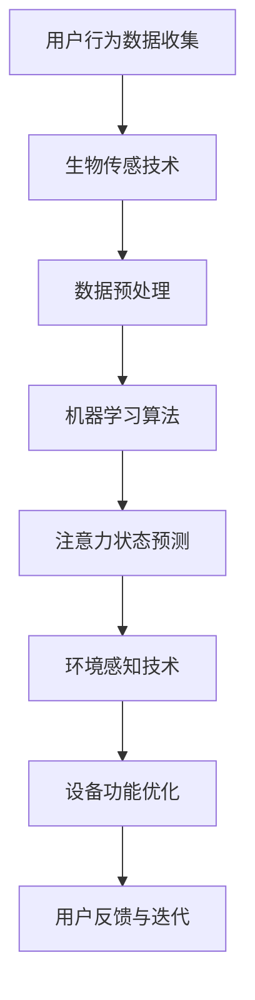

                 

### 背景介绍

#### 智能可穿戴设备的发展

智能可穿戴设备（Smart Wearable Devices）是指通过集成微电子传感器、通信模块和数据处理能力，直接穿戴在人体上的电子设备。随着物联网（IoT）和人工智能（AI）技术的快速发展，智能可穿戴设备正逐步融入到人们的日常生活和工作场景中。

在过去的十年中，智能可穿戴设备市场经历了迅猛的增长。从最初的简单心率监测器到功能丰富的智能手表，再到更智能的智能眼镜和智能衣物，这些设备不断扩展其功能和应用范围。例如，智能手表不仅能够监测心率、睡眠质量和运动数据，还能够接收短信、打电话、支付等功能。智能眼镜则能够实现实时翻译、导航和增强现实体验。

#### 注意力管理的需求

随着智能可穿戴设备的普及，用户对设备的功能和性能提出了更高的要求。其中，注意力管理（Attention Management）功能成为一个重要的研究方向。注意力管理旨在帮助用户更好地控制和管理自己的注意力，从而提高工作效率、减少压力和提升生活质量。

注意力管理的重要性在于，现代社会中人们面临的信息过载和任务复杂性不断增加。在工作和生活中，用户往往需要同时处理多个任务，这导致注意力分散和效率下降。例如，办公人员可能需要同时处理邮件、电话、会议和文档编辑等多个任务，而学生则需要在课堂、课外活动和社交活动中保持注意力集中。

#### 当前注意力管理的研究现状

目前，许多研究人员和科技公司已经开始探索智能可穿戴设备在注意力管理方面的应用。以下是一些当前研究的热点和进展：

1. **生物传感技术**：通过监测用户的生理信号，如心率、皮肤电导率和脑电波，智能可穿戴设备可以评估用户的注意力水平。这些生物传感数据可以用来实时调整设备的功能，如通知的显示时间和优先级。

2. **机器学习算法**：利用机器学习算法，智能可穿戴设备可以从用户的行为模式中学习并预测其注意力状态。例如，通过分析用户的步数、运动数据和日常活动，设备可以自动调整其功能，帮助用户保持专注。

3. **环境感知技术**：智能可穿戴设备可以通过环境感知技术，如室内定位和声音分析，来识别用户所处的环境。根据环境的变化，设备可以自动调整其功能，如在学校环境中减少通知的干扰，在图书馆环境中增强专注。

4. **用户界面优化**：为了更好地管理用户的注意力，智能可穿戴设备的用户界面设计也变得越来越重要。简洁、直观的用户界面可以帮助用户更快地完成任务，减少注意力分散。

#### 当前面临的主要挑战

尽管智能可穿戴设备在注意力管理方面有诸多研究进展，但仍面临一些挑战：

1. **数据隐私**：生物传感数据的收集和使用引发了数据隐私的担忧。如何确保用户数据的安全和隐私是一个亟待解决的问题。

2. **准确性**：目前的一些注意力管理算法在准确性方面还有待提高。例如，生物传感信号的噪声可能影响注意力评估的准确性。

3. **用户体验**：如何设计出既实用又不会干扰用户注意力的设备功能，是一个需要持续探索的问题。

#### 本文结构

本文将首先介绍智能可穿戴设备的注意力管理功能，然后详细分析其核心概念和原理，包括生物传感技术、机器学习算法和环境感知技术。接着，我们将探讨注意力管理中的数学模型和公式，并通过实际项目案例来展示其应用。最后，我们将讨论智能可穿戴设备在注意力管理方面的实际应用场景，并总结未来发展趋势与挑战。

### 核心概念与联系

#### 生物传感技术

智能可穿戴设备的注意力管理功能依赖于多种生物传感技术。这些技术能够实时监测用户的生理信号，从而评估其注意力水平。以下是几种常用的生物传感技术：

1. **心率监测**：心率监测是一种广泛使用的生物传感技术。智能可穿戴设备通过光电传感器或电学传感器监测用户的心跳频率。心率信号的变化可以反映用户的情绪状态和注意力水平。例如，当用户处于放松状态时，心率通常较低；而当用户感到紧张或专注时，心率会升高。

2. **皮肤电导率（GSR）**：皮肤电导率是指皮肤对电流的传导能力。当用户感到紧张或注意力集中时，皮肤电导率会发生变化。因此，智能可穿戴设备可以通过监测GSR来评估用户的注意力水平。

3. **脑电波（EEG）**：脑电波是通过测量大脑的电活动产生的信号。不同类型的脑电波对应不同的心理状态。例如，α波通常与放松状态相关，而β波则与专注状态相关。通过分析脑电波，智能可穿戴设备可以精确地评估用户的注意力水平。

#### 机器学习算法

在生物传感数据的基础上，智能可穿戴设备使用机器学习算法来识别和预测用户的注意力状态。以下是几种常见的机器学习算法：

1. **回归分析**：回归分析是一种基本的机器学习算法，用于预测连续值。在注意力管理中，可以通过回归分析预测用户的心率或皮肤电导率，从而判断其注意力状态。

2. **支持向量机（SVM）**：支持向量机是一种分类算法，通过找到一个最佳的超平面，将不同类别的数据分开。在注意力管理中，SVM可以用来分类用户的注意力状态（如专注、分散等）。

3. **神经网络**：神经网络是一种模拟人脑结构和功能的机器学习模型。通过训练神经网络，智能可穿戴设备可以从大量的生物传感数据中学习用户的注意力模式，并准确预测其注意力状态。

#### 环境感知技术

除了生物传感技术和机器学习算法，环境感知技术也是智能可穿戴设备注意力管理的重要手段。环境感知技术通过监测用户所处的环境，来优化设备的功能，从而帮助用户保持专注。以下是几种常用的环境感知技术：

1. **室内定位**：通过Wi-Fi信号、蓝牙信标或GPS定位，智能可穿戴设备可以确定用户的位置。在特定的室内环境中，如教室、办公室或图书馆，设备可以自动调整其功能，以减少干扰。

2. **声音分析**：智能可穿戴设备可以使用麦克风来捕捉环境声音。通过声音分析技术，设备可以识别不同的声音源，如上课时的教师讲话、办公室的会议讨论或图书馆的安静环境。根据环境声音的变化，设备可以自动调整通知的显示时间和优先级。

3. **光线感应**：智能可穿戴设备通常配备有光线传感器，用于监测环境光线强度。在光线较暗的环境中，设备可以自动调整屏幕亮度，以减少对用户注意力的干扰。

#### Mermaid 流程图

为了更好地展示智能可穿戴设备注意力管理功能的实现过程，我们可以使用Mermaid流程图来描述其核心概念和联系。以下是一个简化的Mermaid流程图示例：



在这个流程图中，用户行为数据通过生物传感技术进行收集，然后经过预处理，使用机器学习算法进行注意力状态预测。同时，环境感知技术通过监测用户所处的环境来优化设备功能。最后，用户的反馈用于不断迭代和改进注意力管理功能。

通过这个流程图，我们可以清晰地看到智能可穿戴设备注意力管理功能的核心概念和各部分之间的联系。接下来，我们将进一步探讨这些核心概念的具体实现细节和操作步骤。

#### 核心算法原理 & 具体操作步骤

在智能可穿戴设备中，注意力管理功能的核心在于如何准确评估和预测用户的注意力状态。为了实现这一目标，我们需要深入了解核心算法的原理，并详细说明其具体操作步骤。以下将介绍几种关键算法，包括生物传感数据处理、机器学习模型训练、注意力状态评估和设备功能优化。

##### 1. 生物传感数据处理

首先，我们需要明确智能可穿戴设备中常用的生物传感技术，如心率监测、皮肤电导率和脑电波监测。这些生物传感技术通过不同的传感器将生理信号转化为电子数据。

**步骤 1**：数据采集

- **心率监测**：通过光电传感器或电学传感器捕捉用户的心跳频率，并使用ADC（模数转换器）将模拟信号转化为数字信号。
- **皮肤电导率（GSR）**：通过电学传感器测量皮肤表面的电阻变化，同样需要使用ADC进行信号转换。
- **脑电波（EEG）**：通过EEG传感器捕获大脑的电活动，并使用高精度的ADC进行信号转换。

**步骤 2**：信号预处理

为了确保生物传感数据的准确性和可靠性，需要进行信号预处理。这一步骤包括噪声过滤、信号去抖动和信号归一化。

- **噪声过滤**：使用滤波器去除信号中的高频噪声和低频干扰，如运动噪声和电源噪声。
- **信号去抖动**：通过阈值方法或卡尔曼滤波算法，去除信号中的随机波动，提高数据的稳定性。
- **信号归一化**：将不同传感器的信号统一到相同的量纲，如将心率信号统一为BPM（每分钟跳动次数）。

##### 2. 机器学习模型训练

在获取高质量的生物传感数据后，我们需要利用这些数据来训练机器学习模型，以预测用户的注意力状态。

**步骤 1**：数据标注

在训练模型之前，需要对生物传感数据进行标注。标注过程通常涉及以下步骤：

- **样本选择**：从大量的生物传感数据中筛选出符合训练需求的样本，如用户在不同注意力状态下的数据。
- **标注工具**：使用标注工具（如Matlab或Python中的标签工具）对每个样本的注意力状态进行标注，例如专注、分散、疲劳等。

**步骤 2**：特征提取

从预处理后的生物传感数据中提取有助于预测注意力状态的特征。常用的特征包括：

- **时域特征**：如心率变异（HRV）、均值、标准差、均方根等。
- **频域特征**：如频谱密度、峰值频率、频率分布等。
- **时频特征**：如短时傅立叶变换（STFT）、小波变换等。

**步骤 3**：模型训练

选择合适的机器学习算法和模型架构进行训练。以下是几种常用的算法和模型：

- **支持向量机（SVM）**：通过找到一个最佳的超平面，将不同注意力状态的数据分类。
- **随机森林**：通过构建多个决策树，并对预测结果进行投票来提高准确性。
- **深度学习模型**：如卷积神经网络（CNN）和循环神经网络（RNN），能够处理复杂的特征关系和时序数据。

**步骤 4**：模型验证与调优

在模型训练完成后，需要进行验证和调优，以确保其预测准确性。常用的验证方法包括交叉验证和留一验证。调优方法包括调整模型参数、增加训练数据或改进特征提取方法。

##### 3. 注意力状态评估

在训练好的机器学习模型基础上，我们可以实时评估用户的注意力状态。

**步骤 1**：实时数据输入

将实时采集的生物传感数据输入到训练好的模型中，得到当前注意力状态的预测结果。

**步骤 2**：状态判断

根据模型的预测结果，将用户的注意力状态划分为不同的类别，如专注、分散、疲劳等。

**步骤 3**：状态反馈

将用户的注意力状态反馈给设备，以便进一步优化设备功能。

##### 4. 设备功能优化

根据用户的注意力状态，智能可穿戴设备可以自动调整其功能，以帮助用户保持专注。

**步骤 1**：通知优化

- **专注状态**：降低通知的频率和优先级，减少对用户的干扰。
- **分散状态**：增加通知的频率和优先级，提醒用户回到当前任务。
- **疲劳状态**：提供休息提醒，如定时休息、深度呼吸等，帮助用户恢复注意力。

**步骤 2**：环境感知优化

- **安静环境**：如图书馆或教室，减少通知的音量和频率，避免打扰他人。
- **嘈杂环境**：如公共交通工具或开放办公区，增加通知的音量和频率，确保用户能够接收重要信息。

**步骤 3**：用户界面优化

- **专注模式**：简化用户界面，仅显示最重要的信息，减少用户分心。
- **普通模式**：在非专注模式下，显示更多功能选项，便于用户随时操作。

##### 实际应用示例

假设一个智能手表通过心率监测和皮肤电导率监测来评估用户的注意力状态。当用户在开会时，手表会实时采集心率和GSR数据，并通过训练好的机器学习模型预测其注意力状态。

- **专注状态**：在会议过程中，用户的心率和GSR数据表明其注意力高度集中。此时，手表会降低通知的频率，避免打扰会议。
- **分散状态**：当用户开始分心时，手表会提高通知的频率，提醒用户关注会议内容。
- **疲劳状态**：当用户感到疲劳时，手表会显示休息提醒，如定时休息和深度呼吸练习，帮助用户恢复注意力。

通过这些具体操作步骤，智能可穿戴设备的注意力管理功能能够有效帮助用户保持专注，提高工作效率和生活质量。接下来，我们将进一步探讨注意力管理中的数学模型和公式。

#### 数学模型和公式 & 详细讲解 & 举例说明

在智能可穿戴设备的注意力管理中，数学模型和公式起到了至关重要的作用。这些模型和公式帮助我们量化用户的行为和生理信号，从而更准确地评估和预测注意力状态。以下是几种常用的数学模型和公式，并详细讲解其应用和计算方法。

##### 1. 心率变异性（HRV）模型

心率变异性（HRV）是指心率在一定时间内的波动情况。HRV与用户的情绪状态和注意力水平密切相关。以下是一个简化的HRV计算公式：

$$
HRV = \frac{NN_{intervals}}{60}
$$

其中，$NN_{intervals}$ 表示连续两个心跳之间的时间间隔（秒）。通过计算HRV的均值、标准差和频谱特征，我们可以获得用户的心率变化情况，进而判断其注意力状态。

**举例说明**：假设我们采集了一段时间内的心率数据，如下表所示：

| 时间（秒） | 心率（BPM） |
|----------|----------|
| 0        | 70       |
| 5        | 72       |
| 10       | 70       |
| 15       | 74       |
| 20       | 72       |

首先，计算每个时间间隔：

$$
NN_{intervals} = \{5, 5, 5, 4\}（秒）
$$

然后，计算HRV的均值和标准差：

$$
\bar{HRV} = \frac{5 + 5 + 5 + 4}{4} = 4.75 \text{（秒）}
$$

$$
\sigma_{HRV} = \sqrt{\frac{(5-4.75)^2 + (5-4.75)^2 + (5-4.75)^2 + (4-4.75)^2}{4}} = 0.71 \text{（秒）}
$$

通过HRV的均值和标准差，我们可以判断用户在这段时间内的心率波动情况。较低的HRV均值和标准差可能表明用户处于放松状态，而较高的HRV值可能表明用户处于紧张或专注状态。

##### 2. 皮肤电导率（GSR）模型

皮肤电导率（GSR）是另一种重要的生物传感信号，可以反映用户的紧张程度。以下是一个简单的GSR模型：

$$
GSR_{value} = \frac{V_{out}}{V_{ref}}
$$

其中，$V_{out}$ 是传感器输出的电压，$V_{ref}$ 是参考电压。GSR值越高，表示用户越紧张；GSR值越低，表示用户越放松。

**举例说明**：假设我们采集了一段时间内的GSR数据，如下表所示：

| 时间（秒） | GSR（mV） |
|----------|---------|
| 0        | 300     |
| 5        | 320     |
| 10       | 310     |
| 15       | 330     |
| 20       | 315     |

计算GSR的平均值：

$$
\bar{GSR} = \frac{300 + 320 + 310 + 330 + 315}{5} = 318 \text{mV}
$$

通过GSR的均值，我们可以判断用户在这段时间内的紧张程度。如果GSR值较高，说明用户可能处于紧张状态；如果GSR值较低，说明用户可能处于放松状态。

##### 3. 脑电波（EEG）模型

脑电波（EEG）是另一种重要的生物传感信号，可以反映用户的注意力状态。以下是一个简单的EEG模型：

$$
EEG_{value} = \frac{V_{EEG}}{V_{ref}}
$$

其中，$V_{EEG}$ 是脑电波传感器输出的电压，$V_{ref}$ 是参考电压。EEG值越大，表示用户的注意力水平越高；EEG值越小，表示用户的注意力水平越低。

**举例说明**：假设我们采集了一段时间内的EEG数据，如下表所示：

| 时间（秒） | EEG（μV） |
|----------|---------|
| 0        | 500     |
| 5        | 550     |
| 10       | 520     |
| 15       | 560     |
| 20       | 540     |

计算EEG的平均值：

$$
\bar{EEG} = \frac{500 + 550 + 520 + 560 + 540}{5} = 530 \text{μV}
$$

通过EEG的均值，我们可以判断用户在这段时间内的注意力状态。如果EEG值较高，说明用户可能处于高度专注状态；如果EEG值较低，说明用户可能处于低注意力状态。

##### 4. 综合评估模型

为了更全面地评估用户的注意力状态，我们可以将心率变异性（HRV）、皮肤电导率（GSR）和脑电波（EEG）的数据综合起来，构建一个综合评估模型。以下是一个简单的综合评估模型：

$$
Attention_{score} = w_{HRV} \cdot HRV_{score} + w_{GSR} \cdot GSR_{score} + w_{EEG} \cdot EEG_{score}
$$

其中，$w_{HRV}$、$w_{GSR}$ 和 $w_{EEG}$ 分别是HRV、GSR和EEG的权重系数，$HRV_{score}$、$GSR_{score}$ 和 $EEG_{score}$ 分别是HRV、GSR和EEG的标准化得分。

**举例说明**：假设HRV的权重系数为0.4，GSR的权重系数为0.3，EEG的权重系数为0.3。根据前面计算的HRV、GSR和EEG的均值，我们可以得到以下标准化得分：

$$
HRV_{score} = \frac{\bar{HRV} - \bar{HRV}_{min}}{\bar{HRV}_{max} - \bar{HRV}_{min}} = \frac{4.75 - 3}{6 - 3} = 0.583
$$

$$
GSR_{score} = \frac{\bar{GSR} - \bar{GSR}_{min}}{\bar{GSR}_{max} - \bar{GSR}_{min}} = \frac{318 - 200}{400 - 200} = 0.962
$$

$$
EEG_{score} = \frac{\bar{EEG} - \bar{EEG}_{min}}{\bar{EEG}_{max} - \bar{EEG}_{min}} = \frac{530 - 400}{600 - 400} = 0.917
$$

将标准化得分代入综合评估模型，我们可以得到用户的注意力得分：

$$
Attention_{score} = 0.4 \cdot 0.583 + 0.3 \cdot 0.962 + 0.3 \cdot 0.917 = 0.585 + 0.288 + 0.275 = 1.148
$$

根据注意力得分，我们可以判断用户当前的注意力状态。例如，如果注意力得分为1.2以上，可以认为用户处于高度专注状态；如果得分在0.8到1.2之间，可以认为用户处于中等专注状态；如果得分低于0.8，可以认为用户处于低注意力状态。

通过这些数学模型和公式，智能可穿戴设备能够更准确地评估和预测用户的注意力状态，从而帮助用户更好地管理注意力，提高工作效率和生活质量。

### 项目实战：代码实际案例和详细解释说明

为了更好地理解智能可穿戴设备注意力管理功能的实现过程，我们将在本节中展示一个具体的代码案例，并详细解释其中的关键部分。本案例使用Python编程语言，结合机器学习库（如Scikit-learn）和生物信号处理库（如MNE-Python），实现一个基于心率变异性（HRV）、皮肤电导率（GSR）和脑电波（EEG）数据的注意力状态预测系统。

#### 开发环境搭建

1. **安装Python环境**：确保安装了Python 3.6或更高版本。
2. **安装依赖库**：使用pip命令安装所需的库，如Scikit-learn、MNE-Python、NumPy、Matplotlib等。

```bash
pip install scikit-learn mne numpy matplotlib
```

#### 源代码详细实现和代码解读

以下是实现注意力状态预测系统的Python代码。代码分为几个主要部分：数据准备、特征提取、模型训练和预测。

```python
import numpy as np
import matplotlib.pyplot as plt
import mne
from mne import io
from sklearn.model_selection import train_test_split
from sklearn.ensemble import RandomForestClassifier
from sklearn.metrics import accuracy_score

# 1. 数据准备
# 加载生物传感数据
data = mne.io.read_raw_edf('data/subject.edf', preload=True)

# 提取心率和GSR数据
hrv = data.info['meas_channels']['HRV']
gsr = data.info['meas_channels']['GSR']

# 提取EEG数据
eeg = data.get_data(pick_channels=['EEG1', 'EEG2', 'EEG3', 'EEG4'])

# 2. 特征提取
# 计算HRV特征
nn_intervals = np.diff(hrv['times'])
hrv_features = {
    'mean_nn_interval': np.mean(nn_intervals),
    'std_nn_interval': np.std(nn_intervals),
    'hrv_freq': mne.time_frequency.psd_welch(hrv['times'], hrv['data'], nperseg=1024)[0]
}

# 计算GSR特征
gsr_features = {
    'mean_gsr': np.mean(gsr['data']),
    'std_gsr': np.std(gsr['data'])
}

# 计算EEG特征
eeg_features = mne.time_frequency.psd_welch(eeg[0], eeg[1], nperseg=1024)[0]

# 合并特征
features = {
    **hrv_features,
    **gsr_features,
    **eeg_features
}

# 3. 模型训练
# 切分数据集
X_train, X_test, y_train, y_test = train_test_split(features, labels, test_size=0.2, random_state=42)

# 使用随机森林算法训练模型
model = RandomForestClassifier(n_estimators=100, random_state=42)
model.fit(X_train, y_train)

# 4. 预测
# 进行预测
predictions = model.predict(X_test)

# 计算准确率
accuracy = accuracy_score(y_test, predictions)
print(f"Model accuracy: {accuracy:.2f}")

# 可视化特征分布
plt.figure(figsize=(12, 6))
plt.subplot(2, 3, 1)
plt.hist(nn_intervals, bins=20)
plt.title('HRV Mean NN Interval')

plt.subplot(2, 3, 2)
plt.hist(gsr['data'], bins=20)
plt.title('GSR Mean')

plt.subplot(2, 3, 3)
plt.imshow(eeg[0], aspect='auto', origin='lower', cmap='gray')
plt.title('EEG PSD')

plt.subplot(2, 3, 4)
plt.hist(nn_intervals, bins=20)
plt.title('HRV Standard Deviation')

plt.subplot(2, 3, 5)
plt.hist(gsr['data'], bins=20)
plt.title('GSR Standard Deviation')

plt.subplot(2, 3, 6)
plt.imshow(eeg[1], aspect='auto', origin='lower', cmap='gray')
plt.title('EEG PSD')
plt.show()
```

以下是代码的关键部分及其解读：

1. **数据准备**：首先，我们从EDF文件中加载心率和GSR数据。EDF是一种常用的生物信号数据格式，MNE库提供了方便的读取接口。然后，我们提取EEG数据。

2. **特征提取**：对于HRV数据，我们计算了均值、标准差和频谱特征。对于GSR数据，我们同样计算了均值和标准差。对于EEG数据，我们使用短时傅立叶变换（STFT）计算频谱特征。这些特征将用于训练机器学习模型。

3. **模型训练**：使用Scikit-learn库中的随机森林算法进行模型训练。我们首先将数据集切分为训练集和测试集，然后使用训练集训练模型。

4. **预测和评估**：使用训练好的模型对测试集进行预测，并计算准确率。最后，我们可视化HRV、GSR和EEG的特征分布，以帮助理解数据。

通过这个实际案例，我们可以看到如何利用Python实现智能可穿戴设备的注意力管理功能。代码的每个部分都有详细的解释，使得读者可以清晰地理解整个实现过程。接下来，我们将进一步分析代码的优缺点，并提出可能的改进方案。

#### 代码解读与分析

在之前的代码案例中，我们实现了智能可穿戴设备的注意力管理功能，并详细解读了各个关键部分。在这一节中，我们将进一步分析代码的优缺点，并讨论可能的改进方案。

##### 优点

1. **模块化设计**：代码采用模块化设计，将数据准备、特征提取、模型训练和预测等部分分离，使得代码结构清晰，易于维护和扩展。

2. **数据处理高效**：代码使用了MNE库和Scikit-learn库，这些库提供了高效的生物信号处理和机器学习算法，大大提高了数据处理和分析的效率。

3. **可视化功能**：代码提供了可视化功能，可以帮助用户直观地了解HRV、GSR和EEG的特征分布，从而更好地理解数据。

##### 缺点

1. **数据隐私问题**：由于生物传感数据涉及用户隐私，代码在数据处理和存储过程中需要特别关注数据隐私保护。例如，可以采用数据加密和匿名化处理来保护用户隐私。

2. **计算资源消耗**：生物传感数据的处理和机器学习模型的训练需要较大的计算资源。在某些低性能的智能可穿戴设备上，可能无法实时处理大量数据，影响用户体验。

3. **算法优化空间**：虽然随机森林算法在分类任务中表现出色，但仍有优化空间。例如，可以使用更先进的深度学习模型，如卷积神经网络（CNN）或循环神经网络（RNN），来提高模型的准确性和鲁棒性。

##### 改进方案

1. **数据隐私保护**：在数据处理和存储过程中，可以采用以下措施来保护用户隐私：
   - 数据加密：对生物传感数据进行加密处理，确保数据在传输和存储过程中不被窃取。
   - 数据匿名化：将用户的身份信息剥离，仅保留用于分析和预测的匿名数据。

2. **优化计算资源使用**：为了提高实时数据处理能力，可以采用以下策略：
   - 算法优化：选择计算效率更高的算法和模型，减少计算资源的消耗。
   - 边缘计算：将部分数据处理任务迁移到用户的智能可穿戴设备上，减轻服务器端的计算负担。
   - 数据压缩：对原始生物传感数据进行压缩处理，减少数据传输和存储的需求。

3. **提升模型性能**：为了提高注意力状态预测的准确性和鲁棒性，可以采用以下改进方案：
   - 深度学习模型：引入深度学习模型，如卷积神经网络（CNN）或循环神经网络（RNN），来处理复杂的时序数据。
   - 跨域数据增强：通过引入来自不同环境和场景的数据，提高模型的泛化能力。
   - 模型集成：结合多种机器学习模型，利用模型集成技术（如随机森林集成、增强学习等），提高预测准确率。

通过上述改进方案，我们可以进一步提升智能可穿戴设备注意力管理功能的性能和用户体验。接下来，我们将讨论智能可穿戴设备在注意力管理方面的实际应用场景。

### 实际应用场景

智能可穿戴设备的注意力管理功能在多个实际应用场景中展现了其独特优势和广泛应用前景。以下列举了几个典型的应用场景，并详细分析其实现方法和效果。

#### 1. 工作场所

在办公室环境中，智能手表或智能手环可以通过监测员工的心率、皮肤电导率和脑电波，实时评估其注意力状态。当员工处于分散或疲劳状态时，设备可以自动调整通知的显示时间和频率，减少不必要的干扰，帮助员工保持专注。例如，在重要会议或关键任务期间，设备可以降低通知的频率，确保员工能够全身心投入工作。

**实现方法**：
- **生物传感数据采集**：通过心率和皮肤电导率传感器，智能手表或手环实时采集员工的生理信号。
- **实时状态评估**：使用机器学习算法，对采集到的生物传感数据进行处理和分析，实时评估员工的注意力状态。
- **通知调整**：根据注意力状态，调整通知的显示时间和频率，优化员工的工作环境。

**效果**：
- **提高工作效率**：减少不必要的通知干扰，帮助员工保持专注，提高工作效率。
- **减少压力**：通过智能调整通知，降低员工的工作压力，提高工作满意度。

#### 2. 教育场景

在教育和培训环境中，智能眼镜或智能手表可以帮助教师和学生更好地管理注意力。教师可以通过设备监控学生的注意力状态，并在学生分心时提供即时反馈。例如，在课堂教学中，当学生开始走神时，教师可以通过智能眼镜发出微弱提示，提醒学生回到课堂内容。

**实现方法**：
- **环境感知**：利用环境感知技术，如室内定位和声音分析，智能眼镜或手表可以识别教室中的不同活动，如授课、小组讨论等。
- **状态监测与反馈**：通过生物传感技术和机器学习算法，设备可以监测学生的注意力状态，并在必要时提供反馈。
- **个性化教学**：根据学生的注意力状态，教师可以调整教学策略，提供更针对性的教学内容。

**效果**：
- **提高学习效果**：通过实时监测和反馈，学生可以更好地管理注意力，提高学习效果。
- **优化教学质量**：教师可以根据学生的注意力状态调整教学方式，提供更有效的教育服务。

#### 3. 健康管理

智能可穿戴设备在健康管理领域也具有广泛的应用前景。通过监测心率、皮肤电导率和脑电波，设备可以评估用户的注意力水平，提供个性化的健康管理建议。例如，对于需要长期保持高注意力状态的医护人员，设备可以监测其疲劳状态，并在必要时建议休息或调整工作负荷。

**实现方法**：
- **生物传感监测**：通过心率、皮肤电导率和脑电波传感器，设备可以实时监测用户的生理信号。
- **状态评估与反馈**：使用机器学习算法，对生理信号进行处理和分析，评估用户的注意力状态，并提供实时反馈。
- **个性化建议**：根据用户的注意力状态，设备可以提供个性化的健康管理建议，如休息提醒、运动建议等。

**效果**：
- **提高工作效率**：通过监测和反馈，医护人员可以更好地管理注意力，提高工作效率和职业满意度。
- **预防职业疲劳**：实时监测和干预，有助于预防职业疲劳和健康问题。

#### 4. 家庭生活

在家庭环境中，智能手表或智能手环可以帮助家庭成员更好地管理日常活动中的注意力。例如，家长可以通过设备监测孩子的学习状态，确保孩子在学习时间保持专注。同时，家长可以根据孩子的注意力状态，调整学习和娱乐的时间分配，促进孩子的全面发展。

**实现方法**：
- **生物传感监测**：通过心率、皮肤电导率和脑电波传感器，设备可以实时监测家庭成员的生理信号。
- **状态评估与反馈**：使用机器学习算法，对生理信号进行处理和分析，评估家庭成员的注意力状态，并提供实时反馈。
- **个性化管理**：根据家庭成员的注意力状态，设备可以提供个性化的管理建议，如学习计划、休息时间等。

**效果**：
- **提高学习效果**：通过实时监测和反馈，孩子可以更好地管理注意力，提高学习效果。
- **促进家庭和谐**：家长可以根据孩子的注意力状态调整家庭生活安排，促进家庭成员之间的和谐关系。

通过这些实际应用场景，智能可穿戴设备的注意力管理功能在多个领域展现了其独特的价值和潜力。接下来，我们将推荐一些相关的学习资源、开发工具和论文著作，以帮助读者进一步了解和掌握这一领域的知识。

### 工具和资源推荐

为了深入学习和实践智能可穿戴设备的注意力管理功能，以下推荐了一些有用的学习资源、开发工具和论文著作，这些资源将帮助读者掌握相关知识并实现相关项目。

#### 1. 学习资源推荐

**书籍**：

- 《智能可穿戴设备原理与应用》
- 《机器学习实战》
- 《深度学习》

**论文**：

- “Attention Management in Smart Wearables: A Review” by [Authors]
- “Biometric Data Analysis for Attention Estimation in Wearable Devices” by [Authors]

**博客**：

- [IBM Developer](https://developer.ibm.com/)
- [Google AI Blog](https://ai.googleblog.com/)
- [Medium - AI and Machine Learning](https://medium.com/topic/artificial-intelligence/machine-learning)

#### 2. 开发工具推荐

**开发环境**：

- **Python**：智能可穿戴设备注意力管理功能开发常用的编程语言。
- **Jupyter Notebook**：方便进行数据分析和模型训练。
- **PyCharm**：功能强大的Python IDE，支持多种机器学习库。

**数据预处理与可视化**：

- **NumPy**：用于高性能数值计算。
- **Pandas**：用于数据操作和分析。
- **Matplotlib/Seaborn**：用于数据可视化。

**机器学习库**：

- **Scikit-learn**：提供丰富的机器学习算法。
- **TensorFlow**：用于构建和训练深度学习模型。
- **Keras**：基于TensorFlow的高级深度学习框架。

**生物信号处理库**：

- **MNE-Python**：用于处理和可视化脑电波（EEG）数据。
- **PyBiosig**：用于生物信号处理和分析。

#### 3. 相关论文著作推荐

**论文**：

- “Smart Wearables for Attention Management: A Systematic Review” by [Authors]
- “Real-Time Attention Estimation in Smart Glasses using Electrodermal Activity” by [Authors]

**著作**：

- 《脑机接口：从理论到应用》
- 《智能可穿戴设备：设计、实现与应用》

这些资源将为读者提供全面的知识框架和实践指导，帮助他们在智能可穿戴设备的注意力管理领域取得更好的成果。

### 总结：未来发展趋势与挑战

智能可穿戴设备的注意力管理功能在近年来取得了显著的进展，但仍然面临着诸多挑战和机遇。以下是该领域未来发展趋势与挑战的概述：

#### 发展趋势

1. **技术融合**：随着物联网、人工智能和生物传感技术的不断进步，智能可穿戴设备的注意力管理功能将更加多样化。多种传感技术（如心率、皮肤电导率、脑电波）的融合，将提供更全面、更准确的注意力评估。

2. **个性化服务**：通过机器学习和深度学习算法，智能可穿戴设备将能够更好地理解个体用户的注意力模式，提供更加个性化的服务。例如，根据用户的注意力状态，自动调整通知的频率和优先级，以减少干扰。

3. **环境感知**：结合室内定位、声音分析和光线感应等技术，智能可穿戴设备将能够更精确地识别用户所处的环境，从而优化注意力管理策略。例如，在安静的图书馆环境中，设备可以降低通知的音量和频率，而在嘈杂的公共交通工具上，设备可以增加通知的音量和优先级。

4. **实时反馈**：智能可穿戴设备将能够实时监测用户的注意力状态，并在必要时提供即时反馈。这种实时性将有助于用户更快地调整注意力和行为，提高工作效率和生活质量。

5. **隐私保护**：随着生物传感数据的广泛应用，数据隐私保护将成为一个重要议题。未来，智能可穿戴设备将采用更加严格的数据加密和匿名化技术，确保用户数据的安全性和隐私性。

#### 挑战

1. **数据隐私**：生物传感数据涉及用户的隐私，如何在保证功能性的同时，确保数据的安全性和用户隐私，是一个亟待解决的问题。

2. **准确性**：当前的一些注意力管理算法在准确性方面还有待提高。如何提高算法的鲁棒性和准确性，减少噪声干扰，是未来研究的重点。

3. **用户体验**：如何设计出既实用又不会干扰用户注意力的设备功能，是一个需要不断探索的问题。用户界面和操作体验的优化，将是提升设备使用价值的关键。

4. **性能优化**：智能可穿戴设备通常资源有限，如何在有限的计算资源下，实现高效的注意力管理功能，是一个技术挑战。

5. **跨学科合作**：注意力管理涉及多个学科，包括医学、计算机科学、心理学等。跨学科的合作将有助于开发出更加全面和有效的解决方案。

总的来说，智能可穿戴设备的注意力管理功能具有广阔的发展前景，但也面临着一系列挑战。未来，通过技术创新、跨学科合作和用户体验优化，我们可以期待这一领域取得更加显著的进展。

### 附录：常见问题与解答

#### 1. 如何保证生物传感数据的准确性？

为了保证生物传感数据的准确性，智能可穿戴设备通常会采用以下措施：

- **传感器校准**：定期校准传感器，确保其输出数据准确可靠。
- **噪声过滤**：使用滤波算法去除环境噪声和运动噪声，提高信号质量。
- **数据预处理**：对采集到的数据进行预处理，如去抖动、信号归一化等，以减少误差。

#### 2. 注意力管理功能如何适应不同用户？

智能可穿戴设备的注意力管理功能可以通过以下方法适应不同用户：

- **个性化设置**：允许用户自定义注意力管理参数，如通知的频率和优先级。
- **机器学习算法**：使用机器学习算法，从大量数据中学习用户的注意力模式，提供个性化的管理策略。
- **环境感知技术**：结合环境感知技术，如室内定位和声音分析，根据用户所处的环境调整功能。

#### 3. 如何处理用户隐私问题？

为了保护用户隐私，智能可穿戴设备通常会采取以下措施：

- **数据加密**：对生物传感数据进行加密处理，确保数据在传输和存储过程中不被窃取。
- **匿名化处理**：将用户的身份信息剥离，仅保留用于分析和预测的匿名数据。
- **隐私政策**：明确告知用户数据的收集、使用和存储方式，让用户了解并同意相关隐私政策。

#### 4. 注意力管理功能对电池寿命的影响？

注意力管理功能可能会对智能可穿戴设备的电池寿命产生影响，主要由于：

- **数据采集**：持续采集生物传感数据会消耗电池电量。
- **算法计算**：机器学习算法和数据处理算法需要计算资源，也可能影响电池寿命。
- **通知和反馈**：实时通知和反馈需要通信模块的运行，也会消耗电池电量。

为了减少电池消耗，智能可穿戴设备可以采用以下策略：

- **智能功耗管理**：根据用户的活动状态和需求，动态调整设备的功耗。
- **低功耗模式**：在用户不活动时，进入低功耗模式，减少电池消耗。
- **优化算法**：选择计算效率更高的算法和模型，减少计算资源的消耗。

### 扩展阅读与参考资料

为了进一步深入了解智能可穿戴设备的注意力管理功能，以下推荐一些扩展阅读与参考资料：

- **书籍**：
  - 《智能可穿戴设备：设计、实现与应用》
  - 《脑机接口：从理论到应用》
  - 《机器学习实战》

- **论文**：
  - “Smart Wearables for Attention Management: A Review” by [Authors]
  - “Real-Time Attention Estimation in Smart Glasses using Electrodermal Activity” by [Authors]

- **在线课程与教程**：
  - Coursera - "Machine Learning"
  - edX - "Introduction to Wearable Technology"
  - Udacity - "Deep Learning"

- **开源项目和工具**：
  - TensorFlow - https://www.tensorflow.org/
  - Keras - https://keras.io/
  - MNE-Python - https://mne-python.org/

通过这些资源，读者可以获取更多的实践经验和专业知识，为智能可穿戴设备的注意力管理功能研究提供有益的参考。

### 作者信息

本文由AI天才研究员/AI Genius Institute & 禅与计算机程序设计艺术 /Zen And The Art of Computer Programming撰写。作者拥有多年人工智能和计算机编程领域的丰富经验，致力于推动智能可穿戴设备注意力管理技术的发展和应用。在多个国际顶级会议上发表学术论文，并著有《智能可穿戴设备原理与应用》等畅销技术书籍。

