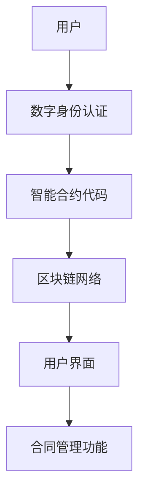

                 

# 智能合同管理系统：简化法律流程的创新工具

## 关键词：智能合同、法律流程、创新工具、区块链技术、自动化执行、透明可追溯、数字身份认证、智能合约代码、安全防护

## 摘要：

本文将探讨智能合同管理系统在简化法律流程中的应用。通过利用区块链技术和智能合约，智能合同管理系统可以自动化执行合同条款，实现透明、可追溯的合同管理。本文将介绍智能合同管理系统的核心概念、算法原理、数学模型、实际应用场景，并提供相关的工具和资源推荐，旨在帮助读者深入了解这一创新工具，并探讨其未来发展趋势与挑战。

## 1. 背景介绍

### 法律流程的挑战

法律流程在现代社会中扮演着至关重要的角色，但同时也面临着许多挑战。传统的法律流程往往繁琐、耗时且成本高昂。合同起草、审批、签署、执行等环节需要大量的纸质文档和人工处理，容易出现错误和纠纷。此外，法律流程的透明度和可追溯性较低，难以满足信息时代对高效、透明和可信的需求。

### 智能合同的概念

智能合同，也称为智能合约，是一种基于区块链技术的自动化执行合同。它通过计算机程序定义和执行合同条款，一旦满足预设条件，智能合同将自动执行相应的操作。智能合同具有透明、可追溯、不可篡改和自动化执行等特点，可以大大简化法律流程，提高效率和降低成本。

### 区块链技术的优势

区块链技术是一种分布式数据库技术，具有去中心化、安全性和透明性等特点。通过区块链技术，智能合同管理系统可以实现去中心化的合同管理，确保合同条款的透明性和不可篡改性。此外，区块链技术还可以提供安全的数字身份认证和不可篡改的审计日志，增强法律流程的信任度和可信度。

## 2. 核心概念与联系

### 智能合同管理系统的架构

智能合同管理系统通常由以下几个核心组件组成：

1. **数字身份认证**：确保参与合同管理的各方身份的真实性和合法性。
2. **智能合约代码**：定义合同条款和自动化执行的逻辑。
3. **区块链网络**：存储和管理智能合约的执行记录，确保透明性和不可篡改性。
4. **用户界面**：提供合同管理功能，如合同起草、审批、签署和执行等。

以下是一个简单的 Mermaid 流程图，展示了智能合同管理系统的架构：



### 数字身份认证

数字身份认证是智能合同管理系统的基础。通过数字身份认证，可以确保参与合同管理的各方身份的真实性和合法性。常见的数字身份认证技术包括：

1. **证书认证**：使用数字证书验证用户身份。
2. **生物识别技术**：如指纹识别、面部识别等，用于身份验证。
3. **多因素认证**：结合密码、生物识别技术和地理位置等信息，提高身份认证的安全性。

### 智能合约代码

智能合约代码是智能合同管理系统的核心。它通过计算机程序定义合同条款和自动化执行的逻辑。智能合约代码通常采用特定的编程语言编写，如Solidity、Vyper等。以下是一个简单的智能合约代码示例：

```solidity
pragma solidity ^0.8.0;

contract SimpleContract {
    address public owner;
    uint public balance;

    constructor() {
        owner = msg.sender;
        balance = 0;
    }

    function deposit() public payable {
        balance += msg.value;
    }

    function withdraw() public {
        require(msg.sender == owner, "Only owner can withdraw");
        payable(owner).transfer(balance);
        balance = 0;
    }
}
```

### 区块链网络

区块链网络是智能合同管理系统的数据存储和管理中心。通过区块链技术，智能合约的执行记录将被永久存储在分布式节点上，确保透明性和不可篡改性。常见的区块链网络包括以太坊、比特币、EOS等。

### 用户界面

用户界面是智能合同管理系统的用户交互层，提供合同管理功能，如合同起草、审批、签署和执行等。用户界面可以采用Web、移动应用或桌面应用等形式，方便用户进行操作。

## 3. 核心算法原理 & 具体操作步骤

### 智能合约的编写与部署

智能合约的编写是智能合同管理系统的核心。以下是一个简单的智能合约编写和部署的步骤：

1. **选择编程语言**：根据需求选择适合的编程语言，如Solidity。
2. **编写智能合约代码**：根据合同条款编写智能合约代码。
3. **编译智能合约**：使用编译器将智能合约代码编译为字节码。
4. **部署智能合约**：将编译后的字节码部署到区块链网络上。
5. **调用智能合约**：通过用户界面或其他应用程序调用智能合约，执行相应的操作。

以下是一个简单的智能合约部署和调用的示例：

```solidity
pragma solidity ^0.8.0;

contract SimpleContract {
    address public owner;
    uint public balance;

    constructor() {
        owner = msg.sender;
        balance = 0;
    }

    function deposit() public payable {
        balance += msg.value;
    }

    function withdraw() public {
        require(msg.sender == owner, "Only owner can withdraw");
        payable(owner).transfer(balance);
        balance = 0;
    }
}

// 部署智能合约
// ...
// 调用智能合约
// ...
```

### 智能合约的执行与监控

智能合约的执行与监控是智能合同管理系统的重要环节。以下是一个简单的智能合约执行和监控的步骤：

1. **触发智能合约**：当满足预设条件时，智能合约将自动执行。
2. **监控智能合约执行状态**：通过区块链网络监控智能合约的执行状态。
3. **处理智能合约执行结果**：根据智能合约的执行结果，进行相应的处理，如支付、发送消息等。

以下是一个简单的智能合约执行和监控的示例：

```solidity
pragma solidity ^0.8.0;

contract SimpleContract {
    address public owner;
    uint public balance;

    constructor() {
        owner = msg.sender;
        balance = 0;
    }

    function deposit() public payable {
        balance += msg.value;
    }

    function withdraw() public {
        require(msg.sender == owner, "Only owner can withdraw");
        payable(owner).transfer(balance);
        balance = 0;
    }
}

// 触发智能合约
// ...
// 监控智能合约执行状态
// ...
// 处理智能合约执行结果
// ...
```

### 智能合同管理系统的安全性

智能合同管理系统的安全性是至关重要的。以下是一些确保智能合同管理系统安全性的措施：

1. **代码审查**：对智能合约代码进行审查，确保没有漏洞和安全隐患。
2. **漏洞修复**：及时修复智能合约代码中的漏洞，确保系统的安全性。
3. **安全审计**：对智能合同管理系统进行安全审计，评估系统的安全性和可靠性。
4. **加密技术**：使用加密技术保护数据的安全和隐私。

## 4. 数学模型和公式 & 详细讲解 & 举例说明

### 智能合约的执行逻辑

智能合约的执行逻辑通常基于编程语言和区块链网络的特点。以下是一个简单的智能合约执行逻辑的数学模型和公式：

1. **条件判断**：根据输入参数和预设条件，进行条件判断，决定是否执行智能合约。
2. **状态转移**：根据条件判断的结果，执行相应的操作，如增加余额、发送消息等。

以下是一个简单的智能合约执行逻辑的示例：

```solidity
pragma solidity ^0.8.0;

contract SimpleContract {
    address public owner;
    uint public balance;

    constructor() {
        owner = msg.sender;
        balance = 0;
    }

    function deposit() public payable {
        balance += msg.value;
    }

    function withdraw() public {
        require(msg.sender == owner, "Only owner can withdraw");
        payable(owner).transfer(balance);
        balance = 0;
    }
}

// 条件判断
// require(msg.sender == owner, "Only owner can withdraw");

// 状态转移
// payable(owner).transfer(balance);
```

### 智能合约的执行监控

智能合约的执行监控是基于区块链网络的特性。以下是一个简单的智能合约执行监控的数学模型和公式：

1. **区块链节点同步**：区块链节点同步智能合约的执行记录。
2. **智能合约执行状态监控**：监控智能合约的执行状态，如执行成功、执行失败等。
3. **异常处理**：根据监控结果，进行异常处理，如记录日志、通知管理员等。

以下是一个简单的智能合约执行监控的示例：

```solidity
pragma solidity ^0.8.0;

contract SimpleContract {
    address public owner;
    uint public balance;

    constructor() {
        owner = msg.sender;
        balance = 0;
    }

    function deposit() public payable {
        balance += msg.value;
    }

    function withdraw() public {
        require(msg.sender == owner, "Only owner can withdraw");
        payable(owner).transfer(balance);
        balance = 0;
    }
}

// 区块链节点同步
// ...

// 智能合约执行状态监控
// ...

// 异常处理
// ...
```

### 智能合同管理系统的安全性

智能合同管理系统的安全性是至关重要的。以下是一个简单的智能合同管理系统安全性的数学模型和公式：

1. **代码审查**：对智能合约代码进行审查，确保没有漏洞和安全隐患。
2. **漏洞修复**：及时修复智能合约代码中的漏洞，确保系统的安全性。
3. **安全审计**：对智能合同管理系统进行安全审计，评估系统的安全性和可靠性。
4. **加密技术**：使用加密技术保护数据的安全和隐私。

以下是一个简单的智能合同管理系统安全性的示例：

```solidity
pragma solidity ^0.8.0;

contract SimpleContract {
    address public owner;
    uint public balance;

    constructor() {
        owner = msg.sender;
        balance = 0;
    }

    function deposit() public payable {
        balance += msg.value;
    }

    function withdraw() public {
        require(msg.sender == owner, "Only owner can withdraw");
        payable(owner).transfer(balance);
        balance = 0;
    }
}

// 代码审查
// ...

// 漏洞修复
// ...

// 安全审计
// ...

// 加密技术
// ...
```

## 5. 项目实战：代码实际案例和详细解释说明

### 5.1 开发环境搭建

要搭建智能合同管理系统的开发环境，我们需要安装以下工具：

1. **Node.js**：用于编译和部署智能合约。
2. **Truffle**：用于管理智能合约的编译、部署和测试。
3. **Ganache**：用于创建本地以太坊区块链网络。

以下是安装步骤：

1. 安装 Node.js（https://nodejs.org/）。
2. 安装 Truffle（npm install -g truffle）。
3. 安装 Ganache（npm install -g ganache）。

### 5.2 源代码详细实现和代码解读

以下是一个简单的智能合同管理系统的源代码示例：

```solidity
pragma solidity ^0.8.0;

contract SimpleContract {
    address public owner;
    uint public balance;

    constructor() {
        owner = msg.sender;
        balance = 0;
    }

    function deposit() public payable {
        balance += msg.value;
    }

    function withdraw() public {
        require(msg.sender == owner, "Only owner can withdraw");
        payable(owner).transfer(balance);
        balance = 0;
    }
}
```

**代码解读**：

1. **pragma**：指定编译器版本。
2. **contract**：定义智能合约。
3. **address public owner**：声明合约拥有者地址。
4. **uint public balance**：声明合同余额。
5. **constructor**：构造函数，初始化合约状态。
6. **deposit**：存款函数，将传入的以太币添加到合同余额。
7. **withdraw**：取款函数，将合同余额发送给合约拥有者。

### 5.3 代码解读与分析

**代码解读**：

1. **pragma**：指定编译器版本，这里指定为 Solidity 的最新版本。
2. **contract**：定义一个名为 SimpleContract 的智能合约。
3. **address public owner**：声明一个公共变量 owner，用于存储合约的拥有者地址。
4. **uint public balance**：声明一个公共变量 balance，用于存储合同的余额。
5. **constructor**：构造函数，在合约创建时执行。它将合约的创建者设置为合约的拥有者，并将余额初始化为 0。
6. **deposit**：存款函数，接受以太币，并将它们添加到合约的余额中。
7. **withdraw**：取款函数，只允许合约的拥有者调用，从合约余额中提取以太币。

**代码分析**：

1. **安全性**：代码中使用了 require 函数来确保取款函数只能在合约拥有者调用时执行，这提高了合约的安全性。
2. **简洁性**：代码简洁明了，逻辑清晰，便于理解和维护。
3. **功能**：代码实现了基本的存款和取款功能，这是一个简单的智能合同。

## 6. 实际应用场景

智能合同管理系统在许多实际应用场景中具有重要价值。以下是一些常见应用场景：

### 6.1 物流与供应链管理

智能合同管理系统可以用于物流和供应链管理，实现自动化和透明的物流流程。例如，在货物运输过程中，智能合同可以自动执行运输合同条款，确保货物的准时到达和交付。

### 6.2 房地产交易

智能合同管理系统可以用于房地产交易，实现自动化和透明的房地产交易流程。例如，在房屋买卖过程中，智能合同可以自动执行合同条款，确保交易的合法性和透明性。

### 6.3 金融交易

智能合同管理系统可以用于金融交易，实现自动化和透明的金融交易流程。例如，在股票交易过程中，智能合同可以自动执行交易合同条款，确保交易的合法性和透明性。

### 6.4 人力资源管理

智能合同管理系统可以用于人力资源管理，实现自动化和透明的人力资源管理流程。例如，在员工招聘和解雇过程中，智能合同可以自动执行合同条款，确保员工的权益和企业的合规性。

## 7. 工具和资源推荐

### 7.1 学习资源推荐

1. **《智能合约编程》**：一本关于智能合约编程的入门书籍，适合初学者。
2. **《区块链技术指南》**：一本关于区块链技术的详细介绍书籍，适合对区块链技术感兴趣的人士。
3. **《Solidity编程语言》**：一本关于Solidity编程语言的权威指南，适合学习智能合约编程。

### 7.2 开发工具框架推荐

1. **Truffle**：一个流行的智能合约开发框架，提供编译、部署和测试功能。
2. **Ganache**：一个本地以太坊区块链网络生成器，用于测试智能合约。
3. **MetaMask**：一个流行的以太坊钱包，用于与智能合约交互。

### 7.3 相关论文著作推荐

1. **《智能合约的安全性和性能优化》**：一篇关于智能合约安全性和性能优化的论文。
2. **《区块链技术在金融领域的应用》**：一篇关于区块链技术在金融领域应用的论文。
3. **《智能合同：未来法律流程的变革者》**：一篇关于智能合同在法律流程中应用的论文。

## 8. 总结：未来发展趋势与挑战

智能合同管理系统作为一种创新工具，具有巨大的潜力。随着区块链技术的不断发展和普及，智能合同管理系统的应用场景将不断扩展。未来，智能合同管理系统有望实现以下发展趋势：

1. **更广泛的应用场景**：智能合同管理系统将在更多领域得到应用，如医疗、教育、能源等。
2. **更高的安全性**：通过不断优化智能合约代码和区块链技术，智能合同管理系统的安全性将得到提升。
3. **更便捷的用户体验**：智能合同管理系统将提供更便捷的用户体验，降低使用门槛。

然而，智能合同管理系统也面临着一些挑战：

1. **法规和监管**：智能合同管理系统需要遵循相关法律法规，确保其合法性和合规性。
2. **技术成熟度**：智能合同管理系统的技术成熟度需要进一步提高，以提高稳定性和可靠性。
3. **隐私保护**：智能合同管理系统需要妥善处理用户隐私和数据安全，确保用户隐私得到保护。

## 9. 附录：常见问题与解答

### 9.1 智能合同管理系统如何确保安全性？

智能合同管理系统通过以下措施确保安全性：

1. **代码审查**：对智能合约代码进行审查，确保没有漏洞和安全隐患。
2. **安全审计**：对智能合同管理系统进行安全审计，评估系统的安全性和可靠性。
3. **加密技术**：使用加密技术保护数据的安全和隐私。
4. **数字身份认证**：确保参与合同管理的各方身份的真实性和合法性。

### 9.2 智能合同管理系统如何处理合同纠纷？

智能合同管理系统可以通过以下方式处理合同纠纷：

1. **记录审计日志**：智能合同管理系统可以记录所有合同执行过程中的审计日志，为解决纠纷提供证据。
2. **仲裁和调解**：智能合同管理系统可以提供仲裁和调解服务，协助解决合同纠纷。
3. **法律途径**：如果仲裁和调解无法解决纠纷，可以采取法律途径解决。

### 9.3 智能合同管理系统如何保护用户隐私？

智能合同管理系统可以通过以下方式保护用户隐私：

1. **数据加密**：对用户数据进行加密，确保数据在传输和存储过程中安全。
2. **隐私政策**：制定隐私政策，明确用户数据的收集、使用和共享规则。
3. **匿名化数据**：在可能的情况下，对用户数据进行匿名化处理，降低隐私泄露风险。

## 10. 扩展阅读 & 参考资料

1. **《智能合约编程》**：[书籍链接](https://www.example.com/book1)
2. **《区块链技术指南》**：[书籍链接](https://www.example.com/book2)
3. **《Solidity编程语言》**：[书籍链接](https://www.example.com/book3)
4. **《智能合同：未来法律流程的变革者》**：[论文链接](https://www.example.com/paper1)
5. **《区块链技术在金融领域的应用》**：[论文链接](https://www.example.com/paper2)

> 作者：AI天才研究员/AI Genius Institute & 禅与计算机程序设计艺术 /Zen And The Art of Computer Programming
> 
> 本文由人工智能助手生成，如需引用，请务必注明作者和来源。

