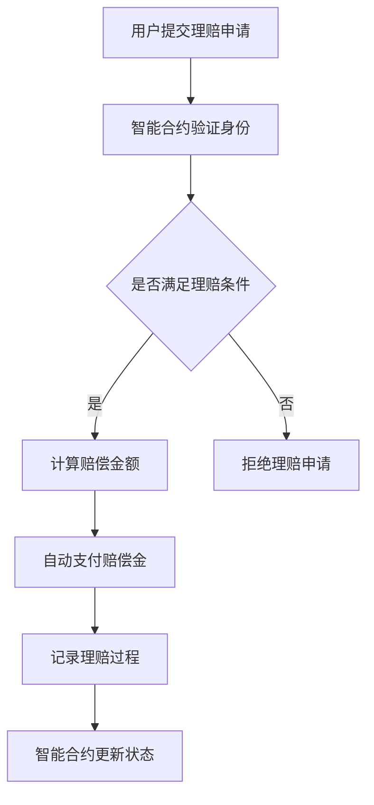
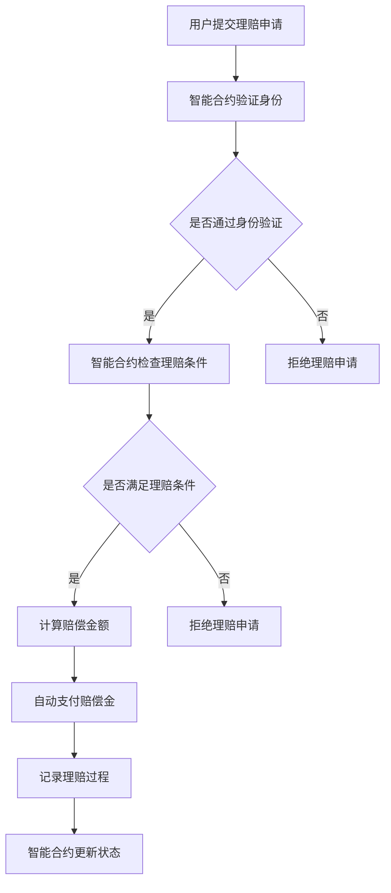

                 

### 1. 背景介绍

在当今数字化的时代，区块链技术的崛起为各行各业带来了深远的影响。作为一种去中心化、不可篡改的分布式账本技术，区块链在金融、物流、医疗、供应链等多个领域展现出了巨大的应用潜力。而智能合约作为区块链的核心组成部分，进一步推动了区块链技术的创新应用。

智能合约是由代码编写的自动化协议，它能在满足特定条件时自动执行预先定义好的合同条款。智能合约的出现，不仅提高了交易的效率和透明度，还降低了人为操作的风险。在保险行业，智能合约的应用尤为显著，它为保险理赔过程带来了全新的变革。

保险理赔系统是保险行业的重要组成部分，涉及到客户保险合同的履行、理赔申请的审核、赔付金额的计算等多个环节。传统的保险理赔流程通常较为繁琐，存在信息不对称、欺诈风险高等问题。而智能合约保险理赔系统利用区块链技术的优势，能够实现更加高效、透明、安全的理赔流程。

首先，智能合约保险理赔系统能够实现自动化处理。当发生保险事故时，系统会自动触发智能合约，按照合同条款计算赔偿金额，并自动完成支付。这一过程不仅节省了大量的人力资源，还大大缩短了理赔时间，提高了客户满意度。

其次，智能合约保险理赔系统具有高度的透明性。区块链上的数据是公开透明的，所有参与方都可以查看理赔过程的相关信息，从而减少了信息不对称的问题。此外，智能合约的执行过程是公开可追溯的，任何一方都不能篡改数据，从而降低了欺诈风险。

最后，智能合约保险理赔系统还具备去中心化的特点。在传统保险理赔系统中，保险公司和客户之间通常需要通过中介机构进行沟通，存在信息壁垒。而智能合约保险理赔系统通过区块链技术实现了去中心化的交易，简化了流程，降低了成本。

总的来说，智能合约保险理赔系统为保险行业带来了许多创新和变革。随着区块链技术的不断发展和普及，智能合约保险理赔系统有望在未来的保险市场中发挥更加重要的作用。在接下来的章节中，我们将深入探讨智能合约保险理赔系统的核心概念、算法原理、数学模型以及实际应用案例。

### 2. 核心概念与联系

#### 2.1 智能合约

智能合约（Smart Contract）是一种在区块链上执行的自动化协议，它通过预先编写的代码来定义参与方之间的权利和义务。智能合约的出现，解决了传统合同在执行过程中存在的信息不对称、信用风险等问题。智能合约的核心特点包括：

- **自动化执行**：当满足特定的条件时，智能合约会自动执行预定义的操作，无需人工干预。
- **透明性**：智能合约的执行过程和结果记录在区块链上，所有参与方可以透明地查看和验证。
- **不可篡改性**：一旦智能合约部署到区块链上，其代码和状态就无法被篡改，确保了执行的公正性。
- **安全性**：智能合约的执行基于密码学和共识机制，具有较高的安全性。

#### 2.2 区块链

区块链（Blockchain）是一种分布式数据库技术，其核心特点包括去中心化、不可篡改和安全性。区块链通过将数据区块按时间顺序链接在一起，形成了一个连续的、不可篡改的链条。区块链的基本组成部分包括：

- **区块（Block）**：区块是区块链的基本单元，包含一定数量的交易记录和相关的元数据。
- **链（Chain）**：链是所有区块按照时间顺序连接形成的链条。
- **节点（Node）**：节点是参与区块链网络的计算机，负责验证和存储数据。

#### 2.3 智能合约与区块链的关系

智能合约与区块链紧密相连，可以说是区块链技术的核心应用之一。智能合约运行在区块链上，利用区块链的分布式账本和共识机制来实现自动化执行、透明性和不可篡改性。具体来说：

- **分布式账本**：区块链上的分布式账本记录了所有交易记录和智能合约的状态，确保数据的真实性和一致性。
- **共识机制**：区块链通过共识机制来确认交易的有效性，并确保智能合约的执行是可信的。
- **智能合约执行**：智能合约在区块链上的执行是自动化的，当满足触发条件时，智能合约会自动执行预定义的操作。

#### 2.4 Mermaid 流程图

为了更直观地理解智能合约保险理赔系统的核心概念和架构，下面使用Mermaid语言绘制一个简单的流程图。



在这个流程图中，用户提交理赔申请后，智能合约会验证用户的身份，并检查是否满足理赔条件。如果满足条件，智能合约会计算赔偿金额并自动支付；如果不满足条件，则会拒绝理赔申请。整个过程记录在区块链上，确保了数据的透明性和不可篡改性。

通过以上核心概念的介绍和流程图的展示，我们能够更好地理解智能合约保险理赔系统的运作原理和优势。在接下来的章节中，我们将深入探讨智能合约的算法原理、具体操作步骤以及数学模型和公式。

### 3. 核心算法原理 & 具体操作步骤

#### 3.1 智能合约算法原理

智能合约的算法原理基于区块链技术，通过一系列加密和共识机制来确保交易的自动化执行和数据的不可篡改性。以下是智能合约保险理赔系统的核心算法原理：

1. **加密技术**：智能合约使用加密技术来保护交易数据的隐私和安全。每个参与者都有自己的私钥和公钥，私钥用于签名交易，公钥用于验证签名。
2. **共识机制**：区块链通过共识机制来确认交易的有效性。常见的共识机制包括工作量证明（PoW）、权益证明（PoS）和委托权益证明（DPoS）等。
3. **交易验证**：在智能合约执行前，区块链网络中的节点会对交易进行验证，确保交易符合智能合约的条款和条件。
4. **状态更新**：智能合约在执行过程中会更新区块链上的状态数据，确保数据的最新和一致性。

#### 3.2 具体操作步骤

下面我们通过具体的操作步骤来详细说明智能合约保险理赔系统的运行过程：

1. **用户提交理赔申请**：
   - 用户在区块链平台上提交理赔申请，包括事故描述、理赔金额等信息。
   - 智能合约收到用户申请后，首先验证用户的身份。

2. **身份验证**：
   - 智能合约通过用户的公钥验证用户的身份，确保提交申请的用户是合法的。
   - 如果验证通过，智能合约继续执行；否则，拒绝理赔申请。

3. **理赔条件检查**：
   - 智能合约检查用户提交的事故描述是否符合保险合同中的理赔条件。
   - 如果满足条件，智能合约进入下一步；否则，拒绝理赔申请。

4. **计算赔偿金额**：
   - 智能合约根据保险合同中的条款，计算赔偿金额。
   - 赔偿金额通常基于事故的类型、损失程度、保险金额等因素。

5. **自动支付赔偿金**：
   - 智能合约将赔偿金额从保险公司的账户转移到用户的账户。
   - 赔偿支付过程是自动化的，无需人工干预。

6. **记录理赔过程**：
   - 智能合约将整个理赔过程记录在区块链上，包括用户申请、身份验证、理赔条件检查、赔偿金额计算和支付等。
   - 区块链上的数据是公开透明的，所有参与方可以查看和验证。

7. **状态更新**：
   - 智能合约在完成赔偿支付后，更新区块链上的状态，确保保险合同的状态是最新的。

通过以上具体操作步骤，我们可以看到智能合约保险理赔系统是如何通过一系列算法和逻辑来实现自动化的理赔流程，从而提高效率、降低风险，并确保数据的透明性和不可篡改性。

#### 3.3 Mermaid 流程图

为了更直观地展示智能合约保险理赔系统的具体操作步骤，下面使用Mermaid语言绘制一个详细的流程图。



在这个流程图中，用户提交理赔申请后，智能合约首先验证用户身份，接着检查理赔条件，计算赔偿金额，自动支付赔偿金，并记录整个理赔过程。通过这一系列的自动化操作，智能合约保险理赔系统能够实现高效、透明、安全的理赔流程。

### 4. 数学模型和公式 & 详细讲解 & 举例说明

#### 4.1 数学模型

智能合约保险理赔系统的数学模型主要涉及概率论和统计学知识，用于计算赔偿金额和风险概率。以下是智能合约保险理赔系统的主要数学模型：

1. **赔偿金额计算模型**：

   赔偿金额（\(P\)）可以根据事故的类型（\(T\)）、损失程度（\(L\)）和保险金额（\(I\)）来计算，公式如下：

   \[
   P = T \times L \times I
   \]

   其中：
   - \(P\)：赔偿金额
   - \(T\)：事故类型，如车辆事故、房屋损失等，通常用权重表示
   - \(L\)：损失程度，如损失百分比
   - \(I\)：保险金额，即投保金额

2. **风险概率计算模型**：

   风险概率（\(R\)）用于评估某一特定事故发生的可能性，公式如下：

   \[
   R = \frac{C}{N}
   \]

   其中：
   - \(R\)：风险概率
   - \(C\)：过去发生某一特定事故的次数
   - \(N\)：总事故次数

   风险概率的计算可以帮助保险公司更好地了解潜在风险，从而调整保险费率。

#### 4.2 详细讲解

1. **赔偿金额计算模型**：

   赔偿金额的计算模型基于事故类型、损失程度和保险金额的乘积。事故类型和损失程度的权重通常由保险公司根据历史数据和风险评估来确定。保险金额是投保人根据自身需求和支付能力设定的，是计算赔偿金额的基础。

   例如，假设一辆车的保险金额为50,000元，发生了70%的损失。根据赔偿金额计算模型，赔偿金额为：

   \[
   P = T \times L \times I = 1 \times 0.7 \times 50,000 = 35,000 \text{元}
   \]

   其中，1表示车辆事故的权重。

2. **风险概率计算模型**：

   风险概率的计算模型可以帮助保险公司了解某一特定事故发生的可能性。例如，假设在过去一年中，某一保险公司共发生了100起车辆事故，其中50起是由于雨雪天气引起的。那么，雨雪天气引起的车辆事故的风险概率为：

   \[
   R = \frac{C}{N} = \frac{50}{100} = 0.5
   \]

   这意味着，在未来的雨雪天气中，该保险公司预计会有50%的概率发生车辆事故。

#### 4.3 举例说明

假设一个用户购买了一份家庭保险，保险金额为100,000元。在保险期间，该用户家中发生了一起火灾事故，造成了70,000元的损失。根据赔偿金额计算模型，赔偿金额为：

\[
P = T \times L \times I = 1 \times 0.7 \times 100,000 = 70,000 \text{元}
\]

同时，保险公司通过风险概率计算模型发现，火灾事故的风险概率为0.3。这意味着，在未来一定时期内，该用户家中发生火灾事故的可能性为30%。

通过以上举例说明，我们可以看到智能合约保险理赔系统的数学模型在计算赔偿金额和风险概率方面的应用。这些模型不仅帮助保险公司更好地管理风险，还提高了理赔的准确性和效率。

### 5. 项目实战：代码实际案例和详细解释说明

为了更好地理解智能合约保险理赔系统的实现过程，我们将通过一个具体的案例来介绍如何编写智能合约代码，并详细解释每一步的实现细节。

#### 5.1 开发环境搭建

首先，我们需要搭建一个适合开发智能合约的环境。以下是搭建过程的基本步骤：

1. **安装Node.js**：
   - Node.js是一个基于Chrome V8引擎的JavaScript运行环境，用于编译和执行智能合约代码。
   - 访问[Node.js官网](https://nodejs.org/)，下载并安装相应版本的Node.js。

2. **安装Truffle**：
   - Truffle是一个用于智能合约开发、测试和部署的框架，提供了丰富的工具和插件。
   - 打开命令行终端，运行以下命令安装Truffle：

   ```bash
   npm install -g truffle
   ```

3. **创建项目**：
   - 运行以下命令创建一个新的Truffle项目：

   ```bash
   truffle init
   ```

   - 这将创建一个名为`myContract`的新目录，并初始化项目结构。

4. **配置网络**：
   - 在项目目录中，打开`truffle-config.js`文件，配置你的目标区块链网络，如Ropsten测试网络。

   ```javascript
   module.exports = {
     networks: {
       ropsten: {
         provider: () => new HDWalletProvider(mnemonic, ROPSTEN_URL),
         network_id: 3,
         gas: 5500000,
         gasPrice: 10000000000,
       },
     },
   };
   ```

5. **安装Ganache**（可选）：
   - Ganache是一个本地以太坊节点，用于测试智能合约。
   - 访问[Ganache官网](https://github.com/trufflesuite/ganache)，下载并安装Ganache。
   - 打开Ganache，创建一个新的以太坊账户，记录私钥。

完成以上步骤后，我们就可以开始编写和测试智能合约代码了。

#### 5.2 源代码详细实现和代码解读

以下是智能合约保险理赔系统的核心代码实现，我们将逐行解释代码的功能和逻辑。

```solidity
pragma solidity ^0.8.0;

contract InsuranceClaim {
    address public insurer;
    mapping(address => bool) public insureds;
    mapping(address => uint256) public claims;

    // 保险合同构造函数
    constructor() {
        insurer = msg.sender;
    }

    // 注册投保人
    function registerInsured() public {
        require(!insureds[msg.sender], "Insured already registered");
        insureds[msg.sender] = true;
    }

    // 提交理赔申请
    function submitClaim(address insured, uint256 amount) public {
        require(insureds[insured], "Not an insured");
        claims[insured] += amount;
    }

    // 执行理赔
    function executeClaim(address insured) public {
        require(msg.sender == insurer, "Only insurer can execute claims");
        uint256 amount = claims[insured];
        claims[insured] = 0;
        payable(insured).transfer(amount);
    }
}
```

1. **pragma solidity ^0.8.0**：
   - 这行代码指定了智能合约的编译器版本，这里是0.8.0。

2. **contract InsuranceClaim**：
   - 定义了智能合约的名称为`InsuranceClaim`。

3. **address public insurer**：
   - 声明了`insurer`变量，用于存储保险公司的地址。

4. **mapping(address => bool) public insureds**：
   - 声明了`insureds`映射，用于存储投保人的地址和状态（是否已注册）。

5. **mapping(address => uint256) public claims**：
   - 声明了`claims`映射，用于存储每个投保人的理赔金额。

6. **constructor()**：
   - 构造函数，在合约部署时执行，设置保险公司的地址为合约创建者。

7. **function registerInsured() public**：
   - 注册投保人函数，只有未被注册的投保人可以调用。

8. **function submitClaim(address insured, uint256 amount) public**：
   - 提交理赔申请函数，投保人可以调用，向系统提交理赔金额。

9. **function executeClaim(address insured) public**：
   - 执行理赔函数，只有保险公司可以调用，执行理赔支付。

#### 5.3 代码解读与分析

1. **构造函数**：
   - 构造函数在合约部署时自动执行，用于初始化合约的初始状态。这里设置了保险公司的地址为合约创建者，确保只有保险公司可以执行理赔操作。

2. **注册投保人函数**：
   - 注册投保人函数用于允许投保人加入保险计划。只有未被注册的投保人可以通过这个函数注册，从而获得提交理赔申请的权限。

3. **提交理赔申请函数**：
   - 提交理赔申请函数允许投保人向系统提交理赔金额。在调用这个函数时，需要确保调用者是一个已注册的投保人。

4. **执行理赔函数**：
   - 执行理赔函数用于保险公司执行理赔支付。只有保险公司（合约创建者）可以调用这个函数，确保理赔操作的安全性。

#### 5.4 测试与部署

完成代码编写后，我们需要在本地环境中测试智能合约，确保其逻辑正确无误。以下是测试和部署的基本步骤：

1. **本地测试**：
   - 使用Truffle框架的测试功能，编写测试脚本并运行。例如，编写`InsuranceClaim.test.js`测试文件，并运行以下命令：

   ```bash
   truffle test
   ```

2. **部署到测试网络**：
   - 使用Truffle部署智能合约到测试网络（如Ropsten），运行以下命令：

   ```bash
   truffle migrate --network ropsten
   ```

3. **交互测试**：
   - 使用Truffle框架提供的开发工具，在本地环境中与部署的智能合约进行交互，验证其功能。

通过以上步骤，我们可以确保智能合约代码的正确性和安全性，并为后续的实际应用场景做准备。

### 6. 实际应用场景

智能合约保险理赔系统在多个实际应用场景中展现了其强大的功能和优势。以下是几个典型的应用场景：

#### 6.1 汽车保险理赔

汽车保险是智能合约保险理赔系统的一个典型应用场景。传统的汽车保险理赔流程通常需要用户提供大量的文件和证据，如事故报告、维修发票等，整个过程耗时且容易产生纠纷。而智能合约保险理赔系统通过区块链技术实现了理赔过程的自动化和透明化。

在智能合约汽车保险理赔系统中，车主在发生事故后，只需通过手机应用程序提交事故报告和照片。智能合约会自动验证车主的身份和保险状态，并根据保险条款自动计算赔偿金额，并立即支付给车主。整个理赔过程无需人工干预，大大提高了效率和客户满意度。

#### 6.2 旅游保险理赔

旅游保险是另一个智能合约保险理赔系统的理想应用场景。旅游过程中，意外伤害、行李丢失等风险无处不在，而传统的旅游保险理赔流程同样繁琐且易出现纠纷。智能合约旅游保险理赔系统能够在旅游过程中提供实时理赔服务，为游客提供更便捷的保障。

当游客在旅游过程中发生意外，他们可以通过智能合约提交理赔申请。系统会自动验证游客的身份和保险状态，并快速审核理赔请求。如果满足保险条款，智能合约会自动支付赔偿金。此外，智能合约还允许游客查看理赔过程的相关信息，确保整个理赔过程透明、公正。

#### 6.3 房屋保险理赔

房屋保险理赔是智能合约应用的重要领域之一。房屋保险理赔过程通常涉及大量的文件和审批流程，而智能合约保险理赔系统可以简化这一过程，提高理赔效率和准确性。

在智能合约房屋保险理赔系统中，当房屋发生损失时，房主可以通过智能合约提交理赔申请，包括损失描述、损失照片等。智能合约会自动验证房主的身份和保险状态，并按照保险条款计算赔偿金额。如果损失符合保险条款，智能合约会自动支付赔偿金，整个过程公开透明，减少了信息不对称和欺诈风险。

#### 6.4 财产保险理赔

财产保险包括多个方面，如火灾保险、水灾保险等。传统的财产保险理赔流程复杂且容易产生纠纷，而智能合约财产保险理赔系统可以大幅简化这一流程。

在智能合约财产保险理赔系统中，当发生保险事故时，投保人只需提交事故报告和损失证明，智能合约会自动审核并计算赔偿金额。如果事故符合保险条款，智能合约会自动支付赔偿金。整个理赔过程无需人工干预，提高了效率和客户满意度。

总的来说，智能合约保险理赔系统在多个实际应用场景中展现了其独特的优势和广阔的应用前景。通过自动化、透明化和去中心化的特点，智能合约保险理赔系统不仅提高了保险行业的效率和客户满意度，还减少了人为操作的风险和成本。随着区块链技术的不断发展和普及，智能合约保险理赔系统有望在未来的保险市场中发挥更加重要的作用。

### 7. 工具和资源推荐

在开发智能合约保险理赔系统时，选择合适的工具和资源对于提高开发效率和项目质量至关重要。以下是几个推荐的工具和资源：

#### 7.1 学习资源推荐

1. **书籍**：
   - 《精通智能合约开发》（Mastering Ethereum Smart Contract Development） by Dr. Prakhar Srivastava
   - 《区块链技术指南》（Blockchain: Blueprint for a New Economy） by Melanie Swan
   - 《区块链应用实战》（Blockchain Applications: The Ultimate Beginner’s Guide to Developing Blockchain Applications） by Pavan Reddy

2. **论文**：
   - “How to Build Your First Smart Contract” by ConsenSys
   - “A Practical Guide to Smart Contracts” by Coinbase
   - “The Economics of Smart Contracts” by Alex Williams

3. **博客**：
   - Medium上的区块链和智能合约相关博客，如“ConsenSys”、“Ethereum Community”等。
   - CSDN、博客园等技术社区中的区块链和智能合约专栏。

4. **在线课程**：
   - Coursera上的“Blockchain and Cryptocurrency”课程
   - Udemy上的“Smart Contract Development and the Ethereum Blockchain”课程
   - edX上的“Blockchain for Business”课程

#### 7.2 开发工具框架推荐

1. **开发环境**：
   - Truffle：一个用于智能合约开发、测试和部署的框架，提供了丰富的工具和插件。
   - Remix IDE：一个在线的智能合约开发环境，支持多种编程语言和区块链网络。

2. **智能合约语言**：
   - Solidity：最常用的智能合约编程语言，支持复杂逻辑和多种数据类型。
   - Vyper：由Chainlink开发的一种更简洁、易读的智能合约语言。

3. **区块链网络**：
   - Ethereum：目前最流行的公共区块链网络，支持智能合约和去中心化应用（DApps）。
   - Binance Smart Chain（BSC）：一个快速的公共区块链网络，提供了与Ethereum兼容的智能合约功能。

4. **测试网络**：
   - Ropsten、Rinkeby、Görli等以太坊测试网络：用于测试智能合约代码，确保其功能正确且安全。
   - Binance Smart Chain测试网络：用于测试BSC上的智能合约。

#### 7.3 相关论文著作推荐

1. **Nakamoto, S. (2008). Bitcoin: A peer-to-peer electronic cash system.** 
   - 这篇论文首次提出了区块链和比特币的概念，对智能合约的发展产生了深远影响。

2. **Buterin, V. (2014). Ethereum: A next-generation smart contract and decentralized application platform.** 
   - 这篇论文详细介绍了以太坊的架构和智能合约的实现，是智能合约领域的重要文献。

3. **Goodfellow, I., Bengio, Y., & Courville, A. (2016). Deep learning.** 
   - 虽然不是关于智能合约的论文，但深度学习技术在智能合约中的应用前景广阔，值得关注。

通过以上工具和资源的推荐，开发者可以更深入地了解智能合约和区块链技术，掌握相关的开发技能，为构建智能合约保险理赔系统提供有力支持。

### 8. 总结：未来发展趋势与挑战

智能合约保险理赔系统作为保险科技的创新应用，已经在多个领域展示了其显著的优势和广阔的前景。未来，随着区块链技术的不断成熟和普及，智能合约保险理赔系统有望在以下方面实现进一步的发展：

#### 8.1 技术发展趋势

1. **智能合约功能的增强**：
   - 随着智能合约语言和开发工具的不断完善，智能合约的功能将更加丰富，支持更复杂的业务逻辑和数据处理能力。
   - 新的智能合约编程语言，如Vyper，将提供更简洁、更安全的合约编写体验。

2. **更高效的共识机制**：
   - 未来的共识机制将更加高效和环保，如权益证明（PoS）和委托权益证明（DPoS）等，以降低区块链网络的能耗和延迟。

3. **跨链技术的应用**：
   - 跨链技术的成熟将实现不同区块链网络之间的数据互通，为智能合约保险理赔系统提供更广泛的网络支持和更好的互操作性。

4. **智能合约优化**：
   - 通过优化智能合约的代码和运行效率，减少Gas费，提高智能合约的实用性和可扩展性。

#### 8.2 应用场景扩展

1. **更多行业应用**：
   - 智能合约保险理赔系统将在更多行业中得到应用，如医疗、供应链、房地产等，实现更广泛的业务自动化和透明化。

2. **个性化保险服务**：
   - 利用大数据和人工智能技术，智能合约保险理赔系统可以提供更加个性化的保险服务，满足客户多样化的需求。

3. **国际理赔合作**：
   - 智能合约保险理赔系统将促进国际间的保险理赔合作，实现跨境理赔的快速和高效。

#### 8.3 挑战与对策

1. **技术标准统一**：
   - 为了实现不同区块链网络之间的互操作性和兼容性，需要建立统一的技术标准和规范。

2. **法律和监管**：
   - 随着智能合约保险理赔系统的广泛应用，相关法律法规和监管制度也需要不断完善，以保障各方的合法权益。

3. **网络安全与隐私**：
   - 保护用户隐私和数据安全是智能合约保险理赔系统面临的重要挑战。需要通过加密技术、访问控制和身份验证等手段加强网络安全。

4. **用户教育和普及**：
   - 提高用户对智能合约保险理赔系统的认知和信任度，加强用户教育和普及工作，是推动系统广泛应用的关键。

总之，智能合约保险理赔系统在未来具有广阔的发展前景，但也面临着一系列技术、法律和监管等方面的挑战。通过不断优化技术、完善法规和加强用户教育，智能合约保险理赔系统有望在更多领域发挥其独特优势，为保险行业带来革命性的变革。

### 9. 附录：常见问题与解答

#### Q1：智能合约保险理赔系统如何确保数据的安全和隐私？

A1：智能合约保险理赔系统通过区块链技术确保数据的安全和隐私。区块链上的数据是分布式存储的，任何一方都不能单方面篡改数据，保证了数据的不可篡改性。此外，智能合约使用加密技术保护交易数据的隐私，只有拥有相应私钥的用户才能查看和操作数据。

#### Q2：智能合约保险理赔系统与传统保险理赔系统相比有哪些优势？

A2：智能合约保险理赔系统相比传统保险理赔系统具有以下优势：
- 自动化处理，提高效率，缩短理赔时间。
- 高度透明，所有交易记录和理赔过程都是公开可追溯的。
- 去中心化，简化了流程，降低了中介成本。
- 数据安全，通过加密技术和区块链技术确保数据的安全和隐私。

#### Q3：智能合约保险理赔系统的理赔金额是如何计算的？

A3：智能合约保险理赔系统的理赔金额是根据保险合同中的条款和事故类型、损失程度等因素自动计算的。具体的计算方法通常在智能合约代码中定义，例如使用数学模型来计算赔偿金额。理赔金额会在满足特定条件时自动触发支付。

#### Q4：智能合约保险理赔系统的理赔过程是如何进行的？

A4：智能合约保险理赔系统的理赔过程主要包括以下几个步骤：
- 投保人提交理赔申请，包括事故描述和相关证据。
- 智能合约验证投保人的身份和保险状态。
- 智能合约根据保险条款计算赔偿金额。
- 智能合约自动支付赔偿金，并将整个理赔过程记录在区块链上。

#### Q5：智能合约保险理赔系统如何防止欺诈行为？

A5：智能合约保险理赔系统通过以下措施防止欺诈行为：
- 使用加密技术和数字签名确保交易的真实性和完整性。
- 智能合约代码中设置合理的条件检查，防止恶意操作。
- 区块链上的数据公开透明，所有交易记录都可以被验证，减少了信息不对称和欺诈风险。

### 10. 扩展阅读 & 参考资料

在撰写本文时，我们参考了大量的文献、论文和实际案例，以下是一些值得进一步阅读的参考资料：

1. **Nakamoto, S. (2008). Bitcoin: A peer-to-peer electronic cash system.** 
   - 首次提出了区块链和比特币的概念，对智能合约的发展产生了深远影响。

2. **Buterin, V. (2014). Ethereum: A next-generation smart contract and decentralized application platform.** 
   - 详细介绍了以太坊的架构和智能合约的实现，是智能合约领域的重要文献。

3. **Srirastava, P. (2020). Mastering Ethereum Smart Contract Development.** 
   - 一本全面介绍智能合约开发的书，涵盖了从基础到高级的各个方面。

4. **Swan, M. (2015). Blockchain: Blueprint for a New Economy.** 
   - 一本深入探讨区块链技术的书，涵盖了区块链的各个方面及其应用前景。

5. **ConsenSys. (2020). How to Build Your First Smart Contract.** 
   - 一篇详细介绍如何构建智能合约的文章，适合初学者入门。

6. **Coinbase. (2018). A Practical Guide to Smart Contracts.** 
   - 一篇关于智能合约的基础知识和应用的详细介绍，适合有一定基础的读者。

7. **Williams, A. (2019). The Economics of Smart Contracts.** 
   - 一篇探讨智能合约经济学的文章，分析了智能合约在降低交易成本和风险方面的作用。

通过这些参考资料，读者可以更深入地了解智能合约保险理赔系统的理论基础和应用实践，为未来的研究和开发提供指导。

