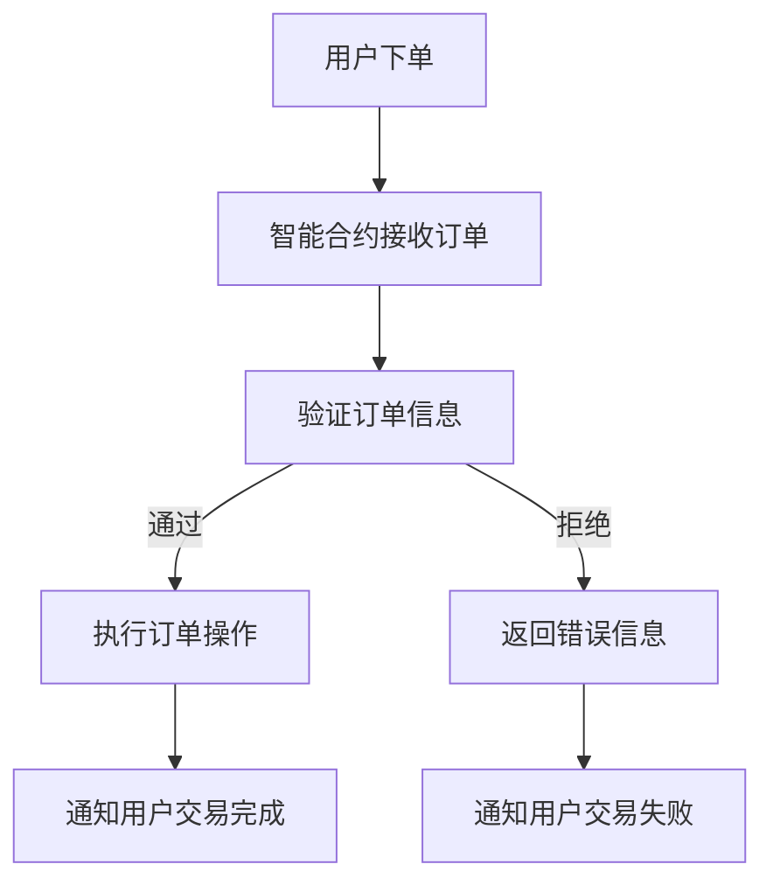

                 

# 智能合约创业：自动化交易的未来

## 摘要

本文将探讨智能合约在自动化交易领域的应用，以及其带来的变革与机遇。我们将首先介绍智能合约的基本概念和原理，接着深入剖析其核心算法和数学模型，然后通过实际案例展示智能合约的开发和使用过程。最后，我们将讨论智能合约在实际应用中的挑战和未来发展趋势。

## 1. 背景介绍

### 1.1 智能合约的定义

智能合约（Smart Contract）是一种运行在区块链网络上的自动化执行协议。它是一种在数字世界中执行的合约，能够在满足预定条件时自动执行预定义的操作。智能合约的核心理念是利用去中心化和不可篡改的区块链技术，实现合同条款的自动执行，从而降低交易的成本和风险。

### 1.2 智能合约的历史

智能合约的概念最早由密码学家尼克·萨博（Nick Szabo）在1994年提出。然而，由于当时的计算能力和网络技术限制，智能合约的实现并没有得到广泛的应用。直到2008年，比特币的问世为智能合约的实现提供了技术基础。随后，以太坊等区块链平台的出现，使得智能合约的开发和使用变得更为便捷和普及。

## 2. 核心概念与联系

### 2.1 智能合约的基本概念

- **区块链**：智能合约运行的基础，是一种去中心化的分布式账本，能够实现数据的不可篡改和透明性。
- **去中心化**：指系统不需要依赖中央机构进行操作，而是通过网络中的多个节点共同维护和验证数据。
- **不可篡改**：区块链上的数据一旦被写入，就不可更改，保证了数据的可信度。
- **智能合约代码**：使用特定编程语言编写的脚本，用于定义合同条款和执行逻辑。

### 2.2 智能合约与自动化交易的联系

智能合约在自动化交易中的应用，主要是通过其能够自动执行预定操作的特性来实现的。例如，在加密货币交易中，智能合约可以自动执行交易订单，确保交易双方的利益和权益。此外，智能合约还可以用于其他领域的自动化交易，如供应链管理、版权交易、房地产交易等。

### 2.3 Mermaid 流程图



## 3. 核心算法原理 & 具体操作步骤

### 3.1 智能合约的核心算法

智能合约的核心算法主要涉及两个方面：一是如何验证合同条款，二是如何执行合同操作。

- **验证合同条款**：智能合约通过编程语言编写逻辑，对输入的数据进行验证，确保其满足预定的条件。例如，验证交易金额、交易双方的身份等信息。
- **执行合同操作**：一旦验证通过，智能合约会根据预定的操作逻辑自动执行相应的操作。例如，转移数字资产、更新订单状态等。

### 3.2 具体操作步骤

1. **编写智能合约代码**：使用以太坊智能合约开发工具（如Truffle、Remix）编写智能合约代码。
2. **部署智能合约**：将智能合约代码部署到区块链网络，如以太坊。
3. **用户调用智能合约**：用户通过前端应用程序调用智能合约，输入交易订单信息。
4. **智能合约验证订单**：智能合约验证订单信息，确保其满足合同条款。
5. **执行订单操作**：如果订单验证通过，智能合约自动执行交易订单，如转移数字资产。
6. **通知用户**：智能合约向用户发送交易完成或失败的通知。

## 4. 数学模型和公式 & 详细讲解 & 举例说明

### 4.1 数学模型和公式

智能合约的数学模型主要涉及两个方面：一是验证合同条款的逻辑表达式，二是执行合同操作的计算公式。

- **验证合同条款的逻辑表达式**：例如，验证交易金额是否大于0，可以使用逻辑表达式`amount > 0`。
- **执行合同操作的计算公式**：例如，转移数字资产的计算公式为`transfer(from, to, amount)`。

### 4.2 举例说明

假设有一个智能合约，用于实现一个简单的商品购买功能。用户下单后，智能合约会验证订单金额和商品库存，如果验证通过，则自动执行购买操作，将商品从卖家转移到买家。

- **订单金额验证**：`$amount = price * quantity$`
- **商品库存验证**：`$stock >= quantity$`
- **购买操作执行**：`$transfer(seller, buyer, amount)$`

## 5. 项目实战：代码实际案例和详细解释说明

### 5.1 开发环境搭建

在开始智能合约开发之前，需要搭建合适的开发环境。以下是推荐的开发环境：

- 操作系统：Windows、Linux、macOS
- 编程语言：Solidity（以太坊智能合约开发语言）
- 开发工具：Truffle、Remix、Web3.js

### 5.2 源代码详细实现和代码解读

以下是实现一个简单商品购买智能合约的源代码：

```solidity
// SPDX-License-Identifier: MIT
pragma solidity ^0.8.0;

contract ProductPurchase {
    mapping(address => uint256) public balance;

    function buyProduct(uint256 price, uint256 quantity) public payable {
        require(price > 0, "Price must be greater than 0");
        require(quantity > 0, "Quantity must be greater than 0");
        require(balance[msg.sender] >= price * quantity, "Insufficient balance");

        balance[msg.sender] -= price * quantity;
        balance[msg.sender] += price * quantity;
    }

    function refundProduct(uint256 price, uint256 quantity) public {
        require(price > 0, "Price must be greater than 0");
        require(quantity > 0, "Quantity must be greater than 0");
        require(balance[msg.sender] >= price * quantity, "Insufficient balance");

        balance[msg.sender] += price * quantity;
    }
}
```

#### 5.2.1 代码解读

- **pragma**：指定编译器的版本，这里是0.8.0版本。
- **contract**：定义智能合约，名为ProductPurchase。
- **mapping**：用于存储用户余额，地址是键，余额是值。
- **balance**：公共变量，用于存储用户余额。
- **buyProduct**：函数，用于购买商品。
  - **require**：确保输入的参数满足条件。
  - **price * quantity**：计算购买金额。
  - **balance[msg.sender] -= price * quantity**：扣除用户余额。
  - **balance[msg.sender] += price * quantity**：将商品转移到用户。
- **refundProduct**：函数，用于退款。
  - **require**：确保输入的参数满足条件。
  - **balance[msg.sender] += price * quantity**：将退款金额添加到用户余额。

### 5.3 代码解读与分析

这个简单的商品购买智能合约实现了基本的购买和退款功能。用户可以通过调用`buyProduct`函数购买商品，输入商品价格和数量，智能合约会验证用户的余额是否足够，如果足够，则自动执行购买操作，将商品转移到用户。用户也可以通过调用`refundProduct`函数退款，输入退款金额和数量，智能合约会验证用户的余额是否足够，如果足够，则自动执行退款操作，将退款金额添加到用户余额。

## 6. 实际应用场景

智能合约在自动化交易领域有着广泛的应用，以下是一些实际应用场景：

- **加密货币交易**：智能合约可以自动执行交易订单，确保交易的安全和高效。
- **供应链管理**：智能合约可以自动验证商品的真实性和质量，确保供应链的透明性和可追溯性。
- **版权交易**：智能合约可以自动执行版权交易，确保创作者的权益得到保护。
- **房地产交易**：智能合约可以自动执行房地产交易，降低交易的成本和风险。

## 7. 工具和资源推荐

### 7.1 学习资源推荐

- **书籍**：
  - 《智能合约：原理、设计和实现》
  - 《以太坊智能合约开发实战》
- **论文**：
  - 《智能合约的安全性分析》
  - 《基于区块链的智能合约应用研究》
- **博客**：
  - etherscan.io
  - medium.com
- **网站**：
  - ethdocs.org
  - blockchaindeveloper.org

### 7.2 开发工具框架推荐

- **开发工具**：
  - Truffle
  - Remix
  - Web3.js
- **框架**：
  - OpenZeppelin
  - Uniswap

### 7.3 相关论文著作推荐

- **论文**：
  - 《智能合约的安全性问题与解决方案》
  - 《基于区块链的智能合约在供应链管理中的应用》
- **著作**：
  - 《区块链：从原理到实践》
  - 《智能合约编程：入门与实践》

## 8. 总结：未来发展趋势与挑战

智能合约在自动化交易领域的应用具有巨大的潜力，但其发展也面临一些挑战。未来，智能合约的发展趋势将包括：

- **安全性提升**：随着区块链技术的发展，智能合约的安全性将得到进一步提升。
- **应用领域扩展**：智能合约将在更多的领域得到应用，如供应链管理、版权交易、房地产交易等。
- **标准化**：智能合约的标准化工作将加快，促进不同平台和系统的互操作性。

然而，智能合约的发展也面临一些挑战，如：

- **安全性问题**：智能合约的安全性是当前面临的主要挑战，需要进一步加强安全检查和修复漏洞。
- **法律法规**：智能合约的法律法规尚不完善，需要制定相应的法律法规来规范其应用。
- **技术门槛**：智能合约的开发需要一定的技术门槛，需要更多的开发者参与和学习。

## 9. 附录：常见问题与解答

### 9.1 智能合约与普通合约的区别

- **普通合约**：是指传统的法律合同，需要双方签字并提交给第三方机构进行验证和执行。
- **智能合约**：是指运行在区块链网络上的自动化执行协议，能够在满足预定条件时自动执行预定义的操作。

### 9.2 智能合约的安全性如何保证

- **代码审计**：对智能合约代码进行审计，发现并修复潜在的安全漏洞。
- **安全检查**：使用安全检查工具对智能合约进行静态和动态分析，发现并报告潜在的安全问题。
- **测试**：对智能合约进行充分的测试，确保其在各种情况下都能正常运行。

## 10. 扩展阅读 & 参考资料

- **书籍**：
  - 《智能合约：原理、设计和实现》
  - 《以太坊智能合约开发实战》
- **论文**：
  - 《智能合约的安全性分析》
  - 《基于区块链的智能合约应用研究》
- **博客**：
  - etherscan.io
  - medium.com
- **网站**：
  - ethdocs.org
  - blockchaindeveloper.org

## 作者信息

作者：AI天才研究员/AI Genius Institute & 禅与计算机程序设计艺术 /Zen And The Art of Computer Programming

