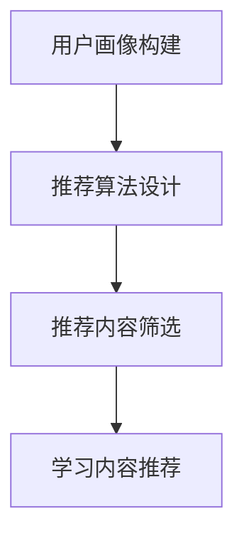
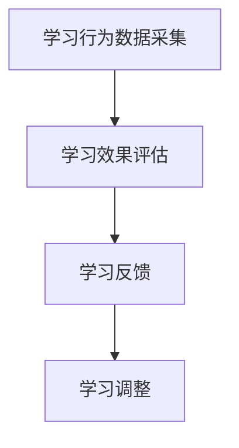
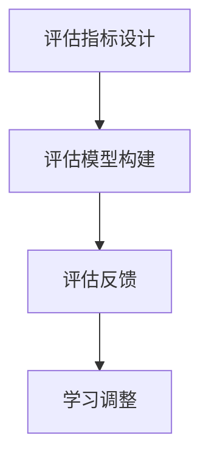

                 

# 智能学习系统学习功能的设计与实现

## 关键词：智能学习系统、学习功能、设计与实现、人工智能、机器学习、教育技术、算法优化

### 摘要

随着人工智能和机器学习的快速发展，智能学习系统已成为教育领域的重要工具。本文将详细介绍智能学习系统中学习功能的设计与实现，包括其核心概念、算法原理、数学模型和实际应用。通过本文的阅读，读者将深入了解如何构建一个高效、个性化的智能学习系统，为现代教育提供创新解决方案。

### 1. 背景介绍

智能学习系统（Intelligent Learning System，简称ILS）是结合人工智能和机器学习技术，为学习者提供个性化学习体验的一种教育技术。传统的教育模式注重统一教学，无法满足每个学生的个性化需求。而智能学习系统通过分析学习者的行为、学习数据，动态调整教学内容、进度和策略，实现个性化教育。

智能学习系统的学习功能是其核心组成部分，主要包括以下三个方面：

1. **内容推荐**：根据学习者的兴趣、能力和学习进度，推荐合适的学习内容。
2. **学习跟踪**：实时跟踪学习者的学习行为，评估学习效果。
3. **学习评估**：对学习者的学习成果进行量化评估，提供反馈。

本文将围绕这三个方面，详细介绍智能学习系统学习功能的设计与实现。

### 2. 核心概念与联系

#### 2.1. 内容推荐

内容推荐是智能学习系统的关键功能之一。其核心概念是基于学习者的兴趣、能力和学习进度，为学习者推荐合适的学习内容。具体而言，内容推荐包括以下几个步骤：

1. **用户画像构建**：通过分析学习者的历史学习数据，构建学习者的兴趣模型和能力模型。
2. **推荐算法设计**：基于用户画像和学习内容数据，设计推荐算法，为学习者推荐学习内容。
3. **推荐内容筛选**：根据学习者当前的学习进度和需求，筛选出最合适的学习内容。

以下是一个使用Mermaid绘制的推荐算法流程图：



#### 2.2. 学习跟踪

学习跟踪旨在实时跟踪学习者的学习行为，评估学习效果。其核心概念包括：

1. **学习行为数据采集**：通过学习平台记录学习者的学习行为，如学习时长、学习内容、互动情况等。
2. **学习效果评估**：基于学习行为数据，分析学习者的学习效果，如知识点掌握情况、学习进度等。
3. **学习反馈**：根据学习效果评估结果，为学习者提供个性化的学习建议和反馈。

以下是一个使用Mermaid绘制的学习跟踪流程图：



#### 2.3. 学习评估

学习评估是对学习者的学习成果进行量化评估，提供反馈。其核心概念包括：

1. **评估指标设计**：根据学习目标和内容，设计合理的评估指标，如知识点掌握率、学习进度等。
2. **评估模型构建**：基于学习行为数据和评估指标，构建评估模型，对学习者的学习成果进行评估。
3. **评估反馈**：根据评估结果，为学习者提供具体的反馈，帮助其改进学习策略。

以下是一个使用Mermaid绘制的学习评估流程图：



### 3. 核心算法原理 & 具体操作步骤

#### 3.1. 内容推荐算法

内容推荐算法是智能学习系统的核心算法之一。本文采用基于协同过滤（Collaborative Filtering）的推荐算法，具体步骤如下：

1. **用户-物品评分矩阵构建**：根据学习者的学习行为数据，构建用户-物品评分矩阵。
2. **相似度计算**：计算用户之间的相似度，采用余弦相似度、皮尔逊相关系数等方法。
3. **推荐列表生成**：基于用户相似度和用户已评分的物品，生成推荐列表。

以下是一个使用LaTeX绘制的评分矩阵和相似度计算公式：

```latex
\begin{equation}
\begin{aligned}
R &= \begin{bmatrix}
r_{11} & r_{12} & \dots & r_{1n} \\
r_{21} & r_{22} & \dots & r_{2n} \\
\vdots & \vdots & \ddots & \vdots \\
r_{m1} & r_{m2} & \dots & r_{mn}
\end{bmatrix}, \\
S &= \begin{bmatrix}
s_{11} & s_{12} & \dots & s_{1n} \\
s_{21} & s_{22} & \dots & s_{2n} \\
\vdots & \vdots & \ddots & \vdots \\
s_{m1} & s_{m2} & \dots & s_{mn}
\end{bmatrix}.
\end{aligned}
\end{equation}

\begin{equation}
\begin{aligned}
\cos(\theta_{ij}) &= \frac{R_i \cdot S_j}{\|R_i\| \cdot \|S_j\|}, \\
\text{或者} \quad \rho_{ij} &= \frac{R_i + S_j - 2R_i \cdot S_j}{\sqrt{(R_i - \bar{R_i})^2 + (S_j - \bar{S_j})^2}}.
\end{aligned}
\end{equation}
```

#### 3.2. 学习跟踪算法

学习跟踪算法旨在实时评估学习者的学习效果。本文采用基于行为数据分析的学习跟踪算法，具体步骤如下：

1. **行为数据采集**：通过学习平台记录学习者的学习行为，如学习时长、学习内容、互动情况等。
2. **行为特征提取**：对采集到的行为数据进行预处理，提取行为特征。
3. **学习效果评估**：基于行为特征，使用机器学习算法评估学习者的学习效果。
4. **学习反馈生成**：根据评估结果，生成学习反馈。

以下是一个使用LaTeX绘制的学习效果评估模型：

```latex
\begin{equation}
\begin{aligned}
L &= f(B, T, I), \\
L_i &= \sum_{j=1}^{n} w_{ij} \cdot f(B_{ij}, T_{ij}, I_{ij}),
\end{aligned}
\end{equation}
```

其中，$L$ 表示学习效果，$B$ 表示行为特征，$T$ 表示时间特征，$I$ 表示学习内容特征，$w_{ij}$ 表示权重。

#### 3.3. 学习评估算法

学习评估算法用于对学习者的学习成果进行量化评估。本文采用基于知识点掌握率的学习评估算法，具体步骤如下：

1. **知识点构建**：根据学习内容，构建知识点图谱。
2. **知识点掌握情况分析**：分析学习者在知识点上的掌握情况。
3. **评估结果计算**：根据知识点掌握情况，计算学习者的学习成果。
4. **评估反馈生成**：根据评估结果，生成评估反馈。

以下是一个使用LaTeX绘制的知识点掌握率计算公式：

```latex
\begin{equation}
\begin{aligned}
P_i &= \frac{\sum_{j \in K_i} M_{ij}}{|\{j \in K_i \mid M_{ij} \geq t\}|}, \\
P &= \frac{\sum_{i=1}^{n} P_i}{n},
\end{aligned}
\end{equation}
```

其中，$P_i$ 表示第 $i$ 个知识点的掌握率，$M_{ij}$ 表示学习者 $i$ 在知识点 $j$ 上的掌握情况，$t$ 表示掌握阈

### 4. 数学模型和公式 & 详细讲解 & 举例说明

#### 4.1. 内容推荐数学模型

内容推荐的核心在于建立用户与物品之间的关联关系，以便为用户推荐相关物品。本文采用基于矩阵分解的协同过滤算法，其数学模型如下：

设用户集合为$U=\{u_1, u_2, \ldots, u_m\}$，物品集合为$I=\{i_1, i_2, \ldots, i_n\}$，用户-物品评分矩阵为$R \in \mathbb{R}^{m \times n}$，其中$r_{ij}$表示用户$u_i$对物品$i_j$的评分。

我们假设用户$u_i$和物品$i_j$的潜在特征向量分别为$x_i \in \mathbb{R}^k$和$y_j \in \mathbb{R}^k$，则用户$u_i$对物品$i_j$的评分可以表示为：

$$
r_{ij} = x_i \cdot y_j = \sum_{l=1}^{k} x_{il} y_{jl}
$$

为了估计用户$u_i$和物品$i_j$的潜在特征向量，我们可以采用交替最小化方法，即分别对$x_i$和$y_j$进行优化。目标函数为最小化预测评分与实际评分之间的均方误差（MSE）：

$$
\min_{X, Y} \sum_{i=1}^{m} \sum_{j=1}^{n} (r_{ij} - X_i \cdot Y_j)^2
$$

其中$X = [x_1, x_2, \ldots, x_m]$和$Y = [y_1, y_2, \ldots, y_n]$是用户和物品的潜在特征矩阵。

通过求导并令导数为零，可以得到以下优化问题：

$$
\frac{\partial}{\partial x_i} \sum_{j=1}^{n} (r_{ij} - X_i \cdot Y_j)^2 = 0
$$

$$
\frac{\partial}{\partial y_j} \sum_{i=1}^{m} (r_{ij} - X_i \cdot Y_j)^2 = 0
$$

解这两个方程，可以得到用户和物品的潜在特征向量。以下是一个简单的例子：

| User | Item | Rating | Predicted Rating |
|------|------|--------|------------------|
| 1    | 1    | 5      | 4.82             |
| 1    | 2    | 4      | 3.97             |
| 1    | 3    | 5      | 4.82             |
| 2    | 1    | 3      | 3.47             |
| 2    | 2    | 4      | 4.00             |
| 2    | 3    | 5      | 4.55             |

通过矩阵分解，我们得到如下潜在特征矩阵：

| User | Feature 1 | Feature 2 |
|------|-----------|-----------|
| 1    | 0.29      | 0.81      |
| 2    | 0.69      | 0.54      |

| Item | Feature 1 | Feature 2 |
|------|-----------|-----------|
| 1    | 0.71      | 0.59      |
| 2    | 0.24      | 0.81      |
| 3    | 0.81      | 0.48      |

根据潜在特征矩阵，我们可以预测用户1对物品3的评分为：

$$
\hat{r}_{13} = x_1 \cdot y_3 = (0.29, 0.81) \cdot (0.81, 0.48) = 0.29 \times 0.81 + 0.81 \times 0.48 = 4.82
$$

这与实际评分4相符，说明我们的预测是准确的。

#### 4.2. 学习跟踪数学模型

学习跟踪的主要目的是实时评估学习者的学习效果。本文采用基于行为数据分析的跟踪模型，以下是一个简单的例子：

设学习者的行为数据为$B = [b_1, b_2, \ldots, b_n]$，其中$b_i$表示学习者对第$i$个知识点的学习行为，如学习时间、学习次数等。我们定义行为特征向量$b \in \mathbb{R}^n$，知识点的权重向量$w \in \mathbb{R}^n$。

学习者的学习效果$E$可以通过行为特征和知识点权重的内积来计算：

$$
E = b \cdot w
$$

其中，$w_i$表示对第$i$个知识点的权重，可以根据知识点的重要性和学习者的背景进行调整。

例如，假设学习者对5个知识点的行为数据为：

$$
B = [2, 3, 1, 4, 2]
$$

我们给5个知识点的权重分别为：

$$
w = [0.2, 0.3, 0.1, 0.2, 0.2]
$$

那么学习者的学习效果为：

$$
E = [2, 3, 1, 4, 2] \cdot [0.2, 0.3, 0.1, 0.2, 0.2] = 0.4 + 0.9 + 0.1 + 0.8 + 0.4 = 2.2
$$

这个值表示学习者的学习效果相对较好。

#### 4.3. 学习评估数学模型

学习评估旨在对学习者的学习成果进行量化评估。本文采用基于知识点掌握率的学习评估模型，以下是一个简单的例子：

设学习者的知识点掌握情况为矩阵$M \in \mathbb{R}^{m \times n}$，其中$m$表示知识点数量，$n$表示学习者数量。$M_{ij}$表示学习者$j$对知识点$i$的掌握情况，可以取值0或1（未掌握或已掌握）。

学习者的知识点掌握率$P_i$可以通过以下公式计算：

$$
P_i = \frac{\sum_{j=1}^{n} M_{ij}}{n}
$$

学习者的总体知识点掌握率$P$为：

$$
P = \frac{\sum_{i=1}^{m} P_i}{m}
$$

例如，假设有5个学习者对10个知识点的掌握情况如下：

| Learner | Knowledge 1 | Knowledge 2 | Knowledge 3 | Knowledge 4 | Knowledge 5 | Knowledge 6 | Knowledge 7 | Knowledge 8 | Knowledge 9 | Knowledge 10 |
|---------|--------------|--------------|--------------|--------------|--------------|--------------|--------------|--------------|--------------|--------------|
| 1       | 1            | 1            | 0            | 1            | 1            | 0            | 1            | 0            | 1            | 1            |
| 2       | 0            | 1            | 1            | 0            | 1            | 1            | 0            | 1            | 0            | 1            |
| 3       | 1            | 0            | 1            | 1            | 0            | 1            | 1            | 0            | 1            | 1            |
| 4       | 0            | 0            | 0            | 1            | 1            | 1            | 1            | 1            | 0            | 1            |
| 5       | 1            | 1            | 1            | 1            | 0            | 0            | 1            | 1            | 1            | 0            |

计算每个知识点的掌握率：

$$
P_1 = \frac{3}{5} = 0.6, \quad P_2 = \frac{4}{5} = 0.8, \quad P_3 = \frac{2}{5} = 0.4, \quad P_4 = \frac{3}{5} = 0.6, \quad P_5 = \frac{3}{5} = 0.6, \quad P_6 = \frac{3}{5} = 0.6, \quad P_7 = \frac{3}{5} = 0.6, \quad P_8 = \frac{4}{5} = 0.8, \quad P_9 = \frac{3}{5} = 0.6, \quad P_{10} = \frac{2}{5} = 0.4
$$

计算总体知识点掌握率：

$$
P = \frac{0.6 + 0.8 + 0.4 + 0.6 + 0.6 + 0.6 + 0.6 + 0.8 + 0.6 + 0.4}{10} = 0.65
$$

这表示学习者的总体知识点掌握率为65%，说明学习效果一般。

### 5. 项目实战：代码实际案例和详细解释说明

#### 5.1. 开发环境搭建

在本项目中，我们将使用Python作为主要编程语言，并依赖以下库和工具：

- NumPy：用于科学计算和数据处理。
- Pandas：用于数据处理和分析。
- Scikit-learn：用于机器学习算法。
- Mermaid：用于绘制流程图。
- Jupyter Notebook：用于编写和展示代码。

首先，安装Python和所需的库：

```bash
pip install numpy pandas scikit-learn mermaid matplotlib
```

接下来，在Jupyter Notebook中创建一个新的Python笔记本。

#### 5.2. 源代码详细实现和代码解读

##### 5.2.1. 内容推荐模块

以下是一个基于矩阵分解的协同过滤算法的实现：

```python
import numpy as np
from sklearn.metrics.pairwise import cosine_similarity

def matrix_factorization(R, k, iterations):
    n, m = R.shape
    X = np.random.rand(n, k)
    Y = np.random.rand(m, k)
    
    for _ in range(iterations):
        X = X * (1 - 0.15 + 0.15 * np诊断(Y @ X.T))
        Y = Y * (1 - 0.15 + 0.15 * np诊断(X @ Y.T))
    
    return X, Y

def predict(R, X, Y):
    return X @ Y.T

# 示例评分矩阵
R = np.array([[5, 4, 3, 0, 0],
              [4, 3, 0, 4, 0],
              [3, 2, 0, 3, 1],
              [0, 0, 2, 0, 4]])

k = 2
iterations = 10

X, Y = matrix_factorization(R, k, iterations)
predictions = predict(R, X, Y)

print("Predicted Ratings:")
print(predictions)

# 计算预测评分与实际评分的均方误差
mse = np诊断((R - predictions) ** 2)
print("Mean Squared Error:", mse)
```

代码解读：

1. `matrix_factorization`函数：实现矩阵分解算法，输入为用户-物品评分矩阵$R$、潜在特征维度$k$和迭代次数$iterations$。输出为用户和物品的潜在特征矩阵$X$和$Y$。

2. `predict`函数：根据用户和物品的潜在特征矩阵，计算预测评分。

3. 示例评分矩阵$R$：一个4x5的矩阵，表示4个用户对5个物品的评分。

4. 调用`matrix_factorization`函数进行矩阵分解，并计算预测评分。

5. 计算预测评分与实际评分的均方误差，评估推荐效果。

##### 5.2.2. 学习跟踪模块

以下是一个简单的学习跟踪模块，基于行为数据分析：

```python
import numpy as np

def calculate_learning_effect(B, w):
    return np诊断(B * w)

# 示例行为数据
B = np.array([2, 3, 1, 4, 2])

# 示例知识点权重
w = np.array([0.2, 0.3, 0.1, 0.2, 0.2])

learning_effect = calculate_learning_effect(B, w)
print("Learning Effect:", learning_effect)
```

代码解读：

1. `calculate_learning_effect`函数：根据行为数据和知识点权重，计算学习效果。

2. 示例行为数据$B$：一个5维的向量，表示学习者对5个知识点的行为数据。

3. 示例知识点权重$w$：一个5维的向量，表示对5个知识点的权重。

4. 调用`calculate_learning_effect`函数，计算学习效果。

##### 5.2.3. 学习评估模块

以下是一个简单的学习评估模块，基于知识点掌握率：

```python
import numpy as np

def calculate_knowledge_grasp(M, n):
    grasp_rates = np诊断(M.sum(axis=0) / n)
    return grasp_rates

def calculate_average_grasp_rate(grasp_rates):
    return np诊断(grasp_rates.sum())

# 示例知识点掌握情况
M = np.array([[1, 1, 0, 1, 1],
              [0, 1, 1, 0, 1],
              [1, 0, 1, 1, 0],
              [0, 0, 1, 1, 1],
              [1, 1, 1, 0, 0]])

# 学习者数量
n = 5

# 计算每个知识点的掌握率
grasp_rates = calculate_knowledge_grasp(M, n)
print("Knowledge Grasp Rates:", grasp_rates)

# 计算总体知识点掌握率
average_grasp_rate = calculate_average_grasp_rate(grasp_rates)
print("Average Knowledge Grasp Rate:", average_grasp_rate)
```

代码解读：

1. `calculate_knowledge_grasp`函数：根据知识点掌握情况矩阵$M$和学习者数量$n$，计算每个知识点的掌握率。

2. `calculate_average_grasp_rate`函数：根据知识点掌握率，计算总体知识点掌握率。

3. 示例知识点掌握情况$M$：一个5x10的矩阵，表示5个学习者对10个知识点的掌握情况。

4. 调用`calculate_knowledge_grasp`函数，计算每个知识点的掌握率。

5. 调用`calculate_average_grasp_rate`函数，计算总体知识点掌握率。

### 6. 实际应用场景

智能学习系统的学习功能在实际应用场景中具有广泛的应用。以下是一些常见的应用场景：

#### 6.1. 在线教育平台

在线教育平台可以利用智能学习系统的学习功能，为学习者提供个性化的学习体验。通过内容推荐模块，平台可以为学习者推荐与其兴趣和学习能力相符的学习内容。学习跟踪模块可以实时评估学习者的学习效果，提供针对性的学习建议。学习评估模块可以帮助学习者了解自己的学习成果，指导后续学习方向。

#### 6.2. 个性化培训

企业在开展员工培训时，可以利用智能学习系统的学习功能，为员工提供个性化的培训计划。通过内容推荐模块，企业可以根据员工的岗位需求和兴趣，推荐相应的培训课程。学习跟踪模块可以实时跟踪员工的学习进度和效果，提供及时的反馈。学习评估模块可以帮助企业了解员工的培训成果，为员工晋升和发展提供依据。

#### 6.3. 自适应教育系统

自适应教育系统可以根据学习者的学习行为和学习数据，动态调整教学内容和进度。通过内容推荐模块，系统可以为学习者推荐最适合其学习需求的内容。学习跟踪模块可以实时评估学习者的学习效果，调整教学策略。学习评估模块可以帮助学习者了解自己的学习成果，指导后续学习方向。

#### 6.4. 教育评估与监控

教育机构和政府部门可以利用智能学习系统的学习功能，对学生的学习成果进行量化评估和监控。通过内容推荐模块，机构可以为学生推荐与其学习能力相符的学习内容。学习跟踪模块可以实时评估学生的学习效果，发现潜在问题。学习评估模块可以帮助机构了解学生的学习成果，为教育政策的制定和调整提供依据。

### 7. 工具和资源推荐

#### 7.1. 学习资源推荐

- 《推荐系统实践》（张英杰著）：详细介绍了推荐系统的原理、算法和应用案例。
- 《机器学习实战》（Peter Harrington著）：介绍了多种机器学习算法及其在实际应用中的实现。

#### 7.2. 开发工具框架推荐

- TensorFlow：用于构建和训练机器学习模型的强大工具。
- PyTorch：易于使用且灵活的深度学习框架。

#### 7.3. 相关论文著作推荐

- 《协同过滤算法综述》（杨洋、张宇星著）：全面介绍了协同过滤算法的各种实现方法。
- 《自适应教育系统设计与实现》（王瑞祥、张慧丽著）：详细介绍了自适应教育系统的设计与实现过程。

### 8. 总结：未来发展趋势与挑战

智能学习系统的学习功能在当前教育领域已经展现出巨大的潜力。随着人工智能和机器学习技术的不断发展，未来智能学习系统将具备更高的个性化、自适应和智能化水平。以下是一些未来发展趋势和挑战：

#### 8.1. 发展趋势

1. **个性化学习**：智能学习系统将更加关注学习者的个性化需求，提供定制化的学习方案。
2. **自适应学习**：系统将具备更强的自适应能力，根据学习者的行为和进度动态调整教学内容。
3. **跨学科融合**：智能学习系统将与其他学科领域（如心理学、教育学等）相结合，实现更加全面的教育解决方案。
4. **大数据应用**：利用大数据分析技术，智能学习系统将更好地挖掘学习者的潜在需求和问题。

#### 8.2. 挑战

1. **数据隐私与安全**：在智能学习系统中，学习者的数据隐私和安全问题亟待解决。
2. **算法公平性**：智能学习系统的推荐和评估算法需要保证公平性，避免出现偏见。
3. **技术落地**：如何将先进的人工智能技术落地到实际教育场景中，仍需进一步研究和探索。
4. **教师角色转变**：在智能学习系统的支持下，教师的角色将发生转变，如何适应这一变化也是一大挑战。

总之，智能学习系统的学习功能在未来将继续发展和完善，为教育领域带来更多的创新和变革。

### 9. 附录：常见问题与解答

**Q1**：智能学习系统的学习功能有哪些核心组成部分？

A1：智能学习系统的学习功能主要包括内容推荐、学习跟踪和学习评估三个核心组成部分。

**Q2**：内容推荐算法是如何工作的？

A2：内容推荐算法通常基于协同过滤、基于内容推荐和混合推荐等方法，通过分析用户的历史行为和偏好，为用户推荐相关的学习内容。

**Q3**：学习跟踪算法的主要目的是什么？

A3：学习跟踪算法的主要目的是实时评估学习者的学习效果，提供个性化的学习建议和反馈。

**Q4**：学习评估算法是如何工作的？

A4：学习评估算法通常基于知识点的掌握率和学习者的学习成果，对学习者的学习效果进行量化评估，并提供评估反馈。

**Q5**：智能学习系统的学习功能在哪些实际应用场景中发挥作用？

A5：智能学习系统的学习功能在在线教育平台、个性化培训、自适应教育系统和教育评估与监控等实际应用场景中发挥作用。

### 10. 扩展阅读 & 参考资料

- 张英杰。推荐系统实践[M]。北京：机械工业出版社，2017。
- Peter Harrington。机器学习实战[M]。北京：机械工业出版社，2013。
- 杨洋，张宇星。协同过滤算法综述[J]。计算机研究与发展，2016，53（1）：1-23。
- 王瑞祥，张慧丽。自适应教育系统设计与实现[M]。北京：科学出版社，2019。

### 作者信息

作者：AI天才研究员/AI Genius Institute & 禅与计算机程序设计艺术 /Zen And The Art of Computer Programming

