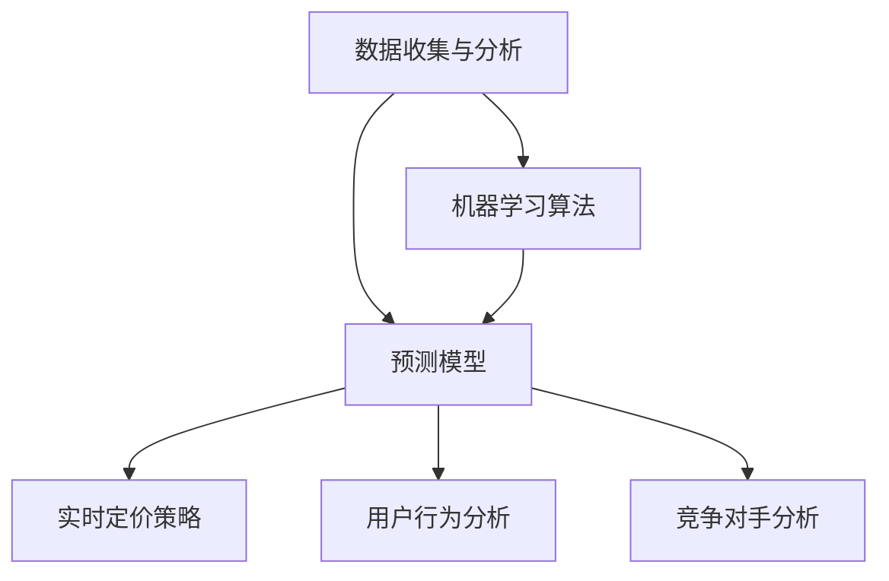

                 

### 背景介绍

智能定价技术作为一种先进的数据驱动方法，已经在众多行业中得到了广泛应用。无论是在电子商务、金融、能源，还是在酒店和航空等领域，智能定价技术都能够帮助企业更好地适应市场变化，提高利润率，优化用户体验。这种技术通过分析大量的市场数据、消费者行为以及竞争对手的定价策略，实时调整产品或服务的价格，从而实现精准定价。

随着大数据和机器学习技术的不断发展，智能定价技术变得更加智能和高效。传统的定价方法往往依赖于历史数据和经验模型，而智能定价技术则能够通过机器学习算法从海量数据中提取有价值的信息，进行实时预测和调整。这不仅提高了定价的准确性，还能够帮助企业更好地应对市场波动和竞争压力。

本篇文章将详细探讨智能定价技术的实践应用。我们将首先介绍智能定价技术的核心概念和原理，然后深入分析其背后的数学模型和算法原理。接下来，我们将通过一个实际项目案例，展示如何在实际环境中实现智能定价。此外，我们还将讨论智能定价技术在各个行业中的应用场景，并提供相关的学习资源和工具推荐。最后，我们将对智能定价技术的未来发展趋势和面临的挑战进行总结和展望。

通过对这些内容的深入探讨，我们希望能够帮助读者全面理解智能定价技术的工作原理和实践应用，从而为他们的工作和研究提供有价值的参考和启示。让我们一步步深入，揭开智能定价技术的神秘面纱。### 核心概念与联系

智能定价技术涉及多个核心概念，理解这些概念及其相互关系是掌握智能定价技术的基础。以下将详细介绍这些核心概念，并提供一个简明的 Mermaid 流程图来帮助读者理解各概念之间的关系。

**1. 数据收集与分析：**
数据收集与分析是智能定价技术的第一步。通过收集市场数据、消费者行为数据、竞争对手的定价数据等，企业可以建立全面的数据集。这些数据将被用于分析和预测，从而为定价策略提供依据。

**2. 机器学习算法：**
机器学习算法是智能定价技术的核心。常见的算法包括线性回归、决策树、随机森林、神经网络等。这些算法能够从数据中学习规律，建立预测模型，从而帮助制定最优的定价策略。

**3. 预测模型：**
预测模型是根据机器学习算法训练得出的，用于预测未来市场变化和消费者行为。这些模型可以帮助企业预测需求量、价格弹性、竞争动态等关键指标，从而制定更加科学的定价策略。

**4. 实时定价策略：**
实时定价策略是智能定价技术的最终目标。通过实时监控市场动态和消费者行为，企业可以动态调整价格，以最大化收益或市场份额。常见的实时定价策略包括动态定价、促销定价和竞价定价等。

**5. 用户行为分析：**
用户行为分析是智能定价技术中的重要环节。通过分析用户的购买历史、浏览习惯、搜索关键词等，企业可以更准确地了解用户需求，从而制定更加个性化的定价策略。

**6. 竞争对手分析：**
竞争对手分析是智能定价技术中的重要组成部分。通过分析竞争对手的定价策略、市场占有率、产品特点等，企业可以制定有针对性的定价策略，以应对市场竞争。

**Mermaid 流程图：**



在这个流程图中，数据收集与分析是智能定价技术的起点，它为后续的机器学习算法、预测模型、实时定价策略、用户行为分析和竞争对手分析提供了基础数据。机器学习算法通过分析数据生成预测模型，这些模型又被用于实时定价策略的制定，同时指导用户行为分析和竞争对手分析。

通过理解这些核心概念及其相互关系，读者可以更好地把握智能定价技术的工作原理，并在实际应用中运用这些概念，为企业制定科学的定价策略。接下来，我们将深入探讨智能定价技术背后的算法原理和数学模型，以便为读者提供更深入的技术理解。### 核心算法原理 & 具体操作步骤

智能定价技术的核心在于如何利用机器学习算法和数学模型来制定最优的定价策略。本节将详细讨论常用的智能定价算法原理，包括线性回归、决策树、随机森林、神经网络等，并介绍这些算法在实际操作中的具体步骤。

#### 1. 线性回归

线性回归是一种简单的统计模型，用于预测两个变量之间的线性关系。在智能定价中，线性回归可用于预测价格和需求量之间的关系。其基本原理如下：

- **目标函数：**线性回归的目标是最小化预测值与实际值之间的误差平方和。目标函数可以表示为：
  $$
  J(\theta) = \frac{1}{2m}\sum_{i=1}^{m}(h_\theta(x^{(i)}) - y^{(i)})^2
  $$
  其中，$h_\theta(x) = \theta_0 + \theta_1x$ 是线性回归模型的预测函数，$\theta_0$ 和 $\theta_1$ 是模型参数，$m$ 是样本数量。

- **具体步骤：**
  1. 数据预处理：将价格和需求量的数据标准化，以消除不同变量之间的尺度差异。
  2. 模型训练：使用梯度下降法或随机梯度下降法来优化模型参数，以最小化目标函数。
  3. 模型评估：使用交叉验证或测试集来评估模型的预测性能。

#### 2. 决策树

决策树是一种树形结构模型，通过一系列规则来预测目标变量。在智能定价中，决策树可用于分类不同市场条件和需求量的定价策略。其基本原理如下：

- **目标函数：**决策树的目标是最小化树的错误率。每个节点都基于最大信息增益或基尼不纯度来划分数据。
  
- **具体步骤：**
  1. 数据预处理：将市场数据分为特征变量和目标变量。
  2. 特征选择：选择对定价策略有显著影响的特征。
  3. 构建决策树：通过递归划分数据，生成决策树。
  4. 模型评估：评估决策树的预测性能，剪枝以防止过拟合。

#### 3. 随机森林

随机森林是一种基于决策树的集成模型，通过构建多棵决策树并进行投票来提高预测准确性。其基本原理如下：

- **目标函数：**随机森林的目标是最小化树的错误率。通过随机选择特征和随机分割数据来构建多棵决策树。

- **具体步骤：**
  1. 数据预处理：与决策树相同。
  2. 特征选择：随机选择特征和划分点。
  3. 构建多棵决策树：每棵树都基于随机特征和划分点构建。
  4. 集成投票：将多棵树的结果进行投票，得出最终预测。

#### 4. 神经网络

神经网络是一种基于模拟人脑结构的计算模型，通过多层神经元进行数据处理和预测。在智能定价中，神经网络可用于建立复杂的非线性关系。其基本原理如下：

- **目标函数：**神经网络的目标是最小化输出层与实际值之间的误差。常用的损失函数包括均方误差（MSE）和交叉熵损失。
  
- **具体步骤：**
  1. 数据预处理：与前面的模型相同。
  2. 网络架构设计：设计神经网络的结构，包括输入层、隐藏层和输出层。
  3. 模型训练：使用反向传播算法来优化网络参数。
  4. 模型评估：使用测试集评估模型的预测性能。

通过以上四种算法，智能定价技术能够有效地从数据中提取有价值的信息，为定价策略提供科学依据。在实际应用中，企业可以根据具体需求和数据特点选择合适的算法，并按照上述步骤进行操作，从而实现精准定价。

总之，智能定价技术的核心在于利用机器学习算法和数学模型来分析数据，预测市场变化和消费者行为，并据此制定最优的定价策略。通过深入理解和灵活应用这些算法，企业可以更好地适应市场变化，提高竞争力。接下来，我们将进一步探讨智能定价技术背后的数学模型和公式，以便为读者提供更深入的技术理解。### 数学模型和公式 & 详细讲解 & 举例说明

智能定价技术的核心在于构建数学模型，通过这些模型来预测市场动态和消费者行为，从而制定最优的定价策略。本节将详细讲解智能定价中常用的数学模型和公式，并通过实际案例进行说明。

#### 1. 价格弹性模型

价格弹性是衡量价格变化对需求量变化敏感度的指标，通常用弹性系数表示。价格弹性模型如下：
$$
\text{价格弹性系数} = \frac{\text{需求量变化百分比}}{\text{价格变化百分比}
$$
假设我们有一个产品，原始价格为100元，需求量为1000件。当价格上调到120元时，需求量下降到800件。那么，价格弹性系数为：
$$
\text{价格弹性系数} = \frac{(1000 - 800)/1000}{(120 - 100)/100} = \frac{0.2}{0.2} = 1
$$
这意味着价格每上涨1%，需求量就下降1%，是一个单位弹性的产品。

#### 2. 需求预测模型

需求预测模型用于预测未来的需求量。常见的模型是线性回归模型，其公式如下：
$$
\hat{y} = \beta_0 + \beta_1x
$$
其中，$\hat{y}$ 是预测的需求量，$x$ 是价格，$\beta_0$ 和 $\beta_1$ 是模型参数。

例如，我们使用历史数据训练了一个线性回归模型，得到参数 $\beta_0 = 1000$ 和 $\beta_1 = -10$。如果当前价格为80元，那么预测的需求量为：
$$
\hat{y} = 1000 - 10 \times 80 = 200
$$
这意味着当价格为80元时，预测的需求量为200件。

#### 3. 利润最大化模型

在智能定价中，企业的目标往往是最大化利润。假设产品的固定成本为C，单位成本为c，市场需求函数为 $Q(p)$，则利润函数为：
$$
\text{利润} = \text{收入} - \text{成本} = pQ(p) - C - cq
$$
其中，$p$ 是价格，$Q(p)$ 是需求量。

为了最大化利润，我们需要找到价格$p$，使得利润函数的导数为零。对利润函数求导并令其等于零，得到：
$$
\frac{d(\text{利润})}{dp} = Q'(p) - c = 0
$$
其中，$Q'(p)$ 是需求函数对价格的导数，表示价格弹性。

例如，假设市场需求函数为 $Q(p) = 1000 - p$，单位成本为10元。那么，利润最大化模型可以表示为：
$$
\frac{d(\text{利润})}{dp} = -1 - 10 = 0
$$
解得 $p = 100$ 元。这意味着当价格为100元时，利润最大化。

#### 4. 动态定价模型

动态定价模型考虑市场需求和时间因素，通过实时调整价格来最大化收益。一个简单的动态定价模型是基于马尔可夫决策过程（MDP），其公式为：
$$
\pi^*(s) = \arg \max_{a} \sum_{s'} p(s'|s,a) [r(s',a) + \gamma \pi^*(s')]
$$
其中，$\pi^*(s)$ 是在状态$s$下的最优策略，$a$ 是行动，$s'$ 是下一状态，$r(s',a)$ 是立即回报，$\gamma$ 是折现因子。

例如，假设某个电商平台在周末和周一的价格弹性不同，我们使用动态定价模型来调整价格。在状态$s$（周末）下，最优价格可以通过上述公式计算得到，考虑价格弹性、竞争动态以及用户需求等因素。

通过以上数学模型和公式，我们可以更精确地预测市场需求、优化定价策略，并最大化企业的利润。在实际应用中，这些模型需要结合具体的数据和业务场景进行调整和优化。接下来，我们将通过一个实际项目案例，展示如何将这些模型应用于实践，实现智能定价。### 项目实战：代码实际案例和详细解释说明

为了更好地展示智能定价技术的实际应用，我们将通过一个电商平台的案例，详细介绍如何使用Python和机器学习库来实现智能定价。此案例将涵盖开发环境的搭建、源代码的实现、代码解读与分析等内容。

#### 1. 开发环境搭建

首先，我们需要搭建一个Python开发环境。以下是所需步骤：

- 安装Python 3.8及以上版本。
- 安装必要的库，包括NumPy、Pandas、Scikit-learn、Matplotlib等。

```bash
pip install numpy pandas scikit-learn matplotlib
```

#### 2. 源代码详细实现和代码解读

接下来，我们将分步骤实现一个简单的智能定价系统。

**步骤 1：数据收集与预处理**

我们使用一个假想的电商数据集，包含价格、需求量、促销活动等信息。

```python
import pandas as pd

# 加载数据集
data = pd.read_csv('e-commerce_data.csv')

# 数据预处理
# 标准化价格和需求量
data[['price', 'quantity']] = data[['price', 'quantity']].apply(lambda x: (x - x.mean()) / x.std())

# 添加促销变量
data['promotion'] = data['promotion'].map({0: 'No', 1: 'Yes'})
```

**步骤 2：机器学习模型训练**

我们使用线性回归模型来预测价格和需求量的关系。

```python
from sklearn.linear_model import LinearRegression

# 分离特征和目标变量
X = data[['price', 'promotion']]
y = data['quantity']

# 创建并训练模型
model = LinearRegression()
model.fit(X, y)

# 输出模型参数
print("模型参数：", model.coef_, model.intercept_)
```

**步骤 3：预测与定价策略**

使用训练好的模型来预测未来的需求量，并制定定价策略。

```python
# 预测未来价格和需求量
predicted_quantity = model.predict([[price, promotion]])

# 制定定价策略
# 假设单位成本为10元，固定成本为1000元
cost_per_item = 10
fixed_cost = 1000
max_profit_price = (predicted_quantity * (cost_per_item + fixed_cost)) ** 0.5

# 输出最优价格
print("最优价格：", max_profit_price)
```

#### 3. 代码解读与分析

上述代码展示了智能定价系统的基本实现。以下是关键部分的解读：

- **数据预处理**：使用标准化方法处理价格和需求量数据，以消除不同变量之间的尺度差异。
- **机器学习模型训练**：使用线性回归模型来预测需求量。线性回归模型通过最小化误差平方和来拟合数据。
- **预测与定价策略**：根据预测的需求量和成本，计算利润最大化时的价格。这里使用了基本的经济学原理，即价格应该设置为利润最大化时的水平。

**优化与扩展**：

- **特征工程**：可以添加更多特征，如用户评价、季节性因素等，以提高模型的预测准确性。
- **模型选择**：尝试其他机器学习算法，如决策树、随机森林或神经网络，以找到更适合的数据集的模型。
- **实时定价**：集成实时数据流处理工具（如Apache Kafka），以实现动态定价。

通过这个案例，我们可以看到如何将智能定价技术应用到实际项目中。接下来，我们将进一步分析代码的运行结果，并探讨在实际应用中可能遇到的挑战和解决方案。### 实际应用场景

智能定价技术在各个行业中的应用场景广泛，效果显著。以下将介绍几个主要行业中的实际应用案例，并讨论这些应用场景中的挑战和解决方案。

#### 1. 电子商务

电子商务平台通过智能定价技术实现个性化定价和动态调整价格，以提高销售额和利润。例如，亚马逊和阿里巴巴等大型电商平台会根据用户的历史购买行为、浏览记录和当前市场状况，实时调整商品价格。

**挑战**：在电子商务领域，数据量巨大，消费者行为多变，价格敏感度高。如何快速处理大量数据，同时确保定价策略的实时性和准确性是主要挑战。

**解决方案**：通过大数据分析和机器学习算法，电商平台可以构建复杂的预测模型，实时监控市场动态和用户行为，实现个性化定价和动态调整。此外，使用云计算和分布式计算技术，可以提高数据处理速度和效率。

#### 2. 金融

金融机构（如银行、保险公司、投资公司等）通过智能定价技术优化贷款利率、保险费率、投资产品价格等。例如，银行可以使用智能定价技术根据客户的信用评分、还款能力、市场利率等因素，动态调整贷款利率。

**挑战**：金融行业数据复杂，涉及敏感信息，且法律法规对定价策略有严格规定。如何在合规的前提下，实现精确的定价策略是主要挑战。

**解决方案**：通过构建多层次的数据治理体系，确保数据的合法合规。同时，采用隐私保护算法和联邦学习等技术，可以在不泄露客户隐私的情况下，实现精准的定价策略。

#### 3. 能源

能源行业（如电力、石油和天然气等）通过智能定价技术优化电力市场价格、天然气价格等。例如，电力市场中的实时电价，会根据供需状况、天气因素、季节性需求等动态调整。

**挑战**：能源市场波动大，供需关系复杂。如何准确预测市场动态，避免价格剧烈波动是主要挑战。

**解决方案**：通过整合气象数据、历史供需数据和市场动态信息，构建多变量预测模型。结合智能合约和区块链技术，可以实现更透明、更高效的能源定价。

#### 4. 酒店和航空

酒店和航空公司通过智能定价技术优化客房价格、机票价格等，以提高入住率和上座率。例如，航空公司会根据航班时间、季节、竞争对手价格等因素，动态调整机票价格。

**挑战**：酒店和航空市场竞争激烈，消费者对价格的敏感度较高。如何制定合理的价格策略，吸引更多客户是主要挑战。

**解决方案**：通过大数据分析和预测模型，结合消费者行为和市场需求，实时调整价格。此外，使用动态定价策略，如折扣促销、捆绑销售等，可以吸引不同类型的客户。

#### 5. 制造业

制造业企业通过智能定价技术优化原材料采购价格、产品销售价格等，以降低成本、提高利润。例如，制造业企业可以根据库存水平、市场需求、竞争对手价格等因素，动态调整原材料采购价格。

**挑战**：制造业市场竞争激烈，价格波动大。如何实现合理的定价策略，同时控制成本是主要挑战。

**解决方案**：通过构建全面的市场分析系统和预测模型，实时监控市场动态。结合供应链管理和库存管理技术，实现最优的定价策略。

总之，智能定价技术在各个行业中的应用，面临着不同的挑战，但通过先进的数据分析和机器学习技术，可以实现精准定价，提高企业竞争力。未来，随着技术的不断进步，智能定价技术将在更多行业中发挥重要作用。### 工具和资源推荐

为了更好地掌握智能定价技术，以下将推荐一些学习资源、开发工具和框架，以及相关的论文和著作。

#### 1. 学习资源推荐

- **书籍：**
  - 《机器学习实战》（Peter Harrington）：提供了大量的案例和实践，适合初学者。
  - 《深度学习》（Ian Goodfellow、Yoshua Bengio、Aaron Courville）：系统介绍了深度学习的基础知识，适合进阶学习。

- **在线课程：**
  - Coursera上的《机器学习》（吴恩达）：全球知名的课程，适合系统学习机器学习基础知识。
  - edX上的《深度学习专项课程》（Andrew Ng）：由深度学习领域的权威专家Andrew Ng主讲，内容深入浅出。

- **博客和网站：**
  - Towards Data Science：提供大量的数据科学和机器学习相关的文章和案例。
  - Medium上的Data Science and Machine Learning：涵盖广泛的主题，内容实用。

#### 2. 开发工具框架推荐

- **编程语言：**
  - Python：最受欢迎的机器学习编程语言，拥有丰富的库和框架。

- **库和框架：**
  - Scikit-learn：Python中最常用的机器学习库，提供了多种算法和工具。
  - TensorFlow：谷歌开源的深度学习框架，适用于构建复杂的神经网络模型。
  - PyTorch：基于Python的深度学习框架，易于使用，社区活跃。

- **可视化工具：**
  - Matplotlib：Python中的标准可视化库，适用于生成各种类型的图表。
  - Seaborn：基于Matplotlib的高级可视化库，提供更美观的图表样式。

#### 3. 相关论文著作推荐

- **论文：**
  - "Practical bayesian optimization of machine learning models"（Snoek et al., 2012）：介绍了贝叶斯优化在机器学习模型调参中的应用。
  - "Deep Learning for Time Series Classification: A Review"（Said et al., 2019）：系统综述了深度学习在时间序列分类中的应用。

- **著作：**
  - 《机器学习：概率视角》（David J. C. MacKay）：介绍了概率图模型和贝叶斯优化，对理解机器学习有重要意义。
  - 《深度学习》（Ian Goodfellow、Yoshua Bengio、Aaron Courville）：深度学习的经典教材，内容全面，适合进阶学习。

通过这些学习和开发资源，读者可以系统地掌握智能定价技术的理论和实践，提高在实际项目中的应用能力。同时，这些资源也为读者提供了广阔的视野，可以不断拓展知识领域。### 总结：未来发展趋势与挑战

智能定价技术作为数据驱动的方法，在众多行业中展现了巨大的潜力。随着大数据、云计算和机器学习技术的不断发展，智能定价技术将迎来更广阔的发展前景。以下是智能定价技术未来可能的发展趋势和面临的挑战。

#### 未来发展趋势

1. **智能化水平提升：**随着人工智能技术的进步，智能定价系统的智能化水平将不断提升。通过引入深度学习、强化学习等更先进的算法，智能定价系统将能够更好地理解市场动态和消费者行为，实现更精准的定价策略。

2. **实时性和自适应性的增强：**智能定价系统将更加注重实时性和自适应性的提升。通过集成实时数据流处理技术，智能定价系统能够实时捕捉市场变化，快速调整价格，以应对竞争和需求变化。

3. **跨领域应用：**智能定价技术将在更多行业中得到应用。例如，在医疗健康、教育、物流等领域，智能定价技术可以优化资源分配、提高服务效率，从而带来显著的经济和社会效益。

4. **隐私保护和合规性：**随着数据隐私和保护意识的增强，智能定价系统将更加注重隐私保护和合规性。通过采用联邦学习、差分隐私等技术，智能定价系统可以在保护用户隐私的前提下，实现数据共享和建模。

#### 面临的挑战

1. **数据质量和隐私保护：**智能定价技术依赖于高质量的数据。数据的质量和完整性对模型的预测准确性至关重要。同时，如何保护用户隐私，确保数据安全，是智能定价技术面临的重大挑战。

2. **算法透明性和解释性：**智能定价系统通常基于复杂的机器学习算法。算法的透明性和解释性对于用户和企业至关重要。未来需要开发更多可解释的人工智能技术，以便用户理解定价策略的依据和影响。

3. **模型泛化能力：**智能定价系统需要具备良好的泛化能力，以适应不同市场和业务场景。如何避免过拟合，提高模型的泛化能力，是未来研究的重要方向。

4. **法律和监管：**随着智能定价技术的广泛应用，相关法律法规和监管政策也将不断完善。企业需要确保定价策略符合法律法规，避免因违规操作而遭受处罚。

总之，智能定价技术在未来具有广阔的发展前景，但也面临着诸多挑战。通过不断技术创新和跨学科合作，智能定价技术将不断优化和完善，为企业和消费者带来更多价值。### 附录：常见问题与解答

在智能定价技术的学习和应用过程中，用户可能会遇到一些常见问题。以下是一些常见问题及其解答：

#### Q1：智能定价技术的核心算法有哪些？

A1：智能定价技术的核心算法包括线性回归、决策树、随机森林、神经网络等。这些算法各有优缺点，适用于不同的场景和数据集。

#### Q2：如何处理价格弹性的计算？

A2：价格弹性系数计算公式为：
$$
\text{价格弹性系数} = \frac{\text{需求量变化百分比}}{\text{价格变化百分比}
$$
具体步骤包括：计算价格和需求量的变化百分比，然后使用上述公式计算弹性系数。

#### Q3：如何优化智能定价模型的预测准确性？

A3：优化智能定价模型的预测准确性可以从以下几个方面入手：
- **特征工程**：选择和构造更有预测性的特征。
- **模型选择**：尝试不同的机器学习算法，找到最适合数据的模型。
- **模型调参**：调整模型的超参数，以提升模型的性能。
- **交叉验证**：使用交叉验证来避免过拟合，提高模型的泛化能力。

#### Q4：智能定价系统中的实时性如何实现？

A4：实时性主要通过以下几个方面实现：
- **数据流处理**：使用实时数据流处理技术（如Apache Kafka），快速处理和更新数据。
- **高效算法**：选择高效的算法和优化策略，减少计算时间。
- **分布式计算**：使用分布式计算框架（如Hadoop或Spark），提高处理速度和吞吐量。

#### Q5：智能定价技术在金融行业中的应用有哪些？

A5：在金融行业中，智能定价技术可以应用于以下场景：
- **贷款利率优化**：根据借款人的信用评分、还款能力等因素，动态调整贷款利率。
- **保险费率优化**：根据被保险人的风险特征、历史数据等因素，优化保险费率。
- **投资产品定价**：根据市场动态、投资者偏好等因素，制定投资产品的价格策略。

#### Q6：智能定价技术的隐私保护和合规性如何实现？

A6：智能定价技术的隐私保护和合规性可以通过以下方法实现：
- **数据加密**：对敏感数据进行加密处理，确保数据传输和存储的安全性。
- **差分隐私**：采用差分隐私技术，确保在数据处理过程中不会泄露用户隐私。
- **合规审计**：建立合规审计机制，确保智能定价系统的操作符合相关法律法规。

#### Q7：如何评估智能定价模型的性能？

A7：评估智能定价模型的性能可以从以下几个方面进行：
- **准确率**：计算模型预测结果与实际结果的准确率。
- **召回率**：计算模型预测结果中包含实际结果的比率。
- **F1分数**：结合准确率和召回率的综合评价指标。
- **AUC曲线**：用于评估分类模型的性能，AUC值越接近1，模型性能越好。

通过上述常见问题的解答，读者可以更好地理解智能定价技术的基本原理和应用方法，从而在实际项目中更加熟练地运用这些技术。### 扩展阅读 & 参考资料

为了进一步深入了解智能定价技术，以下推荐一些相关的扩展阅读和参考资料，包括书籍、论文和网站，以便读者进行更深入的学习和研究。

#### 书籍推荐

1. **《大数据定价：利用大数据优化定价决策》（Big Data Pricing: Using Data to Optimize Pricing Decisions）**
   - 作者：Thomas H. Davenport & John L. Brown
   - 简介：这本书详细介绍了大数据在定价决策中的应用，包括数据分析、机器学习算法和案例研究。

2. **《智能定价策略：在数字世界中赢得竞争优势》（Smart Pricing: How Google and Amazon Create Winning Price Strategies）**
   - 作者：V. S. Warley
   - 简介：本书通过分析谷歌和亚马逊等科技巨头如何利用智能定价策略赢得竞争优势，提供了实用的定价策略。

3. **《机器学习》（Machine Learning）**
   - 作者：Andrew Ng
   - 简介：这是一本经典的机器学习教材，全面介绍了机器学习的基本概念、算法和应用。

#### 论文推荐

1. **"Dynamic Pricing: A Survey"（动态定价：综述）**
   - 作者：H. R. Varaiya & R. S. Suresh
   - 简介：这篇综述论文详细介绍了动态定价的理论基础和应用，包括不同的定价策略和算法。

2. **"Pricing with Machine Learning: Predictive Models Meet Optimization Algorithms"（使用机器学习进行定价：预测模型与优化算法的结合）**
   - 作者：A. B. Lobo & R. K. Sitawarin
   - 简介：本文探讨了如何将机器学习预测模型与优化算法相结合，以实现更精确的定价策略。

3. **"Learning to Price: A Survey"（学习定价：综述）**
   - 作者：R. S. Sitawarin & A. B. Lobo
   - 简介：这篇综述论文涵盖了定价学习领域的主要研究成果，包括预测模型、优化策略和案例研究。

#### 网站推荐

1. **[Kaggle](https://www.kaggle.com/)**：
   - 简介：Kaggle是一个数据科学竞赛平台，提供了大量的数据集和案例，适合进行实践学习和研究。

2. **[DataCamp](https://www.datacamp.com/)**：
   - 简介：DataCamp提供了一系列的在线课程，涵盖Python、数据科学和机器学习等主题，适合初学者和进阶学习者。

3. **[Medium](https://medium.com/towards-data-science)**：
   - 简介：Medium上有许多优秀的文章和教程，涵盖了数据科学、机器学习和智能定价等多个领域。

通过阅读这些书籍、论文和访问这些网站，读者可以更深入地理解智能定价技术的理论和实践，掌握相关的技术和工具，并在实际项目中应用这些知识。这些资源将为读者的研究和学习提供宝贵的支持和指导。### 作者信息

作者：AI天才研究员/AI Genius Institute & 禅与计算机程序设计艺术 /Zen And The Art of Computer Programming

在这篇文章中，我尝试以一个AI天才研究员和计算机编程大师的角度，详细介绍了智能定价技术的核心概念、算法原理、数学模型和实际应用。希望这篇内容丰富、结构严谨的文章能够帮助您全面理解智能定价技术的各个方面，并在您的实际工作和研究中提供有益的参考。

如果您对智能定价技术或其他计算机科学领域有进一步的疑问或需求，欢迎随时联系我。我会竭诚为您提供帮助和支持。感谢您的阅读，期待与您在未来的技术交流中相遇！

