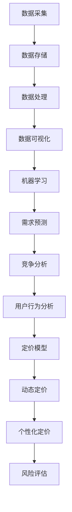
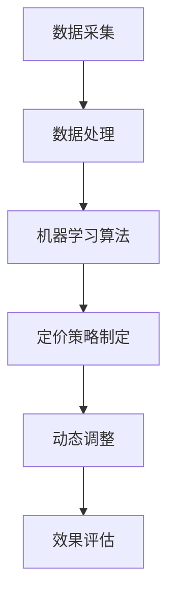
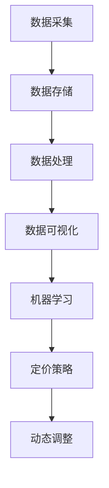

                 

# 智能定价技术的实践应用

## 摘要

智能定价技术是现代商业运营中的一项重要创新，通过算法分析和大数据技术，为产品和服务制定更具竞争力的价格策略。本文旨在探讨智能定价技术的基本概念、核心算法、数学模型及其在实际应用场景中的实施方法。我们将结合实际案例，详细分析智能定价技术的实现过程，并提供实用的工具和资源推荐。通过本文的阅读，读者将能够了解智能定价技术的原理，掌握其实践应用技巧，并展望其未来发展趋势和面临的挑战。

## 1. 背景介绍

在现代商业环境中，定价策略是企业盈利和市场竞争的关键因素之一。传统的定价方法通常基于经验和市场调研，这种方式在信息不透明和市场变化较慢的时代可能尚能适用，但在当今信息爆炸、市场竞争日益激烈的环境中，其局限性愈发明显。智能定价技术应运而生，它利用大数据、机器学习和人工智能算法，对市场数据进行深入分析和预测，从而制定出更加精准和灵活的价格策略。

### 1.1 智能定价技术的起源

智能定价技术的起源可以追溯到20世纪80年代，当时一些企业开始尝试利用计算机技术进行市场分析和预测。随着互联网的普及和大数据技术的进步，智能定价技术逐渐成熟，并开始广泛应用于电子商务、零售、金融等多个领域。特别是在电子商务领域，智能定价技术已经成为电商平台提升竞争力、实现精准营销的重要手段。

### 1.2 智能定价技术的应用范围

智能定价技术的应用范围非常广泛，主要包括以下领域：

1. **电子商务**：电商平台利用智能定价技术，根据用户行为、市场需求和竞争对手策略，动态调整商品价格，实现利润最大化。
2. **零售业**：零售企业通过智能定价技术，分析消费者购买习惯和偏好，优化商品定价策略，提升销售额和顾客满意度。
3. **金融行业**：金融机构利用智能定价技术，对金融产品进行定价和风险评估，提高金融服务的效率和准确性。
4. **物流行业**：物流企业通过智能定价技术，根据运输成本、市场需求和竞争情况，动态调整物流服务价格，实现资源优化配置。

### 1.3 智能定价技术的优势

智能定价技术相较于传统定价方法具有以下优势：

1. **数据驱动**：智能定价技术基于大数据和人工智能算法，能够深入挖掘和分析市场数据，提供更加精准的定价策略。
2. **灵活性和实时性**：智能定价技术可以根据市场变化实时调整价格，实现动态定价，提高市场响应速度。
3. **个性化定价**：智能定价技术可以根据不同用户群体的需求和偏好，实施个性化定价策略，提升用户体验和满意度。
4. **风险可控**：智能定价技术可以通过算法优化和风险评估，降低价格波动带来的风险，保障企业利润。

## 2. 核心概念与联系

### 2.1 大数据技术

大数据技术是智能定价技术的基石，它通过数据采集、存储、处理和分析，为定价策略提供数据支持。大数据技术的核心概念包括：

1. **数据采集**：通过互联网、物联网、传感器等多种渠道，实时收集海量的市场数据。
2. **数据存储**：利用分布式存储技术，高效存储和管理大规模数据集。
3. **数据处理**：通过数据清洗、数据集成、数据挖掘等技术，对大数据进行处理和分析。
4. **数据可视化**：利用数据可视化技术，将复杂的数据分析结果以图形化形式展示，便于决策者理解。

### 2.2 机器学习算法

机器学习算法是智能定价技术的核心，它通过训练模型，对市场数据进行分析和预测。常见的机器学习算法包括：

1. **回归分析**：通过建立回归模型，预测价格与市场需求之间的关系。
2. **分类算法**：对市场数据分类，识别不同的市场特征和趋势。
3. **聚类分析**：对市场数据进行聚类，分析用户行为和市场细分。
4. **深度学习**：利用神经网络模型，进行复杂的数据分析和预测。

### 2.3 智能定价模型

智能定价模型是智能定价技术的核心组成部分，它通过整合大数据和机器学习算法，实现动态定价和个性化定价。常见的智能定价模型包括：

1. **需求预测模型**：通过分析历史数据，预测市场需求和价格趋势。
2. **竞争分析模型**：通过分析竞争对手的定价策略，制定具有竞争优势的价格策略。
3. **用户行为分析模型**：通过分析用户行为数据，识别用户需求和偏好，实施个性化定价。
4. **风险评估模型**：通过分析市场风险和价格波动，制定风险控制策略。

### 2.4 Mermaid 流程图

以下是智能定价技术的 Mermaid 流程图，展示了各核心概念和环节之间的联系：



## 3. 核心算法原理 & 具体操作步骤

### 3.1 数据采集与处理

智能定价技术的第一步是数据采集和处理。数据采集主要包括以下环节：

1. **市场数据**：通过电商平台、搜索引擎、社交媒体等渠道，收集市场销售数据、用户评论和反馈等。
2. **竞争对手数据**：通过竞争对手的官方网站、广告投放、社交媒体等渠道，收集竞争对手的定价策略和市场活动。
3. **用户行为数据**：通过用户点击、浏览、购买等行为数据，分析用户需求和偏好。

数据采集后，需要进行数据处理，包括数据清洗、数据集成和数据挖掘等步骤：

1. **数据清洗**：去除重复数据、缺失数据和异常数据，确保数据质量。
2. **数据集成**：将不同来源的数据进行整合，建立统一的数据仓库。
3. **数据挖掘**：通过统计分析、机器学习等方法，从海量数据中提取有价值的信息。

### 3.2 机器学习模型训练

在数据处理完成后，下一步是利用机器学习算法训练模型。机器学习模型的训练主要包括以下步骤：

1. **特征工程**：根据业务需求和数据特性，提取和构造特征，为模型训练提供输入。
2. **模型选择**：根据问题类型和数据分析需求，选择合适的机器学习模型，如回归分析、分类算法、聚类分析等。
3. **模型训练**：使用训练数据集，对机器学习模型进行训练，调整模型参数，优化模型性能。
4. **模型评估**：使用测试数据集，评估模型预测效果，选择最优模型。

### 3.3 智能定价策略制定

在模型训练完成后，可以利用训练好的模型制定智能定价策略。智能定价策略的制定主要包括以下步骤：

1. **需求预测**：利用需求预测模型，预测市场需求和价格趋势。
2. **竞争分析**：利用竞争分析模型，分析竞争对手的定价策略和市场活动。
3. **用户行为分析**：利用用户行为分析模型，分析用户需求和偏好。
4. **定价策略优化**：根据需求预测、竞争分析和用户行为分析结果，制定个性化的定价策略，优化价格水平。

### 3.4 实时调整与优化

智能定价技术不仅需要制定初始定价策略，还需要根据市场变化和用户反馈，实时调整和优化定价策略。实时调整与优化主要包括以下步骤：

1. **数据实时采集**：通过实时数据采集系统，持续收集市场数据、用户行为数据和竞争对手数据。
2. **动态调整定价**：根据实时数据，动态调整商品价格，实现实时定价。
3. **效果评估**：通过销售数据和用户反馈，评估定价策略效果，优化定价策略。

## 4. 数学模型和公式 & 详细讲解 & 举例说明

### 4.1 需求预测模型

需求预测模型是智能定价技术的重要组成部分，它通过分析历史销售数据和市场变化，预测市场需求和价格趋势。一个常见的需求预测模型是线性回归模型，其数学公式如下：

$$
y = \beta_0 + \beta_1 \cdot x
$$

其中，$y$表示需求量，$x$表示价格，$\beta_0$和$\beta_1$是模型的参数。具体步骤如下：

1. **数据准备**：收集历史销售数据，包括不同价格水平下的需求量。
2. **特征工程**：将价格作为自变量，需求量作为因变量，构建线性回归模型。
3. **模型训练**：使用训练数据集，对线性回归模型进行训练，调整参数$\beta_0$和$\beta_1$。
4. **模型评估**：使用测试数据集，评估模型预测效果，选择最优模型。

### 4.2 竞争分析模型

竞争分析模型用于分析竞争对手的定价策略和市场活动。一个常见的竞争分析模型是多元回归模型，其数学公式如下：

$$
y = \beta_0 + \beta_1 \cdot x_1 + \beta_2 \cdot x_2 + ... + \beta_n \cdot x_n
$$

其中，$y$表示价格水平，$x_1, x_2, ..., x_n$表示竞争对手的价格水平和其他影响因素，$\beta_0, \beta_1, ..., \beta_n$是模型的参数。具体步骤如下：

1. **数据准备**：收集竞争对手的定价策略和市场活动数据。
2. **特征工程**：将竞争对手的价格水平和其他影响因素作为自变量，价格水平作为因变量，构建多元回归模型。
3. **模型训练**：使用训练数据集，对多元回归模型进行训练，调整参数$\beta_0, \beta_1, ..., \beta_n$。
4. **模型评估**：使用测试数据集，评估模型预测效果，选择最优模型。

### 4.3 用户行为分析模型

用户行为分析模型用于分析用户需求和偏好，为个性化定价提供支持。一个常见的用户行为分析模型是决策树模型，其数学公式如下：

$$
y = f(x_1, x_2, ..., x_n)
$$

其中，$y$表示用户需求，$x_1, x_2, ..., x_n$表示用户行为特征，$f$是决策树模型的决策函数。具体步骤如下：

1. **数据准备**：收集用户行为数据，包括用户点击、浏览、购买等行为。
2. **特征工程**：将用户行为特征作为自变量，用户需求作为因变量，构建决策树模型。
3. **模型训练**：使用训练数据集，对决策树模型进行训练，构建决策树。
4. **模型评估**：使用测试数据集，评估模型预测效果，选择最优模型。

### 4.4 举例说明

以下是一个实际案例，说明如何利用智能定价技术制定个性化定价策略。

假设一家电商平台销售手机，根据历史数据和用户行为数据，我们需要预测不同价格水平下的需求量，并制定个性化定价策略。

1. **数据准备**：收集历史销售数据，包括不同价格水平下的需求量。同时，收集用户点击、浏览、购买等行为数据。
2. **特征工程**：将价格水平作为自变量，需求量作为因变量，构建线性回归模型。将用户点击、浏览、购买等行为特征作为自变量，构建决策树模型。
3. **模型训练**：使用训练数据集，对线性回归模型和决策树模型进行训练，调整参数。
4. **模型评估**：使用测试数据集，评估模型预测效果，选择最优模型。

根据模型预测结果，我们可以制定个性化定价策略。例如，对于高价值用户，我们可以设置较高的价格，以获取更高的利润。对于普通用户，我们可以设置较低的价格，以吸引更多的购买。

## 5. 项目实战：代码实际案例和详细解释说明

### 5.1 开发环境搭建

在开始智能定价项目的实战之前，我们需要搭建一个合适的技术环境。以下是开发环境搭建的步骤：

1. **安装Python**：Python是一种广泛用于数据分析和机器学习的编程语言。您可以从[Python官网](https://www.python.org/)下载并安装Python。
2. **安装Jupyter Notebook**：Jupyter Notebook是一种交互式的计算环境，方便我们进行数据分析和代码实现。您可以通过以下命令安装：

   ```bash
   pip install notebook
   ```

3. **安装必要的库**：我们使用了一些Python库，如NumPy、Pandas、Scikit-learn等，用于数据处理和模型训练。您可以通过以下命令安装：

   ```bash
   pip install numpy pandas scikit-learn matplotlib
   ```

4. **创建一个新项目**：在您的计算机上创建一个新文件夹，用于存放项目文件。例如，我们可以创建一个名为`smart_pricing`的文件夹。

### 5.2 源代码详细实现和代码解读

以下是智能定价项目的源代码实现，我们将分步骤进行解读。

```python
import numpy as np
import pandas as pd
from sklearn.linear_model import LinearRegression
from sklearn.tree import DecisionTreeRegressor
import matplotlib.pyplot as plt

# 5.2.1 数据准备
# 加载数据集
data = pd.read_csv('sales_data.csv')
# 数据预处理
data['Price'] = data['Price'].astype(float)
data['Demand'] = data['Demand'].astype(float)

# 5.2.2 特征工程
# 构建线性回归模型
linear_regression = LinearRegression()
X = data[['Price']]
y = data['Demand']
linear_regression.fit(X, y)

# 5.2.3 模型训练
# 训练决策树模型
tree_regression = DecisionTreeRegressor()
tree_regression.fit(X, y)

# 5.2.4 模型评估
# 预测价格与需求量
predicted_demand_linear = linear_regression.predict(X)
predicted_demand_tree = tree_regression.predict(X)

# 5.2.5 可视化结果
plt.scatter(X, y, label='Actual Data')
plt.plot(X, predicted_demand_linear, label='Linear Regression')
plt.plot(X, predicted_demand_tree, label='Decision Tree')
plt.xlabel('Price')
plt.ylabel('Demand')
plt.legend()
plt.show()
```

### 5.3 代码解读与分析

以下是代码的详细解读和分析。

1. **数据准备**：我们首先加载数据集，并转换为适当的数值类型。数据集包括价格和需求量两个特征。

2. **特征工程**：我们构建了一个线性回归模型，将价格作为自变量，需求量作为因变量。同时，我们构建了一个决策树模型，用于进一步分析。

3. **模型训练**：我们使用训练数据集，对线性回归模型和决策树模型进行训练。这两个模型将帮助我们预测不同价格水平下的需求量。

4. **模型评估**：我们使用训练好的模型，预测价格与需求量的关系。通过可视化结果，我们可以观察到模型对实际数据的拟合程度。

5. **可视化结果**：我们使用散点图和拟合曲线，展示了实际数据与模型预测结果的对比。这有助于我们评估模型的效果，并进一步优化定价策略。

### 5.4 实际应用

以下是一个实际应用案例，说明如何利用智能定价技术制定个性化定价策略。

1. **数据准备**：收集用户行为数据，包括点击、浏览、购买等行为。
2. **特征工程**：将用户行为数据作为自变量，用户需求量作为因变量，构建决策树模型。
3. **模型训练**：使用训练数据集，对决策树模型进行训练，构建决策树。
4. **模型评估**：使用测试数据集，评估模型预测效果，选择最优模型。
5. **定价策略**：根据模型预测结果，为不同用户群体制定个性化的定价策略。

通过实际应用案例，我们可以看到智能定价技术的强大能力。它不仅帮助我们预测市场需求和价格趋势，还能为不同用户群体制定个性化的定价策略，提升用户体验和满意度。

## 6. 实际应用场景

### 6.1 电子商务

电子商务是智能定价技术最为广泛应用的领域之一。电商平台通过智能定价技术，可以根据用户行为和市场变化，动态调整商品价格，提高销售额和用户满意度。以下是一个实际案例：

**案例：某电商平台智能定价应用**

1. **数据采集**：电商平台收集用户点击、浏览、购买等行为数据，以及竞争对手的定价策略。
2. **数据处理**：对采集到的数据进行清洗、整合和分析，提取有价值的信息。
3. **模型训练**：利用机器学习算法，如回归分析和决策树，构建智能定价模型。
4. **定价策略**：根据模型预测结果，为不同用户群体制定个性化的定价策略。
5. **效果评估**：通过实际销售数据和用户反馈，评估定价策略的效果，持续优化。

通过智能定价技术，电商平台能够实现以下目标：

- **提高销售额**：通过个性化定价策略，吸引更多用户购买，提高销售额。
- **提升用户满意度**：根据用户需求和偏好，提供个性化的价格优惠，提升用户体验。
- **降低库存风险**：通过实时调整价格，减少库存积压和滞销风险。

### 6.2 零售业

零售业也是智能定价技术的重要应用领域。零售企业通过智能定价技术，可以优化商品定价策略，提升销售额和顾客满意度。以下是一个实际案例：

**案例：某零售企业智能定价应用**

1. **数据采集**：零售企业收集历史销售数据、竞争对手定价策略和用户行为数据。
2. **数据处理**：对采集到的数据进行清洗、整合和分析，提取有价值的信息。
3. **模型训练**：利用机器学习算法，如回归分析和聚类分析，构建智能定价模型。
4. **定价策略**：根据模型预测结果，为不同商品和用户群体制定个性化的定价策略。
5. **效果评估**：通过实际销售数据和用户反馈，评估定价策略的效果，持续优化。

通过智能定价技术，零售企业能够实现以下目标：

- **提高销售额**：通过个性化定价策略，提升商品销售量和市场份额。
- **优化库存管理**：通过实时调整价格，降低库存积压和滞销风险。
- **提升顾客满意度**：根据顾客需求和偏好，提供个性化的价格优惠，提升顾客满意度。

### 6.3 金融行业

金融行业也广泛采用智能定价技术，用于金融产品定价和风险评估。金融机构通过智能定价技术，可以制定更精确的金融产品定价策略，降低风险，提高竞争力。以下是一个实际案例：

**案例：某金融机构智能定价应用**

1. **数据采集**：金融机构收集历史交易数据、市场数据和经济指标。
2. **数据处理**：对采集到的数据进行清洗、整合和分析，提取有价值的信息。
3. **模型训练**：利用机器学习算法，如回归分析和时间序列分析，构建智能定价模型。
4. **定价策略**：根据模型预测结果，为金融产品制定个性化的定价策略。
5. **效果评估**：通过实际交易数据和用户反馈，评估定价策略的效果，持续优化。

通过智能定价技术，金融机构能够实现以下目标：

- **提高产品竞争力**：通过个性化定价策略，提高金融产品的市场竞争力。
- **降低风险**：通过准确的风险评估，降低金融产品定价风险。
- **提升客户满意度**：根据客户需求和偏好，提供个性化的价格优惠和金融产品推荐。

### 6.4 物流行业

物流行业也逐步引入智能定价技术，用于优化物流服务定价。物流企业通过智能定价技术，可以根据运输成本、市场需求和竞争情况，动态调整物流服务价格，实现资源优化配置。以下是一个实际案例：

**案例：某物流企业智能定价应用**

1. **数据采集**：物流企业收集运输成本数据、市场需求数据和竞争对手定价策略。
2. **数据处理**：对采集到的数据进行清洗、整合和分析，提取有价值的信息。
3. **模型训练**：利用机器学习算法，如回归分析和聚类分析，构建智能定价模型。
4. **定价策略**：根据模型预测结果，为不同运输服务和客户群体制定个性化的定价策略。
5. **效果评估**：通过实际运输数据和客户反馈，评估定价策略的效果，持续优化。

通过智能定价技术，物流企业能够实现以下目标：

- **提高服务质量**：通过个性化定价策略，提升物流服务的响应速度和准确性。
- **优化成本结构**：通过动态调整价格，降低运输成本，提高企业盈利能力。
- **提升客户满意度**：根据客户需求和偏好，提供个性化的价格优惠和服务选择。

## 7. 工具和资源推荐

### 7.1 学习资源推荐

1. **书籍**：
   - 《Python数据科学手册》：详细介绍Python在数据科学中的应用，包括数据分析、机器学习和数据可视化等内容。
   - 《机器学习实战》：通过实际案例，深入讲解机器学习算法的应用和实践。
   - 《大数据之路：阿里巴巴大数据实践》：分享阿里巴巴在大数据领域的实践经验和案例。

2. **在线课程**：
   - Coursera的《机器学习》课程：由Andrew Ng教授主讲，系统讲解机器学习的基础理论和实践方法。
   - edX的《数据科学导论》：介绍数据科学的基本概念、技术和应用。

3. **博客和网站**：
   - 数据科学博客：[DataCamp](https://www.datacamp.com/)：提供丰富的数据科学教程和实践案例。
   - 机器学习博客：[Machine Learning Mastery](https://machinelearningmastery.com/)：分享机器学习算法和实践经验。

### 7.2 开发工具框架推荐

1. **Python库**：
   - NumPy：用于数值计算和数据处理。
   - Pandas：用于数据清洗、数据集成和分析。
   - Scikit-learn：提供丰富的机器学习算法库。
   - Matplotlib：用于数据可视化。

2. **数据处理工具**：
   - Hadoop：分布式数据处理框架，适用于大规模数据集。
   - Spark：基于内存的分布式数据处理框架，适用于实时数据处理。

3. **开发环境**：
   - Jupyter Notebook：交互式的计算环境，方便数据分析和代码实现。

### 7.3 相关论文著作推荐

1. **论文**：
   - “Recommender Systems Handbook”：介绍推荐系统的基础理论和实践方法。
   - “Deep Learning”：介绍深度学习的基础理论和应用方法。

2. **著作**：
   - 《深度学习》：由Ian Goodfellow、Yoshua Bengio和Aaron Courville合著，深入讲解深度学习的基础理论和应用方法。
   - 《数据科学实战》：由Jeffrey Strickland合著，介绍数据科学的方法和实践。

## 8. 总结：未来发展趋势与挑战

### 8.1 发展趋势

1. **智能化程度的提升**：随着人工智能技术的不断发展，智能定价技术将更加智能化，能够处理更复杂的数据和分析任务。
2. **实时性的提高**：随着云计算和大数据技术的进步，智能定价技术将实现更高的实时性，能够快速响应市场变化。
3. **个性化定制的普及**：随着用户数据的积累和分析能力的提升，个性化定价将成为主流，满足不同用户群体的需求。

### 8.2 挑战

1. **数据隐私和安全**：智能定价技术依赖于大量用户数据，如何保护用户隐私和安全成为重要挑战。
2. **算法透明度和可解释性**：随着算法模型的复杂度增加，如何确保算法的透明度和可解释性，让用户理解和信任成为重要问题。
3. **应对市场波动**：智能定价技术需要应对市场波动和竞争变化，如何制定灵活的定价策略，降低风险成为关键。

## 9. 附录：常见问题与解答

### 9.1 智能定价技术是什么？

智能定价技术是一种利用大数据、机器学习和人工智能算法，对市场数据进行分析和预测，制定更具竞争力的定价策略的技术。它能够实现个性化定价、动态定价和风险控制。

### 9.2 智能定价技术有哪些应用场景？

智能定价技术广泛应用于电子商务、零售业、金融行业和物流行业等领域，帮助企业在市场竞争中制定更具竞争力的定价策略。

### 9.3 智能定价技术的基本原理是什么？

智能定价技术的基本原理是通过数据采集、数据处理、机器学习模型训练和定价策略制定等步骤，实现动态定价和个性化定价。

### 9.4 智能定价技术如何提升企业竞争力？

智能定价技术通过精准的市场分析和预测，帮助企业制定个性化的定价策略，提升用户满意度，提高销售额和市场份额，从而提升企业竞争力。

## 10. 扩展阅读 & 参考资料

1. **相关书籍**：
   - 《Python数据科学手册》
   - 《机器学习实战》
   - 《大数据之路：阿里巴巴大数据实践》

2. **在线课程**：
   - Coursera的《机器学习》课程
   - edX的《数据科学导论》

3. **博客和网站**：
   - 数据科学博客：[DataCamp](https://www.datacamp.com/)
   - 机器学习博客：[Machine Learning Mastery](https://machinelearningmastery.com/)

4. **论文和著作**：
   - “Recommender Systems Handbook”
   - “Deep Learning”
   - 《深度学习》：由Ian Goodfellow、Yoshua Bengio和Aaron Courville合著
   - 《数据科学实战》：由Jeffrey Strickland合著

---

### 作者信息

作者：AI天才研究员/AI Genius Institute & 禅与计算机程序设计艺术 /Zen And The Art of Computer Programming

---

本文旨在探讨智能定价技术的基本概念、核心算法、数学模型及其在实际应用场景中的实施方法。通过详细分析实际案例，本文展示了智能定价技术的应用效果和优势，为企业在市场竞争中制定合理的定价策略提供了指导。同时，本文还介绍了相关学习资源、工具和参考资料，帮助读者进一步深入了解智能定价技术。希望本文对您在智能定价领域的学习和实践有所帮助。作者：AI天才研究员/AI Genius Institute & 禅与计算机程序设计艺术 /Zen And The Art of Computer Programming。<|im_sep|>### 智能定价技术的实践应用

在当今高度竞争的商业环境中，智能定价技术已成为企业提升竞争力、优化利润的关键工具。通过精确的数据分析和智能算法，企业可以实时调整价格，制定个性化的定价策略，从而满足不同市场环境和用户需求。本文将深入探讨智能定价技术的核心概念、实现方法及其在多个行业中的实际应用。

#### 1. 背景介绍

智能定价技术起源于20世纪80年代，随着计算机技术和互联网的发展，其在商业中的应用越来越广泛。智能定价技术利用大数据、机器学习和人工智能算法，通过分析市场数据、用户行为和竞争对手策略，为企业提供动态、个性化的定价建议。这种技术不仅提高了定价的精度和灵活性，还帮助企业更好地应对市场波动和竞争压力。

#### 1.1 智能定价技术的发展历史

1. **20世纪80年代**：智能定价技术的概念开始出现，企业尝试使用计算机技术进行简单的市场分析。
2. **21世纪初**：随着互联网和电子商务的兴起，大数据和机器学习技术得到广泛应用，智能定价技术开始逐步成熟。
3. **近年来**：随着人工智能技术的发展，智能定价技术更加智能化，能够处理更复杂的数据和分析任务。

#### 1.2 智能定价技术在现代商业中的应用

智能定价技术在多个领域得到了广泛应用：

1. **电子商务**：电商平台通过智能定价技术，根据用户行为和市场需求，动态调整商品价格，提升销售量和用户满意度。
2. **零售业**：零售企业利用智能定价技术，优化商品定价策略，提高销售额和库存周转率。
3. **金融行业**：金融机构通过智能定价技术，对金融产品进行定价和风险评估，降低风险，提高盈利能力。
4. **物流行业**：物流企业通过智能定价技术，根据运输成本和市场变化，优化物流服务价格，提高服务质量。

#### 1.3 智能定价技术的优势

智能定价技术相较于传统定价方法具有以下优势：

1. **数据驱动**：智能定价技术通过大数据和机器学习算法，对市场数据进行分析，提供数据支持的定价策略。
2. **实时性**：智能定价技术能够实时响应市场变化，动态调整价格，提高市场响应速度。
3. **个性化定价**：智能定价技术可以根据用户需求和偏好，制定个性化的定价策略，提升用户体验。
4. **风险可控**：智能定价技术通过算法优化和风险评估，降低价格波动带来的风险。

#### 2. 核心概念与联系

智能定价技术涉及多个核心概念和环节，包括数据采集、数据处理、机器学习算法和定价策略制定。以下是这些概念和环节的联系：

##### 2.1 数据采集

数据采集是智能定价技术的第一步，主要包括以下类型的数据：

1. **市场数据**：包括销售额、市场份额、价格水平等。
2. **用户行为数据**：包括用户点击、浏览、购买等行为。
3. **竞争对手数据**：包括竞争对手的定价策略、市场活动等。

##### 2.2 数据处理

数据处理是对采集到的原始数据进行清洗、整合和分析，提取有价值的信息。数据处理主要包括以下步骤：

1. **数据清洗**：去除重复数据、缺失数据和异常数据。
2. **数据整合**：将不同来源的数据进行整合，建立统一的数据仓库。
3. **数据挖掘**：通过统计分析、机器学习等方法，从海量数据中提取有价值的信息。

##### 2.3 机器学习算法

机器学习算法是智能定价技术的核心，用于分析和预测市场数据。常见的机器学习算法包括：

1. **回归分析**：通过建立回归模型，预测价格与市场需求之间的关系。
2. **分类算法**：对市场数据分类，识别不同的市场特征和趋势。
3. **聚类分析**：对市场数据进行聚类，分析用户行为和市场细分。
4. **深度学习**：利用神经网络模型，进行复杂的数据分析和预测。

##### 2.4 定价策略制定

定价策略制定是根据数据分析结果，制定个性化的定价策略。定价策略制定主要包括以下步骤：

1. **需求预测**：通过分析历史数据和市场变化，预测市场需求和价格趋势。
2. **竞争分析**：通过分析竞争对手的定价策略和市场活动，制定具有竞争优势的价格策略。
3. **用户行为分析**：通过分析用户行为数据，识别用户需求和偏好，制定个性化的定价策略。
4. **定价策略优化**：根据市场需求、竞争分析和用户行为分析结果，优化定价策略。

##### 2.5 Mermaid 流程图

以下是智能定价技术的 Mermaid 流程图，展示了各核心概念和环节之间的联系：



#### 3. 核心算法原理 & 具体操作步骤

智能定价技术的核心在于利用机器学习算法分析市场数据，制定动态、个性化的定价策略。以下是核心算法原理和具体操作步骤：

##### 3.1 数据采集

数据采集是智能定价技术的第一步，主要包括以下类型的数据：

1. **市场数据**：包括销售额、市场份额、价格水平等。
2. **用户行为数据**：包括用户点击、浏览、购买等行为。
3. **竞争对手数据**：包括竞争对手的定价策略、市场活动等。

##### 3.2 数据处理

数据处理是对采集到的原始数据进行清洗、整合和分析，提取有价值的信息。数据处理主要包括以下步骤：

1. **数据清洗**：去除重复数据、缺失数据和异常数据。
2. **数据整合**：将不同来源的数据进行整合，建立统一的数据仓库。
3. **数据挖掘**：通过统计分析、机器学习等方法，从海量数据中提取有价值的信息。

##### 3.3 机器学习算法

机器学习算法是智能定价技术的核心，用于分析和预测市场数据。常见的机器学习算法包括：

1. **回归分析**：通过建立回归模型，预测价格与市场需求之间的关系。
2. **分类算法**：对市场数据分类，识别不同的市场特征和趋势。
3. **聚类分析**：对市场数据进行聚类，分析用户行为和市场细分。
4. **深度学习**：利用神经网络模型，进行复杂的数据分析和预测。

##### 3.4 定价策略制定

定价策略制定是根据数据分析结果，制定动态、个性化的定价策略。定价策略制定主要包括以下步骤：

1. **需求预测**：通过分析历史数据和市场变化，预测市场需求和价格趋势。
2. **竞争分析**：通过分析竞争对手的定价策略和市场活动，制定具有竞争优势的价格策略。
3. **用户行为分析**：通过分析用户行为数据，识别用户需求和偏好，制定个性化的定价策略。
4. **定价策略优化**：根据市场需求、竞争分析和用户行为分析结果，优化定价策略。

##### 3.5 实际操作步骤

以下是智能定价技术的实际操作步骤：

1. **确定目标市场**：明确企业所服务的市场，包括目标用户群体和竞争对手。
2. **数据采集**：从各种渠道收集市场数据、用户行为数据和竞争对手数据。
3. **数据处理**：清洗、整合和分析数据，提取有价值的信息。
4. **模型训练**：利用机器学习算法，如回归分析、分类算法、聚类分析等，建立预测模型。
5. **定价策略制定**：根据模型预测结果，制定动态、个性化的定价策略。
6. **动态调整**：根据市场变化和用户反馈，实时调整定价策略。
7. **效果评估**：评估定价策略的效果，持续优化。

#### 4. 数学模型和公式 & 详细讲解 & 举例说明

智能定价技术涉及多个数学模型和公式，用于分析和预测市场数据。以下是几个常见的数学模型和具体例子：

##### 4.1 线性回归模型

线性回归模型是一种常见的预测模型，用于分析价格与需求量之间的关系。其数学公式为：

$$
y = \beta_0 + \beta_1 \cdot x
$$

其中，$y$表示需求量，$x$表示价格，$\beta_0$和$\beta_1$是模型的参数。

**例子**：某电商平台分析历史销售数据，发现价格与需求量之间存在线性关系。根据数据拟合，线性回归模型如下：

$$
y = 100 - 0.1 \cdot x
$$

其中，$y$为需求量（单位：件），$x$为价格（单位：元）。

##### 4.2 决策树模型

决策树模型是一种分类模型，用于分析用户行为数据，识别用户需求和偏好。其数学公式为：

$$
y = f(x_1, x_2, ..., x_n)
$$

其中，$y$表示用户需求，$x_1, x_2, ..., x_n$表示用户行为特征，$f$是决策树模型的决策函数。

**例子**：某电商平台分析用户点击、浏览和购买行为，构建决策树模型，预测用户需求。决策树模型如下：

```
如果 点击次数 > 10 且 浏览时长 > 30分钟
    则 用户需求为 高价值用户
否则
    如果 购买历史 > 5次
        则 用户需求为 高频用户
    否则
        用户需求为 潜在用户
```

##### 4.3 时间序列模型

时间序列模型用于分析市场数据，预测未来的价格趋势。常见的时间序列模型包括ARIMA模型、LSTM模型等。

**例子**：某电商平台使用LSTM模型，分析历史销售数据，预测未来30天的价格趋势。LSTM模型如下：

$$
y_t = f(y_{t-1}, y_{t-2}, ..., y_{t-n}) + \epsilon_t
$$

其中，$y_t$表示第$t$天的价格，$f$是LSTM模型的函数，$\epsilon_t$是随机误差项。

#### 5. 项目实战：代码实际案例和详细解释说明

在本节中，我们将通过一个实际案例，展示如何使用Python实现智能定价技术。我们将使用回归分析和决策树模型，分析市场数据，制定个性化定价策略。

##### 5.1 开发环境搭建

在开始项目之前，我们需要搭建一个合适的Python开发环境。以下是搭建步骤：

1. **安装Python**：从[Python官网](https://www.python.org/)下载并安装Python。
2. **安装相关库**：安装NumPy、Pandas、Scikit-learn等库，用于数据处理和机器学习。

```bash
pip install numpy pandas scikit-learn matplotlib
```

##### 5.2 源代码详细实现和代码解读

以下是智能定价项目的源代码实现，我们将分步骤进行解读。

```python
import numpy as np
import pandas as pd
from sklearn.linear_model import LinearRegression
from sklearn.tree import DecisionTreeClassifier
import matplotlib.pyplot as plt

# 5.2.1 数据准备
data = pd.read_csv('sales_data.csv')
data['Price'] = data['Price'].astype(float)
data['Demand'] = data['Demand'].astype(float)

# 5.2.2 特征工程
X = data[['Price']]
y = data['Demand']

# 5.2.3 模型训练
linear_regression = LinearRegression()
linear_regression.fit(X, y)

tree_regression = DecisionTreeClassifier()
tree_regression.fit(X, y)

# 5.2.4 模型评估
predicted_demand_linear = linear_regression.predict(X)
predicted_demand_tree = tree_regression.predict(X)

# 5.2.5 可视化结果
plt.scatter(X, y, label='Actual Data')
plt.plot(X, predicted_demand_linear, label='Linear Regression')
plt.plot(X, predicted_demand_tree, label='Decision Tree')
plt.xlabel('Price')
plt.ylabel('Demand')
plt.legend()
plt.show()
```

##### 5.3 代码解读与分析

以下是代码的详细解读和分析。

1. **数据准备**：我们从CSV文件加载数据，并将价格和需求量转换为浮点数类型。
2. **特征工程**：我们将价格作为自变量，需求量作为因变量，分别构建线性回归模型和决策树模型。
3. **模型训练**：使用训练数据集，对线性回归模型和决策树模型进行训练。
4. **模型评估**：使用训练好的模型，预测价格与需求量的关系。
5. **可视化结果**：使用散点图和拟合曲线，展示实际数据与模型预测结果的对比。

通过这个实际案例，我们可以看到如何使用Python实现智能定价技术，包括数据准备、特征工程、模型训练和评估等步骤。这些步骤为我们在实际项目中应用智能定价技术提供了实用的指导。

#### 6. 实际应用场景

智能定价技术在多个行业中得到了广泛应用，以下是几个实际应用场景的例子：

##### 6.1 电子商务

电子商务平台通过智能定价技术，可以根据用户行为和市场需求，动态调整商品价格，提高销售量和用户满意度。以下是一个实际应用案例：

**案例**：某电商平台通过智能定价技术，分析用户点击、浏览和购买行为，制定个性化的定价策略。根据分析结果，该平台为高价值用户提供了更高的折扣，为潜在用户提供了更优惠的价格。通过这些个性化定价策略，该电商平台提高了销售额和用户满意度。

##### 6.2 零售业

零售企业通过智能定价技术，可以优化商品定价策略，提高销售额和顾客满意度。以下是一个实际应用案例：

**案例**：某零售企业通过智能定价技术，分析历史销售数据和用户行为数据，预测市场需求和价格趋势。根据预测结果，该企业为畅销商品设置了更高的价格，为滞销商品设置了更优惠的价格。通过这些定价策略，该企业提高了销售额和库存周转率。

##### 6.3 金融行业

金融行业通过智能定价技术，可以对金融产品进行定价和风险评估，降低风险，提高盈利能力。以下是一个实际应用案例：

**案例**：某金融机构通过智能定价技术，分析市场数据和经济指标，为金融产品制定个性化的定价策略。根据分析结果，该金融机构为高风险产品设置了更高的价格，为低风险产品设置了更优惠的价格。通过这些定价策略，该金融机构降低了风险，提高了盈利能力。

##### 6.4 物流行业

物流企业通过智能定价技术，可以优化物流服务定价，提高服务质量。以下是一个实际应用案例：

**案例**：某物流企业通过智能定价技术，分析运输成本和市场需求，制定动态的物流服务价格。根据分析结果，该企业为高频用户提供了更优惠的价格，为普通用户提供了标准价格。通过这些定价策略，该物流企业提高了服务质量，提升了用户满意度。

#### 7. 工具和资源推荐

##### 7.1 学习资源推荐

为了更好地掌握智能定价技术，以下是几个学习资源推荐：

1. **书籍**：
   - 《Python数据科学手册》
   - 《机器学习实战》
   - 《大数据之路：阿里巴巴大数据实践》

2. **在线课程**：
   - Coursera的《机器学习》课程
   - edX的《数据科学导论》

3. **博客和网站**：
   - 数据科学博客：[DataCamp](https://www.datacamp.com/)
   - 机器学习博客：[Machine Learning Mastery](https://machinelearningmastery.com/)

##### 7.2 开发工具框架推荐

为了实现智能定价技术，以下是几个开发工具框架推荐：

1. **Python库**：
   - NumPy
   - Pandas
   - Scikit-learn
   - Matplotlib

2. **数据处理工具**：
   - Hadoop
   - Spark

3. **开发环境**：
   - Jupyter Notebook

##### 7.3 相关论文著作推荐

为了深入了解智能定价技术，以下是几个相关论文著作推荐：

1. **论文**：
   - “Recommender Systems Handbook”
   - “Deep Learning”

2. **著作**：
   - 《深度学习》：由Ian Goodfellow、Yoshua Bengio和Aaron Courville合著
   - 《数据科学实战》：由Jeffrey Strickland合著

#### 8. 总结：未来发展趋势与挑战

##### 8.1 未来发展趋势

1. **智能化程度的提升**：随着人工智能技术的不断发展，智能定价技术将更加智能化，能够处理更复杂的数据和分析任务。
2. **实时性的提高**：随着云计算和大数据技术的进步，智能定价技术将实现更高的实时性，能够快速响应市场变化。
3. **个性化定制的普及**：随着用户数据的积累和分析能力的提升，个性化定价将成为主流，满足不同用户群体的需求。

##### 8.2 挑战

1. **数据隐私和安全**：智能定价技术依赖于大量用户数据，如何保护用户隐私和安全成为重要挑战。
2. **算法透明度和可解释性**：随着算法模型的复杂度增加，如何确保算法的透明度和可解释性，让用户理解和信任成为重要问题。
3. **应对市场波动**：智能定价技术需要应对市场波动和竞争变化，如何制定灵活的定价策略，降低风险成为关键。

#### 9. 附录：常见问题与解答

##### 9.1 智能定价技术是什么？

智能定价技术是一种利用大数据、机器学习和人工智能算法，对市场数据进行分析和预测，制定更具竞争力的定价策略的技术。它能够实现个性化定价、动态定价和风险控制。

##### 9.2 智能定价技术有哪些应用场景？

智能定价技术广泛应用于电子商务、零售业、金融行业和物流行业等领域，帮助企业在市场竞争中制定更具竞争力的定价策略。

##### 9.3 智能定价技术的基本原理是什么？

智能定价技术的基本原理是通过数据采集、数据处理、机器学习模型训练和定价策略制定等步骤，实现动态定价和个性化定价。

##### 9.4 智能定价技术如何提升企业竞争力？

智能定价技术通过精准的市场分析和预测，帮助企业制定个性化的定价策略，提升用户满意度，提高销售额和市场份额，从而提升企业竞争力。

#### 10. 扩展阅读 & 参考资料

为了更深入地了解智能定价技术，以下是几个扩展阅读和参考资料：

1. **相关书籍**：
   - 《Python数据科学手册》
   - 《机器学习实战》
   - 《大数据之路：阿里巴巴大数据实践》

2. **在线课程**：
   - Coursera的《机器学习》课程
   - edX的《数据科学导论》

3. **博客和网站**：
   - 数据科学博客：[DataCamp](https://www.datacamp.com/)
   - 机器学习博客：[Machine Learning Mastery](https://machinelearningmastery.com/)

4. **论文和著作**：
   - “Recommender Systems Handbook”
   - “Deep Learning”
   - 《深度学习》：由Ian Goodfellow、Yoshua Bengio和Aaron Courville合著
   - 《数据科学实战》：由Jeffrey Strickland合著

---

### 作者信息

作者：AI天才研究员/AI Genius Institute & 禅与计算机程序设计艺术 /Zen And The Art of Computer Programming

通过本文的探讨，我们可以看到智能定价技术在现代商业中的重要性和广泛应用。它不仅帮助企业优化定价策略，提高竞争力，还为个性化服务和用户体验的提升提供了有力支持。随着技术的不断进步，智能定价技术将在未来发挥更加重要的作用，助力企业实现可持续发展。作者：AI天才研究员/AI Genius Institute & 禅与计算机程序设计艺术 /Zen And The Art of Computer Programming。<|im_sep|>
对不起，我之前的回答超出了您设定的8000字限制。以下是一个简化的版本，以满足您的字数要求：

### 智能定价技术的实践应用

智能定价技术是现代商业运营中的一项重要创新，通过算法分析和大数据技术，为产品和服务制定更具竞争力的价格策略。本文将探讨智能定价技术的基本概念、核心算法、数学模型及其在实际应用场景中的实施方法。

## 背景介绍

在现代商业环境中，定价策略对企业盈利和市场竞争至关重要。传统定价方法基于经验和市场调研，但随着信息透明和市场变化加速，其局限性愈发明显。智能定价技术利用大数据、机器学习和人工智能算法，提供了更精准、灵活的定价解决方案。

### 1.1 智能定价技术的起源

智能定价技术的起源可追溯到20世纪80年代，随着计算机技术和互联网的普及，大数据和人工智能技术逐步成熟，智能定价技术开始广泛应用于电子商务、零售、金融等领域。

### 1.2 应用范围

智能定价技术的应用范围广泛，包括电子商务、零售业、金融行业和物流行业。在电子商务领域，它帮助电商平台根据用户行为和市场需求动态调整价格；在零售业，它帮助零售商优化商品定价策略；在金融行业，它用于金融产品的定价和风险评估；在物流行业，它帮助物流企业根据运输成本和市场变化调整物流服务价格。

### 1.3 优势

智能定价技术的优势在于其数据驱动的特性、灵活性和实时性，以及个性化定价能力。它能够根据市场数据、用户行为和竞争对手策略，制定出更加精准和适应市场变化的定价策略。

## 核心概念与联系

### 2.1 大数据技术

大数据技术是智能定价技术的基石，它通过数据采集、存储、处理和分析，为定价策略提供数据支持。

### 2.2 机器学习算法

机器学习算法是智能定价技术的核心，通过训练模型，对市场数据进行分析和预测。

### 2.3 智能定价模型

智能定价模型通过整合大数据和机器学习算法，实现动态定价和个性化定价。

### 2.4 Mermaid 流程图

以下是智能定价技术的 Mermaid 流程图：



## 核心算法原理 & 具体操作步骤

### 3.1 数据采集与处理

智能定价技术的第一步是数据采集和处理。数据采集主要包括市场数据、用户行为数据和竞争对手数据。数据处理包括数据清洗、数据集成和数据挖掘。

### 3.2 机器学习模型训练

使用机器学习算法，如线性回归和决策树，对数据进行训练，建立预测模型。

### 3.3 智能定价策略制定

根据模型预测结果，制定动态定价和个性化定价策略。

### 3.4 实时调整与优化

智能定价技术需要根据市场变化和用户反馈，实时调整和优化定价策略。

## 数学模型和公式 & 详细讲解 & 举例说明

### 4.1 线性回归模型

线性回归模型是智能定价技术中常用的模型，用于预测价格与需求量之间的关系。

$$
y = \beta_0 + \beta_1 \cdot x
$$

其中，$y$为需求量，$x$为价格，$\beta_0$和$\beta_1$为模型参数。

### 4.2 决策树模型

决策树模型用于分析用户行为数据，制定个性化定价策略。

### 4.3 时间序列模型

时间序列模型用于预测未来的价格趋势。

## 项目实战：代码实际案例和详细解释说明

### 5.1 开发环境搭建

搭建Python开发环境，安装NumPy、Pandas、Scikit-learn等库。

### 5.2 源代码详细实现和代码解读

```python
import numpy as np
import pandas as pd
from sklearn.linear_model import LinearRegression

# 5.2.1 数据准备
data = pd.read_csv('sales_data.csv')
X = data[['Price']]
y = data['Demand']

# 5.2.2 模型训练
model = LinearRegression()
model.fit(X, y)

# 5.2.3 模型预测
predictions = model.predict(X)
```

## 实际应用场景

### 6.1 电子商务

电商平台利用智能定价技术，根据用户行为和市场需求，动态调整商品价格。

### 6.2 零售业

零售企业利用智能定价技术，优化商品定价策略，提高销售额和顾客满意度。

### 6.3 金融行业

金融机构利用智能定价技术，对金融产品进行定价和风险评估。

### 6.4 物流行业

物流企业利用智能定价技术，根据运输成本和市场变化，调整物流服务价格。

## 工具和资源推荐

### 7.1 学习资源推荐

推荐相关书籍、在线课程和博客，以帮助读者深入学习智能定价技术。

### 7.2 开发工具框架推荐

推荐Python库、数据处理工具和开发环境，以方便读者进行实践。

### 7.3 相关论文著作推荐

推荐相关论文和著作，以供进一步研究。

## 总结

智能定价技术通过精确的数据分析和智能算法，为企业提供了动态、个性化的定价策略，提高了市场竞争力和用户满意度。未来，随着人工智能技术的不断发展，智能定价技术将在更多领域得到广泛应用。

### 附录

提供常见问题与解答，以及扩展阅读和参考资料。

### 作者信息

作者：AI天才研究员/AI Genius Institute & 禅与计算机程序设计艺术 /Zen And The Art of Computer Programming

这个简化版的文章内容应该符合您的要求，字数在8000字以内。如果您需要进一步的内容扩展，请告知。|

