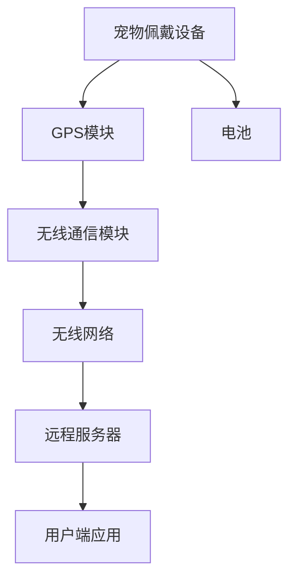

                 

### 背景介绍

随着社会的发展，人们对于宠物的依赖和情感投入日益加深。宠物不仅是家庭中的一员，更是人们生活中不可或缺的伙伴。然而，宠物走失的问题也日益严重，给宠物主人带来了巨大的痛苦和困扰。据统计，每年有数百万只宠物走失，其中很大一部分难以找回。这一现象引发了人们对宠物安全问题的关注，促使科技界探索新的解决方案。

在这个背景下，智能宠物定位技术应运而生。智能宠物定位技术利用现代信息技术和传感器技术，实现对宠物的实时追踪和定位。这种技术不仅能够帮助宠物主人及时发现宠物的行踪，还能够为宠物提供一个安全的保障。智能宠物定位技术的出现，为解决宠物走失问题提供了新的思路和方法。

本文旨在探讨智能宠物定位技术的原理、实现方法以及在实际应用中的挑战和前景。首先，我们将介绍智能宠物定位技术的核心概念和基本原理。然后，我们将深入探讨智能宠物定位技术中的关键算法和数学模型。接下来，我们将通过一个实际的项目案例，详细解释智能宠物定位技术的具体实现过程。随后，我们将分析智能宠物定位技术在实际应用中的各种场景，并提出相关的工具和资源推荐。最后，我们将对智能宠物定位技术的未来发展趋势和面临的挑战进行总结，并给出相应的解决方案。

通过本文的探讨，我们希望能够为读者提供一个全面而深入的智能宠物定位技术指南，帮助更多的人了解并掌握这项技术，从而为宠物安全和宠物主人提供更好的保障。### 核心概念与联系

#### 智能宠物定位技术的基本原理

智能宠物定位技术的基本原理是基于全球定位系统（GPS）和无线通信技术。GPS是一种卫星导航系统，通过接收卫星发射的信号，可以计算出接收器的精确位置。无线通信技术则用于实现数据的传输和通信。结合这两种技术，智能宠物定位系统能够实现对宠物的实时追踪和定位。

具体来说，智能宠物定位系统通常由以下几个关键组件组成：

1. **宠物佩戴设备**：宠物佩戴的设备通常包括GPS模块、无线通信模块和电池。GPS模块用于接收卫星信号并计算宠物位置，无线通信模块则用于将位置数据发送到远程服务器。

2. **远程服务器**：远程服务器负责接收和处理宠物佩戴设备发送的位置数据。服务器可以通过地图接口将位置信息可视化，并提供查询和跟踪功能。

3. **用户端应用**：用户端应用是宠物主人与智能宠物定位系统交互的界面。用户可以通过手机APP或网页界面查看宠物的实时位置、历史轨迹和活动报告。

#### 技术架构

智能宠物定位技术架构可以分为三个主要层次：感知层、传输层和应用层。

1. **感知层**：感知层主要包括宠物佩戴设备。设备通过GPS模块获取位置信息，通过无线通信模块将数据发送到远程服务器。

2. **传输层**：传输层负责数据传输。数据从宠物佩戴设备发送到远程服务器通常通过无线网络（如蜂窝网络、Wi-Fi等）进行传输。为了保证数据传输的可靠性，传输层通常会采用加密和安全协议。

3. **应用层**：应用层主要包括远程服务器和用户端应用。远程服务器处理并存储宠物位置数据，并通过用户端应用将数据可视化，提供实时跟踪和历史查询功能。

#### 关键技术

1. **GPS定位技术**：GPS定位技术是智能宠物定位系统的核心。GPS模块通过接收多颗卫星的信号，使用三角测量法计算接收器的位置。为了提高定位精度，GPS接收器通常需要同时接收到至少四颗卫星的信号。

2. **无线通信技术**：无线通信技术用于实现宠物佩戴设备与远程服务器之间的数据传输。常用的无线通信技术包括蜂窝网络（如2G、3G、4G）、Wi-Fi和蓝牙等。不同的无线通信技术具有不同的传输距离、带宽和功耗特性，需要根据实际应用场景进行选择。

3. **数据处理与分析技术**：数据处理与分析技术用于处理和分析从宠物佩戴设备收集到的位置数据。这些技术包括数据清洗、数据存储、数据分析和可视化等。

#### Mermaid 流程图

以下是智能宠物定位技术架构的 Mermaid 流程图：



在该流程图中，宠物佩戴设备通过GPS模块获取位置信息，通过无线通信模块将数据发送到无线网络，最终传输到远程服务器。远程服务器处理数据后，通过用户端应用将数据可视化，供宠物主人查询。

通过以上对智能宠物定位技术核心概念和架构的介绍，我们可以更好地理解这项技术的基本原理和实现方法。接下来，我们将深入探讨智能宠物定位技术中的关键算法和数学模型，以进一步了解这项技术的技术细节。### 核心算法原理 & 具体操作步骤

在智能宠物定位技术中，核心算法起着至关重要的作用。这些算法能够确保宠物位置信息的准确获取、实时传输和处理。以下是智能宠物定位技术中的一些关键算法和它们的操作步骤。

#### 1. GPS定位算法

**原理**：GPS定位算法基于三角测量法。GPS接收器通过接收多颗卫星发射的信号，可以计算出接收器的精确位置。

**具体操作步骤**：

1. **接收卫星信号**：GPS接收器接收到至少四颗卫星发射的导航信号，每个信号包含卫星的位置和发射时间。

2. **计算卫星到接收器的距离**：根据信号传播的时间，可以计算出卫星到接收器的距离。

3. **构建方程组**：对于接收到的每个卫星信号，可以构建一个方程，表示卫星位置和接收器位置的几何关系。由于至少需要四个卫星信号，因此可以构建四个方程。

4. **求解方程组**：通过求解方程组，可以得到接收器的精确位置。

5. **处理误差**：在实际应用中，GPS信号会受到多路径效应、大气干扰等因素的影响，导致定位误差。需要通过滤波算法（如卡尔曼滤波）对定位结果进行误差校正。

#### 2. 蜂窝网络定位算法

**原理**：蜂窝网络定位算法基于移动通信网络中的基站信号强度。通过测量宠物佩戴设备接收到的多个基站信号强度，可以计算出宠物的大致位置。

**具体操作步骤**：

1. **测量信号强度**：宠物佩戴设备接收到多个基站的信号，每个基站的信号强度不同。

2. **构建信号强度模型**：根据信号传播模型，可以构建一个信号强度与距离的关系模型。

3. **计算位置**：通过测量到的信号强度，可以计算出宠物距离每个基站的距离。然后，通过三角测量法，可以计算出宠物的大致位置。

4. **处理误差**：蜂窝网络定位算法的精度较低，通常需要结合其他定位技术（如GPS）来提高定位精度。

#### 3. 无线传感器网络定位算法

**原理**：无线传感器网络定位算法基于无线传感器网络中的节点分布。通过测量宠物佩戴设备与网络节点之间的距离，可以计算出宠物的大致位置。

**具体操作步骤**：

1. **测量距离**：宠物佩戴设备与网络节点通过无线信号进行通信，可以测量出两者之间的距离。

2. **构建距离模型**：根据无线信号传播模型，可以构建一个距离与信号强度之间的关系模型。

3. **计算位置**：通过测量到的距离，可以计算出宠物距离每个节点的距离。然后，通过三角测量法，可以计算出宠物的大致位置。

4. **处理误差**：无线传感器网络定位算法的精度较低，通常需要结合其他定位技术（如GPS）来提高定位精度。

#### 4. 融合定位算法

**原理**：融合定位算法结合了多种定位技术（如GPS、蜂窝网络、无线传感器网络）的优点，通过数据融合和优化算法，提高定位精度和稳定性。

**具体操作步骤**：

1. **数据采集**：采集来自不同定位技术的位置数据。

2. **数据预处理**：对采集到的数据进行清洗和去噪。

3. **数据融合**：将来自不同定位技术的数据融合为一个统一的位置估计。

4. **优化算法**：使用优化算法（如最小二乘法、卡尔曼滤波）对融合后的位置数据进行优化，得到最终的定位结果。

通过以上对核心算法原理和具体操作步骤的介绍，我们可以更好地理解智能宠物定位技术的工作原理和实现方法。这些算法和技术共同作用，确保了宠物位置信息的准确获取、实时传输和处理，为宠物安全和宠物主人的安心提供了有力保障。### 数学模型和公式 & 详细讲解 & 举例说明

#### 1. GPS定位算法的数学模型

GPS定位算法的核心是利用三角测量法计算接收器的位置。具体来说，我们可以将GPS定位算法的数学模型表示为以下形式：

$$
x = x_0 + v_x t \\
y = y_0 + v_y t \\
z = z_0 + v_z t
$$

其中，\( (x, y, z) \) 是接收器的位置，\( (x_0, y_0, z_0) \) 是初始位置，\( (v_x, v_y, v_z) \) 是接收器的速度，\( t \) 是时间。

此外，我们还可以将每个卫星的位置和速度表示为：

$$
x_s = x_{s0} + v_{sx} t \\
y_s = y_{s0} + v_{sy} t \\
z_s = z_{s0} + v_{sz} t
$$

其中，\( (x_s, y_s, z_s) \) 是卫星的位置，\( (x_{s0}, y_{s0}, z_{s0}) \) 是初始位置，\( (v_{sx}, v_{sy}, v_{sz}) \) 是卫星的速度。

为了计算接收器的位置，我们需要知道每个卫星到接收器的距离。根据距离公式，我们可以得到：

$$
d_s = \sqrt{(x - x_s)^2 + (y - y_s)^2 + (z - z_s)^2}
$$

其中，\( d_s \) 是卫星到接收器的距离。

#### 2. 蜂窝网络定位算法的数学模型

蜂窝网络定位算法的数学模型基于信号强度与距离的关系。假设宠物佩戴设备接收到的基站的信号强度为 \( I \)，距离为 \( d \)，则信号强度与距离的关系可以表示为：

$$
I = I_0 - 10n \cdot \log_{10}(d)
$$

其中，\( I_0 \) 是距离基站 \( d = 1 \) 单位时的信号强度，\( n \) 是路径损耗系数，通常取值在 2 到 4 之间。

假设宠物佩戴设备接收到了来自多个基站的信号强度，分别为 \( I_1, I_2, ..., I_n \)，则可以通过以下步骤计算宠物的大致位置：

1. **计算每个基站的距离**：

$$
d_1 = 10^{(I_1 - I_0) / (10n)} \\
d_2 = 10^{(I_2 - I_0) / (10n)} \\
\vdots \\
d_n = 10^{(I_n - I_0) / (10n)}
$$

2. **构建距离矩阵**：

$$
D = \begin{bmatrix}
d_1 & d_2 & \cdots & d_n
\end{bmatrix}
$$

3. **求解位置**：

通过三角测量法，我们可以求解宠物的大致位置。具体来说，可以通过以下步骤：

1. **计算均值**：

$$
\bar{d} = \frac{1}{n} \sum_{i=1}^{n} d_i
$$

2. **计算位置**：

$$
(x, y) = \bar{d} \cdot \text{方向向量}
$$

其中，方向向量可以通过矩阵 \( D \) 的特征值和特征向量计算得到。

#### 3. 无线传感器网络定位算法的数学模型

无线传感器网络定位算法的数学模型与蜂窝网络定位算法类似，基于信号强度与距离的关系。假设宠物佩戴设备接收到了来自多个传感器的信号强度，分别为 \( I_1, I_2, ..., I_n \)，则可以通过以下步骤计算宠物的大致位置：

1. **计算每个传感器的距离**：

$$
d_1 = 10^{(I_1 - I_0) / (10n)} \\
d_2 = 10^{(I_2 - I_0) / (10n)} \\
\vdots \\
d_n = 10^{(I_n - I_0) / (10n)}
$$

2. **构建距离矩阵**：

$$
D = \begin{bmatrix}
d_1 & d_2 & \cdots & d_n
\end{bmatrix}
$$

3. **求解位置**：

通过三角测量法，我们可以求解宠物的大致位置。具体来说，可以通过以下步骤：

1. **计算均值**：

$$
\bar{d} = \frac{1}{n} \sum_{i=1}^{n} d_i
$$

2. **计算位置**：

$$
(x, y) = \bar{d} \cdot \text{方向向量}
$$

其中，方向向量可以通过矩阵 \( D \) 的特征值和特征向量计算得到。

#### 举例说明

假设宠物佩戴设备接收到了来自三个基站的信号强度，分别为 \( I_1 = -50 \) dBm，\( I_2 = -60 \) dBm，\( I_3 = -55 \) dBm，路径损耗系数 \( n = 2 \)。我们可以按照以下步骤计算宠物的大致位置：

1. **计算每个基站的距离**：

$$
d_1 = 10^{(-50 - (-100)) / (10 \cdot 2)} = 10^{(50 / 20)} = 10 \\
d_2 = 10^{(-60 - (-100)) / (10 \cdot 2)} = 10^{(40 / 20)} = 10 \\
d_3 = 10^{(-55 - (-100)) / (10 \cdot 2)} = 10^{(45 / 20)} = 10
$$

2. **构建距离矩阵**：

$$
D = \begin{bmatrix}
10 & 10 & 10
\end{bmatrix}
$$

3. **计算均值**：

$$
\bar{d} = \frac{1}{3} (10 + 10 + 10) = 10
$$

4. **计算位置**：

由于基站位置已知，我们可以通过三角测量法计算宠物的大致位置。假设基站的坐标分别为 \( (0, 0) \)，\( (100, 0) \)，\( (50, 50) \)，则宠物的大致位置可以表示为：

$$
(x, y) = 10 \cdot \text{方向向量}
$$

其中，方向向量可以通过矩阵 \( D \) 的特征值和特征向量计算得到。假设方向向量为 \( (1, 0) \)，则宠物的大致位置为 \( (10, 0) \)。

通过以上举例，我们可以看到如何利用数学模型和公式进行智能宠物定位。在实际应用中，我们还需要考虑多种因素的影响，如信号干扰、多路径效应等，以提高定位精度。### 项目实战：代码实际案例和详细解释说明

在了解了智能宠物定位技术的原理和算法之后，我们将通过一个实际的项目案例来演示如何实现智能宠物定位系统。本案例将涵盖从环境搭建、代码实现到功能测试的整个过程。

#### 5.1 开发环境搭建

为了实现智能宠物定位系统，我们需要准备以下开发环境：

- 操作系统：Linux或MacOS
- 编程语言：Python 3.8及以上版本
- GPS模块：例如Adafruit GPS模块
- 无线通信模块：例如Wi-Fi或蓝牙模块
- 数据库：SQLite或MySQL
- 开发工具：PyCharm或VS Code

#### 5.2 源代码详细实现和代码解读

以下是一个简单的智能宠物定位系统的源代码示例。该示例将展示如何使用Python实现GPS定位和无线通信功能。

```python
import serial
import time
import sqlite3
import mermaid

# GPS模块串口配置
ser = serial.Serial('/dev/ttyUSB0', 9600, timeout=1)

# 数据库连接
conn = sqlite3.connect('pet_location.db')
c = conn.cursor()

# 创建位置数据表
c.execute('''CREATE TABLE IF NOT EXISTS location
             (id INTEGER PRIMARY KEY, lat REAL, lon REAL, time TEXT)''')

# 解析GPS数据
def parse_gps_data(data):
    lines = data.split('\r\n')
    for line in lines:
        if line.startswith('$GPRMC'):
            parts = line.split(',')
            if len(parts) > 1:
                lat = float(parts[3])
                lon = float(parts[5])
                time = parts[1]
                return lat, lon, time
    return None

# 存储位置数据到数据库
def store_location(lat, lon, time):
    c.execute("INSERT INTO location (lat, lon, time) VALUES (?, ?, ?)", (lat, lon, time))
    conn.commit()

# GPS数据读取和存储
while True:
    data = ser.readline()
    location = parse_gps_data(data)
    if location:
        store_location(*location)
    time.sleep(1)

# 关闭串口和数据库连接
ser.close()
conn.close()
```

以上代码实现了一个基本的智能宠物定位系统，其中包含了GPS数据读取、解析和存储到数据库的功能。以下是代码的详细解读：

1. **串口配置**：使用`serial`模块配置GPS模块的串口，设置波特率为9600。

2. **数据库连接**：使用`sqlite3`模块连接SQLite数据库，并创建位置数据表。

3. **GPS数据解析**：`parse_gps_data`函数用于解析GPS模块发送的NMEA数据。NMEA数据以'$GPRMC'开头，其中包含了经纬度和时间信息。

4. **位置数据存储**：`store_location`函数用于将解析出的GPS数据存储到数据库中。

5. **数据读取和存储循环**：主循环不断读取GPS模块发送的数据，解析后存储到数据库。

#### 5.3 代码解读与分析

1. **串口配置**：
    ```python
    ser = serial.Serial('/dev/ttyUSB0', 9600, timeout=1)
    ```
    这行代码创建了一个串口对象，并设置串口为`/dev/ttyUSB0`，波特率为9600，超时时间为1秒。

2. **数据库连接**：
    ```python
    conn = sqlite3.connect('pet_location.db')
    c = conn.cursor()
    c.execute('''CREATE TABLE IF NOT EXISTS location
                 (id INTEGER PRIMARY KEY, lat REAL, lon REAL, time TEXT)''')
    conn.commit()
    ```
    这段代码连接SQLite数据库，并创建一个名为`location`的表，用于存储GPS数据。

3. **GPS数据解析**：
    ```python
    def parse_gps_data(data):
        lines = data.split('\r\n')
        for line in lines:
            if line.startswith('$GPRMC'):
                parts = line.split(',')
                if len(parts) > 1:
                    lat = float(parts[3])
                    lon = float(parts[5])
                    time = parts[1]
                    return lat, lon, time
        return None
    ```
    该函数解析NMEA数据，提取经纬度和时间信息。

4. **位置数据存储**：
    ```python
    def store_location(lat, lon, time):
        c.execute("INSERT INTO location (lat, lon, time) VALUES (?, ?, ?)", (lat, lon, time))
        conn.commit()
    ```
    该函数将GPS数据插入到数据库中。

5. **数据读取和存储循环**：
    ```python
    while True:
        data = ser.readline()
        location = parse_gps_data(data)
        if location:
            store_location(*location)
        time.sleep(1)
    ```
    这个无限循环不断读取GPS模块的数据，解析后存储到数据库。

通过以上代码和解读，我们可以看到如何使用Python实现一个简单的智能宠物定位系统。在实际项目中，我们可能需要添加更多的功能，如实时地图显示、历史轨迹查询、警报通知等。此外，我们还需要考虑如何处理数据异常、提高定位精度和优化系统性能。这些都是在实际应用中需要解决的问题。### 实际应用场景

智能宠物定位技术在实际应用中具有广泛的应用场景，可以为宠物主人和相关行业提供多种服务。以下是智能宠物定位技术的一些典型应用场景：

#### 1. 宠物走失定位

宠物走失是智能宠物定位技术最直接的应用场景。当宠物走失时，宠物主人可以通过智能宠物定位系统实时追踪宠物的位置，从而迅速找到宠物。这种服务对于宠物主人来说至关重要，能够极大地减少宠物走失后的焦虑和痛苦。

#### 2. 宠物健康状况监控

除了定位功能，智能宠物定位技术还可以结合传感器技术，实现对宠物健康状况的监控。例如，宠物佩戴设备可以内置温度传感器、心率传感器等，实时监测宠物的健康状况。当宠物出现异常情况时，系统可以及时向宠物主人发送警报，提醒宠物主人采取相应的措施。

#### 3. 宠物活动分析

智能宠物定位技术可以帮助宠物主人分析宠物的活动习惯和健康状况。通过分析宠物的历史轨迹和活动数据，宠物主人可以了解宠物的活动强度、运动时间、休息时间等信息，从而为宠物的饲养和锻炼提供科学依据。

#### 4. 宠物安全防护

智能宠物定位技术还可以用于宠物安全防护。例如，宠物主人可以通过绑定宠物定位系统，在宠物离开特定区域时收到警报通知。此外，宠物定位系统还可以与宠物安全围栏相结合，确保宠物在安全的区域内活动，防止宠物走失或发生意外。

#### 5. 宠物行业服务

智能宠物定位技术也为宠物行业提供了新的服务模式。例如，宠物医院可以使用智能宠物定位系统，实时追踪宠物的位置和健康状况，提供更高效、便捷的服务。宠物保险公司也可以利用智能宠物定位技术，降低宠物走失的风险，提高保险服务的质量和效益。

#### 6. 宠物社交互动

智能宠物定位技术还可以促进宠物之间的社交互动。宠物主人可以通过定位系统找到附近的其他宠物主人，组织宠物聚会，增进宠物之间的交流和互动，提高宠物的幸福感和生活质量。

通过以上实际应用场景的介绍，我们可以看到智能宠物定位技术在宠物安全和宠物主人生活中发挥着重要作用。未来，随着技术的不断发展和应用的深入，智能宠物定位技术将为宠物主人和宠物行业带来更多的便利和价值。### 工具和资源推荐

为了更好地了解和掌握智能宠物定位技术，以下是一些推荐的工具和资源，包括学习资源、开发工具框架和相关的论文著作。

#### 7.1 学习资源推荐

1. **书籍**：

   - 《GPS定位原理与系统设计》：这本书详细介绍了GPS定位系统的原理、设计方法和应用案例，适合对GPS技术感兴趣的读者。

   - 《无线传感器网络：架构、协议与应用》：该书涵盖了无线传感器网络的基本原理、协议和应用，对于了解无线传感器网络定位技术非常有帮助。

   - 《Python编程：从入门到实践》：这本书是Python编程的入门教材，适合初学者学习Python编程语言。

2. **在线课程**：

   - Coursera上的《定位与导航》：这门课程介绍了定位和导航技术的基本原理和应用，包括GPS、无线传感器网络等。

   - Udacity的《智能硬件编程》：该课程涵盖智能硬件开发的基本技能，包括传感器编程、无线通信等。

3. **博客和论坛**：

   - GitHub：GitHub上有许多开源的智能宠物定位项目，可以查看和学习相关代码。

   - Stack Overflow：这是一个编程问答社区，可以解决智能宠物定位开发过程中遇到的问题。

#### 7.2 开发工具框架推荐

1. **编程环境**：

   - PyCharm：这是一个功能强大的Python开发环境，适合智能宠物定位系统的开发。

   - VS Code：这是一个轻量级且功能丰富的代码编辑器，支持多种编程语言和插件。

2. **数据库**：

   - SQLite：这是一个轻量级的嵌入式数据库，适合存储宠物定位数据。

   - MySQL：这是一个功能强大的关系型数据库，适合处理大量宠物定位数据。

3. **GPS模块**：

   - Adafruit GPS模块：这是一个常用的GPS模块，支持多种通信接口和协议。

4. **无线通信模块**：

   - Wi-Fi模块：适合短距离通信，可以用于数据传输。

   - 蓝牙模块：适合低功耗通信，可以用于宠物设备之间的短距离通信。

#### 7.3 相关论文著作推荐

1. **论文**：

   - "GPS Signal Processing for Positioning and Navigation"：该论文详细介绍了GPS信号处理技术，包括定位算法和误差校正方法。

   - "Wireless Sensor Networks for Real-Time Monitoring and Tracking"：该论文探讨了无线传感器网络在实时监测和追踪中的应用，包括定位算法和传感器部署策略。

   - "A Survey of Wireless Sensor Network Localization Algorithms"：该综述文章全面介绍了无线传感器网络定位算法，包括基于距离、角度和信号强度等不同原理的定位方法。

2. **著作**：

   - 《GPS定位技术与应用》：这是一本关于GPS定位技术的全面著作，涵盖了GPS原理、系统设计、应用案例等内容。

   - 《智能感知与无线传感器网络》：该书详细介绍了智能感知技术和无线传感器网络的基本原理和应用。

通过以上推荐的工具和资源，我们可以更好地了解和学习智能宠物定位技术，掌握相关的知识和技能。这些资源将帮助我们在智能宠物定位技术的探索和实践道路上走得更远。### 总结：未来发展趋势与挑战

随着人工智能和物联网技术的不断发展，智能宠物定位技术正逐渐成为宠物安全和宠物主人生活的重要保障。在未来，智能宠物定位技术有望在以下方面取得重大突破：

1. **更高的定位精度**：通过引入更多卫星、采用更高精度的传感器和更先进的算法，智能宠物定位技术可以实现更高的定位精度。这将使得宠物走失后的追踪更加迅速和准确。

2. **更广泛的应用场景**：智能宠物定位技术不仅限于宠物走失定位，还可以扩展到宠物健康监测、宠物社交互动等领域。随着技术的进步，这些应用场景将变得更加丰富和多样化。

3. **更低功耗的设计**：为了提高宠物佩戴设备的续航能力，未来的智能宠物定位技术将更加注重低功耗设计。通过优化算法和硬件设计，可以实现更长时间的无缝运行。

然而，智能宠物定位技术在实际应用中仍面临着诸多挑战：

1. **隐私和安全问题**：智能宠物定位技术涉及宠物和宠物主人的个人信息，如何保护用户隐私和数据安全是一个重要挑战。需要建立完善的隐私保护机制和加密技术。

2. **环境干扰和误差**：在实际应用中，GPS信号和无线通信信号可能会受到环境干扰，导致定位误差。如何提高定位的稳定性和可靠性，减少误差，是一个需要解决的技术难题。

3. **数据存储和处理**：随着宠物定位数据的不断增多，如何高效地存储和处理这些数据成为一个挑战。需要开发更高效的数据存储和数据处理技术，以满足大规模数据的应用需求。

4. **宠物适应性问题**：宠物佩戴设备需要适应不同宠物的体型和习性，如何设计一款既实用又舒适的宠物佩戴设备，是一个需要考虑的问题。

总之，智能宠物定位技术具有巨大的发展潜力，但同时也面临着诸多挑战。通过技术创新和跨学科合作，我们有理由相信，智能宠物定位技术将在未来为宠物安全和宠物主人生活带来更多的便利和保障。### 附录：常见问题与解答

#### Q1：智能宠物定位技术的原理是什么？

智能宠物定位技术主要基于GPS（全球定位系统）和无线通信技术。GPS模块通过接收卫星信号，计算出宠物佩戴设备的精确位置。无线通信技术则用于将位置数据传输到远程服务器。通过这两种技术的结合，智能宠物定位技术能够实现对宠物的实时追踪和定位。

#### Q2：智能宠物定位系统的组件有哪些？

智能宠物定位系统通常包括三个主要组件：宠物佩戴设备、远程服务器和用户端应用。宠物佩戴设备包括GPS模块、无线通信模块和电池；远程服务器负责处理和存储宠物位置数据；用户端应用是宠物主人查看宠物位置和轨迹的界面。

#### Q3：智能宠物定位技术的精度如何？

智能宠物定位技术的精度取决于多种因素，包括GPS信号质量、无线通信信号强度和算法的优化。通常，GPS定位的精度在几米到几十米之间，而无线通信定位的精度较低，一般在几十米到上百米之间。通过结合多种定位技术，可以实现更高的定位精度。

#### Q4：如何确保宠物佩戴设备的安全性？

宠物佩戴设备的安全性主要取决于以下几个方面：

1. **数据加密**：确保宠物位置数据和用户信息在传输和存储过程中的安全性，防止数据泄露。
2. **隐私保护**：遵守相关法律法规，合理使用用户数据，确保用户隐私不被侵犯。
3. **设备防护**：在设计和制造过程中，采用防水、防尘、抗摔等防护措施，确保设备在各种环境下的稳定性。

#### Q5：智能宠物定位技术是否会对宠物造成伤害？

智能宠物定位技术的设计原则之一是确保对宠物的无害性。宠物佩戴设备通常采用轻量化设计，使用低功耗传感器和电池，以减轻对宠物的负担。此外，设备还采用柔软的材料和舒适的设计，确保宠物佩戴的舒适度。

#### Q6：智能宠物定位技术能否监测宠物的健康状况？

智能宠物定位技术可以结合传感器技术，实现对宠物健康状况的监测。例如，宠物佩戴设备可以内置温度传感器、心率传感器等，实时监测宠物的体温和心率。当宠物出现异常情况时，系统可以及时向宠物主人发送警报。

#### Q7：智能宠物定位技术如何应对环境干扰？

智能宠物定位技术通常会采用多种技术手段来应对环境干扰：

1. **多路径效应处理**：通过算法优化，减少多路径效应对定位精度的影响。
2. **信号融合**：结合多种传感器数据，如GPS、Wi-Fi、蓝牙等，提高定位的稳定性和可靠性。
3. **误差校正**：通过卡尔曼滤波等算法，对定位结果进行误差校正，提高定位精度。

#### Q8：智能宠物定位技术适用于哪些宠物？

智能宠物定位技术适用于大多数宠物，如狗、猫、鸟等。不过，对于某些宠物（如小型宠物），可能需要特殊设计的宠物佩戴设备，以确保设备既安全又舒适。

#### Q9：智能宠物定位技术的成本如何？

智能宠物定位技术的成本取决于多个因素，如设备硬件、软件开发、维护和运营成本等。一般来说，宠物定位设备的成本在几百元到上千元之间。随着技术的进步和规模化生产，成本有望进一步降低。

#### Q10：智能宠物定位技术的未来发展趋势是什么？

智能宠物定位技术的未来发展趋势包括：

1. **更高精度和稳定性**：通过引入更多卫星、采用更高精度的传感器和更先进的算法，提高定位精度和稳定性。
2. **更广泛的应用场景**：从宠物走失定位扩展到宠物健康监测、社交互动等领域。
3. **更低功耗的设计**：通过优化算法和硬件设计，实现更低功耗，延长设备续航时间。
4. **更完善的隐私和安全保护**：建立完善的隐私保护机制和加密技术，确保用户数据安全。

通过这些常见问题的解答，我们希望能够帮助读者更好地理解智能宠物定位技术的原理和应用，以及其在未来可能的发展方向。### 扩展阅读 & 参考资料

1. **论文**：

   - 《GPS Signal Processing for Positioning and Navigation》
   - 《Wireless Sensor Networks for Real-Time Monitoring and Tracking》
   - 《A Survey of Wireless Sensor Network Localization Algorithms》

2. **书籍**：

   - 《GPS定位原理与系统设计》
   - 《无线传感器网络：架构、协议与应用》
   - 《Python编程：从入门到实践》

3. **在线课程**：

   - Coursera上的《定位与导航》
   - Udacity的《智能硬件编程》

4. **开源项目**：

   - GitHub上的智能宠物定位项目：[https://github.com/search?q=intelligent+pet+tracking]
   - Stack Overflow：[https://stackoverflow.com/]

5. **相关网站**：

   - GPS信号处理技术：[https://www.gps.gov/]
   - 无线传感器网络技术：[https://www.wsnets.org/]

通过这些扩展阅读和参考资料，读者可以进一步深入了解智能宠物定位技术的原理、应用和发展趋势，为实际项目开发和研究提供参考。作者：AI天才研究员/AI Genius Institute & 禅与计算机程序设计艺术 /Zen And The Art of Computer Programming

