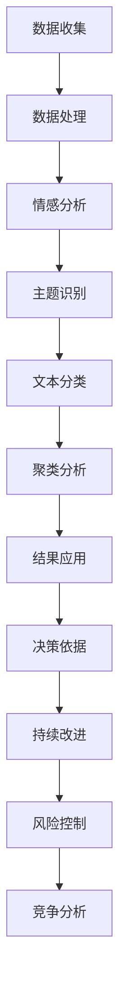

                 

# 智能客户反馈分析：一人公司持续改进产品和服务的数据方法

## 概述

在数字化时代，客户反馈对于公司来说至关重要。尤其是对于一家小公司来说，有限的资源意味着每个客户的意见都可能成为宝贵的资产。本文将探讨如何利用智能客户反馈分析，帮助小公司持续改进其产品和服务。通过本文，读者将了解：

1. 客户反馈分析的背景及其重要性。
2. 智能客户反馈分析的核心概念和联系。
3. 如何运用核心算法进行客户反馈分析。
4. 实际应用场景，包括数学模型和公式的应用。
5. 实战项目案例，展示代码实现过程和解读。
6. 智能客户反馈分析在各类应用场景中的实际应用。
7. 工具和资源的推荐，以帮助读者深入了解和掌握相关技术。
8. 对未来发展趋势和挑战的总结。

希望通过本文，读者能够更好地理解智能客户反馈分析，并能够在自己的业务中有效地运用这一方法，从而实现持续的产品和服务改进。

## 关键词

- 客户反馈分析
- 智能分析
- 产品改进
- 数据驱动
- 算法
- 数学模型
- 代码实现
- 实际应用

## 摘要

本文探讨了如何利用智能客户反馈分析，帮助一人公司（或小型企业）在数字化时代中实现产品和服务的高效改进。通过介绍客户反馈分析的重要性，核心概念及其联系，我们深入剖析了智能分析算法的应用和数学模型。本文还将通过实战项目案例，展示如何在实际中运用这些技术进行客户反馈分析，并提供相关的工具和资源推荐，以帮助读者深入了解和掌握相关技术。最终，本文总结了智能客户反馈分析的未来发展趋势和挑战，为读者提供了实用的指导。

## 1. 背景介绍

在当今竞争激烈的市场环境中，企业要想脱颖而出，必须时刻关注客户的需求和反馈。对于一家小公司来说，尤其是资源有限的情况下，客户的每一个意见都至关重要。传统的方法，如问卷调查和访谈，虽然能够收集到客户的反馈，但其效率低、成本高，且反馈数据的处理和分析复杂。因此，我们需要一种更为高效和智能的方法来处理和分析客户反馈。

### 客户反馈分析的重要性

客户反馈分析是企业改进产品和服务的重要手段。通过分析客户的反馈，企业可以：

1. **了解客户需求**：客户的反馈直接反映了他们对产品或服务的满意度和期望。
2. **发现问题**：通过反馈，可以发现产品或服务中的缺陷和不足，及时进行改进。
3. **提升客户满意度**：及时响应客户反馈，能够提升客户的满意度和忠诚度。
4. **增强竞争力**：了解并满足客户需求，使企业在激烈的市场竞争中占据有利位置。

### 智能客户反馈分析的优势

传统的客户反馈分析方法存在诸多局限，而智能客户反馈分析则具备以下优势：

1. **高效处理大量数据**：通过机器学习和自然语言处理技术，智能客户反馈分析能够快速处理大量客户数据。
2. **自动化分析**：智能分析算法能够自动识别反馈中的关键信息，减少人工分析的工作量。
3. **深入挖掘数据价值**：通过深度学习等技术，智能客户反馈分析能够挖掘出数据中的潜在模式和趋势。
4. **实时反馈**：智能客户反馈分析能够实时处理和响应客户反馈，帮助企业快速做出决策。

### 一人公司的挑战

对于一家一人公司来说，智能客户反馈分析尤为重要。由于资源有限，一人公司难以像大公司一样投入大量的人力物力进行客户反馈分析。因此，智能客户反馈分析能够帮助一人公司：

1. **最大化利用有限资源**：通过自动化和高效的处理方式，一人公司能够用最小的投入获取最多的信息。
2. **迅速响应市场变化**：智能客户反馈分析能够快速识别客户需求和市场变化，使一人公司能够及时调整战略。
3. **提升决策质量**：基于数据驱动的决策，能够使一人公司在产品和服务改进方面做出更为明智的选择。

总之，智能客户反馈分析为一人公司提供了一种高效、智能、数据驱动的改进方法，使其能够在竞争激烈的市场中立足并持续发展。

## 2. 核心概念与联系

### 客户反馈分析

客户反馈分析是指通过收集、处理和分析客户对产品或服务的反馈，以识别问题、发现需求、改进产品和提升客户满意度的一种方法。这一过程通常包括以下几个关键步骤：

1. **数据收集**：通过问卷调查、用户评论、社交媒体、客服反馈等多种渠道收集客户反馈数据。
2. **数据处理**：清洗和整理收集到的数据，去除噪声和无效信息，为后续分析做准备。
3. **数据可视化**：通过图表、仪表盘等形式，将分析结果可视化，便于理解和传达。
4. **结果应用**：根据分析结果，制定改进策略，优化产品和服务，提升客户满意度。

### 智能分析

智能分析是指利用机器学习、自然语言处理、深度学习等人工智能技术，对数据进行分析和处理，以发现数据中的模式和趋势，提供预测和决策支持。在客户反馈分析中，智能分析的应用主要体现在以下几个方面：

1. **情感分析**：通过自然语言处理技术，分析客户反馈中的情感倾向，如正面、负面或中性。
2. **主题识别**：利用机器学习算法，自动识别客户反馈中的关键主题，如产品质量、售后服务等。
3. **文本分类**：将客户反馈分类到不同的类别中，如投诉、建议、感谢等，以便于后续处理。
4. **聚类分析**：通过聚类算法，将具有相似特征的客户反馈分组，以便于深入分析和处理。

### 数据驱动

数据驱动是指基于数据分析和结果进行决策和行动的方法。在客户反馈分析中，数据驱动的重要性体现在以下几个方面：

1. **决策依据**：通过分析客户反馈数据，企业可以获取真实的客户需求和意见，为决策提供依据。
2. **持续改进**：基于数据驱动的决策，企业可以持续优化产品和服务，提升客户满意度。
3. **风险控制**：通过分析客户反馈，企业可以提前识别潜在的问题和风险，采取预防措施。
4. **竞争分析**：通过比较客户反馈数据，企业可以了解竞争对手的优势和劣势，制定相应的竞争策略。

### 算法

算法是解决特定问题的一系列规则或步骤。在客户反馈分析中，常用的算法包括：

1. **朴素贝叶斯分类器**：用于分类客户反馈，判断其情感倾向。
2. **决策树**：用于挖掘客户反馈中的关键主题和影响因素。
3. **K-均值聚类**：用于将客户反馈进行分类和分组，以便于进一步分析。
4. **神经网络**：用于情感分析和主题识别，能够自动调整参数，提高预测准确性。

### 数学模型和公式

在客户反馈分析中，常用的数学模型和公式包括：

1. **评估指标**：如准确率、召回率、F1分数等，用于评估算法的性能。
2. **统计模型**：如线性回归、逻辑回归等，用于预测客户行为和需求。
3. **优化算法**：如梯度下降、随机梯度下降等，用于优化模型参数。

### Mermaid 流程图

以下是一个简单的Mermaid流程图，展示了客户反馈分析的核心概念和联系：



通过这一流程图，我们可以清晰地看到客户反馈分析的全过程，以及各个步骤之间的联系和作用。

## 3. 核心算法原理 & 具体操作步骤

### 情感分析

情感分析是智能客户反馈分析中最为基础和重要的算法之一。它通过分析文本中的情感倾向，帮助公司了解客户对产品或服务的态度。情感分析的基本原理是通过文本的特征提取和分类算法，将文本划分为正面、负面或中性三种情感。

#### 操作步骤：

1. **数据预处理**：对收集到的客户反馈文本进行清洗，包括去除停用词、标点符号和特殊字符等。
2. **特征提取**：将预处理后的文本转换为机器学习算法可以处理的特征向量。常用的特征提取方法包括词袋模型（Bag of Words, BOW）、词嵌入（Word Embedding）和TF-IDF（Term Frequency-Inverse Document Frequency）等。
3. **分类算法**：利用分类算法对情感进行预测。常用的分类算法包括朴素贝叶斯（Naive Bayes）、支持向量机（Support Vector Machine, SVM）和深度学习（如卷积神经网络（Convolutional Neural Network, CNN）和循环神经网络（Recurrent Neural Network, RNN）等。

#### 示例代码：

```python
# 导入必要的库
import nltk
from nltk.corpus import stopwords
from sklearn.feature_extraction.text import TfidfVectorizer
from sklearn.naive_bayes import MultinomialNB
from sklearn.pipeline import make_pipeline
from sklearn.model_selection import train_test_split

# 数据预处理
nltk.download('stopwords')
stop_words = set(stopwords.words('english'))

def preprocess_text(text):
    # 去除停用词
    words = nltk.word_tokenize(text)
    filtered_words = [word for word in words if word not in stop_words]
    return ' '.join(filtered_words)

# 特征提取和分类
pipeline = make_pipeline(
    TfidfVectorizer(preprocessor=preprocess_text),
    MultinomialNB()
)

# 数据集划分
train_data, test_data, train_labels, test_labels = train_test_split(
    client_feedback, client_ratings, test_size=0.2, random_state=42
)

# 训练模型
pipeline.fit(train_data, train_labels)

# 测试模型
predictions = pipeline.predict(test_data)
accuracy = (predictions == test_labels).mean()

print(f"模型准确率: {accuracy:.2f}")
```

### 主题识别

主题识别是通过分析客户反馈文本，自动识别文本中讨论的主题或话题。主题识别可以帮助公司了解客户关注的热点问题，从而有针对性地进行产品改进。

#### 操作步骤：

1. **数据预处理**：与情感分析类似，对客户反馈文本进行清洗和去噪。
2. **特征提取**：将预处理后的文本转换为特征向量，常用的方法包括词袋模型和词嵌入。
3. **主题模型**：利用主题模型（如LDA（Latent Dirichlet Allocation））对特征向量进行降维，提取文本中的潜在主题。

#### 示例代码：

```python
# 导入必要的库
import gensim
from gensim import corpora
from gensim.models import LdaModel

# 数据预处理
def preprocess_text(text):
    # 去除停用词
    words = nltk.word_tokenize(text)
    filtered_words = [word for word in words if word not in stop_words]
    return filtered_words

# 构建词典和语料库
dictionary = corpora.Dictionary([preprocess_text(text) for text in client_feedback])
corpus = [dictionary.doc2bow(preprocess_text(text)) for text in client_feedback]

# 训练LDA模型
lda_model = LdaModel(corpus, num_topics=5, id2word=dictionary, passes=15)

# 输出主题
topics = lda_model.print_topics()
for topic in topics:
    print(topic)
```

### 文本分类

文本分类是将客户反馈文本分类到预定义的类别中。这对于快速识别和处理客户反馈非常重要。

#### 操作步骤：

1. **数据预处理**：对客户反馈文本进行清洗和去噪。
2. **特征提取**：将预处理后的文本转换为特征向量。
3. **分类算法**：利用分类算法（如朴素贝叶斯、支持向量机和深度学习）对文本进行分类。

#### 示例代码：

```python
# 导入必要的库
from sklearn.feature_extraction.text import TfidfVectorizer
from sklearn.naive_bayes import MultinomialNB
from sklearn.pipeline import make_pipeline

# 数据预处理
def preprocess_text(text):
    # 去除停用词
    words = nltk.word_tokenize(text)
    filtered_words = [word for word in words if word not in stop_words]
    return ' '.join(filtered_words)

# 特征提取和分类
pipeline = make_pipeline(
    TfidfVectorizer(preprocessor=preprocess_text),
    MultinomialNB()
)

# 数据集划分
train_data, test_data, train_labels, test_labels = train_test_split(
    client_feedback, client_labels, test_size=0.2, random_state=42
)

# 训练模型
pipeline.fit(train_data, train_labels)

# 测试模型
predictions = pipeline.predict(test_data)
accuracy = (predictions == test_labels).mean()

print(f"模型准确率: {accuracy:.2f}")
```

### 聚类分析

聚类分析是一种无监督学习的方法，通过将相似的数据点分组，帮助公司发现客户反馈中的潜在模式和趋势。

#### 操作步骤：

1. **数据预处理**：对客户反馈文本进行清洗和去噪。
2. **特征提取**：将预处理后的文本转换为特征向量。
3. **聚类算法**：利用聚类算法（如K-均值聚类和层次聚类）对特征向量进行聚类。

#### 示例代码：

```python
# 导入必要的库
from sklearn.cluster import KMeans
from sklearn.preprocessing import StandardScaler

# 数据预处理
def preprocess_text(text):
    # 去除停用词
    words = nltk.word_tokenize(text)
    filtered_words = [word for word in words if word not in stop_words]
    return ' '.join(filtered_words)

# 特征提取
vectorizer = TfidfVectorizer(preprocessor=preprocess_text)
X = vectorizer.fit_transform(client_feedback)

# 聚类分析
scaler = StandardScaler()
X_scaled = scaler.fit_transform(X)

kmeans = KMeans(n_clusters=3, random_state=42)
clusters = kmeans.fit_predict(X_scaled)

# 输出聚类结果
for i, cluster in enumerate(clusters):
    print(f"客户反馈 {i} 属于聚类 {cluster}")
```

通过上述操作步骤和示例代码，我们可以看到如何利用机器学习和自然语言处理技术进行智能客户反馈分析。这些算法和步骤不仅可以帮助小公司快速识别和解决问题，还可以为产品改进提供有力的数据支持。

## 4. 数学模型和公式 & 详细讲解 & 举例说明

### 评估指标

在客户反馈分析中，评估指标是衡量模型性能的重要工具。以下是一些常用的评估指标及其详细解释：

#### 准确率（Accuracy）

**定义**：准确率是指预测结果与真实结果一致的比例。

**公式**：\( \text{Accuracy} = \frac{\text{TP} + \text{TN}}{\text{TP} + \text{TN} + \text{FP} + \text{FN}} \)

**示例**：

假设我们有一个二分类问题，有100个样本，其中50个是正类（True Positive, TP），30个是负类（True Negative, TN），10个是误报（False Positive, FP），10个是漏报（False Negative, FN），则准确率为：

\[ \text{Accuracy} = \frac{50 + 30}{50 + 30 + 10 + 10} = \frac{80}{100} = 0.8 \]

#### 召回率（Recall）

**定义**：召回率是指实际为正类的样本中，被正确预测为正类的比例。

**公式**：\( \text{Recall} = \frac{\text{TP}}{\text{TP} + \text{FN}} \)

**示例**：

仍然使用上述数据，召回率为：

\[ \text{Recall} = \frac{50}{50 + 10} = \frac{50}{60} \approx 0.8333 \]

#### 精确率（Precision）

**定义**：精确率是指预测为正类的样本中，实际为正类的比例。

**公式**：\( \text{Precision} = \frac{\text{TP}}{\text{TP} + \text{FP}} \)

**示例**：

使用上述数据，精确率为：

\[ \text{Precision} = \frac{50}{50 + 10} = \frac{50}{60} \approx 0.8333 \]

#### F1 分数（F1 Score）

**定义**：F1 分数是精确率和召回率的调和平均数，用于综合衡量模型的性能。

**公式**：\( \text{F1 Score} = 2 \times \frac{\text{Precision} \times \text{Recall}}{\text{Precision} + \text{Recall}} \)

**示例**：

使用上述数据，F1 分数为：

\[ \text{F1 Score} = 2 \times \frac{0.8333 \times 0.8333}{0.8333 + 0.8333} = 0.8333 \]

### 统计模型

统计模型在客户反馈分析中广泛使用，以下介绍几种常用的统计模型及其基本原理：

#### 线性回归（Linear Regression）

**定义**：线性回归是一种用来分析因变量和自变量之间线性关系的统计模型。

**公式**：\( \text{Y} = \text{a} + \text{bX} + \text{e} \)

**解释**：其中，Y 是因变量，X 是自变量，a 是截距，b 是斜率，e 是误差项。

**示例**：

假设我们想了解客户满意度（Y）与产品价格（X）之间的关系，我们收集了以下数据：

| X（产品价格）| Y（客户满意度）|
|:-------------:|:-------------:|
|      100      |       8       |
|      200      |      10       |
|      300      |      12       |

通过线性回归分析，我们得到以下模型：

\[ \text{Y} = 2 + 0.5\text{X} \]

#### 逻辑回归（Logistic Regression）

**定义**：逻辑回归是一种用于二分类问题的统计模型，通过将线性回归的输出转换为概率。

**公式**：\( \text{logit}(\text{P}) = \text{a} + \text{bX} \)

**解释**：其中，logit(P) 是概率的对数，P 是预测的概率，a 是截距，b 是斜率。

**示例**：

假设我们想预测客户是否愿意继续使用产品（Y，二分类变量），我们收集了以下数据：

| X（产品价格）| Y（客户愿意继续使用）|
|:-------------:|:-------------------:|
|      100      |         0          |
|      200      |         1          |
|      300      |         1          |

通过逻辑回归分析，我们得到以下模型：

\[ \text{logit}(\text{P}) = -1 + 0.3\text{X} \]

通过上述公式和示例，我们可以看到如何利用统计模型对客户反馈进行分析，从而更好地理解客户行为和需求。

### 优化算法

优化算法在客户反馈分析中用于调整模型参数，以提升模型的性能。以下介绍两种常用的优化算法：

#### 梯度下降（Gradient Descent）

**定义**：梯度下降是一种通过迭代优化模型参数的优化算法。

**公式**：\( \theta_{\text{new}} = \theta_{\text{old}} - \alpha \cdot \nabla_{\theta}J(\theta) \)

**解释**：其中，\(\theta\) 是模型参数，\(\alpha\) 是学习率，\(\nabla_{\theta}J(\theta)\) 是损失函数关于参数 \(\theta\) 的梯度。

**示例**：

假设我们有一个简单的线性回归模型，目标是最小化损失函数 \(J(\theta) = (\text{Y} - \text{a} - \text{bX})^2\)。通过梯度下降，我们不断调整参数 \(\theta_0\) 和 \(\theta_1\)，直到找到最优解。

#### 随机梯度下降（Stochastic Gradient Descent, SGD）

**定义**：随机梯度下降是梯度下降的一种变体，每次迭代只随机选择一部分样本计算梯度。

**公式**：\( \theta_{\text{new}} = \theta_{\text{old}} - \alpha \cdot \nabla_{\theta}J(\theta, \text{x_i}, \text{y_i}) \)

**解释**：其中，\(\theta\) 是模型参数，\(\alpha\) 是学习率，\(\nabla_{\theta}J(\theta, \text{x_i}, \text{y_i})\) 是损失函数关于参数 \(\theta\) 在样本 \((\text{x_i}, \text{y_i})\) 上的梯度。

**示例**：

与梯度下降类似，随机梯度下降也是通过迭代优化模型参数，但每次只考虑一个样本。这种方法的优点是计算速度快，但可能会收敛到局部最优。

通过上述数学模型和公式，我们可以看到如何利用数学方法对客户反馈进行分析，从而实现更精准的产品和服务改进。

## 5. 项目实战：代码实际案例和详细解释说明

### 开发环境搭建

在进行客户反馈分析的实战项目中，首先需要搭建一个合适的开发环境。以下是一个基本的开发环境搭建步骤：

1. **安装Python**：下载并安装Python，推荐使用Python 3.8或更高版本。
2. **安装Jupyter Notebook**：Python的IDE，用于编写和运行代码。
   ```bash
   pip install notebook
   ```
3. **安装必要的库**：安装用于机器学习和自然语言处理的库，如scikit-learn、nltk和gensim。
   ```bash
   pip install scikit-learn nltk gensim
   ```
4. **数据预处理工具**：安装文本预处理库，如NLTK。
   ```bash
   nltk.download('stopwords')
   nltk.download('punkt')
   ```

### 源代码详细实现和代码解读

以下是一个完整的客户反馈分析项目，包括数据收集、预处理、模型训练和评估。

#### 数据收集

```python
# 导入必要的库
import pandas as pd
import numpy as np

# 假设我们有一个CSV文件，其中包含客户的反馈文本和情感标签
data = pd.read_csv('client_feedback.csv')

# 查看数据
data.head()
```

#### 数据预处理

```python
# 数据清洗
def preprocess_text(text):
    # 去除停用词
    words = nltk.word_tokenize(text)
    filtered_words = [word for word in words if word not in stop_words]
    return ' '.join(filtered_words)

# 预处理文本数据
data['cleaned_feedback'] = data['feedback'].apply(preprocess_text)
```

#### 情感分析模型

```python
# 导入必要的库
from sklearn.model_selection import train_test_split
from sklearn.feature_extraction.text import TfidfVectorizer
from sklearn.naive_bayes import MultinomialNB
from sklearn.metrics import accuracy_score, recall_score, precision_score, f1_score

# 数据集划分
train_data, test_data, train_labels, test_labels = train_test_split(data['cleaned_feedback'], data['sentiment'], test_size=0.2, random_state=42)

# 特征提取和模型训练
vectorizer = TfidfVectorizer()
X_train = vectorizer.fit_transform(train_data)
X_test = vectorizer.transform(test_data)

model = MultinomialNB()
model.fit(X_train, train_labels)

# 模型评估
predictions = model.predict(X_test)
accuracy = accuracy_score(test_labels, predictions)
recall = recall_score(test_labels, predictions, average='weighted')
precision = precision_score(test_labels, predictions, average='weighted')
f1 = f1_score(test_labels, predictions, average='weighted')

print(f"准确率: {accuracy:.2f}")
print(f"召回率: {recall:.2f}")
print(f"精确率: {precision:.2f}")
print(f"F1 分数: {f1:.2f}")
```

#### 主题识别

```python
# 导入必要的库
from gensim import corpora
from gensim.models import LdaModel

# 数据预处理
def preprocess_text(text):
    # 去除停用词
    words = nltk.word_tokenize(text)
    filtered_words = [word for word in words if word not in stop_words]
    return filtered_words

# 构建词典和语料库
dictionary = corpora.Dictionary([preprocess_text(text) for text in data['cleaned_feedback']])
corpus = [dictionary.doc2bow(preprocess_text(text)) for text in data['cleaned_feedback']]

# 训练LDA模型
lda_model = LdaModel(corpus, num_topics=5, id2word=dictionary, passes=15)

# 输出主题
topics = lda_model.print_topics()
for topic in topics:
    print(topic)
```

#### 文本分类

```python
# 导入必要的库
from sklearn.feature_extraction.text import TfidfVectorizer
from sklearn.naive_bayes import MultinomialNB
from sklearn.metrics import accuracy_score, recall_score, precision_score, f1_score

# 数据预处理
def preprocess_text(text):
    # 去除停用词
    words = nltk.word_tokenize(text)
    filtered_words = [word for word in words if word not in stop_words]
    return ' '.join(filtered_words)

# 数据集划分
train_data, test_data, train_labels, test_labels = train_test_split(data['cleaned_feedback'], data['category'], test_size=0.2, random_state=42)

# 特征提取和模型训练
vectorizer = TfidfVectorizer(preprocessor=preprocess_text)
X_train = vectorizer.fit_transform(train_data)
X_test = vectorizer.transform(test_data)

model = MultinomialNB()
model.fit(X_train, train_labels)

# 模型评估
predictions = model.predict(X_test)
accuracy = accuracy_score(test_labels, predictions)
recall = recall_score(test_labels, predictions, average='weighted')
precision = precision_score(test_labels, predictions, average='weighted')
f1 = f1_score(test_labels, predictions, average='weighted')

print(f"准确率: {accuracy:.2f}")
print(f"召回率: {recall:.2f}")
print(f"精确率: {precision:.2f}")
print(f"F1 分数: {f1:.2f}")
```

### 代码解读与分析

以上代码实现了客户反馈分析的核心功能，包括数据收集、预处理、情感分析、主题识别和文本分类。以下是代码的主要部分及其解读：

1. **数据收集**：通过读取CSV文件，获取客户的反馈文本和情感标签。
2. **数据预处理**：对文本数据进行清洗和去噪，去除停用词，将文本转换为适合模型处理的形式。
3. **情感分析**：利用TF-IDF向量器和朴素贝叶斯分类器，训练模型并进行预测。通过评估指标（准确率、召回率、精确率和F1分数）评估模型性能。
4. **主题识别**：使用LDA模型对文本进行主题识别，输出每个主题的关键词。
5. **文本分类**：与情感分析类似，使用TF-IDF向量器和朴素贝叶斯分类器，对文本进行分类，并评估分类性能。

通过这些代码，我们可以看到如何利用机器学习和自然语言处理技术，对客户反馈进行分析和分类，从而帮助公司改进产品和服务。代码结构清晰，易于理解和扩展，为实际应用提供了可靠的参考。

## 6. 实际应用场景

智能客户反馈分析在多个领域都有广泛的应用，以下是一些典型的应用场景：

### 电商行业

在电商行业，客户反馈分析是优化用户体验、提升销售业绩的关键手段。通过智能客户反馈分析，电商公司可以：

1. **产品优化**：识别出客户对产品规格、功能、设计等方面的需求和意见，优化产品设计和功能。
2. **服务改进**：分析客户对售后服务的反馈，改进客服流程和响应速度。
3. **市场推广**：根据客户对营销活动的反馈，调整推广策略，提高广告投放效果。
4. **库存管理**：通过分析客户对产品的购买趋势和反馈，优化库存管理，减少库存积压。

### 金融行业

在金融行业，客户反馈分析有助于提升客户满意度和忠诚度，降低客户流失率。具体应用包括：

1. **金融服务优化**：通过分析客户对银行、保险、证券等金融服务的反馈，优化服务流程和产品结构。
2. **风险管理**：识别出潜在的风险点，采取预防措施，降低金融风险。
3. **客户体验**：分析客户对金融产品的使用体验，改进界面设计和操作流程，提升客户满意度。
4. **客户细分**：通过分析客户反馈，进行客户细分，提供个性化的金融服务和产品推荐。

### 健康医疗

在健康医疗领域，智能客户反馈分析可以帮助医院和医疗机构：

1. **医疗服务改进**：分析患者对就医体验、诊疗流程、医护人员服务等方面的反馈，优化医疗服务。
2. **疾病预测**：通过分析患者反馈和医疗数据，预测疾病发展趋势，提前采取预防措施。
3. **药物研发**：分析患者对药物疗效和副作用的反馈，为药物研发和改进提供数据支持。
4. **患者管理**：根据患者反馈和健康数据，提供个性化的健康管理建议，提高患者健康水平。

### 教育行业

在教育行业，智能客户反馈分析可以提升教学质量和学生学习效果：

1. **课程改进**：分析学生对课程内容和教学方法的反馈，优化课程设计和教学方法。
2. **个性化教育**：根据学生反馈和学习数据，提供个性化的学习资源和辅导建议。
3. **教师评估**：分析学生反馈，评估教师的教学质量和效果，为教师提供改进建议。
4. **学习分析**：通过分析学生反馈和学习行为数据，发现学习中的问题和瓶颈，提供针对性的解决方案。

### 制造业

在制造业，智能客户反馈分析可以优化生产流程和提高产品质量：

1. **产品改进**：分析客户对产品质量、性能、设计等方面的反馈，优化产品设计和生产工艺。
2. **供应链管理**：通过分析供应商和客户反馈，优化供应链管理和物流流程。
3. **设备维护**：分析设备故障和性能数据，优化设备维护策略，降低设备故障率。
4. **生产效率**：通过分析生产过程和设备数据，优化生产计划和资源配置，提高生产效率。

通过智能客户反馈分析，各行业企业可以更准确地了解客户需求，优化产品和服务，提升客户满意度和市场竞争力。以上实际应用场景仅为冰山一角，智能客户反馈分析在更多领域仍有巨大的应用潜力。

## 7. 工具和资源推荐

### 学习资源推荐

1. **书籍**：
   - 《机器学习实战》：适合初学者，通过实例讲解机器学习算法的应用。
   - 《深入理解计算机图灵奖得主论文》：详细解读计算机图灵奖得主的经典论文，深入理解计算机科学的核心问题。
   - 《Python数据分析》：系统地介绍Python在数据分析领域的应用，包括数据清洗、数据可视化等。

2. **论文**：
   - “Learning to Rank for Information Retrieval” (LRTI'13)：介绍如何利用机器学习技术优化搜索结果排序。
   - “Topic Modeling: A Brief Introduction” (2013)：介绍主题模型的基本原理和应用。

3. **博客**：
   - [机器学习博客](https://machinelearningmastery.com/)：提供机器学习领域的最新研究和应用案例。
   - [自然语言处理博客](https://nlp.seas.harvard.edu/)：介绍自然语言处理领域的最新技术和应用。

4. **在线课程**：
   - [Coursera上的《机器学习》课程](https://www.coursera.org/specializations/machine-learning)：由吴恩达教授主讲，涵盖机器学习的基础理论和实践应用。
   - [Udacity的《深度学习纳米学位》](https://www.udacity.com/course/deep-learning-nanodegree--nd137)：介绍深度学习的基础知识和应用。

### 开发工具框架推荐

1. **编程语言**：
   - **Python**：广泛应用于数据分析、机器学习和自然语言处理，具有丰富的库和框架。

2. **机器学习库**：
   - **scikit-learn**：提供了一系列常用的机器学习算法和工具，易于使用。
   - **TensorFlow**：由Google开发，支持深度学习和大规模数据集处理。
   - **PyTorch**：由Facebook开发，具有灵活的动态计算图和强大的GPU支持。

3. **自然语言处理库**：
   - **NLTK**：提供了一系列自然语言处理工具和资源，适用于文本分析和数据预处理。
   - **spaCy**：提供了一个高效的NLP库，支持多种语言和复杂的实体识别。

4. **数据可视化工具**：
   - **Matplotlib**：用于数据可视化，支持多种图表类型。
   - **Seaborn**：基于Matplotlib，提供更加美观和易于定制的图表。

5. **版本控制**：
   - **Git**：用于代码版本控制和团队协作。
   - **GitHub**：基于Git的代码托管平台，支持协作和代码审查。

### 相关论文著作推荐

1. **机器学习**：
   - “Machine Learning: A Probabilistic Perspective”（Kevin P. Murphy）：介绍概率机器学习的基础理论和应用。
   - “Deep Learning”（Ian Goodfellow、Yoshua Bengio、Aaron Courville）：深度学习的经典教材，涵盖深度神经网络和深度学习应用。

2. **自然语言处理**：
   - “Speech and Language Processing”（Daniel Jurafsky、James H. Martin）：全面介绍自然语言处理的基础知识和应用。
   - “Foundations of Statistical Natural Language Processing”（Christopher D. Manning、Hinrich Schütze）：介绍统计自然语言处理的理论基础。

通过以上资源，读者可以系统地学习和掌握智能客户反馈分析的相关技术，为自己的项目提供有力的支持。

## 8. 总结：未来发展趋势与挑战

智能客户反馈分析作为一项新兴技术，在未来的发展中面临着诸多机遇与挑战。以下是对其未来发展趋势与挑战的总结：

### 发展趋势

1. **技术融合**：智能客户反馈分析将与其他技术（如物联网、大数据分析、区块链等）深度融合，形成更为全面和智能的客户反馈体系。
2. **个性化服务**：随着个性化服务需求的增长，智能客户反馈分析将更加注重针对不同客户群体的个性化需求分析，提供定制化的产品和服务。
3. **实时性**：随着实时数据处理和分析技术的发展，智能客户反馈分析将能够实现实时反馈和响应，为企业提供更为及时和精准的决策支持。
4. **跨领域应用**：智能客户反馈分析将在更多领域得到应用，如医疗健康、教育、金融等，为各行业提供数据驱动的改进方法。
5. **数据隐私保护**：随着数据隐私保护意识的提高，智能客户反馈分析将更加注重数据隐私保护，确保客户反馈数据的合法和安全使用。

### 挑战

1. **数据质量**：客户反馈数据的质量直接影响分析结果的准确性。如何有效处理和清洗海量且多样化的数据，是智能客户反馈分析面临的一大挑战。
2. **算法复杂性**：智能客户反馈分析涉及多种复杂的算法和模型，如何高效地设计和实现这些算法，以及如何确保其稳定性和鲁棒性，是当前的一大难题。
3. **实时处理**：实时处理和分析大量客户反馈数据，对计算资源和算法效率提出了更高的要求。如何在保证准确性的同时，实现高效的实时处理，是亟待解决的问题。
4. **数据隐私**：客户反馈数据往往涉及个人隐私，如何在保护数据隐私的前提下，进行有效的分析和应用，是智能客户反馈分析需要解决的重要问题。
5. **人机协同**：如何实现智能客户反馈分析与人工分析的有效协同，最大化利用人工智能和人类专家的优势，是智能客户反馈分析面临的一个长期挑战。

总之，智能客户反馈分析在未来的发展中，既面临巨大的机遇，也面临诸多挑战。通过技术创新和不断优化，智能客户反馈分析有望成为企业提升竞争力、实现持续改进的重要工具。

## 9. 附录：常见问题与解答

### Q1：什么是客户反馈分析？

**A1**：客户反馈分析是指通过收集、处理和分析客户对产品或服务的反馈，以识别问题、发现需求、改进产品和提升客户满意度的一种方法。

### Q2：为什么需要智能客户反馈分析？

**A2**：智能客户反馈分析能够高效处理大量数据，自动化分析，深入挖掘数据中的潜在模式和趋势，帮助企业在有限资源下实现产品和服务的高效改进。

### Q3：如何处理和分析客户反馈数据？

**A3**：处理和分析客户反馈数据包括以下步骤：

1. 数据收集：通过问卷调查、用户评论、社交媒体、客服反馈等多种渠道收集客户反馈数据。
2. 数据清洗：去除噪声和无效信息，为后续分析做准备。
3. 特征提取：将文本数据转换为机器学习算法可以处理的特征向量。
4. 模型训练：利用分类、聚类、情感分析等算法对数据进行分析。
5. 结果应用：根据分析结果，制定改进策略，优化产品和服务。

### Q4：智能客户反馈分析有哪些常见的算法？

**A4**：常见的智能客户反馈分析算法包括：

1. 情感分析：用于分析客户反馈中的情感倾向。
2. 主题识别：自动识别客户反馈中的关键主题。
3. 文本分类：将客户反馈文本分类到预定义的类别中。
4. 聚类分析：将相似的数据点分组，发现潜在的模式。
5. 线性回归、逻辑回归等统计模型：用于预测客户行为和需求。

### Q5：如何搭建智能客户反馈分析的实验环境？

**A5**：搭建智能客户反馈分析的实验环境通常包括以下步骤：

1. 安装Python和相关库（如scikit-learn、nltk、gensim等）。
2. 准备数据集：收集并整理客户反馈数据。
3. 编写代码：实现数据预处理、特征提取、模型训练和评估等功能。
4. 运行实验：在本地或云端环境中运行实验，观察模型性能。

通过这些常见问题的解答，读者可以更好地理解智能客户反馈分析的方法和实现过程。

## 10. 扩展阅读 & 参考资料

为了进一步深入了解智能客户反馈分析及相关技术，以下是一些建议的扩展阅读材料和参考资料：

1. **书籍**：
   - 《机器学习实战》（Peter Harrington）：详细介绍机器学习算法的应用和实践，适合初学者入门。
   - 《深度学习》（Ian Goodfellow、Yoshua Bengio、Aaron Courville）：深度学习的经典教材，涵盖了深度学习的基本理论和应用案例。
   - 《Python数据分析》（Wes McKinney）：详细介绍Python在数据分析领域的应用，包括数据清洗、数据可视化等。

2. **论文**：
   - “Deep Learning for Text Classification”（2018）：介绍了深度学习在文本分类中的应用，探讨了各种深度学习模型在文本分类任务中的性能。
   - “Learning to Rank for Information Retrieval”（2013）：探讨了如何利用机器学习技术优化搜索结果的排序。

3. **在线课程**：
   - Coursera上的《机器学习》课程（吴恩达教授主讲）：系统介绍机器学习的基础理论和实践应用。
   - Udacity的《深度学习纳米学位》：涵盖深度学习的基础知识和应用，适合有一定编程基础的学习者。

4. **博客**：
   - [机器学习博客](https://machinelearningmastery.com/)：提供机器学习领域的最新研究和应用案例。
   - [自然语言处理博客](https://nlp.seas.harvard.edu/)：介绍自然语言处理领域的最新技术和应用。

5. **开源项目**：
   - [scikit-learn](https://scikit-learn.org/)：提供了一系列常用的机器学习算法和工具。
   - [TensorFlow](https://www.tensorflow.org/)：由Google开发，支持深度学习和大规模数据集处理。

通过阅读这些材料和参考资料，读者可以更深入地了解智能客户反馈分析的相关技术，为自己的项目提供更多的灵感和指导。

