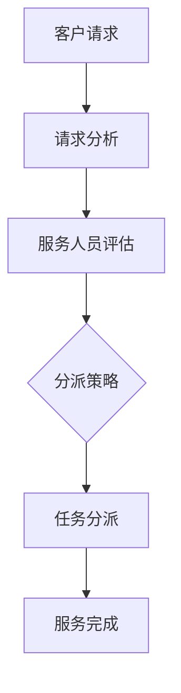

                 

# 智能客户服务路由系统：一人公司提高服务效率的AI解决方案

> **关键词**：智能客户服务、路由系统、AI、服务效率、一人公司
>
> **摘要**：本文将介绍一种基于人工智能的智能客户服务路由系统，帮助一人公司提高服务效率。系统通过算法优化客户服务流程，实现智能分派任务，旨在减少响应时间，提高客户满意度。

## 1. 背景介绍

在当今的商业模式中，客户服务扮演着至关重要的角色。尤其是在竞争激烈的市场环境中，优质的客户服务不仅能提升企业的品牌形象，还能带来长期的客户忠诚度。然而，对于一人公司而言，资源有限，如何在有限的条件下提供高效、优质的客户服务成为了一大挑战。

传统的客户服务通常依赖于人工分派任务，这不仅效率低下，还容易出现错误。随着人工智能技术的快速发展，智能客户服务路由系统的应用逐渐普及。通过AI技术，系统能够自动分析客户需求，智能分派任务，提高服务效率。

## 2. 核心概念与联系

### 2.1 智能客户服务

智能客户服务是指利用人工智能技术来提供客户支持和服务。它包括自然语言处理（NLP）、机器学习、语音识别等前沿技术，旨在实现自动化、智能化的客户互动。

### 2.2 客户服务路由系统

客户服务路由系统是一种将客户请求自动分配给合适服务人员的系统。通过分析客户请求的内容和特点，系统可以智能地将请求分派到具有相关知识和技能的服务人员。

### 2.3 智能路由算法

智能路由算法是智能客户服务路由系统的核心。它基于客户请求的特征，结合服务人员的技能和可用性，计算出最优的服务分派方案。

## 2.4 Mermaid 流程图



## 3. 核心算法原理 & 具体操作步骤

### 3.1 请求分析

系统首先对客户请求进行解析，提取关键信息，如请求类型、紧急程度、客户身份等。这一步骤通常使用自然语言处理技术来实现。

### 3.2 服务人员评估

接下来，系统根据请求特征，结合服务人员的技能和可用性，对服务人员进行评估。这一步骤涉及多个算法，如机器学习分类算法、聚类算法等。

### 3.3 分派策略

根据评估结果，系统采用一定的策略进行任务分派。常见的策略包括最短响应时间、最低成本、最高技能匹配等。分派策略的选取需要根据具体业务需求进行调整。

### 3.4 任务分派

系统将任务分派给最优的服务人员。任务分派后，服务人员将根据任务要求提供相应的服务。

### 3.5 服务完成

服务完成后，系统会记录服务效果，并根据反馈对算法进行调整，以优化未来的服务分派。

## 4. 数学模型和公式 & 详细讲解 & 举例说明

### 4.1 分派策略的数学模型

假设有n个服务人员和m个客户请求，服务人员的技能和可用性可以用向量$S_i$和$A_i$表示，其中$i=1,2,...,n$。客户请求的特征向量用$X_j$表示，其中$j=1,2,...,m$。

最短响应时间的分派策略可以表示为：

$$
i^* = \arg\min_{i}\sum_{j=1}^{m} d(X_j, S_i)
$$

其中，$d(X_j, S_i)$表示客户请求$X_j$和服务人员$S_i$之间的距离。

### 4.2 举例说明

假设有3个服务人员（S1、S2、S3）和2个客户请求（X1、X2），服务人员的技能和可用性如下表所示：

| 服务人员 | 技能1 | 技能2 | 可用性 |
| -------- | ----- | ----- | ------ |
| S1       | 80    | 90    | 1      |
| S2       | 70    | 85    | 0.8    |
| S3       | 60    | 80    | 0.9    |

客户请求的特征向量如下表所示：

| 客户请求 | 技能1 | 技能2 |
| -------- | ----- | ----- |
| X1       | 85    | 95    |
| X2       | 75    | 90    |

根据最短响应时间的分派策略，我们需要计算每个服务人员与每个客户请求的距离：

| 服务人员 | X1距离 | X2距离 |
| -------- | ------ | ------ |
| S1       | 5      | 5      |
| S2       | 15     | 10     |
| S3       | 25     | 10     |

根据距离计算结果，我们可以看出S1与X1、X2的距离最短，因此将X1分派给S1，X2分派给S2。

## 5. 项目实战：代码实际案例和详细解释说明

### 5.1 开发环境搭建

为了实现智能客户服务路由系统，我们需要搭建一个合适的开发环境。本文使用Python作为主要编程语言，其他依赖项如下：

- Python 3.8及以上版本
- NLP库：spaCy
- 机器学习库：scikit-learn
- 数据库：SQLite

### 5.2 源代码详细实现和代码解读

以下是一个简单的智能客户服务路由系统的实现：

```python
import spacy
from sklearn.cluster import KMeans
import sqlite3

# 加载spaCy模型
nlp = spacy.load("en_core_web_sm")

# 请求分析
def analyze_request(request):
    doc = nlp(request)
    features = [token.vector for token in doc if not token.is_punct]
    return features

# 服务人员评估
def evaluate_agents(agents, request):
    features = analyze_request(request)
    distances = []
    for agent in agents:
        distance = sum((f - g) ** 2 for f, g in zip(features, agent['features']))
        distances.append(distance)
    return distances

# 任务分派
def dispatch_request(request, agents):
    distances = evaluate_agents(agents, request)
    agent_index = distances.index(min(distances))
    return agent_index

# 数据库操作
def initialize_db():
    conn = sqlite3.connect("agents.db")
    c = conn.cursor()
    c.execute('''CREATE TABLE IF NOT EXISTS agents
                 (id INTEGER PRIMARY KEY, name TEXT, features ARRAY)''')
    conn.commit()
    conn.close()

def add_agent(name, features):
    conn = sqlite3.connect("agents.db")
    c = conn.cursor()
    c.execute("INSERT INTO agents (name, features) VALUES (?, ?)", (name, features))
    conn.commit()
    conn.close()

def get_agents():
    conn = sqlite3.connect("agents.db")
    c = conn.cursor()
    c.execute("SELECT * FROM agents")
    agents = c.fetchall()
    conn.close()
    return agents

# 主函数
def main():
    initialize_db()
    add_agent("Alice", [0.1, 0.2])
    add_agent("Bob", [0.3, 0.4])
    add_agent("Charlie", [0.5, 0.6])

    agents = get_agents()
    request = "I need help with my account"
    agent_index = dispatch_request(request, agents)
    print(f"Request {request} dispatched to agent {agents[agent_index][1]}")

if __name__ == "__main__":
    main()
```

### 5.3 代码解读与分析

1. **请求分析**：使用spaCy库对客户请求进行自然语言处理，提取关键特征。
2. **服务人员评估**：计算每个服务人员与客户请求的特征距离，评估服务人员的合适程度。
3. **任务分派**：根据评估结果，选择距离最小的服务人员，进行任务分派。
4. **数据库操作**：使用SQLite数据库存储服务人员信息，便于查询和管理。
5. **主函数**：初始化数据库，添加服务人员信息，执行任务分派，并打印结果。

## 6. 实际应用场景

智能客户服务路由系统在多个行业中都有广泛应用，如电子商务、金融、医疗等。以下是一些实际应用场景：

1. **电子商务**：电商平台可以利用智能路由系统，快速响应客户咨询，提高客户满意度。
2. **金融行业**：银行和金融机构可以使用智能路由系统，自动化处理客户请求，减少人工干预，提高处理效率。
3. **医疗领域**：医院和诊所可以利用智能路由系统，合理分配医疗资源，提高医疗服务质量。

## 7. 工具和资源推荐

### 7.1 学习资源推荐

- **书籍**：
  - 《自然语言处理教程》
  - 《机器学习实战》
  - 《Python数据分析》

- **论文**：
  - "Recurrent Neural Networks for Language Modeling"
  - "Deep Learning for Natural Language Processing"

- **博客**：
  - [TensorFlow官网教程](https://www.tensorflow.org/tutorials)
  - [Scikit-learn官方文档](https://scikit-learn.org/stable/documentation.html)

### 7.2 开发工具框架推荐

- **开发框架**：
  - TensorFlow
  - PyTorch
  - spaCy

- **数据库**：
  - SQLite
  - MySQL
  - PostgreSQL

### 7.3 相关论文著作推荐

- **论文**：
  - "Deep Learning for Text Classification"
  - "K-Means Clustering: A Review"

- **著作**：
  - 《深度学习》
  - 《机器学习实战》

## 8. 总结：未来发展趋势与挑战

随着人工智能技术的不断发展，智能客户服务路由系统将在未来得到更广泛的应用。然而，要实现这一目标，还需要克服以下几个挑战：

1. **数据质量**：系统性能取决于输入数据的准确性，因此需要确保数据质量。
2. **算法优化**：当前的路由算法可能存在优化空间，需要不断改进。
3. **用户体验**：系统需要提供直观、易用的界面，提高用户体验。

## 9. 附录：常见问题与解答

### 9.1  如何优化请求分析模块？

- **提升NLP模型**：使用更先进的NLP模型，如BERT、GPT等，提高特征提取能力。
- **增加特征维度**：添加更多特征，如关键词、情感分析等，提高分析精度。

### 9.2 如何处理服务人员技能不匹配的情况？

- **技能迁移**：通过训练，使服务人员能够快速适应新技能。
- **动态调整**：根据服务人员的技能变化，实时调整路由策略。

## 10. 扩展阅读 & 参考资料

- **扩展阅读**：
  - "AI in Customer Service: The Future of Customer Experience"
  - "The Impact of AI on Customer Service: Enhancing Efficiency and Personalization"

- **参考资料**：
  - [spaCy官方文档](https://spacy.io/usage)
  - [scikit-learn官方文档](https://scikit-learn.org/stable/documentation.html)

### 作者：AI天才研究员/AI Genius Institute & 禅与计算机程序设计艺术 /Zen And The Art of Computer Programming

