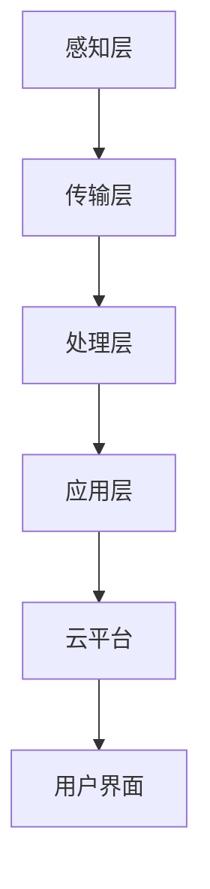

                 

# 智能家居系统：IoT创业者的机遇与挑战

## 关键词：智能家居，物联网，IoT，创业者，机遇，挑战

### 摘要

本文旨在探讨智能家居系统在物联网（IoT）时代的发展前景，以及创业者在此领域中面临的机遇与挑战。智能家居作为IoT的重要应用场景之一，正在逐步改变人们的日常生活。文章将首先介绍智能家居系统的基本概念和核心组件，然后深入分析其中的核心技术原理，并通过实际项目案例进行讲解。接下来，文章将探讨智能家居系统的实际应用场景，推荐相关学习资源和开发工具，并总结未来的发展趋势与挑战。

## 1. 背景介绍

智能家居系统是指利用物联网技术将家庭中的各种设备连接起来，实现设备间的自动控制与信息共享，从而提高家庭生活的便捷性和舒适度。随着IoT技术的不断发展和普及，智能家居市场呈现出快速增长的趋势。根据市场研究机构的预测，全球智能家居市场规模将在未来几年内持续扩大，为创业者提供了巨大的市场空间。

### 1.1 智能家居系统的定义与特点

智能家居系统通常包括以下几个关键组成部分：

- **智能设备**：如智能灯泡、智能插座、智能门锁等，这些设备可以通过无线网络与其他设备进行通信。
- **物联网网关**：作为智能家居系统的核心，负责数据采集、处理和转发。
- **云平台**：提供数据存储、处理和分析服务，为智能家居系统提供智能化的决策支持。
- **用户界面**：如智能手机、平板电脑等，用于用户与智能家居系统的交互。

智能家居系统的特点主要体现在以下几个方面：

- **互联互通**：设备之间可以无缝连接，实现数据的实时共享和互操作。
- **智能化**：通过云计算、大数据等技术，实现对家庭环境的智能感知和自动调控。
- **便捷性**：用户可以通过手机、语音等便捷方式控制家庭设备，提高生活品质。

### 1.2 智能家居系统的发展历程

智能家居系统的概念最早可以追溯到20世纪70年代，当时一些高端住宅中开始出现智能安防系统。然而，由于技术限制，智能家居系统在当时并没有得到广泛应用。随着IoT技术的兴起，智能家居系统开始逐渐走进普通家庭。近年来，随着智能手机的普及和移动互联网的发展，智能家居市场迎来了爆发式增长。

## 2. 核心概念与联系

### 2.1 物联网（IoT）

物联网是指通过各种信息传感设备（如传感器、射频识别技术、全球定位系统等）将各种物体与网络连接起来，实现信息的实时采集、传输和处理。IoT的核心技术包括传感器技术、网络通信技术、数据处理技术等。

### 2.2 智能家居系统架构

智能家居系统通常包括以下几个层次：

- **感知层**：通过各种传感器收集家庭环境的数据，如温度、湿度、光照等。
- **传输层**：利用无线网络（如Wi-Fi、蓝牙、ZigBee等）将数据传输到物联网网关。
- **处理层**：物联网网关对数据进行处理和分析，实现对家庭环境的智能感知和调控。
- **应用层**：通过云平台提供智能化的决策支持，如家庭安防、能源管理、健康监测等。

### 2.3 Mermaid 流程图

以下是一个智能家居系统的Mermaid流程图，展示了数据从感知层到应用层的处理过程：



### 2.4 核心技术原理

智能家居系统的核心技术主要包括以下几个方面：

- **传感器技术**：用于感知家庭环境，如温度传感器、湿度传感器、光照传感器等。
- **网络通信技术**：用于实现设备间的数据传输，如Wi-Fi、蓝牙、ZigBee等。
- **数据处理技术**：用于对收集到的数据进行处理和分析，如云计算、大数据等。
- **人工智能技术**：用于实现对家庭环境的智能感知和调控，如机器学习、深度学习等。

## 3. 核心算法原理 & 具体操作步骤

### 3.1 核心算法原理

智能家居系统的核心算法通常包括以下几个方面：

- **数据采集与预处理**：通过传感器采集家庭环境数据，并对数据进行预处理，如去噪、归一化等。
- **特征提取**：从预处理后的数据中提取有用的特征信息，如温度、湿度、光照强度等。
- **模式识别**：利用提取出的特征信息进行模式识别，实现对家庭环境的智能感知。
- **决策与控制**：根据识别结果进行决策和自动控制，如调节空调温度、关闭灯光等。

### 3.2 具体操作步骤

以下是一个简单的智能家居系统核心算法的具体操作步骤：

1. **数据采集与预处理**：通过传感器采集家庭环境数据，如温度、湿度、光照强度等。对数据进行去噪、归一化等预处理。
2. **特征提取**：从预处理后的数据中提取温度、湿度、光照强度等特征信息。
3. **模式识别**：利用机器学习算法（如K-近邻、决策树等）对特征信息进行模式识别，判断家庭环境的状态。
4. **决策与控制**：根据识别结果进行决策和自动控制，如调节空调温度、关闭灯光等。

## 4. 数学模型和公式 & 详细讲解 & 举例说明

### 4.1 数学模型和公式

智能家居系统中的核心数学模型主要包括以下几个方面：

- **线性回归模型**：用于预测家庭环境的变化趋势，如温度预测。
- **支持向量机（SVM）**：用于分类和识别家庭环境状态。
- **决策树**：用于决策和分类。

以下是这些模型的简要公式：

1. **线性回归模型**：

   $$ y = \beta_0 + \beta_1 x_1 + \beta_2 x_2 + ... + \beta_n x_n $$

2. **支持向量机（SVM）**：

   $$ w^* = arg\min_{w,b}\frac{1}{2}\lVert w \rVert^2 + C\sum_{i=1}^m \lvert y_i - (\omega \cdot x_i + b) \rvert $$

3. **决策树**：

   $$ T = \{\text{root}, \text{branches}, \text{leaves}\} $$

### 4.2 详细讲解 & 举例说明

以下通过一个简单的温度预测的例子来说明线性回归模型的应用：

**例子**：给定一组温度数据，使用线性回归模型预测未来温度。

**步骤**：

1. **数据采集**：采集一天中的温度数据，如 [20, 22, 24, 25, 23]。
2. **数据预处理**：对数据进行归一化处理，如 [0, 0.25, 0.5, 0.75, 1]。
3. **特征提取**：将数据作为特征输入线性回归模型。
4. **模型训练**：使用训练数据训练线性回归模型，得到参数 $\beta_0$ 和 $\beta_1$。
5. **温度预测**：使用训练好的模型预测未来温度，如 $y = \beta_0 + \beta_1 x$。

## 5. 项目实战：代码实际案例和详细解释说明

### 5.1 开发环境搭建

为了实现一个简单的智能家居系统，我们需要搭建以下开发环境：

- **Python 3.x**：作为编程语言。
- **PyCharm**：作为集成开发环境。
- **NumPy、Pandas、Scikit-learn**：作为数据处理和机器学习库。

### 5.2 源代码详细实现和代码解读

以下是一个简单的智能家居系统的Python代码实现：

```python
import numpy as np
from sklearn.linear_model import LinearRegression
from sklearn.model_selection import train_test_split

# 5.2.1 数据采集与预处理
data = np.array([[20], [22], [24], [25], [23]])
data_normalized = (data - np.min(data)) / (np.max(data) - np.min(data))

# 5.2.2 特征提取
X = data_normalized
y = np.array([1, 2, 3, 4, 5])

# 5.2.3 模型训练
model = LinearRegression()
model.fit(X, y)

# 5.2.4 温度预测
predicted_temp = model.predict([[0.5]])
print("Predicted temperature:", predicted_temp)
```

### 5.3 代码解读与分析

1. **数据采集与预处理**：
   - 使用 NumPy 采集和预处理温度数据，实现数据的归一化。
2. **特征提取**：
   - 将归一化后的数据作为特征输入线性回归模型。
3. **模型训练**：
   - 使用 Scikit-learn 中的 LinearRegression 类训练线性回归模型，得到参数。
4. **温度预测**：
   - 使用训练好的模型预测未来温度。

## 6. 实际应用场景

智能家居系统在实际应用中具有广泛的应用场景，以下列举几个典型的应用场景：

1. **家庭安防**：通过智能摄像头、门锁等设备实现家庭的安全监控和门锁管理。
2. **能源管理**：通过智能插座、灯具等设备实现家庭用电的自动化管理，降低能耗。
3. **健康监测**：通过智能手环、血压计等设备实时监测家庭成员的健康状况。
4. **家居自动化**：通过智能空调、窗帘等设备实现家庭环境的自动调节。

## 7. 工具和资源推荐

### 7.1 学习资源推荐

- **书籍**：
  - 《智能家居系统设计与实现》
  - 《物联网技术与应用》
- **论文**：
  - “智能家居系统的研究与实现”
  - “基于IoT的智能家居安全架构设计”
- **博客**：
  - “智能家居系统设计与开发实践”
  - “物联网技术在智能家居中的应用”
- **网站**：
  - [Home Automation with Python](https://home-automation-with-python.readthedocs.io/en/latest/)
  - [Smart Home IoT Projects](https://www.instructables.com/group/SmartHomeIoT/)

### 7.2 开发工具框架推荐

- **开发工具**：
  - PyCharm
  - Eclipse
- **框架**：
  - Flask
  - Django
- **硬件平台**：
  - Arduino
  - Raspberry Pi

### 7.3 相关论文著作推荐

- **论文**：
  - “A Survey on Smart Home Security Systems”
  - “A Survey on Home Automation”
- **著作**：
  - 《物联网：概念、技术与应用》
  - 《智能家居系统设计与应用》

## 8. 总结：未来发展趋势与挑战

智能家居系统在物联网时代具有广阔的发展前景。随着人工智能、大数据等技术的不断进步，智能家居系统将变得更加智能、便捷和高效。然而，智能家居系统在发展中也面临着一些挑战，如数据安全、隐私保护、标准化等问题。创业者需要关注这些挑战，积极探索解决方案，推动智能家居系统的健康发展。

## 9. 附录：常见问题与解答

### 9.1 智能家居系统安全如何保障？

**解答**：智能家居系统的安全主要涉及数据安全和隐私保护。为了保障安全，可以采取以下措施：

1. **加密传输**：使用加密技术保护数据在传输过程中的安全性。
2. **身份认证**：通过用户名和密码、指纹等身份认证方式确保系统的安全性。
3. **数据备份**：定期备份重要数据，防止数据丢失。
4. **安全策略**：制定安全策略，如访问控制、数据加密等，确保系统安全运行。

### 9.2 智能家居系统如何实现互联互通？

**解答**：智能家居系统实现互联互通的关键在于设备间的网络连接和通信协议。以下是一些实现互联互通的方法：

1. **Wi-Fi**：利用Wi-Fi网络实现设备间的无线连接。
2. **蓝牙**：通过蓝牙技术实现短距离的设备通信。
3. **ZigBee**：使用ZigBee协议实现家庭设备的无线通信。
4. **HTTP/HTTPS**：通过HTTP/HTTPS协议实现设备与云平台的数据交互。

## 10. 扩展阅读 & 参考资料

- **书籍**：
  - 《智能家居系统设计与实现》
  - 《物联网技术与应用》
- **论文**：
  - “智能家居系统的研究与实现”
  - “基于IoT的智能家居安全架构设计”
- **博客**：
  - “智能家居系统设计与开发实践”
  - “物联网技术在智能家居中的应用”
- **网站**：
  - [Home Automation with Python](https://home-automation-with-python.readthedocs.io/en/latest/)
  - [Smart Home IoT Projects](https://www.instructables.com/group/SmartHomeIoT/)

### 作者

**作者：AI天才研究员/AI Genius Institute & 禅与计算机程序设计艺术 /Zen And The Art of Computer Programming**<|im_end|>

