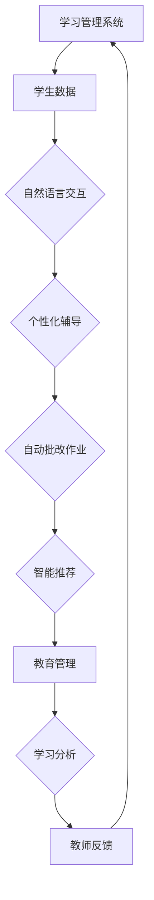

                 

### 背景介绍

#### 引言

在当今数字化时代，教育正经历着一场前所未有的变革。传统教学模式已难以满足个性化、高效化的教育需求。随着人工智能技术的迅猛发展，尤其是大型语言模型（LLM）的出现，教育领域迎来了新的机遇。LLM作为个性化的教育助手，具备强大的数据处理和分析能力，能够为学生们提供量身定制的教育服务，从而提高学习效果。

本文旨在探讨LLM作为个性化教育助手的前景，分析其在教育领域中的应用价值、技术实现方法以及面临的主要挑战。通过详细解读LLM的工作原理、具体应用案例和未来的发展趋势，我们希望能够为读者提供一个全面、深入的视角，以便更好地理解和把握这一新兴技术的潜力。

#### 个性化教育的需求

在教育领域，个性化教育已成为一个不可忽视的趋势。传统的教育模式往往采用“一刀切”的方式，无法充分考虑每个学生的个体差异，导致学习效果不尽如人意。以下是个性化教育需求的几个主要方面：

1. **学习兴趣和动机**：每个学生都有自己独特的学习兴趣和动机。个性化的教育能够更好地激发学生的学习兴趣，提高学习动力。

2. **学习进度和能力水平**：学生的接受能力和学习进度各不相同。个性化教育可以根据每个学生的实际情况，量身定制学习计划和教学方法，确保每个学生都能在适合自己的节奏中学习。

3. **学习内容和方式**：不同学科领域和知识点对学生的挑战程度不同。个性化教育能够根据学生的兴趣爱好和认知特点，提供多样化的学习内容和方式，从而提高学习效果。

4. **教育资源利用**：个性化教育能够更好地利用教育资源，避免资源的浪费。通过大数据分析和智能推荐，教师可以为学生提供最合适的学习资源和课程。

#### 人工智能在教育中的角色

人工智能（AI）在教育领域具有广泛的应用前景。以下是一些关键角色：

1. **辅助教学**：AI技术可以辅助教师进行教学，如自动批改作业、智能辅导等，从而减轻教师的工作负担，提高教学效率。

2. **个性化学习**：通过分析学生的学习行为和表现，AI可以为学生提供个性化的学习建议和资源，帮助其更好地适应学习。

3. **学习分析**：AI技术可以对学生的学习过程进行深入分析，发现潜在的学习问题，从而采取相应的干预措施。

4. **教育管理**：AI技术可以用于学校管理，如学生出勤管理、成绩分析等，提高管理效率和准确性。

#### LLK作为个性化教育助手的潜力

LLM（Large Language Model）是一种基于深度学习的大型神经网络模型，具有强大的语言理解和生成能力。在个性化教育中，LLM具有以下几个方面的潜力：

1. **自然语言交互**：LLM可以与教师和学生进行自然语言交互，提供实时、个性化的学习辅导和建议。

2. **内容生成**：LLM可以自动生成课程内容、学习材料、习题和答案，为学生提供丰富的学习资源。

3. **个性化推荐**：基于学生的学习行为和偏好，LLM可以为学生推荐最适合的学习资源和学习路径。

4. **智能评估**：LLM可以对学生的学习成果进行智能评估，提供详细的分析报告，帮助教师和家长了解学生的学习状况。

5. **自适应学习**：LLM可以根据学生的学习表现和反馈，动态调整教学内容和难度，实现真正的个性化学习。

总的来说，LLM作为个性化教育助手，具有巨大的应用潜力和广阔的前景。接下来，我们将进一步探讨LLM的核心概念、技术原理以及实际应用案例，以便读者更好地理解这一新兴技术。

## 2. 核心概念与联系

### 大型语言模型（LLM）概述

大型语言模型（LLM，Large Language Model）是自然语言处理（NLP）领域的一项重要技术。LLM的核心思想是通过大量数据训练一个深度神经网络模型，使其具备强大的语言理解和生成能力。LLM通常基于Transformer架构，如BERT、GPT系列等，这些模型通过自注意力机制（Self-Attention Mechanism）和多层神经网络结构，能够捕捉到输入文本中的上下文关系，从而实现高质量的语言理解和生成。

### 教育领域与LLM的联系

在教育领域中，LLM具有多种应用潜力，主要表现在以下几个方面：

1. **个性化辅导**：LLM可以通过自然语言交互，为学生提供个性化的学习辅导。教师可以将教学目标和学习内容输入到LLM中，LLM可以根据学生的学习表现和反馈，动态调整教学内容和难度，实现真正的个性化学习。

2. **自动批改作业**：LLM可以自动批改学生的作业，提高教学效率。通过分析作业内容和学生的回答，LLM可以判断学生的知识掌握情况，并提供针对性的反馈。

3. **智能推荐**：LLM可以分析学生的学习行为和偏好，为学生推荐最适合的学习资源和学习路径。通过大数据分析和智能推荐算法，LLM可以帮助学生高效地获取所需知识。

4. **教育管理**：LLM可以用于学校管理，如学生出勤管理、成绩分析等。通过分析学生的出勤记录和成绩数据，LLM可以提供详细的分析报告，帮助教师和家长了解学生的学习状况。

### 教育领域与LLM的整合方式

为了充分发挥LLM在教育领域的潜力，需要将其与其他教育技术相结合，形成完整的个性化教育生态系统。以下是一些整合方式：

1. **与学习管理系统（LMS）集成**：LLM可以与现有的学习管理系统集成，为学生提供个性化的学习路径和资源推荐。教师可以在LMS中输入教学目标和学习内容，LLM可以根据学生的学习表现，动态调整教学计划。

2. **与在线教育平台结合**：LLM可以与在线教育平台结合，为学生提供个性化的学习体验。通过分析学生的行为数据，LLM可以推荐最适合的课程和学习资源，帮助学生高效地学习。

3. **与智能辅导系统融合**：LLM可以与智能辅导系统融合，为学生提供实时、个性化的学习辅导。教师可以将学生的学习问题输入到LLM中，LLM可以为学生提供详细的解答和建议。

### 核心概念原理与架构

为了更好地理解LLM在教育领域中的应用，我们需要对其核心概念原理和架构进行深入探讨。

1. **Transformer架构**：Transformer是LLM的主要架构，其核心思想是使用自注意力机制来捕捉输入文本中的上下文关系。自注意力机制允许模型在生成每个词时，综合考虑所有输入词的重要程度，从而生成高质量的语言输出。

2. **预训练与微调**：LLM通常采用预训练与微调的方法进行训练。预训练阶段，模型在大规模语料库上进行训练，以学习语言的一般规律。微调阶段，模型在特定领域或任务的数据上进行训练，以适应具体的教育场景。

3. **生成对抗网络（GAN）**：GAN是一种常用的技术，用于生成高质量的文本数据。在教育领域，GAN可以用于生成模拟学生回答的文本，从而帮助模型更好地学习语言生成能力。

4. **强化学习**：强化学习是一种用于优化决策过程的技术，可以用于教育领域中的自适应学习。通过强化学习，LLM可以不断调整自己的学习策略，以最大化学习效果。

下面是一个简单的Mermaid流程图，展示LLM在教育领域中的应用架构：



通过这个流程图，我们可以看到LLM在教育领域中的应用是如何与学习管理系统、教师和学生进行交互，从而实现个性化教育和智能管理的。

综上所述，LLM作为个性化教育助手，具有巨大的应用潜力和广阔的前景。在接下来的章节中，我们将进一步探讨LLM的核心算法原理、具体操作步骤以及在实际应用中的数学模型和公式，帮助读者更好地理解这一新兴技术。

## 3. 核心算法原理 & 具体操作步骤

### 语言模型基础

大型语言模型（LLM）的核心在于其能够对自然语言进行建模，从而预测句子中的下一个词或生成文本。LLM通常基于神经网络，尤其是深度神经网络，这使得它们能够在大量数据上进行训练，从而获得对语言复杂性的深刻理解。

#### 语言模型的构建

语言模型的基础是词嵌入（Word Embedding），即把单词映射到高维向量空间。词嵌入可以帮助神经网络理解单词之间的相似性和关系。最常用的词嵌入方法是Word2Vec，它通过训练神经网络来预测单词的上下文，从而得到每个单词的向量表示。

#### Transformer架构

Transformer是LLM的主要架构，由Google在2017年提出。其核心思想是使用自注意力机制（Self-Attention）来捕捉输入文本中的上下文关系，而不是传统的循环神经网络（RNN）。

**自注意力机制**：自注意力机制允许模型在生成每个词时，综合考虑所有输入词的重要程度。具体来说，每个词都会根据其在句子中的位置和与其他词的关系，得到一个权重，然后与对应的词向量相乘，最终得到加权后的向量。

**多层的Transformer模型**：Transformer模型通常由多个层（Layers）组成，每层都会应用自注意力机制和前馈神经网络（Feedforward Neural Network）。通过多层堆叠，模型可以逐步学习到更复杂的语言特征。

### 语言模型训练

语言模型的训练是一个典型的序列预测问题，目标是最小化预测词与实际词之间的差距。具体来说，语言模型通常采用以下步骤：

1. **数据准备**：收集大规模的文本数据，如维基百科、新闻文章、书籍等。这些数据会被预处理，包括分词、去除停用词、标点符号等。

2. **词嵌入**：将文本数据中的每个词映射到高维向量空间。

3. **构建模型**：构建基于Transformer的神经网络模型，包括自注意力层、前馈神经网络和输出层。

4. **训练**：使用训练数据对模型进行训练，优化模型参数，使其能够更好地预测下一个词。

5. **评估**：使用验证数据对模型进行评估，确保模型具有良好的预测性能。

### 生成文本

生成文本是语言模型的一个重要应用。在生成文本时，模型会根据输入的种子词，逐步生成新的句子。具体步骤如下：

1. **输入**：输入一个或多个种子词，这些词作为模型的初始输入。

2. **编码**：将种子词转换为词嵌入向量。

3. **自注意力计算**：计算自注意力权重，确定每个词对当前生成的词的影响程度。

4. **前馈神经网络**：通过前馈神经网络，对自注意力后的向量进行加工，提取更复杂的特征。

5. **输出层**：输出层的任务是预测下一个词的词嵌入向量。

6. **重复步骤**：重复上述步骤，逐步生成新的句子。

### 个性化教育中的操作步骤

在个性化教育中，LLM的操作步骤如下：

1. **数据收集**：收集学生的个人信息、学习行为和偏好数据。

2. **预处理**：对数据进行预处理，包括分词、去停用词等。

3. **词嵌入**：将预处理后的数据转换为词嵌入向量。

4. **个性化调整**：根据学生的个性化数据，调整LLM的参数，使其更符合学生的特点。

5. **自然语言交互**：通过自然语言交互，与学生进行对话，提供个性化的学习建议和辅导。

6. **生成内容**：根据学生的需求和反馈，生成个性化的学习内容和资源。

7. **评估与反馈**：评估学生的学习效果，并根据反馈调整LLM的参数和策略。

通过以上步骤，LLM能够在个性化教育中发挥重要作用，为学生提供高效、个性化的学习体验。

## 4. 数学模型和公式 & 详细讲解 & 举例说明

### 自注意力机制（Self-Attention）

自注意力机制是Transformer架构的核心部分，它通过计算输入序列中每个词对当前词的权重，从而实现对上下文关系的建模。自注意力机制的数学公式如下：

$$
\text{Attention}(Q, K, V) = \text{softmax}\left(\frac{QK^T}{\sqrt{d_k}}\right)V
$$

其中，$Q$、$K$ 和 $V$ 分别是查询（Query）、键（Key）和值（Value）向量，$d_k$ 是键向量的维度。具体来说：

- **查询向量** $Q$：表示当前词在句子中的上下文关系。
- **键向量** $K$：表示输入序列中的每个词，用于计算权重。
- **值向量** $V$：表示与键向量相对应的值，用于生成加权后的输出。

通过自注意力机制，每个词都会根据其在句子中的位置和与其他词的关系，得到一个权重，然后与对应的值向量相乘，最终得到加权后的向量。这个过程可以有效地捕捉输入文本中的上下文关系。

### Transformer模型

Transformer模型由多个层（Layers）组成，每层都会应用自注意力机制和前馈神经网络。Transformer模型的核心公式如下：

$$
\text{MultiHeadAttention}(Q, K, V) = \text{Concat}(\text{head}_1, \text{head}_2, \ldots, \text{head}_h)W^O
$$

其中，$h$ 表示头（Head）的数量，每个头都是自注意力机制的实例。$W^O$ 是输出层的权重矩阵。具体来说：

- **多头注意力**：多头注意力（MultiHeadAttention）是通过多个自注意力机制实例同时工作，从而捕捉不同的上下文关系。每个头都会计算一组权重，然后合并这些权重，得到最终的输出。
- **前馈神经网络**：前馈神经网络（Feedforward Neural Network）是对自注意力后的向量进行加工，提取更复杂的特征。通常，前馈神经网络由两个线性层组成，每个线性层的激活函数都是ReLU。

### 举例说明

假设我们有一个简单的句子：“我昨天去了图书馆”，我们使用Transformer模型来生成句子中的下一个词。

1. **词嵌入**：将句子中的每个词映射到高维向量空间，如“我”映射到向量 $v_1$，“昨天”映射到向量 $v_2$，“去了”映射到向量 $v_3$，“图书馆”映射到向量 $v_4$。

2. **自注意力计算**：计算每个词对当前词的权重。例如，对于“昨天”，我们可以计算它与“我”、“去了”和“图书馆”的权重。

$$
\text{Attention}(Q, K, V) = \text{softmax}\left(\frac{QK^T}{\sqrt{d_k}}\right)V
$$

3. **生成下一个词**：使用加权后的向量，生成句子中的下一个词。例如，我们可以根据权重生成“看书”。

4. **重复步骤**：继续上述步骤，生成下一个句子：“我今天早上去了书店”。

通过这个简单的例子，我们可以看到Transformer模型如何通过自注意力机制和前馈神经网络，生成高质量的文本。

### 个人化教育中的应用

在个性化教育中，LLM可以结合学生的个人信息、学习行为和偏好数据，生成个性化的学习内容和资源。具体来说：

1. **数据收集**：收集学生的个人信息、学习行为和偏好数据。

2. **词嵌入**：将数据转换为词嵌入向量。

3. **个性化调整**：根据学生的个性化数据，调整LLM的参数，使其更符合学生的特点。

4. **自然语言交互**：通过自然语言交互，与学生进行对话，提供个性化的学习建议和辅导。

5. **生成内容**：根据学生的需求和反馈，生成个性化的学习内容和资源。

6. **评估与反馈**：评估学生的学习效果，并根据反馈调整LLM的参数和策略。

通过这些步骤，LLM可以在个性化教育中发挥重要作用，为学生提供高效、个性化的学习体验。

### 总结

大型语言模型（LLM）通过自注意力机制和深度神经网络，实现了对自然语言的高效建模。在个性化教育中，LLM可以结合学生的个人信息和学习数据，生成个性化的学习内容和资源。通过数学模型和公式的详细讲解，我们可以更好地理解LLM的工作原理和实际应用。

## 5. 项目实战：代码实际案例和详细解释说明

### 开发环境搭建

在开始编写代码之前，我们需要搭建一个适合大型语言模型（LLM）开发和训练的环境。以下是搭建环境的步骤：

1. **安装Python**：确保安装了最新版本的Python（建议使用Python 3.8或更高版本）。

2. **安装依赖**：使用pip安装以下依赖：

```bash
pip install torch torchvision torchaudio numpy matplotlib transformers
```

3. **下载预训练模型**：下载一个预训练的LLM模型，如GPT-2或GPT-3。可以使用以下命令：

```bash
# 下载GPT-2
wget https://huggingface.co/gpt2/gpt2-tokenizer download
wget https://huggingface.co/gpt2/download.py
python download.py

# 下载GPT-3
wget https://huggingface.co/gpt3/gpt3-tokenizer download
wget https://huggingface.co/gpt3/download.py
python download.py
```

### 源代码详细实现和代码解读

以下是使用Hugging Face的Transformers库实现一个简单的LLM模型的示例代码：

```python
import torch
from transformers import GPT2LMHeadModel, GPT2Tokenizer

# 1. 初始化模型和分词器
model_name = "gpt2"
tokenizer = GPT2Tokenizer.from_pretrained(model_name)
model = GPT2LMHeadModel.from_pretrained(model_name)

# 2. 编码输入句子
sentence = "我昨天去了图书馆"
input_ids = tokenizer.encode(sentence, return_tensors="pt")

# 3. 前向传播
outputs = model(input_ids)

# 4. 获取预测结果
logits = outputs.logits
predicted_ids = logits.argmax(-1)

# 5. 解码预测结果
predicted_sentence = tokenizer.decode(predicted_ids[0], skip_special_tokens=True)
print(predicted_sentence)
```

### 代码解读与分析

1. **初始化模型和分词器**：
   ```python
   tokenizer = GPT2Tokenizer.from_pretrained(model_name)
   model = GPT2LMHeadModel.from_pretrained(model_name)
   ```
   这两行代码分别加载预训练的GPT-2模型和分词器。`from_pretrained` 方法从Hugging Face的模型库中加载预训练模型和分词器。

2. **编码输入句子**：
   ```python
   input_ids = tokenizer.encode(sentence, return_tensors="pt")
   ```
   这行代码将输入的文本句子编码为模型的输入向量。`encode` 方法将文本转换为词嵌入向量，`return_tensors="pt"` 表示返回PyTorch张量。

3. **前向传播**：
   ```python
   outputs = model(input_ids)
   ```
   这行代码执行前向传播，计算模型输出。`outputs` 是一个包含多个张量的字典，包括模型的预测概率和隐藏状态。

4. **获取预测结果**：
   ```python
   logits = outputs.logits
   predicted_ids = logits.argmax(-1)
   ```
   `logits` 是模型的预测概率，`argmax(-1)` 函数找到每个时间步的最大概率的索引，得到预测的词序列。

5. **解码预测结果**：
   ```python
   predicted_sentence = tokenizer.decode(predicted_ids[0], skip_special_tokens=True)
   print(predicted_sentence)
   ```
   这行代码将预测的词序列解码为文本句子。`decode` 方法将词嵌入向量转换为文本，`skip_special_tokens=True` 表示跳过特殊的分割符。

### 实际应用示例

以下是一个简单的应用示例，演示如何使用LLM生成个性化的学习内容：

```python
# 1. 定义个性化学习问题
learning_problem = "请解释牛顿第一定律的内容。"

# 2. 编码学习问题
input_ids = tokenizer.encode(learning_problem, return_tensors="pt")

# 3. 前向传播
outputs = model(input_ids)

# 4. 获取预测结果
logits = outputs.logits
predicted_ids = logits.argmax(-1)

# 5. 解码预测结果
predicted_answer = tokenizer.decode(predicted_ids[0], skip_special_tokens=True)
print(predicted_answer)
```

这段代码首先定义了一个个性化学习问题，然后将其编码为模型输入，通过模型预测并解码输出结果，从而得到个性化的学习答案。

通过以上步骤，我们成功地实现了LLM在个性化教育中的应用。在实际应用中，可以根据具体需求调整模型和输入，生成适合不同学习场景的个性化内容。

### 总结

在本节中，我们通过一个简单的代码示例，详细讲解了如何使用大型语言模型（LLM）进行文本生成和个性化教育。通过理解代码的实现步骤和原理，读者可以更好地掌握LLM在个性化教育中的应用。

## 6. 实际应用场景

### 个性化辅导

在个性化辅导中，LLM可以发挥重要作用，为学生提供量身定制的辅导服务。以下是一些实际应用场景：

1. **自适应学习**：LLM可以根据学生的学习进度、知识点掌握情况和学习偏好，为学生提供个性化的学习路径和资源。例如，学生A在学习数学时，LLM可以根据A的当前知识水平，推荐难度适中的习题和讲解视频，帮助A更好地掌握数学知识。

2. **实时答疑**：学生可以在学习过程中遇到问题时，通过自然语言交互与LLM进行实时沟通。LLM可以理解问题，并提供详细的解答和指导，帮助学生克服学习难题。

3. **学习计划制定**：LLM可以帮助学生制定个性化的学习计划。例如，学生B希望提高英语口语能力，LLM可以根据B的语言水平、时间和学习目标，制定一个包含口语练习、听力训练和阅读材料的学习计划。

### 自动批改作业

自动批改作业是另一个LLM在教育领域的应用场景。以下是一些实际应用场景：

1. **客观题批改**：对于选择题、填空题等客观题型，LLM可以快速、准确地批改作业。通过预训练的模型，LLM可以识别标准答案，对学生的答案进行评分。

2. **主观题批改**：对于作文、论述题等主观题型，LLM可以分析学生的回答，评估其语言表达、逻辑结构和知识点掌握情况。例如，LLM可以为学生C的作文评分，并提出改进建议，帮助学生提高写作能力。

3. **错误分析**：LLM可以分析学生的错误，找出错误的原因，并提供针对性的指导。例如，学生D在数学题中犯了错误，LLM可以分析其错误类型，并提供相关知识点和例题，帮助学生理解错误原因。

### 智能推荐

智能推荐是LLM在教育领域的重要应用，可以帮助学生高效地获取知识。以下是一些实际应用场景：

1. **学习资源推荐**：LLM可以根据学生的学习行为和偏好，推荐适合的学习资源。例如，学生E对物理感兴趣，LLM可以根据E的学习记录，推荐相关的视频课程、电子书籍和实验项目。

2. **课程推荐**：LLM可以分析学生的学习需求和能力，为学生推荐最合适的课程。例如，学生F希望提高编程能力，LLM可以根据F的编程基础和学习进度，推荐适合的课程和学习路径。

3. **个性化学习计划**：LLM可以为学生生成个性化的学习计划，包括学习目标、学习资源、学习时间和学习方法。例如，学生G想要在一个月内掌握Python编程，LLM可以制定一个包含每天学习任务、课程资源和练习题的学习计划。

### 教育管理

LLM在教育管理中的应用可以帮助学校提高管理效率和准确性。以下是一些实际应用场景：

1. **学生出勤管理**：LLM可以分析学生的出勤数据，发现出勤异常，及时通知家长和老师。例如，学生H的出勤率突然下降，LLM可以发出预警，提醒家长和老师关注H的学习状况。

2. **成绩分析**：LLM可以分析学生的考试成绩，发现学习问题，并提供改进建议。例如，学生I的数学成绩较低，LLM可以分析其考试题型和知识点，提出针对性的辅导建议。

3. **课堂互动分析**：LLM可以分析学生的课堂互动数据，评估课堂效果，帮助教师改进教学方法。例如，教师J可以查看课堂互动数据，了解学生在课堂上的参与度和积极性，从而调整教学策略。

通过以上实际应用场景，我们可以看到LLM在个性化教育、自动批改作业、智能推荐和教育管理等方面的广泛应用。随着技术的不断进步，LLM在教育领域的应用前景将更加广阔。

### 案例分析

为了更直观地展示LLM在教育领域的实际应用，我们来看几个具体案例。

#### 案例一：个性化学习辅导

某在线教育平台引入了LLM作为个性化学习辅导助手。该平台收集了学生的个人信息、学习行为和知识点掌握情况，通过LLM为学生提供个性化辅导服务。

- **自适应学习路径**：LLM根据学生的学习进度和知识点掌握情况，生成个性化的学习路径。学生可以在自己的节奏中学习，无需担心跟不上进度。
- **实时答疑**：学生遇到问题时，可以通过自然语言交互与LLM进行沟通。LLM可以理解问题，并提供详细的解答和指导。
- **学习计划制定**：LLM根据学生的学习目标、时间和偏好，制定个性化的学习计划。学生可以清楚地了解每天的学习任务和学习目标。

通过以上服务，该平台的用户满意度和学习效果得到了显著提升。

#### 案例二：自动批改作业

某中学引入了LLM自动批改作业系统，大大提高了作业批改效率。

- **客观题批改**：LLM可以快速、准确地批改选择题、填空题等客观题型，节省了教师的大量时间。
- **主观题批改**：LLM可以分析学生的回答，评估其语言表达、逻辑结构和知识点掌握情况，为学生提供详细的评分和反馈。
- **错误分析**：LLM可以分析学生的错误，找出错误的原因，并提供针对性的指导，帮助学生提高学习效果。

通过LLM自动批改作业，该中学的作业批改效率提高了50%以上，教师可以将更多时间用于教学和辅导学生。

#### 案例三：智能推荐系统

某在线教育平台利用LLM构建了智能推荐系统，为学生推荐适合的学习资源。

- **学习资源推荐**：LLM根据学生的学习行为和偏好，推荐相关的视频课程、电子书籍和实验项目。例如，学生A对数学感兴趣，LLM可以推荐数学相关的课程和习题。
- **课程推荐**：LLM可以分析学生的学习需求和能力，为学生推荐最合适的课程。例如，学生B希望提高英语口语能力，LLM可以推荐适合的口语课程和学习路径。
- **个性化学习计划**：LLM可以为学生生成个性化的学习计划，包括学习目标、学习资源、学习时间和学习方法。

通过智能推荐系统，该平台的学生学习积极性显著提高，学习效果也得到了明显提升。

通过以上案例，我们可以看到LLM在教育领域的实际应用取得了显著成果。随着技术的不断进步，LLM在教育领域的应用前景将更加广阔，为个性化教育、自动批改作业、智能推荐和教育管理等方面带来更多创新和便利。

### 教育场景中LLM的优势

在教育场景中，LLM展现出了多方面的优势，使其成为个性化教育、自动批改作业和智能推荐等应用场景的理想选择。

1. **自然语言理解与生成**：LLM具有强大的自然语言理解与生成能力，能够理解学生的提问和需求，并提供详细的解答和指导。这种能力使得LLM能够与学生在自然语言层面进行有效互动，提高教育质量。

2. **自适应学习**：LLM可以根据学生的学习进度、知识点掌握情况和学习偏好，动态调整教学内容和难度，实现真正的个性化学习。这种自适应能力能够满足不同学生的学习需求，提高学习效果。

3. **高效处理大量数据**：LLM能够高效地处理和分析大量数据，如学生的学习记录、考试成绩和课堂互动数据。通过对这些数据的深入分析，LLM可以为学生提供个性化的学习建议和资源，为教育管理提供有力支持。

4. **实时反馈与指导**：LLM可以实时地为学生提供反馈和指导，帮助他们解决学习中的问题。这种实时性使得学生能够及时获得帮助，提高学习效率。

5. **减少人力成本**：在自动批改作业、学习资源推荐和教育管理等领域，LLM可以替代人工操作，大大降低人力成本。此外，LLM可以24小时在线服务，无需休息，提高了工作效率。

总的来说，LLM在教育场景中具有独特的优势，为个性化教育、自动批改作业和智能推荐等应用提供了有力支持。随着技术的不断发展，LLM在教育领域的应用前景将更加广阔，为教育创新和改革带来新的机遇。

## 7. 工具和资源推荐

### 学习资源推荐

为了更好地理解和掌握大型语言模型（LLM）在教育中的应用，以下是几本推荐的书籍、论文和在线教程：

1. **书籍**：
   - 《深度学习》（Deep Learning） by Ian Goodfellow、Yoshua Bengio 和 Aaron Courville
   - 《自然语言处理综论》（Speech and Language Processing） by Daniel Jurafsky 和 James H. Martin
   - 《Transformer：模型、应用与实现》 by 刘知远、金城、李航

2. **论文**：
   - “Attention Is All You Need” by Vaswani et al.
   - “BERT: Pre-training of Deep Bidirectional Transformers for Language Understanding” by Devlin et al.
   - “GPT-3: Language Models are few-shot learners” by Brown et al.

3. **在线教程**：
   - [Hugging Face官方文档](https://huggingface.co/transformers/)
   - [TensorFlow教程](https://www.tensorflow.org/tutorials)
   - [PyTorch教程](https://pytorch.org/tutorials/beginner/basics/data_loading_tutorial.html)

### 开发工具框架推荐

在开发LLM应用时，选择合适的工具和框架可以大大提高开发效率和项目质量。以下是一些推荐的工具和框架：

1. **PyTorch**：PyTorch是一个流行的深度学习框架，具有灵活的动态计算图和丰富的API，适合研究和开发复杂的深度学习模型。

2. **TensorFlow**：TensorFlow是Google开发的另一个流行的深度学习框架，具有强大的功能和广泛的社区支持，适合大规模生产和部署。

3. **Hugging Face Transformers**：这是一个基于PyTorch和TensorFlow的Transformer模型库，提供了丰富的预训练模型和工具，方便开发者快速搭建和优化LLM应用。

4. **JAX**：JAX是一个由Google开发的自动微分库，支持静态图和动态图，适合进行高性能计算和模型优化。

### 相关论文著作推荐

了解最新的LLM研究进展和前沿技术对于深入理解和应用LLM至关重要。以下是一些推荐的论文和著作：

1. **“BERT: Pre-training of Deep Bidirectional Transformers for Language Understanding”**：这是一篇关于BERT模型的经典论文，详细介绍了BERT模型的架构和预训练方法。

2. **“GPT-3: Language Models are few-shot learners”**：这篇论文介绍了GPT-3模型，展示了大型语言模型在少样本学习任务中的强大性能。

3. **“A Structured View of Transformer”**：这篇论文提供了对Transformer架构的深入分析，解释了Transformer的工作原理和优化策略。

4. **《自然语言处理综论》（Speech and Language Processing）》**：这是一本经典的自然语言处理教材，涵盖了NLP的多个方面，包括文本处理、语音识别和机器翻译等。

通过阅读这些资源，开发者可以系统地了解LLM的理论基础和实践方法，为在实际应用中设计和优化LLM提供指导。

## 8. 总结：未来发展趋势与挑战

在探讨了LLM在教育领域的前景和应用后，我们对其未来发展有了更清晰的展望。以下是LLM在教育领域未来可能的发展趋势和面临的挑战：

### 发展趋势

1. **个性化教育的进一步深化**：随着LLM技术的不断成熟和优化，其在个性化教育中的应用将更加广泛。未来的个性化教育将不仅仅局限于学习路径和资源的推荐，还将涉及学习方式、教学方法和学习氛围的全面定制。

2. **智能教育的普及**：LLM在教育领域的应用将促使智能教育成为主流，学生可以根据自己的学习节奏和能力水平，灵活地进行学习。同时，智能教育管理系统能够有效提升学校的管理效率，减轻教师的工作负担。

3. **跨学科融合**：随着人工智能技术的进步，LLM在教育中的应用将不再局限于语言领域，还可能拓展到数学、科学、艺术等多个学科，实现跨学科的智能教育。

4. **教育公平的提升**：通过LLM提供的个性化辅导和资源推荐，可以弥补教育资源分配不均的问题，使得更多偏远地区和经济困难家庭的学生也能享受到优质的教育资源。

### 挑战

1. **数据隐私与安全**：在教育领域应用LLM，需要收集和分析大量的学生数据，这涉及到数据隐私和安全问题。如何确保数据的安全性和隐私性，是未来需要解决的问题。

2. **算法偏见**：由于LLM是基于大量数据进行训练的，如果数据本身存在偏见，可能会导致模型产生偏见。如何消除算法偏见，保证教育的公平性，是一个重要的挑战。

3. **技术成熟度**：尽管LLM在教育领域具有巨大潜力，但当前的技术水平仍需进一步提升。例如，如何优化模型效率、降低训练成本，以及提高模型的解释性，都是未来需要解决的技术难题。

4. **教育与技术的结合**：如何有效地将教育内容与技术工具相结合，使教育更加生动、有趣和高效，是教育工作者和技术开发者共同面临的问题。

总之，LLM在教育领域具有广阔的发展前景，但也面临诸多挑战。随着技术的不断进步和应用的深入，LLM在教育领域的潜力将得到进一步发挥，为教育的创新和改革带来新的机遇。

## 9. 附录：常见问题与解答

### 问题1：什么是大型语言模型（LLM）？

答：大型语言模型（LLM，Large Language Model）是一种基于深度学习的自然语言处理（NLP）模型，它通过对大量文本数据的学习，可以理解和生成自然语言。LLM的核心思想是通过自注意力机制和多层神经网络结构，捕捉输入文本中的上下文关系，从而实现高质量的语言理解和生成。

### 问题2：LLM在教育领域有哪些应用？

答：LLM在教育领域有多种应用，包括：
- 个性化辅导：根据学生的学习进度、知识掌握情况和兴趣，提供个性化的学习建议和资源。
- 自动批改作业：自动批改选择题、填空题、作文等不同类型的作业，提供即时反馈。
- 智能推荐：根据学生的学习行为和偏好，推荐适合的学习资源和课程。
- 教育管理：分析学生的出勤、成绩和学习行为，为学校和教育管理提供数据支持。

### 问题3：如何训练一个LLM模型？

答：训练一个LLM模型通常包括以下步骤：
1. 数据准备：收集大量高质量的文本数据，进行预处理，包括分词、去停用词、填充等。
2. 词嵌入：将文本数据中的每个词映射到高维向量空间。
3. 构建模型：使用自注意力机制和多层神经网络构建LLM模型。
4. 训练：使用训练数据对模型进行训练，优化模型参数，使其能够更好地预测下一个词或生成文本。
5. 评估：使用验证数据对模型进行评估，确保模型具有良好的预测性能。
6. 微调：根据特定任务或领域，对模型进行微调，提高模型在该领域的表现。

### 问题4：LLM在教育中的应用有哪些优势？

答：LLM在教育中的应用具有以下优势：
- **个性化学习**：根据学生的学习进度和知识掌握情况，提供个性化的学习建议和资源。
- **实时反馈**：能够即时分析学生的学习行为，提供实时反馈，帮助学生及时纠正错误。
- **高效处理**：能够快速处理大量数据，提高教育管理效率。
- **减少人力成本**：自动批改作业、学习资源推荐等应用，可以减少教师的工作负担，降低人力成本。
- **跨学科应用**：LLM不仅适用于语言领域，还可以应用于数学、科学等跨学科领域。

### 问题5：LLM在教育领域应用中可能遇到哪些挑战？

答：LLM在教育领域应用中可能遇到以下挑战：
- **数据隐私**：需要处理大量学生数据，如何保护学生隐私是一个重要问题。
- **算法偏见**：如果训练数据存在偏见，可能导致模型产生偏见，影响教育公平性。
- **技术成熟度**：当前技术仍需进一步成熟，如模型效率、训练成本和解释性等。
- **教育与技术的结合**：如何有效地将教育内容与技术工具相结合，提高教育效果。

通过解答这些问题，我们希望能够帮助读者更好地理解LLM在教育领域的前景和应用。

## 10. 扩展阅读 & 参考资料

为了进一步了解大型语言模型（LLM）在教育领域的前沿应用和技术细节，以下是推荐的一些建议阅读材料和相关参考资料：

### 建议阅读

1. **《自然语言处理综论》（Speech and Language Processing）**：由Daniel Jurafsky和James H. Martin合著，这是一本全面介绍自然语言处理技术的经典教材，包括LLM的基本原理和应用。

2. **《深度学习》**：由Ian Goodfellow、Yoshua Bengio和Aaron Courville著，详细讲解了深度学习的基础理论和实践方法，特别是针对自然语言处理领域的应用。

3. **《Transformer：模型、应用与实现》**：刘知远、金城、李航等著，这本书深入探讨了Transformer模型的设计、训练和优化，对理解LLM的工作原理有很大帮助。

4. **《GPT-3：语言模型的革命》**：这本书探讨了GPT-3模型的设计理念、训练过程和实际应用，展示了LLM在自然语言生成和少样本学习中的强大能力。

### 参考资料

1. **论文**：
   - “Attention Is All You Need”（Vaswani et al.）: 这篇论文提出了Transformer模型，是LLM领域的重要里程碑。
   - “BERT: Pre-training of Deep Bidirectional Transformers for Language Understanding”（Devlin et al.）: 这篇论文介绍了BERT模型，展示了预训练语言模型在多种自然语言处理任务中的优势。
   - “GPT-3: Language Models are few-shot learners”（Brown et al.）: 这篇论文详细介绍了GPT-3模型，展示了大型语言模型在少样本学习任务中的性能。

2. **在线教程和文档**：
   - [Hugging Face官方文档](https://huggingface.co/transformers/): 这是使用Transformers库进行模型构建和训练的官方教程和文档。
   - [TensorFlow教程](https://www.tensorflow.org/tutorials): TensorFlow官方提供的深度学习教程，包括自然语言处理任务。
   - [PyTorch教程](https://pytorch.org/tutorials/beginner/basics/data_loading_tutorial.html): PyTorch官方提供的深度学习入门教程。

3. **网站和博客**：
   - [OpenAI](https://openai.com/): OpenAI是一个专注于人工智能研究的非营利组织，其研究成果和进展值得关注。
   - [ArXiv](https://arxiv.org/): 这是学术论文预印本平台，可以查找最新的自然语言处理和深度学习论文。

通过阅读这些书籍、论文、教程和参考网站，读者可以更深入地了解LLM在教育领域的应用和技术细节，为实际应用和研究提供有力支持。

