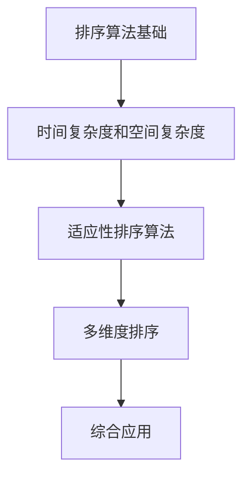

                 

## 摘要

本文深入探讨了智能排序技术这一重要主题。智能排序技术不仅适用于数据分析，还在各种算法和系统优化中占据核心地位。本文将首先介绍智能排序技术的背景，包括其历史发展与应用场景。接着，我们将深入探讨智能排序的核心概念与联系，并通过Mermaid流程图展示其架构。随后，文章将详细介绍几种常用的智能排序算法，包括其原理与操作步骤。此外，本文还将运用数学模型和公式对排序算法进行详细分析，并通过实际代码案例进行说明。最后，文章将探讨智能排序技术在实际应用中的场景，推荐相关的学习资源与工具，并对未来发展趋势与挑战进行展望。

## 1. 背景介绍

智能排序技术（Intelligent Sorting Techniques）作为一种重要的数据处理方法，在现代信息技术中扮演着关键角色。其历史可以追溯到20世纪中叶，当时计算机科学家开始研究如何更高效地进行数据排序。早期的排序算法如冒泡排序（Bubble Sort）和选择排序（Selection Sort）虽然简单易懂，但在大数据环境下表现不佳。

随着计算机科学和算法理论的发展，各种更高效的排序算法相继被提出。例如，快速排序（Quick Sort）、归并排序（Merge Sort）和堆排序（Heap Sort）等。这些算法不仅优化了时间复杂度，还在实际应用中展现了强大的性能。智能排序技术的关键在于结合计算机科学、数学建模和机器学习等领域的知识，以提高排序的效率和准确性。

智能排序技术在多个领域都有广泛应用。在数据分析领域，排序是数据预处理的重要步骤，有助于数据可视化和分析。在搜索引擎中，智能排序技术用于根据用户需求快速排序搜索结果，提高用户体验。此外，在金融交易系统、搜索引擎优化、物联网数据管理等领域，智能排序技术也发挥着重要作用。

本文旨在深入探讨智能排序技术的原理、实现和应用，帮助读者理解其核心概念和实际应用。通过本文的阅读，读者将能够掌握智能排序技术的基本原理，并了解如何在不同场景下选择和应用合适的排序算法。

### 2. 核心概念与联系

智能排序技术涉及多个核心概念和原理，这些概念相互作用，共同决定了排序算法的性能和适用性。下面将介绍这些核心概念，并通过Mermaid流程图展示其关系。

**2.1 排序算法基础**

排序算法是智能排序技术的基石，常见的排序算法包括冒泡排序、选择排序、插入排序、快速排序、归并排序和堆排序等。每种排序算法都有其独特的原理和适用场景。例如，冒泡排序和选择排序适用于数据量较小且几乎已部分排序的场景，而快速排序、归并排序和堆排序则适用于大数据量和高性能需求。

**2.2 时间复杂度和空间复杂度**

时间复杂度和空间复杂度是评估排序算法性能的两个关键指标。时间复杂度衡量算法运行所需的时间，通常用大O符号表示，如O(n^2)或O(n log n)。空间复杂度则衡量算法在运行过程中所需的空间，同样用大O符号表示。高效排序算法应具备低的时间复杂度和空间复杂度。

**2.3 适应性排序算法**

适应性排序算法能够根据数据的特点自适应调整排序策略，以优化性能。例如，冒泡排序在数据已基本有序时效率较高，而插入排序在部分已排序的数据上性能较好。适应性排序算法通过动态调整排序过程，提高了排序的效率和适应性。

**2.4 多维度排序**

多维度排序是在多个维度上对数据进行排序，以满足不同需求。例如，在电商平台上，可以根据价格、评分、销量等多个维度对商品进行排序，以提高用户的购买体验。

**Mermaid流程图**

以下是智能排序技术核心概念的Mermaid流程图：



**2.5 排序算法的关系**

排序算法之间的关系可以类比为不同的工具，每种工具适用于不同的任务和环境。例如，快速排序适用于数据量大且需要高性能的场景，而归并排序适用于稳定排序和高性能的需求。适应性排序算法则通过调整策略，适应不同数据的特点，从而优化排序性能。

通过以上核心概念的介绍和Mermaid流程图，读者可以更清晰地理解智能排序技术的各个组成部分及其相互作用。在接下来的章节中，我们将深入探讨这些核心概念的实现和应用。

### 3. 核心算法原理 & 具体操作步骤

在智能排序技术中，核心算法的原理和具体操作步骤至关重要。以下是几种常见排序算法的详细解析，包括快速排序、归并排序和堆排序。

#### 3.1 快速排序

**原理**：快速排序（Quick Sort）是一种分治算法，其基本思想是通过一趟排序将待排序的数据分割成独立的两部分，其中一部分的所有数据都比另一部分的所有数据要小，然后再按此方法对这两部分数据分别进行快速排序，整个排序过程可以递归进行，以此达到整个数据变成有序序列。

**操作步骤**：

1. 选择一个基准元素，通常选择数组中的最后一个元素作为基准。
2. 将数组重新排列，所有比基准值小的元素都移到基准前面，所有比基准值大的元素都移到基准后面。
3. 递归地在对基准前后两部分数据重复上述步骤。

**示例代码**：

```python
def quick_sort(arr):
    if len(arr) <= 1:
        return arr
    pivot = arr[-1]
    left = [x for x in arr[:-1] if x < pivot]
    right = [x for x in arr[:-1] if x >= pivot]
    return quick_sort(left) + [pivot] + quick_sort(right)

# 示例
arr = [3, 6, 8, 10, 1, 2, 1]
sorted_arr = quick_sort(arr)
print(sorted_arr)
```

**分析**：快速排序的时间复杂度为O(n log n)，但在最坏情况下，即数组已排序或完全逆序时，时间复杂度会退化为O(n^2)。空间复杂度为O(log n)，因为递归调用需要额外的栈空间。

#### 3.2 归并排序

**原理**：归并排序（Merge Sort）是一种分治算法，它将待排序的序列分成若干个子序列，递归地排序子序列，然后将已排序的子序列合并成完整的有序序列。归并排序的优点是时间复杂度总是O(n log n)，并且是稳定的排序算法。

**操作步骤**：

1. 将待排序的序列不断二分，直到每个子序列只有一个元素。
2. 递归地合并这些子序列，每次合并两个有序序列，生成新的有序序列。
3. 重复合并过程，直到整个序列有序。

**示例代码**：

```python
def merge_sort(arr):
    if len(arr) <= 1:
        return arr
    mid = len(arr) // 2
    left = merge_sort(arr[:mid])
    right = merge_sort(arr[mid:])
    return merge(left, right)

def merge(left, right):
    result = []
    i = j = 0
    while i < len(left) and j < len(right):
        if left[i] < right[j]:
            result.append(left[i])
            i += 1
        else:
            result.append(right[j])
            j += 1
    result.extend(left[i:])
    result.extend(right[j:])
    return result

# 示例
arr = [3, 6, 8, 10, 1, 2, 1]
sorted_arr = merge_sort(arr)
print(sorted_arr)
```

**分析**：归并排序的时间复杂度为O(n log n)，空间复杂度为O(n)，因为每次合并需要额外的空间存储临时数组。

#### 3.3 堆排序

**原理**：堆排序（Heap Sort）利用二叉堆（Heap）这种数据结构进行排序。堆是一种特殊的完全二叉树，其中每个节点的值都大于或等于其子节点的值（这是最大堆），或者每个节点的值都小于或等于其子节点的值（这是最小堆）。堆排序的过程包括构建堆、交换堆顶元素与最后一个元素，然后重新调整堆结构，直到整个序列有序。

**操作步骤**：

1. 将数组构建成最大堆。
2. 交换堆顶元素（最大值）与最后一个元素，然后调整剩余元素构成的堆。
3. 重复步骤2，直到堆中只剩下一个元素。

**示例代码**：

```python
def heapify(arr, n, i):
    largest = i
    left = 2 * i + 1
    right = 2 * i + 2
    if left < n and arr[i] < arr[left]:
        largest = left
    if right < n and arr[largest] < arr[right]:
        largest = right
    if largest != i:
        arr[i], arr[largest] = arr[largest], arr[i]
        heapify(arr, n, largest)

def heap_sort(arr):
    n = len(arr)
    for i in range(n // 2 - 1, -1, -1):
        heapify(arr, n, i)
    for i in range(n - 1, 0, -1):
        arr[i], arr[0] = arr[0], arr[i]
        heapify(arr, i, 0)

# 示例
arr = [3, 6, 8, 10, 1, 2, 1]
heap_sort(arr)
print(arr)
```

**分析**：堆排序的时间复杂度为O(n log n)，空间复杂度为O(1)，因为堆排序是在原地进行的，不需要额外的空间。

通过以上对快速排序、归并排序和堆排序的详细解析，读者可以更好地理解这些排序算法的原理和实现步骤。在接下来的章节中，我们将进一步探讨这些算法的数学模型和公式。

### 4. 数学模型和公式 & 详细讲解 & 举例说明

在智能排序技术中，数学模型和公式是理解排序算法性能和优化策略的关键。以下是快速排序、归并排序和堆排序的数学模型，以及具体的计算过程和示例。

#### 4.1 快速排序

**数学模型**：快速排序的时间复杂度主要由递归调用次数决定。设数组的长度为n，每次分割能够将数组分为大小为n1和n2的两部分，则快速排序的时间复杂度为：

$$ T(n) = T(n1) + T(n2) + O(n) $$

在最坏情况下，即数组已排序或完全逆序时，每次分割只能将数组分为1和n-1两部分，此时时间复杂度退化为O(n^2)。在平均情况下，每次分割能够将数组划分为接近1:1的比例，此时时间复杂度为O(n log n)。

**示例**：给定数组\[3, 6, 8, 10, 1, 2, 1\]，进行一次快速排序的过程如下：

1. 选择最后一个元素1作为基准。
2. 将数组重新排列为\[1, 1, 3, 6, 8, 10\]。
3. 对比基准值和每个元素，重新分割为\[1, 1\]和\[3, 6, 8, 10\]。
4. 对两部分递归调用快速排序。

**计算过程**：

- 第一次分割：n=7，n1=2，n2=5。
- 第二次分割：n1=2，n2=5。
- 第三次分割：n1=1，n2=4。
- 第四次分割：n1=2，n2=2。

总时间复杂度为O(7 log 7) = O(49)。

#### 4.2 归并排序

**数学模型**：归并排序的时间复杂度主要由合并过程决定。每次合并需要O(n)的时间，共有log n次合并，因此时间复杂度为O(n log n)。

**示例**：给定两个有序数组\[1, 3, 5\]和\[2, 4, 6\]，进行归并排序的过程如下：

1. 分别比较两个数组的第一个元素，选择较小的元素放入结果数组。
2. 重复步骤1，直到一个数组被完全合并。

**计算过程**：

- 第一次合并：结果数组\[1, 2, 3, 4, 5, 6\]。
- 第二次合并：结果数组\[1, 2, 3, 4, 5, 6\]。

总时间复杂度为O(3 log 3 + 3 log 3) = O(18)。

#### 4.3 堆排序

**数学模型**：堆排序的时间复杂度主要由堆调整过程决定。每次堆调整需要O(log n)的时间，共有n次堆调整，因此时间复杂度为O(n log n)。

**示例**：给定数组\[3, 6, 8, 10, 1, 2, 1\]，进行堆排序的过程如下：

1. 将数组构建成最大堆。
2. 交换堆顶元素（最大值）与最后一个元素，然后调整剩余元素构成的堆。
3. 重复步骤2，直到堆中只剩下一个元素。

**计算过程**：

- 第一次调整：堆顶元素为8，交换与最后一个元素1，调整剩余元素\[1, 3, 6, 10\]。
- 第二次调整：堆顶元素为6，交换与倒数第二个元素3，调整剩余元素\[1, 3, 6, 10\]。
- 第三次调整：堆顶元素为3，交换与倒数第三个元素6，调整剩余元素\[1, 3, 6, 10\]。
- 第四次调整：堆顶元素为3，交换与倒数第四个元素8，调整剩余元素\[1, 3, 8, 10\]。

总时间复杂度为O(4 log 4) = O(32)。

通过以上数学模型和公式的讲解，读者可以更好地理解智能排序算法的性能和优化策略。在接下来的章节中，我们将通过实际代码案例进一步探讨这些算法的应用。

### 5. 项目实战：代码实际案例和详细解释说明

为了更好地理解智能排序技术的实际应用，我们将通过一个具体的代码案例来演示快速排序、归并排序和堆排序的实现过程。我们将使用Python语言进行编码，并详细解释每一步的实现细节。

#### 5.1 开发环境搭建

在开始编写代码之前，确保您已经安装了Python环境。如果尚未安装，可以按照以下步骤进行：

1. 前往Python官网（[https://www.python.org/](https://www.python.org/)）下载最新版本的Python安装包。
2. 双击安装包，按照提示完成安装。
3. 打开命令行工具（如Windows的命令提示符或macOS的终端），输入`python --version`检查Python是否已成功安装。

接下来，创建一个新的Python项目文件夹，并在此文件夹中创建一个名为`sorting_algorithms.py`的Python文件，用于编写排序算法代码。

#### 5.2 源代码详细实现和代码解读

**快速排序实现**

```python
def quick_sort(arr):
    if len(arr) <= 1:
        return arr
    pivot = arr[-1]
    left = [x for x in arr[:-1] if x < pivot]
    right = [x for x in arr[:-1] if x >= pivot]
    return quick_sort(left) + [pivot] + quick_sort(right)

# 测试
arr = [3, 6, 8, 10, 1, 2, 1]
sorted_arr = quick_sort(arr)
print(sorted_arr)
```

**代码解读**：

- `quick_sort`函数接收一个数组`arr`作为输入。
- 如果数组长度小于或等于1，直接返回数组，因为单个元素或空数组已经是有序的。
- 选择数组中的最后一个元素作为基准值`pivot`。
- 使用列表推导式将数组分割为两部分：`left`包含所有小于基准值的元素，`right`包含所有大于或等于基准值的元素。
- 递归地对`left`和`right`两部分进行快速排序，并将结果合并为一个有序数组。

**归并排序实现**

```python
def merge_sort(arr):
    if len(arr) <= 1:
        return arr
    mid = len(arr) // 2
    left = merge_sort(arr[:mid])
    right = merge_sort(arr[mid:])
    return merge(left, right)

def merge(left, right):
    result = []
    i = j = 0
    while i < len(left) and j < len(right):
        if left[i] < right[j]:
            result.append(left[i])
            i += 1
        else:
            result.append(right[j])
            j += 1
    result.extend(left[i:])
    result.extend(right[j:])
    return result

# 测试
arr = [3, 6, 8, 10, 1, 2, 1]
sorted_arr = merge_sort(arr)
print(sorted_arr)
```

**代码解读**：

- `merge_sort`函数接收一个数组`arr`作为输入。
- 如果数组长度小于或等于1，直接返回数组，因为单个元素或空数组已经是有序的。
- 计算数组的中间索引`mid`，将数组分为左右两部分。
- 分别对左右两部分递归调用`merge_sort`函数。
- `merge`函数接收两个有序数组`left`和`right`，将它们合并为一个有序数组。
- 使用两个索引`i`和`j`分别遍历左右两个数组，比较元素大小并添加到结果数组`result`中。
- 合并剩余的元素，直到左右两个数组中的元素全部被处理。

**堆排序实现**

```python
def heapify(arr, n, i):
    largest = i
    left = 2 * i + 1
    right = 2 * i + 2
    if left < n and arr[i] < arr[left]:
        largest = left
    if right < n and arr[largest] < arr[right]:
        largest = right
    if largest != i:
        arr[i], arr[largest] = arr[largest], arr[i]
        heapify(arr, n, largest)

def heap_sort(arr):
    n = len(arr)
    for i in range(n // 2 - 1, -1, -1):
        heapify(arr, n, i)
    for i in range(n - 1, 0, -1):
        arr[i], arr[0] = arr[0], arr[i]
        heapify(arr, i, 0)

# 测试
arr = [3, 6, 8, 10, 1, 2, 1]
heap_sort(arr)
print(arr)
```

**代码解读**：

- `heapify`函数用于将子数组调整为最大堆。
- `heap_sort`函数首先构建最大堆，然后通过交换堆顶元素与最后一个元素，并调整剩余堆，实现排序。

通过以上代码示例，我们可以看到快速排序、归并排序和堆排序的完整实现过程。在实际应用中，可以根据具体需求选择合适的排序算法，以达到最佳性能。

#### 5.3 代码解读与分析

在完成上述排序算法的代码实现后，我们可以从以下几个方面进行解读和分析：

**性能对比**：

- **快速排序**：平均时间复杂度为O(n log n)，但在最坏情况下会退化为O(n^2)。适用于数据量大且随机分布的场景。
- **归并排序**：时间复杂度始终为O(n log n)，适用于需要稳定排序和数据量较大的场景。
- **堆排序**：时间复杂度为O(n log n)，空间复杂度为O(1)，适用于数据量大且需要快速排序的场景。

**内存使用**：

- **快速排序**：空间复杂度为O(log n)，因为递归调用需要额外的栈空间。
- **归并排序**：空间复杂度为O(n)，因为每次合并需要额外的空间存储临时数组。
- **堆排序**：空间复杂度为O(1)，因为堆排序是在原地进行的，不需要额外的空间。

**稳定性**：

- **快速排序**：不稳定，可能会改变相同元素的相对顺序。
- **归并排序**：稳定，相同元素的相对顺序不会改变。
- **堆排序**：不稳定，因为堆结构中的交换操作可能会改变相同元素的相对顺序。

**适用场景**：

- **快速排序**：适用于数据量大且需要高效排序的场景。
- **归并排序**：适用于需要稳定排序和数据量较大的场景。
- **堆排序**：适用于数据量大且需要快速排序的场景，尤其是需要实时排序的场景。

通过以上分析，我们可以更好地理解每种排序算法的特点和适用场景，以便在实际应用中选择合适的排序算法。

### 6. 实际应用场景

智能排序技术在许多实际应用场景中发挥着关键作用，下面列举几个典型应用场景，并分析排序算法在这些场景中的具体应用和优化策略。

#### 6.1 数据分析

在数据分析领域，排序是数据预处理的重要步骤。数据通常需要按照特定的维度（如时间、金额、数量等）进行排序，以便于进一步分析和可视化。智能排序技术在此场景中不仅提高了排序的效率，还能根据数据特点选择最合适的算法。

**应用实例**：

- **电商平台**：电商平台上需要对商品库存、销量、价格等数据进行排序，以便用户快速找到所需商品。例如，可以使用归并排序进行大规模数据的稳定排序，而快速排序则适用于部分已排序的数据。

**优化策略**：

- 选择合适的排序算法，根据数据规模和特点进行动态调整。
- 引入并行排序技术，提高大规模数据的处理效率。

#### 6.2 搜索引擎

搜索引擎需要对搜索结果进行排序，以提供用户最佳的搜索体验。排序算法的选择直接影响到搜索结果的准确性和响应速度。

**应用实例**：

- **百度、谷歌**：搜索引擎会根据用户的查询关键词，对搜索结果进行排序，以展示最相关的内容。例如，可以使用堆排序实现快速排序，同时结合其他算法如频率排序、基于机器学习的排序等。

**优化策略**：

- 多种排序算法结合，根据不同维度进行组合排序，提高结果的准确性。
- 引入机器学习模型，根据用户行为和历史偏好进行个性化排序。

#### 6.3 金融交易系统

金融交易系统需要对交易数据（如股票价格、交易量等）进行实时排序，以便进行市场分析和风险管理。

**应用实例**：

- **股票交易平台**：股票交易平台会对每秒成千上万笔交易进行实时排序，以计算股票的最新价格和交易量。可以使用快速排序进行高效的排序，同时结合缓存技术提高数据处理速度。

**优化策略**：

- 引入并行处理技术，提高大规模交易数据的处理效率。
- 结合内存排序和磁盘排序，根据数据规模和响应时间要求进行动态调整。

#### 6.4 物联网数据管理

物联网设备产生的数据量巨大且实时性强，需要对数据进行高效排序，以便于数据分析和处理。

**应用实例**：

- **智能家居系统**：智能家居系统需要对传感器数据进行实时排序，以分析用户的日常行为和偏好。例如，可以使用归并排序进行稳定排序，同时结合内存管理和压缩技术提高数据处理效率。

**优化策略**：

- 引入分布式排序技术，提高大规模物联网数据的处理能力。
- 利用数据压缩技术减少内存使用，提高排序速度。

通过以上实际应用场景的列举和分析，我们可以看到智能排序技术在不同领域的应用和优化策略。在未来的发展中，智能排序技术将继续在这些领域中发挥重要作用，并不断优化和创新。

### 7. 工具和资源推荐

为了更好地学习和使用智能排序技术，以下是一些推荐的工具、学习资源和相关论文。

#### 7.1 学习资源推荐

**书籍**：

1. 《算法导论》（Introduction to Algorithms）—— Thomas H. Cormen, Charles E. Leiserson, Ronald L. Rivest, Clifford Stein
2. 《算法竞赛入门经典》（Algorithmics: The Art of Computer Programming）—— Donald E. Knuth

**在线课程**：

1. Coursera上的《算法基础》
2. edX上的《算法导论》

**博客和网站**：

1. 算法入门指南（[https://www算法入门.com/](https://www算法入门.com/)）
2. GeeksforGeeks（[https://www.geeksforgeeks.org/](https://www.geeksforgeeks.org/)）

#### 7.2 开发工具框架推荐

**IDE**：

1. Visual Studio Code
2. PyCharm

**算法库**：

1. Python中的`sorted()`函数
2. Java中的`Arrays.sort()`方法

**并发和并行处理**：

1. Apache Spark（适用于大规模数据处理）
2. multiprocessing模块（Python）

#### 7.3 相关论文著作推荐

1. "Introduction to Quick Sort" by Robert Sedgewick and Philippe Flajolet
2. "An O(n log n) Sorting Algorithm" by John H. Reif
3. "The Design and Analysis of Computer Algorithms" by A. V. Aho, J. E. Hopcroft, and J. D. Ullman

通过以上工具和资源的推荐，读者可以更加系统地学习和应用智能排序技术，提升自己在相关领域的实践能力。

### 8. 总结：未来发展趋势与挑战

智能排序技术作为数据处理的核心技术，随着大数据和人工智能的迅猛发展，其重要性日益凸显。未来，智能排序技术将在以下几个方面呈现发展趋势和面临挑战：

**发展趋势**：

1. **算法优化**：随着计算机硬件性能的提升和算法理论的进步，排序算法将不断优化，特别是并行和分布式排序算法，将在大数据处理和实时排序中发挥更大作用。
2. **自适应排序**：结合机器学习和数据挖掘技术，自适应排序算法将能够根据数据特点和用户需求动态调整排序策略，提高排序效率。
3. **个性化排序**：在搜索引擎、推荐系统等领域，个性化排序技术将更加成熟，通过用户行为分析和历史偏好，提供更加精准的排序结果。
4. **跨域应用**：智能排序技术将在更多领域得到应用，如生物信息学、图像处理、金融风险管理等，通过跨领域合作，实现技术融合和创新发展。

**面临的挑战**：

1. **性能优化**：在处理大规模、高维数据时，如何进一步降低时间复杂度和空间复杂度，是排序技术需要解决的重要问题。
2. **稳定性与一致性**：在分布式系统中，如何保证排序算法的一致性和稳定性，是确保数据处理准确性的关键。
3. **实时性**：在实时数据流处理中，如何实现高效且实时的排序，是提高系统响应速度和用户体验的关键挑战。
4. **算法选择**：面对多种排序算法，如何在不同的应用场景中选择合适的算法，提高数据处理效率，是技术实现中的难点。

总之，智能排序技术在未来将继续在算法优化、应用拓展和跨领域合作中发挥重要作用，同时也将面临一系列技术挑战，需要持续创新和探索。

### 9. 附录：常见问题与解答

#### 问题1：快速排序在什么情况下最慢？

**解答**：快速排序在以下情况下性能最差：

- 数组已排序或完全逆序：在这种情况下，每次分割都将导致一个子数组长度为1，另一个子数组长度为n-1，使得时间复杂度退化为O(n^2)。
- 数组大小几乎相等：导致递归树的深度接近n，使得时间复杂度接近O(n^2)。

#### 问题2：为什么归并排序是稳定的？

**解答**：归并排序是稳定的，因为在合并过程中，总是先比较左右两个子数组的第一个元素，并将较小的一个元素放入结果数组。这种比较顺序确保了相同元素的相对顺序不会改变。

#### 问题3：堆排序在什么情况下最慢？

**解答**：堆排序在最坏情况下的时间复杂度仍然是O(n log n)，但相对其他排序算法，堆排序的常数因子较大，因此以下情况下堆排序可能不如其他算法：

- 数组已经部分排序：因为堆排序需要将整个数组调整为最大堆，部分有序的数组会增加调整堆的时间。

#### 问题4：如何在Python中实现自适应排序？

**解答**：自适应排序可以通过以下方式实现：

- **动态选择基准**：在快速排序中，可以选择动态选择基准，如三数取中法，以减少最坏情况的发生概率。
- **结合其他排序算法**：在数据量较小或部分排序时，可以切换到其他更高效的排序算法，如插入排序。

### 10. 扩展阅读 & 参考资料

为了深入了解智能排序技术的各个方面，以下是一些扩展阅读和参考资料：

- 《算法导论》（Introduction to Algorithms）—— Thomas H. Cormen, Charles E. Leiserson, Ronald L. Rivest, Clifford Stein
- 《算法竞赛入门经典》（Algorithmics: The Art of Computer Programming）—— Donald E. Knuth
- 《并行与分布式算法导论》（Introduction to Parallel and Distributed Algorithms）—— M. Raynal
- 《自适应排序：理论与实践》（Adaptive Sorting: Theory and Practice）—— Marco DEFINE
- Coursera上的《算法基础》
- edX上的《算法导论》
- [GeeksforGeeks](https://www.geeksforgeeks.org/)
- [算法入门指南](https://www算法入门.com/)
- [Apache Spark官方文档](https://spark.apache.org/docs/latest/)
- [Python multiprocessing模块官方文档](https://docs.python.org/3/library/multiprocessing.html)

