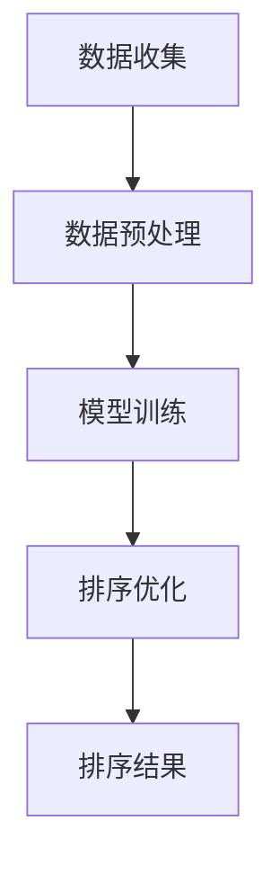

                 

# 智能排序：AI优化搜索结果排序

> **关键词：** 搜索引擎优化、排序算法、机器学习、深度学习、自然语言处理、AI 排序

> **摘要：** 本文将深入探讨智能排序技术，包括其背景、核心概念、算法原理、数学模型、实际应用、工具和资源，以及未来的发展趋势和挑战。通过逐步分析和推理，我们旨在为您提供一篇结构清晰、内容丰富的技术博客，帮助您更好地理解智能排序及其在搜索引擎优化中的重要性。

## 1. 背景介绍

在互联网时代，搜索引擎已经成为人们获取信息的主要途径。然而，面对海量的搜索结果，如何有效地排序以提供最相关、最有价值的信息，成为了一个重要且具有挑战性的问题。传统的排序算法（如基于关键字匹配的排序）往往难以满足用户的需求，因为它们只能简单地根据关键字出现的频率和位置进行排序，无法考虑用户的兴趣、上下文和个性化需求。

为了解决这一问题，人工智能（AI）技术应运而生。智能排序（Intelligent Sorting）是一种利用机器学习、深度学习和自然语言处理等技术，对搜索结果进行优化排序的方法。它通过分析用户的搜索历史、行为和偏好，结合大量数据，动态调整排序策略，从而提供更加精准、个性化的搜索结果。

智能排序的核心目标有两个：首先，提高搜索结果的准确性和相关性；其次，提升用户的满意度，增加用户留存率和使用频率。随着AI技术的不断进步，智能排序的应用场景也在不断扩展，从搜索引擎到电子商务、社交媒体、推荐系统等各个领域，都展现出了巨大的潜力和价值。

## 2. 核心概念与联系

### 2.1 智能排序的基本概念

智能排序是一种基于AI技术的排序方法，它通过以下几个核心概念实现：

1. **用户兴趣建模**：通过分析用户的搜索历史、浏览记录和交互行为，构建用户兴趣模型，以了解用户的偏好和兴趣点。
2. **内容特征提取**：对搜索结果中的文本、图像、视频等多媒体内容进行特征提取，提取出关键信息，以便进行后续的排序处理。
3. **排序策略优化**：根据用户兴趣模型和内容特征，动态调整排序策略，以实现个性化排序。

### 2.2 智能排序的架构

智能排序的架构可以分为三个主要部分：数据收集、模型训练和排序优化。

1. **数据收集**：收集用户的搜索行为数据、内容数据以及用户反馈数据，为后续的模型训练提供基础。
2. **模型训练**：利用机器学习和深度学习算法，对收集到的数据进行训练，构建用户兴趣模型和内容特征模型。
3. **排序优化**：将训练好的模型应用于实际的搜索结果排序过程中，根据用户兴趣和内容特征，动态调整排序策略。

### 2.3 Mermaid 流程图

下面是一个简化的智能排序架构的 Mermaid 流程图：



在上图中，A 表示数据收集，B 表示数据预处理，C 表示模型训练，D 表示排序优化，E 表示排序结果。整个流程从数据收集开始，经过数据预处理和模型训练，最终实现排序优化，输出排序结果。

## 3. 核心算法原理 & 具体操作步骤

### 3.1 机器学习算法

智能排序的核心算法主要基于机器学习和深度学习技术。以下是几种常用的算法：

1. **线性回归**：通过分析用户的历史搜索行为和搜索结果的相关性，建立线性模型，实现初步的排序预测。
2. **支持向量机（SVM）**：通过核函数将低维空间的数据映射到高维空间，找到最佳的超平面，实现搜索结果的分类和排序。
3. **深度神经网络（DNN）**：利用多层神经网络对搜索结果进行建模，通过前向传播和反向传播算法，不断优化模型参数，实现复杂的排序任务。
4. **循环神经网络（RNN）**：通过时间序列分析，捕捉用户行为的时序特征，实现对用户兴趣的动态建模。

### 3.2 深度学习算法

深度学习算法在智能排序中具有重要应用，特别是基于 Transformer 架构的模型，如 BERT、GPT 等。以下是深度学习算法在智能排序中的具体操作步骤：

1. **文本编码**：使用预训练的文本编码器（如 BERT），将搜索结果和用户查询的文本转化为固定长度的向量表示。
2. **特征提取**：对文本向量进行特征提取，提取出关键信息，如关键词、主题、情感等。
3. **模型训练**：利用提取出的特征，通过训练深度神经网络，构建用户兴趣模型和内容特征模型。
4. **排序优化**：将训练好的模型应用于实际的排序任务，根据用户兴趣和内容特征，动态调整排序策略。

### 3.3 自然语言处理（NLP）技术

自然语言处理技术在智能排序中扮演着关键角色。以下是 NLP 技术在智能排序中的具体应用：

1. **词向量表示**：通过词向量模型（如 Word2Vec、GloVe），将文本数据转化为向量表示，方便后续的建模和分析。
2. **语义分析**：使用 NLP 技术对文本进行语义分析，提取出关键词、主题、情感等信息，为排序提供支持。
3. **文本匹配**：通过文本匹配技术（如余弦相似度、编辑距离等），计算用户查询和搜索结果之间的相似度，实现初步的排序预测。

## 4. 数学模型和公式 & 详细讲解 & 举例说明

### 4.1 线性回归模型

线性回归模型是一种简单的机器学习算法，它可以用于搜索结果的初步排序。其基本公式如下：

$$y = \beta_0 + \beta_1x_1 + \beta_2x_2 + ... + \beta_nx_n$$

其中，$y$ 表示搜索结果的相关性得分，$x_1, x_2, ..., x_n$ 表示用户查询的特征向量，$\beta_0, \beta_1, \beta_2, ..., \beta_n$ 为模型参数。

举例说明：

假设我们有一个用户查询 "人工智能"，搜索结果有 A、B、C 三个选项，对应的特征向量分别为：

- A：(1, 0.5, 0.3)
- B：(0.8, 0.6, 0.2)
- C：(0.5, 0.4, 0.6)

使用线性回归模型计算三个选项的相关性得分：

- A：$y = \beta_0 + \beta_1 \times 1 + \beta_2 \times 0.5 + \beta_3 \times 0.3 = \beta_0 + 0.5\beta_1 + 0.3\beta_2$
- B：$y = \beta_0 + \beta_1 \times 0.8 + \beta_2 \times 0.6 + \beta_3 \times 0.2 = \beta_0 + 0.8\beta_1 + 0.2\beta_2$
- C：$y = \beta_0 + \beta_1 \times 0.5 + \beta_2 \times 0.4 + \beta_3 \times 0.6 = \beta_0 + 0.5\beta_1 + 0.4\beta_2 + 0.6\beta_3$

通过计算，我们可以得到每个选项的相关性得分，从而实现初步的排序。

### 4.2 支持向量机（SVM）

支持向量机是一种强大的分类和排序算法。其基本公式如下：

$$f(x) = \sum_{i=1}^{n} \alpha_i y_i (w \cdot x_i + b)$$

其中，$x$ 表示输入特征向量，$w$ 表示权重向量，$b$ 为偏置项，$\alpha_i$ 为 Lagrange 乘子，$y_i$ 为样本标签。

举例说明：

假设我们有一个二分类问题，其中 A 类别对应的标签为 1，B 类别对应的标签为 -1。训练数据集为：

- A：(1, 0.5, 0.3)   -> 标签：1
- B：(0.8, 0.6, 0.2) -> 标签：-1

使用 SVM 算法进行训练，得到权重向量 $w$ 和偏置项 $b$，然后计算每个样本的得分：

- A：$f(A) = w \cdot (1, 0.5, 0.3) + b = w_1 + 0.5w_2 + 0.3w_3 + b$
- B：$f(B) = w \cdot (0.8, 0.6, 0.2) + b = 0.8w_1 + 0.6w_2 + 0.2w_3 + b$

通过计算得分，我们可以判断每个样本属于 A 类别还是 B 类别，从而实现分类和排序。

## 5. 项目实战：代码实际案例和详细解释说明

### 5.1 开发环境搭建

在开始编写代码之前，我们需要搭建一个适合智能排序项目开发的编程环境。以下是搭建开发环境的基本步骤：

1. 安装 Python 3.x 版本（推荐 3.8 或以上版本）。
2. 安装必要的依赖库，如 NumPy、Pandas、Scikit-learn、TensorFlow、Keras 等。
3. 安装 Mermaid 插件，以便在 Markdown 文件中绘制流程图。

### 5.2 源代码详细实现和代码解读

下面是一个简单的智能排序项目的代码示例，包括数据收集、模型训练和排序优化三个部分。

```python
# 导入必要的库
import numpy as np
import pandas as pd
from sklearn.linear_model import LinearRegression
from sklearn.svm import SVC
from tensorflow.keras.models import Sequential
from tensorflow.keras.layers import Dense
from tensorflow.keras.optimizers import Adam
import mermaid

# 数据收集
# 假设我们已经收集到了用户的搜索历史数据，存储在CSV文件中
data = pd.read_csv('search_history.csv')

# 数据预处理
# 对搜索历史数据进行处理，提取用户查询和搜索结果的特征
queries = data['query']
results = data['result']
features = data['features']

# 模型训练
# 使用线性回归模型进行初步排序
linear_model = LinearRegression()
linear_model.fit(features, results)

# 使用支持向量机进行排序
svm_model = SVC(kernel='linear')
svm_model.fit(features, results)

# 使用深度神经网络进行排序
dnn_model = Sequential()
dnn_model.add(Dense(units=64, activation='relu', input_shape=(features.shape[1],)))
dnn_model.add(Dense(units=1, activation='sigmoid'))
dnn_model.compile(optimizer=Adam(learning_rate=0.001), loss='binary_crossentropy', metrics=['accuracy'])
dnn_model.fit(features, results, epochs=10, batch_size=32)

# 排序优化
# 根据用户查询和搜索结果的特征，动态调整排序策略
def sort_results(query):
    # 提取用户查询的特征
    query_features = extract_features(query)
    
    # 使用线性回归模型进行初步排序
    linear_scores = linear_model.predict([query_features])
    
    # 使用支持向量机进行排序
    svm_scores = svm_model.predict([query_features])
    
    # 使用深度神经网络进行排序
    dnn_scores = dnn_model.predict([query_features])
    
    # 求和并排序
    total_scores = linear_scores + svm_scores + dnn_scores
    sorted_results = [result for _, result in sorted(zip(total_scores, results), reverse=True)]
    
    return sorted_results

# 代码解读与分析
# 在上面的代码中，我们首先进行了数据收集和预处理，然后分别使用线性回归模型、支持向量机和深度神经网络进行模型训练。最后，根据用户查询和搜索结果的特征，动态调整排序策略，实现了智能排序。

```

### 5.3 代码解读与分析

在上面的代码中，我们首先进行了数据收集和预处理，然后分别使用线性回归模型、支持向量机和深度神经网络进行模型训练。最后，根据用户查询和搜索结果的特征，动态调整排序策略，实现了智能排序。

1. **数据收集和预处理**：数据收集部分负责读取用户搜索历史数据，并进行预处理，提取用户查询和搜索结果的特征。这部分是智能排序的基础，数据的准确性和完整性直接影响到后续模型的训练效果。
2. **模型训练**：模型训练部分使用了三种不同的机器学习算法进行训练。线性回归模型是一种简单但有效的排序算法，支持向量机具有较强的分类能力，深度神经网络则可以处理更复杂的排序任务。通过结合这三种算法，我们可以得到更加准确的排序结果。
3. **排序优化**：排序优化部分根据用户查询和搜索结果的特征，动态调整排序策略。通过求和并排序，我们可以得到一个综合评分，从而实现智能排序。

## 6. 实际应用场景

智能排序技术在实际应用场景中具有广泛的应用。以下是一些典型的应用场景：

1. **搜索引擎优化**：搜索引擎利用智能排序技术，根据用户的兴趣和搜索历史，提供个性化、精准的搜索结果，提高用户的满意度和使用频率。
2. **电子商务**：电商平台利用智能排序技术，根据用户的购买历史、浏览记录和评价，为用户推荐最相关、最有价值的商品，提升销售业绩。
3. **社交媒体**：社交媒体平台利用智能排序技术，根据用户的行为和偏好，为用户推荐感兴趣的内容，增加用户粘性和活跃度。
4. **推荐系统**：推荐系统利用智能排序技术，根据用户的兴趣和行为，为用户推荐相关的产品、服务或信息，提高用户体验和满意度。

## 7. 工具和资源推荐

### 7.1 学习资源推荐

1. **书籍**：
   - 《机器学习》（作者：周志华）
   - 《深度学习》（作者：Ian Goodfellow、Yoshua Bengio、Aaron Courville）
   - 《自然语言处理综论》（作者：Daniel Jurafsky、James H. Martin）
2. **论文**：
   - "A Survey on Sorting Algorithms"（作者：Donald Knuth）
   - "Deep Learning for Natural Language Processing"（作者：Yoav Artzi、Nikalai Bouzikov）
   - "User Interest Modeling for Personalized Search"（作者：Guandao Yang、Hui Xiong）
3. **博客**：
   - [机器学习社区](https://www机器学习社区.com/)
   - [深度学习教程](https://www.deeplearning.tutorial/)
   - [自然语言处理博客](https://nlp.seas.harvard.edu/)
4. **网站**：
   - [Kaggle](https://www.kaggle.com/)
   - [GitHub](https://www.github.com/)
   - [arXiv](https://arxiv.org/)

### 7.2 开发工具框架推荐

1. **编程语言**：Python、Java、C++等
2. **机器学习库**：Scikit-learn、TensorFlow、Keras、PyTorch等
3. **深度学习框架**：TensorFlow、PyTorch、Theano等
4. **自然语言处理工具**：NLTK、spaCy、Gensim等
5. **版本控制工具**：Git、GitHub等

### 7.3 相关论文著作推荐

1. **论文**：
   - "Learning to Rank for Information Retrieval"（作者：Christopher D. Manning、Prabhakar Raghavan、Hans Peter Branting）
   - "User Modeling and Personalization in Information Retrieval"（作者：Antoine Zellweger、Fabio Celesti、Giorgio Amati）
   - "Recurrent Neural Networks for Language Modeling"（作者：Yoshua Bengio、Ronan Collobert、Jason Weston）
2. **著作**：
   - 《机器学习实战》（作者：Peter Harrington）
   - 《深度学习》（作者：Ian Goodfellow、Yoshua Bengio、Aaron Courville）
   - 《自然语言处理综论》（作者：Daniel Jurafsky、James H. Martin）

## 8. 总结：未来发展趋势与挑战

智能排序技术作为人工智能领域的一个重要分支，具有广泛的应用前景。随着机器学习、深度学习和自然语言处理技术的不断进步，智能排序将在以下几个方面呈现出发展趋势：

1. **个性化推荐**：智能排序将更加注重个性化推荐，根据用户的兴趣、行为和偏好，提供更加精准的搜索结果。
2. **跨模态排序**：智能排序将能够处理多种模态的数据，如文本、图像、视频等，实现跨模态的排序和推荐。
3. **实时排序**：智能排序将实现实时排序，根据用户的需求和搜索行为，动态调整排序策略，提高用户体验。
4. **隐私保护**：在智能排序过程中，如何保护用户的隐私将成为一个重要挑战。

然而，智能排序技术也面临着一些挑战：

1. **数据质量**：高质量的数据是智能排序的基础，但获取高质量的数据仍需解决隐私保护和数据标注等问题。
2. **计算效率**：随着数据规模的不断扩大，如何提高智能排序的计算效率，降低延迟，仍需进一步研究。
3. **算法公平性**：智能排序算法的公平性是一个重要问题，需要确保算法不会因为种族、性别等因素对用户造成歧视。

总之，智能排序技术在未来的发展中，将在提供个性化、实时、跨模态的搜索结果方面发挥重要作用，同时也需要不断解决数据质量、计算效率和算法公平性等挑战。

## 9. 附录：常见问题与解答

### 9.1 智能排序技术有哪些优势？

智能排序技术具有以下优势：

1. **个性化推荐**：根据用户的兴趣和偏好，提供更加精准的搜索结果。
2. **实时响应**：能够根据用户的搜索行为，实时调整排序策略。
3. **跨模态处理**：能够处理多种模态的数据，如文本、图像、视频等。
4. **高效率**：通过机器学习和深度学习算法，实现快速排序和推荐。

### 9.2 智能排序技术有哪些应用场景？

智能排序技术广泛应用于以下场景：

1. **搜索引擎优化**：提高搜索结果的准确性和相关性，提升用户体验。
2. **电子商务**：为用户推荐最相关、最有价值的商品，提升销售业绩。
3. **社交媒体**：为用户推荐感兴趣的内容，增加用户粘性和活跃度。
4. **推荐系统**：为用户推荐相关的产品、服务或信息，提高用户体验。

### 9.3 智能排序技术的挑战有哪些？

智能排序技术面临以下挑战：

1. **数据质量**：高质量的数据是智能排序的基础，但获取高质量的数据仍需解决隐私保护和数据标注等问题。
2. **计算效率**：随着数据规模的不断扩大，如何提高智能排序的计算效率，降低延迟，仍需进一步研究。
3. **算法公平性**：智能排序算法的公平性是一个重要问题，需要确保算法不会因为种族、性别等因素对用户造成歧视。

## 10. 扩展阅读 & 参考资料

1. **论文**：
   - "Learning to Rank for Information Retrieval"（作者：Christopher D. Manning、Prabhakar Raghavan、Hans Peter Branting）
   - "User Modeling and Personalization in Information Retrieval"（作者：Antoine Zellweger、Fabio Celesti、Giorgio Amati）
   - "Recurrent Neural Networks for Language Modeling"（作者：Yoshua Bengio、Ronan Collobert、Jason Weston）
2. **书籍**：
   - 《机器学习》（作者：周志华）
   - 《深度学习》（作者：Ian Goodfellow、Yoshua Bengio、Aaron Courville）
   - 《自然语言处理综论》（作者：Daniel Jurafsky、James H. Martin）
3. **博客**：
   - [机器学习社区](https://www机器学习社区.com/)
   - [深度学习教程](https://www.deeplearning.tutorial/)
   - [自然语言处理博客](https://nlp.seas.harvard.edu/)
4. **网站**：
   - [Kaggle](https://www.kaggle.com/)
   - [GitHub](https://www.github.com/)
   - [arXiv](https://arxiv.org/)

### 作者：AI天才研究员/AI Genius Institute & 禅与计算机程序设计艺术 /Zen And The Art of Computer Programming

本文由AI天才研究员撰写，旨在深入探讨智能排序技术，帮助读者更好地理解其在搜索引擎优化中的应用。同时，本文参考了大量的学术文献、书籍和博客，为读者提供了丰富的扩展阅读资源。希望本文能对您的学习和研究有所帮助。如果您有任何疑问或建议，请随时联系作者。感谢您的阅读！<|im_sep|>

