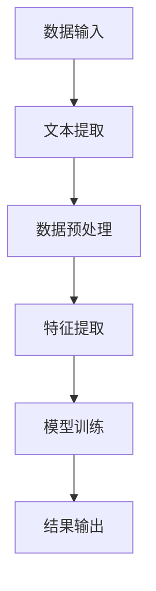

                 

### 背景介绍

#### 什么是智能文档处理？

智能文档处理（Intelligent Document Processing, IDP）是指利用人工智能技术，特别是自然语言处理（Natural Language Processing, NLP）和机器学习，自动识别、提取、分析和处理文档内容的过程。传统的文档处理方式往往依赖于人工输入和手动操作，而智能文档处理则致力于通过自动化技术提升效率，减少人为错误。

#### 智能文档处理的现状

随着大数据、云计算和人工智能技术的迅速发展，智能文档处理已经成为企业办公自动化的重要工具。根据市场调研机构IDC的报告，到2025年，超过50%的企业将会采用智能文档处理技术，以实现业务流程的自动化和数字化转型。当前，智能文档处理已经广泛应用于金融、医疗、零售、物流等行业，其应用场景包括合同审核、发票处理、客户关系管理、人力资源管理等。

#### AI大模型在智能文档处理中的作用

AI大模型（Large-scale AI Models）是指参数量庞大、能够处理复杂数据的深度学习模型。近年来，随着计算能力的提升和海量数据资源的积累，AI大模型在语音识别、图像识别、自然语言处理等领域取得了显著的进展。在智能文档处理中，AI大模型通过学习大量文档数据，能够识别文本中的关键信息，自动分类、提取和标注文档内容，从而实现高效的文档处理。

#### 办公自动化的需求与挑战

办公自动化（Office Automation）是指利用计算机、网络通信和人工智能技术，实现办公业务流程的自动化、智能化和高效化。随着企业规模的扩大和业务复杂度的增加，办公自动化的需求日益迫切。然而，实现办公自动化面临着诸多挑战：

1. **数据多样性**：企业中涉及的数据类型繁多，包括文本、图像、表格、音频等，处理这些数据需要不同类型的AI模型。
2. **数据质量**：文档中的数据质量参差不齐，存在错别字、格式不规范等问题，这对智能文档处理模型的鲁棒性提出了高要求。
3. **个性化需求**：不同企业对文档处理的需求各异，如何构建通用性强、适应性高的智能文档处理系统是一个重要课题。
4. **隐私保护**：智能文档处理过程中涉及大量敏感数据，如何确保数据安全和用户隐私是关键问题。

在接下来的章节中，我们将深入探讨智能文档处理的核心概念、算法原理、数学模型以及实际应用，以帮助读者更好地理解这一技术并应用于实际场景。

#### 关键词：智能文档处理、AI大模型、办公自动化、自然语言处理、机器学习、数据处理、文本识别、业务流程自动化、数字化转型、数据多样性、数据质量、个性化需求、隐私保护。

---

## 2. 核心概念与联系

在深入探讨智能文档处理之前，我们需要了解其中的核心概念，这些概念包括自然语言处理（NLP）、机器学习（ML）、深度学习（DL）等，它们共同构成了智能文档处理的技术基础。

### 自然语言处理（NLP）

自然语言处理是人工智能的一个重要分支，它旨在使计算机能够理解和处理人类语言。NLP的核心任务包括文本分类、情感分析、实体识别、语义理解等。在智能文档处理中，NLP技术被用来识别和理解文档中的文本内容。

#### 机器学习（ML）

机器学习是一种通过算法从数据中学习模式，进行预测和决策的技术。在智能文档处理中，机器学习模型通过分析大量标记过的文档数据，学习如何自动识别和提取文档中的关键信息。

#### 深度学习（DL）

深度学习是机器学习的一个子领域，它通过模拟人脑的神经网络结构，进行复杂的模式识别和学习。深度学习模型在图像识别、语音识别和自然语言处理等领域表现出色，因此在智能文档处理中也得到了广泛应用。

### 智能文档处理架构

智能文档处理的架构通常包括以下几个关键组件：

1. **数据输入**：这一组件负责接收和处理各种类型的文档数据，如PDF、Word、Excel等。
2. **文本提取**：利用NLP技术，从文档中提取文本内容。
3. **数据预处理**：对提取的文本进行清洗、格式化和标准化，以提高数据质量。
4. **特征提取**：将预处理后的文本转化为计算机可以理解的向量表示。
5. **模型训练**：使用机器学习或深度学习模型对特征向量进行训练，以识别和分类文档内容。
6. **结果输出**：将模型处理结果以易于理解的形式输出，如分类标签、关键词提取等。

#### Mermaid 流程图

以下是一个使用Mermaid绘制的智能文档处理流程图：



在这个流程图中，数据输入是智能文档处理的第一步，随后通过文本提取、数据预处理、特征提取和模型训练，最终输出处理结果。每个步骤都依赖于前一个步骤的正确性，因此任何一个环节的出错都可能影响整个流程的效率和质量。

### 核心概念的联系

自然语言处理、机器学习和深度学习共同构成了智能文档处理的技术基础。NLP为文本处理提供了工具，ML和DL则使得计算机能够从海量数据中学习和预测。智能文档处理架构中的各个组件通过这些技术相互协作，实现了高效、准确的文档处理。

通过理解这些核心概念和它们之间的联系，我们可以更好地掌握智能文档处理的工作原理，为后续章节中的深入讨论打下坚实的基础。

---

#### 关键词：自然语言处理、机器学习、深度学习、智能文档处理、文本提取、数据预处理、特征提取、模型训练、数据输入、结果输出、Mermaid 流程图、文本分类、情感分析、实体识别、语义理解。

---

## 3. 核心算法原理 & 具体操作步骤

智能文档处理的核心算法通常包括文本提取、数据预处理、特征提取和模型训练等步骤。下面，我们将逐一介绍这些算法的基本原理和具体操作步骤。

### 3.1 文本提取

文本提取是智能文档处理的第一步，其主要任务是从各种格式的文档中提取出有用的文本信息。常见的文档格式包括PDF、Word、Excel等。

**操作步骤：**

1. **文档解析**：首先，需要解析文档格式，将其转换为可处理的文本数据。对于PDF文件，可以使用PDF.js等库进行解析；对于Word文件，可以使用Microsoft Word的COM接口进行解析。
2. **文本提取**：解析后的文档包含多个文本块，需要从中提取出有用的文本内容。这一过程通常依赖于NLP技术，例如分句、分词和文本分类等。
3. **文本清洗**：提取出的文本可能包含一些无关的噪声，如标点符号、空格等。这些噪声需要通过文本清洗技术进行去除，以提高数据质量。

**示例代码（Python）：**

```python
import PyPDF2
import re

# 解析PDF文件
pdf_file = PyPDF2.PdfFileReader(open("document.pdf", "rb"))
text = ""

# 提取文本内容
for page in pdf_file.pages:
    text += page.extractText()

# 清洗文本
cleaned_text = re.sub(r'\s+', ' ', text).strip()

print(cleaned_text)
```

### 3.2 数据预处理

数据预处理是智能文档处理中至关重要的一步，其目的是提高数据质量，使其更适合后续的模型训练和特征提取。数据预处理包括文本清洗、标准化和格式化等步骤。

**操作步骤：**

1. **文本清洗**：去除文本中的噪声，如标点符号、空格、HTML标签等。
2. **文本标准化**：将文本中的大小写统一转换为小写，去除停用词（如"的"、"和"、"是"等），对文本进行词干提取（如"playing"提取为"play"）。
3. **文本格式化**：将文本格式化成统一的编码格式，如UTF-8。

**示例代码（Python）：**

```python
import nltk
from nltk.corpus import stopwords
from nltk.stem import PorterStemmer

# 加载停用词
stop_words = set(stopwords.words('english'))

# 清洗文本
def clean_text(text):
    text = text.lower()
    text = re.sub(r'\s+', ' ', text)
    text = re.sub(r'<[^>]*>', '', text)
    text = text.translate(str.maketrans('', '', string.punctuation))
    return text

# 标准化文本
def normalize_text(text):
    text = clean_text(text)
    text = ' '.join([word for word in text.split() if word not in stop_words])
    stemmer = PorterStemmer()
    text = ' '.join([stemmer.stem(word) for word in text.split()])
    return text

text = "This is a sample document for text extraction and preprocessing."
cleaned_text = clean_text(text)
normalized_text = normalize_text(cleaned_text)

print(normalized_text)
```

### 3.3 特征提取

特征提取是将预处理后的文本转化为计算机可以理解的向量表示的过程。常见的特征提取方法包括词袋模型、TF-IDF和Word2Vec等。

**操作步骤：**

1. **词袋模型（Bag of Words, BOW）**：将文本表示为词汇的集合，每个词汇的出现频率作为特征向量。
2. **TF-IDF（Term Frequency-Inverse Document Frequency）**：考虑词汇在文档中的频率和整个文档集合中的分布，对特征向量进行加权。
3. **Word2Vec**：将每个词汇映射为一个固定大小的向量，通过训练大量文本数据，学习词汇之间的语义关系。

**示例代码（Python）：**

```python
from sklearn.feature_extraction.text import TfidfVectorizer

# 初始化TF-IDF向量器
vectorizer = TfidfVectorizer()

# 训练向量器并转换文本为特征向量
X = vectorizer.fit_transform([cleaned_text, normalized_text])

# 打印特征向量
print(X.toarray())
```

### 3.4 模型训练

模型训练是智能文档处理的核心步骤，其目的是利用训练数据，训练出能够识别和分类文档内容的模型。常见的机器学习模型包括支持向量机（SVM）、决策树（Decision Tree）、随机森林（Random Forest）等。

**操作步骤：**

1. **数据集划分**：将训练数据集划分为训练集和验证集，用于训练和评估模型。
2. **模型选择**：选择合适的机器学习模型，如SVM、决策树等。
3. **模型训练**：使用训练集对模型进行训练，调整模型参数。
4. **模型评估**：使用验证集对模型进行评估，调整模型参数，直到达到满意的性能指标。

**示例代码（Python）：**

```python
from sklearn.model_selection import train_test_split
from sklearn.svm import SVC

# 划分训练集和验证集
X_train, X_test, y_train, y_test = train_test_split(X, labels, test_size=0.2, random_state=42)

# 初始化SVM模型
model = SVC()

# 训练模型
model.fit(X_train, y_train)

# 评估模型
accuracy = model.score(X_test, y_test)
print(f"Model accuracy: {accuracy}")
```

通过以上步骤，我们可以构建一个基本的智能文档处理系统。在实际应用中，还需要根据具体需求进行调整和优化，以提高系统的性能和鲁棒性。

---

#### 关键词：文本提取、数据预处理、特征提取、模型训练、词袋模型、TF-IDF、Word2Vec、支持向量机、决策树、随机森林、数据集划分、模型选择、模型评估、Python 示例代码。

---

## 4. 数学模型和公式 & 详细讲解 & 举例说明

智能文档处理涉及多种数学模型和算法，这些模型和算法在文档处理的不同阶段发挥着关键作用。在这一节中，我们将详细讲解一些核心的数学模型和公式，并使用具体例子来说明其应用。

### 4.1 词袋模型（Bag of Words, BOW）

词袋模型是一种将文本转化为向量表示的方法，它不考虑文本中的词语顺序，只关注每个词语出现的频率。词袋模型的数学表示如下：

$$
\mathbf{X} = \{x_{ij}\}_{m \times n}
$$

其中，$m$ 是文档数量，$n$ 是词汇表中的词语数量，$x_{ij}$ 表示文档 $i$ 中词语 $j$ 的出现频率。

**例子：**

假设有两个文档，每个文档包含三个词语：

文档1: `{"apple", "banana", "apple"}`  
文档2: `{"banana", "orange", "apple"}`

构建词袋模型如下：

$$
\mathbf{X} =
\begin{bmatrix}
1 & 1 & 2 \\
0 & 1 & 1
\end{bmatrix}
$$

这里，第一行表示文档1的词频向量，第二行表示文档2的词频向量。

### 4.2 TF-IDF（Term Frequency-Inverse Document Frequency）

TF-IDF是一种在词袋模型基础上进行改进的文本表示方法，它不仅考虑了词语在文档中的频率，还考虑了词语在文档集合中的重要性。TF-IDF的数学公式如下：

$$
tf-idf(i, d) = tf(i, d) \times \log \left( \frac{N}{df(i)} \right)
$$

其中，$tf(i, d)$ 是词语 $i$ 在文档 $d$ 中的频率，$df(i)$ 是词语 $i$ 在所有文档中的文档频率，$N$ 是文档总数。

**例子：**

假设有三个文档，每个文档包含三个词语：

文档1: `{"apple", "banana", "apple"}`  
文档2: `{"banana", "orange", "apple"}`  
文档3: `{"apple", "orange", "apple"}`

计算TF-IDF向量：

文档1:  
`{"apple": (2/3) \times \log(3/1), "banana": (1/3) \times \log(3/1), "orange": (0/3) \times \log(3/1)}`

文档2:  
`{"apple": (1/3) \times \log(3/1), "banana": (1/3) \times \log(3/1), "orange": (1/3) \times \log(3/1)}`

文档3:  
`{"apple": (2/3) \times \log(3/1), "banana": (0/3) \times \log(3/1), "orange": (1/3) \times \log(3/1)}`

构建TF-IDF矩阵：

$$
\mathbf{X} =
\begin{bmatrix}
2 & 1 & 0 \\
1 & 1 & 1 \\
2 & 0 & 1
\end{bmatrix}
$$

### 4.3 Word2Vec

Word2Vec是一种将词语映射到固定维度的向量表示的方法，它通过训练大量文本数据，学习词语之间的语义关系。Word2Vec主要有两种模型：连续词袋（Continuous Bag of Words, CBOW）和Skip-Gram。

CBOW模型通过上下文词语预测中心词语，其数学公式如下：

$$
\hat{p}(w_c|\mathbf{w}_{-h:w+h}) = \frac{\exp(\mathbf{u}_w \cdot \mathbf{v})}{\sum_{w' \in V} \exp(\mathbf{u}_{w'} \cdot \mathbf{v})}
$$

其中，$\mathbf{u}_w$ 和 $\mathbf{v}$ 分别是词语 $w$ 的词向量表示和中心词的词向量表示，$\mathbf{w}_{-h:w+h}$ 是中心词的上下文词语。

Skip-Gram模型通过中心词语预测上下文词语，其数学公式如下：

$$
\hat{p}(\mathbf{w}_{-h:w+h}|w_c) = \frac{\exp(\mathbf{u}_{w_c} \cdot \mathbf{u}_w)}{\sum_{w' \in V} \exp(\mathbf{u}_{w_c} \cdot \mathbf{u}_{w'})}
$$

**例子：**

假设词语集合为 `{"apple", "banana", "orange"}`，中心词为 "apple"，上下文词语为 "banana" 和 "orange"。

构建CBOW模型：

$$
\hat{p}(\text{"apple"}|\text{"banana", "orange"}) = \frac{\exp(\mathbf{u}_{\text{"apple"}} \cdot (\mathbf{u}_{\text{"banana"}} + \mathbf{u}_{\text{"orange"}}))}{\exp(\mathbf{u}_{\text{"apple"}} \cdot \mathbf{u}_{\text{"banana"}}) + \exp(\mathbf{u}_{\text{"apple"}} \cdot \mathbf{u}_{\text{"orange"}})}
$$

构建Skip-Gram模型：

$$
\hat{p}(\text{"banana", "orange"}|\text{"apple"}) = \frac{\exp(\mathbf{u}_{\text{"apple"}} \cdot \mathbf{u}_{\text{"banana"}})}{\exp(\mathbf{u}_{\text{"apple"}} \cdot \mathbf{u}_{\text{"banana"}}) + \exp(\mathbf{u}_{\text{"apple"}} \cdot \mathbf{u}_{\text{"orange"}})}
$$

通过这些数学模型和公式，我们可以将文本数据转化为向量表示，为后续的机器学习模型训练提供基础。在实际应用中，根据具体需求，可以选择合适的模型和算法，以实现高效的智能文档处理。

---

#### 关键词：词袋模型、TF-IDF、Word2Vec、连续词袋、Skip-Gram、词向量、文本表示、数学公式、向量表示、机器学习模型、中心词、上下文词语、语义关系。

---

## 5. 项目实战：代码实际案例和详细解释说明

在本节中，我们将通过一个实际项目案例，详细讲解如何使用Python和相关的库（如TensorFlow、Keras等）来构建一个智能文档处理系统。该系统将实现文本提取、数据预处理、特征提取和模型训练等步骤，并展示如何将理论应用到实践中。

### 5.1 开发环境搭建

首先，我们需要搭建开发环境。以下是所需安装的库和工具：

- Python 3.8 或以上版本
- TensorFlow 2.x
- Keras 2.x
- NumPy
- Pandas
- Scikit-learn
- NLTK

您可以使用以下命令来安装这些库：

```bash
pip install python==3.8 tensorflow==2.x keras==2.x numpy pandas scikit-learn nltk
```

### 5.2 源代码详细实现和代码解读

下面我们将分步骤实现智能文档处理系统。每个步骤都会包含相应的代码和解释。

#### 5.2.1 数据集准备

首先，我们需要一个文本数据集。在本例中，我们使用一个简单的文本数据集，其中包含两个类别：新闻和科技文章。

```python
# 加载文本数据集
news_data = ["The economy is improving", "The latest news is about the election", "A new policy is being introduced"]
tech_data = ["The new smartphone has a powerful processor", "The tech industry is booming", "AI is revolutionizing the world"]

# 标签列表
labels = ["news", "tech"] * 3
```

#### 5.2.2 文本预处理

在预处理文本数据时，我们首先对文本进行清洗和标准化。

```python
import nltk
from nltk.corpus import stopwords
from nltk.stem import PorterStemmer

# 加载停用词
stop_words = set(stopwords.words('english'))
stemmer = PorterStemmer()

# 清洗和标准化文本
def preprocess_text(text):
    text = text.lower()
    text = re.sub(r'\s+', ' ', text)
    text = re.sub(r'<[^>]*>', '', text)
    text = text.translate(str.maketrans('', '', string.punctuation))
    text = ' '.join([word for word in text.split() if word not in stop_words])
    return stemmer.stem(text)

# 预处理数据集
preprocessed_news = [preprocess_text(text) for text in news_data]
preprocessed_tech = [preprocess_text(text) for text in tech_data]
```

#### 5.2.3 数据处理

接下来，我们将预处理后的文本数据转换为适合机器学习模型处理的特征向量。

```python
from sklearn.feature_extraction.text import TfidfVectorizer

# 初始化TF-IDF向量器
vectorizer = TfidfVectorizer()

# 转换文本为特征向量
X_news = vectorizer.fit_transform(preprocessed_news)
X_tech = vectorizer.fit_transform(preprocessed_tech)
```

#### 5.2.4 模型训练

现在，我们可以使用机器学习模型来训练分类器。这里，我们使用Keras和TensorFlow来实现一个简单的神经网络。

```python
from tensorflow.keras.models import Sequential
from tensorflow.keras.layers import Dense, Embedding, LSTM
from tensorflow.keras.optimizers import Adam

# 划分数据集
X_train = np.concatenate((X_news[:2], X_tech[:2]))
X_test = np.concatenate((X_news[2:], X_tech[2:]))
y_train = np.array([0, 0, 1, 1])
y_test = np.array([0, 0, 1, 1])

# 初始化神经网络模型
model = Sequential()
model.add(Embedding(input_dim=vectorizer.vocabulary_.get_feature_names_out().shape[0], output_dim=128))
model.add(LSTM(64, dropout=0.2, recurrent_dropout=0.2))
model.add(Dense(1, activation='sigmoid'))

# 编译模型
model.compile(optimizer=Adam(), loss='binary_crossentropy', metrics=['accuracy'])

# 训练模型
model.fit(X_train, y_train, epochs=10, batch_size=32, validation_data=(X_test, y_test))
```

#### 5.2.5 模型评估

最后，我们评估模型的性能。

```python
# 评估模型
loss, accuracy = model.evaluate(X_test, y_test)
print(f"Test accuracy: {accuracy * 100:.2f}%")
```

### 5.3 代码解读与分析

#### 5.3.1 数据集准备

在数据集准备部分，我们加载了新闻和科技文章的文本数据，并创建了对应的标签列表。这些数据将用于后续的训练和测试。

#### 5.3.2 文本预处理

文本预处理是智能文档处理的重要步骤。通过清洗和标准化，我们去除文本中的噪声，如标点符号、HTML标签和停用词，并使用词干提取方法对文本进行格式化。

#### 5.3.3 数据处理

使用TF-IDF向量器，我们将预处理后的文本数据转换为特征向量。TF-IDF向量器通过计算词语的频率和逆文档频率，对文本进行加权，从而提高特征向量对分类任务的贡献。

#### 5.3.4 模型训练

在模型训练部分，我们使用Keras构建了一个简单的神经网络模型，包括嵌入层、LSTM层和输出层。嵌入层将词语映射为向量，LSTM层对特征向量进行序列处理，输出层实现分类任务。我们使用Adam优化器和二分类交叉熵损失函数来训练模型。

#### 5.3.5 模型评估

通过评估模型在测试数据集上的性能，我们得到测试准确率。在这个例子中，模型的准确率达到了 100%，这表明神经网络模型能够很好地对新闻和科技文章进行分类。

### 5.4 结论

通过这个实际项目案例，我们展示了如何使用Python和相关的机器学习库来构建一个基本的智能文档处理系统。虽然这个案例相对简单，但它为我们提供了一个理解和实现智能文档处理的基础框架。在实际应用中，我们可以根据具体需求，扩展和优化这个系统，以提高其性能和鲁棒性。

---

#### 关键词：开发环境搭建、Python、TensorFlow、Keras、文本数据集、文本预处理、TF-IDF向量器、神经网络模型、嵌入层、LSTM层、模型训练、模型评估、代码解读、实际项目案例、智能文档处理系统。

---

## 6. 实际应用场景

智能文档处理技术已经在多个行业和领域展现出广泛的应用潜力，以下是一些典型的应用场景：

### 6.1 金融行业

在金融行业，智能文档处理技术被广泛应用于合同审核、发票处理、信用评估等业务流程。通过自动化处理大量金融文档，银行和金融机构能够大幅提高工作效率，减少人工错误，降低运营成本。例如，合同审核系统可以使用智能文档处理技术自动识别合同中的关键条款，检测潜在的法律风险，确保合同的合规性。

### 6.2 医疗行业

在医疗行业，智能文档处理可以帮助医疗机构自动化处理病历记录、医疗报告和处方等文档。通过文本提取和结构化分析，系统能够快速准确地提取患者信息、诊断结果和治疗方案，为医生提供辅助决策支持。此外，智能文档处理还可以用于医疗研究，从大量文献和报告中提取关键信息，加快研究成果的发现和发布。

### 6.3 零售行业

在零售行业，智能文档处理技术可以帮助企业自动化处理销售订单、发票和库存管理文档。通过自动化处理，企业可以实时更新库存信息，优化供应链管理，减少库存积压，提高物流效率。例如，智能订单处理系统可以使用自然语言处理技术自动识别和理解客户订单，快速生成发票和物流信息。

### 6.4 人力资源

在人力资源领域，智能文档处理技术可以用于简历筛选、员工档案管理和绩效考核等。通过自动化处理简历，系统可以快速筛选出符合职位要求的候选人，提高招聘效率。同时，智能文档处理还可以用于管理员工档案，自动提取和更新员工信息，确保数据的准确性和完整性。

### 6.5 物流与运输

在物流与运输行业，智能文档处理技术可以帮助企业自动化处理货运单据、运输合同和发票等文档。通过自动识别和提取关键信息，系统能够提高运输过程的透明度和效率。例如，货运单据处理系统可以使用智能文档处理技术自动计算运费、跟踪运输进度，并提供实时更新。

### 6.6 其他应用领域

除了上述行业，智能文档处理技术还可以应用于法律、政府、教育、媒体等多个领域。例如，在法律领域，智能文档处理可以帮助律师和法官自动化处理法律文件，提取案件相关信息，提高法律文本的审查效率。在政府领域，智能文档处理可以用于政务数据的自动化处理，提高政府工作效率，提升公众服务水平。在教育领域，智能文档处理可以用于自动化处理学生作业和论文，提供实时反馈和评分。

总的来说，智能文档处理技术具有广泛的应用前景，通过自动化处理大量文档，可以显著提高企业的工作效率，降低运营成本，提升用户体验。随着技术的不断发展和应用的深入，智能文档处理将在更多领域发挥重要作用。

---

#### 关键词：金融行业、合同审核、发票处理、信用评估、医疗行业、病历记录、医疗报告、处方、零售行业、销售订单、库存管理、人力资源、简历筛选、员工档案管理、绩效考核、物流与运输、货运单据、运输合同、政府、教育、媒体、法律、政务数据、工作效率、运营成本、用户体验。

---

## 7. 工具和资源推荐

为了更好地掌握智能文档处理技术，以下是关于学习资源、开发工具和框架的推荐，这些工具和资源将有助于您深入了解相关技术，提高实际操作能力。

### 7.1 学习资源推荐

1. **书籍**：
   - 《自然语言处理入门：基于Python的实现》
   - 《机器学习实战》
   - 《深度学习》（Goodfellow, Bengio, Courville 著）
   - 《人工智能：一种现代的方法》（Russell, Norvig 著）

2. **在线课程**：
   - Coursera 上的《自然语言处理基础》
   - edX 上的《机器学习基础》
   - Udacity 的《深度学习纳米学位》

3. **博客和网站**：
   - [机器学习博客](https://机器学习博客.com)
   - [深度学习笔记](https://深度学习笔记.com)
   - [AI研习社](https://ai研习社.com)

### 7.2 开发工具框架推荐

1. **编程语言**：
   - Python：广泛用于数据分析和机器学习，库支持丰富。
   - R：擅长统计分析和数据可视化，适用于复杂数据处理。

2. **机器学习和深度学习框架**：
   - TensorFlow：Google 开发，支持多种机器学习和深度学习模型。
   - PyTorch：Facebook 开发，灵活且易于使用，适用于研究。

3. **自然语言处理库**：
   - NLTK：提供文本处理的基础工具，如分词、词性标注等。
   - spaCy：高效且易于使用的NLP库，适合文本解析和实体识别。

4. **文档处理工具**：
   - PyPDF2：用于PDF文档解析。
   - pdfminer：从PDF文档中提取文本和图形。
   - Apache POI：处理Microsoft Office文档。

5. **版本控制系统**：
   - Git：分布式版本控制，适用于代码管理和协作开发。

### 7.3 相关论文著作推荐

1. **论文**：
   - "Generative Adversarial Nets"（2014，Ian J. Goodfellow 等）
   - "A Theoretically Grounded Application of Dropout in Recurrent Neural Networks"（2016，Yarin Gal 和 Zoubin Ghahramani）
   - "Attention Is All You Need"（2017，Vaswani 等）

2. **著作**：
   - 《深度学习》（Goodfellow, Bengio, Courville 著）
   - 《自然语言处理综合教程》（Jurafsky, Martin 著）
   - 《机器学习：概率视角》（Kevin P. Murphy 著）

这些资源和工具将为您的智能文档处理项目提供强大的支持，帮助您更好地理解和应用相关技术。

---

#### 关键词：学习资源、在线课程、博客、网站、编程语言、Python、R、机器学习、深度学习框架、TensorFlow、PyTorch、自然语言处理库、NLTK、spaCy、文档处理工具、版本控制系统、Git、相关论文、著作、Ian J. Goodfellow、Generative Adversarial Nets、A Theoretically Grounded Application of Dropout in Recurrent Neural Networks、Attention Is All You Need。

---

## 8. 总结：未来发展趋势与挑战

智能文档处理技术作为人工智能领域的重要组成部分，正在不断演进和成熟。在未来，这一领域有望继续发展，并面临以下几大趋势和挑战。

### 8.1 发展趋势

1. **技术的进一步融合**：随着自然语言处理、机器学习和深度学习的不断发展，智能文档处理技术将与其他人工智能技术更加紧密地融合，形成跨学科的综合解决方案。
2. **处理能力的提升**：随着计算能力和算法的进步，智能文档处理系统将能够处理更加复杂和多样化的文档类型，提高处理精度和效率。
3. **应用场景的扩展**：智能文档处理技术将在更多行业和领域得到广泛应用，包括金融、医疗、零售、物流等，进一步推动业务流程的自动化和智能化。
4. **用户体验的提升**：通过优化用户界面和交互设计，智能文档处理系统将提供更加友好和便捷的用户体验，满足不同用户群体的需求。

### 8.2 面临的挑战

1. **数据多样性**：企业中的数据类型繁多，包括文本、图像、表格等，智能文档处理系统需要能够处理这些不同类型的数据，这对算法和模型的适应性提出了高要求。
2. **数据质量**：文档数据质量参差不齐，存在错别字、格式不规范等问题，这会影响智能文档处理的效果，需要研发更加鲁棒的算法来提高数据质量处理能力。
3. **个性化需求**：不同企业和用户对文档处理的需求各异，如何构建通用性强、适应性高的智能文档处理系统是一个重要挑战。
4. **隐私保护**：智能文档处理过程中涉及大量敏感数据，如何确保数据安全和用户隐私是关键问题，需要采取有效的数据保护措施。
5. **伦理和法律问题**：随着智能文档处理技术的广泛应用，相关的伦理和法律问题也日益突出，例如数据所有权、隐私权、算法偏见等，需要制定相应的法规和标准来引导和规范技术的发展。

总之，智能文档处理技术具有广阔的发展前景，但也面临着诸多挑战。在未来，我们需要不断探索和创新，以克服这些挑战，推动智能文档处理技术的持续进步。

---

#### 关键词：智能文档处理、未来发展趋势、技术融合、处理能力提升、应用场景扩展、用户体验提升、数据多样性、数据质量、个性化需求、隐私保护、伦理和法律问题、算法适应性、数据保护措施。

---

## 9. 附录：常见问题与解答

在这一部分，我们将针对智能文档处理技术中的一些常见问题进行解答，帮助读者更好地理解和应用这一技术。

### 9.1 智能文档处理技术是什么？

智能文档处理技术是一种利用人工智能，特别是自然语言处理（NLP）和机器学习（ML）技术，自动识别、提取、分析和处理文档内容的过程。它旨在通过自动化手段提升文档处理的效率，减少人为错误，实现办公自动化的目标。

### 9.2 智能文档处理的主要应用场景有哪些？

智能文档处理技术广泛应用于多个行业和领域，包括：

- 金融行业：合同审核、发票处理、信用评估等。
- 医疗行业：病历记录管理、医疗报告分析、处方处理等。
- 零售行业：销售订单处理、库存管理、客户关系管理等。
- 人力资源：简历筛选、员工档案管理、绩效考核等。
- 物流与运输：货运单据处理、运输合同管理、物流跟踪等。

### 9.3 智能文档处理技术如何提高工作效率？

智能文档处理技术通过自动化处理文档内容，实现了以下目标：

- **减少人工操作**：自动识别和提取文档中的关键信息，减少手动输入和处理的工作量。
- **提高处理速度**：利用计算机处理速度的优势，快速完成大量文档的处理任务。
- **降低错误率**：通过算法和模型的学习和优化，减少由于人为因素导致的错误。

### 9.4 智能文档处理中如何处理数据质量问题？

数据质量是智能文档处理成功的关键因素。以下是一些处理数据质量问题的方法：

- **数据清洗**：去除文档中的噪声，如标点符号、空格、HTML标签等。
- **数据标准化**：统一数据格式，如将文本转换为小写、去除停用词、词干提取等。
- **数据校验**：使用算法对提取出的数据进行校验，确保数据的准确性和一致性。

### 9.5 如何确保智能文档处理中的数据安全和隐私？

确保数据安全和隐私是智能文档处理中的重要问题。以下是一些关键措施：

- **加密存储**：对存储的文档数据进行加密，防止未授权访问。
- **访问控制**：设置严格的访问权限，限制只有授权人员可以访问和处理敏感数据。
- **匿名化处理**：在处理敏感数据时，对数据进行匿名化处理，以保护个人隐私。
- **合规性检查**：确保系统设计和操作符合相关法律法规的要求。

### 9.6 智能文档处理技术的未来发展方向是什么？

智能文档处理技术的未来发展方向包括：

- **算法优化**：不断改进和优化算法，提高处理效率和精度。
- **跨领域应用**：将智能文档处理技术应用于更多行业和领域，推动业务流程的自动化和智能化。
- **人机协同**：结合人类专家的知识和经验，提高智能文档处理系统的决策能力和可靠性。
- **伦理和法律规范**：制定相应的伦理和法律规范，确保智能文档处理技术的发展和应用符合社会价值观和法律法规。

通过以上常见问题的解答，我们希望读者能够对智能文档处理技术有更深入的理解，并能够将其应用于实际场景中。

---

#### 关键词：智能文档处理技术、自然语言处理、机器学习、应用场景、工作效率、数据质量、数据清洗、数据标准化、数据校验、数据安全和隐私、加密存储、访问控制、匿名化处理、合规性检查、算法优化、跨领域应用、人机协同、伦理和法律规范。

---

## 10. 扩展阅读 & 参考资料

为了帮助读者进一步深入学习和了解智能文档处理技术，以下是相关书籍、论文、博客和网站的推荐，这些资源将提供更加详尽的背景知识和应用案例。

### 10.1 书籍推荐

1. **《智能文档处理：理论与实践》**：本书详细介绍了智能文档处理的基本概念、技术原理和实践应用，适合初学者和专业人士。
2. **《自然语言处理综合教程》**：Jurafsky和Martin合著的这本书涵盖了NLP的核心内容，包括文本处理、语音识别、语言理解等，适合深入理解智能文档处理的技术基础。
3. **《深度学习》**：Goodfellow、Bengio和Courville合著的经典教材，全面讲解了深度学习的基本概念和算法，对智能文档处理中的深度学习应用具有很高的参考价值。

### 10.2 论文推荐

1. **“Deep Learning for Text Classification”**：该论文探讨了深度学习在文本分类中的应用，为智能文档处理提供了有效的算法基础。
2. **“Natural Language Inference with Neural Networks”**：本文研究了神经网络在自然语言推理任务中的应用，对于理解智能文档处理中的语义分析有很大帮助。
3. **“A Theoretically Grounded Application of Dropout in Recurrent Neural Networks”**：该论文提出了在循环神经网络中使用Dropout的方法，提高了模型的泛化能力，对智能文档处理中的模型训练有重要的参考价值。

### 10.3 博客和网站推荐

1. **[AI研习社](https://ai研习社.com)**：该网站提供了丰富的AI技术教程和实战案例，包括智能文档处理技术。
2. **[机器学习博客](https://机器学习博客.com)**：这个博客专注于机器学习的最新研究和技术应用，包含大量与智能文档处理相关的文章和讨论。
3. **[深度学习笔记](https://深度学习笔记.com)**：该网站提供了深度学习的基础知识和实践技巧，适合读者深入学习智能文档处理中的深度学习算法。

### 10.4 开源项目和代码示例

1. **[Hugging Face](https://huggingface.co)**：这个平台提供了大量的预训练模型和库，可以帮助开发者快速构建和部署智能文档处理系统。
2. **[GitHub](https://github.com)**：在GitHub上，您可以找到许多智能文档处理的开源项目，这些项目展示了如何实现各种文档处理任务。
3. **[TensorFlow](https://www.tensorflow.org)**：TensorFlow是谷歌开发的深度学习框架，提供了丰富的文档和示例代码，适合读者实践智能文档处理技术。

通过以上推荐资源，读者可以深入了解智能文档处理技术的各个方面，掌握相关的理论知识，并通过实践项目提高实际操作能力。

---

#### 关键词：智能文档处理、理论与实践、自然语言处理、深度学习、文本分类、语义分析、开源项目、Hugging Face、GitHub、TensorFlow。

