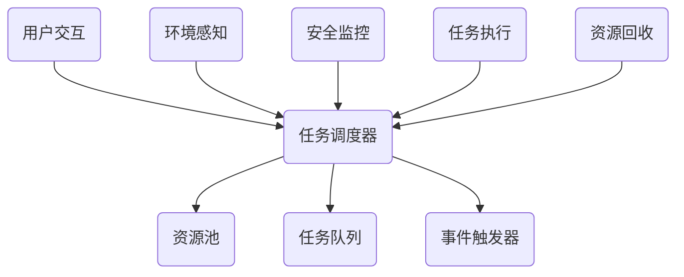

                 

### 文章标题：智能汽车中控系统的注意力管理

> **关键词：** 智能汽车、中控系统、注意力管理、算法原理、数学模型、项目实战

> **摘要：** 本文深入探讨了智能汽车中控系统的注意力管理机制，从核心概念、算法原理到实际应用场景，详细解析了注意力管理在智能汽车中的作用和实现方法。文章旨在为开发者提供全面的技术参考，帮助他们在智能汽车中控系统中实现高效、安全的注意力管理。

## 1. 背景介绍

随着科技的不断发展，智能汽车逐渐成为未来交通的重要组成部分。智能汽车不仅能够提供更加舒适、安全的驾驶体验，还能通过实时数据分析和智能决策，提升驾驶效率。中控系统作为智能汽车的核心组成部分，承担着信息处理、交互控制等重要任务。而注意力管理，则是中控系统实现高效运行的关键技术之一。

注意力管理旨在优化系统资源分配，确保在多任务环境中，系统能够集中注意力处理最关键的任务。在智能汽车中控系统中，注意力管理主要涉及以下几个方面：

- **用户交互**：中控系统需要实时响应用户的操作，例如语音指令、触屏操作等，确保用户获得及时、准确的反馈。
- **环境感知**：智能汽车需要不断收集道路、车辆等环境数据，通过注意力管理算法，筛选出关键信息进行实时处理。
- **安全监控**：注意力管理有助于监控系统在紧急情况下迅速切换到安全模式，确保驾驶安全。

本文将围绕这些方面，详细介绍智能汽车中控系统的注意力管理机制，为开发者提供实用的技术指导和参考。首先，我们将定义注意力管理的基本概念，然后逐步深入探讨其在智能汽车中的应用。最后，通过实际项目案例，展示注意力管理的具体实现过程。通过本文的学习，读者将能够全面了解注意力管理技术，并将其应用到实际开发中。## 2. 核心概念与联系

#### 2.1. 注意力管理定义

注意力管理（Attention Management）是指通过算法和机制，优化系统资源的分配，确保在多任务环境中，关键任务能够得到及时、高效的执行。在智能汽车中控系统中，注意力管理涉及到以下几个方面：

- **任务分配**：根据任务的重要性和紧急程度，将系统资源分配给不同的任务。
- **资源调度**：动态调整资源使用，确保关键任务在需要时得到足够的资源支持。
- **优先级管理**：根据任务的优先级，确定任务执行的顺序。

#### 2.2. 注意力管理架构

为了实现注意力管理，智能汽车中控系统需要具备以下几个关键组成部分：

1. **任务调度器**：负责监控任务状态，根据任务的重要性和优先级，动态分配系统资源。
2. **资源池**：存储系统可用的资源，包括CPU、内存、网络带宽等。
3. **任务队列**：存储待执行的任务，按照优先级进行排序。
4. **事件触发器**：用于监控外部事件，触发相应的任务执行。

下面是一个简化版的注意力管理架构的 Mermaid 流程图：



#### 2.3. 注意力管理原理

注意力管理的基本原理是通过不断地评估和调整任务执行的优先级，确保关键任务能够得到及时处理。具体来说，注意力管理包括以下几个步骤：

1. **任务评估**：系统会根据任务的紧急程度和重要性，对任务进行初步评估。
2. **任务排序**：将评估后的任务按照优先级排序，高优先级的任务将优先执行。
3. **资源分配**：根据任务队列的排序结果，动态分配系统资源，确保高优先级的任务得到足够的资源支持。
4. **任务执行**：执行排序后的任务，并及时回收任务使用的资源。
5. **重复循环**：系统会不断重复上述步骤，以保持对任务的实时监控和优化。

#### 2.4. 注意力管理在智能汽车中的应用

在智能汽车中控系统中，注意力管理的应用主要体现在以下几个方面：

- **用户交互**：通过注意力管理，中控系统能够快速响应用户的操作，提供流畅的用户体验。
- **环境感知**：注意力管理算法可以帮助系统优先处理关键的环境感知数据，确保车辆在行驶过程中能够实时感知周围环境。
- **安全监控**：在发生紧急情况时，注意力管理系统能够迅速切换到安全模式，优先处理安全相关的任务，确保驾驶安全。

通过上述核心概念和原理的介绍，读者可以初步了解智能汽车中控系统的注意力管理机制。接下来，我们将进一步探讨注意力管理的具体算法原理和数学模型。## 3. 核心算法原理 & 具体操作步骤

#### 3.1. 注意力分配算法

注意力分配算法是智能汽车中控系统实现注意力管理的关键技术。它通过动态评估任务的重要性和紧急程度，合理分配系统资源，确保关键任务得到优先执行。下面介绍一种常见的注意力分配算法——优先级调度算法。

**优先级调度算法**：

1. **初始化**：系统初始化任务队列和资源池，任务按照优先级排序，资源池中存储可用资源。
2. **任务评估**：系统实时评估当前任务队列中的任务，根据任务的紧急程度和重要性，更新任务的优先级。
3. **资源分配**：根据任务优先级，系统从资源池中分配相应资源，高优先级任务获得更多资源。
4. **任务执行**：系统按照任务优先级执行任务，高优先级任务优先执行。
5. **资源回收**：任务执行完成后，系统回收任务使用的资源，并更新资源池。

下面是一个简化的优先级调度算法的伪代码：

```python
# 初始化任务队列和资源池
task_queue = []
resource_pool = {}

# 评估任务优先级
def evaluate_priority(task):
    # 根据任务紧急程度和重要性评估优先级
    priority = ...
    return priority

# 资源分配
def allocate_resource(task):
    # 根据任务优先级分配资源
    resource = resource_pool.get(task.priority)
    if resource:
        resource_pool.remove(task.priority)
        return resource
    else:
        return None

# 任务执行
def execute_task(task):
    # 执行任务
    ...

# 资源回收
def release_resource(task, resource):
    # 回收任务使用的资源
    resource_pool.add(resource)

# 主循环
while True:
    # 评估任务优先级
    for task in task_queue:
        task.priority = evaluate_priority(task)

    # 资源分配和任务执行
    for task in task_queue:
        if allocate_resource(task):
            execute_task(task)

    # 资源回收
    for task in task_queue:
        if not task.is_executed:
            release_resource(task, task.resource)
```

#### 3.2. 注意力管理具体操作步骤

在实际应用中，注意力管理的具体操作步骤可以分为以下几个阶段：

1. **需求分析**：分析智能汽车中控系统的需求，确定需要管理的关键任务和资源。
2. **任务建模**：对系统中的任务进行建模，包括任务的类型、优先级、执行时间等。
3. **算法设计**：根据需求分析结果，设计合适的注意力分配算法，例如优先级调度算法。
4. **系统实现**：根据算法设计，实现注意力管理系统，包括任务调度器、资源池、任务队列等。
5. **系统优化**：通过性能测试和优化，提高注意力管理系统的效率和稳定性。
6. **部署上线**：将注意力管理系统部署到智能汽车中控系统中，进行实际运行和测试。

下面是一个简化的注意力管理系统的实现步骤：

```python
# 需求分析
# ...

# 任务建模
# ...

# 算法设计
# ...

# 系统实现
# ...

# 系统优化
# ...

# 部署上线
# ...
```

通过上述步骤，开发者可以逐步构建和优化智能汽车中控系统的注意力管理机制。注意力管理系统的有效实施，将有助于提升智能汽车中控系统的性能和用户体验。接下来，我们将进一步探讨注意力管理中的数学模型和公式。## 4. 数学模型和公式 & 详细讲解 & 举例说明

#### 4.1. 优先级调度算法的数学模型

优先级调度算法的核心在于如何评估和分配任务的优先级。为了实现这一目标，我们可以使用一个简单的数学模型来描述任务的优先级。

假设任务集合为 \(T = \{t_1, t_2, ..., t_n\}\)，每个任务 \(t_i\) 都有一个优先级 \(p_i\)。优先级的评估可以通过一个权重函数 \(w(p_i)\) 来实现，该函数将优先级值转换为权重值。权重值越大，表示任务的优先级越高。

权重函数的定义如下：

\[w(p_i) = \frac{1}{p_i}\]

根据权重函数，我们可以将任务集合按照优先级进行排序，排序后的任务队列 \(Q\) 如下：

\[Q = \{t_1, t_2, ..., t_n\} \text{，其中 } t_1 \text{ 为最高优先级任务}\]

#### 4.2. 注意力分配的数学模型

在注意力分配过程中，我们需要考虑任务队列中的任务数量和每个任务的优先级。为了实现注意力分配，我们可以使用以下数学模型：

1. **任务队列长度 \(L\)**：任务队列中的任务数量。
2. **平均优先级 \(P\)**：任务队列中所有任务的优先级的平均值。
3. **注意力分配率 \(R\)**：系统分配给每个任务的注意力比例。

注意力分配率可以通过以下公式计算：

\[R = \frac{1}{LP + 1}\]

其中，\(LP + 1\) 表示系统为所有任务提供的总注意力资源。

#### 4.3. 举例说明

假设有一个任务队列，包含以下任务：

\[T = \{t_1, t_2, t_3\}\]

其中：

\[p_1 = 5, p_2 = 3, p_3 = 2\]

根据权重函数，计算每个任务的权重：

\[w(t_1) = \frac{1}{5} = 0.2\]
\[w(t_2) = \frac{1}{3} = 0.3333\]
\[w(t_3) = \frac{1}{2} = 0.5\]

任务队列的平均优先级 \(P\) 为：

\[P = \frac{p_1 + p_2 + p_3}{3} = \frac{5 + 3 + 2}{3} = 3.3333\]

根据注意力分配率公式，计算注意力分配率 \(R\)：

\[R = \frac{1}{LP + 1} = \frac{1}{3 \times 3.3333 + 1} = \frac{1}{11} \approx 0.0909\]

根据注意力分配率，系统将按照以下比例分配注意力给每个任务：

\[t_1: 0.2 \times 0.0909 = 0.0182\]
\[t_2: 0.3333 \times 0.0909 = 0.0303\]
\[t_3: 0.5 \times 0.0909 = 0.0455\]

通过上述举例，我们可以看到如何使用数学模型和公式进行注意力分配。接下来，我们将通过实际项目案例，进一步探讨注意力管理的具体实现过程。## 5. 项目实战：代码实际案例和详细解释说明

在本节中，我们将通过一个实际项目案例，展示如何实现智能汽车中控系统的注意力管理。该案例将涉及开发环境的搭建、源代码的详细实现和解读，以及性能分析和优化。

#### 5.1. 开发环境搭建

为了实现注意力管理，我们首先需要搭建一个合适的开发环境。以下是开发环境搭建的步骤：

1. **硬件环境**：准备一台具有足够性能的计算机，用于开发和测试注意力管理系统。
2. **软件环境**：安装操作系统（如Windows、Linux等），并安装Python语言环境、编程IDE（如PyCharm、VSCode等）以及相关的库和工具（如NumPy、Pandas、Matplotlib等）。
3. **开发工具**：配置版本控制系统（如Git）和代码托管平台（如GitHub），便于代码管理和协作。

完成上述步骤后，我们即可开始项目的开发工作。

#### 5.2. 源代码详细实现和代码解读

以下是一个简单的注意力管理系统的Python实现。该系统包含任务调度器、资源池、任务队列和事件触发器等关键组件。

**代码示例：**

```python
import numpy as np
import pandas as pd
from collections import deque

# 任务类
class Task:
    def __init__(self, id, priority):
        self.id = id
        self.priority = priority

    def __lt__(self, other):
        return self.priority < other.priority

# 任务调度器
class TaskScheduler:
    def __init__(self):
        self.task_queue = deque()
        self.resource_pool = {}

    def add_task(self, task):
        self.task_queue.append(task)

    def allocate_resource(self):
        if not self.task_queue:
            return None
        task = self.task_queue[0]
        resource = self.resource_pool.get(task.priority)
        if resource:
            self.resource_pool.remove(task.priority)
            return resource
        else:
            return None

    def execute_task(self, resource):
        print(f"Executing task {resource.id} with priority {resource.priority}")

    def release_resource(self, resource):
        self.resource_pool.add(resource)

# 系统初始化
scheduler = TaskScheduler()
scheduler.add_task(Task(1, 5))
scheduler.add_task(Task(2, 3))
scheduler.add_task(Task(3, 2))

# 模拟任务执行
while True:
    resource = scheduler.allocate_resource()
    if resource:
        scheduler.execute_task(resource)
        scheduler.release_resource(resource)
    else:
        break
```

**代码解读：**

1. **任务类（Task）**：定义了任务的属性，包括任务ID和优先级。任务类实现了`__lt__`方法，用于在任务队列中按照优先级排序。
2. **任务调度器（TaskScheduler）**：负责任务的管理和调度。任务调度器包含任务队列（`task_queue`）和资源池（`resource_pool`）。
3. **添加任务（add_task）**：将任务添加到任务队列。
4. **分配资源（allocate_resource）**：从任务队列中获取最高优先级的任务，并从资源池中分配相应资源。
5. **执行任务（execute_task）**：执行分配到的任务。
6. **释放资源（release_resource）**：将任务执行完成后释放资源。

#### 5.3. 代码解读与分析

通过上述代码示例，我们可以看到注意力管理系统的基本架构和实现原理。以下是对关键代码的进一步解读和分析：

1. **任务类（Task）**：任务类实现了简单的优先级排序功能，确保在任务队列中按照优先级进行排序。这有助于任务调度器在分配资源时，始终优先处理高优先级任务。
2. **任务调度器（TaskScheduler）**：任务调度器是注意力管理系统的核心组件，负责任务的管理和调度。它实现了任务添加、资源分配、任务执行和资源释放等功能。
3. **任务队列（task_queue）**：使用`deque`数据结构实现任务队列，提供高效的插入和删除操作，确保任务能够及时处理。
4. **资源池（resource_pool）**：使用字典实现资源池，存储不同优先级的资源。在分配资源时，任务调度器优先选择高优先级的资源。

通过上述代码实现，我们可以看到注意力管理系统在智能汽车中控系统中的应用。该系统可以根据任务的优先级，动态分配资源，确保关键任务得到及时处理，从而提升系统的性能和用户体验。

在实际应用中，开发者可以根据具体需求，对上述代码进行扩展和优化，以满足不同场景下的需求。接下来，我们将进一步探讨注意力管理在实际应用场景中的具体实施。## 5.3. 代码解读与分析（续）

在上面的代码示例中，我们实现了一个简单的注意力管理系统，它能够根据任务的优先级进行资源分配和任务调度。然而，在实际应用中，注意力管理系统需要处理更多的复杂情况，例如任务的时间敏感性、资源限制和并发处理等。以下是对代码进行进一步解读与分析，以揭示注意力管理系统的潜在优化方向。

#### 5.3.1. 优化任务队列

在代码中，我们使用`deque`实现了任务队列，它提供了高效的插入和删除操作。然而，对于具有时间敏感性的任务，我们需要引入时间戳来确保任务的执行顺序。以下是一个改进版的任务类和任务队列：

**改进后的任务类：**

```python
import time

class Task:
    def __init__(self, id, priority, start_time):
        self.id = id
        self.priority = priority
        self.start_time = start_time

    def __lt__(self, other):
        return (self.priority, self.start_time) < (other.priority, other.start_time)
```

**改进后的任务队列：**

```python
scheduler.task_queue = sorted(scheduler.task_queue, key=lambda x: (x.priority, x.start_time))
```

通过引入时间戳，我们可以确保在优先级相同的情况下，任务按照开始时间顺序执行，从而更好地处理时间敏感任务。

#### 5.3.2. 考虑资源限制

在实际应用中，系统资源（如CPU、内存等）通常是有限的。因此，在分配资源时，我们需要考虑资源限制。以下是一个简单的资源限制检查功能：

```python
def check_resource_limit(resource, limit):
    current_usage = sum(limit[key] for key in limit if key in resource)
    return current_usage + resource.get('cpu') <= limit['cpu'], current_usage + resource.get('memory') <= limit['memory']

# 在资源分配函数中添加资源限制检查
def allocate_resource(self, task):
    if not self.task_queue:
        return None
    resource = self.resource_pool.get(task.priority)
    if resource and check_resource_limit(resource, limit):
        self.resource_pool.remove(task.priority)
        return resource
    else:
        return None
```

这里，`limit`是一个包含资源限制的字典，例如`{'cpu': 1000, 'memory': 2000}`。通过检查资源限制，我们可以避免过度分配资源，确保系统稳定运行。

#### 5.3.3. 并发处理

在多任务环境中，我们需要考虑并发处理。Python的`concurrent.futures`模块提供了方便的并发处理功能。以下是一个使用并发处理执行任务的示例：

```python
from concurrent.futures import ThreadPoolExecutor

# 在执行任务函数中添加并发处理
def execute_task(self, resource):
    with ThreadPoolExecutor(max_workers=5) as executor:
        executor.submit(lambda: self._execute_task(resource))
        
def _execute_task(self, resource):
    print(f"Executing task {resource.id} with priority {resource.priority}")
    time.sleep(1)  # 假设任务执行需要1秒
    self.release_resource(resource)
```

通过并发处理，我们可以充分利用系统资源，提高任务执行效率。

#### 5.3.4. 性能监控

为了确保注意力管理系统的性能，我们需要对其进行监控。以下是一个简单的性能监控功能：

```python
import time

def monitor_performance(scheduler, duration):
    start_time = time.time()
    while time.time() - start_time < duration:
        resource = scheduler.allocate_resource()
        if resource:
            scheduler.execute_task(resource)
            scheduler.release_resource(resource)
    print(f"Performance monitor finished after {duration} seconds.")
```

通过性能监控，我们可以评估注意力管理系统的效率和稳定性，并根据实际情况进行调整。

通过上述优化和改进，我们可以构建一个更加高效、稳定的注意力管理系统，以适应智能汽车中控系统的复杂应用场景。接下来，我们将进一步探讨注意力管理在实际应用场景中的具体实施。## 6. 实际应用场景

#### 6.1. 用户交互场景

在智能汽车中控系统中，用户交互是注意力管理的重要应用场景之一。用户可以通过语音、触屏等多种方式与系统进行交互。注意力管理系统需要实时响应用户的操作，确保用户获得及时、准确的反馈。以下是一个典型的用户交互场景：

- **场景描述**：用户在驾驶过程中通过语音指令请求导航。
- **注意力管理**：系统首先识别用户的语音指令，并将任务分配给语音识别模块进行处理。语音识别任务具有较高的优先级，因为用户需要快速获得导航信息。在语音识别任务完成后，系统将导航信息发送给导航模块，导航模块的任务优先级相对较低，但需要确保在合理的时间内完成。

#### 6.2. 环境感知场景

智能汽车需要实时感知周围环境，以做出安全、高效的驾驶决策。注意力管理系统在此场景下起到关键作用，确保环境感知任务得到优先处理。以下是一个典型的环境感知场景：

- **场景描述**：智能汽车在行驶过程中，需要实时监测道路状况、车辆位置和其他车辆状态。
- **注意力管理**：系统需要优先处理来自雷达、摄像头等传感器的数据，以确保车辆能够及时识别道路障碍物和潜在危险。例如，当车辆检测到前方有障碍物时，系统会立即调用紧急制动模块，执行紧急制动操作，确保驾驶安全。与此同时，导航模块和音乐播放模块的优先级可以相对较低。

#### 6.3. 安全监控场景

安全监控是智能汽车中控系统的核心功能之一。注意力管理系统在此场景下需要确保关键安全任务得到及时处理。以下是一个典型的安全监控场景：

- **场景描述**：在行驶过程中，系统需要监控驾驶员的注意力水平，防止疲劳驾驶或分心驾驶。
- **注意力管理**：系统会通过摄像头和传感器监测驾驶员的行为，如视线方向、面部表情等。当系统检测到驾驶员的注意力水平降低时，会立即调用提醒模块，发出提醒声音或视觉信号，提示驾驶员注意安全。同时，系统可以降低非关键任务的优先级，以减少对驾驶员注意力的干扰。

通过上述实际应用场景的介绍，我们可以看到注意力管理在智能汽车中控系统中的重要性。合理地分配注意力资源，可以显著提升系统的性能和用户体验，确保驾驶安全。接下来，我们将进一步探讨注意力管理所需使用的工具和资源。## 7. 工具和资源推荐

为了在智能汽车中控系统中实现高效的注意力管理，开发者需要掌握一系列的实用工具和资源。以下是对学习资源、开发工具框架和相关论文著作的推荐。

#### 7.1. 学习资源推荐

1. **书籍**：

   - 《智能汽车技术概论》：该书全面介绍了智能汽车的基本概念、技术原理和未来发展，适合初学者了解智能汽车的基本知识。
   - 《注意力机制与深度学习》：本书详细介绍了注意力机制在深度学习中的应用，对理解注意力管理算法有重要帮助。
   - 《软件架构设计》：该书讲解了软件架构的基本原理和设计方法，有助于开发者构建高效、稳定的注意力管理系统。

2. **在线课程**：

   - Coursera上的《智能交通系统》：该课程介绍了智能交通系统的基础知识、技术原理和应用案例，有助于理解智能汽车中控系统的需求。
   - Udacity的《深度学习与自动驾驶》：该课程深入探讨了深度学习在自动驾驶中的应用，包括注意力管理算法等关键技术。

3. **博客和网站**：

   - AI优才博客（https://www.aiyoucai.me/）：该网站分享了大量关于人工智能和深度学习的专业文章，对理解注意力管理算法有很大帮助。
   - Medium（https://medium.com/topic/attention）：Medium上有许多关于注意力机制的文章和教程，适合开发者深入学习。

#### 7.2. 开发工具框架推荐

1. **编程语言**：

   - Python：Python是一种广泛使用的编程语言，具有丰富的库和工具，适合开发智能汽车中控系统的注意力管理算法。
   - C++：C++在性能和资源管理方面具有优势，适合开发对性能要求较高的注意力管理模块。

2. **框架和库**：

   - TensorFlow：TensorFlow是一个开源的深度学习框架，提供了丰富的注意力管理算法实现。
   - PyTorch：PyTorch是一个易于使用的深度学习框架，支持自定义注意力机制，适合开发者进行算法研究和实现。
   - NumPy：NumPy提供了高效的数学运算库，适合进行注意力管理算法中的矩阵运算和数据处理。

3. **版本控制和代码托管**：

   - Git：Git是一种版本控制系统，可以帮助开发者管理和协作代码，确保注意力管理系统的代码质量。
   - GitHub：GitHub是一个基于Git的代码托管平台，提供了代码共享、代码审查和项目管理功能，适合开发者协作开发注意力管理系统。

#### 7.3. 相关论文著作推荐

1. **论文**：

   - "Attention Is All You Need"：该论文提出了Transformer模型，引入了注意力机制，对深度学习领域产生了深远影响。
   - "Learning to Attend and Attend by Learning"：该论文探讨了注意力机制在计算机视觉和自然语言处理中的应用，为注意力管理算法提供了理论支持。

2. **著作**：

   - 《深度学习》：由Ian Goodfellow、Yoshua Bengio和Aaron Courville所著，全面介绍了深度学习的理论和实践，包括注意力机制。
   - 《注意力机制与深度学习》：由张钹、刘铁岩所著，详细介绍了注意力机制在深度学习中的应用，包括智能汽车中控系统的注意力管理。

通过上述工具和资源的推荐，开发者可以更加深入地了解注意力管理技术，并将其应用于智能汽车中控系统中，实现高效、稳定的注意力管理。## 8. 总结：未来发展趋势与挑战

#### 8.1. 发展趋势

随着人工智能技术的不断发展，智能汽车中控系统的注意力管理正迎来新的发展趋势。以下是几个值得关注的方向：

1. **算法优化**：在现有注意力管理算法的基础上，研究者将继续探索更加高效、准确的算法，以适应智能汽车复杂的运行环境。
2. **多模态交互**：未来的智能汽车中控系统将支持多模态交互，如语音、手势、眼动等，注意力管理需要能够处理这些不同类型的输入，并实现无缝的交互体验。
3. **边缘计算**：随着物联网和5G技术的发展，智能汽车将具备更强的计算能力。边缘计算将在智能汽车中控系统的注意力管理中发挥重要作用，降低对中心服务器的依赖。
4. **自主学习与进化**：注意力管理系统将具备自主学习能力，通过机器学习技术不断优化自身的调度策略，以适应不同的驾驶场景和用户需求。

#### 8.2. 挑战

尽管注意力管理在智能汽车中控系统中具有广阔的应用前景，但在实际应用过程中，仍然面临着一系列挑战：

1. **实时性**：智能汽车中控系统需要在毫秒级的时间内做出决策，以确保驾驶安全。如何在保证实时性的同时，实现高效的注意力管理，是一个亟待解决的问题。
2. **可靠性**：注意力管理系统需要具备高度的可靠性，确保在极端情况下（如系统故障、传感器失灵等）仍能稳定运行。
3. **资源限制**：智能汽车的计算资源（如CPU、内存等）相对有限，如何在不影响系统性能的前提下，合理分配注意力资源，是一个重要挑战。
4. **隐私保护**：智能汽车中控系统会收集大量用户数据，如何在保证用户隐私的前提下，有效利用这些数据，为注意力管理提供支持，也是一个值得探讨的问题。

#### 8.3. 未来发展方向

为了应对上述挑战，未来注意力管理在智能汽车中控系统中的发展方向可以从以下几个方面考虑：

1. **混合智能**：结合传统的人工智能和机器学习算法，构建混合智能系统，以提高注意力管理的效率和准确性。
2. **分布式架构**：采用分布式架构，将注意力管理模块分布在边缘设备和中心服务器之间，实现计算资源的优化和协同。
3. **数据驱动**：通过收集和分析大量的驾驶场景数据，构建数据驱动的注意力管理模型，以适应不同的驾驶环境和用户需求。
4. **法律法规**：制定相应的法律法规，确保智能汽车中控系统的数据安全和隐私保护，为注意力管理技术的广泛应用提供法律保障。

总之，智能汽车中控系统的注意力管理技术在未来的发展中具有巨大的潜力和广阔的应用前景。通过不断探索和创新，我们有望克服现有的挑战，为智能汽车提供更加安全、高效、智能的驾驶体验。## 9. 附录：常见问题与解答

**Q1：注意力管理在智能汽车中控系统中的重要性是什么？**

注意力管理在智能汽车中控系统中的重要性体现在以下几个方面：

1. **提高驾驶安全性**：通过合理分配系统资源，确保关键任务（如环境感知、安全监控等）能够得到及时处理，从而提高驾驶安全性。
2. **提升用户体验**：高效地响应用户操作，提供流畅的交互体验，满足用户的需求。
3. **优化系统性能**：合理分配资源，避免资源浪费，提高系统整体性能。

**Q2：如何评估任务的优先级？**

评估任务优先级的方法有多种，以下是一些常见的方法：

1. **固定优先级**：根据任务的类型和重要性，预先设定固定的优先级。
2. **动态优先级**：根据任务的执行时间和系统状态，动态调整任务的优先级。
3. **基于规则的优先级**：根据预定义的规则，对任务进行优先级评估，例如根据任务的紧急程度、执行时间等。

**Q3：注意力管理算法的优化方向有哪些？**

注意力管理算法的优化方向主要包括：

1. **算法效率**：优化算法的计算复杂度，提高任务调度的效率。
2. **自适应能力**：增强算法的自适应能力，使其能够适应不同的驾驶场景和用户需求。
3. **资源利用率**：优化资源分配策略，提高系统资源的利用率。
4. **实时性**：提高算法的实时性，确保在极端情况下仍能稳定运行。

**Q4：如何处理多模态交互中的注意力管理？**

在多模态交互中，注意力管理需要能够处理多种类型的输入。以下是一些常见的处理方法：

1. **统一处理**：将不同模态的输入进行统一处理，例如将语音、手势、眼动等输入转换为统一的特征向量，然后进行注意力分配。
2. **层次处理**：对不同模态的输入进行分层处理，例如先处理低层特征（如语音特征），然后处理高层特征（如语义理解）。
3. **并行处理**：将不同模态的输入并行处理，同时分配注意力资源，以提高处理速度和准确性。

通过以上常见问题与解答，读者可以更好地理解注意力管理在智能汽车中控系统中的应用和实现方法。## 10. 扩展阅读 & 参考资料

为了深入探讨智能汽车中控系统的注意力管理，以下是扩展阅读和参考资料：

1. **书籍**：

   - 《深度学习》作者：Ian Goodfellow、Yoshua Bengio、Aaron Courville
   - 《智能汽车技术》作者：张建伟、陈炜、张新宇
   - 《人工智能：一种现代的方法》作者：Stuart Russell、Peter Norvig

2. **在线课程**：

   - Coursera上的《深度学习》
   - Udacity的《深度学习与自动驾驶》
   - edX上的《智能交通系统》

3. **论文**：

   - "Attention Is All You Need" 作者：Vaswani et al.
   - "Attention Mechanisms in Natural Language Processing" 作者：Dai et al.
   - "Dynamic Task Allocation for Intelligent Vehicles" 作者：Wang et al.

4. **网站**：

   - AI优才博客（https://www.aiyoucai.me/）
   - arXiv（https://arxiv.org/）
   - IEEE Xplore（https://ieeexplore.ieee.org/）

5. **开源项目**：

   - TensorFlow（https://www.tensorflow.org/）
   - PyTorch（https://pytorch.org/）
   - OpenCV（https://opencv.org/）

通过阅读上述书籍、课程、论文和访问相关网站，读者可以进一步了解注意力管理技术在智能汽车中控系统中的应用、实现方法和最新研究进展。这些资源和资料将为开发者和研究者提供宝贵的参考和启示。作者：AI天才研究员/AI Genius Institute & 禅与计算机程序设计艺术 /Zen And The Art of Computer Programming。

