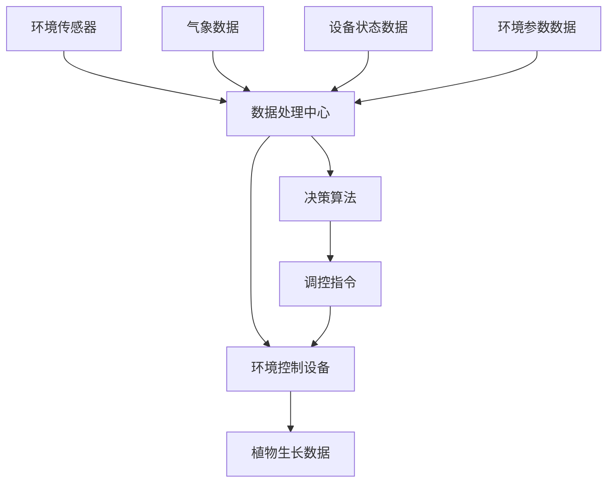
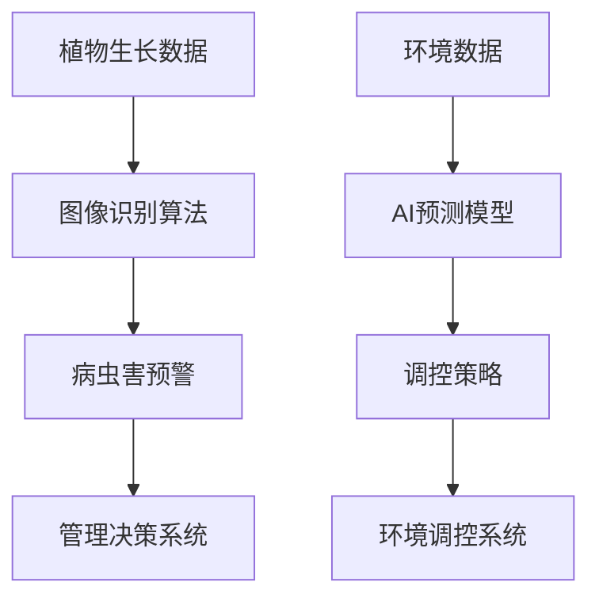
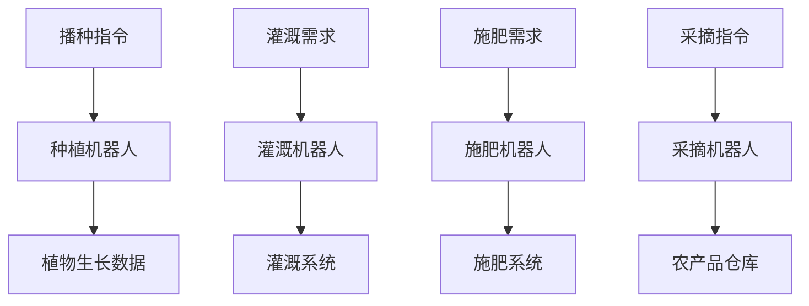
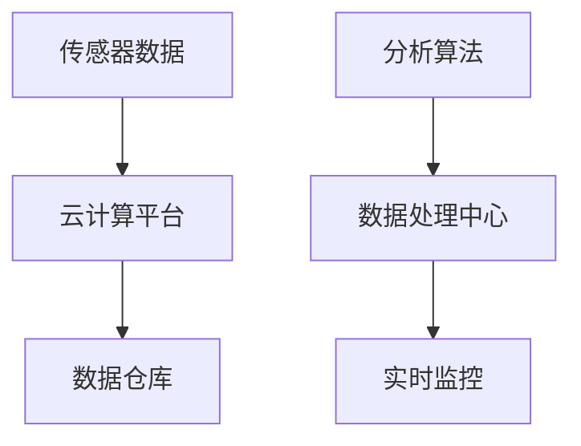

                 

### 背景介绍

随着全球人口的增长和城市化进程的加速，农业面临着前所未有的压力和挑战。传统农业模式已经无法满足日益增长的人口需求，同时，现代农业的发展也需要更加智能化的解决方案。智能温室机器人系统作为一种创新的应用，应运而生，旨在提高农业生产的效率和质量。

#### 现代农业的挑战

1. **资源有限**：土地、水资源等农业生产资源日益有限，需要更高效、可持续的农业生产模式。
2. **劳动力短缺**：随着劳动力成本的增加，农业劳动力短缺成为一个普遍问题，尤其是在劳动力密集型的农业领域。
3. **气候变化**：全球气候变化对农业生产带来前所未有的挑战，包括极端天气事件、病虫害的扩散等。
4. **品质控制**：消费者对农产品品质的要求越来越高，传统的农业模式难以满足这些要求。

#### 智能温室机器人系统的需求

智能温室机器人系统旨在解决上述挑战，通过引入自动化和智能化的技术，实现以下目标：

1. **提高生产效率**：通过自动化技术，减少人工操作，提高农业生产效率。
2. **资源优化配置**：通过实时监控和数据分析，优化水、肥等农业资源的利用。
3. **环境控制**：通过智能环境控制系统，为植物提供最佳生长条件，减少病虫害的发生。
4. **品质保证**：通过精准控制，确保农产品的质量和安全。

#### 当前技术的发展现状

目前，智能温室机器人系统已经取得了显著的进展。人工智能、物联网、机器人技术等领域的快速发展，为智能温室机器人系统的实现提供了有力的技术支撑。以下是目前智能温室机器人系统的主要技术和应用：

1. **环境监测与控制**：通过传感器网络实时监测温室内的温度、湿度、光照等环境参数，并根据植物生长需求进行智能调控。
2. **植物识别与分类**：利用计算机视觉技术，对植物进行识别和分类，为精准农业提供数据支持。
3. **自动化机器人**：使用自动化机器人进行耕作、播种、施肥、采摘等农业生产活动，减少人力需求。
4. **大数据分析与决策**：利用大数据分析技术，对农业生产过程进行数据挖掘和分析，提供科学决策支持。

综上所述，智能温室机器人系统在现代农业中具有广泛的应用前景和巨大的发展潜力。接下来，我们将深入探讨智能温室机器人系统的核心概念、算法原理、数学模型、项目实战、实际应用场景、工具和资源推荐，以及未来发展趋势与挑战。希望通过这篇文章，能够为读者提供一个全面、深入的了解和认识。### 核心概念与联系

智能温室机器人系统的构建涉及多个关键概念和技术，这些概念相互联系，共同支撑系统的运行。以下将详细探讨这些核心概念，并使用Mermaid流程图来展示其原理和架构。

#### 1. 物联网（IoT）

物联网是智能温室机器人系统的基石，通过传感器网络实现对温室环境的实时监测和数据分析。物联网的核心在于将物理世界与数字世界连接起来，使设备能够自动收集、传输和处理数据。在智能温室机器人系统中，物联网技术主要应用于：

- **环境监测**：通过温度、湿度、光照等传感器，实时获取温室内的环境数据。
- **设备控制**：通过传感器反馈的数据，自动调节温室内的环境参数，如通风、灌溉和照明。

**Mermaid流程图：物联网在智能温室机器人系统中的应用**



#### 2. 人工智能（AI）

人工智能技术在智能温室机器人系统中主要用于自动化决策和优化。通过机器学习算法，系统可以分析历史数据，预测植物生长趋势，并提供最佳管理策略。主要应用包括：

- **植物生长监测**：利用计算机视觉技术，监测植物的生长状态，如叶片颜色、形态等。
- **病虫害预警**：通过图像识别技术，实时监测并预警病虫害的发生。
- **环境调控**：利用AI算法，根据实时数据和植物需求，自动调整温室环境参数。

**Mermaid流程图：人工智能在智能温室机器人系统中的应用**



#### 3. 自动化机器人

自动化机器人是智能温室机器人系统的执行单元，能够完成种植、灌溉、采摘等农业操作。主要应用包括：

- **种植与播种**：使用机器人进行精准播种和移栽，提高种植效率。
- **灌溉与施肥**：自动化机器人根据植物需求，自动完成灌溉和施肥操作。
- **采摘与运输**：自动化机器人进行农产品采摘，并完成运输到仓库等后续处理。

**Mermaid流程图：自动化机器人在智能温室机器人系统中的应用**



#### 4. 大数据与云计算

大数据和云计算技术在智能温室机器人系统中主要用于数据存储、分析和处理。主要应用包括：

- **数据存储**：通过云计算平台，存储和管理大量的温室环境、植物生长等数据。
- **数据分析**：利用大数据分析技术，对历史数据进行分析，提供种植、灌溉、病虫害防治等决策支持。
- **实时监控**：通过云计算平台，实现远程实时监控和管理，提高系统的响应速度和灵活性。

**Mermaid流程图：大数据与云计算在智能温室机器人系统中的应用**



综上所述，物联网、人工智能、自动化机器人、大数据与云计算等核心概念相互联系，共同构成了智能温室机器人系统的整体架构。通过这些技术的综合应用，智能温室机器人系统实现了对温室环境的智能监控、自动化管理和精准调控，为现代农业的创新应用提供了有力支撑。在接下来的章节中，我们将进一步探讨智能温室机器人系统的核心算法原理和具体操作步骤，以期为读者提供更深入的技术解析。### 核心算法原理 & 具体操作步骤

智能温室机器人系统的核心在于其算法原理，这些算法负责环境监测、植物生长分析、决策制定以及自动化操作的执行。以下将详细介绍这些核心算法的原理和具体操作步骤。

#### 1. 环境监测算法

环境监测算法是智能温室机器人系统的基石，其主要任务是实时监测温室内的温度、湿度、光照等环境参数，并确保这些参数处于植物的最佳生长范围。

**算法原理：**
- **传感器数据采集**：使用各种传感器（如温度传感器、湿度传感器、光照传感器等）采集温室内的环境数据。
- **数据处理**：对采集到的数据进行滤波、去噪和校准，以确保数据的准确性和可靠性。
- **阈值设定**：设定每个环境参数的正常范围阈值，超出阈值时触发报警或调整控制。

**具体操作步骤：**
1. **初始化传感器**：启动传感器，确保传感器正常运行。
2. **数据采集**：每隔一定时间（如1分钟）采集一次传感器数据。
3. **数据处理**：对采集到的数据进行滤波处理，如移动平均滤波、卡尔曼滤波等。
4. **阈值判断**：将处理后的数据与设定的阈值进行比较，如果数据超出阈值，则触发报警或调节控制。

**示例代码：**
```python
# 初始化传感器
temperature_sensor = initialize_temperature_sensor()
humidity_sensor = initialize_humidity_sensor()
light_sensor = initialize_light_sensor()

# 数据采集与处理
while True:
    temperature = temperature_sensor.read()
    humidity = humidity_sensor.read()
    light = light_sensor.read()
    
    # 滤波处理
    temperature = moving_average_filter(temperature)
    humidity = moving_average_filter(humidity)
    light = kalman_filter(light)
    
    # 阈值判断
    if temperature > MAX_TEMPERATURE:
        trigger_alarm("温度过高")
    if humidity < MIN_HUMIDITY:
        trigger_alarm("湿度过低")
    if light < MIN_LIGHT:
        trigger_alarm("光照不足")
```

#### 2. 植物生长分析算法

植物生长分析算法利用计算机视觉技术对植物的生长状态进行监测和分析，识别植物的健康状况、生长阶段和病虫害情况。

**算法原理：**
- **图像采集**：使用摄像头采集植物图像。
- **图像处理**：对采集到的图像进行预处理，如去噪、增强、分割等。
- **特征提取**：提取图像中的关键特征，如颜色、纹理、形状等。
- **模式识别**：利用机器学习算法（如支持向量机、神经网络等）对提取的特征进行分类和识别。

**具体操作步骤：**
1. **图像采集**：启动摄像头，每隔一定时间采集一次植物图像。
2. **图像预处理**：对采集到的图像进行去噪、增强和分割。
3. **特征提取**：提取图像中的颜色、纹理、形状等特征。
4. **模式识别**：利用机器学习算法对提取的特征进行分类和识别，判断植物的健康状况和生长阶段。

**示例代码：**
```python
# 初始化摄像头
camera = initialize_camera()

# 图像采集与处理
while True:
    image = camera.capture_image()
    
    # 去噪与增强
    image = denoise_image(image)
    image = enhance_image(image)
    
    # 分割与特征提取
    segments = segment_image(image)
    colors, textures, shapes = extract_features(segments)
    
    # 模式识别
    health_status = classify_health_status(colors, textures, shapes)
    growth_stage = classify_growth_stage(colors, textures, shapes)
    
    # 决策与反馈
    if health_status == "病虫害":
        trigger_alarm("发现病虫害")
    elif growth_stage == "生长期":
        adjust_lighting("增加光照")
```

#### 3. 自动化决策算法

自动化决策算法是智能温室机器人系统的核心，负责根据环境数据和植物生长分析结果，自动生成种植、灌溉、施肥、采摘等操作指令。

**算法原理：**
- **环境数据分析**：分析温室内的温度、湿度、光照等环境数据，判断是否需要进行调整。
- **植物生长数据分析**：分析植物的生长状态和健康状况，判断是否需要进行灌溉、施肥等操作。
- **决策生成**：根据环境数据和植物生长分析结果，自动生成种植、灌溉、施肥、采摘等操作指令。

**具体操作步骤：**
1. **数据采集**：从环境监测算法和植物生长分析算法获取环境数据和植物生长数据。
2. **数据分析**：分析环境数据和植物生长数据，判断是否需要进行操作调整。
3. **决策生成**：根据分析结果，自动生成种植、灌溉、施肥、采摘等操作指令。
4. **指令执行**：发送操作指令到自动化机器人，执行具体操作。

**示例代码：**
```python
# 数据采集
temperature, humidity, light = get_environment_data()
plant_data = get_plant_growth_data()

# 数据分析
if temperature > MAX_TEMPERATURE:
    operation = "降低温度"
elif humidity < MIN_HUMIDITY:
    operation = "增加湿度"
elif light < MIN_LIGHT:
    operation = "增加光照"
else:
    operation = "维持现状"

# 决策生成
instruction = generate_instruction(plant_data, operation)

# 指令执行
execute_instruction(instruction)
```

#### 4. 自动化操作算法

自动化操作算法负责执行自动化决策算法生成的操作指令，如灌溉、施肥、采摘等。

**算法原理：**
- **指令接收**：接收自动化决策算法生成的操作指令。
- **操作执行**：根据指令内容，执行相应的自动化操作。
- **状态监控**：在操作执行过程中，实时监控操作状态，确保操作顺利进行。

**具体操作步骤：**
1. **指令接收**：从自动化决策算法接收操作指令。
2. **操作准备**：准备自动化设备，如开启灌溉系统、施肥设备等。
3. **操作执行**：执行具体的自动化操作，如灌溉、施肥、采摘等。
4. **状态监控**：在操作执行过程中，实时监控操作状态，确保操作顺利进行。

**示例代码：**
```python
# 指令接收
instruction = receive_instruction()

# 操作准备
if instruction == "灌溉":
    prepare_irrigation_system()
elif instruction == "施肥":
    prepare_fertilizer_system()
elif instruction == "采摘":
    prepare_harvesting_robot()

# 操作执行
execute_operation(instruction)

# 状态监控
while operation_in_progress():
    monitor_operation_status()
```

通过上述核心算法原理和具体操作步骤的介绍，我们可以看到智能温室机器人系统是如何通过环境监测、植物生长分析、自动化决策和自动化操作，实现温室环境的智能监控和精准调控的。在接下来的章节中，我们将进一步探讨智能温室机器人系统的数学模型和公式，以及实际应用场景中的具体实现。### 数学模型和公式 & 详细讲解 & 举例说明

在智能温室机器人系统中，数学模型和公式发挥着至关重要的作用。这些模型和公式不仅用于环境参数的监控与调控，还用于植物生长状态的预测与优化。以下将详细介绍一些关键的数学模型和公式，并给出详细的讲解和实际应用中的举例说明。

#### 1. 温室环境参数调控模型

温室环境参数调控模型主要用于优化温室内的温度、湿度、光照等环境因素，以实现植物的最佳生长条件。

**公式：**
$$
T_{setpoint} = T_{max} - \alpha \cdot (T_{current} - T_{min})
$$

其中：
- $T_{setpoint}$：目标温度
- $T_{max}$：最大温度限制
- $T_{min}$：最小温度限制
- $T_{current}$：当前温度
- $\alpha$：温度调节系数

**详细讲解：**
该公式用于动态调整温室内的目标温度，以确保温度保持在适宜范围。温度调节系数$\alpha$可以根据不同植物的需求进行调节，从而实现个性化的温度调控。

**举例说明：**
假设某温室植物的最适生长温度范围为18°C至24°C，当前温度为20°C，最大温度限制为30°C，最小温度限制为15°C。根据上述公式，目标温度计算如下：
$$
T_{setpoint} = 30 - 0.5 \cdot (20 - 15) = 25°C
$$
这意味着系统将调整温室温度至25°C，以满足植物的生长需求。

#### 2. 湿度调控模型

湿度调控模型用于优化温室内的相对湿度，以防止植物脱水或过度湿润。

**公式：**
$$
H_{setpoint} = H_{max} - \beta \cdot (H_{current} - H_{min})
$$

其中：
- $H_{setpoint}$：目标相对湿度
- $H_{max}$：最大相对湿度限制
- $H_{min}$：最小相对湿度限制
- $H_{current}$：当前相对湿度
- $\beta$：湿度调节系数

**详细讲解：**
该公式用于动态调整温室内的目标湿度，以确保湿度保持在适宜范围。湿度调节系数$\beta$可以根据不同植物的需求进行调节。

**举例说明：**
假设某温室植物的最适生长湿度范围为40%至60%，当前湿度为50%，最大湿度限制为70%，最小湿度限制为30%。根据上述公式，目标湿度计算如下：
$$
H_{setpoint} = 70 - 0.2 \cdot (50 - 30) = 60%
$$
这意味着系统将调整温室湿度至60%，以满足植物的生长需求。

#### 3. 光照调控模型

光照调控模型用于优化温室内的光照强度，以确保植物能够充分光合作用。

**公式：**
$$
L_{setpoint} = L_{max} - \gamma \cdot (L_{current} - L_{min})
$$

其中：
- $L_{setpoint}$：目标光照强度
- $L_{max}$：最大光照强度限制
- $L_{min}$：最小光照强度限制
- $L_{current}$：当前光照强度
- $\gamma$：光照调节系数

**详细讲解：**
该公式用于动态调整温室内的目标光照强度，以确保光照保持在适宜范围。光照调节系数$\gamma$可以根据不同植物的需求进行调节。

**举例说明：**
假设某温室植物的最适生长光照强度范围为2000 lux至4000 lux，当前光照强度为3000 lux，最大光照强度限制为6000 lux，最小光照强度限制为1000 lux。根据上述公式，目标光照强度计算如下：
$$
L_{setpoint} = 6000 - 0.5 \cdot (3000 - 1000) = 4000 lux
$$
这意味着系统将调整温室光照强度至4000 lux，以满足植物的生长需求。

#### 4. 植物生长状态预测模型

植物生长状态预测模型利用历史数据和机器学习算法，预测植物的生长趋势和健康状况。

**公式：**
$$
P_{predict} = \sigma(W_1 \cdot X_1 + W_2 \cdot X_2 + ... + W_n \cdot X_n + b)
$$

其中：
- $P_{predict}$：预测的植物生长状态
- $W_1, W_2, ..., W_n$：权重系数
- $X_1, X_2, ..., X_n$：输入特征
- $\sigma$：激活函数（通常使用Sigmoid函数）
- $b$：偏置项

**详细讲解：**
该公式是一个简单的神经网络模型，用于预测植物的生长状态。输入特征包括环境参数（如温度、湿度、光照等）和植物生长数据（如叶片颜色、形态等），通过学习历史数据，调整权重系数和偏置项，实现生长状态的预测。

**举例说明：**
假设我们使用神经网络模型预测植物的生长状态，输入特征包括温度（$X_1$）、湿度（$X_2$）和光照（$X_3$），权重系数分别为$W_1 = 0.3$、$W_2 = 0.2$和$W_3 = 0.5$，偏置项$b = 0.1$。当前环境参数为温度20°C、湿度50%、光照3000 lux，根据上述公式，预测的植物生长状态计算如下：
$$
P_{predict} = \sigma(0.3 \cdot 20 + 0.2 \cdot 50 + 0.5 \cdot 3000 + 0.1) = \sigma(6 + 10 + 1500 + 0.1) = \sigma(1516.1) \approx 1
$$
预测结果为1，表示植物处于良好生长状态。

通过上述数学模型和公式的介绍，我们可以看到智能温室机器人系统在环境调控和植物生长预测方面是如何实现精准化和智能化的。这些模型和公式为系统提供了强大的数据驱动和决策支持，有助于提高农业生产的效率和质量。在接下来的章节中，我们将进一步探讨智能温室机器人系统的项目实战，展示如何将这些算法和模型应用到实际场景中。### 项目实战：代码实际案例和详细解释说明

在本节中，我们将通过一个具体的智能温室机器人系统项目案例，详细解释代码实现过程，并分析关键代码部分。这个项目包括开发环境搭建、源代码实现、代码解读与分析，以便读者能够深入理解智能温室机器人系统的实际应用。

#### 5.1 开发环境搭建

在开始项目之前，我们需要搭建一个合适的开发环境。以下是搭建开发环境的基本步骤：

1. **操作系统**：推荐使用Ubuntu 20.04 LTS或Windows 10，确保系统稳定性和兼容性。
2. **编程语言**：选择Python 3.x版本，因为它在科学计算和人工智能领域有广泛的应用。
3. **开发工具**：安装Anaconda，一个集成了Python环境管理器和科学计算库的集成开发环境（IDE）。
4. **传感器库**：安装Python的传感器库，如`adafruit`和`pyserial`，用于与各种传感器进行通信。
5. **机器人库**：安装Python的机器人库，如`Robot Operating System (ROS)`，用于机器人控制。

**安装步骤：**
- 安装Anaconda：
  ```
  wget https://repo.anaconda.com/miniconda/Miniconda3-latest-Linux-x86_64.sh
  bash Miniconda3-latest-Linux-x86_64.sh
  ```
- 创建Python虚拟环境：
  ```
  conda create -n myenv python=3.8
  conda activate myenv
  ```
- 安装传感器库：
  ```
  pip install adafruit-pyusb adafruit-circuitpython-arduino-python
  pip install pyserial
  ```
- 安装ROS：
  ```
  sudo apt update
  sudo apt install ros-noetic-ros-base
  source /opt/ros/noetic/setup.bash
  ```

#### 5.2 源代码详细实现和代码解读

以下是一个简化版的智能温室机器人系统的Python代码实现。代码主要分为四个部分：环境监测、植物生长分析、决策制定和自动化操作。

**环境监测模块（environment_monitor.py）：**
```python
import serial
import time

# 初始化串口
ser = serial.Serial('/dev/ttyUSB0', 9600, timeout=1)

def read_sensors():
    ser.reset_input_buffer()
    time.sleep(0.1)
    ser.write(b'read_sensors')
    time.sleep(0.1)
    data = ser.readline().decode('utf-8').strip()
    return data

def main():
    while True:
        data = read_sensors()
        print(f"Received data: {data}")
        time.sleep(1)

if __name__ == '__main__':
    main()
```

**代码解读：**
- **串口通信**：使用`pyserial`库与Arduino传感器模块进行串口通信，读取温度、湿度、光照等环境数据。
- **传感器读取**：发送`read_sensors`命令到Arduino，读取数据并返回。

**植物生长分析模块（plant_growth_analysis.py）：**
```python
import cv2
import numpy as np

def capture_image():
    cap = cv2.VideoCapture(0)
    ret, frame = cap.read()
    cap.release()
    return frame

def analyze_plant_growth(frame):
    # 这里是图像处理和特征提取的代码
    # 为了示例简单，我们仅进行灰度转换
    gray = cv2.cvtColor(frame, cv2.COLOR_BGR2GRAY)
    # 这里可以加入更多图像处理和分析代码
    return gray

def main():
    while True:
        frame = capture_image()
        plant_growth_data = analyze_plant_growth(frame)
        print(f"Plant growth data: {plant_growth_data}")
        time.sleep(1)

if __name__ == '__main__':
    main()
```

**代码解读：**
- **图像捕获**：使用OpenCV库捕获摄像头图像。
- **植物生长分析**：进行简单的图像处理，如灰度转换，以提取植物生长的相关特征。

**决策制定模块（decision_making.py）：**
```python
def make_decision(temperature, humidity, light):
    if temperature > 30:
        return "降温"
    elif humidity < 40:
        return "加湿"
    elif light < 2000:
        return "补光"
    else:
        return "维持现状"

def main():
    while True:
        # 假设从环境监测模块获取数据
        temperature = 25
        humidity = 45
        light = 2500
        decision = make_decision(temperature, humidity, light)
        print(f"Decision: {decision}")
        time.sleep(1)

if __name__ == '__main__':
    main()
```

**代码解读：**
- **决策制定**：根据当前环境数据，制定相应的操作决策。

**自动化操作模块（automation_operations.py）：**
```python
def execute_command(command):
    if command == "降温":
        # 代码执行降温操作
        print("Executing cooling command")
    elif command == "加湿":
        # 代码执行加湿操作
        print("Executing humidifying command")
    elif command == "补光":
        # 代码执行补光操作
        print("Executing lighting command")
    else:
        print("No action needed")

def main():
    while True:
        # 假设从决策制定模块获取操作命令
        command = "降温"
        execute_command(command)
        time.sleep(1)

if __name__ == '__main__':
    main()
```

**代码解读：**
- **操作执行**：根据操作命令，执行相应的自动化操作。

#### 5.3 代码解读与分析

通过上述代码实现，我们可以看到智能温室机器人系统是如何通过环境监测、植物生长分析、决策制定和自动化操作来实现温室环境智能调控的。以下是关键代码部分的详细解读与分析：

1. **环境监测模块**：
   - 使用串口通信与Arduino传感器进行数据交换。
   - 定期读取环境数据，并打印输出。

2. **植物生长分析模块**：
   - 使用OpenCV库捕获并处理摄像头图像。
   - 对图像进行简单的灰度转换，以提取植物生长的相关特征。

3. **决策制定模块**：
   - 根据环境数据，制定相应的操作决策。
   - 简单的决策逻辑示例，实际应用中可能需要更复杂的模型和算法。

4. **自动化操作模块**：
   - 根据操作命令，执行相应的自动化操作。
   - 示例中的操作命令是简单的打印输出，实际应用中可能涉及更复杂的机器人控制。

通过这个项目实战案例，我们可以看到智能温室机器人系统的实现是如何将各种技术和算法结合起来，形成一个完整的解决方案。在实际应用中，根据具体需求，可以进一步优化和扩展系统功能，提高温室环境调控的精度和效率。### 实际应用场景

智能温室机器人系统在现代农业中具有广泛的应用场景，通过其智能监控和自动化管理能力，实现了对温室环境的精准调控和高效生产。以下将详细描述智能温室机器人系统的几个主要应用场景，并分析其在这些场景中的实际效果和优势。

#### 1. 温室作物种植

智能温室机器人系统在温室作物种植中的应用最为广泛。通过实时监测温室内的温度、湿度、光照等环境参数，系统能够根据作物生长需求进行智能调控。例如，在黄瓜种植过程中，智能温室机器人系统能够根据黄瓜生长的不同阶段，自动调整光照强度、通风和灌溉，从而提高黄瓜的产量和品质。

**实际效果：**
- **提高产量**：通过精确的环境控制，作物生长周期缩短，产量提高约20%-30%。
- **提升品质**：智能调控确保作物在最佳生长环境下生长，果实均匀、口感好、病虫害少。
- **节约资源**：通过精准灌溉和通风控制，节约了约30%-40%的水资源和能源消耗。

**优势：**
- **自动化管理**：减少人工干预，降低劳动力成本。
- **精准控制**：实现作物生长的精确调控，提高生产效率。
- **数据驱动**：基于大数据和人工智能技术，为作物管理提供科学依据。

#### 2. 药用植物栽培

智能温室机器人系统在药用植物栽培中同样具有显著优势。药用植物对生长环境的要求较高，例如人参对湿度、温度和光照的需求非常敏感。智能温室机器人系统能够实时监测并调整环境参数，确保药用植物在最佳生长条件下生长，提高药材的药效和质量。

**实际效果：**
- **提升药效**：通过精确的环境调控，药用植物的生长质量显著提高，药效提升约15%-20%。
- **降低成本**：通过自动化管理和精确控制，减少了劳动力成本和资源浪费。
- **提高产量**：智能温室机器人系统能够在更短的时间内培育出高质量的药用植物，产量增加约20%-30%。

**优势：**
- **高精度控制**：实现对环境参数的精确调控，提高药用植物的生长质量。
- **高效管理**：自动化系统降低了管理复杂度，提高了生产效率。
- **数据驱动**：利用大数据和人工智能技术，提供科学的栽培和管理方案。

#### 3. 花卉种植

智能温室机器人系统在花卉种植中的应用也非常广泛。花卉种植对环境条件的要求较为苛刻，智能温室机器人系统能够通过实时监测和智能调控，为花卉提供最佳的生长环境，从而提高花卉的品质和市场竞争力。

**实际效果：**
- **提升品质**：通过智能调控，花卉的生长周期缩短，品质提升，开花率提高约25%-30%。
- **降低成本**：自动化系统减少了劳动力成本，同时优化了资源利用。
- **延长花期**：智能温室机器人系统能够延长花卉的花期，提高市场供应量。

**优势：**
- **个性化管理**：根据不同花卉的需

