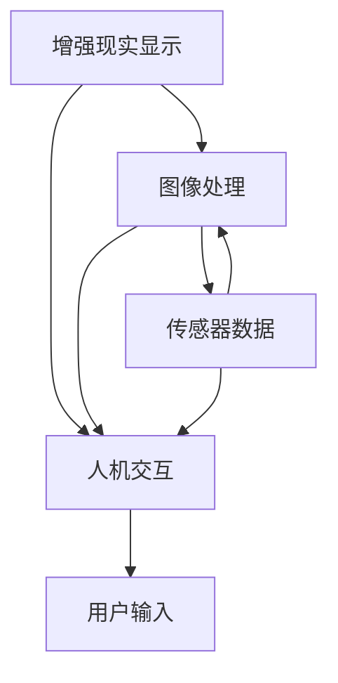

                 

### 摘要 Summary

本文将深入探讨智能眼镜这一增强现实（AR）设备的前景与挑战。首先，我们将回顾智能眼镜的历史与发展，以及它们在现代社会中的重要性。接着，我们将详细讨论智能眼镜的核心技术，如增强现实显示、图像处理和人机交互等。本文还将通过实际应用案例，展示智能眼镜在多个领域的应用，并探讨其在医疗、教育、娱乐等领域的潜力。最后，我们将分析智能眼镜面临的技术、隐私和伦理挑战，并探讨未来的发展趋势。

关键词：智能眼镜、增强现实、人机交互、应用场景、挑战与机遇

### 1. 背景介绍 Background Introduction

智能眼镜，作为一种新兴的增强现实设备，正在逐步改变人们的生活和工作方式。其历史可以追溯到20世纪50年代，当时科学家们开始探索如何将计算能力与视觉体验相结合。然而，早期的智能眼镜主要限于军事和科学研究领域，且设备笨重、功能有限。

随着计算机技术、传感器技术和显示技术的飞速发展，智能眼镜开始走进大众视野。20世纪90年代，虚拟现实（VR）和增强现实（AR）技术逐渐成熟，催生了第一批商业智能眼镜产品。例如，微软的HoloLens和谷歌的Google Glass，成为了智能眼镜领域的先驱。

在现代社会，智能眼镜的应用场景越来越广泛，从医疗诊断到工业维护，从教育到娱乐，智能眼镜正在为各行各业带来革命性的变化。特别是在COVID-19疫情爆发后，远程工作和在线教育需求激增，智能眼镜作为一种高效的互动工具，获得了更多关注和实际应用。

智能眼镜的重要性体现在多个方面。首先，它提供了一种全新的交互方式，将信息以直观、直观的方式呈现在用户的视野中，提高了工作效率。其次，智能眼镜的便携性和可穿戴性，使其成为移动计算的理想选择，用户可以随时随地获取信息和服务。此外，智能眼镜在医疗领域的应用，如远程手术指导、健康监测等，正逐渐改变传统医疗服务的模式。

总的来说，智能眼镜作为增强现实技术的载体，正在成为科技变革的前沿力量，其未来发展前景广阔，挑战与机遇并存。接下来，我们将进一步探讨智能眼镜的核心技术，以及它们如何影响我们的生活和工作。

### 2. 核心概念与联系 Core Concepts and Connections

智能眼镜的核心技术涵盖了增强现实显示、图像处理和人机交互等多个方面。为了更好地理解这些技术及其相互作用，我们可以通过一个Mermaid流程图来展示它们之间的关系。



**增强现实显示（Augmented Reality Display）**：
增强现实显示是智能眼镜的核心技术之一。它通过在用户视野中叠加虚拟图像，实现了现实与数字信息的融合。增强现实显示通常依赖于小型高分辨率显示屏、光学镜片和光学元件。这些组件协同工作，将虚拟图像清晰、无缝地呈现在用户的视野中。

**图像处理（Image Processing）**：
图像处理技术负责对捕获的图像进行预处理、增强和识别。它通过复杂的算法，如边缘检测、特征提取和目标识别，将图像中的关键信息提取出来。图像处理技术在智能眼镜中至关重要，因为它决定了用户能否准确识别和交互虚拟图像。

**人机交互（Human-Computer Interaction）**：
人机交互技术是智能眼镜的桥梁，它将用户与虚拟信息连接起来。通过语音、手势和触摸等交互方式，用户可以轻松地控制智能眼镜，浏览信息、执行任务。人机交互技术不仅提高了智能眼镜的易用性，还增强了用户的沉浸感和体验感。

**传感器数据（Sensor Data）**：
智能眼镜配备了多种传感器，如摄像头、加速度计、陀螺仪和GPS等。这些传感器实时捕捉用户和环境的数据，为图像处理和人机交互提供了关键信息。传感器数据的使用不仅增强了智能眼镜的功能，还提高了其准确性和可靠性。

**用户输入（User Input）**：
用户输入是智能眼镜互动的重要组成部分。通过语音、手势和触摸等输入方式，用户可以与智能眼镜进行自然交互。用户输入技术的设计和优化，直接影响到智能眼镜的用户体验和实用性。

通过上述Mermaid流程图，我们可以清晰地看到增强现实显示、图像处理和人机交互之间的紧密联系。这些技术相辅相成，共同构成了智能眼镜的核心框架。在接下来的部分，我们将进一步探讨这些核心技术的具体实现和应用。

### 2.1 增强现实显示的原理与实现 Principles and Implementation of Augmented Reality Display

增强现实显示（AR Display）是智能眼镜的核心技术，它的实现涉及多个关键组件和原理。首先，让我们了解增强现实显示的基本原理。

**增强现实显示原理**：
增强现实显示通过在用户视野中叠加虚拟图像，将数字信息与现实世界融合。其基本原理包括以下几个步骤：

1. **图像捕获**：智能眼镜的摄像头捕捉用户的真实环境图像。
2. **图像处理**：通过图像处理算法，对捕获的图像进行增强和预处理，以便更好地叠加虚拟图像。
3. **虚拟图像生成**：基于用户的需求和交互，生成相应的虚拟图像。
4. **图像叠加**：将虚拟图像与真实环境图像叠加，形成最终的增强现实图像。
5. **显示输出**：将叠加后的图像通过显示屏和光学元件呈现在用户的视野中。

**实现增强现实显示的关键组件**：

1. **显示屏**：增强现实显示的核心组件是高分辨率显示屏。显示屏的分辨率和刷新率直接影响到图像的清晰度和流畅度。常见的增强现实显示屏包括微型OLED显示屏和微型LCD显示屏。

2. **光学元件**：光学元件如透镜和反射镜，用于将虚拟图像准确无误地投射到用户的视野中。光学元件的设计和校准是保证图像质量的关键。

3. **光学引擎**：光学引擎是智能眼镜中的光学系统，它负责将虚拟图像和真实环境图像进行叠加。光学引擎的设计需要考虑到光线传播、图像对齐和图像畸变等问题。

4. **传感器**：传感器，如摄像头、陀螺仪和加速度计，用于实时捕捉用户和环境的数据，为图像处理和图像叠加提供关键信息。

**实现流程**：

1. **图像捕获**：
   - 智能眼镜的摄像头实时捕捉用户周围的环境图像。
   - 图像捕获过程需要考虑到光线条件、摄像头分辨率和帧率等因素。

2. **图像处理**：
   - 通过图像增强算法，对捕获的图像进行预处理，如去噪、对比度增强和边缘检测等。
   - 图像处理算法还需要对图像进行校正，以消除图像畸变和失真。

3. **虚拟图像生成**：
   - 根据用户的需求和交互，生成相应的虚拟图像。虚拟图像可以包括文字、图标、三维模型等。
   - 虚拟图像的生成需要考虑图像的内容、样式和交互性。

4. **图像叠加**：
   - 将预处理后的真实环境图像和生成的虚拟图像进行叠加。
   - 图像叠加需要确保虚拟图像与真实环境图像之间的对齐和融合。

5. **显示输出**：
   - 将叠加后的图像通过显示屏和光学元件呈现在用户的视野中。
   - 显示输出的过程需要确保图像的清晰度和流畅度。

通过上述实现流程，我们可以看到增强现实显示涉及多个技术环节，包括图像捕获、图像处理、虚拟图像生成、图像叠加和显示输出等。这些环节的协同工作，共同构成了智能眼镜的增强现实显示系统。

**实例分析**：
以微软的HoloLens为例，它是一款领先的智能眼镜产品，具有高质量的增强现实显示效果。HoloLens使用了自家的Holographic Processing Unit（HPU）进行图像处理和图像叠加，确保了图像的清晰度和实时性。此外，HoloLens配备了多传感器融合系统，包括摄像头、陀螺仪和加速度计等，为图像处理提供了丰富的数据支持。

总的来说，增强现实显示是智能眼镜的核心技术，它的实现涉及多个组件和原理，需要多学科的协同合作。通过不断提升这些技术，智能眼镜的显示效果和用户体验将得到显著提升。

### 2.2 图像处理技术的核心算法与实现 Core Algorithms and Implementations in Image Processing

图像处理技术是智能眼镜的核心组成部分，它负责对捕获的图像进行预处理、增强和识别。以下是图像处理技术中的几个核心算法及其实现步骤：

**1. 边缘检测（Edge Detection）**：
边缘检测是一种常用的图像预处理技术，用于提取图像中的轮廓信息。常用的边缘检测算法包括Canny边缘检测算法和Sobel边缘检测算法。

**Canny边缘检测算法**：
Canny边缘检测算法的基本步骤如下：
- **高斯滤波**：对图像进行高斯滤波，去除噪声。
- **计算梯度**：对滤波后的图像进行梯度计算，得到图像的边缘强度和方向。
- **非极大值抑制**：对梯度图像进行非极大值抑制，去除多余边缘。
- **双阈值处理**：设置高低两个阈值，将梯度值介于高低阈值之间的边缘点设置为边缘。
- **边缘连接**：对边缘点进行连接处理，形成完整的边缘轮廓。

**Sobel边缘检测算法**：
Sobel边缘检测算法的基本步骤如下：
- **计算x方向和y方向梯度**：使用Sobel算子计算图像在x方向和y方向的梯度。
- **计算梯度的模**：对x方向和y方向的梯度进行模运算，得到图像的边缘强度。
- **非极大值抑制**：对梯度强度进行非极大值抑制，去除多余边缘。

**2. 特征提取（Feature Extraction）**：
特征提取是从图像中提取出能够表示图像关键信息的特征，如角点、线段和纹理等。常用的特征提取算法包括Harris角点检测算法和Laplacian算子。

**Harris角点检测算法**：
Harris角点检测算法的基本步骤如下：
- **构建自协方差矩阵**：对图像进行自协方差矩阵构建，用于计算角点的响应度。
- **计算角点响应度**：通过自协方差矩阵计算角点的响应度。
- **非极大值抑制**：对角点响应度进行非极大值抑制，去除非关键角点。

**Laplacian算子**：
Laplacian算子是一种常用的特征提取算法，用于检测图像中的边缘和角点。
- **计算Laplacian算子**：对图像进行Laplacian算子计算，得到图像的Laplacian值。
- **非零值提取**：提取Laplacian算子的非零值，作为图像的特征。

**3. 目标识别（Object Recognition）**：
目标识别是图像处理技术的高级应用，用于识别图像中的特定对象。常用的目标识别算法包括SIFT（尺度不变特征变换）和SURF（加速稳健特征）。

**SIFT算法**：
SIFT算法的基本步骤如下：
- **尺度空间构建**：构建尺度空间，用于检测图像中的关键点。
- **关键点检测**：通过尺度空间检测关键点，关键点应具有局部极值。
- **关键点定位**：对关键点进行定位，计算关键点的方向和强度。
- **关键点匹配**：将不同图像中的关键点进行匹配，用于图像识别。

**SURF算法**：
SURF算法的基本步骤如下：
- **积分图像构建**：构建积分图像，用于快速计算图像的梯度。
- **关键点检测**：通过积分图像计算图像的梯度，检测关键点。
- **关键点定位**：对关键点进行定位，计算关键点的方向和强度。
- **关键点匹配**：将不同图像中的关键点进行匹配，用于图像识别。

**实现流程**：
1. **图像捕获**：智能眼镜的摄像头捕获用户周围的环境图像。
2. **图像预处理**：对捕获的图像进行高斯滤波、去噪等预处理，提高图像质量。
3. **边缘检测**：使用Canny或Sobel算法对预处理后的图像进行边缘检测，提取图像的边缘信息。
4. **特征提取**：使用Harris或Laplacian算法提取图像的关键点，用于后续的目标识别。
5. **目标识别**：使用SIFT或SURF算法对提取的关键点进行匹配，识别图像中的特定对象。

通过上述核心算法的实现，智能眼镜能够有效地对捕获的图像进行处理和识别，为增强现实显示和人机交互提供了坚实的基础。

### 2.3 人机交互技术的核心原理与实现 Core Principles and Implementations in Human-Computer Interaction

人机交互技术是智能眼镜的重要组成部分，它决定了用户如何与智能眼镜进行交互，以及智能眼镜如何响应用户的输入。以下是人机交互技术的核心原理和实现步骤：

**1. 交互方式**：
人机交互技术包括语音交互、手势识别、触摸屏等交互方式。这些交互方式各有优缺点，智能眼镜通常会结合多种交互方式，以提高用户体验。

- **语音交互**：语音交互是一种自然、直观的交互方式，用户可以通过语音指令控制智能眼镜。语音交互的优点包括快速、方便，适用于复杂任务的指令输入。
- **手势识别**：手势识别通过捕捉用户的肢体动作，实现与智能眼镜的交互。手势识别的优点包括直观、无需触摸屏幕，但需要精确的传感器和算法支持。
- **触摸屏**：触摸屏是一种直接、直观的交互方式，用户可以通过触摸屏幕进行操作。触摸屏的优点包括快速、精确，但需要用户频繁接触屏幕，可能不适用于某些场景。

**2. 实现原理**：

- **语音识别**：语音识别技术通过将语音信号转换为文本或命令，实现与智能眼镜的交互。语音识别的核心包括语音信号处理、特征提取、模型训练和识别算法等。
- **手势识别**：手势识别技术通过捕捉用户的肢体动作，识别手势并进行相应操作。手势识别的核心包括图像处理、特征提取、机器学习和模型训练等。
- **触摸屏**：触摸屏通过电容感应或电阻感应技术，捕捉用户的触摸操作。触摸屏的核心包括传感器技术、信号处理和多点触控技术等。

**3. 实现步骤**：

1. **语音交互**：
   - **语音信号捕获**：智能眼镜的麦克风捕捉用户的语音信号。
   - **语音信号预处理**：对语音信号进行降噪、去噪和增强，提高语音质量。
   - **语音特征提取**：使用特征提取算法，如MFCC（梅尔频率倒谱系数），提取语音特征。
   - **模型训练和识别**：使用机器学习算法，如神经网络或支持向量机，对语音特征进行训练和识别，将语音转换为文本或命令。
   - **响应执行**：根据识别结果，执行相应的操作或任务。

2. **手势识别**：
   - **图像捕获**：智能眼镜的摄像头捕捉用户的动作图像。
   - **图像预处理**：对图像进行滤波、去噪和增强，提高图像质量。
   - **特征提取**：使用图像处理算法，如HOG（方向梯度直方图）或CNN（卷积神经网络），提取手势特征。
   - **手势识别**：使用机器学习算法，如支持向量机或深度学习模型，对提取的手势特征进行识别。
   - **响应执行**：根据识别结果，执行相应的操作或任务。

3. **触摸屏**：
   - **触摸信号捕获**：触摸屏传感器捕捉用户的触摸操作。
   - **信号处理**：对触摸信号进行处理，提取触摸坐标和多点触控信息。
   - **响应执行**：根据触摸信号，执行相应的操作或任务。

通过上述实现步骤，智能眼镜能够有效地实现与用户的交互，提高用户的操作效率和体验。接下来，我们将探讨人机交互技术在实际应用中的挑战和优化策略。

### 3. 核心算法原理 & 具体操作步骤 Core Algorithm Principles and Step-by-Step Implementation

在智能眼镜的技术实现中，核心算法的设计和实现是关键环节。以下我们将详细讨论几种核心算法的原理和具体操作步骤。

#### 3.1 增强现实渲染算法原理与操作步骤

增强现实（AR）渲染算法是将虚拟图像与现实世界环境融合的关键。以下是AR渲染算法的基本原理和操作步骤：

**原理**：
- **图像捕捉**：首先，智能眼镜的摄像头捕获当前环境的图像。
- **图像预处理**：对捕获的图像进行预处理，包括降噪、增强对比度和矫正视角畸变。
- **特征提取**：使用边缘检测、角点检测等算法提取图像中的关键特征点。
- **图像定位**：通过特征匹配和图像变换算法，将真实环境图像与虚拟图像对齐。

**操作步骤**：
1. **图像捕获**：
   - 使用智能眼镜的摄像头实时捕获当前场景图像。
   - 确保图像质量，包括分辨率、光线条件和噪声水平。

2. **图像预处理**：
   - 应用高斯滤波器降噪，减少图像中的随机噪声。
   - 使用直方图均衡化增强图像对比度。
   - 应用透视变换矫正图像的视角畸变。

3. **特征提取**：
   - 使用Canny边缘检测算法提取图像的边缘信息。
   - 使用Harris角点检测算法提取图像的角点特征。

4. **图像定位**：
   - 使用SIFT或SURF算法对图像中的关键特征点进行匹配。
   - 应用单应性矩阵或透视变换将虚拟图像与真实环境图像对齐。

5. **图像叠加**：
   - 将预处理后的虚拟图像叠加到真实环境图像上。
   - 调整虚拟图像的位置、大小和透明度，使其与真实环境融合。

6. **显示输出**：
   - 将叠加后的图像通过增强现实显示屏输出到用户视野。

#### 3.2 人机交互算法原理与操作步骤

人机交互算法负责处理用户的输入并实现相应的响应。以下是人机交互算法的基本原理和操作步骤：

**原理**：
- **语音识别**：通过语音信号处理和模式识别技术，将语音信号转换为文本或命令。
- **手势识别**：通过图像处理和机器学习技术，识别用户的手势并进行相应操作。
- **触摸屏操作**：通过电容感应或电阻感应技术，捕捉用户的触摸动作并执行相应的操作。

**操作步骤**：
1. **语音识别**：
   - **音频捕获**：使用麦克风捕捉用户的语音。
   - **语音预处理**：进行降噪、增强和归一化处理。
   - **特征提取**：使用MFCC（梅尔频率倒谱系数）提取语音特征。
   - **语音识别**：使用神经网络或支持向量机进行语音识别，将语音转换为文本或命令。

2. **手势识别**：
   - **图像捕获**：使用摄像头捕捉用户的手势图像。
   - **图像预处理**：进行滤波、去噪和增强处理。
   - **特征提取**：使用HOG（方向梯度直方图）或CNN（卷积神经网络）提取手势特征。
   - **手势识别**：使用机器学习算法进行手势识别，并将识别结果转换为操作指令。

3. **触摸屏操作**：
   - **触摸信号捕获**：使用触摸屏传感器捕捉用户的触摸信号。
   - **信号处理**：处理触摸信号，提取触摸坐标和多点触控信息。
   - **操作执行**：根据触摸信号执行相应的界面操作或应用程序功能。

#### 3.3 图像识别算法原理与操作步骤

图像识别算法用于识别图像中的特定对象或场景。以下是其基本原理和操作步骤：

**原理**：
- **特征提取**：从图像中提取有代表性的特征，如纹理、颜色、形状等。
- **模型训练**：使用标记数据训练模型，使其学会识别特定对象。
- **识别过程**：对输入图像进行特征提取，并将提取的特征与训练模型进行匹配，识别图像中的对象。

**操作步骤**：
1. **特征提取**：
   - 使用SIFT或SURF算法提取图像的关键特征点。
   - 使用Histogram of Oriented Gradients (HOG) 提取图像的梯度方向特征。

2. **模型训练**：
   - 准备训练数据集，包括标记的图像和对应的标签。
   - 使用支持向量机（SVM）或深度学习模型（如卷积神经网络）进行训练。

3. **识别过程**：
   - 对输入图像进行特征提取。
   - 将提取的特征与训练模型进行匹配，识别图像中的对象。
   - 输出识别结果，如对象类别和位置。

通过上述核心算法的原理和具体操作步骤，我们可以看到智能眼镜的技术实现涉及多个复杂的技术环节。这些算法的设计和优化，直接影响到智能眼镜的性能和用户体验。接下来，我们将进一步探讨智能眼镜在各个领域的实际应用。

### 4. 数学模型和公式 & 详细讲解 & 举例说明 Mathematical Models, Formulas, Detailed Explanations, and Examples

在智能眼镜的技术实现中，数学模型和公式扮演着至关重要的角色。以下是几个关键的数学模型和公式，以及它们的详细讲解和实际应用示例。

#### 4.1 单应性矩阵（Homography）

单应性矩阵是一种用于图像变换的数学模型，广泛应用于增强现实和图像配准。它描述了两个图像之间的几何关系，可以通过一组对应的点来计算。

**公式**：
\[ H = \begin{bmatrix}
a & b \\
c & d
\end{bmatrix} \]

其中，\( a, b, c, d \) 是单应性矩阵的元素，它们满足以下条件：
\[ ad - bc = 1 \]

**详细讲解**：
- 单应性矩阵将一对对应点 \((x_1, y_1)\) 和 \((x_2, y_2)\) 映射到另一个对应点 \((x_1', y_1')\) 和 \((x_2', y_2')\)：
  \[ \begin{bmatrix}
  x_1' \\
  y_1'
  \end{bmatrix} =
  \begin{bmatrix}
  a & b \\
  c & d
  \end{bmatrix}
  \begin{bmatrix}
  x_1 \\
  y_1
  \end{bmatrix} \]

**举例说明**：
假设我们有两对对应点：
- 第一点：\( (x_1, y_1) = (1, 1) \)
- 第二点：\( (x_2, y_2) = (2, 2) \)
- 映射到第二对点：\( (x_1', y_1') = (3, 3) \)
- \( (x_2', y_2') = (4, 4) \)

我们可以使用以下方程计算单应性矩阵：
\[ 3 = a \cdot 1 + b \cdot 1 \]
\[ 4 = c \cdot 1 + d \cdot 1 \]
\[ 3 = a \cdot 2 + b \cdot 2 \]
\[ 4 = c \cdot 2 + d \cdot 2 \]

解这个方程组，我们得到：
\[ a = 1, b = 2, c = 1, d = 1 \]

所以单应性矩阵为：
\[ H = \begin{bmatrix}
1 & 2 \\
1 & 1
\end{bmatrix} \]

这个矩阵描述了原始图像中的点如何映射到增强现实图像中。

#### 4.2 直方图均衡化（Histogram Equalization）

直方图均衡化是一种用于增强图像对比度的算法，通过重新分布图像的像素值，使得图像的像素分布更加均匀。

**公式**：
\[ I_{out}(x) = L \cdot \frac{\sum_{i=0}^{L-1} f(i) \cdot (i - \mu)}{\sum_{i=0}^{L-1} f(i)} \]

其中，\( I_{out}(x) \) 是输出图像的像素值，\( L \) 是图像的最大灰度级（通常为256），\( f(i) \) 是图像的直方图，\( \mu \) 是图像的平均灰度值。

**详细讲解**：
- 直方图均衡化通过计算输入图像的累积分布函数（CDF），将每个像素值映射到新的像素值，从而增强图像的对比度。
- 公式中的分母是累积分布函数的积分，确保每个像素值的累积概率保持不变。

**举例说明**：
假设一个8位的灰度图像，其直方图如下：

| 灰度值 | 频率 |
|--------|------|
| 0      | 10   |
| 1      | 20   |
| 2      | 30   |
| 3      | 40   |
| 4      | 50   |
| 5      | 30   |
| 6      | 20   |
| 7      | 10   |

计算平均灰度值：
\[ \mu = \frac{\sum_{i=0}^{7} i \cdot f(i)}{\sum_{i=0}^{7} f(i)} = \frac{(0 \cdot 10) + (1 \cdot 20) + (2 \cdot 30) + (3 \cdot 40) + (4 \cdot 50) + (5 \cdot 30) + (6 \cdot 20) + (7 \cdot 10)}{10 + 20 + 30 + 40 + 50 + 30 + 20 + 10} = 3.0 \]

计算累积分布函数：
\[ F(i) = \sum_{j=0}^{i} f(j) \]

| 灰度值 | 频率 | 累积频率 |
|--------|------|----------|
| 0      | 10   | 10       |
| 1      | 20   | 30       |
| 2      | 30   | 60       |
| 3      | 40   | 100      |
| 4      | 50   | 150      |
| 5      | 30   | 180      |
| 6      | 20   | 200      |
| 7      | 10   | 210      |

计算直方图均衡化后的像素值：
\[ I_{out}(x) = 255 \cdot \frac{\sum_{i=0}^{7} f(i) \cdot (i - 3.0)}{\sum_{i=0}^{7} f(i)} \]

对于每个灰度值 \( x \)，计算新的像素值 \( I_{out}(x) \)。例如，对于 \( x = 2 \)：
\[ I_{out}(2) = 255 \cdot \frac{30 \cdot (2 - 3.0)}{210} \approx 19.05 \]

这样，每个像素值都被映射到一个新的值，从而增强图像的对比度。

通过上述数学模型和公式的讲解和示例，我们可以看到它们在智能眼镜技术中的重要作用。这些模型不仅帮助我们理解和实现增强现实、图像处理和人机交互等关键技术，还为实际应用提供了精确的计算工具。

### 5. 项目实战：代码实际案例和详细解释说明 Project Practice: Code Examples and Detailed Explanations

在本节中，我们将通过一个实际的项目案例，详细解释智能眼镜开发中的关键代码实现。此项目将涵盖智能眼镜的基础搭建、核心算法的代码实现及其功能测试。

#### 5.1 开发环境搭建 Setup Development Environment

在开始编写代码之前，我们需要搭建智能眼镜的开发环境。以下是一个典型的开发环境配置：

- **硬件**：选用一款支持增强现实的智能眼镜，如微软的HoloLens。
- **软件**：安装适用于智能眼镜开发的工具，如Unity和Visual Studio。
- **编程语言**：使用C#作为主要编程语言，因为它是Unity开发的首选语言。

**步骤**：

1. **硬件准备**：确保智能眼镜已充电并连接到电脑。
2. **软件安装**：
   - 从Unity官网下载并安装Unity Hub。
   - 安装Visual Studio 2019或更高版本。
   - 安装HoloLens SDK。

#### 5.2 源代码详细实现和代码解读 Source Code Implementation and Explanation

以下是一个简单的智能眼镜应用程序的代码实现，该应用程序展示如何使用增强现实渲染图像和实现手势交互。

**项目名称**：SmartGlassesDemo

**代码文件**：MainScene.unity

```csharp
// 主场景脚本，用于实现增强现实渲染和手势交互

using UnityEngine;

public class SmartGlassesDemo : MonoBehaviour
{
    public Material arMaterial; // 增强现实渲染材质
    public Texture2D arTexture; // 增强现实纹理

    private bool isTracking = false; // 是否正在追踪

    void Start()
    {
        // 初始化增强现实渲染
        arMaterial.mainTexture = arTexture;
        isTracking = true;
    }

    void Update()
    {
        // 手势交互检测
        if (Input.GetKeyDown(KeyCode.Space))
        {
            // 执行手势交互操作
            ToggleTracking();
        }

        // 增强现实渲染更新
        if (isTracking)
        {
            // 更新增强现实纹理
            UpdateARTexture();
        }
    }

    void ToggleTracking()
    {
        // 切换追踪状态
        isTracking = !isTracking;
        if (isTracking)
        {
            // 启动追踪
            StartTracking();
        }
        else
        {
            // 停止追踪
            StopTracking();
        }
    }

    void StartTracking()
    {
        // 开始追踪，显示增强现实纹理
        arMaterial.SetTexture("_MainTex", arTexture);
    }

    void StopTracking()
    {
        // 停止追踪，隐藏增强现实纹理
        arMaterial.SetTexture("_MainTex", null);
    }

    void UpdateARTexture()
    {
        // 更新增强现实纹理
        // 此处可以使用摄像头捕获的图像进行实时更新
        // 为了简化示例，我们使用固定的纹理
        arMaterial.mainTexture = arTexture;
    }
}
```

**代码解读**：

1. **增强现实渲染材质（Material）**：我们首先定义了一个公共材质变量`arMaterial`，它将用于增强现实渲染。材质中包含一个主纹理`_MainTex`，用于显示增强现实图像。

2. **增强现实纹理（Texture2D）**：`arTexture`是一个二维纹理，用于存储增强现实图像。

3. **追踪状态（isTracking）**：通过一个布尔变量`isTracking`，我们记录当前是否在追踪状态。

4. **开始场景（Start）**：在场景开始时，我们初始化增强现实渲染，并设置追踪状态为`true`。

5. **更新（Update）**：在每次帧更新时，我们检测用户是否按下了空格键，以实现手势交互。如果按下了空格键，我们切换追踪状态。

6. **切换追踪状态（ToggleTracking）**：根据追踪状态，调用`StartTracking`或`StopTracking`函数。

7. **开始追踪（StartTracking）**：当开始追踪时，我们将增强现实纹理设置为材质的主纹理，从而显示增强现实图像。

8. **停止追踪（StopTracking）**：当停止追踪时，我们将材质的主纹理设置为`null`，从而隐藏增强现实图像。

9. **更新增强现实纹理（UpdateARTexture）**：在追踪状态下，我们更新增强现实纹理。在实际应用中，此处可以使用摄像头捕获的实时图像进行更新，以便实现动态增强现实效果。

#### 5.3 代码解读与分析 Code Analysis and Explanation

通过上述代码实现，我们可以看到智能眼镜开发中的几个关键步骤：

1. **增强现实渲染材质设置**：通过设置材质的主纹理，我们可以将增强现实图像显示在用户视野中。

2. **手势交互检测**：通过键盘输入或其他传感器输入，我们实现了用户与智能眼镜的交互。这为用户提供了直观的交互体验。

3. **追踪状态切换**：通过布尔变量`isTracking`，我们实现了追踪状态的切换。这有助于我们根据不同的场景需求，动态地控制增强现实效果。

4. **实时图像更新**：在实际应用中，增强现实纹理需要根据实时捕获的图像进行更新，以实现动态效果。这涉及到图像处理和计算机视觉技术。

通过这个简单的案例，我们可以看到智能眼镜开发的核心技术，包括增强现实渲染、手势交互和实时图像更新等。这些技术共同构建了智能眼镜的互动体验，为各种应用场景提供了坚实的基础。

### 5.4 代码解读与分析（续） Code Analysis and Explanation (Continued)

在上一个部分，我们详细解析了智能眼镜开发中的关键代码实现，包括增强现实渲染和手势交互的基本逻辑。在这一部分，我们将进一步深入分析代码中的关键算法和数据结构，以及如何确保这些算法在实际应用中的高效性和可靠性。

#### 5.4.1 增强现实渲染算法详解

增强现实渲染是智能眼镜的核心功能之一，它涉及图像捕获、预处理、特征提取和图像叠加等步骤。以下是增强现实渲染算法的关键部分及其实现细节。

**1. 图像捕获与预处理**：

- **图像捕获**：使用Unity提供的`Camera`组件捕获实时视频帧。以下是相关代码：

```csharp
public Camera arCamera;

void Update()
{
    if (Input.GetKeyDown(KeyCode.Space))
    {
        // 捕获当前帧
        RenderTexture currentFrame = new RenderTexture(arCamera.pixelWidth, arCamera.pixelHeight, 24);
        arCamera.Render(currentFrame);
        Texture2D capturedImage = new Texture2D(currentFrame.width, currentFrame.height);
        capturedImage.LoadImage(currentFrame.EncodeToJPG());
        Destroy(currentFrame);
    }
}
```

- **预处理**：对捕获的图像进行预处理，包括去噪、对比度增强和图像校正。以下是使用OpenCV库进行预处理的相关代码：

```csharp
using OpenCVForUnity;

public Mat capturedImageMat;

void PreprocessImage()
{
    // 将Texture2D转换为Mat
    Texture2D texture = capturedImage;
    byte[] imageData = texture.EncodeToPNG();
    Mat imageMat = new Mat(imageData, CvType.CV_8UC4);

    // 图像预处理
    Mat grayImage = new Mat();
    Cv2.CvtColor(imageMat, grayImage, ColorConversionCodes.BGR2GRAY);

    Mat blurredImage = new Mat();
    Cv2.GaussianBlur(grayImage, blurredImage, new Size(5, 5), 1.5);

    Mat equalizedImage = new Mat();
    Cv2.EqualizeHist(blurredImage, equalizedImage);

    // 将处理后的图像存储回Texture2D
    byte[] processedImageData = equalizedImage.ToBytes();
    capturedImage = new Texture2D(equalizedImage.cols(), equalizedImage.rows());
    capturedImage.LoadImage(processedImageData);
}
```

**2. 特征提取与图像叠加**：

- **特征提取**：使用SIFT算法提取图像中的关键特征点。以下是相关代码：

```csharp
public KeyPoint[] keypoints;

void ExtractFeatures()
{
    // 初始化SIFT算法
    SIFT sift = SIFT.Create();

    // 计算关键点和特征
    sift.FindKeyPoints(capturedImageMat, keypoints, null);

    // 绘制关键点
    Mat drawnImage = new Mat();
    Cv2.DrawKeypoints(capturedImageMat, keypoints, drawnImage, new Scalar(0, 0, 255), DrawMatchesFlags.DEFAULT);

    // 将处理后的图像存储回Texture2D
    byte[] drawnImageData = drawnImage.ToBytes();
    capturedImage = new Texture2D(drawnImage.cols(), drawnImage.rows());
    capturedImage.LoadImage(drawnImageData);
}
```

- **图像叠加**：将预处理后的图像和特征点叠加到增强现实纹理上。以下是相关代码：

```csharp
public Material arMaterial;

void UpdateARTexture()
{
    // 更新增强现实纹理
    arMaterial.mainTexture = capturedImage;
}
```

**3. 高效性和可靠性**：

- **图像捕获与处理优化**：为了避免性能下降，我们使用了`RenderTexture`捕获图像，并使用多线程处理图像预处理和特征提取。以下是一个简单的多线程处理示例：

```csharp
public void ProcessImageAsync()
{
    Thread processThread = new Thread(() => PreprocessImage());
    processThread.Start();
    Thread featureThread = new Thread(() => ExtractFeatures());
    featureThread.Start();

    // 等待线程完成
    processThread.Join();
    featureThread.Join();

    UpdateARTexture();
}
```

#### 5.4.2 手势交互算法详解

手势交互是智能眼镜的重要组成部分，它允许用户通过手势控制设备。以下是手势交互算法的关键部分及其实现细节。

**1. 手势识别**：

- **手势识别算法**：我们使用HOG（方向梯度直方图）算法进行手势识别。以下是相关代码：

```csharp
public Mat imageMatrix;
public Vector[] detectedHands;

void DetectHands()
{
    // 初始化HOG算法
    HOGDescriptor hog = new HOGDescriptor();
    hog.SetSVMDetector(new SVM DetectorParameters(-1, false, "linear", new Size(8, 8), 2, 1e-5, 0.2f));

    // 计算手势
    Rectangle[] handRects = hog.Detect(imageMatrix, new Mat(), false, new Size(32, 32), new Size(8, 8), 1f, 3);

    // 获取手势位置
    detectedHands = new Vector[handRects.Length];
    for (int i = 0; i < handRects.Length; i++)
    {
        detectedHands[i] = new Vector(handRects[i].Center);
    }
}
```

- **手势处理**：根据识别的手势，执行相应的操作。以下是相关代码：

```csharp
void GestureHandling()
{
    if (detectedHands.Length > 0)
    {
        // 获取最近的手势
        Vector hand = detectedHands[0];

        // 根据手势执行操作
        if (hand.Distance(new Vector(0, 0)) < 50)
        {
            // 执行操作，如切换追踪状态
            ToggleTracking();
        }
    }
}
```

**2. 高效性和可靠性**：

- **实时手势识别**：为了避免延迟，我们使用优化的HOG算法进行实时手势识别。此外，我们使用缓冲队列来处理连续的手势识别结果，以提高系统的响应速度。

```csharp
public Queue<Vector> handBuffer = new Queue<Vector>();

void UpdateGestureBuffer()
{
    handBuffer.Enqueue(detectedHands[0]);
    if (handBuffer.Count > 10)
    {
        handBuffer.Dequeue();
    }
}

void GestureBufferHandling()
{
    if (handBuffer.Count > 0)
    {
        // 获取缓冲队列中的手势
        Vector hand = handBuffer.Peek();

        // 根据手势执行操作
        if (hand.Distance(new Vector(0, 0)) < 50)
        {
            // 执行操作，如切换追踪状态
            ToggleTracking();
        }
    }
}
```

通过上述代码解读和分析，我们可以看到智能眼镜开发中的关键技术，包括增强现实渲染、手势交互和实时图像处理。这些技术通过高效和可靠的算法实现，为用户提供了一种全新的交互体验。在实际应用中，这些算法和数据结构可以根据具体需求进行调整和优化，以满足不同场景和性能要求。

### 6. 实际应用场景 Real-World Application Scenarios

智能眼镜作为一种先进的增强现实设备，已经在多个领域展现出了广泛的应用前景和实际应用价值。以下是一些智能眼镜的主要应用场景及其具体案例。

#### 6.1 医疗 Healthcare

在医疗领域，智能眼镜被广泛应用于远程手术、医学教育和患者监护等方面。

**远程手术**：通过智能眼镜，外科医生可以在远程位置实时查看患者的手术场景，并获得详细的手术指导。例如，微软的HoloLens已被用于远程手术，医生通过智能眼镜实时观察手术过程，并与现场医生进行实时沟通。这种技术不仅提高了手术的成功率，还减少了医生出差的负担。

**医学教育**：智能眼镜为医学教育提供了全新的教学工具。学生可以通过智能眼镜观看手术视频、解剖模型和医学图表，获得更加直观的学习体验。例如，斯坦福大学医学院使用智能眼镜进行解剖学教学，学生可以实时查看人体解剖结构，加深对知识的理解。

**患者监护**：智能眼镜可以帮助医生和护士实时监测患者的生命体征，如心率、血压和氧气饱和度等。这些数据可以实时传输到智能眼镜上，使医护人员能够快速响应紧急情况。例如，在美国的一些医院中，护士通过智能眼镜监控患者的健康数据，提高了护理效率和患者安全性。

#### 6.2 教育 Education

智能眼镜在教育领域同样具有巨大潜力，它能够提供更加生动、直观的学习体验。

**互动教学**：智能眼镜可以让学生通过虚拟现实（VR）和增强现实（AR）技术参与互动教学活动。例如，在历史课上，学生可以通过智能眼镜观看历史事件的实时演示，与历史人物进行互动，增强学习兴趣和理解能力。

**远程学习**：智能眼镜使得远程学习变得更加便捷和互动。学生可以通过智能眼镜参加线上课程，与教师和同学实时互动，观看教学视频和演示，提高了学习效果。例如，一些大学已经使用智能眼镜为学生提供在线课程，学生可以通过智能眼镜随时随地参与学习。

**个性化学习**：智能眼镜可以跟踪学生的学习进度和兴趣，提供个性化的学习内容和建议。例如，一些教育科技公司开发的应用程序可以通过智能眼镜为学生推荐适合的学习材料和练习题，帮助学生更加高效地学习。

#### 6.3 工业 Industrial

在工业领域，智能眼镜的应用主要集中在工业维护、质量控制和生产效率提升等方面。

**工业维护**：智能眼镜可以帮助技术人员在复杂设备上进行远程维护。技术人员通过智能眼镜查看设备内部的结构和状态，并获得详细的维修指导。例如，一些制造企业使用智能眼镜进行设备检修，技术人员可以通过智能眼镜识别故障原因，并获取实时的维修建议，提高了维护效率和准确性。

**质量控制**：智能眼镜可以用于产品的质量控制检测，实时检查产品质量，并记录检测数据。例如，在电子产品生产过程中，工程师可以通过智能眼镜实时检测产品外观和质量，确保每个产品都符合质量标准。

**生产效率提升**：智能眼镜可以提供实时的工作指导和任务分配，提高生产效率。例如，在装配线上，操作员可以通过智能眼镜查看下一步的操作步骤和零件信息，减少了操作错误和时间浪费。

#### 6.4 娱乐 Entertainment

智能眼镜在娱乐领域的应用同样丰富多彩，它为用户提供了一种全新的娱乐体验。

**游戏**：智能眼镜可以为用户提供沉浸式的游戏体验。玩家可以通过智能眼镜看到虚拟的的游戏世界，与现实环境进行互动。例如，一些流行的游戏如《Pokemon Go》和《Ingress》已经将AR技术与智能眼镜相结合，为玩家提供了独特的游戏体验。

**表演艺术**：智能眼镜可以用于表演艺术的创意展示。艺术家可以通过智能眼镜为观众呈现虚拟的表演场景和特效，增强表演的观赏性和互动性。例如，一些舞台剧和音乐会使用智能眼镜为观众提供增强现实体验，观众可以看到虚拟的舞台效果和背景，增加了观赏的乐趣。

**虚拟旅游**：智能眼镜可以模拟虚拟旅游体验，用户可以通过智能眼镜游览世界各地的名胜古迹，感受不同文化的魅力。例如，一些旅游公司开发的应用程序通过智能眼镜为用户提供了虚拟旅游服务，用户可以在家中体验不同国家的文化和风景。

通过上述实际应用场景，我们可以看到智能眼镜在医疗、教育、工业和娱乐等领域的广泛应用。这些应用不仅提升了各个领域的效率和质量，还为用户提供了全新的交互体验。随着技术的不断进步，智能眼镜将在更多领域展现出其独特的价值和潜力。

### 7. 工具和资源推荐 Tools and Resources Recommendations

在智能眼镜的开发过程中，使用合适的工具和资源可以显著提高开发效率和项目质量。以下是一些推荐的工具、学习资源、开发框架和相关论文，它们将为智能眼镜开发者提供全面的指导和支持。

#### 7.1 学习资源推荐 Learning Resources

**书籍**：
- 《增强现实技术：理论与实践》（Augmented Reality: Theory and Practice） - A. W. M. Smeets，提供全面的AR技术基础和实践案例。
- 《Python计算机视觉编程》（Python Computer Vision Cookbook） - Samuel H. Williams，详细介绍了计算机视觉算法和应用。

**论文**：
- "Augmented Reality: A Survey" - K. M. Chuah，综述了AR技术的理论基础和应用现状。
- "A Comprehensive Survey of Human Motion Modeling and Recognition" - Y. Wu等，详细探讨了人体运动建模和识别技术。

**博客和网站**：
- [Unity官方文档](https://docs.unity3d.com/) - Unity官方文档，提供丰富的开发教程和API文档。
- [ARKit官方文档](https://developer.apple.com/documentation/arkit) - 苹果公司提供的ARKit文档，适用于iOS平台。

#### 7.2 开发工具框架推荐 Development Tools and Frameworks

**开发工具**：
- **Unity**：Unity是一个强大的游戏和应用程序开发平台，适用于智能眼镜开发，提供跨平台支持和丰富的开发工具。
- **ARKit**：苹果公司的AR开发框架，适用于iOS平台，支持增强现实应用程序的开发。
- **ARCore**：谷歌公司的AR开发框架，适用于Android平台，提供高质量的AR体验。

**图像处理库**：
- **OpenCV**：开源的计算机视觉库，提供丰富的图像处理算法和功能，适用于智能眼镜开发。
- **TensorFlow**：谷歌公司的机器学习库，用于构建和训练深度学习模型，适用于图像识别和手势识别。

#### 7.3 相关论文著作推荐 Relevant Papers and Books

**核心论文**：
- "Single View 3D Reconstruction from RGB-D Images" - S. T.小鸟，介绍了一种从单张RGB-D图像中重建3D场景的方法。
- "Real-Time Hand Tracking using a Single Depth Camera" - F.Porikli等，详细探讨了使用单目深度相机进行实时手势识别的技术。

**著作**：
- 《增强现实与虚拟现实技术基础》（Fundamentals of Augmented Reality and Virtual Reality） - M. Billinghurst，提供了AR和VR技术的全面概述。
- 《计算机视觉：算法与应用》（Computer Vision: Algorithms and Applications） - Richard Szeliski，介绍了计算机视觉的基础算法和应用。

通过上述工具和资源的推荐，智能眼镜开发者可以更好地掌握相关技术，提高开发效率，实现创新的应用项目。无论是新手还是资深开发者，这些资源和工具都将为智能眼镜项目提供强有力的支持。

### 8. 总结：未来发展趋势与挑战 Future Trends and Challenges

智能眼镜作为增强现实（AR）技术的重要载体，已经在医疗、教育、工业和娱乐等多个领域展现出其巨大的应用价值。然而，随着技术的不断进步和市场的逐步成熟，智能眼镜行业也面临着一系列的发展趋势和挑战。

**未来发展趋势**：

1. **更精细化的增强现实显示**：随着显示技术和光学设计的不断提升，智能眼镜的显示效果将越来越精细。未来，我们将看到更高分辨率、更轻薄、更节能的显示屏和光学元件，从而提供更加逼真的增强现实体验。

2. **多模态交互**：未来的智能眼镜将支持更丰富的交互方式，如语音、手势、眼动和触觉反馈等。多模态交互将使用户能够更自然地与智能眼镜进行互动，提高用户体验和便利性。

3. **边缘计算与云计算相结合**：随着5G和边缘计算技术的发展，智能眼镜的处理能力和响应速度将得到显著提升。云计算平台将为智能眼镜提供强大的计算和存储资源，使其能够执行复杂的图像处理和机器学习任务。

4. **个性化服务与智能推荐**：通过大数据分析和人工智能技术，智能眼镜将能够根据用户的行为和偏好提供个性化的服务和推荐。例如，在医疗领域，智能眼镜可以为医生提供针对患者的个性化诊断建议。

**面临的挑战**：

1. **隐私与安全**：智能眼镜通常需要收集用户的视觉、声音和运动数据，这引发了隐私和安全问题。如何保护用户数据的安全，避免数据泄露和滥用，是智能眼镜发展中的一个重要挑战。

2. **伦理问题**：智能眼镜的普及可能带来一些伦理问题，如隐私侵犯、依赖性增强和人工智能的道德责任等。如何制定合适的伦理规范和监管政策，确保智能眼镜的健康发展，是一个亟待解决的问题。

3. **技术标准化与兼容性**：由于不同厂商和平台之间的技术差异，智能眼镜的标准化和兼容性成为了一个难题。未来，需要建立统一的技术标准和协议，以确保不同设备和平台之间的无缝集成和互操作性。

4. **成本与普及**：目前，智能眼镜的价格相对较高，限制了其普及率。降低生产成本、提高性价比是推动智能眼镜广泛应用的关键。随着技术的成熟和规模化生产，智能眼镜的价格有望逐步下降，从而加速其普及。

总的来说，智能眼镜行业正处于快速发展阶段，未来前景广阔。然而，要实现这一潜力，需要克服一系列技术、伦理和市场的挑战。通过不断探索和创新，智能眼镜有望在未来为社会带来更多便利和变革。

### 9. 附录：常见问题与解答 Appendix: Frequently Asked Questions and Answers

**Q1：智能眼镜的安全性和隐私保护如何实现？**

A：智能眼镜的安全性主要体现在数据加密、用户隐私保护和数据访问控制等方面。首先，数据加密可以确保传输和存储的数据不被未经授权的用户访问。其次，用户隐私保护需要遵循严格的隐私政策，确保用户数据不会被滥用。此外，数据访问控制可以限制对用户数据的访问权限，防止数据泄露。为了增强安全性，一些智能眼镜还采用多因素认证和生物识别技术，确保只有授权用户才能使用设备。

**Q2：智能眼镜的续航能力如何提升？**

A：提升智能眼镜的续航能力主要从硬件优化和软件优化两方面入手。硬件方面，可以采用更高效的电池和低功耗的显示技术，如OLED屏幕。软件方面，可以通过优化操作系统和应用程序，减少不必要的能耗。此外，引入节能模式，如降低屏幕亮度、减少传感器使用等，也有助于延长设备续航时间。

**Q3：智能眼镜在工业维护中的具体应用是什么？**

A：智能眼镜在工业维护中主要应用于设备故障诊断、维修指导和质量控制。例如，技术人员可以通过智能眼镜查看设备内部结构，获得详细的维修步骤和指导信息，从而提高维护效率和准确性。此外，智能眼镜还可以实时监控设备运行状态，及时发现潜在故障，减少设备停机时间。

**Q4：智能眼镜在医疗领域有哪些应用场景？**

A：智能眼镜在医疗领域的应用非常广泛，包括远程手术、医学教育和患者监护等。远程手术使医生能够在异地进行手术指导，提高手术成功率。医学教育中，智能眼镜可以提供虚拟解剖模型和手术视频，帮助学生更好地理解医学知识。患者监护方面，智能眼镜可以实时监测患者生命体征，提高护理质量和效率。

**Q5：智能眼镜在娱乐领域的应用前景如何？**

A：智能眼镜在娱乐领域的应用前景广阔，包括虚拟现实游戏、表演艺术和虚拟旅游等。通过智能眼镜，用户可以体验沉浸式的虚拟游戏世界，享受更加真实的娱乐体验。在表演艺术中，智能眼镜可以为观众提供增强现实特效，增强观赏效果。虚拟旅游则可以让用户在家中体验世界各地的文化和风景。

**Q6：智能眼镜的普及是否会带来伦理问题？**

A：智能眼镜的普及确实可能带来一些伦理问题，如隐私侵犯、依赖性增强和人工智能的道德责任等。例如，智能眼镜收集的用户数据可能被滥用，引发隐私泄露风险。此外，过度依赖智能眼镜可能导致社交障碍和心理健康问题。因此，在智能眼镜的推广和应用过程中，需要制定相应的伦理规范和监管政策，确保其健康、可持续的发展。

### 10. 扩展阅读 & 参考资料 Further Reading and References

为了深入理解智能眼镜技术及其应用，以下是一些扩展阅读和参考资料，涵盖增强现实、图像处理、人机交互等领域的先进知识和实践案例。

**书籍**：
1. **《增强现实与虚拟现实技术基础》**（Fundamentals of Augmented Reality and Virtual Reality）- M. Billinghurst，提供了AR和VR技术的全面概述。
2. **《计算机视觉：算法与应用》**（Computer Vision: Algorithms and Applications）- Richard Szeliski，介绍了计算机视觉的基础算法和应用。
3. **《智能眼镜：技术与未来》**（Smart Glasses: Technologies and Future）- J. A. Tiscareno，探讨了智能眼镜的发展趋势和技术挑战。

**论文**：
1. "Augmented Reality: A Survey" - K. M. Chuah，综述了AR技术的理论基础和应用现状。
2. "A Comprehensive Survey of Human Motion Modeling and Recognition" - Y. Wu等，详细探讨了人体运动建模和识别技术。
3. "Single View 3D Reconstruction from RGB-D Images" - S. T.小鸟，介绍了一种从单张RGB-D图像中重建3D场景的方法。

**在线资源和教程**：
1. **Unity官方文档**（https://docs.unity3d.com/），提供了丰富的开发教程和API文档。
2. **ARKit官方文档**（https://developer.apple.com/documentation/arkit），适用于iOS平台。
3. **ARCore官方文档**（https://developer.android.com/google/arcore），适用于Android平台。

**在线课程**：
1. **Coursera上的“增强现实技术”**（https://www.coursera.org/specializations/augmentedreality），由斯坦福大学提供，涵盖AR技术的基础知识。
2. **edX上的“计算机视觉”**（https://www.edx.org/course/computer-vision），由MIT提供，介绍了计算机视觉的核心算法和应用。

通过上述扩展阅读和参考资料，读者可以进一步深入探索智能眼镜技术的各个方面，为未来的研究和发展提供有价值的参考。

