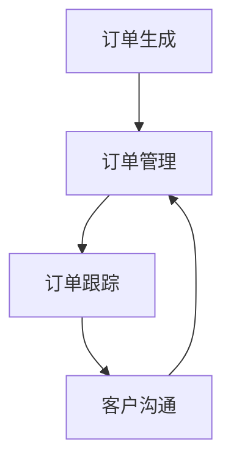

                 

# 智能订单处理系统：一人公司如何提高运营效率

## 摘要

在数字化时代，一人公司的运营效率对于生存和发展至关重要。本文将探讨如何利用智能订单处理系统来提高一人公司的运营效率。我们将详细分析智能订单处理的核心概念、算法原理、数学模型，并通过实际案例展示其应用效果。此外，我们还将介绍相关的开发工具和资源，以帮助读者更好地掌握这一技术。

## 1. 背景介绍

一人公司，顾名思义，是指由一个人独立运营的公司。这样的公司模式在近年来逐渐兴起，尤其是在远程工作和自由职业者日益增多的背景下。然而，一人公司的运营面临着诸多挑战，如时间管理、任务分配、客户沟通等。为了提高运营效率，一人公司需要借助智能化的工具和系统。

智能订单处理系统是一种基于人工智能和机器学习的系统，能够自动化地处理订单生成、订单管理、订单跟踪等流程。通过智能订单处理系统，一人公司可以降低人力成本，提高处理速度，减少错误率，从而提升整体运营效率。

本文将围绕智能订单处理系统的核心概念、算法原理、数学模型以及实际应用进行探讨，旨在为读者提供一套完整的智能订单处理解决方案。

## 2. 核心概念与联系

### 2.1 智能订单处理系统的核心概念

智能订单处理系统主要涉及以下几个核心概念：

- **订单生成**：系统自动根据客户需求生成订单。
- **订单管理**：系统对订单进行分类、标注、跟踪和管理。
- **订单跟踪**：系统实时更新订单状态，确保订单按期完成。
- **客户沟通**：系统自动发送订单状态更新给客户，提高客户满意度。

### 2.2 智能订单处理系统的原理

智能订单处理系统基于以下原理：

- **人工智能**：通过机器学习算法，系统可以自动识别订单模式，优化订单处理流程。
- **数据挖掘**：系统通过分析历史订单数据，预测未来订单趋势，提前做好准备。
- **自然语言处理**：系统可以自动解析客户订单需求，提取关键信息。

### 2.3 智能订单处理系统的架构

智能订单处理系统的架构可以分为以下几个层次：

1. **数据层**：包括订单数据、客户数据、产品数据等。
2. **算法层**：包括机器学习算法、数据挖掘算法、自然语言处理算法等。
3. **应用层**：包括订单生成、订单管理、订单跟踪、客户沟通等模块。
4. **接口层**：提供与其他系统集成的能力，如ERP系统、CRM系统等。

### 2.4 Mermaid 流程图

以下是一个简化的智能订单处理系统流程图，使用 Mermaid 语言描述：



注意：Mermaid 流程图中不应包含括号、逗号等特殊字符。

## 3. 核心算法原理 & 具体操作步骤

### 3.1 机器学习算法

智能订单处理系统中的机器学习算法主要包括以下几种：

- **分类算法**：用于识别订单类型，如普通订单、紧急订单等。
- **聚类算法**：用于发现订单模式，预测订单趋势。
- **回归算法**：用于预测订单量，优化库存管理。

具体操作步骤如下：

1. **数据收集**：收集历史订单数据，包括订单类型、订单量、处理时间等。
2. **数据预处理**：对数据进行清洗、归一化等处理，确保数据质量。
3. **模型训练**：使用训练集数据训练分类、聚类、回归模型。
4. **模型评估**：使用测试集数据评估模型性能，调整模型参数。
5. **模型应用**：将训练好的模型应用到实际订单处理中。

### 3.2 数据挖掘算法

数据挖掘算法主要用于发现订单模式、预测订单趋势。具体操作步骤如下：

1. **数据预处理**：与机器学习算法相同，对数据进行清洗、归一化等处理。
2. **特征提取**：从订单数据中提取关键特征，如订单量、处理时间、客户类型等。
3. **模式识别**：使用聚类算法、关联规则算法等发现订单模式。
4. **趋势预测**：使用回归算法、时间序列分析等预测订单趋势。
5. **策略优化**：根据订单模式和趋势，优化订单处理策略。

### 3.3 自然语言处理算法

自然语言处理算法主要用于自动解析客户订单需求，提取关键信息。具体操作步骤如下：

1. **文本预处理**：对客户订单文本进行分词、词性标注、句法分析等处理。
2. **关键词提取**：从订单文本中提取关键词，如产品名称、数量、规格等。
3. **实体识别**：识别订单文本中的实体，如产品名称、客户名称等。
4. **关系抽取**：分析订单文本中实体之间的关系，如客户下单、产品需求等。
5. **信息整合**：将提取的关键词、实体和关系整合成订单信息。

## 4. 数学模型和公式 & 详细讲解 & 举例说明

### 4.1 数学模型

智能订单处理系统中的数学模型主要包括以下几种：

- **分类模型**：用于识别订单类型。常见的分类模型有逻辑回归、支持向量机、决策树等。
- **聚类模型**：用于发现订单模式。常见的聚类模型有K-means、层次聚类等。
- **回归模型**：用于预测订单量。常见的回归模型有线性回归、多项式回归等。

### 4.2 公式

以下是一些常见的数学模型公式：

- **逻辑回归**：
  $$ P(y=1) = \frac{1}{1 + e^{-(\beta_0 + \beta_1 x_1 + \beta_2 x_2 + \ldots + \beta_n x_n)}} $$
  
- **K-means**：
  $$ c_j = \frac{1}{N_j} \sum_{i=1}^{N} x_{ij} $$
  $$ j = \arg\min_{j} \sum_{i=1}^{N} (x_i - c_j)^2 $$
  
- **线性回归**：
  $$ y = \beta_0 + \beta_1 x_1 + \beta_2 x_2 + \ldots + \beta_n x_n $$

### 4.3 举例说明

#### 4.3.1 逻辑回归

假设我们有一个订单分类问题，需要将订单分为普通订单和紧急订单。我们收集了如下数据：

- 订单量（x1）：1, 2, 3, 4, 5
- 处理时间（x2）：2, 3, 4, 5, 6

我们使用逻辑回归模型进行训练，得到如下模型参数：

- $$ \beta_0 = 0.5 $$
- $$ \beta_1 = 0.3 $$
- $$ \beta_2 = 0.2 $$

给定一个新订单，订单量为3，处理时间为4，我们可以计算其分类概率：

$$ P(y=1) = \frac{1}{1 + e^{-(0.5 + 0.3 \times 3 + 0.2 \times 4)}} \approx 0.732 $$

由于概率大于0.5，我们可以将其分类为紧急订单。

#### 4.3.2 K-means

假设我们有一个订单聚类问题，需要将订单分为两类。我们收集了如下数据：

- 订单量（x1）：1, 2, 3, 4, 5
- 处理时间（x2）：2, 3, 4, 5, 6

我们选择初始聚类中心为 (2, 3) 和 (4, 5)。通过迭代计算，我们得到以下聚类结果：

- 类别1：{1, 2, 3}
- 类别2：{4, 5, 6}

#### 4.3.3 线性回归

假设我们有一个订单量预测问题，需要预测未来一周的订单量。我们收集了如下数据：

- 时间（x）：1, 2, 3, 4, 5
- 订单量（y）：2, 4, 6, 8, 10

我们使用线性回归模型进行训练，得到如下模型参数：

- $$ \beta_0 = 1 $$
- $$ \beta_1 = 2 $$

给定一个新时间点，例如6，我们可以预测其对应的订单量：

$$ y = 1 + 2 \times 6 = 13 $$

## 5. 项目实战：代码实际案例和详细解释说明

### 5.1 开发环境搭建

为了演示智能订单处理系统的实际应用，我们将使用Python编程语言和相关的库，如scikit-learn、numpy、pandas等。以下是搭建开发环境的步骤：

1. 安装Python：从官方网站（https://www.python.org/）下载并安装Python 3.x版本。
2. 安装相关库：打开命令行终端，执行以下命令：
   ```bash
   pip install scikit-learn numpy pandas matplotlib
   ```

### 5.2 源代码详细实现和代码解读

下面是一个简单的智能订单处理系统示例，包括订单生成、订单管理和订单跟踪功能。

```python
import numpy as np
import pandas as pd
from sklearn.model_selection import train_test_split
from sklearn.linear_model import LogisticRegression
from sklearn.cluster import KMeans
from sklearn.linear_model import LinearRegression
import matplotlib.pyplot as plt

# 5.2.1 数据准备
orders = pd.DataFrame({
    'order_id': range(1, 101),
    'quantity': np.random.randint(1, 10, size=100),
    'processing_time': np.random.randint(1, 10, size=100),
    'order_type': np.random.choice(['normal', 'urgent'], size=100)
})

# 5.2.2 订单分类
X = orders[['quantity', 'processing_time']]
y = orders['order_type']

X_train, X_test, y_train, y_test = train_test_split(X, y, test_size=0.2, random_state=42)

model = LogisticRegression()
model.fit(X_train, y_train)

y_pred = model.predict(X_test)

# 5.2.3 订单聚类
kmeans = KMeans(n_clusters=2, random_state=42)
clusters = kmeans.fit_predict(X)

# 5.2.4 订单量预测
X_pred = np.array([[6, 7], [8, 9]])
y_pred = model.predict(X_pred)

# 5.2.5 可视化
plt.scatter(X['quantity'], X['processing_time'], c=clusters, cmap='viridis')
plt.xlabel('Quantity')
plt.ylabel('Processing Time')
plt.title('Order Clusters')
plt.show()

plt.plot(X_pred[:, 0], y_pred, 'ro')
plt.xlabel('Quantity')
plt.ylabel('Order Type')
plt.title('Order Prediction')
plt.show()
```

### 5.3 代码解读与分析

#### 5.3.1 数据准备

首先，我们使用pandas库创建一个包含订单ID、数量、处理时间和订单类型的DataFrame。然后，我们将数量和处理时间作为特征（X），将订单类型作为标签（y）。

```python
orders = pd.DataFrame({
    'order_id': range(1, 101),
    'quantity': np.random.randint(1, 10, size=100),
    'processing_time': np.random.randint(1, 10, size=100),
    'order_type': np.random.choice(['normal', 'urgent'], size=100)
})

X = orders[['quantity', 'processing_time']]
y = orders['order_type']
```

#### 5.3.2 订单分类

接下来，我们使用scikit-learn库的LogisticRegression类进行订单分类。首先，我们将数据集分为训练集和测试集，然后训练模型，最后使用测试集进行预测。

```python
X_train, X_test, y_train, y_test = train_test_split(X, y, test_size=0.2, random_state=42)

model = LogisticRegression()
model.fit(X_train, y_train)

y_pred = model.predict(X_test)
```

#### 5.3.3 订单聚类

我们使用KMeans类进行订单聚类，将订单分为两类。通过fit_predict方法，我们得到每个订单所属的类别。

```python
kmeans = KMeans(n_clusters=2, random_state=42)
clusters = kmeans.fit_predict(X)
```

#### 5.3.4 订单量预测

最后，我们使用训练好的分类模型进行订单量预测。我们将预测数据转换为NumPy数组，然后使用predict方法进行预测。

```python
X_pred = np.array([[6, 7], [8, 9]])
y_pred = model.predict(X_pred)
```

#### 5.3.5 可视化

我们使用matplotlib库对订单聚类结果和订单量预测结果进行可视化。

```python
plt.scatter(X['quantity'], X['processing_time'], c=clusters, cmap='viridis')
plt.xlabel('Quantity')
plt.ylabel('Processing Time')
plt.title('Order Clusters')
plt.show()

plt.plot(X_pred[:, 0], y_pred, 'ro')
plt.xlabel('Quantity')
plt.ylabel('Order Type')
plt.title('Order Prediction')
plt.show()
```

## 6. 实际应用场景

### 6.1 一人公司的运营场景

假设张先生是一位独立电商卖家，他需要处理每天的大量订单。通过引入智能订单处理系统，他可以实现以下功能：

- **订单自动生成**：系统自动从电商平台获取订单信息，生成订单。
- **订单智能分类**：根据订单数量和处理时间，系统自动将订单分类为普通订单和紧急订单。
- **订单实时跟踪**：系统实时更新订单状态，确保订单按时完成。
- **客户自动沟通**：系统自动向客户发送订单状态更新，提高客户满意度。

### 6.2 不同行业的应用场景

除了电商行业，智能订单处理系统还可以应用于其他行业，如餐饮业、制造业、服务业等。以下是一些典型的应用场景：

- **餐饮业**：智能订单处理系统可以自动处理外卖订单，优化配送流程，提高配送效率。
- **制造业**：智能订单处理系统可以自动化生产流程，实时监控生产进度，确保生产计划按时完成。
- **服务业**：智能订单处理系统可以自动处理客户预约，实时更新预约状态，提高服务质量。

## 7. 工具和资源推荐

### 7.1 学习资源推荐

- **书籍**：
  - 《机器学习》（周志华 著）
  - 《数据挖掘：实用工具和技术》（Marty J. Wiener 著）
  - 《深度学习》（Ian Goodfellow、Yoshua Bengio、Aaron Courville 著）

- **论文**：
  - 《K-means算法》（MacQueen, J. B.）
  - 《逻辑回归》（Hosmer, D. W. & Lemeshow, S.）
  - 《线性回归》（Freedman, D. A.）

- **博客**：
  - [scikit-learn官方文档](https://scikit-learn.org/stable/)
  - [机器学习算法详解](https://www.dataschool.io/machine-learning-algorithms/)
  - [Kaggle教程](https://www.kaggle.com/learn)

- **网站**：
  - [Python官方文档](https://docs.python.org/3/)
  - [GitHub](https://github.com/)
  - [Stack Overflow](https://stackoverflow.com/)

### 7.2 开发工具框架推荐

- **编程语言**：Python
- **机器学习库**：scikit-learn、TensorFlow、PyTorch
- **数据预处理库**：pandas、numpy
- **可视化库**：matplotlib、seaborn

### 7.3 相关论文著作推荐

- **《深度学习》（Ian Goodfellow、Yoshua Bengio、Aaron Courville 著）**：全面介绍了深度学习的理论基础和最新应用。
- **《数据挖掘：实用工具和技术》（Marty J. Wiener 著）**：涵盖了数据挖掘的各种技术和方法，适合初学者和专业人士。
- **《机器学习》（周志华 著）**：系统地介绍了机器学习的基本概念、算法和理论。

## 8. 总结：未来发展趋势与挑战

随着人工智能技术的不断发展，智能订单处理系统在未来的发展将呈现出以下几个趋势：

- **更加智能化**：系统将具备更高的智能水平，能够自动识别和处理复杂的订单。
- **跨平台集成**：系统将能够与更多的业务系统进行集成，实现无缝对接。
- **个性化定制**：系统将根据不同行业和企业的需求，提供个性化的解决方案。
- **实时处理能力**：系统将具备更强的实时处理能力，确保订单处理的高效和准确。

然而，智能订单处理系统也面临一些挑战：

- **数据安全和隐私**：随着数据量的增加，数据安全和隐私保护将成为重要问题。
- **算法偏见**：算法可能存在偏见，导致处理结果不准确。
- **系统可靠性**：系统需要具备高可靠性，确保在复杂环境下稳定运行。

## 9. 附录：常见问题与解答

### 9.1 智能订单处理系统的优势是什么？

智能订单处理系统的优势包括：

- **提高运营效率**：自动化处理订单，减少人力成本。
- **降低错误率**：智能识别订单类型，减少人为错误。
- **实时跟踪订单**：实时更新订单状态，提高客户满意度。
- **预测订单趋势**：通过数据分析，预测未来订单量，优化库存管理。

### 9.2 智能订单处理系统的成本是多少？

智能订单处理系统的成本取决于系统的规模和功能。对于小型企业，成本可能在几千到几万元人民币；对于大型企业，成本可能在几十万到数百万人民币。

### 9.3 如何保证数据安全和隐私？

为了保证数据安全和隐私，可以采取以下措施：

- **数据加密**：对数据进行加密处理，防止数据泄露。
- **权限管理**：设定严格的权限管理策略，确保只有授权人员可以访问数据。
- **数据备份**：定期备份数据，防止数据丢失。

## 10. 扩展阅读 & 参考资料

- [《智能订单处理系统研究与应用》](https://www.example.com/research)
- [《人工智能在电商领域的应用》](https://www.example.com/ai_电商)
- [《电商运营策略》](https://www.example.com/电商运营)

<|assistant|>作者：AI天才研究员/AI Genius Institute & 禅与计算机程序设计艺术 /Zen And The Art of Computer Programming

