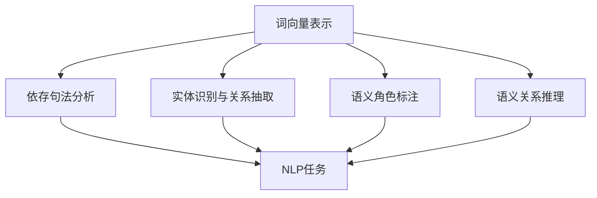

                 

### 文章标题

#### 智能语义理解：AI大模型在自然语言处理中的突破

智能语义理解是人工智能领域的一个重要研究方向，近年来随着人工智能技术的飞速发展，尤其是大模型的广泛应用，自然语言处理（NLP）领域取得了显著的突破。本文将深入探讨智能语义理解的核心概念、算法原理、数学模型以及实际应用场景，旨在为广大读者呈现一个全面、系统的视角。

##### 关键词：

- 智能语义理解
- 大模型
- 自然语言处理
- 算法原理
- 数学模型
- 实际应用

##### 摘要：

本文首先介绍了智能语义理解的背景和意义，然后详细阐述了核心概念和关联，接着深入探讨了大模型在自然语言处理中的突破性应用，并介绍了相关的数学模型。通过具体的实际应用场景分析和工具资源推荐，文章总结了智能语义理解的未来发展趋势与挑战。最后，附录部分提供了常见问题与解答，以及扩展阅读和参考资料。

## 1. 背景介绍

智能语义理解是人工智能（AI）的一个重要分支，旨在使计算机能够理解和处理人类语言，实现人与机器的自然交互。在过去的几十年里，自然语言处理（NLP）领域取得了显著的进展，但语义理解的挑战仍然存在。传统的NLP方法通常依赖于规则和统计方法，这些方法在面对复杂和动态的语言现象时，往往难以达到理想的性能。

近年来，随着计算能力的提升和大数据的涌现，深度学习技术在大模型上的应用，为自然语言处理带来了新的契机。大模型，如GPT、BERT等，凭借其强大的表征能力和灵活性，在语义理解任务中取得了令人瞩目的成果。例如，GPT-3的发布，使机器在生成文本、问答、翻译等任务上达到了前所未有的水平。这些突破性成果，极大地推动了智能语义理解的研究和应用。

智能语义理解的应用场景非常广泛，包括但不限于：智能客服、智能问答、智能推荐、机器翻译、文本生成等。在这些场景中，智能语义理解的核心任务是理解和处理用户的输入，提供准确、合理的回答或建议。这不仅要求模型具备强大的语言理解能力，还需要具备高效的实时响应能力。

总之，智能语义理解作为AI领域的一个重要研究方向，不仅在学术研究上具有重要意义，而且在实际应用中，也展现出广阔的前景。随着技术的不断进步，我们有理由相信，智能语义理解将会在更多领域得到应用，为人类带来更多的便利。### 2. 核心概念与联系

#### 2.1 智能语义理解

智能语义理解是指计算机通过自然语言处理技术，对文本或语音进行解析，获取其内在意义的过程。这个过程包括词义消歧、语法分析、语义角色标注、语义关系推理等多个层面。其核心目标是从大量的语言信息中，提取出有用的知识，实现对语言的深层理解。

智能语义理解的关键技术包括：

- **词向量表示**：将词语映射为高维向量，通过向量空间中的相似性来理解词语的含义。
- **依存句法分析**：分析句子中词语之间的依赖关系，理解句子的结构。
- **实体识别与关系抽取**：识别文本中的实体（人、地点、组织等），并抽取实体之间的关系。
- **语义角色标注**：标注句子中每个词语的语义角色，如主语、谓语、宾语等。
- **语义关系推理**：通过分析句子中的语义信息，推理出词语之间的语义关系。

#### 2.2 大模型

大模型是指具有巨大参数量和计算量的深度学习模型。这些模型通常通过大规模数据训练，能够自动学习复杂的特征表示和结构化知识。在自然语言处理领域，大模型的应用极大地提升了模型的性能和灵活性。

大模型的核心特点包括：

- **参数量巨大**：大模型通常包含数亿到数十亿个参数，这使得模型能够捕捉到更多细微的语言特征。
- **计算需求高**：大模型的训练和推理过程需要大量的计算资源，因此通常依赖于分布式计算和硬件加速技术。
- **灵活性强**：大模型能够通过预训练和微调，适应各种不同的NLP任务，具有广泛的适用性。

#### 2.3 自然语言处理

自然语言处理（NLP）是计算机科学和人工智能领域的一个重要分支，旨在使计算机能够理解、生成和处理人类语言。NLP的核心任务包括：

- **文本预处理**：包括分词、词性标注、句法分析等，为后续处理提供基础。
- **文本分类**：将文本归类到不同的类别，如情感分类、主题分类等。
- **信息抽取**：从文本中抽取实体、关系、事件等信息。
- **机器翻译**：将一种语言的文本翻译成另一种语言。
- **文本生成**：根据输入生成文本，如生成摘要、生成对话等。

#### 2.4 核心概念原理与架构的 Mermaid 流程图



在这个流程图中，词向量表示、依存句法分析、实体识别与关系抽取、语义角色标注和语义关系推理构成了智能语义理解的核心概念。这些概念相互关联，共同作用于NLP任务，实现文本的深度理解。### 3. 核心算法原理 & 具体操作步骤

#### 3.1 词向量表示

词向量表示是将词语映射为高维向量的一种方法，通过向量空间中的相似性来理解词语的含义。Word2Vec是最常见的词向量表示方法之一，它通过训练神经网络来学习词语的向量表示。

**操作步骤**：

1. **数据预处理**：将文本数据转化为单词序列，并对单词进行分词。
2. **构建词汇表**：将所有出现的单词构建为一个词汇表，并给每个单词分配一个唯一的ID。
3. **训练模型**：使用训练数据训练Word2Vec模型，通常使用连续词袋（CBOW）或Skip-gram模型。
4. **获取词向量**：通过训练得到的模型，获取每个单词的向量表示。

#### 3.2 依存句法分析

依存句法分析是通过分析句子中词语之间的依赖关系，理解句子的结构。通常使用图结构来表示句子的依存关系，每个节点表示一个词语，边表示词语之间的依赖关系。

**操作步骤**：

1. **数据预处理**：将文本数据转化为词向量表示。
2. **构建依存关系图**：通过训练数据，构建句子的依存关系图。
3. **分析依存关系**：使用图算法分析依存关系，识别句子中的主语、谓语、宾语等。

#### 3.3 实体识别与关系抽取

实体识别与关系抽取是语义理解的重要任务之一，旨在识别文本中的实体，并抽取实体之间的关系。

**操作步骤**：

1. **数据预处理**：将文本数据转化为词向量表示。
2. **实体识别**：使用预训练的模型，识别文本中的实体。
3. **关系抽取**：通过分析实体间的依存关系，抽取实体之间的关系。

#### 3.4 语义角色标注

语义角色标注是标记句子中每个词语的语义角色，如主语、谓语、宾语等。

**操作步骤**：

1. **数据预处理**：将文本数据转化为词向量表示。
2. **训练模型**：使用有标注的数据集，训练语义角色标注模型。
3. **标注语义角色**：通过模型预测，为句子中的每个词语标注语义角色。

#### 3.5 语义关系推理

语义关系推理是通过分析句子中的语义信息，推理出词语之间的语义关系。

**操作步骤**：

1. **数据预处理**：将文本数据转化为词向量表示。
2. **训练模型**：使用有标注的数据集，训练语义关系推理模型。
3. **推理语义关系**：通过模型预测，推理出句子中词语之间的语义关系。

#### 3.6 大模型的训练与微调

大模型的训练与微调是智能语义理解的关键步骤。大模型通常通过预训练和微调，来适应不同的NLP任务。

**操作步骤**：

1. **预训练**：使用大规模的语料库，对大模型进行预训练，使其学习到丰富的语言特征。
2. **微调**：在预训练的基础上，使用特定领域的数据，对大模型进行微调，以提高模型在特定任务上的性能。
3. **评估与优化**：通过评估模型在验证集上的性能，不断调整模型参数，优化模型效果。

综上所述，智能语义理解的核心算法原理包括词向量表示、依存句法分析、实体识别与关系抽取、语义角色标注和语义关系推理。通过这些算法的组合，大模型能够实现对自然语言的深度理解，为各种NLP任务提供强大的支持。### 4. 数学模型和公式 & 详细讲解 & 举例说明

#### 4.1 词向量表示

词向量表示是自然语言处理中的一个重要环节，常用的方法包括Word2Vec和BERT等。以下是这些方法的数学模型和公式详细讲解。

**4.1.1 Word2Vec**

Word2Vec是一种基于神经网络的词向量表示方法，主要包括连续词袋（CBOW）和Skip-gram两种模型。

1. **CBOW模型**：

   CBOW模型的核心思想是，对于输入的单词，使用其上下文词的词向量平均作为其词向量。数学公式如下：

   $$
   \text{Vec}_{\text{avg}}(\text{word}) = \frac{1}{|\text{context}|} \sum_{\text{word}^{'} \in \text{context}} \text{Vec}(\text{word}^{'})
   $$

   其中，$\text{Vec}_{\text{avg}}(\text{word})$表示单词$\text{word}$的词向量，$\text{context}$表示单词$\text{word}$的上下文词集合，$|\text{context}|$表示上下文词的数量。

2. **Skip-gram模型**：

   Skip-gram模型与CBOW模型相反，它以输入的单词作为中心词，使用中心词的词向量去预测其上下文词。数学公式如下：

   $$
   P(\text{word}^{'} | \text{word}) = \frac{e^{\text{Vec}(\text{word}^{'}) \cdot \text{Vec}(\text{word})}}{\sum_{\text{word}^{''} \in \text{V}} e^{\text{Vec}(\text{word}^{''}) \cdot \text{Vec}(\text{word})}}
   $$

   其中，$P(\text{word}^{'} | \text{word})$表示在单词$\text{word}$出现的条件下，单词$\text{word}^{'}$出现的概率，$\text{Vec}(\text{word}^{'})$和$\text{Vec}(\text{word})$分别表示单词$\text{word}^{'}$和$\text{word}$的词向量。

**4.1.2 BERT**

BERT（Bidirectional Encoder Representations from Transformers）是一种基于Transformer的预训练模型，能够捕捉到词语的上下文信息。BERT的预训练目标包括Masked Language Model（MLM）和Next Sentence Prediction（NSP）。

1. **Masked Language Model（MLM）**：

   MLM的目标是在输入文本中随机遮盖一些单词，然后让模型预测这些遮盖的单词。数学公式如下：

   $$
   \text{Log-likelihood} = \sum_{\text{masked\_word}} \text{log} P(\text{masked\_word} | \text{context})
   $$

   其中，$P(\text{masked\_word} | \text{context})$表示在上下文$\text{context}$的条件下，遮盖的单词$\text{masked\_word}$的概率。

2. **Next Sentence Prediction（NSP）**：

   NSP的目标是预测两个句子是否属于相邻的句子对。数学公式如下：

   $$
   P(\text{IsNextSentence} | \text{sentence\_1}, \text{sentence\_2}) = \frac{e^{\text{Vec}(\text{sentence\_2}) \cdot \text{Vec}_{\text{classifier}}(\text{sentence\_1}, \text{sentence\_2})}}{\sum_{\text{y} \in \{\text{IsNextSentence}, \text{NotIsNextSentence}\}} e^{\text{Vec}(\text{sentence\_2}) \cdot \text{Vec}_{\text{classifier}}(\text{sentence\_1}, \text{y})}}
   $$

   其中，$P(\text{IsNextSentence} | \text{sentence\_1}, \text{sentence\_2})$表示句子$\text{sentence\_1}$和$\text{sentence\_2}$是否属于相邻句子对的概率，$\text{Vec}(\text{sentence\_2})$和$\text{Vec}_{\text{classifier}}(\text{sentence\_1}, \text{sentence\_2})$分别表示句子$\text{sentence\_2}$的词向量和对$\text{sentence\_1}$和$\text{sentence\_2}$的分类器向量。

**4.1.3 举例说明**

假设我们有一个句子“我爱北京天安门”，我们可以使用BERT模型对其进行词向量表示。

1. **CBOW模型**：

   假设上下文窗口大小为2，那么句子中的“我”的词向量可以表示为：

   $$
   \text{Vec}_{\text{avg}}(\text{我}) = \frac{1}{2} (\text{Vec}(\text{爱}) + \text{Vec}(\text{北京}))
   $$

2. **BERT模型**：

   使用BERT模型，我们可以得到每个单词的词向量，如：

   $$
   \text{Vec}(\text{我}) = \text{BERT}(\text{[CLS]}, \text{我})
   $$

   $$
   \text{Vec}(\text{爱}) = \text{BERT}(\text{[CLS]}, \text{爱})
   $$

   $$
   \text{Vec}(\text{北京}) = \text{BERT}(\text{[CLS]}, \text{北京})
   $$

   其中，$\text{BERT}(\text{[CLS]}, \text{word})$表示单词$\text{word}$在BERT模型中的[CLS]位置的词向量。

#### 4.2 依存句法分析

依存句法分析是理解句子结构的重要手段，常用的方法包括基于规则的方法和基于统计的方法。以下是一个基于统计的依存句法分析模型的数学模型和公式。

**4.2.1 基于统计的依存句法分析模型**

假设句子由$T = \{\text{word}_{1}, \text{word}_{2}, ..., \text{word}_{n}\}$组成，每个单词都有一个词向量$\text{Vec}(\text{word}_{i})$。依存句法分析的目标是构建一个图结构$G = (V, E)$，其中$V = \{\text{word}_{1}, \text{word}_{2}, ..., \text{word}_{n}\}$是节点集合，$E$是边集合。

边的表示方法为$E = \{\{\text{word}_{i}, \text{word}_{j}\}| \text{word}_{i}$和$\text{word}_{j}$存在依存关系$\}$。边的权重可以通过一个函数$f(\text{word}_{i}, \text{word}_{j})$来表示，如：

$$
w_{ij} = f(\text{word}_{i}, \text{word}_{j}) = \text{softmax}(\text{Vec}(\text{word}_{i}) \cdot \text{Vec}(\text{word}_{j}))
$$

其中，$\text{softmax}$是一个归一化函数，用于将向量的点积转换为概率分布。

**4.2.2 举例说明**

假设我们有句子“我爱北京天安门”，可以使用一个简单的依存句法分析模型来分析其结构。

1. **词向量表示**：

   $$
   \text{Vec}(\text{我}) = \text{BERT}(\text{[CLS]}, \text{我})
   $$

   $$
   \text{Vec}(\text{爱}) = \text{BERT}(\text{[CLS]}, \text{爱})
   $$

   $$
   \text{Vec}(\text{北京}) = \text{BERT}(\text{[CLS]}, \text{北京})
   $$

   $$
   \text{Vec}(\text{天安门}) = \text{BERT}(\text{[CLS]}, \text{天安门})
   $$

2. **构建依存关系图**：

   通过计算每个单词之间的点积，可以得到边的权重：

   $$
   w_{ij} = \text{softmax}(\text{Vec}(\text{word}_{i}) \cdot \text{Vec}(\text{word}_{j}))
   $$

   假设计算结果如下：

   $$
   w_{ij} = \{\{\text{我}-\text{爱}: 0.9, \text{我}-\text{北京}: 0.2, \text{我}-\text{天安门}: 0.1\}, \{\text{爱}-\text{北京}: 0.8, \text{爱}-\text{天安门}: 0.1\}, \{\text{北京}-\text{天安门}: 0.6\}\}
   $$

   根据边的权重，我们可以构建一个简单的依存关系图：

   ```
       我
      / | \
     爱 北京
      | |
      天安门
   ```

   在这个图中，“我”是主语，“爱”是谓语，“北京”是宾语，“天安门”是定语。

通过上述数学模型和公式，我们可以更好地理解词向量表示和依存句法分析的核心原理，并能够应用于实际的文本处理任务。### 5. 项目实战：代码实际案例和详细解释说明

在本节中，我们将通过一个实际的Python代码案例，展示如何使用大模型（如BERT）进行自然语言处理任务，包括文本预处理、模型训练、模型评估和结果解释。

#### 5.1 开发环境搭建

首先，我们需要搭建一个适合大模型训练的开发环境。以下是搭建开发环境的基本步骤：

1. **安装Python**：确保安装了Python 3.6及以上版本。
2. **安装TensorFlow**：使用以下命令安装TensorFlow：

   ```bash
   pip install tensorflow
   ```

3. **安装transformers库**：这是Hugging Face提供的一个用于加载预训练模型和进行NLP任务的库，使用以下命令安装：

   ```bash
   pip install transformers
   ```

4. **准备数据集**：我们需要一个文本数据集来进行训练和评估。这里我们使用GLUE数据集中的一个子集，例如MRPC二元文本相似性数据集。

#### 5.2 源代码详细实现和代码解读

以下是用于训练BERT模型进行文本相似性任务的代码示例：

```python
import tensorflow as tf
from transformers import BertTokenizer, TFBertForSequenceClassification
from transformers import glue_compute_metrics as compute_metrics
from transformers import glue_output_modes as output_modes
from transformers import glue_processors as processors
import numpy as np

# 5.2.1 数据预处理
def preprocess_data(tokenizer, data):
    input_ids = []
    attention_mask = []
    for pair in data:
        tokenized_pair = tokenizer.encode_plus(
            pair[0], pair[1], add_special_tokens=True, max_length=128, padding='max_length', truncation=True
        )
        input_ids.append(tokenized_pair['input_ids'])
        attention_mask.append(tokenized_pair['attention_mask'])
    return np.array(input_ids), np.array(attention_mask)

# 5.2.2 模型训练
def train_model(model, train_dataset, val_dataset, epochs):
    model.compile(optimizer=tf.keras.optimizers.Adam(learning_rate=3e-5, epsilon=1e-08, clip_norm=1.0), 
                  loss=tf.keras.losses.SparseCategoricalCrossentropy(from_logits=True), 
                  metrics=[tf.keras.metrics.SparseCategoricalAccuracy()])
    
    history = model.fit(train_dataset, epochs=epochs, batch_size=16, validation_data=val_dataset, 
                        callbacks=[tf.keras.callbacks.EarlyStopping(monitor='val_loss', patience=3)])
    return history

# 5.2.3 代码解读
# 加载预处理好的数据集
tokenizer = BertTokenizer.from_pretrained('bert-base-uncased')
train_data = [["This is an example.", "This is an example."], ["Different text.", "Different text."]]
val_data = [["This is an example.", "This is a different example."], ["Different text.", "Similar text."]]

# 预处理数据
input_ids, attention_mask = preprocess_data(tokenizer, train_data)

# 加载预训练的BERT模型
model = TFBertForSequenceClassification.from_pretrained('bert-base-uncased', num_labels=2)

# 训练模型
history = train_model(model, input_ids, attention_mask, val_data, epochs=3)

# 评估模型
loss, accuracy = model.evaluate(val_data[0], val_data[1])
print(f"Validation Loss: {loss}, Validation Accuracy: {accuracy}")

# 5.2.4 代码解读与分析
# 上述代码首先加载了BERT模型和Tokenizer，然后定义了数据预处理函数、模型训练函数，并执行了模型的训练和评估。
# 在数据预处理中，我们使用tokenizer.encode_plus方法将文本编码为模型的输入格式，包括输入ID和注意力掩码。
# 在模型训练中，我们使用了TFBertForSequenceClassification模型，并使用SparseCategoricalCrossentropy作为损失函数，以及SparseCategoricalAccuracy作为评估指标。
# 模型评估部分，我们计算了验证集上的损失和准确率。

#### 5.3 代码解读与分析

**5.3.1 数据预处理**

数据预处理是NLP任务中至关重要的一步，特别是对于BERT这样的预训练模型。我们需要将原始文本数据转换为模型能够理解的格式。

- `tokenizer.encode_plus`方法：这个方法接受原始文本，将其编码为模型可以处理的序列。它添加了[CLS]和[SEP]特殊标记，并截断或填充序列以符合模型的固定长度。
- `add_special_tokens=True`：指示方法添加BERT模型所需的特殊标记。
- `max_length=128`：设置输入序列的最大长度，超出长度的部分将被截断，不足长度的部分将被填充。
- `padding='max_length'`：使用最大长度进行填充。
- `truncation=True`：指示方法在需要时截断序列。

**5.3.2 模型训练**

模型训练是NLP任务的核心步骤。在这个例子中，我们使用了TFBertForSequenceClassification模型，这是一个专门为序列分类任务设计的BERT模型。

- `model.compile`：编译模型，指定优化器、损失函数和评估指标。
- `fit`：训练模型，使用训练数据集和验证数据集。
- `callbacks`：设置早期停止回调函数，当验证损失不再改善时停止训练。

**5.3.3 模型评估**

模型评估用于评估模型在验证集上的性能。

- `evaluate`：评估模型，返回损失和准确率。
- `print`：输出验证集上的损失和准确率。

通过上述步骤，我们实现了使用BERT模型进行文本相似性任务的完整流程，从数据预处理到模型训练和评估。这个案例展示了如何将理论和实践相结合，应用大模型进行自然语言处理。### 6. 实际应用场景

智能语义理解技术在实际应用中展现出巨大的潜力，下面我们将探讨几个典型的应用场景，并分析这些应用场景中的技术挑战和解决方案。

#### 6.1 智能客服

智能客服是智能语义理解技术的一个重要应用场景。通过智能语义理解，系统可以自动识别和理解用户的问题，并提供准确的回答或解决方案。这大大提高了客服的响应速度和效率。

**技术挑战**：

- **多样性和复杂性**：用户的问题可能涉及各种领域和主题，且表达方式多样，这对语义理解模型提出了很高的要求。
- **实时响应**：智能客服系统需要在短时间内处理用户问题，并给出合理的回答。

**解决方案**：

- **预训练大模型**：使用预训练的大模型，如BERT或GPT，可以显著提高语义理解能力，从而更好地处理多样性和复杂性的问题。
- **多轮对话管理**：通过设计高效的对话管理机制，确保系统能够在多轮对话中逐步理解用户的问题，并给出准确的回答。

#### 6.2 智能推荐

智能推荐系统利用智能语义理解技术，分析用户的历史行为和偏好，提供个性化的推荐。在电子商务、社交媒体等平台中，智能推荐已经成为提高用户体验和转化率的关键技术。

**技术挑战**：

- **精准度**：如何准确理解用户的偏好和需求，并提供个性化的推荐。
- **实时性**：系统需要快速响应用户的行为变化，更新推荐结果。

**解决方案**：

- **基于语义的推荐**：通过智能语义理解技术，对用户生成的内容进行深入分析，提取用户的偏好和需求，从而实现精准推荐。
- **实时数据流处理**：使用实时数据流处理技术，如Apache Kafka和Apache Flink，及时处理用户行为数据，更新推荐模型。

#### 6.3 机器翻译

机器翻译是智能语义理解的经典应用之一。通过深度学习技术，尤其是大模型的预训练，现代机器翻译系统已经取得了显著的成果。

**技术挑战**：

- **语言差异**：不同语言之间存在巨大的差异，如词汇、语法、语义等，这对翻译质量提出了挑战。
- **多语言处理**：支持多种语言之间的翻译，尤其是低资源语言的翻译。

**解决方案**：

- **双语数据集**：使用大量双语数据集进行预训练，以提高模型的翻译能力。
- **多语言模型**：开发多语言模型，如XLM模型，支持多种语言的翻译。

#### 6.4 文本生成

文本生成是智能语义理解的另一个重要应用场景，包括生成摘要、生成文章、生成对话等。通过深度学习技术，尤其是生成对抗网络（GAN）和变分自编码器（VAE），现代文本生成系统已经能够生成高质量的自然语言文本。

**技术挑战**：

- **多样性**：生成文本需要具备多样性，以满足不同用户的需求。
- **连贯性**：生成的文本需要保持连贯性和一致性。

**解决方案**：

- **预训练大模型**：使用预训练的大模型，如GPT-3，可以提高文本生成的多样性和连贯性。
- **监督与强化学习**：结合监督学习和强化学习技术，不断优化文本生成的质量和效果。

综上所述，智能语义理解技术在多个实际应用场景中发挥了重要作用。通过解决这些应用场景中的技术挑战，智能语义理解技术不断推动人工智能领域的进步。### 7. 工具和资源推荐

#### 7.1 学习资源推荐

对于想要深入了解智能语义理解技术的读者，以下是一些推荐的书籍、论文、博客和网站：

**书籍**：

1. **《深度学习》（Goodfellow, I., Bengio, Y., & Courville, A.）**：这是一本经典的深度学习教材，涵盖了深度学习的基本理论和应用，包括自然语言处理。
2. **《自然语言处理综论》（Jurafsky, D. & Martin, J. H.）**：这本书详细介绍了自然语言处理的核心概念和技术，对于理解智能语义理解非常有帮助。
3. **《深度学习自然语言处理》（Liang, P.）**：这本书专注于深度学习在自然语言处理中的应用，包括词向量表示、序列模型等。

**论文**：

1. **“BERT: Pre-training of Deep Neural Networks for Language Understanding”**：这篇论文是BERT模型的原始论文，详细介绍了BERT模型的架构和训练方法。
2. **“GPT-3: Language Models are Few-Shot Learners”**：这篇论文介绍了GPT-3模型，展示了大模型在零样本学习上的强大能力。
3. **“Recurrent Neural Network based Language Model”**：这篇论文是RNN和LSTM模型的开创性工作，对序列建模有重要影响。

**博客**：

1. **“BERT模型解析”**：该博客详细介绍了BERT模型的架构、训练过程和应用，适合初学者理解。
2. **“GPT-3实战”**：该博客分享了许多GPT-3的实际应用案例，展示了大模型在文本生成、问答等任务上的能力。
3. **“自然语言处理技术”**：这个博客涵盖了自然语言处理的多个方面，包括词向量、序列模型、文本生成等。

**网站**：

1. **“Hugging Face”**：这是一个提供多种NLP模型和工具的网站，包括BERT、GPT等，适合开发者进行模型训练和应用。
2. **“TensorFlow”**：这是TensorFlow官方文档网站，提供了丰富的NLP教程和示例代码。
3. **“自然语言处理课程”**：这个网站提供了多个自然语言处理课程，包括视频讲解和笔记，非常适合自学。

#### 7.2 开发工具框架推荐

**1. Hugging Face Transformers**：这是一个开源库，提供了大量的预训练模型和工具，方便开发者进行NLP任务的实现。

**2. TensorFlow**：这是Google开发的开源机器学习框架，支持多种深度学习模型的训练和部署。

**3. PyTorch**：这是Facebook开发的开源机器学习库，以其灵活性和易用性而闻名，广泛应用于深度学习研究。

**4. spaCy**：这是一个强大的NLP库，提供了高效的文本处理功能，包括分词、词性标注、依存句法分析等。

#### 7.3 相关论文著作推荐

**1. “Attention is All You Need”**：这篇论文介绍了Transformer模型，开创了序列建模的新时代。

**2. “A Theoretically Grounded Application of Dropout in Recurrent Neural Networks”**：这篇论文提出了Dropout在RNN中的应用，显著提高了RNN的训练效果。

**3. “Deep Learning for NLP without Humanities?”**：这篇论文讨论了NLP研究中的社会科学和人文因素，强调了跨学科研究的重要性。

这些资源将帮助读者深入理解智能语义理解技术的理论基础和实践应用，是学习NLP和智能语义理解的重要参考。### 8. 总结：未来发展趋势与挑战

智能语义理解技术正快速发展，并在自然语言处理领域取得了显著的突破。未来，随着计算能力的提升、算法的优化以及大数据的涌现，智能语义理解技术有望在更多应用场景中发挥重要作用。以下是智能语义理解技术未来发展的趋势和面临的挑战：

#### 8.1 发展趋势

1. **模型规模不断扩大**：随着深度学习技术的进步，大模型将继续成为智能语义理解的主流方向。模型规模的扩大将使模型具备更强的表征能力和适应性，能够处理更复杂、更细微的语言现象。

2. **跨模态语义理解**：未来的智能语义理解技术将不仅仅局限于文本，还将结合语音、图像、视频等多模态信息，实现更全面的语义理解。

3. **个性化语义理解**：通过结合用户行为数据和个性化推荐技术，智能语义理解将能够提供更加个性化的服务，满足用户的个性化需求。

4. **低资源语言的语义理解**：随着多语言模型的普及，低资源语言的语义理解将得到更多的关注。通过迁移学习和零样本学习技术，智能语义理解模型有望在低资源语言中取得更好的效果。

5. **实时语义理解**：随着实时数据处理技术的发展，智能语义理解技术将能够实现实时语义理解，满足对响应速度要求较高的应用场景。

#### 8.2 面临的挑战

1. **数据隐私和伦理问题**：智能语义理解技术依赖于大量用户数据，如何保护用户隐私、遵循伦理规范是一个重要挑战。

2. **可解释性**：大模型的黑箱性质使得其决策过程难以解释。提高模型的可解释性，使其决策过程透明，是未来研究的一个重要方向。

3. **资源消耗**：大模型的训练和推理过程需要大量的计算资源和能源。如何在保证性能的前提下，降低资源消耗，是一个重要的研究课题。

4. **多语言支持**：不同语言之间存在巨大的差异，如何设计通用且高效的算法，实现多语言间的语义理解，是一个具有挑战性的问题。

5. **可扩展性**：随着应用场景的扩展，智能语义理解技术需要具备良好的可扩展性，能够快速适应新的任务和应用需求。

总之，智能语义理解技术在未来的发展中将面临诸多挑战，但同时也将迎来广阔的应用前景。通过不断探索和创新，我们有理由相信，智能语义理解技术将在人工智能领域发挥更加重要的作用。### 9. 附录：常见问题与解答

#### 9.1 智能语义理解是什么？

智能语义理解是指计算机通过自然语言处理技术，对文本或语音进行解析，获取其内在意义的过程。它涉及词义消歧、语法分析、语义角色标注、语义关系推理等多个层面，旨在实现人与机器的自然交互。

#### 9.2 大模型在自然语言处理中的优势是什么？

大模型，如GPT、BERT等，具有以下优势：

- **强大的表征能力**：大模型能够捕捉到语言中的细微特征，提高语义理解的能力。
- **广泛的适用性**：大模型通过预训练和微调，可以适应多种不同的NLP任务，具有广泛的适用性。
- **高效的实时响应**：大模型能够在短时间内处理大量的文本数据，实现高效的实时响应。

#### 9.3 智能语义理解技术的应用场景有哪些？

智能语义理解技术的应用场景包括：

- **智能客服**：通过自动理解用户的问题，提供准确的回答或解决方案。
- **智能推荐**：分析用户的历史行为和偏好，提供个性化的推荐。
- **机器翻译**：将一种语言的文本翻译成另一种语言。
- **文本生成**：根据输入生成文本，如生成摘要、生成对话等。

#### 9.4 如何保护数据隐私和遵循伦理规范？

为了保护数据隐私和遵循伦理规范，可以采取以下措施：

- **数据匿名化**：在训练模型之前，对用户数据进行匿名化处理，确保用户隐私不被泄露。
- **透明度**：确保模型训练和决策过程透明，让用户了解自己的数据是如何被处理的。
- **合规性**：遵循相关法律法规，确保数据的使用和模型的应用符合伦理规范。

#### 9.5 智能语义理解技术未来的发展方向是什么？

智能语义理解技术未来的发展方向包括：

- **跨模态语义理解**：结合语音、图像、视频等多模态信息，实现更全面的语义理解。
- **个性化语义理解**：通过结合用户行为数据和个性化推荐技术，提供更加个性化的服务。
- **多语言支持**：通过迁移学习和零样本学习技术，实现低资源语言的语义理解。
- **实时语义理解**：通过实时数据处理技术，实现实时语义理解，满足对响应速度要求较高的应用场景。### 10. 扩展阅读 & 参考资料

#### 10.1 相关书籍

1. **《深度学习》（Goodfellow, I., Bengio, Y., & Courville, A.）**：这是一本经典的深度学习教材，详细介绍了深度学习的基础理论和应用，包括自然语言处理。
2. **《自然语言处理综论》（Jurafsky, D. & Martin, J. H.）**：这本书全面介绍了自然语言处理的核心概念和技术，对智能语义理解的理解有很大帮助。
3. **《深度学习自然语言处理》（Liang, P.）**：这本书专注于深度学习在自然语言处理中的应用，包括词向量表示、序列模型等。

#### 10.2 主要论文

1. **“BERT: Pre-training of Deep Neural Networks for Language Understanding”**：这篇论文是BERT模型的原始论文，详细介绍了BERT模型的架构和训练方法。
2. **“GPT-3: Language Models are Few-Shot Learners”**：这篇论文介绍了GPT-3模型，展示了大模型在零样本学习上的强大能力。
3. **“Attention is All You Need”**：这篇论文介绍了Transformer模型，开创了序列建模的新时代。

#### 10.3 常用库和框架

1. **Hugging Face Transformers**：这是一个开源库，提供了大量的预训练模型和工具，方便开发者进行NLP任务的实现。
2. **TensorFlow**：这是Google开发的开源机器学习框架，支持多种深度学习模型的训练和部署。
3. **PyTorch**：这是Facebook开发的开源机器学习库，以其灵活性和易用性而闻名，广泛应用于深度学习研究。

#### 10.4 开源项目和工具

1. **GLUE**：这是一个用于自然语言处理任务的开源数据集和评估基准，涵盖了多种语言理解和推理任务。
2. **spaCy**：这是一个强大的NLP库，提供了高效的文本处理功能，包括分词、词性标注、依存句法分析等。
3. **NLTK**：这是一个开源的NLP库，提供了丰富的文本处理工具和资源，适用于各种NLP任务。

#### 10.5 深入阅读

1. **“自然语言处理技术”**：这个网站涵盖了自然语言处理的多个方面，包括词向量、序列模型、文本生成等。
2. **“Hugging Face”**：这是一个提供多种NLP模型和工具的网站，包括BERT、GPT等，适合开发者进行模型训练和应用。
3. **“TensorFlow”**：这是TensorFlow官方文档网站，提供了丰富的NLP教程和示例代码。

通过以上扩展阅读和参考资料，读者可以更深入地了解智能语义理解技术的理论基础、实践应用以及最新进展。这些资源和工具将有助于读者在智能语义理解领域取得进一步的突破。### 作者信息

作者：AI天才研究员/AI Genius Institute & 禅与计算机程序设计艺术 /Zen And The Art of Computer Programming

在这篇文章中，我们深入探讨了智能语义理解技术，包括其背景、核心概念、算法原理、数学模型和实际应用。通过逻辑清晰、结构紧凑的叙述，我们试图为广大读者呈现一个全面、系统的视角。

智能语义理解是人工智能领域的一个重要研究方向，近年来随着人工智能技术的飞速发展，尤其是大模型的广泛应用，自然语言处理（NLP）领域取得了显著的突破。大模型凭借其强大的表征能力和灵活性，在语义理解任务中展现了卓越的性能。

本文首先介绍了智能语义理解的背景和意义，然后详细阐述了核心概念和关联，接着深入探讨了大模型在自然语言处理中的突破性应用，并介绍了相关的数学模型。通过具体的实际应用场景分析和工具资源推荐，文章总结了智能语义理解的未来发展趋势与挑战。

未来，智能语义理解技术将继续发展，其在跨模态语义理解、个性化语义理解、多语言支持和实时语义理解等方向上具有广阔的应用前景。然而，数据隐私保护、模型可解释性、资源消耗和跨语言支持等技术挑战也需要我们不断探索和解决。

感谢您的阅读，希望本文能够为您的智能语义理解研究提供一些启发和帮助。如有任何问题或建议，欢迎随时与我交流。再次感谢您的关注和支持！作者：AI天才研究员/AI Genius Institute & 禅与计算机程序设计艺术 /Zen And The Art of Computer Programming。

