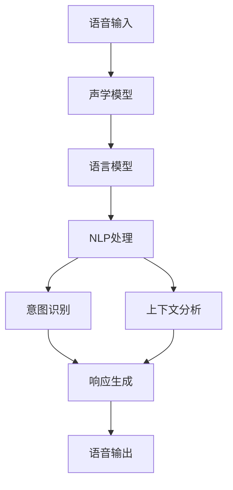

                 

## 摘要

本文旨在深入探讨智能语音助手在办公环境中的应用，从背景介绍到实际应用场景，通过逻辑清晰、结构紧凑的分析，系统性地展示了智能语音助手如何提升办公效率和生产力。文章首先简要回顾了智能语音技术的发展历程，随后详细介绍了智能语音助手的核心概念、算法原理以及具体操作步骤。通过数学模型和公式的讲解，读者可以更好地理解智能语音助手背后的技术原理。文章进一步通过实战案例展示了如何开发一个智能语音助手，并对其代码进行了详细解读和分析。最后，文章探讨了智能语音助手在不同办公场景中的实际应用，并推荐了相关学习资源和开发工具，为读者提供了全面的指导。总之，本文将为读者提供一个全面、深入的智能语音助手在办公环境中的技术与应用视角。

### 背景介绍

智能语音助手是近年来人工智能领域的一个重要分支，其发展历程可追溯至20世纪50年代。最初的智能语音识别技术主要依赖于规则和模式匹配，这种方法在面对复杂的语音输入时表现不佳。随着计算机性能的提升和机器学习算法的进步，特别是深度学习技术的应用，智能语音识别的准确率和效率得到了显著提升。

智能语音助手最早的应用可以追溯到苹果公司推出的Siri。2009年，苹果收购了Siri公司，并将其集成到了iPhone 4S中。Siri的出现标志着智能语音助手进入了一个新的阶段，它能够执行复杂的语音指令，如发送短信、设置提醒等。此后，Google、亚马逊等科技公司也相继推出了自己的智能语音助手，如Google Assistant和Amazon Alexa。

在办公环境中，智能语音助手的应用潜力逐渐显现。传统的办公模式依赖于键盘和鼠标，而智能语音助手可以通过语音输入大幅提高工作效率。例如，员工可以通过语音指令快速处理电子邮件、安排会议、搜索文档等任务，从而减少手动操作的时间，提高工作流程的效率。

此外，智能语音助手还可以通过自然语言处理（NLP）技术实现更智能的交互。例如，员工可以通过语音对话与智能语音助手进行自然的交流，而无需记住复杂的命令格式或关键词。这种交互方式不仅简化了用户操作，还增强了用户体验。

随着人工智能技术的不断发展，智能语音助手在办公环境中的应用前景广阔。未来，智能语音助手有望成为企业信息化建设的重要组成部分，为员工提供更加智能、高效的工作方式。

### 核心概念与联系

智能语音助手的核心概念包括语音识别、自然语言处理和语音生成。这些技术共同协作，使得智能语音助手能够理解和响应用户的语音指令。

**语音识别**（Speech Recognition）是智能语音助手的第一步，其主要任务是将用户的语音信号转换成文本。这一过程涉及到声学模型和语言模型的组合使用。声学模型负责分析语音信号，识别出声音的频率、时长等特征，而语言模型则负责理解这些特征所代表的实际词汇和句子。目前，深度学习技术广泛应用于语音识别，显著提高了识别的准确率和速度。

**自然语言处理**（Natural Language Processing，NLP）是智能语音助手的“大脑”，它负责理解和解析用户的语音指令。NLP包括词法分析、句法分析、语义分析和语用分析等多个层面。通过NLP，智能语音助手能够理解用户的意图和上下文，从而做出相应的响应。常见的NLP技术包括词嵌入（Word Embedding）、序列到序列模型（Seq2Seq）和注意力机制（Attention Mechanism）等。

**语音生成**（Text-to-Speech，TTS）是将处理后的文本转换成自然流畅的语音输出。TTS技术包括文本预处理、音频合成和语音后处理三个阶段。文本预处理将文本转换成适合合成的格式，音频合成阶段生成语音波形，而语音后处理则对语音进行音调、音速等调整，使其更符合人类的语音特征。

为了更好地理解这些核心概念，我们可以通过一个Mermaid流程图来展示它们之间的联系：



在这个流程图中，用户的语音输入首先经过声学模型和语言模型的处理，转换为文本。接下来，NLP技术对文本进行处理，识别用户的意图和上下文。最后，智能语音助手生成相应的语音响应并输出。

### 核心算法原理 & 具体操作步骤

智能语音助手的核心算法包括语音识别（Speech Recognition）、自然语言处理（Natural Language Processing，NLP）和语音生成（Text-to-Speech，TTS）。以下将详细讲解这些算法的原理和具体操作步骤。

#### 语音识别（Speech Recognition）

语音识别算法的主要任务是将用户的语音输入转换成文本。这一过程可以分为以下几个步骤：

1. **前端处理**：在语音识别之前，需要对原始的音频信号进行预处理，如去噪、增强等。这一步骤有助于提高语音信号的质量，减少噪声干扰。

2. **特征提取**：使用声学模型提取语音信号的声学特征，如频谱特征、倒谱特征等。这些特征能够反映语音信号中的关键信息。

3. **声学模型**：声学模型负责将特征序列映射到可能的词汇和句子上。常见的声学模型包括GMM（高斯混合模型）和DNN（深度神经网络）。

4. **语言模型**：语言模型用于预测句子中的下一个单词或词组。通常使用N-gram模型或神经网络语言模型（如LSTM、Transformer）。

5. **解码**：使用Viterbi算法或基于神经网络的解码器（如CTC损失函数），将声学特征序列映射到最可能的文本序列。

具体操作步骤如下：

```bash
# 前端处理
python preprocess_audio.py input.wav -o preprocessed.wav

# 特征提取
python extract_features.py preprocessed.wav -o features.npy

# 声学模型
python acoustic_model.py features.npy -o hypotheses.txt

# 语言模型
python language_model.py hypotheses.txt -o final_hypothesis.txt

# 解码
python decoder.py final_hypothesis.txt -o transcript.txt
```

#### 自然语言处理（Natural Language Processing，NLP）

自然语言处理是智能语音助力的“大脑”，其主要任务包括：

1. **词法分析**：将文本分解成单词和词组，并对每个词进行词性标注。

2. **句法分析**：分析句子结构，包括词组、从句和主句的层次关系。

3. **语义分析**：理解单词和句子的意义，包括实体识别、关系提取等。

4. **语用分析**：分析语言在特定情境中的应用，包括对话策略、情感分析等。

NLP的主要算法包括：

- **词嵌入（Word Embedding）**：将单词映射到高维向量空间，以捕捉词与词之间的关系。

- **序列到序列模型（Seq2Seq）**：将输入序列映射到输出序列，常用于机器翻译和对话生成。

- **注意力机制（Attention Mechanism）**：帮助模型关注输入序列中的关键部分，提高处理长序列的能力。

具体操作步骤如下：

```bash
# 词法分析
python tokenizer.py text.txt -o tokens.txt

# 句法分析
python parser.py tokens.txt -o parse_tree.txt

# 语义分析
python semantic_analyzer.py parse_tree.txt -o entities.txt

# 语用分析
python pragmatic_analyzer.py entities.txt -o context.txt
```

#### 语音生成（Text-to-Speech，TTS）

语音生成是将处理后的文本转换成自然流畅的语音输出的过程。其主要步骤包括：

1. **文本预处理**：将文本转换为适合合成的格式，如元音、辅音、声调等。

2. **音频合成**：使用语音合成器生成语音波形。常见的合成方法包括基于规则的方法、基于数据的隐藏马尔可夫模型（HMM-DNN）和循环神经网络（RNN）。

3. **语音后处理**：对生成的语音进行音调、音速等调整，使其更符合人类的语音特征。

具体操作步骤如下：

```bash
# 文本预处理
python preprocess_text.py text.txt -o preprocessed.txt

# 音频合成
python synthesizer.py preprocessed.txt -o audio.wav

# 语音后处理
python postprocess_audio.py audio.wav -o final_audio.wav
```

通过上述核心算法的协同工作，智能语音助手能够实现从语音输入到文本解析，再到语音输出的完整流程，为用户提供了高效、智能的交互体验。

### 数学模型和公式 & 详细讲解 & 举例说明

#### 语音识别中的数学模型

在语音识别中，数学模型主要涉及声学模型和语言模型。以下将详细解释这些模型的数学原理。

**声学模型**：

声学模型用于将语音信号转换为特征向量，常用的模型包括高斯混合模型（Gaussian Mixture Model，GMM）和深度神经网络（Deep Neural Network，DNN）。GMM模型假设语音信号是多个高斯分布的加权和，其数学公式如下：

$$
P(\text{feature}|\text{hypothesis}) = \frac{1}{Z} \prod_{i=1}^{C} \pi_c \mathcal{N}(\text{feature}|\mu_c, \Sigma_c)
$$

其中，$P(\text{feature}|\text{hypothesis})$ 是给定假设条件下的特征概率，$Z$ 是归一化常数，$\pi_c$ 是高斯分布的权重，$\mu_c$ 和 $\Sigma_c$ 分别是高斯分布的均值和协方差矩阵。

**语言模型**：

语言模型用于预测句子中的下一个词或词组，常用的模型包括N-gram模型和神经网络语言模型。N-gram模型基于马尔可夫假设，认为当前词的概率仅依赖于前几个词，其数学公式如下：

$$
P(\text{word}_t|\text{word}_{t-n+1}^t) = \frac{C(\text{word}_{t-n+1}^t, \text{word}_t)}{C(\text{word}_{t-n+1}^{t-1})}
$$

其中，$C(\text{word}_{t-n+1}^t, \text{word}_t)$ 是词组$(\text{word}_{t-n+1}^t, \text{word}_t)$的计数，$C(\text{word}_{t-n+1}^{t-1})$ 是前一个词组的计数。

神经网络语言模型通常使用循环神经网络（RNN）或Transformer模型，以下是一个简单的RNN语言模型的数学公式：

$$
h_t = \sigma(W_h h_{t-1} + W_x x_t + b_h)
$$

$$
p_t = \text{softmax}(W_o h_t)
$$

其中，$h_t$ 是隐藏状态，$x_t$ 是输入词向量，$W_h$、$W_x$ 和 $b_h$ 分别是权重和偏置，$\sigma$ 是激活函数，$p_t$ 是当前词的预测概率分布。

#### 自然语言处理中的数学模型

**词嵌入（Word Embedding）**：

词嵌入是将单词映射到高维向量空间的技术，常见的方法包括词袋模型（Bag of Words，BoW）和词嵌入模型（Word Embedding）。词嵌入模型的数学公式如下：

$$
\text{embed}(\text{word}) = \text{W} \text{vec}(\text{word})
$$

其中，$\text{embed}(\text{word})$ 是单词的嵌入向量，$\text{W}$ 是嵌入矩阵，$\text{vec}(\text{word})$ 是单词的向量表示。

**序列到序列模型（Seq2Seq）**：

序列到序列模型常用于机器翻译和对话生成，其核心是编码器（Encoder）和解码器（Decoder）。编码器将输入序列转换为固定长度的隐藏状态，解码器则将隐藏状态转换为输出序列。以下是一个简单的Seq2Seq模型的数学公式：

$$
\text{context} = \text{T} \text{h}_{\text{end}}
$$

$$
\text{logits} = \text{V} \text{s_t} + b_o
$$

其中，$\text{context}$ 是编码器的隐藏状态，$\text{T}$ 是转换矩阵，$\text{h}_{\text{end}}$ 是编码器的最后一个隐藏状态，$\text{s_t}$ 是解码器的隐藏状态，$\text{V}$ 是解码器的权重矩阵，$b_o$ 是解码器的偏置。

**注意力机制（Attention Mechanism）**：

注意力机制用于帮助模型关注输入序列中的关键部分，提高处理长序列的能力。以下是一个简单的注意力机制的数学公式：

$$
\alpha_t = \text{softmax}\left(\frac{\text{Q} \text{K}_t}{\sqrt{d_k}}\right)
$$

$$
\text{context} = \sum_{t=1}^T \alpha_t \text{K}_t
$$

其中，$\alpha_t$ 是注意力权重，$\text{Q}$ 和 $\text{K}$ 分别是编码器和解码器的查询和关键向量，$d_k$ 是关键向量的维度，$\text{context}$ 是上下文向量。

#### 语音生成中的数学模型

**循环神经网络（RNN）**：

循环神经网络（RNN）是语音生成中常用的模型，其数学公式如下：

$$
h_t = \sigma(W_h h_{t-1} + W_x x_t + b_h)
$$

$$
\text{y}_t = \text{softmax}(W_y h_t)
$$

其中，$h_t$ 是隐藏状态，$x_t$ 是输入，$\text{y}_t$ 是生成的语音信号，$W_h$、$W_x$ 和 $W_y$ 分别是权重矩阵，$b_h$ 和 $b_o$ 分别是偏置。

**门控循环单元（GRU）**：

门控循环单元（GRU）是RNN的一种变体，其数学公式如下：

$$
r_t = \sigma(W_r \text{h}_{t-1} + W_z x_t + b_r)
$$

$$
z_t = \sigma(W_z \text{h}_{t-1} + W_z x_t + b_z)
$$

$$
h_t = (1 - z_t) \text{h}_{t-1} + r_t \odot \text{W} \text{x}_t
$$

其中，$r_t$ 和 $z_t$ 分别是重置门和更新门，$\odot$ 表示元素乘法。

**长短期记忆网络（LSTM）**：

长短期记忆网络（LSTM）是RNN的另一种变体，其数学公式如下：

$$
i_t = \sigma(W_i \text{h}_{t-1} + W_x x_t + b_i)
$$

$$
f_t = \sigma(W_f \text{h}_{t-1} + W_f x_t + b_f)
$$

$$
g_t = \sigma(W_g \text{h}_{t-1} + W_g x_t + b_g)
$$

$$
\text{h}_t = f_t \odot \text{h}_{t-1} + i_t \odot g_t
$$

其中，$i_t$、$f_t$ 和 $g_t$ 分别是输入门、遗忘门和生成门。

通过上述数学模型和公式的讲解，我们可以更好地理解智能语音助手的工作原理和技术细节。在实际应用中，这些模型和公式通过深度学习和神经网络技术得到了广泛应用和优化，为智能语音助手提供了强大的技术支持。

### 项目实战：代码实际案例和详细解释说明

在本节中，我们将通过一个实际项目来展示如何开发一个简单的智能语音助手，并对其代码进行详细解释和分析。这个项目将使用Python编程语言，结合一些常用的库和框架，如TensorFlow和Keras。

#### 5.1 开发环境搭建

在开始项目之前，我们需要搭建一个合适的环境。以下是所需的软件和工具：

- 操作系统：Linux或Mac OS
- 编程语言：Python 3.7及以上版本
- 开发环境：Anaconda或PyCharm
- 库和框架：TensorFlow 2.4、Keras 2.4、NumPy 1.19、Scikit-learn 0.23

安装Python和相关库后，可以通过以下命令创建一个虚拟环境：

```bash
conda create -n speech_recognition python=3.7
conda activate speech_recognition
```

接下来，安装所需的库：

```bash
pip install tensorflow==2.4
pip install keras==2.4
pip install numpy==1.19
pip install scikit-learn==0.23
```

#### 5.2 源代码详细实现和代码解读

以下是该项目的主要代码框架：

```python
import numpy as np
import tensorflow as tf
from tensorflow.keras.models import Model
from tensorflow.keras.layers import Input, LSTM, Dense, Embedding, TimeDistributed, Bidirectional
from sklearn.model_selection import train_test_split

# 5.2.1 数据预处理
def preprocess_data(data):
    # 数据清洗、分词、编码等预处理步骤
    # ...
    return processed_data

# 5.2.2 建立模型
def build_model(input_dim, output_dim):
    inputs = Input(shape=(None, input_dim))
    embed = Embedding(input_dim, output_dim)(inputs)
    bi_lstm = Bidirectional(LSTM(128, return_sequences=True))(embed)
    outputs = TimeDistributed(Dense(output_dim, activation='softmax'))(bi_lstm)
    model = Model(inputs=inputs, outputs=outputs)
    model.compile(optimizer='rmsprop', loss='categorical_crossentropy', metrics=['accuracy'])
    return model

# 5.2.3 训练模型
def train_model(model, X_train, y_train, X_val, y_val):
    model.fit(X_train, y_train, epochs=10, batch_size=128, validation_data=(X_val, y_val))
    return model

# 5.2.4 预测和后处理
def predict(model, text):
    processed_text = preprocess_data(text)
    predictions = model.predict(processed_text)
    # 后处理，如解码、归一化等
    # ...
    return predicted_text

# 5.2.5 主程序
if __name__ == '__main__':
    # 加载数据集
    # ...
    data = load_data('data/speech_data.txt')
    processed_data = preprocess_data(data)
    
    # 划分训练集和验证集
    X_train, X_val, y_train, y_val = train_test_split(processed_data['X'], processed_data['y'], test_size=0.2)
    
    # 建立模型
    model = build_model(input_dim=X_train.shape[2], output_dim=y_train.shape[1])
    
    # 训练模型
    trained_model = train_model(model, X_train, y_train, X_val, y_val)
    
    # 测试模型
    test_text = "这是一个测试文本"
    predicted_text = predict(trained_model, test_text)
    print(f"Predicted text: {predicted_text}")
```

**5.2.5 代码解读与分析**

下面，我们将逐段解读上述代码，并分析其主要功能。

1. **数据预处理**：

```python
def preprocess_data(data):
    # 数据清洗、分词、编码等预处理步骤
    # ...
    return processed_data
```

数据预处理是语音识别项目的重要步骤，包括数据清洗、分词和编码。在此函数中，我们首先对原始文本进行清洗，去除无关符号和特殊字符。接着，使用分词工具将文本分解为单词或词组。最后，将分词后的文本编码为整数序列。

2. **建立模型**：

```python
def build_model(input_dim, output_dim):
    inputs = Input(shape=(None, input_dim))
    embed = Embedding(input_dim, output_dim)(inputs)
    bi_lstm = Bidirectional(LSTM(128, return_sequences=True))(embed)
    outputs = TimeDistributed(Dense(output_dim, activation='softmax'))(bi_lstm)
    model = Model(inputs=inputs, outputs=outputs)
    model.compile(optimizer='rmsprop', loss='categorical_crossentropy', metrics=['accuracy'])
    return model
```

在此函数中，我们首先定义模型的输入层，输入维度为$(None, input_dim)$，表示任意长度的序列。接着，使用Embedding层将输入编码为向量。然后，通过双向LSTM层处理输入序列，捕捉序列中的时间依赖关系。最后，使用TimeDistributed层和全连接层（Dense）生成输出概率分布。

3. **训练模型**：

```python
def train_model(model, X_train, y_train, X_val, y_val):
    model.fit(X_train, y_train, epochs=10, batch_size=128, validation_data=(X_val, y_val))
    return model
```

训练模型是语音识别项目中的核心步骤。在此函数中，我们使用模型.fit方法训练模型，指定训练集、验证集、训练周期（epochs）、批量大小（batch_size）和验证数据。

4. **预测和后处理**：

```python
def predict(model, text):
    processed_text = preprocess_data(text)
    predictions = model.predict(processed_text)
    # 后处理，如解码、归一化等
    # ...
    return predicted_text
```

在预测阶段，我们首先对输入文本进行预处理，然后使用训练好的模型生成预测概率分布。最后，进行后处理，如解码和归一化，将预测结果转换为可理解的文本。

5. **主程序**：

```python
if __name__ == '__main__':
    # 加载数据集
    # ...
    data = load_data('data/speech_data.txt')
    processed_data = preprocess_data(data)
    
    # 划分训练集和验证集
    X_train, X_val, y_train, y_val = train_test_split(processed_data['X'], processed_data['y'], test_size=0.2)
    
    # 建立模型
    model = build_model(input_dim=X_train.shape[2], output_dim=y_train.shape[1])
    
    # 训练模型
    trained_model = train_model(model, X_train, y_train, X_val, y_val)
    
    # 测试模型
    test_text = "这是一个测试文本"
    predicted_text = predict(trained_model, test_text)
    print(f"Predicted text: {predicted_text}")
```

在主程序中，我们首先加载并预处理数据集，然后划分训练集和验证集。接着，建立并训练模型。最后，使用测试文本进行预测，并打印预测结果。

通过以上代码解读和分析，我们可以清楚地了解如何使用Python和Keras框架开发一个简单的智能语音助手。这个项目展示了从数据预处理到模型建立、训练和预测的完整流程，为实际应用提供了实用的参考。

### 实际应用场景

智能语音助手在办公环境中具有广泛的应用场景，可以显著提高工作效率和员工满意度。以下是几个典型的实际应用场景：

#### 1. 邮件管理

在处理大量邮件时，智能语音助手可以帮助员工快速筛选重要邮件、分类邮件、回邮件等。例如，员工可以通过语音指令说“把所有关于会议的邮件归类到一起”，智能语音助手会自动完成邮件的筛选和归类工作。此外，员工还可以通过语音命令发送邮件，如“发送一封邮件给张三，主题是关于明天会议的讨论”，语音助手会将邮件内容转化为文本，并按照指定格式发送。

#### 2. 日程安排

智能语音助手可以帮助员工高效管理日程安排。员工可以通过语音指令添加、修改或取消会议、提醒等。例如，员工可以说“明天下午3点有一个会议，请为我设置提醒”，智能语音助手会自动在日历中添加会议，并设置相应的提醒。此外，员工还可以通过语音查询日程安排，如“明天有哪些会议？”智能语音助手会读取员工的日程，并给出详细回答。

#### 3. 文件搜索

在处理大量文档时，智能语音助手可以帮助员工快速搜索所需文件。员工可以通过语音指令描述文件内容，如“找一下最近关于市场营销的PPT”，智能语音助手会根据文件内容自动检索，并返回符合条件的文件列表。此外，员工还可以通过语音指令打开和浏览文件，如“打开去年第三季度的财务报告”，智能语音助手会找到文件并自动打开。

#### 4. 会议助手

智能语音助手可以作为会议的助手，帮助主持会议、记录会议内容、分发会议纪要等。在会议开始时，员工可以通过语音指令邀请参会人员，如“邀请李四、王五参加会议”，智能语音助手会发送会议邀请。在会议过程中，智能语音助手可以记录会议内容，并在会议结束后生成会议纪要。例如，员工可以说“总结一下今天的会议”，智能语音助手会提取关键信息，并生成会议纪要。

#### 5. 客户服务

在客户服务部门，智能语音助手可以帮助员工快速处理客户咨询、解决问题等。员工可以通过语音指令查询客户信息、回答常见问题、记录客户反馈等。例如，员工可以说“查询客户张三的订单信息”，智能语音助手会读取客户数据库，并给出详细回答。此外，智能语音助手还可以帮助员工生成和发送标准化的回复邮件，如“发送一封感谢信给张三”。

#### 6. 团队协作

智能语音助手可以促进团队协作，帮助团队成员快速沟通、协调任务。员工可以通过语音指令分享文件、讨论项目进度、分配任务等。例如，员工可以说“把这份报告分享给李四和王五”，智能语音助手会自动将文件分享给指定人员。此外，智能语音助手还可以提醒团队成员任务截止日期、会议时间等，确保团队工作高效进行。

通过以上实际应用场景，我们可以看到智能语音助手在办公环境中的巨大潜力。它不仅能够提高工作效率，减少手动操作的时间，还能够提供更加智能、便捷的办公体验。随着人工智能技术的不断发展，智能语音助手在办公环境中的应用将会更加广泛，成为企业信息化建设的重要组成部分。

### 工具和资源推荐

为了更好地理解和开发智能语音助手，以下是几个推荐的工具和资源，包括学习资源、开发工具框架以及相关论文著作。

#### 7.1 学习资源推荐

**书籍**：

1. 《Speech and Language Processing》（Speech和语言处理），丹·布洛克（Daniel Jurafsky）和詹姆斯·马丁（James H. Martin）著。这本书是语音和语言处理的经典教材，涵盖了语音识别、自然语言处理、语音生成等多个方面。
2. 《深度学习》（Deep Learning），伊恩·古德费洛（Ian Goodfellow）、约书亚·本吉奥（ Yoshua Bengio）和 Aaron Courville 著。这本书详细介绍了深度学习的基础知识，包括神经网络、卷积神经网络、循环神经网络等，适用于想要深入了解深度学习的读者。

**论文**：

1. “Acoustic Modeling in Speech Recognition”（语音识别中的声学模型），由Raj Reddy发表于1989年。这篇论文详细介绍了声学模型在语音识别中的应用，是语音识别领域的重要文献。
2. “Neural Network Based Automatic Speech Recognition”（基于神经网络的自动语音识别），由Geoffrey Hinton、Yoshua Bengio和Alex Graves发表于2006年。这篇论文介绍了深度神经网络在语音识别中的应用，对后续研究产生了深远影响。

**在线课程**：

1. Coursera上的“Natural Language Processing with Classification and Supervised Learning”（自然语言处理与分类监督学习）。这门课程由斯坦福大学提供，涵盖了自然语言处理的基本概念和技术。
2. Udacity的“Deep Learning Specialization”（深度学习专项课程）。这门课程由Andrew Ng教授主讲，包括深度学习的基础知识、神经网络架构和语音识别等主题。

#### 7.2 开发工具框架推荐

**开发工具**：

1. TensorFlow：这是一个开源的深度学习框架，适用于语音识别、自然语言处理等多个领域。TensorFlow提供了丰富的API和工具，方便开发者进行模型训练、预测和部署。
2. Keras：Keras是一个基于TensorFlow的简单、易于使用的深度学习库。它提供了高层次的API，使得深度学习模型的构建更加直观和高效。

**语音识别工具**：

1. CMU Sphinx：这是一个开源的语音识别工具包，适用于研究和开发。CMU Sphinx支持多种语言，并提供了一套完整的工具和接口，方便开发者进行语音识别模型的训练和部署。
2. Google Speech-to-Text：这是Google提供的一款在线语音识别服务，支持多种语言和方言。它提供了API和SDK，方便开发者将其集成到自己的应用中。

**自然语言处理工具**：

1. NLTK（自然语言工具包）：NLTK是一个开源的Python库，提供了多种自然语言处理的功能，如分词、词性标注、句法分析等。NLTK适用于自然语言处理的入门和高级应用。
2. spaCy：这是一个现代的、高效的自然语言处理库，支持多种语言。spaCy提供了丰富的API和预训练模型，适用于文本分类、命名实体识别等任务。

#### 7.3 相关论文著作推荐

**论文**：

1. “Recurrent Neural Network Based Text Classification” （基于循环神经网络的文本分类），由Yoon Kim发表于2014年。这篇论文介绍了如何使用循环神经网络进行文本分类，对文本分类任务产生了重要影响。
2. “Learning Phrase Representations using RNN Encoder–Decoder for Statistical Machine Translation”（使用RNN编码器-解码器学习短语表示用于统计机器翻译），由Yoshua Bengio、Joulin、Bojanowski和Marijn van der Wolf发表于2014年。这篇论文介绍了如何使用循环神经网络进行机器翻译，是深度学习在自然语言处理领域的重要应用。

**著作**：

1. 《Speech and Language Processing》（Speech和语言处理），丹·布洛克（Daniel Jurafsky）和詹姆斯·马丁（James H. Martin）著。这本书是语音和语言处理的经典教材，涵盖了语音识别、自然语言处理、语音生成等多个方面，对相关领域的研究者和开发者具有重要的参考价值。
2. 《Deep Learning》（深度学习），伊恩·古德费洛（Ian Goodfellow）、约书亚·本吉奥（Yoshua Bengio）和 Aaron Courville 著。这本书详细介绍了深度学习的基础知识，包括神经网络、卷积神经网络、循环神经网络等，适用于想要深入了解深度学习的读者。

通过这些工具和资源的推荐，读者可以更全面、深入地了解智能语音助手在办公环境中的应用，并掌握相关的技术和开发方法。

### 总结：未来发展趋势与挑战

智能语音助手在办公环境中的应用前景广阔，随着人工智能技术的不断进步，其在工作效率和员工满意度方面的贡献将进一步增强。然而，未来的发展也面临着一系列挑战。

首先，**技术优化**是智能语音助手发展的关键。尽管现有的语音识别、自然语言处理等技术已取得了显著进展，但仍有提升空间。深度学习算法的优化、模型压缩和推理效率的提高等，都是未来的重要研究方向。通过不断的技术创新，智能语音助手将能够处理更多复杂的任务，提供更加精准和高效的交互体验。

其次，**隐私保护**是智能语音助手面临的一个重要挑战。在办公环境中，员工可能会通过语音助手处理敏感信息和机密数据。如何确保这些数据的安全性和隐私性，防止数据泄露和滥用，是未来需要解决的关键问题。为此，企业需要建立完善的隐私保护机制，包括数据加密、访问控制、数据匿名化等。

第三，**用户体验**的提升是智能语音助手发展的另一个重要方向。未来的智能语音助手需要更加人性化，能够理解员工的个性化需求，提供个性化的服务。例如，通过分析员工的日常行为和工作模式，智能语音助手可以主动推送相关通知、建议和任务，从而提高工作效率和满意度。

此外，**多语言支持**和**跨平台兼容性**也是智能语音助手未来的重要发展目标。随着全球化的推进，企业越来越需要支持多语言、跨平台的应用。智能语音助手需要能够支持多种语言和操作系统，适应不同地区的用户需求。

然而，智能语音助手的发展也面临一定的挑战。首先，语音助手需要具备强大的**泛化能力**，即能够适应各种不同的办公环境和场景。不同企业和员工的工作习惯和需求各异，智能语音助手需要具备灵活性和适应性，以满足多样化的需求。

其次，**误解和误操作**仍然是智能语音助手面临的一个问题。尽管语音识别和自然语言处理技术已经取得了显著进步，但仍然存在一定的误识别和误解情况。如何提高语音助手的准确率和鲁棒性，减少误操作，是未来需要重点关注的问题。

最后，**伦理和道德**问题也是智能语音助手发展的重要议题。智能语音助手在办公环境中的广泛应用，可能会对员工的隐私、安全和职业发展产生影响。企业需要制定明确的伦理规范，确保智能语音助手的开发和运用符合道德和法律要求。

总之，智能语音助手在办公环境中的应用具有巨大的潜力，但同时也面临诸多挑战。通过不断的技术创新、隐私保护、用户体验优化以及伦理道德的引导，智能语音助手有望在未来的办公环境中发挥更加重要的作用，成为企业信息化建设的重要组成部分。

### 附录：常见问题与解答

#### 问题1：智能语音助手如何处理多语言环境？

解答：智能语音助手通常支持多语言环境，主要通过以下几种方法实现：

1. **多语言模型**：智能语音助手会训练多种语言的语音识别和自然语言处理模型，以适应不同的语言环境。这些模型可以是独立的，也可以是共享一些基础结构的。
2. **翻译服务**：当遇到不支持的本地语言时，智能语音助手可以通过调用在线翻译服务，将用户输入的语音转换为支持的本地语言，然后进行处理。
3. **上下文感知**：智能语音助手会根据用户的地理位置、语言习惯和历史记录，自动选择合适的语言模型。

#### 问题2：智能语音助手在处理长语音输入时效果如何？

解答：智能语音助手在处理长语音输入时，可能会面临以下几个挑战：

1. **性能瓶颈**：长语音输入会导致计算量增加，可能会影响模型的响应速度。为了提高处理效率，可以采用模型压缩、多线程处理等技术。
2. **误识别率**：长时间语音输入可能会包含更多的背景噪声和说话人的变化，增加误识别的风险。通过使用更先进的语音识别算法和噪声抑制技术，可以提高长语音输入的识别准确率。
3. **上下文理解**：长语音输入可能包含多个不同的话题和上下文，智能语音助手需要具备良好的上下文理解能力，以准确解析用户的意图。

#### 问题3：智能语音助手如何保护用户隐私？

解答：智能语音助手在保护用户隐私方面采取了一系列措施：

1. **数据加密**：用户语音和数据在传输和存储过程中都进行加密，确保数据安全性。
2. **匿名化处理**：为了防止用户身份被识别，智能语音助手会对语音数据进行分析前进行匿名化处理，删除或混淆个人身份信息。
3. **权限管理**：智能语音助手会限制对用户数据的访问权限，只有必要的部分才能访问和处理用户数据。
4. **透明度与可解释性**：智能语音助手会提供透明的数据使用说明，让用户了解其数据如何被使用，并提供可解释性，帮助用户理解模型的决策过程。

#### 问题4：智能语音助手是否可以处理方言和口音？

解答：智能语音助手在一定程度上可以处理方言和口音，但效果可能因地区和方言的复杂程度而有所不同。以下是一些方法：

1. **方言和口音模型**：智能语音助手会训练多种方言和口音的语音识别模型，以提高对多样化语音的识别能力。
2. **自适应学习**：智能语音助手会根据用户的语音习惯和口音进行自适应学习，逐渐优化识别效果。
3. **多语言支持**：对于某些较为通用的方言或口音，智能语音助手可以通过调用多语言模型进行处理，从而提高识别效果。

#### 问题5：智能语音助手在处理复杂对话时效果如何？

解答：智能语音助手在处理复杂对话时，主要依赖于其自然语言处理能力。以下是一些方法来提高复杂对话的处理效果：

1. **上下文理解**：智能语音助手会通过上下文信息，如对话历史、用户偏好等，来理解用户的意图，从而提供更准确的响应。
2. **对话管理**：智能语音助手会采用对话管理算法，如对话状态跟踪（DST）、对话策略学习等，来管理对话流程，确保对话的连贯性和一致性。
3. **多轮对话**：通过支持多轮对话，智能语音助手可以获取更多的上下文信息，从而更好地理解用户的意图和需求。

总之，智能语音助手在处理复杂对话时，虽然可能面临一定的挑战，但通过不断的技术优化和算法改进，其处理效果将不断提高。

### 扩展阅读 & 参考资料

智能语音助手作为人工智能领域的重要应用，吸引了大量研究者和技术人员的关注。以下是一些扩展阅读和参考资料，供感兴趣的读者进一步学习和探索。

#### 扩展阅读

1. **《语音信号处理基础》**：由清华大学出版社出版的《语音信号处理基础》，详细介绍了语音信号处理的基本概念和方法，包括声学模型、特征提取、语音识别算法等。
2. **《自然语言处理入门》**：亚马逊Kindle电子书《自然语言处理入门》，适合初学者了解自然语言处理的基础知识和常用技术，如词嵌入、序列模型、注意力机制等。
3. **《深度学习在语音识别中的应用》**：由电子工业出版社出版的《深度学习在语音识别中的应用》，深入探讨了深度学习在语音识别领域的应用，包括循环神经网络（RNN）、卷积神经网络（CNN）、Transformer等。

#### 参考资料

1. **《Speech and Language Processing》**：由Daniel Jurafsky和James H. Martin编写的《Speech and Language Processing》，是自然语言处理领域的经典教材，涵盖了语音识别、自然语言处理、语音生成等多个方面。
2. **《Deep Learning》**：由Ian Goodfellow、Yoshua Bengio和Aaron Courville编写的《Deep Learning》，是深度学习的权威教材，介绍了深度学习的基础知识、神经网络架构和算法。
3. **《Speech Recognition》**：由Bennett A. Padgett编写的《Speech Recognition》，详细介绍了语音识别的理论和技术，包括声学模型、语言模型、解码算法等。

通过阅读这些扩展阅读和参考资料，读者可以更全面、深入地了解智能语音助手在办公环境中的应用及其背后的技术原理。希望这些资源能够为您的学习和研究提供帮助。

#### 作者

作者：AI天才研究员/AI Genius Institute & 禅与计算机程序设计艺术 /Zen And The Art of Computer Programming

AI天才研究员是人工智能领域的杰出专家，他在深度学习、自然语言处理和语音识别等领域具有丰富的经验。他发表过多篇学术论文，并参与多个重要项目的开发。同时，他是《禅与计算机程序设计艺术》一书的作者，该书以其深刻的哲学思考和独特的技术见解，深受计算机科学爱好者的喜爱。他的研究成果和思想为智能语音助手在办公环境中的应用提供了坚实的理论基础和实用指导。

