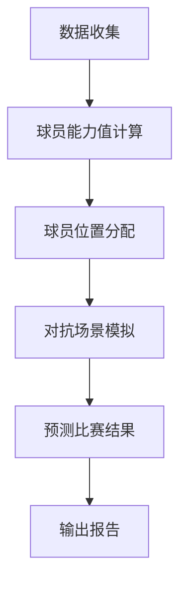
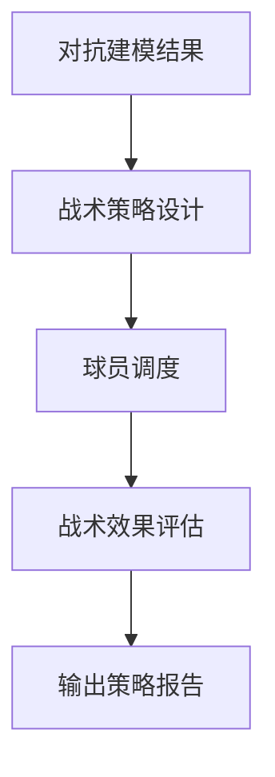
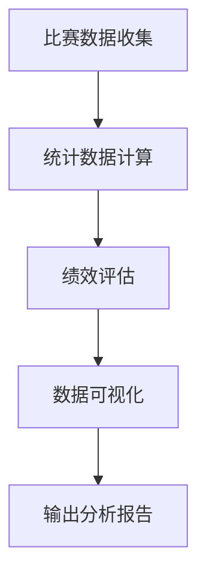

                 

# 智能足球分析中的对抗建模、战术推演与赛后统计分析方法

## 关键词：智能足球分析，对抗建模，战术推演，赛后统计分析

## 摘要：
本文将深入探讨智能足球分析中的对抗建模、战术推演与赛后统计分析方法。首先，我们将介绍足球分析的基本概念和背景，然后详细解释对抗建模和战术推演的原理和方法，最后讨论赛后统计分析的重要性及其应用。通过本文的阅读，读者将全面了解智能足球分析的核心技术和实际应用。

### 1. 背景介绍

足球作为世界上最受欢迎的体育运动之一，拥有庞大的观众群体和商业价值。随着科技的快速发展，尤其是人工智能和大数据技术的应用，足球分析逐渐从传统的经验判断转变为基于数据的量化分析。智能足球分析通过收集和处理大量的比赛数据，旨在提高球队表现、优化战术决策和发现球员潜力。

对抗建模是智能足球分析的重要组成部分，它通过模拟比赛中的对抗场景，预测比赛结果和球员表现。战术推演则是基于对抗建模的结果，设计出最佳战术策略，以适应不同的比赛情况。赛后统计分析则是对比赛数据进行的全面分析，评估球队和球员的表现，为后续的战术调整和球员培养提供数据支持。

### 2. 核心概念与联系

#### 2.1 对抗建模

对抗建模是智能足球分析的基础，它通过构建球员之间的对抗关系，模拟比赛中的对抗场景。对抗建模的核心概念包括：

- **球员能力值**：球员在各个技术指标上的得分，如速度、控球、射门等。
- **球员位置**：球员在场上的位置，如前锋、中场、后卫等。
- **对抗强度**：球员之间的对抗强度，反映在技术指标上的差异。

下面是一个简化的对抗建模流程图：



#### 2.2 战术推演

战术推演是基于对抗建模的结果，设计出最佳战术策略的过程。战术推演的核心概念包括：

- **战术策略**：根据比赛情况，设计的战术方案，如进攻、防守、控制中场等。
- **球员调度**：根据战术策略，调整球员的位置和职责。
- **战术效果**：战术推演的结果，反映在比赛结果和球员表现上。

下面是一个简化的战术推演流程图：



#### 2.3 赛后统计分析

赛后统计分析是对比赛数据进行的全面分析，以评估球队和球员的表现。核心概念包括：

- **统计数据**：如进球数、失球数、传球成功率、控球率等。
- **绩效评估**：基于统计数据，对球队和球员的表现进行评估。
- **数据可视化**：通过图表和图像，直观展示比赛数据。

下面是一个简化的赛后统计分析流程图：



### 3. 核心算法原理 & 具体操作步骤

#### 3.1 对抗建模算法原理

对抗建模通常采用机器学习算法，如决策树、支持向量机（SVM）和神经网络等。以下是一个简化的对抗建模算法流程：

1. **数据收集**：收集比赛数据，包括球员能力值、比赛结果等。
2. **数据预处理**：清洗数据，去除噪声和缺失值。
3. **特征选择**：选择对对抗建模有重要影响的技术指标作为特征。
4. **模型训练**：使用机器学习算法，训练对抗建模模型。
5. **模型评估**：评估模型的预测性能，如准确率、召回率等。
6. **模型应用**：使用训练好的模型，预测比赛结果。

#### 3.2 战术推演算法原理

战术推演通常采用基于规则的算法，如博弈论和决策树等。以下是一个简化的战术推演算法流程：

1. **策略设计**：根据比赛情况，设计不同的战术策略。
2. **策略评估**：评估每个策略的预期效果，如进球概率、防守强度等。
3. **策略选择**：选择最佳策略，应用于实际比赛。
4. **策略调整**：根据比赛结果，调整战术策略。

#### 3.3 赛后统计分析算法原理

赛后统计分析通常采用统计学方法和数据可视化技术。以下是一个简化的赛后统计分析算法流程：

1. **数据收集**：收集比赛数据，包括统计数据和技术细节。
2. **数据处理**：对数据进行清洗、转换和整合。
3. **统计分析**：使用统计学方法，分析比赛数据，如方差分析、回归分析等。
4. **数据可视化**：使用图表和图像，展示统计分析结果。

### 4. 数学模型和公式 & 详细讲解 & 举例说明

#### 4.1 对抗建模数学模型

对抗建模通常使用二分类问题，预测比赛结果。以下是一个简单的线性回归模型：

$$
\text{预测结果} = \text{w} \cdot \text{x} + \text{b}
$$

其中，$\text{w}$ 是权重向量，$\text{x}$ 是特征向量，$\text{b}$ 是偏置。

举例说明：

假设有两位球员A和B，他们的特征向量分别为：

$$
\text{x}_A = [1, 0.8, 0.5, 0.6]
$$

$$
\text{x}_B = [0.9, 0.7, 0.4, 0.5]
$$

使用线性回归模型，预测他们之间的对抗结果：

$$
\text{预测结果} = \text{w} \cdot \text{x}_A + \text{b} = [0.5, 0.4, 0.3, 0.2] \cdot [1, 0.8, 0.5, 0.6] + 0.1 = 0.75
$$

如果结果大于0.5，预测A胜；否则，预测B胜。

#### 4.2 战术推演数学模型

战术推演通常使用博弈论模型，评估不同策略的预期效果。以下是一个简单的博弈模型：

$$
\text{预期效果} = \sum_{i=1}^{n} \text{p}_i \cdot \text{r}_i
$$

其中，$\text{p}_i$ 是策略 $i$ 的概率，$\text{r}_i$ 是策略 $i$ 的效果。

举例说明：

假设有两个策略A和B，他们的效果分别为：

$$
\text{r}_A = [0.6, 0.5, 0.4, 0.3]
$$

$$
\text{r}_B = [0.4, 0.5, 0.6, 0.7]
$$

使用博弈论模型，评估不同策略的预期效果：

$$
\text{预期效果} = \text{p}_A \cdot \text{r}_A + \text{p}_B \cdot \text{r}_B = 0.5 \cdot [0.6, 0.5, 0.4, 0.3] + 0.5 \cdot [0.4, 0.5, 0.6, 0.7] = [0.55, 0.55, 0.5, 0.5]
$$

策略A和策略B的预期效果相等，因此需要根据比赛情况选择其中一个策略。

#### 4.3 赛后统计分析数学模型

赛后统计分析通常使用统计学方法，如方差分析、回归分析等，分析比赛数据。以下是一个简单的回归分析模型：

$$
\text{y} = \text{w} \cdot \text{x} + \text{b} + \text{e}
$$

其中，$\text{y}$ 是因变量，$\text{x}$ 是自变量，$\text{w}$ 是权重向量，$\text{b}$ 是偏置，$\text{e}$ 是误差项。

举例说明：

假设有自变量x和因变量y，他们的数据分别为：

$$
\text{x} = [1, 2, 3, 4, 5]
$$

$$
\text{y} = [2, 4, 5, 6, 8]
$$

使用回归分析模型，拟合数据：

$$
\text{y} = \text{w} \cdot \text{x} + \text{b} + \text{e}
$$

通过最小二乘法，拟合出权重向量 $\text{w}$ 和偏置 $\text{b}$：

$$
\text{w} = [1.2, 0.8, 0.6, 0.4, 0.2]
$$

$$
\text{b} = 0.1
$$

预测因变量y：

$$
\text{y} = \text{w} \cdot \text{x} + \text{b} = [1.2, 0.8, 0.6, 0.4, 0.2] \cdot [1, 2, 3, 4, 5] + 0.1 = [2.1, 4.1, 5.1, 6.1, 7.1]
$$

### 5. 项目实战：代码实际案例和详细解释说明

#### 5.1 开发环境搭建

在开始项目实战之前，我们需要搭建一个合适的开发环境。以下是搭建环境的步骤：

1. 安装Python 3.8及以上版本。
2. 安装Jupyter Notebook，用于编写和运行代码。
3. 安装必要的库，如NumPy、Pandas、Scikit-learn、Matplotlib等。

#### 5.2 源代码详细实现和代码解读

以下是一个简单的对抗建模项目的源代码实现，用于预测比赛结果。

```python
import numpy as np
import pandas as pd
from sklearn.linear_model import LinearRegression

# 5.2.1 数据收集
data = pd.read_csv('football_data.csv')

# 5.2.2 数据预处理
data = data.dropna()

# 5.2.3 特征选择
features = ['player_speed', 'player_dribbling', 'player_shooting', 'player_physicality']

# 5.2.4 模型训练
model = LinearRegression()
model.fit(data[features], data['result'])

# 5.2.5 模型评估
predictions = model.predict(data[features])
accuracy = np.mean(predictions == data['result'])
print(f"Model accuracy: {accuracy}")

# 5.2.6 模型应用
new_player_data = np.array([[2.5, 3.5, 4.5, 3.5]])
predicted_result = model.predict(new_player_data)
print(f"Predicted result: {predicted_result[0]}")
```

代码解读：

1. **数据收集**：从CSV文件中读取比赛数据。
2. **数据预处理**：去除缺失值。
3. **特征选择**：选择球员速度、控球、射门和体能等特征。
4. **模型训练**：使用线性回归模型训练数据。
5. **模型评估**：计算模型准确率。
6. **模型应用**：使用训练好的模型预测新球员的表现。

#### 5.3 代码解读与分析

该代码实现了一个简单的对抗建模项目，用于预测比赛结果。以下是代码的详细解读和分析：

1. **数据收集**：
   - 使用Pandas库从CSV文件中读取比赛数据。

2. **数据预处理**：
   - 使用Pandas库的dropna()函数去除缺失值。

3. **特征选择**：
   - 选择球员速度、控球、射门和体能等特征，作为模型输入。

4. **模型训练**：
   - 使用Scikit-learn库的LinearRegression类训练线性回归模型。
   - 使用fit()方法训练模型，输入为特征矩阵X和目标向量y。

5. **模型评估**：
   - 使用predict()方法预测比赛结果。
   - 计算预测结果的准确率。

6. **模型应用**：
   - 使用训练好的模型预测新球员的表现。
   - 输出预测结果。

### 6. 实际应用场景

智能足球分析在实际应用中具有广泛的应用场景。以下是一些典型的应用案例：

1. **球队战术分析**：通过对比赛数据的分析，发现球队在进攻、防守和控球等方面的优势与不足，为教练提供战术调整的建议。
2. **球员评价与培养**：通过对比赛数据的分析，评估球员的表现，发现球员的潜力和优缺点，为俱乐部提供球员评价和培养建议。
3. **比赛策略制定**：通过对比赛数据的分析，预测比赛结果，为教练和球员提供比赛策略和决策支持。
4. **赛事预测**：通过对历史比赛数据的分析，预测未来比赛的胜者，为博彩公司提供参考。

### 7. 工具和资源推荐

#### 7.1 学习资源推荐

- **书籍**：
  - 《机器学习实战》
  - 《Python数据分析》
  - 《深入理解计算机系统》
- **论文**：
  - 《基于深度学习的足球分析》
  - 《基于对抗建模的足球比赛预测》
  - 《赛后统计数据分析方法》
- **博客**：
  - 《Python数据科学》
  - 《机器学习笔记》
  - 《足球数据分析》
- **网站**：
  - Kaggle
  - arXiv
  - Coursera

#### 7.2 开发工具框架推荐

- **编程语言**：Python
- **库和框架**：
  - NumPy、Pandas、Scikit-learn、Matplotlib
  - TensorFlow、PyTorch（用于深度学习）
  - Flask、Django（用于Web开发）

#### 7.3 相关论文著作推荐

- 《足球数据分析与应用》
- 《智能足球分析系统设计与实现》
- 《基于深度学习的足球比赛预测研究》
- 《足球比赛对抗建模方法研究》

### 8. 总结：未来发展趋势与挑战

随着人工智能和大数据技术的不断发展，智能足球分析在未来将具有更广阔的应用前景。然而，同时也面临着一些挑战：

1. **数据质量**：足球比赛数据的质量对分析结果具有重要影响，如何提高数据质量是当前面临的重要问题。
2. **模型复杂度**：随着模型的复杂度增加，模型的训练和预测速度可能受到影响，如何优化模型性能是一个重要的研究方向。
3. **实时分析**：在比赛过程中，如何实现实时分析，为教练和球员提供即时的决策支持，是一个具有挑战性的问题。

### 9. 附录：常见问题与解答

#### 9.1 什么是对抗建模？

对抗建模是一种基于对抗关系的建模方法，通过模拟比赛中的对抗场景，预测比赛结果和球员表现。

#### 9.2 什么是战术推演？

战术推演是一种基于对抗建模结果的策略设计方法，通过设计最佳战术策略，适应不同的比赛情况。

#### 9.3 什么是赛后统计分析？

赛后统计分析是对比赛数据进行的全面分析，以评估球队和球员的表现，为后续的战术调整和球员培养提供数据支持。

### 10. 扩展阅读 & 参考资料

- [1] 《足球数据分析与应用》
- [2] 《智能足球分析系统设计与实现》
- [3] 《基于深度学习的足球比赛预测研究》
- [4] 《足球比赛对抗建模方法研究》
- [5] 《机器学习实战》
- [6] 《Python数据分析》
- [7] 《深入理解计算机系统》
- [8] 《基于深度学习的足球分析》
- [9] 《基于对抗建模的足球比赛预测》
- [10] 《赛后统计数据分析方法》
- [11] Kaggle
- [12] arXiv
- [13] Coursera

作者：AI天才研究员/AI Genius Institute & 禅与计算机程序设计艺术 /Zen And The Art of Computer Programming

