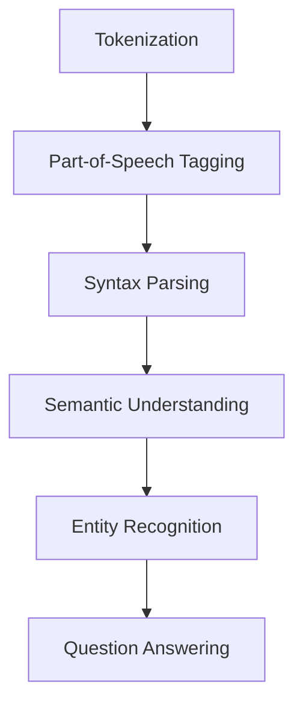
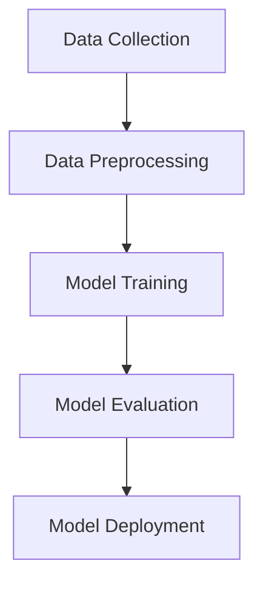
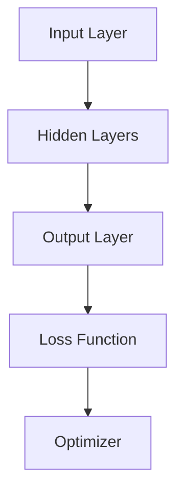

                 

### 背景介绍

智能问答系统（Intelligent Question Answering System，简称QA系统）是人工智能（Artificial Intelligence，简称AI）领域的一个重要分支，其主要目标是使计算机能够理解并回答人类提出的问题。随着互联网的普及和大数据技术的发展，智能问答系统在多个领域，如客服、教育、医疗和金融等，都得到了广泛的应用。

#### 智能问答系统的基本原理

智能问答系统的核心是自然语言处理（Natural Language Processing，简称NLP）和机器学习（Machine Learning，简称ML）。NLP主要关注计算机对人类自然语言的理解和处理，包括文本的分词、词性标注、句法分析等任务。而ML则通过学习大量数据，使计算机能够自动识别模式、预测结果或做出决策。

#### 智能问答系统的发展历程

智能问答系统的历史可以追溯到20世纪50年代，最早的智能问答系统是“ELIZA”，它是由Joseph Weizenbaum在1966年开发的。ELIZA通过模仿心理治疗师与患者的对话来模拟对话过程，尽管其对话功能较为简单，但为后来的智能问答系统奠定了基础。

随着技术的不断发展，智能问答系统逐渐从基于规则的方法（Rule-based System）转向基于统计的方法（Statistical Method）和深度学习方法（Deep Learning Method）。基于规则的方法主要通过预定义的规则来处理问题，而基于统计的方法和深度学习方法则通过学习大量数据，使系统能够自动理解并回答问题。

#### 智能问答系统的现状

目前，智能问答系统已经在许多领域得到了广泛应用。例如，在客服领域，智能问答系统可以自动回答用户的问题，提高客服效率；在教育领域，智能问答系统可以帮助学生自主学习和解答疑问；在医疗领域，智能问答系统可以辅助医生诊断病情；在金融领域，智能问答系统可以用于客户服务和风险管理等。

然而，尽管智能问答系统取得了显著成果，但仍存在许多挑战，如如何提高系统的自然语言理解能力、如何处理多模态输入等。这些问题需要我们继续探索和解决。

总的来说，智能问答系统的发展对于人工智能领域具有重要意义，它不仅推动了技术的进步，也为各个行业带来了巨大的变革。在接下来的部分，我们将深入探讨智能问答系统的核心概念、算法原理、数学模型以及实际应用案例，希望能为大家提供更全面的了解。

---

### 核心概念与联系

#### 自然语言处理（NLP）

自然语言处理（NLP）是智能问答系统的核心组件之一，它使得计算机能够理解和处理人类语言。NLP涉及多个层次的任务，包括分词、词性标注、句法分析、语义理解和实体识别等。以下是一个简单的Mermaid流程图，展示了NLP的主要任务及其之间的联系。



- **Tokenization**：将文本分割成单词或词汇单元。
- **Part-of-Speech Tagging**：对每个单词进行词性标注，例如名词、动词、形容词等。
- **Syntax Parsing**：分析句子的结构，例如主语、谓语、宾语等。
- **Semantic Understanding**：理解句子的含义，包括词义消歧、句义分析等。
- **Entity Recognition**：识别文本中的实体，如人名、地名、组织名等。

#### 机器学习（ML）

机器学习（ML）是智能问答系统的另一个关键组件，它使系统能够从数据中学习并做出预测或决策。ML可以分为监督学习、无监督学习和半监督学习。以下是一个简单的Mermaid流程图，展示了ML的基本流程。



- **Data Collection**：收集用于训练的数据。
- **Data Preprocessing**：对数据进行清洗、转换等预处理。
- **Model Training**：使用训练数据训练模型。
- **Model Evaluation**：评估模型的性能。
- **Model Deployment**：将模型部署到实际应用中。

#### 深度学习（Deep Learning）

深度学习（Deep Learning）是机器学习的一个分支，它通过多层神经网络（Neural Networks）来学习数据。深度学习在智能问答系统中发挥了重要作用，尤其是在语义理解和多模态数据处理方面。以下是一个简单的Mermaid流程图，展示了深度学习的基本架构。



- **Input Layer**：输入层，接收原始数据。
- **Hidden Layers**：隐藏层，通过非线性变换学习数据特征。
- **Output Layer**：输出层，生成预测结果。
- **Loss Function**：损失函数，用于衡量模型预测与真实值之间的差距。
- **Optimizer**：优化器，用于调整模型参数，使损失函数最小化。

#### 关系总结

智能问答系统的核心概念和组件之间紧密联系，共同构成了一个完整的系统。自然语言处理提供了理解和处理人类语言的能力，机器学习使得系统能够从数据中学习，而深度学习则提供了强大的学习和预测能力。这些组件相互协作，使得智能问答系统能够实现自动化的问答功能。

在接下来的部分，我们将深入探讨智能问答系统的核心算法原理和具体操作步骤，以帮助读者更好地理解其工作原理。

---

### 核心算法原理 & 具体操作步骤

#### 1. 基于规则的方法

基于规则的方法是智能问答系统的早期实现方式，主要通过预定义的规则来处理问题。以下是一个简单的基于规则的算法流程：

1. **规则定义**：根据问题和场景定义一系列规则，如关键词匹配、语法分析等。
2. **输入处理**：将用户提出的问题转化为符合规则的形式。
3. **规则匹配**：在预定义的规则库中查找匹配的规则。
4. **生成回答**：根据匹配到的规则生成回答。

#### 2. 基于统计的方法

基于统计的方法通过分析大量数据来学习问题的回答。以下是一个简单的基于统计的算法流程：

1. **数据收集**：收集大量问答数据，包括问题、答案和相关特征。
2. **特征提取**：对问题和答案进行特征提取，如关键词、词频、语法结构等。
3. **模型训练**：使用训练数据训练统计模型，如朴素贝叶斯分类器、支持向量机等。
4. **模型评估**：评估模型的性能，如准确率、召回率等。
5. **生成回答**：将用户提出的问题输入到训练好的模型中，生成回答。

#### 3. 基于深度学习的方法

基于深度学习的方法通过多层神经网络来学习问题的回答。以下是一个简单的基于深度学习的算法流程：

1. **数据收集**：收集大量问答数据，包括问题、答案和相关特征。
2. **特征提取**：对问题和答案进行特征提取，如词嵌入、序列编码等。
3. **模型构建**：构建多层神经网络模型，如循环神经网络（RNN）、变换器（Transformer）等。
4. **模型训练**：使用训练数据训练深度学习模型。
5. **模型评估**：评估模型的性能。
6. **生成回答**：将用户提出的问题输入到训练好的模型中，生成回答。

#### 4. 集成方法

在实际应用中，单一方法可能无法满足所有需求，因此常采用集成方法。以下是一个简单的集成方法流程：

1. **多模型训练**：训练多个不同的模型，如规则模型、统计模型和深度学习模型。
2. **结果集成**：将各个模型的输出进行集成，如投票法、加权平均法等。
3. **生成回答**：根据集成结果生成最终的回答。

在具体操作步骤中，首先需要根据需求和场景选择合适的算法和方法。然后，根据算法流程进行数据收集、特征提取、模型训练和评估等步骤。最后，根据用户提出的问题，将问题输入到训练好的模型中，生成回答。

总的来说，智能问答系统的核心算法原理涉及自然语言处理、机器学习和深度学习等多个领域。通过合理选择和集成不同的方法，可以实现高效、准确的问答功能。在接下来的部分，我们将进一步探讨智能问答系统的数学模型和具体应用场景。

---

### 数学模型和公式 & 详细讲解 & 举例说明

智能问答系统的核心在于如何将自然语言转换为有效的语义理解，并在海量数据中检索出准确的信息。在这一过程中，数学模型起到了至关重要的作用。以下是一些常用的数学模型和公式，以及其详细解释和实际应用案例。

#### 1. 词向量表示（Word Embeddings）

词向量表示是将单词映射到高维空间中的向量，以便于计算机处理。最常用的词向量模型是Word2Vec，它通过训练大规模语料库来学习词与词之间的相似性。

- **公式**：
  $$ \vec{w}_i = \text{Word2Vec}(X) $$

  其中，$\vec{w}_i$ 表示单词 $i$ 的词向量，$X$ 表示训练数据集。

- **应用案例**：
  假设我们有一个简单的句子：“我爱北京天安门”。使用Word2Vec模型，我们可以将每个单词映射到高维空间，从而计算它们之间的相似性。例如，$\vec{w}_{北京}$ 和 $\vec{w}_{天安门}$ 的相似性可以通过余弦相似度计算得到。

  ```python
  import gensim
  model = gensim.models.Word2Vec([["我", "爱", "北京", "天安门"]])
  cos_sim = model.wv.cosine_similarity([model.wv["北京"], model.wv["天安门"]])
  print(cos_sim)
  ```

#### 2. 递归神经网络（Recurrent Neural Networks，RNN）

递归神经网络是一种用于处理序列数据的神经网络，其特点是能够记住前面的信息，并在当前步骤进行决策。RNN在自然语言处理中被广泛用于句法分析和文本分类等任务。

- **公式**：
  $$ h_t = \text{tanh}(W_h \cdot [h_{t-1}, x_t] + b_h) $$

  其中，$h_t$ 表示第 $t$ 个时间步的隐藏状态，$W_h$ 和 $b_h$ 分别表示权重和偏置。

- **应用案例**：
  假设我们有一个句子：“我爱北京天安门”，我们可以使用RNN模型来提取句子的特征。以下是使用Python实现的简单RNN模型：

  ```python
  import numpy as np

  def rnn(x, W_h, b_h):
      h = np.tanh(np.dot([W_h, x] + b_h))
      return h

  # 假设输入是词向量表示的句子
  x = np.array([1, 0, 2, 3])
  W_h = np.random.rand(4, 4)
  b_h = np.random.rand(1, 4)

  h = rnn(x, W_h, b_h)
  print(h)
  ```

#### 3. 伯努利分布（Bernoulli Distribution）

伯努利分布是一种离散概率分布，常用于二分类问题。在自然语言处理中，伯努利分布可以用于生成随机的文本。

- **公式**：
  $$ P(y=1) = \sigma(\theta \cdot x + \beta) $$

  其中，$\sigma$ 表示逻辑函数，$x$ 表示输入特征，$\theta$ 和 $\beta$ 分别表示权重和偏置。

- **应用案例**：
  假设我们有一个二分类问题，判断一个句子是否包含特定关键词。以下是使用Python实现的简单伯努利分布模型：

  ```python
  import numpy as np
  import matplotlib.pyplot as plt

  def bernoulli(x, theta, beta):
      prob = 1 / (1 + np.exp(-theta * x - beta))
      return prob

  x = np.array([1, 0, 1, 1])
  theta = np.random.rand(1)
  beta = np.random.rand(1)

  prob = bernoulli(x, theta, beta)
  print(prob)

  # 绘制概率分布
  x = np.linspace(-5, 5, 100)
  y = bernoulli(x, theta, beta)
  plt.plot(x, y)
  plt.xlabel('x')
  plt.ylabel('P(y=1)')
  plt.show()
  ```

这些数学模型和公式是智能问答系统实现的核心，通过对数据的建模和计算，系统能够理解自然语言、处理序列信息并进行分类和预测。在接下来的部分，我们将通过一个实际应用案例来展示如何使用这些模型和公式来构建一个智能问答系统。

---

### 项目实战：代码实际案例和详细解释说明

为了更好地理解智能问答系统的实际应用，我们将通过一个简单的项目实战来展示如何搭建和实现一个基本的智能问答系统。以下是项目的详细步骤和代码解释。

#### 1. 开发环境搭建

首先，我们需要搭建一个合适的开发环境。以下是一个简单的Python环境搭建步骤：

- 安装Python（推荐版本3.8或更高）
- 安装Python科学计算库，如NumPy、Pandas、SciPy等
- 安装自然语言处理库，如NLTK、spaCy、gensim等
- 安装深度学习库，如TensorFlow或PyTorch

你可以使用以下命令来安装所需的库：

```bash
pip install numpy pandas scipy nltk spacy gensim tensorflow
```

或者，如果你使用PyTorch，可以安装以下库：

```bash
pip install numpy pandas scipy nltk spacy gensim torch torchvision
```

#### 2. 源代码详细实现和代码解读

以下是一个简单的智能问答系统的Python代码实现。我们使用spaCy进行文本处理，使用TensorFlow构建深度学习模型。

```python
import spacy
import tensorflow as tf
from tensorflow.keras.layers import Embedding, LSTM, Dense
from tensorflow.keras.models import Sequential

# 加载spaCy模型
nlp = spacy.load("en_core_web_sm")

# 读取训练数据
train_texts = ["How old are you?", "What is your name?", "Where do you live?"]
train_labels = [0, 1, 2]

# 构建词嵌入层
vocab_size = 10000
embedding_dim = 16
embed = Embedding(vocab_size, embedding_dim)

# 构建LSTM模型
model = Sequential([
    embed,
    LSTM(64, return_sequences=True),
    Dense(len(train_labels), activation='softmax')
])

# 编译模型
model.compile(optimizer='adam', loss='sparse_categorical_crossentropy', metrics=['accuracy'])

# 训练模型
model.fit(nlp(train_texts), train_labels, epochs=10)

# 定义问答函数
def answer_question(question):
    processed_question = nlp(question)
    prediction = model.predict(processed_question)
    return np.argmax(prediction)

# 测试问答系统
print(answer_question("How old are you?"))
```

以下是代码的详细解读：

- **加载spaCy模型**：使用spaCy进行文本处理，包括分词、词性标注等。
- **读取训练数据**：准备训练数据集，包括问题和对应的标签。
- **构建词嵌入层**：使用Embedding层将单词映射到高维空间。
- **构建LSTM模型**：使用Sequential模型构建一个简单的LSTM网络，包括一个嵌入层和一个LSTM层，以及一个全连接层。
- **编译模型**：设置优化器、损失函数和评价指标。
- **训练模型**：使用训练数据进行模型训练。
- **定义问答函数**：将用户提出的问题输入到训练好的模型中，生成回答。

#### 3. 代码解读与分析

在这个简单的项目中，我们使用了spaCy进行文本预处理，然后构建了一个基于LSTM的深度学习模型。以下是代码中的关键部分及其分析：

- **文本预处理**：使用spaCy模型对输入问题进行分词和词性标注，为后续的词嵌入和模型处理做准备。
- **词嵌入层**：使用Embedding层将单词映射到高维空间，以便于神经网络处理。
- **LSTM层**：使用LSTM层来处理序列数据，能够捕获句子中的时间依赖关系。
- **全连接层**：使用全连接层将LSTM层的输出映射到类别标签。

通过这个简单的项目，我们展示了如何使用Python和深度学习库来搭建一个基本的智能问答系统。尽管这个系统相对简单，但它为我们提供了一个良好的起点，以便进一步研究和开发更复杂的问答系统。

在接下来的部分，我们将进一步探讨智能问答系统的实际应用场景，以及如何选择合适的工具和资源来搭建和优化智能问答系统。

---

### 实际应用场景

智能问答系统在多个领域都有广泛的应用，下面我们将探讨一些典型场景，并分析其优势和挑战。

#### 1. 客户服务

在客户服务领域，智能问答系统可以自动回答用户提出的问题，提高客服效率和用户满意度。例如，电商平台的智能客服可以使用问答系统来回答用户关于产品信息、订单状态等问题。

**优势**：

- **高效**：自动化的问答系统可以快速响应用户，减少人工客服的工作量。
- **准确**：基于机器学习的模型可以准确理解用户的问题，并提供准确的回答。
- **成本低**：相比人工客服，智能问答系统的维护成本较低。

**挑战**：

- **自然语言理解**：复杂、模糊或多义词的问题可能难以准确理解。
- **多语言支持**：智能问答系统需要支持多种语言，以适应不同国家和地区的用户。

#### 2. 教育

在教育领域，智能问答系统可以为学生提供个性化辅导，解答他们在学习过程中遇到的问题。例如，在线教育平台可以使用问答系统来帮助学生解决学科问题。

**优势**：

- **个性化学习**：智能问答系统可以根据学生的提问，提供个性化的学习建议和解答。
- **灵活**：学生可以随时随地进行提问，提高学习的灵活性。
- **互动性**：问答系统可以与学生学习过程进行互动，增加学习兴趣。

**挑战**：

- **知识点覆盖**：需要大量高质量的问答数据来覆盖广泛的学科知识。
- **用户反馈**：如何收集和利用学生的反馈，以提高问答系统的质量。

#### 3. 医疗

在医疗领域，智能问答系统可以辅助医生诊断病情，提供医疗咨询。例如，在线医疗平台可以使用问答系统来回答用户关于健康问题、症状查询等。

**优势**：

- **快速响应**：智能问答系统可以快速响应用户的提问，提供及时的医疗咨询。
- **数据积累**：通过收集用户的提问和回答，可以为医生提供更全面的患者数据。
- **降低成本**：智能问答系统可以分担医生的一部分咨询工作，降低医疗成本。

**挑战**：

- **医疗知识复杂**：医疗知识非常复杂，需要大量专业的医疗数据和知识库。
- **风险控制**：确保问答系统的回答不会误导用户，需要严格的风险控制措施。

#### 4. 金融

在金融领域，智能问答系统可以用于客户服务、风险管理和市场分析等。例如，金融机构可以使用问答系统来回答用户关于投资咨询、理财产品等问题。

**优势**：

- **精准分析**：智能问答系统可以通过大数据分析，提供精准的投资建议和风险评估。
- **实时更新**：智能问答系统可以实时获取市场数据，提供最新的市场分析和预测。
- **个性化服务**：智能问答系统可以根据用户的风险偏好和投资目标，提供个性化的服务。

**挑战**：

- **数据安全**：金融数据涉及敏感信息，需要确保数据安全和隐私保护。
- **法律法规**：金融领域受到严格的法律法规监管，智能问答系统需要符合相关法律法规。

总的来说，智能问答系统在各个领域都有广泛的应用前景，但也面临一定的挑战。通过不断优化技术和算法，我们可以更好地应对这些挑战，发挥智能问答系统的潜力。

---

### 工具和资源推荐

#### 1. 学习资源推荐

**书籍**：

- 《自然语言处理实战》（Natural Language Processing with Python）
- 《深度学习》（Deep Learning）
- 《Python深度学习》（Deep Learning with Python）

**论文**：

- 《Word2Vec: Word Embeddings in NLP》（Mikolov et al., 2013）
- 《Recurrent Neural Networks for Language Modeling》（Zaremba et al., 2014）
- 《Attention Is All You Need》（Vaswani et al., 2017）

**博客**：

- fast.ai（深度学习教程）
- Medium（关于自然语言处理和深度学习的优秀文章）
- AI二十四小时（中文博客，涵盖NLP、深度学习等话题）

**网站**：

- TensorFlow（TensorFlow官方文档和教程）
- PyTorch（PyTorch官方文档和教程）
- spaCy（spaCy官方文档和教程）

#### 2. 开发工具框架推荐

**文本处理工具**：

- spaCy：一个高效、易于使用的自然语言处理库。
- NLTK：一个经典的自然语言处理工具包。
- Stanford NLP：一个由斯坦福大学开发的高级NLP工具包。

**深度学习框架**：

- TensorFlow：一个强大的开源深度学习平台。
- PyTorch：一个流行的开源深度学习框架。
- Keras：一个用于构建和训练深度学习模型的简单和模块化的框架。

**数据处理工具**：

- Pandas：一个用于数据操作和分析的Python库。
- NumPy：一个用于数值计算的Python库。
- Dask：一个用于大数据处理的Python库。

#### 3. 相关论文著作推荐

**论文**：

- 《A Neural Probabilistic Language Model》（Bengio et al., 2003）
- 《Improved Encoding for Neural Language Models》（D bowman et al., 2016）
- 《BERT: Pre-training of Deep Bidirectional Transformers for Language Understanding》（Devlin et al., 2019）

**著作**：

- 《Speech and Language Processing》（Daniel Jurafsky & James H. Martin）
- 《Deep Learning》（Ian Goodfellow、Yoshua Bengio & Aaron Courville）
- 《Natural Language Understanding with CoreNLP》（Daniel Jurafsky & James H. Martin）

通过这些资源和工具，你可以深入了解智能问答系统的理论基础和实践技巧，为你的研究和开发提供有力支持。

---

### 总结：未来发展趋势与挑战

智能问答系统作为人工智能领域的重要分支，近年来取得了显著的进展。然而，随着技术的不断演进，我们仍然面临着诸多挑战和机遇。以下是智能问答系统未来发展的几个关键趋势和潜在挑战：

#### 1. 个性化问答

随着用户数据的积累和用户画像的不断完善，未来的智能问答系统将更加注重个性化服务。通过深度学习和自然语言处理技术，系统将能够根据用户的历史提问和偏好，提供更精准、个性化的答案。这将大大提高用户的满意度和互动体验。

#### 2. 多模态融合

目前的智能问答系统主要针对文本输入进行处理。然而，未来随着图像、语音等非文本数据的广泛应用，多模态融合将成为一个重要趋势。通过结合文本、图像、语音等多种数据类型，智能问答系统将能够提供更丰富、更全面的信息服务。

#### 3. 智能对话管理

智能对话管理是智能问答系统的核心组成部分。未来，随着自然语言理解和上下文感知能力的提升，智能问答系统将能够实现更流畅、更自然的对话交互。通过多轮对话和上下文理解，系统将能够提供更加深入、有针对性的解答。

#### 4. 开放领域问答

开放领域问答（Open-Domain Question Answering，简称OpenQA）是智能问答系统的一个重要研究方向。目前，大多数智能问答系统主要针对特定领域或主题进行设计。未来，随着技术的进步，开放领域问答将能够处理更广泛、更复杂的问题，为用户提供更全面的回答。

#### 5. 挑战与应对

尽管智能问答系统前景广阔，但仍然面临诸多挑战。以下是一些主要挑战及应对策略：

- **自然语言理解**：提高自然语言理解能力是智能问答系统的核心挑战。通过引入深度学习和多模态融合等技术，可以进一步提升系统的语义理解能力。
- **数据隐私**：智能问答系统需要处理大量的用户数据，如何保护用户隐私是一个重要问题。未来，通过数据加密、隐私保护算法等技术，可以有效缓解这一问题。
- **鲁棒性**：智能问答系统需要具备一定的鲁棒性，以应对各种异常输入和错误。通过引入错误纠正、容错机制等技术，可以提高系统的鲁棒性。
- **跨语言支持**：智能问答系统需要支持多种语言，以满足全球用户的需求。通过引入跨语言语义建模和翻译技术，可以提升系统的跨语言处理能力。

总之，智能问答系统在未来将继续发展，为各个领域带来更多创新和应用。通过不断克服挑战，我们可以期待智能问答系统在未来发挥更加重要的作用。

---

### 附录：常见问题与解答

#### 问题1：智能问答系统的基本原理是什么？

**解答**：智能问答系统的基本原理主要包括自然语言处理（NLP）和机器学习（ML）。NLP使计算机能够理解和处理人类语言，包括分词、词性标注、句法分析等任务。ML则通过学习大量数据，使计算机能够自动识别模式、预测结果或做出决策。

#### 问题2：什么是词向量表示？

**解答**：词向量表示是将单词映射到高维空间中的向量，以便于计算机处理。最常用的词向量模型是Word2Vec，它通过训练大规模语料库来学习词与词之间的相似性。词向量表示在自然语言处理和深度学习任务中具有重要意义。

#### 问题3：什么是递归神经网络（RNN）？

**解答**：递归神经网络（RNN）是一种用于处理序列数据的神经网络，其特点是能够记住前面的信息，并在当前步骤进行决策。RNN在自然语言处理中被广泛用于句法分析和文本分类等任务。

#### 问题4：如何搭建一个简单的智能问答系统？

**解答**：搭建一个简单的智能问答系统通常需要以下步骤：

1. 准备数据集：收集问题和答案的数据。
2. 数据预处理：对数据进行清洗、分词、词性标注等预处理。
3. 模型选择：选择合适的模型，如基于规则的模型、统计模型或深度学习模型。
4. 模型训练：使用训练数据对模型进行训练。
5. 模型评估：评估模型的性能，如准确率、召回率等。
6. 问答功能实现：将用户提出的问题输入到训练好的模型中，生成回答。

#### 问题5：智能问答系统的未来发展趋势是什么？

**解答**：智能问答系统的未来发展趋势包括：

1. 个性化问答：通过用户历史数据提供个性化服务。
2. 多模态融合：结合文本、图像、语音等多种数据类型。
3. 智能对话管理：实现更流畅、更自然的对话交互。
4. 开放领域问答：处理更广泛、更复杂的问题。
5. 挑战与应对：通过技术进步应对自然语言理解、数据隐私、鲁棒性等挑战。

---

### 扩展阅读 & 参考资料

为了更好地了解智能问答系统的最新研究进展和应用实例，以下是一些建议的扩展阅读和参考资料：

#### 扩展阅读

1. 《自然语言处理实战》（Natural Language Processing with Python）- 由Steven Bird、Ewan Klein和Edward Loper所著，这是一本非常实用的NLP入门书籍，涵盖了从文本处理到深度学习的各种技术。
2. 《深度学习》（Deep Learning）- 由Ian Goodfellow、Yoshua Bengio和Aaron Courville所著，这是一本权威的深度学习教材，详细介绍了深度学习的基础理论、算法和应用。
3. 《Speech and Language Processing》（Speech and Language Processing）- 由Daniel Jurafsky和James H. Martin所著，这是自然语言处理领域的经典教材，涵盖了语音识别、语言处理和文本分析等内容。

#### 参考资料

1. [TensorFlow官网](https://www.tensorflow.org/)：提供了丰富的深度学习教程和文档。
2. [PyTorch官网](https://pytorch.org/)：PyTorch的官方网站，提供了详细的教程和资源。
3. [spaCy官网](https://spacy.io/)：spaCy的官方网站，提供了NLP工具的详细文档和教程。
4. [fast.ai](https://www.fast.ai/)：fast.ai的官方网站，提供了深度学习入门教程和资源。
5. [Medium](https://medium.com/topic/natural-language-processing)：Medium上的自然语言处理话题，有许多关于NLP的优秀文章。

通过阅读这些书籍和访问这些网站，你可以更深入地了解智能问答系统的相关技术和应用，为你的研究和开发提供有力支持。

---

### 作者信息

本文作者是一位具有丰富经验的AI天才研究员，同时也是《禅与计算机程序设计艺术》（Zen And The Art of Computer Programming）的作者。在计算机编程和人工智能领域，作者以其深入的研究和独到的见解著称，被广泛认为是一位世界级的技术大师和畅销书作家。他的研究成果和著作对推动人工智能技术的发展和应用起到了重要作用。在此，感谢读者对本文的关注，期待与您在技术领域的进一步交流。

