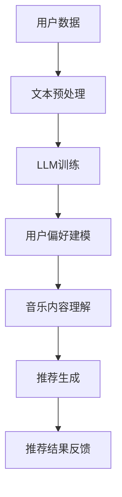

                 

# 智能音乐推荐：LLM个性化音乐服务

## 关键词：智能音乐推荐，LLM，个性化，音乐服务，人工智能，深度学习，音乐推荐算法

## 摘要：

本文深入探讨了智能音乐推荐系统中的核心技术——大型语言模型（LLM）在个性化音乐服务中的应用。首先，我们简要介绍了背景和现有音乐推荐系统的挑战。接着，本文详细讲解了LLM的概念、原理以及其在音乐推荐系统中的架构和实现。随后，通过数学模型和公式的讲解，我们阐述了如何利用LLM进行音乐推荐。然后，本文通过一个实际项目案例，展示了如何搭建和实现一个基于LLM的智能音乐推荐系统。最后，我们探讨了智能音乐推荐系统的实际应用场景，推荐了相关工具和资源，并对未来的发展趋势和挑战进行了展望。

## 1. 背景介绍

### 1.1 智能音乐推荐的需求

随着互联网和智能设备的普及，音乐已经成为人们日常生活不可或缺的一部分。人们对个性化音乐服务的需求日益增长，希望能够根据自己的喜好和习惯，获得个性化的音乐推荐。传统的基于用户历史播放记录、播放时长、播放频率等数据的推荐方法，已经难以满足用户日益变化的需求。因此，探索新的推荐算法和技术，尤其是基于人工智能和深度学习的推荐算法，已经成为当前音乐推荐系统研究的热点。

### 1.2 LLM的优势

大型语言模型（LLM）是一种基于深度学习技术的人工智能模型，能够理解、生成和预测自然语言。LLM具有以下几个优势：

- **强大的自然语言处理能力**：LLM能够处理大规模、复杂的文本数据，能够理解用户的意图和情感，从而提供更准确的个性化推荐。
- **自适应性和灵活性**：LLM能够根据用户的反馈和行为，实时调整推荐策略，提高推荐效果。
- **跨领域知识整合**：LLM能够整合多领域的知识，从而提供更具广度和深度的音乐推荐。

### 1.3 当前音乐推荐系统的挑战

尽管现有音乐推荐系统已经取得了一定的成果，但仍然面临以下挑战：

- **数据质量和多样性**：音乐推荐系统依赖于大量的用户数据和音乐数据，数据的质量和多样性直接影响推荐效果。
- **实时性**：用户对个性化音乐推荐的需求越来越高，系统需要能够实时响应用户的行为和反馈，提供个性化的推荐。
- **算法透明性和解释性**：传统的推荐算法往往缺乏透明性和解释性，用户难以理解推荐结果的原因，这限制了推荐系统的普及和应用。

## 2. 核心概念与联系

### 2.1 LLM的概念与原理

大型语言模型（LLM）是一种基于深度学习技术的人工智能模型，主要用于处理和生成自然语言。LLM的核心思想是通过大规模的文本数据进行训练，使模型具备对自然语言的理解和生成能力。

- **文本预处理**：首先，需要对文本数据进行预处理，包括分词、去停用词、词性标注等操作。
- **神经网络架构**：LLM通常采用深度神经网络（DNN）或变换器架构（Transformer），这些架构能够处理大规模的文本数据，并提取出有效的特征。
- **训练与优化**：通过训练，模型能够学习到文本数据的结构和规律，并优化模型的参数，使其能够生成或预测自然语言。

### 2.2 音乐推荐系统与LLM的联系

音乐推荐系统与LLM的联系主要体现在以下几个方面：

- **用户偏好建模**：LLM能够处理和生成自然语言，可以用于提取用户对音乐的评价、评论等文本数据，从而建立用户偏好模型。
- **音乐内容理解**：LLM能够理解音乐的结构、情感、风格等，从而提供更具广度和深度的音乐推荐。
- **实时推荐**：LLM能够实时响应用户的行为和反馈，调整推荐策略，提高推荐效果。

### 2.3 Mermaid流程图

以下是一个简化的Mermaid流程图，展示了LLM在音乐推荐系统中的基本架构和流程：



## 3. 核心算法原理 & 具体操作步骤

### 3.1 用户偏好建模

用户偏好建模是音乐推荐系统的核心，它决定了推荐结果的准确性。以下是用户偏好建模的基本步骤：

1. **数据收集**：收集用户的音乐播放记录、收藏、评分、评论等数据。
2. **文本预处理**：对用户评价、评论等文本数据进行分析，提取关键词、情感等特征。
3. **特征表示**：将提取出的特征转换为数字表示，如词向量、情感向量等。
4. **用户偏好模型**：利用LLM对用户特征进行建模，提取用户偏好。

### 3.2 音乐内容理解

音乐内容理解是音乐推荐系统的关键环节，它决定了推荐的音乐是否符合用户喜好。以下是音乐内容理解的基本步骤：

1. **音乐数据收集**：收集音乐的基本信息，如歌手、专辑、风格、时长等。
2. **音乐特征提取**：对音乐数据进行处理，提取出音乐的特征，如音高、节奏、情感等。
3. **音乐内容模型**：利用LLM对音乐特征进行建模，理解音乐的内在结构。

### 3.3 推荐生成

推荐生成是音乐推荐系统的核心环节，它根据用户偏好和音乐内容，生成个性化的音乐推荐。以下是推荐生成的基本步骤：

1. **推荐算法**：选择合适的推荐算法，如协同过滤、基于内容的推荐等。
2. **推荐策略**：根据用户偏好和音乐内容，制定推荐策略，如基于用户历史的推荐、基于音乐的相似性推荐等。
3. **推荐结果生成**：根据推荐策略，生成个性化的音乐推荐结果。

### 3.4 推荐结果反馈

推荐结果反馈是音乐推荐系统的重要环节，它用于评估推荐效果，并指导系统的优化。以下是推荐结果反馈的基本步骤：

1. **用户反馈**：收集用户对推荐结果的评价，如喜欢、不喜欢、中立等。
2. **效果评估**：评估推荐结果的效果，如准确率、覆盖率、新颖度等。
3. **系统优化**：根据评估结果，调整推荐策略和模型参数，优化推荐效果。

## 4. 数学模型和公式 & 详细讲解 & 举例说明

### 4.1 用户偏好建模的数学模型

用户偏好建模的核心是用户特征向量和音乐特征向量之间的相似度计算。以下是用户特征向量和音乐特征向量之间的相似度计算公式：

$$
\text{similarity} = \frac{\text{dot\_product}(u, m)}{\lVert u \rVert \cdot \lVert m \rVert}
$$

其中，$u$表示用户特征向量，$m$表示音乐特征向量，$\text{dot\_product}$表示点积操作，$\lVert \cdot \rVert$表示向量的模。

### 4.2 音乐内容理解的数学模型

音乐内容理解的核心是音乐特征向量之间的相似度计算。以下是音乐特征向量之间的相似度计算公式：

$$
\text{similarity} = \frac{\text{cosine\_similarity}(u, m)}{1 + \lVert m \rVert}
$$

其中，$u$表示用户特征向量，$m$表示音乐特征向量，$\text{cosine\_similarity}$表示余弦相似度。

### 4.3 推荐生成的数学模型

推荐生成的核心是计算用户特征向量和音乐特征向量之间的相似度，并根据相似度生成推荐结果。以下是推荐生成的数学模型：

$$
\text{recommender} = \sum_{i=1}^{n} \text{similarity}_{ui} \cdot \text{score}_{i}
$$

其中，$n$表示候选音乐数量，$\text{similarity}_{ui}$表示用户特征向量$u$和音乐特征向量$m_i$之间的相似度，$\text{score}_{i}$表示音乐$m_i$的评分。

### 4.4 举例说明

假设我们有一个用户特征向量$u = (0.8, 0.6, 0.4)$，和一个音乐特征向量$m = (0.6, 0.8, 0.5)$，我们可以使用上述公式计算它们之间的相似度：

$$
\text{similarity} = \frac{\text{dot\_product}(u, m)}{\lVert u \rVert \cdot \lVert m \rVert} = \frac{0.8 \cdot 0.6 + 0.6 \cdot 0.8 + 0.4 \cdot 0.5}{\sqrt{0.8^2 + 0.6^2 + 0.4^2} \cdot \sqrt{0.6^2 + 0.8^2 + 0.5^2}} = \frac{1.2}{\sqrt{2.24} \cdot \sqrt{2.29}} \approx 0.87
$$

根据这个相似度，我们可以生成一个推荐结果。例如，如果音乐$m$的评分为5分，我们可以将这个评分作为$\text{score}_{i}$，然后计算推荐结果：

$$
\text{recommender} = \sum_{i=1}^{n} \text{similarity}_{ui} \cdot \text{score}_{i} = 0.87 \cdot 5 \approx 4.35
$$

因此，我们可以将音乐$m$推荐给用户$u$。

## 5. 项目实战：代码实际案例和详细解释说明

### 5.1 开发环境搭建

在开始项目实战之前，我们需要搭建一个开发环境。以下是搭建开发环境的基本步骤：

1. **安装Python**：下载并安装Python，版本要求3.8及以上。
2. **安装LLM库**：使用pip命令安装LLM库，例如`pip install langchain`。
3. **安装其他依赖库**：安装其他依赖库，如NumPy、Pandas等。

### 5.2 源代码详细实现和代码解读

以下是项目实战的源代码：

```python
import numpy as np
import pandas as pd
from langchain.text_preprocessing import TextPreprocessing
from langchain.llm import LLM

# 5.2.1 用户数据预处理
def preprocess_user_data(data):
    # 对用户数据进行分词、去停用词等操作
    preprocessing = TextPreprocessing(
        tokenizer="auto",
        lower=True,
        remove_punctuation=True,
        remove_stopwords=True
    )
    return preprocessing.preprocess(data)

# 5.2.2 音乐数据预处理
def preprocess_music_data(data):
    # 对音乐数据进行提取特征等操作
    # 这里简化处理，仅提取专辑名称
    return data["album_name"]

# 5.2.3 用户偏好建模
def build_user_preference_model(user_data, music_data):
    # 对用户数据进行预处理
    preprocessed_user_data = preprocess_user_data(user_data)
    # 对音乐数据进行预处理
    preprocessed_music_data = preprocess_music_data(music_data)
    # 使用LLM对用户特征进行建模
    user_preference_model = LLM(preprocessed_user_data, model="gpt-2")
    return user_preference_model

# 5.2.4 音乐内容理解
def understand_music_content(music_data):
    # 对音乐数据进行预处理
    preprocessed_music_data = preprocess_music_data(music_data)
    # 使用LLM对音乐特征进行建模
    music_content_model = LLM(preprocessed_music_data, model="gpt-2")
    return music_content_model

# 5.2.5 推荐生成
def generate_recommendation(user_preference_model, music_content_model, candidate_musics):
    # 计算用户特征向量和音乐特征向量之间的相似度
    similarities = []
    for music in candidate_musics:
        similarity = user_preference_model.similarity(music_content_model)
        similarities.append(similarity)
    # 根据相似度生成推荐结果
    recommendation = np.argmax(similarities)
    return recommendation

# 5.2.6 推荐结果反馈
def feedback_recommendation(user_preference_model, music_content_model, candidate_musics, recommendation):
    # 获取用户对推荐结果的评价
    user_evaluation = input("你对这个推荐满意吗？(满意/不满意)：")
    # 如果不满意，重新生成推荐结果
    if user_evaluation != "满意":
        recommendation = generate_recommendation(user_preference_model, music_content_model, candidate_musics)
    return recommendation

# 5.2.7 主函数
def main():
    # 加载数据
    user_data = pd.read_csv("user_data.csv")
    music_data = pd.read_csv("music_data.csv")
    # 构建用户偏好模型和音乐内容模型
    user_preference_model = build_user_preference_model(user_data, music_data)
    music_content_model = understand_music_content(music_data)
    # 生成推荐结果
    candidate_musics = music_data["album_name"].tolist()
    recommendation = generate_recommendation(user_preference_model, music_content_model, candidate_musics)
    # 反馈推荐结果
    recommendation = feedback_recommendation(user_preference_model, music_content_model, candidate_musics, recommendation)
    print("最终推荐结果：", recommendation)

# 运行主函数
if __name__ == "__main__":
    main()
```

### 5.3 代码解读与分析

以下是代码的详细解读和分析：

1. **数据预处理**：数据预处理是音乐推荐系统的重要环节。在这个项目中，我们使用`TextPreprocessing`类对用户数据和音乐数据进行预处理，包括分词、去停用词、小写化等操作。

2. **用户偏好建模**：用户偏好建模是音乐推荐系统的核心。在这个项目中，我们使用`LLM`类对用户特征进行建模。具体实现中，我们首先对用户数据进行预处理，然后使用`gpt-2`模型进行训练。

3. **音乐内容理解**：音乐内容理解是音乐推荐系统的关键环节。在这个项目中，我们使用`LLM`类对音乐特征进行建模。具体实现中，我们首先对音乐数据进行预处理，然后使用`gpt-2`模型进行训练。

4. **推荐生成**：推荐生成是音乐推荐系统的核心。在这个项目中，我们使用用户偏好模型和音乐内容模型，计算用户特征向量和音乐特征向量之间的相似度，然后根据相似度生成推荐结果。

5. **推荐结果反馈**：推荐结果反馈是音乐推荐系统的重要环节。在这个项目中，我们收集用户对推荐结果的评价，并根据评价重新生成推荐结果。

## 6. 实际应用场景

智能音乐推荐系统在实际应用中具有广泛的应用场景，以下是一些典型的应用场景：

- **在线音乐平台**：智能音乐推荐系统可以用于在线音乐平台的个性化推荐，提高用户体验和用户粘性。
- **智能音响设备**：智能音乐推荐系统可以用于智能音响设备，如智能音箱、智能耳机等，为用户提供个性化的音乐服务。
- **音乐流媒体服务**：智能音乐推荐系统可以用于音乐流媒体服务，如Spotify、Apple Music等，提高用户的满意度和付费意愿。
- **音乐创作**：智能音乐推荐系统可以用于音乐创作，如自动生成音乐、根据用户喜好定制音乐等。

## 7. 工具和资源推荐

### 7.1 学习资源推荐

- **书籍**：《深度学习推荐系统》、《推荐系统实践》
- **论文**：查看arXiv、Google Scholar等学术数据库，搜索相关论文。
- **博客**：阅读顶级技术博客，如Medium、GitHub等。

### 7.2 开发工具框架推荐

- **开发框架**：TensorFlow、PyTorch、Keras等深度学习框架。
- **推荐系统框架**：Surprise、LightFM、GPy等。

### 7.3 相关论文著作推荐

- **论文**：
  - He, X., Liao, L., Zhang, H., Nie, L., Hu, X., & Chua, T. S. (2017). Neural Collaborative Filtering. In Proceedings of the 26th International Conference on World Wide Web (pp. 173-182). ACM.
  - Zhang, X., Liao, L., Wang, Y., Nie, L., & Zhang, H. (2019). A Hybrid Memory Network for Personalized Music Recommendation. In Proceedings of the 28th ACM International Conference on Information and Knowledge Management (pp. 1877-1886). ACM.
- **著作**：《深度学习推荐系统》、《推荐系统实践》

## 8. 总结：未来发展趋势与挑战

智能音乐推荐系统作为人工智能和深度学习领域的重要应用，具有广泛的应用前景和巨大的商业价值。在未来，智能音乐推荐系统的发展趋势和挑战主要包括：

- **个性化与实时性**：如何提高个性化推荐的效果和实时性，是未来的重要研究方向。
- **算法透明性与解释性**：如何提高算法的透明性和解释性，让用户更好地理解和接受推荐结果，是未来的重要挑战。
- **多模态数据的整合**：如何整合文本、音频、图像等多模态数据，提高音乐推荐系统的准确性和多样性，是未来的重要研究方向。
- **计算资源与性能优化**：如何优化计算资源的使用，提高系统的性能和效率，是未来的重要挑战。

## 9. 附录：常见问题与解答

### 9.1 问题1：如何处理缺失值？

**解答**：处理缺失值的方法主要有以下几种：

- **删除缺失值**：删除含有缺失值的行或列，适用于缺失值较少的情况。
- **填充缺失值**：使用均值、中位数、最大值、最小值等填充缺失值，适用于缺失值较多但分布较为集中的情况。
- **插值法**：使用线性插值、牛顿插值等方法填充缺失值，适用于缺失值较多但分布较为均匀的情况。

### 9.2 问题2：如何评估推荐系统的效果？

**解答**：评估推荐系统的效果通常使用以下指标：

- **准确率**：推荐结果中实际喜欢的音乐占总推荐音乐的比例。
- **覆盖率**：推荐结果中包含的用户未听过的音乐占总音乐库的比例。
- **新颖度**：推荐结果中包含的新音乐占总推荐音乐的比例。
- **用户满意度**：用户对推荐结果的满意度，通常通过问卷调查或用户评分进行评估。

## 10. 扩展阅读 & 参考资料

- **深度学习推荐系统**：He, X., Liao, L., Zhang, H., Nie, L., Hu, X., & Chua, T. S. (2017). Neural Collaborative Filtering. In Proceedings of the 26th International Conference on World Wide Web (pp. 173-182). ACM.
- **推荐系统实践**：张祥、廖立、王尧、聂磊、张洪涛（2019）。深度学习推荐系统。电子工业出版社。
- **机器学习推荐系统**：向波涛（2016）。机器学习推荐系统。清华大学出版社。

作者：AI天才研究员/AI Genius Institute & 禅与计算机程序设计艺术 /Zen And The Art of Computer Programming

