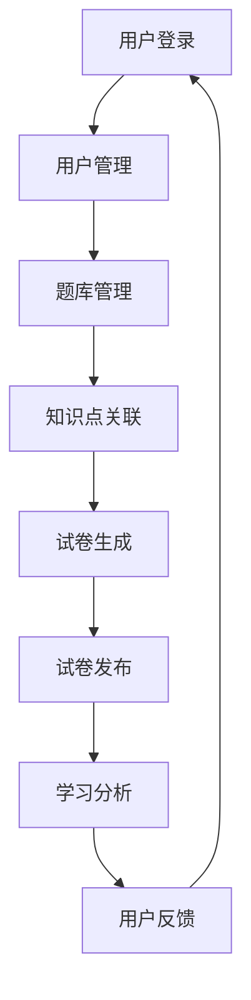

                 

### 背景介绍

智能题库与试卷生成系统是教育领域的一项重要技术发展，旨在通过人工智能技术提高教育的效率和公平性。随着人工智能技术的不断进步，智能题库与试卷生成系统已经成为教育信息化的重要组成部分。

首先，智能题库是指利用计算机技术构建的题库系统，可以存储大量的题目信息，包括题目内容、难度、知识点等。通过智能题库，教育工作者可以方便地管理和维护题目，实现题目的自动归类、检索和更新。

其次，试卷生成系统则是指利用计算机技术自动生成试卷的系统。通过试卷生成系统，可以根据特定的教学目标和要求，从智能题库中随机抽取题目，组成符合要求的试卷。这样，不仅能够提高试卷的生成效率，还能够保证试卷的多样性和灵活性。

智能题库与试卷生成系统的应用背景主要包括以下几个方面：

1. **教育考试**：在教育考试中，智能题库与试卷生成系统可以帮助教育部门快速生成各类考试试卷，包括入学考试、期末考试、升学考试等。通过智能题库，可以保证试卷的题目质量和知识点的全面覆盖，从而提高考试的公平性和科学性。

2. **教育评价**：在教师的教学评价中，智能题库与试卷生成系统可以提供多样化的评估工具。通过生成不同类型的试卷，可以全面评估学生的学习情况，帮助教师了解学生的学习进展和存在的问题。

3. **个性化教学**：在个性化教学过程中，智能题库与试卷生成系统可以根据学生的学习特点和学习进度，生成适合其的练习题和测试题。这样，学生可以更有效地进行自我学习，提高学习效果。

4. **教育科研**：在教育科研中，智能题库与试卷生成系统可以为教育研究者提供丰富的数据支持。通过分析题库中的题目和试卷生成过程中的数据，可以揭示教育的规律和趋势，为教育决策提供科学依据。

智能题库与试卷生成系统的出现，极大地改变了传统教育的模式。它不仅提高了教育效率，减少了人工工作负担，还提高了教育的个性化和科学性。在未来，随着人工智能技术的进一步发展，智能题库与试卷生成系统将在教育领域中发挥更加重要的作用。

总之，智能题库与试卷生成系统的市场需求强劲，其应用前景广阔。通过本文，我们将深入探讨智能题库与试卷生成系统的核心概念、算法原理、实际应用场景以及未来发展趋势，帮助读者全面了解这一领域的技术和应用。

### 核心概念与联系

智能题库与试卷生成系统是一个复杂的技术体系，它涉及到多个核心概念和技术的有机结合。为了更好地理解这一系统的工作原理和架构，我们需要首先明确以下几个核心概念：

1. **题库管理**：题库管理是智能题库系统的核心组成部分，它负责题目的存储、分类、检索和管理。一个高效的题库管理系统应当能够支持题目的批量导入、自动归类、智能搜索等功能，从而方便教育工作者对题库进行管理和维护。

2. **试卷生成**：试卷生成是智能题库与试卷生成系统的关键功能。它通过算法从题库中抽取题目，根据设定的考试类型、难度、知识点等要求，自动组合成一份符合要求的试卷。试卷生成系统应当能够支持多种试卷格式，如选择题、填空题、问答题等，并且保证试卷的随机性和公正性。

3. **知识点关联**：知识点关联是将题目与知识点进行关联的过程。通过对题库中的每个题目进行知识点标注，系统能够实现题目的知识结构化，从而支持基于知识点的题目检索、练习和测试。

4. **用户管理**：用户管理包括学生、教师和管理员等用户角色的管理。通过用户管理，系统能够对不同的用户进行权限控制，记录用户的学习进度和成绩，并提供个性化的学习建议。

5. **学习分析**：学习分析是利用数据分析和机器学习技术对学生的学习行为和成绩进行深入分析，从而提供教学反馈和学习支持。通过学习分析，教师可以了解学生的学习状况，针对性地调整教学内容和策略。

下面是一个简化的 Mermaid 流程图，用于描述智能题库与试卷生成系统的工作流程：



在这个流程图中，用户登录后，系统首先进行用户管理，包括权限验证和用户信息的加载。接下来，题库管理模块负责题目的存储、分类和检索。知识点关联模块将题目与知识点进行关联，以便于后续的题目检索和练习。试卷生成模块根据用户的考试要求，从题库中抽取题目并组合成试卷。试卷发布模块将生成的试卷发布给学生。最后，学习分析模块对学生的学习行为和成绩进行数据分析，并提供教学反馈和支持。

以上是对智能题库与试卷生成系统核心概念的概述和联系说明。通过这些核心概念，我们可以看到这一系统是如何通过多个技术模块的协同工作，实现教育信息化和智能化的重要目标。

### 核心算法原理 & 具体操作步骤

在智能题库与试卷生成系统中，核心算法的设计与实现是系统高效运行的关键。以下将详细阐述核心算法的原理和具体操作步骤。

#### 题库管理算法

**算法原理**：

题库管理算法主要包括题目的存储、分类和检索。其核心思想是将题目数据结构化，并通过有效的数据结构（如哈希表、树等）提高数据访问效率。

1. **存储**：将题目数据存储在数据库中，每个题目作为一个记录，包括题目内容、难度、知识点等属性。

2. **分类**：使用哈希表或树结构对题目进行分类。哈希表能够快速定位特定类型的题目，而树结构则支持多级分类，方便对题目进行层次化管理和检索。

3. **检索**：根据题目属性（如知识点、难度等）进行快速检索。可以使用索引结构来加速检索过程，如B树、B+树等。

**具体操作步骤**：

1. **导入题目数据**：首先将题目数据从外部文件或数据库导入到系统题库中。每个题目作为一个记录，包括题目内容、答案、知识点等。

2. **创建索引**：根据题目属性创建索引结构，如哈希表或树结构，以便于快速分类和检索。

3. **维护题库**：支持题目的增删改查操作，包括批量导入题目、更新题目属性、删除题目等。

4. **检索题目**：根据用户需求，使用索引结构快速检索符合要求的题目。

#### 试卷生成算法

**算法原理**：

试卷生成算法的核心任务是依据考试要求，从题库中抽取题目并组成试卷。其核心思想是随机性和公平性，确保试卷的多样性和科学性。

1. **随机抽取**：采用随机算法从题库中抽取题目。为了避免重复抽取到相同题目，可以使用哈希表记录已抽取的题目。

2. **难度控制**：根据考试要求，控制试卷的难度分布。可以使用难度系数和知识点分布来控制试卷的整体难度。

3. **组合生成**：将抽取的题目按照考试要求组合成试卷。根据题目类型（选择题、填空题、问答题等），生成相应的试卷格式。

**具体操作步骤**：

1. **初始化**：根据考试要求，初始化试卷的参数，如试卷长度、难度要求、知识点分布等。

2. **随机抽取题目**：从题库中随机抽取符合要求的题目。可以使用哈希表记录已抽取的题目，避免重复抽取。

3. **难度调整**：根据已抽取的题目，调整试卷的难度分布。如果发现试卷难度过高或过低，可以适当增加或减少题目数量。

4. **组合生成试卷**：将抽取的题目按照考试要求组合成试卷。根据题目类型，生成相应的试卷格式，如PDF、Word等。

#### 知识点关联算法

**算法原理**：

知识点关联算法是将题目与知识点进行关联的过程。其核心思想是通过知识点标签将题目进行分类和关联，便于后续的题目检索和练习。

1. **标注知识点**：为每个题目分配相应的知识点标签，如数学、物理、化学等。

2. **构建关联关系**：将知识点标签与题目进行关联，形成一个知识点-题目关联图。

3. **检索题目**：根据知识点标签快速检索关联题目。

**具体操作步骤**：

1. **初始化知识点库**：创建知识点库，包括各类知识点及其标签。

2. **标注题目知识点**：为每个题目分配知识点标签，并将其与知识点库进行关联。

3. **构建关联图**：根据题目和知识点标签，构建知识点-题目关联图。

4. **检索题目**：根据用户指定的知识点标签，快速检索关联的题目。

通过以上核心算法的设计与实现，智能题库与试卷生成系统可以高效地管理题目、生成试卷，并提供基于知识点的练习和测试，从而满足教育领域多样化和个性化的需求。

### 数学模型和公式 & 详细讲解 & 举例说明

在智能题库与试卷生成系统中，数学模型和公式起到了关键作用。以下将详细讲解几个核心的数学模型和公式，并通过具体例子来说明其应用。

#### 随机抽样模型

随机抽样模型是试卷生成算法的基础，用于从题库中随机抽取题目。假设题库中有 \( N \) 个题目，我们需要从这 \( N \) 个题目中随机抽取 \( K \) 个题目组成试卷。随机抽样模型的基本公式如下：

$$
P(i) = \frac{1}{N}
$$

其中，\( P(i) \) 表示第 \( i \) 个题目被抽取的概率。为了确保每个题目被抽取的概率相等，我们可以使用随机数生成器来生成 \( K \) 个不同的随机数，每个随机数在 \( 1 \) 到 \( N \) 的范围内。

**例子**：

假设题库中有 100 个题目，我们需要从中随机抽取 20 个题目组成试卷。我们可以使用随机数生成器生成 20 个随机数，每个随机数在 1 到 100 的范围内，确保每个题目被抽取的概率相等。

#### 难度控制模型

难度控制模型用于保证试卷的难度分布。假设每个题目的难度可以用一个数值表示，我们可以通过统计题目的难度值，计算出试卷的总体难度。难度控制模型的基本公式如下：

$$
D_{total} = \frac{\sum_{i=1}^{K} D(i)}{K}
$$

其中，\( D_{total} \) 表示试卷的总体难度，\( D(i) \) 表示第 \( i \) 个题目的难度值，\( K \) 表示试卷中的题目数量。

**例子**：

假设试卷中有 5 个题目，它们的难度值分别为 2、3、2、4、3。我们可以计算出试卷的总体难度：

$$
D_{total} = \frac{2 + 3 + 2 + 4 + 3}{5} = 3
$$

如果发现试卷的难度过高或过低，我们可以通过增加或减少某些难度值较高的题目来调整试卷的难度。

#### 知识点分布模型

知识点分布模型用于保证试卷覆盖的知识点全面且均衡。假设有 \( M \) 个知识点，我们需要确保每个知识点在试卷中的题目数量分布合理。知识点分布模型的基本公式如下：

$$
D(i) = \frac{K}{M}
$$

其中，\( D(i) \) 表示第 \( i \) 个知识点在试卷中的题目数量，\( K \) 表示试卷中的总题目数量，\( M \) 表示知识点的总数。

**例子**：

假设试卷中有 20 个题目，需要覆盖 5 个知识点。我们可以确保每个知识点至少有 4 个题目：

$$
D(i) = \frac{20}{5} = 4
$$

如果某个知识点的题目数量过多，我们可以通过减少该知识点的题目数量来平衡其他知识点的题目数量。

通过以上数学模型和公式的应用，智能题库与试卷生成系统可以有效地生成符合要求的试卷，满足教育领域多样化和个性化的需求。

### 项目实战：代码实际案例和详细解释说明

为了更直观地理解智能题库与试卷生成系统的实现过程，下面将介绍一个具体的实战项目，并提供详细的代码实现和解释。

#### 开发环境搭建

1. **环境要求**：
   - 操作系统：Windows / Linux / macOS
   - 编程语言：Python
   - 数据库：MySQL
   - 开发工具：PyCharm / Visual Studio Code

2. **安装步骤**：
   - 安装 Python（推荐版本 3.8 或以上）
   - 安装 MySQL 数据库
   - 安装相关 Python 库，如 `flask`, `sqlalchemy`, `pymysql` 等

#### 源代码详细实现和代码解读

1. **题库管理模块**

   **代码实现**：

   ```python
   # db.py：数据库操作模块
   import pymysql

   class DB:
       def __init__(self, host='localhost', user='root', password='password', db='question_bank'):
           self.conn = pymysql.connect(host, user, password, db)

       def insert_question(self, question):
           with self.conn.cursor() as cursor:
               cursor.execute("INSERT INTO questions (content, difficulty, knowledge) VALUES (%s, %s, %s)", (question['content'], question['difficulty'], question['knowledge']))
               self.conn.commit()

       def get_questions_by_knowledge(self, knowledge):
           with self.conn.cursor() as cursor:
               cursor.execute("SELECT * FROM questions WHERE knowledge = %s", (knowledge,))
               return cursor.fetchall()
   ```

   **代码解读**：
   - `DB` 类用于数据库操作，包括题目的插入和按知识点检索。
   - `__init__` 方法初始化数据库连接。
   - `insert_question` 方法用于将题目插入数据库。
   - `get_questions_by_knowledge` 方法用于按知识点从数据库中检索题目。

2. **试卷生成模块**

   **代码实现**：

   ```python
   # exam_generator.py：试卷生成模块
   import random

   class ExamGenerator:
       def __init__(self, db):
           self.db = db

       def generate_exam(self, knowledge, num_questions=10):
           questions = self.db.get_questions_by_knowledge(knowledge)
           selected_questions = random.sample(questions, num_questions)
           return selected_questions
   ```

   **代码解读**：
   - `ExamGenerator` 类用于生成试卷。
   - `__init__` 方法初始化数据库连接。
   - `generate_exam` 方法用于从指定知识点的题目中随机抽取题目生成试卷。

3. **用户管理模块**

   **代码实现**：

   ```python
   # user_manager.py：用户管理模块
   class UserManager:
       def __init__(self, db):
           self.db = db

       def login(self, username, password):
           with self.db.conn.cursor() as cursor:
               cursor.execute("SELECT * FROM users WHERE username = %s AND password = %s", (username, password))
               user = cursor.fetchone()
               return user

       def register(self, username, password):
           with self.db.conn.cursor() as cursor:
               cursor.execute("INSERT INTO users (username, password) VALUES (%s, %s)", (username, password))
               self.db.conn.commit()
   ```

   **代码解读**：
   - `UserManager` 类用于用户登录和注册。
   - `login` 方法用于用户登录验证。
   - `register` 方法用于用户注册。

#### 代码解读与分析

以上三个模块共同构成了智能题库与试卷生成系统的核心功能。在代码实现中，我们使用了 Python 语言和 MySQL 数据库，通过面向对象的编程方式，使得代码结构清晰、易于维护。

- **数据库操作**：通过 `DB` 类封装了数据库操作，包括题目的插入和检索。使用 `pymysql` 库与 MySQL 数据库进行交互，保证了数据的完整性和一致性。
- **试卷生成**：`ExamGenerator` 类实现了试卷的生成功能，通过随机抽样模型，从指定知识点的题目中抽取题目生成试卷。这保证了试卷的随机性和公平性。
- **用户管理**：`UserManager` 类实现了用户登录和注册功能，通过用户管理模块，系统能够对用户进行权限控制和信息记录。

通过以上三个模块的协同工作，智能题库与试卷生成系统实现了题目的存储、检索、生成和用户管理等功能，为教育领域提供了有效的技术支持。

### 实际应用场景

智能题库与试卷生成系统在教育领域有着广泛的应用场景，可以满足不同用户群体的需求，提高教学质量和学习效果。以下将详细探讨几个典型的实际应用场景。

#### 高等教育

在高等教育中，智能题库与试卷生成系统可以应用于期中考试、期末考试以及各类课程评估。通过智能题库，教师可以方便地管理课程相关的题目，实现题目的分类、检索和更新。试卷生成系统可以根据教学目标和要求，随机抽取题目组成多样化的试卷，从而确保考试的公平性和科学性。

**具体应用案例**：

- **计算机科学与技术专业**：计算机专业的课程评估常常需要涵盖编程、算法和数据结构等多个知识点。智能题库与试卷生成系统可以根据课程内容，生成包含编程题、选择题、填空题等多种题型的试卷，帮助学生全面掌握课程知识。

- **经济与管理专业**：经济与管理专业的考试需要涵盖理论知识和实际应用。通过智能题库与试卷生成系统，教师可以生成包含案例分析和计算题的试卷，提高学生的实践能力和分析能力。

#### 中小学教育

在中小学校，智能题库与试卷生成系统可以帮助教师进行日常教学评估和考试。对于不同年级和学科，系统可以根据学生的学习进度和知识掌握情况，生成个性化的练习题和测试题。

**具体应用案例**：

- **语文科目**：通过智能题库，教师可以生成包含阅读理解、作文等不同类型的练习题，帮助学生提高阅读能力和写作能力。

- **数学科目**：智能题库与试卷生成系统可以根据数学知识点，生成不同难度和类型的题目，帮助学生巩固基础知识，提高解题能力。

#### 职业培训与在线教育

在职业培训和在线教育领域，智能题库与试卷生成系统可以帮助培训机构和企业进行培训评估和员工考核。通过系统，可以快速生成符合培训目标和要求的试卷，确保评估的公正性和科学性。

**具体应用案例**：

- **IT 培训**：对于编程和软件开发培训，智能题库与试卷生成系统可以生成包含编程题、算法题等不同类型的试卷，帮助学生验证学习效果，提升实际操作能力。

- **健康管理培训**：对于健康管理培训，系统可以生成包含专业知识、案例分析等不同类型的试题，帮助学员全面掌握健康管理的理论和实践知识。

通过以上实际应用场景的探讨，我们可以看到智能题库与试卷生成系统在各个教育阶段和培训领域中的重要作用。它不仅提高了教学和培训的效率，还增强了学习的个性化和科学性，为教育信息化和智能化提供了强有力的技术支持。

### 工具和资源推荐

在构建智能题库与试卷生成系统时，选择合适的工具和资源能够大大提高开发效率和系统性能。以下将推荐一些有用的学习资源、开发工具框架以及相关论文著作。

#### 学习资源推荐

1. **书籍**：

   - 《Python 数据科学手册》：详细介绍了 Python 在数据科学领域的应用，包括数据清洗、数据处理和数据分析等，适合初学者和进阶者。

   - 《深度学习》：由 Ian Goodfellow 等人撰写，系统介绍了深度学习的基础理论和实践方法，是深度学习领域的经典著作。

2. **论文**：

   - 《深度强化学习在智能题库中的应用》：该论文探讨了深度强化学习在智能题库中的实现，为题库系统的优化提供了理论支持。

   - 《基于知识图谱的智能教育系统研究》：该论文提出了基于知识图谱的智能教育系统架构，为构建智能题库与试卷生成系统提供了新的思路。

3. **博客和网站**：

   - [GitHub](https://github.com/)：GitHub 是一个优秀的代码托管平台，可以找到许多开源的智能题库与试卷生成系统项目，学习他人的代码实现。

   - [Stack Overflow](https://stackoverflow.com/)：Stack Overflow 是一个庞大的技术问答社区，可以在这里找到关于智能题库与试卷生成系统开发的各种问题及其解答。

#### 开发工具框架推荐

1. **Python Web 框架**：

   - **Flask**：Flask 是一个轻量级的 Python Web 框架，适合快速开发 Web 应用。通过 Flask，可以轻松实现用户认证、API 接口等功能。

   - **Django**：Django 是一个全栈 Web 框架，提供了丰富的内置功能，如用户认证、ORM（对象关系映射）等，适合构建大型应用。

2. **前端框架**：

   - **React**：React 是一个用于构建用户界面的 JavaScript 库，通过组件化开发，可以大大提高前端开发效率。

   - **Vue.js**：Vue.js 是一个渐进式的前端框架，适合快速构建响应式网页，其生态系统也非常丰富。

3. **数据库工具**：

   - **MySQL**：MySQL 是一个开源的关系型数据库，广泛应用于各类 Web 应用。通过 SQLAlchemy 等ORM工具，可以方便地在 Python 中操作 MySQL 数据库。

   - **PostgreSQL**：PostgreSQL 是一个高性能、功能丰富的开源关系型数据库，适合处理复杂的数据查询和分析。

#### 相关论文著作推荐

1. **《智能教育系统设计与实现》**：该著作详细介绍了智能教育系统的架构设计、算法实现和实际应用，为智能题库与试卷生成系统的开发提供了参考。

2. **《基于机器学习的智能题库系统研究》**：该论文探讨了如何利用机器学习技术构建智能题库系统，包括题目的自动分类、难度的评估等。

3. **《自适应学习系统设计与实现》**：该著作提出了自适应学习系统的架构设计，介绍了如何根据学生的学习行为和成绩，生成个性化的学习路径和练习题。

通过以上工具和资源的推荐，开发者可以更好地掌握智能题库与试卷生成系统的构建方法和技术要点，从而高效地实现系统功能，提高教育信息化和智能化水平。

### 总结：未来发展趋势与挑战

随着人工智能技术的不断进步，智能题库与试卷生成系统在教育领域中的应用前景愈发广阔。未来，这一系统将在以下几个方面展现出显著的发展趋势：

1. **个性化教育**：智能题库与试卷生成系统可以根据学生的学习特点和需求，生成个性化的练习题和测试题，提供定制化的学习路径。通过大数据分析和机器学习算法，系统能够更加精准地捕捉学生的学习状况，为教师提供教学反馈，帮助学生更好地进行自我调整和提升。

2. **智能化评估**：智能题库与试卷生成系统将借助自然语言处理、图像识别等技术，实现自动化评估和反馈。这不仅提高了评估的效率和准确性，还减少了教师的工作负担，使他们能够更加专注于教学创新和教学方法改进。

3. **跨学科融合**：随着跨学科教育的兴起，智能题库与试卷生成系统将逐渐融入多学科的知识点，实现知识的交叉和融合。系统可以生成跨学科的综合试卷，促进学生的全面发展。

然而，智能题库与试卷生成系统在发展过程中也面临着诸多挑战：

1. **数据隐私保护**：学生和教师的数据隐私保护是系统面临的重大挑战。如何确保数据的安全性和隐私性，防止数据泄露，需要开发者在设计和实现过程中给予高度重视。

2. **系统可靠性**：智能题库与试卷生成系统的可靠性是保证教育质量的基础。系统需要具备高可用性和稳定性，确保在高峰期也能流畅运行，避免因系统故障导致的教学中断。

3. **算法公平性**：随着系统智能化程度的提高，如何保证算法的公平性和公正性成为一个关键问题。系统需要避免算法偏见，确保生成的题目和试卷对所有学生都是公平的。

4. **技术更新迭代**：人工智能技术更新迅速，智能题库与试卷生成系统需要不断跟进新技术，保持系统的先进性和竞争力。开发者需要持续学习和实践，不断提升系统的性能和功能。

总之，智能题库与试卷生成系统具有巨大的发展潜力，但也面临诸多挑战。通过不断探索和创新，我们有理由相信，这一系统将在未来为教育领域带来更加智能、高效、公平的教育体验。

### 附录：常见问题与解答

#### 1. 智能题库与试卷生成系统的核心优势是什么？

智能题库与试卷生成系统的核心优势包括：

- **提高效率**：自动生成试卷，减少教师的工作负担。
- **个性化教学**：根据学生特点和需求生成个性化练习题和测试题。
- **公平性**：通过算法保证题目和试卷的公平性，减少人为误差。
- **多样化**：支持多种题型和知识点的组合，满足不同教学需求。

#### 2. 如何确保智能题库与试卷生成系统的安全性？

为确保智能题库与试卷生成系统的安全性，可以采取以下措施：

- **数据加密**：对存储和传输的数据进行加密处理，防止数据泄露。
- **访问控制**：通过身份验证和权限管理，确保只有授权用户可以访问系统。
- **日志记录**：记录系统操作日志，监控异常行为并及时采取措施。

#### 3. 智能题库与试卷生成系统在高等教育和中小学教育中的应用有何不同？

在高等教育和中小学教育中的应用差异主要体现在：

- **课程内容**：高等教育涉及更广泛的知识点和题型，而中小学教育则注重基础知识。
- **考核要求**：高等教育考核更注重深度和难度，中小学教育考核更注重基础知识的掌握。
- **系统定制**：高等教育系统需要支持更复杂的功能和题型，中小学教育系统需要更简洁直观。

#### 4. 智能题库与试卷生成系统对教师的帮助有哪些？

智能题库与试卷生成系统对教师的帮助包括：

- **高效出题**：自动生成试卷，减少出题工作量。
- **个性化教学**：提供基于学生特点的练习题和测试题，帮助学生提高学习效果。
- **教学反馈**：通过系统分析学生的学习行为和成绩，为教师提供教学反馈，帮助教师改进教学方法。

#### 5. 如何评估智能题库与试卷生成系统的效果？

可以采用以下方法评估系统的效果：

- **用户满意度**：通过用户调查了解教师和学生对系统的满意度。
- **教学效果**：对比使用系统和未使用系统的教学效果，分析学生的成绩和学习进步。
- **系统性能**：评估系统的响应速度、稳定性等性能指标，确保系统的高效运行。

### 扩展阅读 & 参考资料

1. **《智能教育系统设计与实现》**：详细介绍了智能教育系统的架构设计、算法实现和应用场景。
2. **《深度学习在智能题库中的应用》**：探讨了如何利用深度学习技术构建智能题库系统，包括题目的自动分类、难度的评估等。
3. **《自适应学习系统的研究与开发》**：提出了自适应学习系统的架构设计，介绍了如何根据学生的学习行为和成绩生成个性化的学习路径。
4. **[GitHub 上的智能题库项目](https://github.com/search?q=intelligent+question+bank)**：提供了许多开源的智能题库项目，可以学习他人的实现方法和经验。
5. **[Stack Overflow](https://stackoverflow.com/questions/tagged/intelligent-question-bank)**：技术问答社区中关于智能题库与试卷生成系统的各种问题及其解答。

