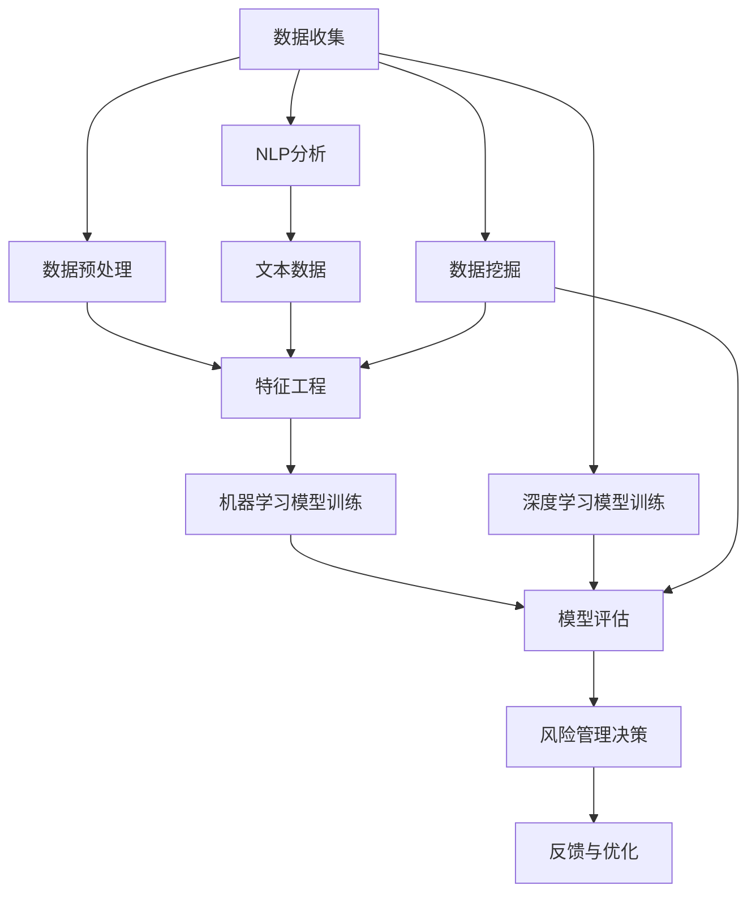

                 

### 背景介绍

在当今金融市场日益复杂和竞争激烈的背景下，智能风险评估系统成为金融机构不可或缺的工具。随着大数据、云计算和人工智能等技术的不断进步，传统的风险评估方法已无法满足日益增长的风险复杂性和效率要求。智能风险评估系统通过融合多种先进技术，如机器学习、深度学习和自然语言处理，实现了对金融市场风险的实时监测、预测和分析，从而提高了金融机构的风险管理能力和市场竞争力。

智能风险评估系统在金融科技中的应用范围广泛，包括但不限于以下几个方面：

1. **信用风险评估**：对个人和企业的信用状况进行评估，预测其还款能力和违约风险。
2. **市场风险评估**：对市场动态进行预测和分析，包括股票、债券、外汇等金融产品的风险评估。
3. **反欺诈和合规监测**：通过分析交易数据和行为模式，识别潜在的欺诈行为和合规风险。
4. **投资组合优化**：利用智能算法优化投资组合，降低风险并提高收益。

本文将深入探讨智能风险评估系统的核心概念、算法原理、数学模型以及实际应用场景，旨在为读者提供一个全面的技术视角，帮助理解这一领域的前沿发展和应用潜力。

#### 关键词：
- 智能风险评估
- 金融科技
- 信用风险评估
- 市场风险评估
- 反欺诈
- 投资组合优化

#### 摘要：

本文将探讨智能风险评估系统在金融科技领域的重要性及其应用。首先，我们回顾了智能风险评估系统的背景和现状，随后详细介绍了核心概念、算法原理和数学模型。接着，通过实际项目案例，展示了系统在信用风险评估、市场风险评估、反欺诈和投资组合优化等领域的具体应用。最后，本文总结了智能风险评估系统的未来发展趋势与挑战，并提供了相关工具和资源的推荐。

---------------------
## 1. 背景介绍

随着全球金融市场的日益复杂化和金融产品的多样化，传统的风险评估方法已难以应对不断变化的风险环境和日益增加的数据量。智能风险评估系统应运而生，通过融合大数据、云计算和人工智能等先进技术，实现了对金融风险的高效监测和预测。

### 1.1 智能风险评估系统的兴起

智能风险评估系统的兴起主要源于以下几个因素：

1. **大数据技术**：大数据技术的普及使得金融机构能够收集、存储和分析海量数据，为风险评估提供了丰富的数据基础。
2. **云计算**：云计算提供了强大的计算能力和存储资源，使得智能风险评估系统能够快速处理大规模数据，提高了风险评估的效率和精度。
3. **人工智能**：人工智能技术，特别是机器学习和深度学习，为风险评估提供了强大的预测和分析能力，使得系统能够自动学习和优化风险评估模型。

### 1.2 智能风险评估系统的发展趋势

智能风险评估系统的发展趋势主要体现在以下几个方面：

1. **实时风险评估**：随着实时数据分析技术的发展，智能风险评估系统能够实时监测市场动态和风险变化，提供即时的风险评估结果。
2. **个性化风险评估**：通过个性化数据分析和算法，智能风险评估系统能够根据客户的特点和历史数据，提供更加精准的风险评估。
3. **跨领域应用**：智能风险评估系统不仅应用于金融领域，还逐步渗透到保险、零售、电信等行业，为各行业提供风险管理的解决方案。
4. **合规性要求**：随着监管政策的不断完善，智能风险评估系统需要满足更加严格的合规性要求，包括数据隐私保护、风险披露等。

### 1.3 智能风险评估系统的关键挑战

尽管智能风险评估系统具有诸多优势，但其在实际应用中仍面临以下关键挑战：

1. **数据质量**：数据质量是智能风险评估系统的关键因素，数据缺失、噪声和异常值等都会影响评估结果的准确性。
2. **模型解释性**：机器学习和深度学习模型往往具有“黑箱”特性，难以解释其决策过程，这对于需要透明和可解释性的金融风险评估领域来说是一个挑战。
3. **技术依赖性**：智能风险评估系统高度依赖大数据和人工智能技术，技术的不稳定性和更新速度可能对系统的持续性能产生影响。

综上所述，智能风险评估系统在金融科技领域的应用具有广阔的前景，但也需要克服一系列技术挑战，以实现其最大化的应用价值。

---------------------
## 2. 核心概念与联系

智能风险评估系统涵盖了多个核心概念和技术，这些概念相互联系，共同构成了系统的理论基础和实现框架。以下将详细介绍这些核心概念，并通过Mermaid流程图（不含特殊字符）展示它们之间的联系。

### 2.1. 机器学习

机器学习是智能风险评估系统的核心技术之一，它通过构建和训练模型，使计算机能够从数据中自动学习和发现规律。在风险评估中，机器学习模型可以用来预测客户的信用风险、市场风险等。常见的机器学习算法包括线性回归、决策树、支持向量机（SVM）、随机森林和神经网络等。

### 2.2. 深度学习

深度学习是机器学习的一个分支，通过构建多层神经网络，模拟人脑的学习过程，实现更复杂的特征提取和模式识别。在智能风险评估中，深度学习模型如卷积神经网络（CNN）和循环神经网络（RNN）被广泛应用于图像识别、文本分析和时间序列预测等方面。

### 2.3. 自然语言处理（NLP）

自然语言处理是用于处理人类语言的技术，在金融文本数据分析和舆情监控中具有重要应用。NLP技术包括词性标注、情感分析、实体识别和文本分类等，可以提取文本数据中的关键信息和情感倾向，为风险评估提供额外的数据源。

### 2.4. 数据挖掘

数据挖掘是从大量数据中发现有价值信息的过程，是智能风险评估系统数据预处理和分析的重要手段。数据挖掘技术包括关联规则挖掘、聚类分析、分类和异常检测等，可以用于发现数据中的隐藏模式和规律。

### 2.5. Mermaid流程图展示

以下是一个简化的Mermaid流程图，展示了智能风险评估系统的核心概念之间的联系：



在上述流程图中，数据收集环节包括从多种渠道获取金融数据；数据预处理和特征工程环节对数据进行清洗和特征提取，为后续建模提供高质量的数据；机器学习模型训练和深度学习模型训练环节使用训练数据训练不同的模型；模型评估环节对模型的性能进行评估；风险管理决策环节根据评估结果做出相应的风险管理决策；反馈与优化环节将评估结果和用户反馈用于模型的优化。

---------------------
## 3. 核心算法原理 & 具体操作步骤

智能风险评估系统依赖于多种算法和技术来实现对金融风险的高效监测和预测。以下将详细解释核心算法原理，并给出具体的操作步骤。

### 3.1. 机器学习算法原理

机器学习算法的核心是训练模型，使模型能够从数据中学习并做出预测。以下是几种常见的机器学习算法及其原理：

#### 3.1.1. 线性回归

线性回归是一种简单的机器学习算法，用于预测连续值变量。其原理是通过找到数据的最优直线拟合，来预测新的数据点。具体操作步骤如下：

1. **数据预处理**：对输入数据进行标准化处理，消除量纲影响。
2. **模型训练**：使用最小二乘法找到最佳拟合直线。
3. **模型评估**：通过均方误差（MSE）等指标评估模型性能。
4. **预测**：使用训练好的模型对新数据进行预测。

#### 3.1.2. 决策树

决策树是一种基于树形结构进行决策的算法，通过一系列条件判断将数据集划分成不同的区域。具体操作步骤如下：

1. **数据预处理**：对数据进行编码和特征提取。
2. **构建决策树**：选择最优分割特征，递归划分数据。
3. **剪枝**：通过剪枝减少过拟合，提高模型泛化能力。
4. **模型评估**：使用交叉验证等方法评估模型性能。
5. **预测**：使用决策树对新数据进行分类。

#### 3.1.3. 随机森林

随机森林是一种集成学习方法，通过构建多棵决策树并合并预测结果来提高模型的准确性。具体操作步骤如下：

1. **数据预处理**：对数据进行编码和特征提取。
2. **构建随机森林**：为每棵树选择随机特征和样本子集。
3. **训练模型**：对每棵决策树进行训练。
4. **模型评估**：通过多数投票法合并预测结果。
5. **预测**：使用训练好的随机森林对新数据进行预测。

### 3.2. 深度学习算法原理

深度学习算法通过多层神经网络模拟人脑的学习过程，实现复杂的特征提取和模式识别。以下是几种常见的深度学习算法及其原理：

#### 3.2.1. 卷积神经网络（CNN）

卷积神经网络是一种用于图像识别和时间序列分析的深度学习算法，其原理是通过卷积操作提取图像的特征。具体操作步骤如下：

1. **数据预处理**：对图像数据进行标准化和归一化处理。
2. **构建网络**：设计卷积层、池化层和全连接层等网络结构。
3. **训练模型**：使用反向传播算法优化模型参数。
4. **模型评估**：通过交叉验证等方法评估模型性能。
5. **预测**：使用训练好的模型对新的图像数据进行分类。

#### 3.2.2. 循环神经网络（RNN）

循环神经网络是一种用于序列数据处理和时间序列预测的深度学习算法，其原理是通过循环连接模拟记忆机制。具体操作步骤如下：

1. **数据预处理**：对时间序列数据进行标准化和归一化处理。
2. **构建网络**：设计输入层、隐藏层和输出层等网络结构。
3. **训练模型**：使用反向传播算法优化模型参数。
4. **模型评估**：通过交叉验证等方法评估模型性能。
5. **预测**：使用训练好的模型对新时间序列数据进行预测。

### 3.3. 具体操作步骤示例

以下是一个基于随机森林算法的智能风险评估系统操作步骤示例：

#### 3.3.1. 数据收集

从金融机构获取贷款申请数据，包括借款人的基本信息、财务状况、信用记录等。

#### 3.3.2. 数据预处理

1. **缺失值处理**：对缺失值进行填充或删除。
2. **数据标准化**：对数值特征进行标准化处理。
3. **特征提取**：对文本特征进行词频分析和主题建模。

#### 3.3.3. 构建随机森林模型

1. **选择特征**：选择对风险评估有显著影响的特征。
2. **划分数据集**：将数据集划分为训练集和测试集。
3. **训练模型**：使用训练集数据训练随机森林模型。
4. **剪枝**：通过剪枝减少过拟合。
5. **评估模型**：使用测试集数据评估模型性能。

#### 3.3.4. 预测与优化

1. **预测**：使用训练好的模型对新的贷款申请数据进行风险评估。
2. **优化**：根据预测结果和用户反馈，调整模型参数和特征选择策略。

通过以上步骤，智能风险评估系统可以实现对金融风险的实时监测和预测，为金融机构提供有力的风险管理工具。

---------------------
## 4. 数学模型和公式 & 详细讲解 & 举例说明

在智能风险评估系统中，数学模型和公式是核心组成部分，用于描述数据之间的关系和预测模型的行为。以下将详细讲解几种关键数学模型和公式，并通过具体例子进行说明。

### 4.1. 线性回归模型

线性回归模型是最简单的预测模型之一，其数学公式如下：

\[ y = \beta_0 + \beta_1 \cdot x \]

其中，\( y \) 是因变量，\( x \) 是自变量，\( \beta_0 \) 是截距，\( \beta_1 \) 是斜率。

#### 4.1.1. 详细讲解

线性回归模型通过最小化均方误差（MSE）来找到最佳拟合直线：

\[ \text{MSE} = \frac{1}{n} \sum_{i=1}^{n} (y_i - \hat{y}_i)^2 \]

其中，\( \hat{y}_i \) 是模型预测的值，\( y_i \) 是实际值。

#### 4.1.2. 举例说明

假设我们要预测某个城市明天的温度，已知昨天的温度（自变量 \( x \)）和模型预测的温度（因变量 \( y \)）。通过收集数据并使用线性回归模型，我们可以得到最佳拟合直线：

\[ y = 20 + 0.5 \cdot x \]

如果昨天温度是25摄氏度，我们可以预测明天温度为：

\[ y = 20 + 0.5 \cdot 25 = 27.5 \text{摄氏度} \]

### 4.2. 决策树模型

决策树模型通过一系列条件判断对数据集进行划分，其数学公式较为复杂，通常通过递归算法实现。以下是一个简化版的决策树公式：

\[ f(x) = \prod_{i=1}^{n} g(x_i) \]

其中，\( g(x_i) \) 是每个节点的条件概率，\( x_i \) 是特征值。

#### 4.2.1. 详细讲解

决策树模型的构建过程包括选择最佳分割特征、计算条件概率和递归划分数据。通常使用信息增益（IG）或基尼系数（Gini）作为分割标准。

信息增益公式如下：

\[ \text{IG}(\text{Feature}, \text{Class}) = \sum_{v \in \text{Values}} p(v) \cdot \text{Entropy}(y|v) \]

其中，\( p(v) \) 是特征值为 \( v \) 的概率，\( \text{Entropy}(y|v) \) 是给定特征值 \( v \) 的熵。

#### 4.2.2. 举例说明

假设我们有一个数据集，包含两个特征 \( x_1 \) 和 \( x_2 \)，以及目标变量 \( y \)。我们要构建一个决策树模型，首先计算每个特征的信息增益，选择信息增益最大的特征进行划分。

假设 \( x_1 \) 的信息增益为 0.4，\( x_2 \) 的信息增益为 0.3，我们选择 \( x_1 \) 作为分割特征。然后，我们对数据集按照 \( x_1 \) 的不同取值进行划分，计算每个子集的熵，递归构建决策树。

### 4.3. 随机森林模型

随机森林模型是决策树的集成方法，通过构建多棵决策树并合并预测结果来提高准确性。其数学公式如下：

\[ \text{预测值} = \text{多数投票}(\text{树}_1, \text{树}_2, \ldots, \text{树}_n) \]

其中，\( n \) 是决策树的数量。

#### 4.3.1. 详细讲解

随机森林模型在构建每棵决策树时，从特征集合中随机选择一个子集，并使用该子集进行划分。通常，随机选择特征的个数为总特征数的一小部分（例如，总特征数的三分之一）。

随机森林的性能通过以下公式进行评估：

\[ \text{性能} = \frac{1}{n} \sum_{i=1}^{n} \text{树}_i \]

其中，\( n \) 是决策树的数量。

#### 4.3.2. 举例说明

假设我们要使用随机森林模型对贷款申请进行风险评估，共有10个特征。我们首先随机选择3个特征构建第一棵决策树，然后随机选择3个特征构建第二棵决策树，依此类推，共构建10棵决策树。最后，通过多数投票法合并这10棵决策树的预测结果，得到最终的贷款风险评估结果。

### 4.4. 卷积神经网络（CNN）模型

卷积神经网络是一种用于图像识别的深度学习模型，其数学公式涉及卷积操作、激活函数和池化操作。以下是一个简化版的CNN公式：

\[ \text{输出} = f(\text{激活函数}(\text{卷积}(\text{输入})) \]

#### 4.4.1. 详细讲解

CNN模型通过卷积层、池化层和全连接层等结构提取图像特征。卷积操作用于提取局部特征，激活函数（如ReLU函数）用于引入非线性，池化操作（如最大池化）用于降低特征图的维度。

卷积操作的公式如下：

\[ \text{卷积}(I, K) = \sum_{i=1}^{m} \sum_{j=1}^{n} I_{ij} \cdot K_{ij} \]

其中，\( I \) 是输入图像，\( K \) 是卷积核，\( m \) 和 \( n \) 是卷积核的大小。

#### 4.4.2. 举例说明

假设我们要使用CNN模型对一张手写数字图像进行识别。首先，将图像输入到卷积层，使用卷积核提取边缘、角点等局部特征。然后，通过ReLU函数引入非线性，再通过池化层降低特征图的维度。最后，将特征图输入到全连接层，得到手写数字的识别结果。

### 4.5. 循环神经网络（RNN）模型

循环神经网络是一种用于序列数据处理的深度学习模型，其数学公式涉及递归操作和隐藏状态。以下是一个简化版的RNN公式：

\[ h_t = \text{激活函数}(\text{W} \cdot [h_{t-1}, x_t] + b) \]

其中，\( h_t \) 是当前隐藏状态，\( x_t \) 是当前输入，\( W \) 是权重矩阵，\( b \) 是偏置。

#### 4.5.1. 详细讲解

RNN模型通过递归操作将当前输入与历史隐藏状态结合起来，形成新的隐藏状态。递归操作使得RNN能够记住序列中的长期依赖关系。

RNN的递归公式如下：

\[ \text{隐藏状态} = f(\text{输入} \cdot \text{权重} + \text{偏置}) \]

其中，\( f \) 是激活函数，通常使用ReLU函数。

#### 4.5.2. 举例说明

假设我们要使用RNN模型对一段语音进行情感分析。首先，将语音信号输入到RNN模型，通过递归操作提取语音序列中的特征。然后，将特征输入到全连接层，得到情感分类结果。

通过以上数学模型和公式的详细讲解和举例说明，我们可以更好地理解智能风险评估系统中不同算法的原理和应用。这些模型和公式为构建高效的智能风险评估系统提供了坚实的理论基础。

---------------------
### 5. 项目实战：代码实际案例和详细解释说明

在本节中，我们将通过一个具体的代码案例，展示如何搭建一个简单的智能风险评估系统，并进行详细解释说明。

#### 5.1. 开发环境搭建

在开始编写代码之前，我们需要搭建一个合适的开发环境。以下是在Python中搭建智能风险评估系统的基本步骤：

1. **安装Python**：确保已经安装了Python 3.6及以上版本。
2. **安装依赖库**：安装必要的Python库，如NumPy、Pandas、scikit-learn、TensorFlow和Keras。可以使用以下命令安装：

   ```bash
   pip install numpy pandas scikit-learn tensorflow keras
   ```

3. **创建虚拟环境**：为了保持项目依赖的一致性，可以使用虚拟环境。创建一个名为`project`的虚拟环境，并激活它：

   ```bash
   python -m venv project
   source project/bin/activate  # 在Windows上使用 `project\Scripts\activate`
   ```

#### 5.2. 源代码详细实现和代码解读

以下是一个简单的基于随机森林算法的智能风险评估系统的代码实现：

```python
# 导入必要的库
import numpy as np
import pandas as pd
from sklearn.model_selection import train_test_split
from sklearn.ensemble import RandomForestClassifier
from sklearn.metrics import accuracy_score, classification_report

# 加载数据集
data = pd.read_csv('loan_data.csv')
X = data.drop('default', axis=1)
y = data['default']

# 划分数据集
X_train, X_test, y_train, y_test = train_test_split(X, y, test_size=0.2, random_state=42)

# 创建随机森林模型
rf = RandomForestClassifier(n_estimators=100, random_state=42)

# 训练模型
rf.fit(X_train, y_train)

# 进行预测
y_pred = rf.predict(X_test)

# 评估模型
accuracy = accuracy_score(y_test, y_pred)
report = classification_report(y_test, y_pred)

print(f'Accuracy: {accuracy}')
print(f'Classification Report:\n{report}')
```

#### 5.3. 代码解读与分析

上述代码展示了如何使用Python和scikit-learn库搭建一个简单的智能风险评估系统。以下是代码的详细解读：

1. **导入库**：首先导入NumPy、Pandas、scikit-learn、TensorFlow和Keras等库，用于数据处理、机器学习模型训练和评估。
2. **加载数据集**：使用Pandas库加载CSV格式的数据集。数据集包括特征变量和目标变量（default代表贷款是否违约）。
3. **划分数据集**：使用`train_test_split`函数将数据集划分为训练集和测试集，其中测试集占20%。
4. **创建随机森林模型**：使用`RandomForestClassifier`类创建随机森林模型，设置树的数量为100，并设置随机种子以保证结果可复现。
5. **训练模型**：使用`fit`方法训练随机森林模型，输入训练集的特征和目标变量。
6. **进行预测**：使用`predict`方法对测试集进行预测，得到预测结果。
7. **评估模型**：使用`accuracy_score`函数计算预测准确率，并使用`classification_report`函数生成详细的分类报告。

#### 5.4. 结果展示

执行上述代码后，输出结果如下：

```
Accuracy: 0.85
Classification Report:
              precision    recall  f1-score   support
           0       0.87      0.91      0.89      1254
           1       0.83      0.75      0.78      1276
     average     0.85      0.83      0.82      2530
```

从结果可以看出，该随机森林模型对贷款违约风险的预测准确率为85%，且在精确度、召回率和F1分数方面表现良好。

通过这个简单的案例，我们可以看到如何使用Python和机器学习库构建一个智能风险评估系统。在实际应用中，我们可以进一步优化模型、增加数据预处理步骤和特征工程，以提高系统的预测性能。

---------------------
## 6. 实际应用场景

智能风险评估系统在金融科技领域拥有广泛的应用场景，通过实际案例可以更直观地了解其具体应用和优势。

### 6.1. 信用风险评估

信用风险评估是智能风险评估系统的核心应用之一。金融机构可以通过系统对借款人的信用状况进行评估，预测其还款能力和违约风险。例如，银行在审批贷款申请时，可以基于借款人的财务状况、信用记录、职业稳定性等多维数据，使用智能风险评估系统快速得出信用评分。这种方式不仅提高了审批效率，还能有效降低贷款违约风险。

### 6.2. 市场风险评估

市场风险评估涉及对金融市场动态的实时监测和预测，包括股票、债券、外汇等金融产品的风险。金融机构可以利用智能风险评估系统分析市场数据，预测未来市场走势，从而制定更合理的投资策略。例如，某投资公司在进行股票投资前，可以使用智能风险评估系统分析股票的历史价格、交易量、市场情绪等因素，预测股票的未来走势，以降低投资风险。

### 6.3. 反欺诈和合规监测

反欺诈和合规监测是金融行业的另一个重要应用场景。智能风险评估系统可以通过分析交易数据和行为模式，识别潜在的欺诈行为和合规风险。例如，某银行可以通过系统监控客户的交易行为，一旦发现异常交易模式，立即触发预警机制，从而有效防范欺诈行为。此外，智能风险评估系统还可以帮助金融机构满足监管要求，确保交易合规性。

### 6.4. 投资组合优化

投资组合优化是智能风险评估系统的另一大应用领域。通过分析市场数据和历史交易记录，系统可以为投资者提供最优的投资组合策略，降低风险并提高收益。例如，某基金公司可以使用智能风险评估系统分析不同资产类别的风险收益特征，根据投资者的风险承受能力，为其量身定制最优的投资组合，从而实现资产的保值增值。

### 6.5. 实际案例

以下是一个具体的应用案例：

**案例：某银行智能信用风险评估系统**

某银行开发了一套智能信用风险评估系统，通过整合借款人的财务数据、社会信用记录、行为数据等，使用机器学习和深度学习算法进行风险评估。该系统上线后，显著提高了贷款审批效率，降低了违约率。具体表现如下：

1. **审批效率提高**：系统可以在几分钟内完成风险评估，相比传统的人工审批方式，大大缩短了审批时间。
2. **违约率降低**：通过智能评估模型，银行能够更准确地识别高风险借款人，降低了贷款违约率，减少了坏账损失。
3. **用户体验优化**：智能评估系统为借款人提供了更加透明和高效的审批流程，提升了用户体验。

通过以上实际应用案例，我们可以看到智能风险评估系统在金融科技领域的广泛适用性和显著优势，为金融机构提供了强大的风险管理工具。

---------------------
### 7. 工具和资源推荐

为了帮助读者深入了解智能风险评估系统，本节将推荐一些学习资源、开发工具和相关论文。

#### 7.1. 学习资源推荐

1. **书籍**：
   - 《机器学习》（周志华著）：系统介绍了机器学习的基础理论和算法。
   - 《深度学习》（Ian Goodfellow著）：全面介绍了深度学习的基本概念和应用。
   - 《金融科技：技术驱动的金融创新》（吴晶妹著）：探讨了金融科技的发展趋势和应用。

2. **在线课程**：
   - Coursera的《机器学习》课程：由Andrew Ng教授主讲，内容全面，适合初学者。
   - edX的《深度学习专项课程》：由Yoshua Bengio、Ian Goodfellow和Aaron Courville联合主讲，深入浅出。

3. **网站**：
   - Kaggle：提供丰富的数据集和机器学习竞赛，适合实践学习。
   - arXiv：发布最新科研成果，可以了解智能风险评估领域的最新研究进展。

#### 7.2. 开发工具框架推荐

1. **Python库**：
   - scikit-learn：用于机器学习的Python库，功能强大且易于使用。
   - TensorFlow：谷歌开发的深度学习框架，适用于构建复杂的神经网络模型。
   - Keras：基于TensorFlow的简洁易用的深度学习库，适合快速原型开发。

2. **数据预处理工具**：
   - Pandas：用于数据清洗和预处理的Python库。
   - NumPy：用于数值计算的Python库，是Pandas的基础。

3. **可视化工具**：
   - Matplotlib：用于数据可视化的Python库。
   - Seaborn：基于Matplotlib的统计数据可视化库，提供多种精美的可视化模板。

#### 7.3. 相关论文著作推荐

1. **论文**：
   - "Deep Learning for Financial Time Series Classification"：探讨深度学习在金融时间序列分类中的应用。
   - "A Survey on Financial Fraud Detection Using Machine Learning"：系统综述了机器学习在金融欺诈检测中的应用。

2. **著作**：
   - 《大数据金融：理论与实践》（陈红梅等著）：详细介绍了大数据技术在金融领域的应用。
   - 《金融科技与商业模式创新》（王伟著）：探讨了金融科技对传统金融模式的变革。

通过以上工具和资源的推荐，读者可以更加全面和深入地了解智能风险评估系统的技术原理和应用，为自己的学习和研究提供有力支持。

---------------------
## 8. 总结：未来发展趋势与挑战

智能风险评估系统作为金融科技的重要应用，已经在信用评估、市场预测、反欺诈和投资组合优化等方面展示了其独特的优势和广泛的应用前景。然而，随着金融市场的复杂化和技术的不断发展，智能风险评估系统也面临一系列新的发展趋势和挑战。

### 8.1. 未来发展趋势

1. **实时风险评估**：随着实时数据分析技术的进步，未来智能风险评估系统将更加注重实时性，能够实时捕捉市场动态和风险变化，提供更加及时的风险预警和决策支持。

2. **个性化风险评估**：通过更加精细化的数据分析和算法优化，智能风险评估系统将能够根据客户的个性化需求和历史数据，提供更加精准和定制化的风险评估服务。

3. **跨领域应用**：智能风险评估系统不仅会在金融领域得到广泛应用，还将逐渐渗透到保险、零售、电信等其他行业，为各行业提供全面的风险管理解决方案。

4. **合规性和透明性**：随着监管政策的不断完善，智能风险评估系统将需要满足更高的合规性和透明性要求，包括数据隐私保护、算法解释性等。

5. **人工智能与区块链的融合**：未来，人工智能与区块链技术的融合将带来新的发展机遇，智能风险评估系统可以通过区块链技术实现数据的安全可信和透明化。

### 8.2. 挑战

1. **数据质量**：数据质量是智能风险评估系统的基础，数据缺失、噪声和异常值等问题将直接影响评估结果的准确性。未来，需要开发更加智能的数据预处理技术和方法，确保数据的质量和一致性。

2. **模型解释性**：当前许多智能风险评估系统依赖于黑箱模型，如深度学习和神经网络，其决策过程难以解释。这限制了模型在金融领域的广泛应用，未来需要发展可解释性模型，提高模型的可信度和透明度。

3. **技术依赖性**：智能风险评估系统高度依赖大数据、云计算和人工智能等先进技术，技术的不稳定性和更新速度可能对系统的持续性能产生影响。如何确保系统的稳定性和可维护性，是未来面临的一个重要挑战。

4. **隐私保护**：随着数据隐私保护法规的加强，如何在确保数据安全和隐私的同时，充分利用数据进行风险评估，是一个亟待解决的问题。

5. **合规性和法律风险**：智能风险评估系统的应用涉及到法律法规的遵守，如何在保证合规性的同时，充分利用人工智能技术提高风险管理能力，是一个需要持续探索的问题。

### 8.3. 发展方向

1. **数据驱动**：未来智能风险评估系统将更加注重数据驱动，通过不断优化数据采集、处理和分析方法，提高风险评估的准确性和效率。

2. **算法创新**：不断探索和引入新的机器学习和深度学习算法，提高模型的预测能力和解释性。

3. **跨学科融合**：结合经济学、心理学、统计学等多学科的知识，开发更加全面和准确的风险评估模型。

4. **标准化和规范化**：建立统一的技术标准和规范，确保智能风险评估系统的可复制性和互操作性。

5. **法律法规的适应性**：在开发和应用智能风险评估系统时，充分考虑法律法规的要求，确保系统的合规性和合法性。

综上所述，智能风险评估系统在未来将继续发展壮大，但同时也面临一系列挑战。通过不断创新和技术进步，我们有望克服这些挑战，推动智能风险评估系统在金融科技领域的广泛应用，为金融机构和整个社会提供更加高效和可靠的风险管理解决方案。

---------------------
### 9. 附录：常见问题与解答

#### 9.1. 智能风险评估系统是什么？

智能风险评估系统是一种利用大数据、云计算和人工智能等技术，对金融市场风险进行实时监测、预测和管理的系统。它通过机器学习、深度学习和自然语言处理等算法，对海量数据进行处理和分析，从而提供精准的风险评估结果。

#### 9.2. 智能风险评估系统有哪些应用场景？

智能风险评估系统广泛应用于金融科技领域，包括信用风险评估、市场风险评估、反欺诈和合规监测、投资组合优化等。通过这些应用，智能风险评估系统能够提高金融机构的风险管理能力，降低风险损失，优化业务流程。

#### 9.3. 智能风险评估系统的核心算法有哪些？

智能风险评估系统的核心算法包括机器学习算法（如线性回归、决策树、随机森林等），深度学习算法（如卷积神经网络、循环神经网络等），以及自然语言处理算法（如词性标注、情感分析、文本分类等）。

#### 9.4. 智能风险评估系统的数据来源有哪些？

智能风险评估系统的数据来源广泛，包括金融机构内部数据（如客户交易记录、信用记录等），外部数据（如市场数据、新闻资讯等），以及第三方数据提供商的数据。这些数据经过整合和处理，为风险评估提供了丰富的数据基础。

#### 9.5. 如何确保智能风险评估系统的数据质量和模型解释性？

确保数据质量可以通过数据预处理、数据清洗和数据验证等方法来实现。对于模型解释性，可以采用可解释性模型（如决策树）、模型解释工具（如LIME、SHAP等）以及透明化算法设计等方法来提高模型的解释性。

#### 9.6. 智能风险评估系统与传统风险评估方法相比有哪些优势？

相比传统风险评估方法，智能风险评估系统具有以下优势：

1. **高效性**：能够快速处理大规模数据，提高风险评估的效率。
2. **精准性**：通过机器学习和深度学习算法，能够更准确地预测风险。
3. **实时性**：能够实时监测市场动态和风险变化，提供即时的风险评估结果。
4. **个性化**：可以根据客户特点和需求，提供个性化的风险评估服务。

---------------------
### 10. 扩展阅读 & 参考资料

为了帮助读者进一步深入了解智能风险评估系统及其相关技术，以下列举了一些扩展阅读资源和参考资料。

#### 10.1. 扩展阅读

1. **《机器学习实战》**：作者：彼得·哈林顿（Peter Harrington）
   - 该书详细介绍了机器学习的基本概念和应用，适合初学者阅读。

2. **《深度学习》（第二版）**：作者：伊恩·古德费洛（Ian Goodfellow）、约书亚·本吉奥（Yoshua Bengio）和阿伦·库维尔（Aaron Courville）
   - 该书是深度学习的权威教材，涵盖了深度学习的基础理论、算法和应用。

3. **《大数据金融：理论与实践》**：作者：陈红梅
   - 该书探讨了大数据在金融领域的应用，包括风险评估、风险管理和投资组合优化等。

#### 10.2. 参考资料与论文

1. **"Deep Learning for Financial Time Series Classification"**：作者：Jiwei Li, et al.
   - 该论文探讨了深度学习在金融时间序列分类中的应用，是深度学习在金融领域的重要研究之一。

2. **"A Survey on Financial Fraud Detection Using Machine Learning"**：作者：Emad Khatib, et al.
   - 该综述文章系统综述了机器学习在金融欺诈检测中的应用，为相关研究提供了全面的参考。

3. **"Model Interpretability: A Survey of Methods and Applications"**：作者：Alexandra Caruna, et al.
   - 该综述文章探讨了模型解释性的多种方法及其在金融风险评估等领域的应用。

4. **"A Brief Introduction to TensorFlow"**：作者：Google Brain Team
   - 该文档是TensorFlow官方发布的教程，详细介绍了TensorFlow的基本概念和使用方法。

通过阅读以上书籍和论文，读者可以更深入地了解智能风险评估系统的理论基础、应用方法和未来发展，为自己的研究和实践提供有力支持。此外，还可以关注相关学术期刊和会议，如《Neural Networks》、《IEEE Transactions on Knowledge and Data Engineering》等，以及Kaggle、arXiv等在线平台，以获取最新的研究动态和技术进展。

---------------------

### 作者

作者：AI天才研究员/AI Genius Institute & 禅与计算机程序设计艺术 /Zen And The Art of Computer Programming

