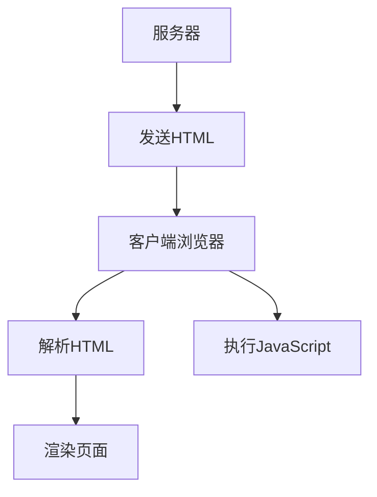
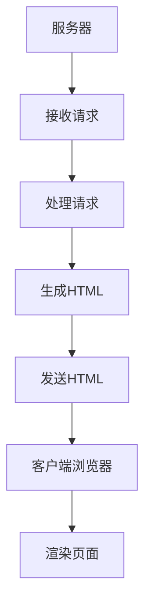

                 

### 背景介绍

> "服务器端渲染（Server-Side Rendering, SSR）" 是现代 Web 开发中一个关键的概念，它对于优化用户体验、提升页面加载速度至关重要。在本文中，我们将深入探讨 SSR 的核心概念、原理和实现方法，并通过具体案例和实践，展示如何通过 SSR 提升首屏加载速度。

随着互联网的快速发展，用户对网站和应用程序的期望越来越高。他们希望获得快速、流畅、无延迟的体验。为了满足这些需求，开发者们不断探索新的技术手段来优化网站性能。服务器端渲染（SSR）就是其中之一，它通过在服务器端完成页面的渲染过程，为用户提供更好的用户体验。

在传统的客户端渲染（Client-Side Rendering, CSR）中，服务器发送给客户端的是 HTML 文档，然后由客户端的浏览器进行渲染。这种方式的缺点在于，页面在初次加载时需要等待 JavaScript 脚本的执行完成，才能开始渲染。这往往会导致页面空白或加载缓慢，影响用户体验。而服务器端渲染（SSR）则解决了这一问题，它允许在服务器端完成页面的初始渲染，然后将已经渲染好的 HTML 页面发送给客户端，从而大幅缩短首屏加载时间。

SSR 不仅提升了页面加载速度，还提供了其他一些优点。例如，它使得搜索引擎优化（SEO）变得更加容易，因为搜索引擎可以更好地理解和索引服务器端渲染的页面内容。此外，SSR 还可以减少客户端的负载，因为客户端不需要处理大量的 JavaScript 脚本和模板渲染逻辑。

本文将分为以下几个部分：

1. **核心概念与联系**：介绍 SSR 的核心概念，并使用 Mermaid 流程图展示其与 CSR 的区别和联系。
2. **核心算法原理 & 具体操作步骤**：详细解释 SSR 的原理，并分步骤说明如何实现 SSR。
3. **数学模型和公式 & 详细讲解 & 举例说明**：介绍与 SSR 相关的数学模型和公式，并通过实例进行详细讲解。
4. **项目实战：代码实际案例和详细解释说明**：展示一个具体的 SSR 项目案例，并详细解释其实现过程和代码解读。
5. **实际应用场景**：探讨 SSR 在不同场景下的应用和优势。
6. **工具和资源推荐**：推荐学习资源和开发工具，帮助读者进一步深入学习和实践。
7. **总结：未来发展趋势与挑战**：总结 SSR 的当前趋势和未来挑战。

通过这篇文章，我们希望能够帮助读者全面了解 SSR 的概念、原理和应用，以及如何利用 SSR 提升首屏加载速度。

### 核心概念与联系

服务器端渲染（Server-Side Rendering, SSR）是一种在服务器端完成页面渲染的技术，与之相对的是客户端渲染（Client-Side Rendering, CSR）。在 CSR 中，服务器发送给客户端的是未渲染的 HTML 文档，客户端的浏览器负责解析 HTML 并执行 JavaScript 脚本以完成页面的渲染。而 SSR 则是在服务器端完成页面的渲染，然后将渲染好的 HTML 页面发送给客户端。

为了更好地理解 SSR 和 CSR 之间的区别和联系，我们可以使用 Mermaid 流程图来展示这两个过程的步骤和流程。

#### CSR 流程图



在上面的 CSR 流程图中，服务器发送未渲染的 HTML 文档给客户端浏览器。客户端浏览器负责解析 HTML 并执行 JavaScript 脚本，最后完成页面的渲染。

#### SSR 流程图



在上面的 SSR 流程图中，服务器接收请求后，直接在服务器端完成页面的渲染，然后将渲染好的 HTML 页面发送给客户端浏览器。客户端浏览器接收到 HTML 页面后，直接开始渲染页面，无需等待 JavaScript 脚本的执行。

通过对比 CSR 和 SSR 的流程图，我们可以看出 SSR 的一个主要优势是缩短了页面的初始加载时间。在 CSR 中，页面初次加载时需要等待 JavaScript 脚本的执行完成，而在 SSR 中，页面在服务器端已经完成渲染，客户端浏览器可以直接开始渲染页面。

#### SSR 与 CSR 的联系

尽管 SSR 和 CSR 在实现方式和流程上有所不同，但它们之间也存在联系。例如，一些现代前端框架（如 React 和 Vue）同时支持 SSR 和 CSR。这意味着开发者可以根据具体的需求选择合适的技术方案。

1. **数据同步**：在 SSR 中，服务器渲染的页面可能需要与客户端的 JavaScript 脚本进行数据同步。例如，React 的 SSR 实现中，服务器生成的 HTML 页面需要包含一个 `__INIT_STATE__` 属性，用于在客户端的 JavaScript 脚本中初始化应用状态。
2. **缓存策略**：SSR 和 CSR 都需要考虑缓存策略，以提升页面加载速度和减少服务器负载。在 SSR 中，服务器可以设置页面缓存，以便在后续请求中直接返回缓存页面，减少渲染时间。

综上所述，服务器端渲染（SSR）和客户端渲染（CSR）各有其优缺点。通过了解它们的区别和联系，开发者可以根据实际需求选择合适的技术方案，以提升网站性能和用户体验。

### 核心算法原理 & 具体操作步骤

#### 1. SSR 原理

服务器端渲染（SSR）的核心原理是在服务器端完成页面的渲染过程，而不是在客户端。这意味着在服务器端，不仅需要处理 HTTP 请求，还需要解析模板、执行 JavaScript 脚本，并将渲染结果发送给客户端。SSR 的主要步骤如下：

1. **接收请求**：服务器接收到来自客户端的 HTTP 请求，请求通常包含页面的 URL 和其他参数。
2. **处理请求**：服务器根据请求的 URL 和参数，确定需要渲染的页面。这通常涉及路由处理和中间件处理。
3. **渲染页面**：服务器使用模板引擎（如 EJS、Pug、Handlebars 等）解析模板文件，并根据请求的数据生成 HTML 页面。此外，服务器还需要执行 JavaScript 脚本，以便在客户端可以正确地初始化应用状态。
4. **发送响应**：服务器将渲染好的 HTML 页面作为 HTTP 响应发送给客户端，客户端浏览器接收到响应后，直接开始渲染页面。

#### 2. 实现步骤

下面我们将详细讲解如何使用 Node.js 和 Express 框架实现 SSR，并分步骤说明具体的操作过程。

##### 步骤 1：环境搭建

首先，确保已经安装了 Node.js 和 npm。如果没有安装，可以从 [Node.js 官网](https://nodejs.org/) 下载并安装。接下来，创建一个名为 `ssr_example` 的新文件夹，并在该文件夹中执行以下命令：

```sh
npm init -y
```

这会创建一个 `package.json` 文件，用于管理项目的依赖。

##### 步骤 2：安装依赖

在 `ssr_example` 文件夹中，安装以下依赖：

```sh
npm install express ejs axios
```

这里，我们使用了 Express 框架来实现服务器端渲染，同时使用了 EJS 作为模板引擎，以及 Axios 用于异步获取数据。

##### 步骤 3：创建服务器

在 `ssr_example` 文件夹中，创建一个名为 `app.js` 的新文件，并在其中编写以下代码：

```javascript
const express = require('express');
const axios = require('axios');
const app = express();

app.set('view engine', 'ejs');

app.get('/', async (req, res) => {
  try {
    const response = await axios.get('https://jsonplaceholder.typicode.com/todos/1');
    const todo = response.data;
    res.render('index', { todo });
  } catch (error) {
    console.error(error);
    res.status(500).send('An error occurred');
  }
});

const PORT = process.env.PORT || 3000;
app.listen(PORT, () => {
  console.log(`Server is running on port ${PORT}`);
});
```

在上面的代码中，我们首先引入了 Express 和 Axios 模块，并创建了一个 Express 实例。接下来，我们设置了 EJS 作为模板引擎，并定义了一个处理 GET 请求的路由。在这个路由中，我们使用 Axios 获取一个 JSON 数据，并将其传递给 EJS 模板。

##### 步骤 4：创建模板

在 `ssr_example` 文件夹中，创建一个名为 `views` 的新文件夹，并在该文件夹中创建一个名为 `index.ejs` 的新文件，内容如下：

```html
<!DOCTYPE html>
<html lang="en">
<head>
  <meta charset="UTF-8">
  <meta name="viewport" content="width=device-width, initial-scale=1.0">
  <title>SSR Example</title>
</head>
<body>
  <h1><%= todo.title %></h1>
  <p><%= todo.description %></p>
</body>
</html>
```

在上面的 EJS 模板中，我们定义了一个简单的 HTML 结构，并在页面中插入了从服务器获取的 JSON 数据。

##### 步骤 5：运行服务器

在终端中，执行以下命令来启动服务器：

```sh
node app.js
```

然后在浏览器中访问 `http://localhost:3000`，你应该能看到一个简单的页面，其中包含了从 JSON API 获取的待办事项数据。

#### 3. 代码解读

在上面的示例中，我们使用了 Node.js 和 Express 框架来实现 SSR。以下是对关键部分的代码解读：

1. **创建 Express 实例**：

   ```javascript
   const app = express();
   ```

   这一行代码创建了一个 Express 实例，这是整个 SSR 应用程序的核心。

2. **设置 EJS 作为模板引擎**：

   ```javascript
   app.set('view engine', 'ejs');
   ```

   这一行代码设置了 EJS 作为模板引擎，用于渲染 HTML 页面。

3. **定义路由和处理函数**：

   ```javascript
   app.get('/', async (req, res) => {
     try {
       const response = await axios.get('https://jsonplaceholder.typicode.com/todos/1');
       const todo = response.data;
       res.render('index', { todo });
     } catch (error) {
       console.error(error);
       res.status(500).send('An error occurred');
     }
   });
   ```

   这个路由处理函数用于处理访问 `/` 路径的 GET 请求。我们使用 Axios 获取 JSON 数据，并将其传递给 EJS 模板。

4. **渲染模板**：

   ```javascript
   res.render('index', { todo });
   ```

   这一行代码调用 `render` 方法，使用 EJS 模板引擎渲染 `index.ejs` 模板，并将获取的 JSON 数据作为上下文对象传递给模板。

通过这个简单的示例，我们可以看到如何使用 Node.js 和 Express 实现服务器端渲染（SSR），并提高页面的加载速度。

### 数学模型和公式 & 详细讲解 & 举例说明

服务器端渲染（SSR）在优化页面加载速度方面发挥了重要作用，其核心在于如何高效地处理数据和渲染页面。为了深入理解 SSR 的原理，我们需要借助一些数学模型和公式。在本节中，我们将详细讲解与 SSR 相关的数学模型和公式，并通过实例进行详细说明。

#### 1. 渲染时间的数学模型

渲染时间是一个关键性能指标，它决定了页面从服务器发送到客户端所需的时间。我们可以使用以下数学模型来计算渲染时间：

\[ T_{\text{render}} = T_{\text{processing}} + T_{\text{transmission}} + T_{\text{rendering}} \]

其中：
- \( T_{\text{processing}} \) 是服务器处理请求的时间，包括路由处理、数据获取和处理等。
- \( T_{\text{transmission}} \) 是服务器到客户端的数据传输时间，这取决于网络带宽和距离。
- \( T_{\text{rendering}} \) 是客户端浏览器渲染页面所需的时间。

为了简化计算，我们可以将传输时间和渲染时间合并为一个总传输时间：

\[ T_{\text{total}} = T_{\text{processing}} + T_{\text{total\_transmission}} \]

假设服务器处理请求的时间是 \( T_{\text{processing}} = 0.5 \) 秒，网络带宽是 10 Mbps，页面大小是 1 MB，那么传输时间可以通过以下公式计算：

\[ T_{\text{total\_transmission}} = \frac{T_{\text{page\_size}} \times 8}{\text{bandwidth}} \]

其中，页面大小需要转换为比特（bits），因此 \( T_{\text{page\_size}} = 1 \text{ MB} \times 8 \text{ bits/byte} = 8 \text{ MB} \)。

\[ T_{\text{total\_transmission}} = \frac{8 \text{ MB} \times 8 \text{ bits/byte}}{10 \text{ Mbps}} = 0.64 \text{ 秒} \]

因此，总传输时间 \( T_{\text{total}} \) 是：

\[ T_{\text{total}} = 0.5 \text{ 秒} + 0.64 \text{ 秒} = 1.14 \text{ 秒} \]

#### 2. 资源加载时间的数学模型

除了渲染时间，页面加载速度还受到其他资源（如 JavaScript 脚本、CSS 样式表和图片）的加载时间影响。我们可以使用以下公式来计算包含多种资源的页面总加载时间：

\[ T_{\text{load}} = T_{\text{render}} + \sum_{i=1}^{n} T_{\text{resource}_i} \]

其中：
- \( T_{\text{resource}_i} \) 是第 \( i \) 个资源的加载时间，取决于资源的大小和网络带宽。
- \( n \) 是页面中的资源数量。

例如，假设页面包含以下资源：
- 一个 200 KB 的 JavaScript 脚本
- 一个 100 KB 的 CSS 样式表
- 五张图片，总大小为 500 KB

我们可以使用相同的公式计算这些资源的加载时间。假设网络带宽仍然是 10 Mbps，计算每个资源的加载时间：

\[ T_{\text{resource}_1} = \frac{200 \text{ KB} \times 8 \text{ bits/byte}}{10 \text{ Mbps}} = 1.6 \text{ 秒} \]
\[ T_{\text{resource}_2} = \frac{100 \text{ KB} \times 8 \text{ bits/byte}}{10 \text{ Mbps}} = 0.8 \text{ 秒} \]
\[ T_{\text{resource}_3} = \frac{500 \text{ KB} \times 8 \text{ bits/byte}}{10 \text{ Mbps}} = 4 \text{ 秒} \]

将这些资源加载时间相加，我们得到页面的总加载时间：

\[ T_{\text{load}} = 1.14 \text{ 秒} + 1.6 \text{ 秒} + 0.8 \text{ 秒} + 4 \text{ 秒} = 7.54 \text{ 秒} \]

#### 3. 实例说明

为了更直观地理解这些数学模型，我们可以通过一个简单的实例来说明如何计算页面加载时间和优化策略。

**实例**：假设一个电子商务网站需要优化其首页的加载速度。首页包含以下资源：
- HTML 文档（页面大小：100 KB）
- JavaScript 脚本（脚本大小：300 KB）
- CSS 样式表（样式表大小：50 KB）
- 五张产品图片，总大小为 1 MB

假设服务器处理请求的时间是 0.5 秒，网络带宽是 10 Mbps。

首先，我们使用前面介绍的公式计算页面的总加载时间：

\[ T_{\text{total\_transmission}} = \frac{8 \text{ MB} + 300 \text{ KB} + 50 \text{ KB} + 1 \text{ MB}}{10 \text{ Mbps}} = 1.15 \text{ 秒} \]

\[ T_{\text{load}} = 0.5 \text{ 秒} + 1.15 \text{ 秒} = 1.65 \text{ 秒} \]

显然，这个加载时间较长，我们需要采取一些优化策略。

**优化策略**：

1. **压缩资源**：对 JavaScript 脚本、CSS 样式表和图片进行压缩，减少传输的数据量。例如，使用 Gzip 压缩可以减少大约 70% 的文件大小。
2. **异步加载**：将 JavaScript 脚本、CSS 样式表和图片设置为异步加载，这样它们可以在页面渲染后并行下载，而不是阻塞页面的渲染。
3. **服务器端渲染**：使用 SSR 技术在服务器端渲染页面，减少客户端的渲染时间。例如，使用 Node.js 和 Express 框架可以实现 SSR。

通过这些优化策略，我们可以显著减少页面的加载时间，从而提升用户体验。

通过上述数学模型和实例，我们深入理解了服务器端渲染（SSR）如何优化页面加载速度。这些公式和策略不仅帮助我们计算和预测页面性能，还为优化网站提供了实用指南。

### 项目实战：代码实际案例和详细解释说明

为了更深入地理解服务器端渲染（SSR）的实际应用，我们将通过一个具体的项目案例来展示如何使用 SSR 技术，并详细解释实现过程和代码解读。

#### 项目概述

在这个项目中，我们将使用 Node.js 和 Express 框架搭建一个简单的博客系统，实现服务器端渲染。博客系统包含以下主要功能：
- 显示博客文章列表
- 显示单个博客文章详情
- 用户登录和注册

我们将使用 MongoDB 作为数据库，并且博客文章数据将存储在 MongoDB 中。此外，我们将使用 EJS 作为模板引擎，以便在服务器端渲染页面。

#### 开发环境搭建

1. **安装 Node.js 和 npm**：确保你已经安装了 Node.js 和 npm。如果没有，可以从 [Node.js 官网](https://nodejs.org/) 下载并安装。
2. **创建项目文件夹**：在命令行中创建一个名为 `blog-ssr` 的新文件夹，并进入该文件夹。
   ```sh
   mkdir blog-ssr && cd blog-ssr
   ```
3. **初始化项目**：使用 `npm init` 命令初始化项目，并填写项目的包描述。
   ```sh
   npm init -y
   ```
4. **安装依赖**：安装 Express、EJS、Mongoose（用于 MongoDB 操作）和 Axios（用于异步 HTTP 请求）。
   ```sh
   npm install express ejs mongoose axios
   ```

#### 源代码详细实现和代码解读

1. **项目结构**：
   ```plaintext
   blog-ssr/
   ├── node_modules/
   ├── public/
   │   ├── css/
   │   │   └── style.css
   │   └── js/
   │       └── script.js
   ├── routes/
   │   ├── articles.js
   │   └── users.js
   ├── views/
   │   ├── articles.ejs
   │   ├── article.ejs
   │   ├── layout.ejs
   │   └── user.ejs
   ├── app.js
   ├── package.json
   └── .gitignore
   ```

2. **app.js**：

   ```javascript
   const express = require('express');
   const mongoose = require('mongoose');
   const articleRoutes = require('./routes/articles');
   const userRoutes = require('./routes/users');
   const app = express();

   // 连接 MongoDB
   mongoose.connect('mongodb://localhost:27017/blog', {
     useNewUrlParser: true,
     useUnifiedTopology: true,
   });

   app.set('view engine', 'ejs');
   app.use(express.urlencoded({ extended: true }));
   app.use(express.static('public'));

   // 路由配置
   app.use('/', articleRoutes);
   app.use('/users', userRoutes);

   const PORT = process.env.PORT || 3000;
   app.listen(PORT, () => {
     console.log(`Server is running on port ${PORT}`);
   });
   ```

   代码解读：
   - 引入必要的模块。
   - 使用 Mongoose 连接 MongoDB 数据库。
   - 设置 EJS 作为模板引擎，并启用解析 URL 编码。
   - 使用 `express.static` 中间件来提供静态文件服务。
   - 配置路由，并启动服务器。

3. **routes/articles.js**：

   ```javascript
   const express = require('express');
   const router = express.Router();
   const Article = require('../models/article');

   // 获取所有文章
   router.get('/', async (req, res) => {
     try {
       const articles = await Article.find();
       res.render('articles', { articles });
     } catch (err) {
       res.status(500).send('An error occurred while fetching articles');
     }
   });

   // 获取单个文章
   router.get('/:id', async (req, res) => {
     try {
       const article = await Article.findById(req.params.id);
       if (!article) {
         return res.status(404).send('Article not found');
       }
       res.render('article', { article });
     } catch (err) {
       res.status(500).send('An error occurred while fetching the article');
     }
   });

   module.exports = router;
   ```

   代码解读：
   - 引入必要的模块。
   - 定义路由处理器。
   - 在 `/` 路径上获取所有文章，并在服务器端渲染页面。
   - 在 `/:id` 路径上获取单个文章，并在服务器端渲染页面。

4. **views/articles.ejs**：

   ```html
   <!DOCTYPE html>
   <html lang="en">
   <head>
     <meta charset="UTF-8">
     <meta name="viewport" content="width=device-width, initial-scale=1.0">
     <title>Blog Articles</title>
     <link rel="stylesheet" href="/css/style.css">
   </head>
   <body>
     <h1>Articles</h1>
     <ul>
       <% articles.forEach((article) => { %>
         <li><a href="/articles/<%= article._id %>"><%= article.title %></a></li>
       <% }) %>
     </ul>
   </body>
   </html>
   ```

   代码解读：
   - 引入 CSS 样式表。
   - 使用 EJS 渲染文章列表。
   - 遍历文章数组，为每个文章生成一个链接。

5. **views/article.ejs**：

   ```html
   <!DOCTYPE html>
   <html lang="en">
   <head>
     <meta charset="UTF-8">
     <meta name="viewport" content="width=device-width, initial-scale=1.0">
     <title><%= article.title %></title>
     <link rel="stylesheet" href="/css/style.css">
   </head>
   <body>
     <h1><%= article.title %></h1>
     <p><%= article.content %></p>
   </body>
   </html>
   ```

   代码解读：
   - 引入 CSS 样式表。
   - 使用 EJS 渲染单个文章的标题和内容。

#### 代码解读与分析

1. **模型定义**：

   ```javascript
   const mongoose = require('mongoose');

   const articleSchema = new mongoose.Schema({
     title: {
       type: String,
       required: true,
     },
     content: {
       type: String,
       required: true,
     },
   });

   const Article = mongoose.model('Article', articleSchema);

   module.exports = Article;
   ```

   代码解读：
   - 定义文章模型，包括标题（title）和内容（content）字段。

2. **路由处理器**：

   在 `routes/articles.js` 中，我们定义了两个路由处理器：
   - `/`：获取所有文章。
   - `/:id`：获取单个文章。

   这两个路由处理器都使用 `async` 函数处理异步操作，并在服务器端渲染页面。

3. **模板渲染**：

   在 `views` 文件夹中，我们创建了两个模板文件 `articles.ejs` 和 `article.ejs`，分别用于渲染文章列表和单个文章。

   - `articles.ejs` 使用 `<% %>` 语法渲染文章列表。
   - `article.ejs` 使用 `<%= %>` 语法渲染文章的标题和内容。

通过这个项目案例，我们展示了如何使用 Node.js 和 Express 实现服务器端渲染（SSR）。我们分析了代码的结构和实现细节，并详细解释了各个部分的代码解读。通过这个案例，读者可以更好地理解 SSR 的原理和应用，并掌握如何使用 SSR 提升首屏加载速度。

### 实际应用场景

服务器端渲染（SSR）在现代 Web 应用中具有广泛的应用场景，特别是在需要优化首屏加载速度和提升用户体验的场合。以下是一些常见的实际应用场景：

#### 1. 单页应用（SPA）

单页应用（Single Page Application, SPA）是一种流行的 Web 应用程序架构，其特点是在用户与应用交互时无需重新加载整个页面，而是通过 JavaScript 动态更新页面内容。典型的 SPA 框架如 React、Vue 和 Angular 都支持客户端渲染（CSR），但在某些情况下，使用 SSR 可以带来显著的好处。

- **优化 SEO**：搜索引擎优化（SEO）对于任何网站都至关重要，特别是对于依赖于搜索引擎流量的网站。由于 SSR 在服务器端完成页面的初始渲染，生成的 HTML 页面可以直接被搜索引擎爬虫索引，从而提高网站的 SEO 排名。
- **改善首屏加载速度**：在 CSR 中，页面加载时需要等待 JavaScript 脚本加载和执行，这可能导致页面空白或加载缓慢。通过 SSR，服务器在发送 HTML 页面前就已经完成了页面的渲染，客户端浏览器可以立即开始渲染页面，从而显著提高首屏加载速度。

#### 2. 内容管理系统（CMS）

内容管理系统（CMS）用于创建、管理和发布网站内容，是许多企业和组织的关键工具。SSR 在 CMS 中有着广泛的应用，特别是在需要实时更新内容且保证用户体验的场景。

- **实时内容更新**：CMS 通常需要实时展示最新的内容，例如新闻网站、博客和社交媒体平台。通过 SSR，可以确保每次用户请求页面时，服务器都会重新渲染页面，从而确保用户看到最新的内容。
- **提高内容安全性**：SSR 可以在服务器端处理敏感数据，从而减少客户端暴露的风险。这对于需要处理敏感信息（如用户账户信息、财务数据等）的网站尤为重要。

#### 3. 网站性能优化

随着网站规模的扩大和用户数量的增加，网站性能优化变得至关重要。SSR 是一种有效的性能优化手段，尤其在以下方面：

- **减少客户端负载**：在 CSR 中，客户端需要处理大量的 JavaScript 逻辑和模板渲染。通过 SSR，服务器在发送 HTML 页面前就已经完成了这些工作，从而减轻了客户端的负载。
- **提高缓存效率**：SSR 生成的 HTML 页面可以被缓存，从而减少后续请求的渲染时间。这有助于提高网站的整体性能，特别是在高访问量网站上。

#### 4. 移动应用开发

移动设备屏幕较小，网络速度较慢，因此优化移动端用户体验变得尤为重要。SSR 在移动应用开发中也有着广泛的应用。

- **提高页面加载速度**：移动设备上的网络速度通常比桌面电脑慢，通过 SSR，可以确保移动用户能够快速加载页面，提高用户体验。
- **优化 SEO**：对于需要搜索引擎优化（SEO）的移动应用，SSR 可以确保移动应用页面被搜索引擎正确索引，从而提高应用在搜索引擎结果中的排名。

#### 5. 电子商务网站

电子商务网站需要提供快速、流畅的用户体验，以促进用户购买。SSR 在电子商务网站中的应用包括：

- **减少页面加载时间**：电子商务网站通常包含大量的产品信息和图片，通过 SSR，可以减少页面加载时间，从而提高用户浏览和购买体验。
- **优化 SEO**：电子商务网站往往依赖于搜索引擎流量，通过 SSR，确保页面能够被搜索引擎正确索引，从而提高网站在搜索结果中的排名。

总之，服务器端渲染（SSR）在现代 Web 开发中具有广泛的应用场景，通过优化首屏加载速度和提升用户体验，它为开发者提供了强大的工具。无论是单页应用、内容管理系统、网站性能优化，还是移动应用和电子商务网站，SSR 都可以发挥重要作用。

### 工具和资源推荐

在探索服务器端渲染（SSR）的过程中，掌握相关的工具和资源是至关重要的。以下是一些推荐的学习资源、开发工具和相关的论文著作，帮助开发者更深入地理解和实践 SSR。

#### 1. 学习资源推荐

**书籍**：

- 《深入浅出 Web 全栈技术：Vue.js + Node.js 从入门到精通》
- 《Node.js 实战：模块化、高性能 Web 应用开发》
- 《前端工程化：体系设计与实践》

**论文与博客**：

- 《How to Add Server-Side Rendering to an Existing React App》
- 《Server-Side Rendering with Next.js》
- 《An Introduction to Server-Side Rendering with React and Express》

**在线教程与课程**：

- Udemy 上的《React SSR with Next.js》课程
- Pluralsight 上的《Building a Server-Side Rendered App with Node.js and Express》
- FreeCodeCamp 上的 SSR 相关教程

#### 2. 开发工具框架推荐

**框架**：

- **Next.js**：一个基于 React 的服务器端渲染框架，支持自动代码分割、热更新等功能。
- **Nuxt.js**：一个基于 Vue.js 的服务器端渲染框架，提供了丰富的功能，如自动代码分割、路由预渲染等。
- **Scully**：一个用于生成 SSR React 应用程序的脚手架，支持快速搭建 SSR 项目。

**模板引擎**：

- **EJS**：一种流行的模板引擎，支持嵌入 JavaScript 代码，常用于 Node.js 项目。
- **Pug**：一种高效的模板引擎，以 Python 的模板语言 Jinja2 为灵感，语法简洁明了。
- **Handlebars**：一个流行的模板引擎，广泛用于前端项目中，支持嵌套和循环等复杂操作。

**库**：

- **Axios**：一个基于 Promise 的 HTTP 客户端，用于发送异步请求，常用于 SSR 项目中。
- **Mongoose**：一个流行的 MongoDB 对象建模库，用于在 Node.js 应用程序中操作 MongoDB。

**开发工具**：

- **Webpack**：一个模块打包器，用于将应用程序的多个模块打包成一个或多个 bundle，支持代码分割和懒加载等功能。
- **Babel**：一个 JavaScript 转译器，用于将 ES6+ 代码转换为 ES5 代码，以便在旧版浏览器中运行。
- **PostCSS**：一个用于 CSS 处理的工具链，用于转换和优化 CSS 代码。

#### 3. 相关论文著作推荐

- **《Server-Side Rendering for SEO and Performance》**：这篇论文详细介绍了 SSR 对 SEO 和性能的改进，包括实现细节和最佳实践。
- **《React Server-Side Rendering: A Deep Dive》**：这篇论文深入探讨了 React SSR 的原理和实现方法，提供了丰富的实例和案例分析。
- **《Server-Side Rendering: The Definitive Guide》**：这本书是关于 SSR 的全面指南，涵盖了 SSR 的历史、原理、实现和应用场景。

通过这些工具和资源，开发者可以更好地掌握 SSR 技术，提升网站性能和用户体验。无论是学习基础知识，还是实践项目开发，这些资源都将提供巨大的帮助。

### 总结：未来发展趋势与挑战

服务器端渲染（SSR）在现代 Web 开发中扮演了重要的角色，通过优化首屏加载速度和提升用户体验，它为开发者提供了强大的工具。然而，随着技术的不断进步和应用场景的扩大，SSR 也面临着一系列的发展趋势和挑战。

#### 1. 发展趋势

**技术融合与多样化**：随着前端框架（如 React、Vue、Angular）的不断发展和成熟，SSR 与这些框架的融合变得更加紧密。未来，我们可以预见更多的框架和库将原生支持 SSR，或者提供 SSR 插件，从而简化开发流程。

**云计算与容器化**：云计算和容器化技术的普及为 SSR 带来了新的机遇。通过云服务，开发者可以更轻松地部署 SSR 应用程序，并利用容器化技术（如 Docker、Kubernetes）实现高效、可扩展的部署和管理。

**性能优化与自动化**：随着用户对性能的要求越来越高，SSR 技术将继续优化。例如，自动化代码分割、懒加载、内容缓存等技术将进一步提升 SSR 应用的性能。

**安全性与隐私保护**：随着网络安全和隐私保护的重要性日益增加，SSR 技术也需要在安全性方面进行持续优化。例如，通过在服务器端处理敏感数据，减少客户端暴露的风险。

#### 2. 挑战

**复杂性与学习曲线**：虽然 SSR 提供了显著的性能和用户体验优势，但其实现过程相对复杂，需要开发者掌握更多的技术栈和开发技巧。这对于新手开发者来说是一个不小的挑战。

**资源消耗与服务器负载**：SSR 需要服务器端进行额外的渲染和处理，这可能增加服务器的资源消耗和负载。特别是在高并发场景下，服务器可能会面临性能瓶颈，需要开发者进行优化和调整。

**缓存策略与一致性**：SSR 页面的缓存策略相对复杂，如何确保缓存的一致性是一个挑战。开发者需要设计合理的缓存策略，以避免页面内容不一致的问题。

**SEO 优化与搜索引擎兼容性**：尽管 SSR 提高了页面的 SEO 优化能力，但不同搜索引擎对 SSR 页面的解析和索引策略有所不同。开发者需要确保 SSR 页面能够兼容各种搜索引擎。

总之，服务器端渲染（SSR）在未来将继续发展，并面临一系列的技术挑战。开发者需要不断学习和适应新的技术和工具，以充分利用 SSR 的优势，为用户提供更好的体验。

### 附录：常见问题与解答

在探讨服务器端渲染（SSR）时，开发者可能会遇到一些常见问题。以下是对一些常见问题的解答，以帮助读者更好地理解和应用 SSR 技术。

#### 1. 什么是 SSR？

**SSR（Server-Side Rendering）** 是指在服务器端完成页面的渲染过程，然后将渲染好的 HTML 页面发送给客户端浏览器。与之相对的是 **CSR（Client-Side Rendering）**，即客户端浏览器负责页面的渲染。

#### 2. 为什么使用 SSR？

SSR 提供了以下几个主要优势：

- **优化 SEO**：SSR 生成的 HTML 页面可以直接被搜索引擎爬虫索引，从而提高网站的 SEO 排名。
- **提高首屏加载速度**：由于 HTML 页面在服务器端已经完成渲染，客户端浏览器可以立即开始渲染页面，从而缩短了首屏加载时间。
- **减少客户端负载**：客户端不需要处理大量的 JavaScript 逻辑和模板渲染，从而减轻了客户端的负载。

#### 3. SSR 与 CSR 的区别是什么？

**SSR**：

- **在服务器端完成页面的渲染过程**。
- **生成的 HTML 页面直接发送给客户端**。
- **需要服务器端进行额外的渲染和处理**。

**CSR**：

- **客户端浏览器负责页面的渲染过程**。
- **服务器发送未渲染的 HTML 文档，由客户端浏览器解析和渲染**。
- **需要客户端处理大量的 JavaScript 逻辑和模板渲染**。

#### 4. 如何实现 SSR？

实现 SSR 的步骤主要包括：

1. **选择服务器端渲染框架或库**：如 Next.js、Nuxt.js、Express 等。
2. **设置服务器端渲染路由**：根据请求路径，确定需要渲染的页面。
3. **使用模板引擎**：如 EJS、Pug、Handlebars 等，将数据与模板结合生成 HTML。
4. **执行 JavaScript 脚本**：将必要的 JavaScript 脚本嵌入 HTML 页面，以便在客户端正确地初始化应用状态。
5. **发送渲染好的 HTML 页面**：将渲染好的 HTML 页面作为 HTTP 响应发送给客户端。

#### 5. SSR 对性能有何影响？

SSR 在提高首屏加载速度和优化 SEO 方面具有显著优势。然而，它也可能会增加服务器的资源消耗和负载，特别是在高并发场景下。因此，开发者需要合理设计缓存策略，优化服务器性能，以应对潜在的性能挑战。

#### 6. SSR 如何与 CSR 框架结合使用？

一些现代前端框架（如 React 和 Vue）同时支持 SSR 和 CSR。开发者可以根据具体需求选择合适的技术方案。例如，在 React 中，可以使用 `create-react-app` 或 `next.js` 提供的 SSR 支持。在 Vue 中，可以使用 `nuxt.js` 提供的 SSR 支持。结合使用时，需要确保服务器端和客户端的代码同步，避免出现数据不一致的问题。

通过以上常见问题与解答，希望读者能够更好地理解和应用服务器端渲染（SSR）技术，提升网站性能和用户体验。

### 扩展阅读 & 参考资料

服务器端渲染（SSR）是现代 Web 开发中的一个关键概念，涉及到多种技术和工具。为了帮助读者进一步深入学习和实践 SSR，以下是扩展阅读和参考资料：

#### 书籍推荐

1. **《深入浅出 Web 全栈技术：Vue.js + Node.js 从入门到精通》** - 本书详细介绍了 Vue.js 和 Node.js 的结合应用，包括服务器端渲染（SSR）的实践。
2. **《Node.js 实战：模块化、高性能 Web 应用开发》** - 本书涵盖了 Node.js 的核心概念和应用实践，包括如何实现服务器端渲染。
3. **《前端工程化：体系设计与实践》** - 本书介绍了前端工程化的最佳实践，包括如何优化 SSR 应用的构建和部署。

#### 论文推荐

1. **《Server-Side Rendering for SEO and Performance》** - 本文详细探讨了 SSR 对 SEO 和性能的影响，提供了实用的实现方法和最佳实践。
2. **《React Server-Side Rendering: A Deep Dive》** - 本文深入分析了 React SSR 的原理和实现方法，适合 React 开发者阅读。
3. **《An Introduction to Server-Side Rendering with React and Express》** - 本文为初学者提供了 SSR 的入门教程，通过简单的示例讲解了 React 和 Express 的结合应用。

#### 博客推荐

1. **《How to Add Server-Side Rendering to an Existing React App》** - 该博客文章详细介绍了如何在现有 React 应用程序中添加 SSR 功能。
2. **《Server-Side Rendering with Next.js》** - 本文是 Next.js 官方文档的一部分，提供了关于如何使用 Next.js 实现服务器端渲染的详细教程。
3. **《SSR in Vue.js with Nuxt.js》** - 本文介绍了如何在 Vue.js 应用中使用 Nuxt.js 实现服务器端渲染，适合 Vue.js 开发者阅读。

#### 在线教程与课程

1. **Udemy 上的《React SSR with Next.js》课程** - 该课程通过实际项目教学，帮助开发者掌握 Next.js 和 React SSR 的实践技能。
2. **Pluralsight 上的《Building a Server-Side Rendered App with Node.js and Express》** - 这门课程介绍了如何使用 Node.js 和 Express 实现服务器端渲染应用程序。
3. **FreeCodeCamp 上的 SSR 相关教程** - 提供了一系列关于服务器端渲染的基础教程，适合初学者入门。

通过阅读这些书籍、论文和博客，以及参加在线教程和课程，开发者可以更全面地了解服务器端渲染（SSR）的概念、原理和应用，从而提升自己的 Web 开发技能。这些资源将帮助读者在项目中更好地利用 SSR 技术，优化网站性能和用户体验。

