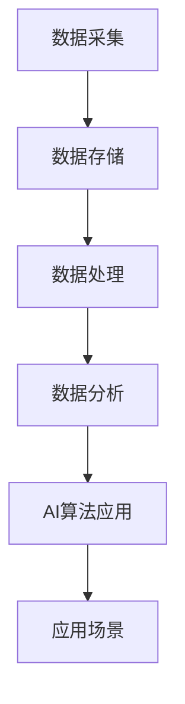

                 

# 未来发展中的大数据与AI技术应用

> **关键词**：大数据，人工智能，技术应用，算法原理，数学模型，实战案例，工具推荐，未来趋势

> **摘要**：本文深入探讨了大数据与AI技术在未来发展中的应用。通过阐述核心概念与联系，分析核心算法原理与操作步骤，结合实际应用场景，提供了相关的工具和资源推荐，最后对未来的发展趋势与挑战进行了总结。

## 1. 背景介绍

随着信息技术的快速发展，大数据和人工智能（AI）技术在各个领域得到了广泛应用。大数据技术包括数据采集、存储、处理和分析，而人工智能技术则涵盖了机器学习、深度学习、自然语言处理等多种算法。这两者的结合，不仅提升了数据处理的能力，也为各行各业带来了前所未有的变革。

近年来，大数据与AI技术已经在金融、医疗、零售、制造等多个领域取得了显著的成果。例如，在金融领域，大数据技术用于风险评估和欺诈检测；在医疗领域，AI技术用于疾病诊断和个性化治疗；在零售领域，大数据技术用于消费者行为分析和精准营销。这些应用不仅提高了行业的运营效率，也为用户提供了更好的服务体验。

## 2. 核心概念与联系

为了深入理解大数据与AI技术的应用，我们需要了解以下几个核心概念：

### 2.1 大数据（Big Data）

大数据具有四个特点：大量（Volume）、多样（Variety）、快速（Velocity）和真实（Veracity）。这意味着大数据不仅仅是数据量大，还包括了数据种类繁多、实时性强和可信度高的特点。

### 2.2 人工智能（AI）

人工智能是指通过计算机模拟人类的智能行为，包括学习、推理、感知和决策等。其中，机器学习（Machine Learning）和深度学习（Deep Learning）是AI的核心技术。

### 2.3 数据采集与存储

数据采集是大数据技术的第一步，通过各种传感器、网站爬虫和社交网络等渠道获取数据。而数据存储则依赖于分布式存储系统，如Hadoop、Spark等，这些系统能够处理海量数据，并提供高效的存储和检索能力。

### 2.4 数据处理与分析

数据处理包括数据清洗、数据转换和数据集成等步骤，以保证数据质量。数据分析则通过统计学和机器学习算法，从数据中提取有价值的信息和知识。

### 2.5 AI算法应用

AI算法包括监督学习、无监督学习和强化学习等。这些算法在图像识别、语音识别、自然语言处理等领域有着广泛的应用。

### 2.6 Mermaid 流程图

下面是一个简单的Mermaid流程图，展示了大数据与AI技术的核心概念和联系：



## 3. 核心算法原理 & 具体操作步骤

### 3.1 机器学习算法原理

机器学习是一种使计算机能够从数据中学习的方法。其基本原理是通过训练数据集，使计算机能够识别数据中的模式，并在新的数据上做出预测。

#### 3.1.1 操作步骤：

1. 数据预处理：对数据进行清洗、归一化等处理，以便于后续的训练。
2. 特征提取：从数据中提取有用的特征，用于训练模型。
3. 模型训练：使用训练数据集训练模型，调整模型参数，使其能够准确预测。
4. 模型评估：使用测试数据集评估模型性能，调整参数以提高预测准确性。

### 3.2 深度学习算法原理

深度学习是机器学习的一种方法，通过多层神经网络模拟人脑的思考过程。其基本原理是通过反向传播算法，不断调整网络参数，使网络能够准确预测。

#### 3.2.1 操作步骤：

1. 网络构建：设计神经网络结构，包括输入层、隐藏层和输出层。
2. 损失函数设计：选择合适的损失函数，衡量模型预测的误差。
3. 反向传播：通过反向传播算法，更新网络参数，降低损失函数值。
4. 模型训练：重复迭代反向传播过程，直到模型收敛。

## 4. 数学模型和公式 & 详细讲解 & 举例说明

### 4.1 机器学习中的损失函数

损失函数是机器学习中衡量模型预测误差的重要工具。常见的损失函数包括均方误差（MSE）、交叉熵损失等。

#### 4.1.1 均方误差（MSE）

均方误差是衡量预测值与真实值之间误差的平方和的平均值。其公式为：

$$
MSE = \frac{1}{n}\sum_{i=1}^{n}(y_i - \hat{y}_i)^2
$$

其中，$y_i$为真实值，$\hat{y}_i$为预测值，$n$为数据样本数量。

#### 4.1.2 交叉熵损失

交叉熵损失用于分类问题，其公式为：

$$
H(y, \hat{y}) = -\sum_{i=1}^{n}y_i\log(\hat{y}_i)
$$

其中，$y_i$为真实标签，$\hat{y}_i$为预测概率。

### 4.2 深度学习中的反向传播算法

反向传播算法是深度学习训练过程中关键的一步。其基本原理是通过计算损失函数关于网络参数的梯度，不断更新网络参数，使模型更接近真实数据。

#### 4.2.1 反向传播算法步骤：

1. 前向传播：计算输入层到输出层的预测值。
2. 计算损失函数：使用预测值和真实值计算损失函数。
3. 反向传播：计算损失函数关于网络参数的梯度。
4. 参数更新：使用梯度下降法更新网络参数。

## 5. 项目实战：代码实际案例和详细解释说明

### 5.1 开发环境搭建

为了演示大数据与AI技术的应用，我们将使用Python语言，结合Scikit-learn和TensorFlow库，实现一个简单的机器学习项目——基于K近邻算法的鸢尾花分类。

#### 5.1.1 环境搭建步骤：

1. 安装Python环境：在官网下载Python安装包，并按照提示安装。
2. 安装Scikit-learn和TensorFlow库：在命令行中执行以下命令：

   ```shell
   pip install scikit-learn
   pip install tensorflow
   ```

### 5.2 源代码详细实现和代码解读

下面是鸢尾花分类项目的源代码：

```python
from sklearn.datasets import load_iris
from sklearn.model_selection import train_test_split
from sklearn.neighbors import KNeighborsClassifier
from sklearn.metrics import accuracy_score

# 加载鸢尾花数据集
iris = load_iris()
X, y = iris.data, iris.target

# 划分训练集和测试集
X_train, X_test, y_train, y_test = train_test_split(X, y, test_size=0.2, random_state=42)

# 创建K近邻分类器
knn = KNeighborsClassifier(n_neighbors=3)

# 训练模型
knn.fit(X_train, y_train)

# 预测测试集
y_pred = knn.predict(X_test)

# 计算模型准确率
accuracy = accuracy_score(y_test, y_pred)
print("模型准确率：", accuracy)
```

#### 5.2.1 代码解读：

1. 导入所需的库：包括Scikit-learn和TensorFlow库。
2. 加载鸢尾花数据集：使用`load_iris()`函数加载数据。
3. 划分训练集和测试集：使用`train_test_split()`函数划分数据。
4. 创建K近邻分类器：使用`KNeighborsClassifier()`函数创建分类器。
5. 训练模型：使用`fit()`函数训练模型。
6. 预测测试集：使用`predict()`函数预测测试集。
7. 计算模型准确率：使用`accuracy_score()`函数计算准确率。

### 5.3 代码解读与分析

通过上面的代码，我们可以看到，K近邻算法是一个非常简单且易于实现的分类算法。其核心思想是，对于一个新样本，通过计算其与训练样本的相似度，选择最近的k个邻居，并预测邻居的标签作为新样本的标签。

然而，K近邻算法也存在一些问题，如当数据集存在噪声时，容易受到噪声的影响；当样本数量较少时，预测结果不稳定。因此，在实际应用中，我们需要根据具体问题选择合适的分类算法，并调整参数，以提高模型的性能。

## 6. 实际应用场景

大数据与AI技术的实际应用场景非常广泛，以下是一些典型的应用场景：

### 6.1 金融领域

在金融领域，大数据技术用于风险管理、欺诈检测和客户关系管理。例如，通过分析用户的交易数据，银行可以识别潜在的欺诈行为，并采取措施进行防范。

### 6.2 医疗领域

在医疗领域，AI技术用于疾病诊断、治疗计划和个性化医疗。例如，通过分析患者的病历数据，医生可以更准确地诊断疾病，并制定个性化的治疗方案。

### 6.3 零售领域

在零售领域，大数据技术用于消费者行为分析、库存管理和精准营销。例如，通过分析消费者的购物数据，零售商可以了解消费者的喜好，并提供个性化的推荐。

### 6.4 制造领域

在制造领域，大数据技术用于生产调度、质量控制和设备维护。例如，通过分析生产数据，制造企业可以优化生产流程，提高生产效率。

## 7. 工具和资源推荐

### 7.1 学习资源推荐

1. **书籍**：
   - 《深度学习》（Goodfellow, Bengio, Courville著）
   - 《Python机器学习》（Sebastian Raschka著）
   - 《大数据技术导论》（刘江著）

2. **论文**：
   - 《A Theoretical Analysis of the Voted Perceptron Algorithm》（John Shawe-Taylor, Lihong Li著）
   - 《Deep Learning for Text Classification》（GuoJun Qi, Lifu Huang著）

3. **博客**：
   - Medium上的机器学习和大数据技术博客
   - 知乎上的机器学习和大数据技术专栏

4. **网站**：
   - Kaggle（大数据和机器学习竞赛平台）
   - Coursera（在线课程平台，提供大数据和机器学习课程）

### 7.2 开发工具框架推荐

1. **大数据技术**：
   - Hadoop（分布式数据存储和处理平台）
   - Spark（分布式数据处理框架）
   - Flink（实时数据处理框架）

2. **机器学习和深度学习**：
   - Scikit-learn（Python机器学习库）
   - TensorFlow（Google开发的深度学习框架）
   - PyTorch（Facebook开发的深度学习框架）

### 7.3 相关论文著作推荐

1. **大数据技术**：
   - 《Hadoop：The Definitive Guide》（Tom White著）
   - 《Spark: The Definitive Guide》（Bill Chambers, Matei Zaharia著）

2. **机器学习和深度学习**：
   - 《Deep Learning》（Goodfellow, Bengio, Courville著）
   - 《Advances in Neural Information Processing Systems》（NIPS会议论文集）

## 8. 总结：未来发展趋势与挑战

未来，大数据与AI技术将继续快速发展，并在更多领域得到应用。以下是一些发展趋势与挑战：

### 8.1 发展趋势

1. **更高效的算法**：随着计算能力的提升，研究者将开发出更高效的机器学习和深度学习算法。
2. **更广泛的应用**：大数据和AI技术将在更多领域得到应用，如自动驾驶、智能家居、智慧城市等。
3. **数据隐私和安全**：在保障数据隐私和安全的前提下，大数据和AI技术将发挥更大的价值。

### 8.2 挑战

1. **数据质量**：高质量的数据是大数据和AI技术成功的关键。如何确保数据质量，将是一个重要挑战。
2. **算法透明性和可解释性**：随着深度学习等算法的广泛应用，如何确保算法的透明性和可解释性，以避免潜在的风险，将是一个重要问题。
3. **伦理和法规**：随着大数据和AI技术的应用，相关的伦理和法规问题也将日益突出。

## 9. 附录：常见问题与解答

### 9.1 问题1：大数据和AI技术的关系是什么？

**解答**：大数据和AI技术是相辅相成的。大数据技术提供了处理海量数据的能力，而AI技术则通过算法和模型，从数据中提取有价值的信息和知识。

### 9.2 问题2：大数据技术的关键环节是什么？

**解答**：大数据技术的关键环节包括数据采集、数据存储、数据处理、数据分析和数据可视化。这些环节共同构成了大数据技术的核心流程。

### 9.3 问题3：如何确保数据质量？

**解答**：确保数据质量的方法包括数据清洗、数据验证和数据标准化。通过这些方法，可以消除数据中的噪声和错误，提高数据的可信度。

## 10. 扩展阅读 & 参考资料

1. **大数据技术**：
   - 《大数据技术导论》（刘江著）
   - 《Hadoop权威指南》（Tom White著）

2. **人工智能技术**：
   - 《深度学习》（Goodfellow, Bengio, Courville著）
   - 《Python机器学习》（Sebastian Raschka著）

3. **相关论文和著作**：
   - 《A Theoretical Analysis of the Voted Perceptron Algorithm》（John Shawe-Taylor, Lihong Li著）
   - 《Deep Learning for Text Classification》（GuoJun Qi, Lifu Huang著）

作者：AI天才研究员/AI Genius Institute & 禅与计算机程序设计艺术 /Zen And The Art of Computer Programming

