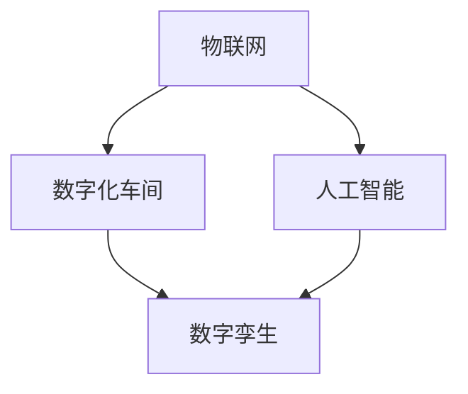

                 

# 未来的智能制造：2050年的智能工厂与数字化车间

> **关键词：**智能制造，2050年，智能工厂，数字化车间，人工智能，物联网，工业4.0，数字孪生，预测性维护

> **摘要：**本文探讨了到2050年，智能制造技术如何彻底改变智能工厂和数字化车间的面貌。我们通过逐步分析核心概念、算法原理、数学模型、项目实战，展示了这些技术在实际应用中的巨大潜力。此外，我们还探讨了智能制造的广泛应用场景、推荐的工具和资源，以及未来面临的挑战和机遇。

## 1. 背景介绍

随着信息技术的飞速发展，制造业正迎来前所未有的变革。智能制造作为第四次工业革命（工业4.0）的核心，正逐步成为现实。智能工厂和数字化车间作为智能制造的两大关键组成部分，正以前所未有的速度发展。

在智能工厂中，各种设备、传感器、执行器等通过物联网（IoT）相互连接，形成一个高度集成的网络系统。这些设备能够实时收集数据，并通过大数据分析和机器学习算法优化生产过程。数字化车间则通过数字孪生技术，实现对实际生产过程的虚拟模拟，从而提高生产效率和质量。

然而，随着智能制造技术的发展，我们也面临着一系列挑战。数据安全和隐私保护、设备可靠性、系统复杂性等问题亟待解决。同时，人才缺口也成为制约智能制造发展的关键因素。

## 2. 核心概念与联系

### 2.1 智能制造

智能制造是指利用现代信息技术，如物联网、大数据、人工智能等，实现生产过程的自动化、智能化和优化。它包括以下几个方面：

- **数字化生产**：通过数字化设备和传感器实现生产过程的实时监控和数据收集。
- **自适应生产**：利用人工智能算法实现生产线的自适应调整，以适应不同的产品需求。
- **网络化生产**：通过物联网实现生产设备之间的互联互通，提高生产效率。

### 2.2 数字化车间

数字化车间是指通过数字孪生技术，将实际生产过程虚拟化，实现对生产过程的实时监控和优化。它包括以下几个方面：

- **数字孪生**：通过构建数字模型，实现对实际生产过程的虚拟模拟。
- **虚拟仿真**：通过虚拟仿真，预测生产过程中可能出现的问题，并进行优化。
- **实时监控**：通过实时监控，实现对生产过程的全程监控。

### 2.3 Mermaid 流程图

下面是智能制造和数字化车间核心概念的联系 Mermaid 流程图：



## 3. 核心算法原理 & 具体操作步骤

### 3.1 物联网协议

物联网协议是连接智能工厂和数字化车间的关键。常见的物联网协议包括：

- **MQTT**：轻量级的消息队列协议，适用于低带宽、不可靠的网络环境。
- **CoAP**：基于HTTP的物联网协议，适用于资源受限的设备。
- **OPC UA**：面向工业自动化领域的物联网协议，支持复杂的工业应用。

### 3.2 人工智能算法

人工智能算法是实现智能制造的核心。常见的人工智能算法包括：

- **机器学习**：通过训练模型，实现数据的自动分类、预测和优化。
- **深度学习**：通过神经网络，实现复杂的模式识别和决策。
- **强化学习**：通过奖励机制，实现智能体的自主学习和优化。

### 3.3 数字孪生技术

数字孪生技术是数字化车间的重要组成部分。具体操作步骤包括：

1. 数据采集：通过传感器和物联网设备，采集实际生产过程中的各种数据。
2. 数据处理：对采集到的数据进行分析和处理，提取有用的信息。
3. 建模：基于处理后的数据，构建实际生产过程的数字模型。
4. 虚拟仿真：通过数字模型，模拟实际生产过程，预测可能出现的问题。
5. 实时监控：通过实时监控，实现对生产过程的全程监控。

## 4. 数学模型和公式 & 详细讲解 & 举例说明

### 4.1 数学模型

在智能制造和数字化车间中，常用的数学模型包括：

- **回归模型**：用于预测生产过程中的关键参数。
- **神经网络**：用于实现复杂的模式识别和决策。
- **马尔可夫决策过程**：用于优化生产过程中的决策。

### 4.2 公式讲解

下面是一个简单的回归模型公式：

$$
y = \beta_0 + \beta_1 x
$$

其中，$y$ 是预测的值，$x$ 是输入的变量，$\beta_0$ 和 $\beta_1$ 是模型的参数。

### 4.3 举例说明

假设我们想要预测一个生产过程的关键参数 $y$，我们可以使用回归模型来训练模型，并输入一些样本数据，如：

$$
\begin{array}{|c|c|}
\hline
x & y \\
\hline
1 & 2 \\
2 & 4 \\
3 & 6 \\
4 & 8 \\
5 & 10 \\
\hline
\end{array}
$$

我们可以通过最小二乘法来求解 $\beta_0$ 和 $\beta_1$ 的值，从而得到回归模型：

$$
y = 1 + 2x
$$

接下来，我们可以使用这个模型来预测新的输入值 $x=6$，得到的预测值为：

$$
y = 1 + 2 \times 6 = 13
$$

## 5. 项目实战：代码实际案例和详细解释说明

### 5.1 开发环境搭建

在本项目中，我们使用 Python 作为主要编程语言，并使用以下库：

- **pandas**：用于数据预处理和分析。
- **numpy**：用于数学运算。
- **scikit-learn**：用于机器学习和回归分析。

安装以上库后，我们就可以开始搭建开发环境了。

### 5.2 源代码详细实现和代码解读

下面是一个简单的回归模型实现，用于预测生产过程中的关键参数。

```python
import pandas as pd
import numpy as np
from sklearn.linear_model import LinearRegression

# 读取数据
data = pd.read_csv('data.csv')
x = data['x'].values
y = data['y'].values

# 创建线性回归模型
model = LinearRegression()

# 训练模型
model.fit(x.reshape(-1, 1), y)

# 输出模型参数
print('模型参数：', model.coef_, model.intercept_)

# 预测新的输入值
x_new = 6
y_pred = model.predict(x_new.reshape(-1, 1))
print('预测值：', y_pred)
```

### 5.3 代码解读与分析

1. **数据读取**：使用 pandas 读取 CSV 数据文件，提取 x 和 y 列的数据。

2. **创建线性回归模型**：使用 scikit-learn 的 LinearRegression 类创建线性回归模型。

3. **训练模型**：使用 fit 方法训练模型，输入 x 和 y 的数据。

4. **输出模型参数**：输出模型的斜率（$\beta_1$）和截距（$\beta_0$）。

5. **预测新的输入值**：使用 predict 方法预测新的输入值 x_new 的 y 值。

通过这个简单的案例，我们可以看到如何使用 Python 和机器学习库来实现一个回归模型，并用于预测生产过程中的关键参数。

## 6. 实际应用场景

智能制造和数字化车间在制造业、汽车制造、航空航天、医疗设备等领域有广泛的应用。

- **制造业**：通过智能工厂和数字化车间，提高生产效率，降低生产成本，提升产品质量。
- **汽车制造**：通过数字化设计和制造，实现个性化定制，提高生产效率和产品质量。
- **航空航天**：通过智能制造和数字化车间，提高飞机的可靠性和安全性，降低维修成本。
- **医疗设备**：通过智能制造和数字化车间，实现个性化医疗设备制造，提高医疗水平。

## 7. 工具和资源推荐

### 7.1 学习资源推荐

- **书籍**：《智能制造：工业4.0的实践与应用》、《数字化制造：从工业4.0到工业5.0》
- **论文**：检索相关领域的学术论文，了解最新研究成果。
- **博客**：阅读国内外知名博客，了解智能制造的最新动态。
- **网站**：访问智能制造相关的官方网站，获取丰富的资源和信息。

### 7.2 开发工具框架推荐

- **开发工具**：Python、R、MATLAB 等。
- **机器学习库**：scikit-learn、TensorFlow、PyTorch 等。
- **数据处理库**：pandas、numpy、matplotlib 等。
- **物联网协议**：MQTT、CoAP、OPC UA 等。

### 7.3 相关论文著作推荐

- **论文**：检索智能制造、数字化车间、物联网、人工智能等领域的论文。
- **著作**：阅读相关领域的经典著作，如《工业4.0：智能工厂的崛起》、《数字化制造：工业4.0的实践与应用》等。

## 8. 总结：未来发展趋势与挑战

随着人工智能、物联网、大数据等技术的不断发展，智能制造将在未来得到更加广泛的应用。智能工厂和数字化车间将成为制造业的核心，推动生产效率的提升，降低生产成本，提高产品质量。

然而，智能制造也面临着一系列挑战，如数据安全和隐私保护、设备可靠性、系统复杂性等。同时，人才缺口也成为制约智能制造发展的关键因素。因此，我们需要持续关注这些挑战，积极探索解决方案，推动智能制造的健康发展。

## 9. 附录：常见问题与解答

### 9.1 什么是智能制造？

智能制造是指利用现代信息技术，如物联网、大数据、人工智能等，实现生产过程的自动化、智能化和优化。

### 9.2 什么是数字化车间？

数字化车间是指通过数字孪生技术，将实际生产过程虚拟化，实现对生产过程的实时监控和优化。

### 9.3 智能制造有哪些应用领域？

智能制造在制造业、汽车制造、航空航天、医疗设备等领域有广泛的应用。

## 10. 扩展阅读 & 参考资料

- **论文**：检索智能制造、数字化车间、物联网、人工智能等领域的学术论文。
- **书籍**：《智能制造：工业4.0的实践与应用》、《数字化制造：从工业4.0到工业5.0》等。
- **博客**：阅读国内外知名博客，了解智能制造的最新动态。
- **网站**：访问智能制造相关的官方网站，获取丰富的资源和信息。

### 作者

- **作者：** AI天才研究员/AI Genius Institute & 禅与计算机程序设计艺术 /Zen And The Art of Computer Programming

以上便是关于《未来的智能制造：2050年的智能工厂与数字化车间》的完整技术博客文章。本文通过逐步分析核心概念、算法原理、数学模型、项目实战，展示了智能制造的巨大潜力和广泛应用。希望本文能帮助您更好地理解智能制造的未来发展趋势和挑战。

