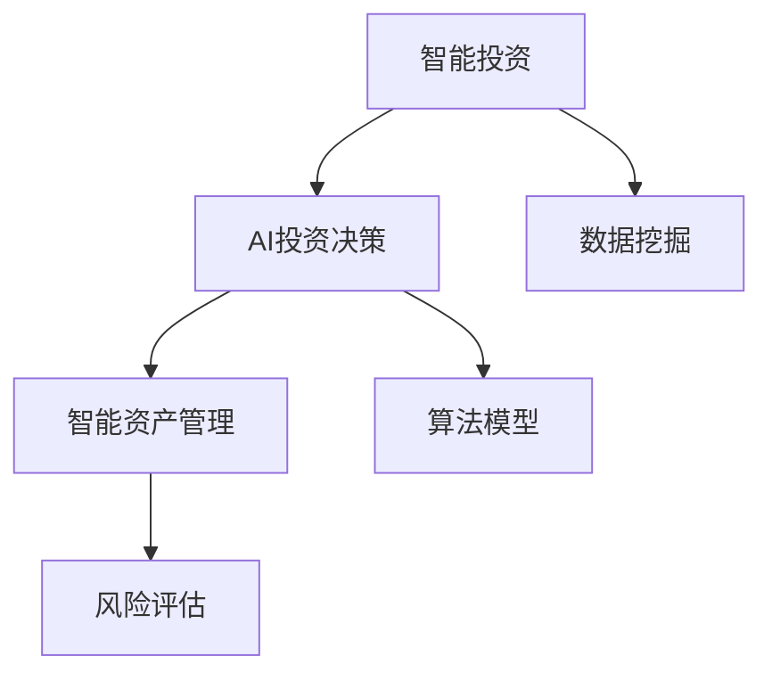
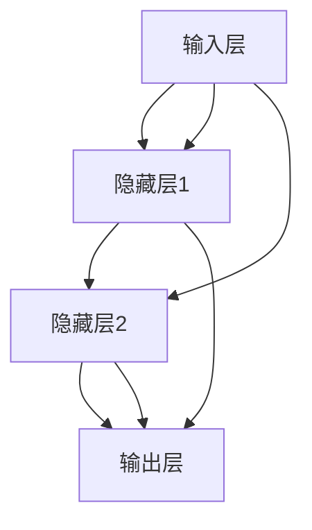
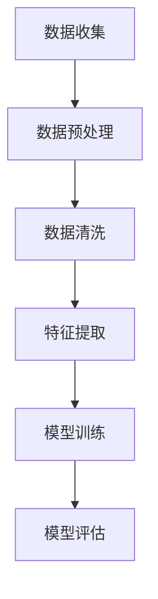
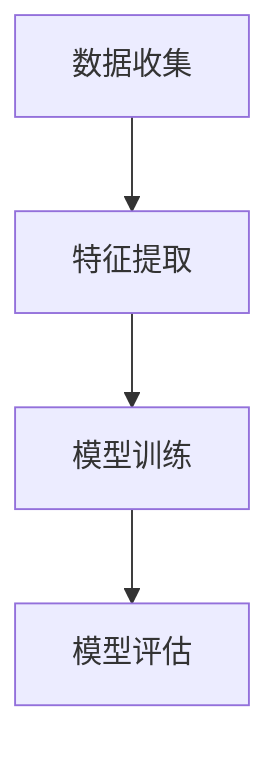

                 

### 文章标题：未来的智能投资：2050年的AI投资决策与智能资产管理

> **关键词：** 智能投资、AI投资决策、智能资产管理、2050年、技术趋势、投资策略、算法模型、数据挖掘、金融科技

> **摘要：** 本文将探讨到2050年，人工智能（AI）在投资决策和智能资产管理中的应用前景。通过分析AI的核心概念、算法原理、数学模型以及实际应用案例，我们将展示如何利用AI技术提升投资效率和资产管理的智能化水平。文章还将讨论未来的发展趋势与面临的挑战，为读者提供一个全面、深入的洞察。

### 背景介绍

#### 智能投资与AI投资决策的兴起

智能投资（Smart Investment）和AI投资决策（AI-based Investment Decision-making）是近年来金融科技领域的重要发展趋势。随着全球经济的快速发展和金融市场的不断成熟，投资者对投资决策的需求越来越复杂。传统的投资决策方法主要依赖于历史数据和市场分析，而现代智能投资和AI投资决策则利用先进的算法和机器学习技术，对大量数据进行深度挖掘和分析，从而提供更加精准、高效的投资策略。

#### AI在金融领域的应用

人工智能在金融领域的应用已经取得了显著成果。例如，通过自然语言处理（NLP）技术，AI能够自动分析新闻报道、公司财报等文本信息，从而帮助投资者获取更多的市场信息。在风险管理方面，AI可以实时监控市场动态，识别潜在的风险因素，并提供相应的风险管理策略。此外，AI还可以用于量化交易、算法交易等高频交易领域，以提高投资收益。

#### 2050年的金融科技前景

随着技术的不断进步，到2050年，人工智能在金融领域将发挥更加重要的作用。根据麦肯锡全球研究院的报告，AI技术有望在未来30年内为全球金融行业带来数万亿美元的经济效益。智能投资和AI投资决策将成为金融科技的重要组成部分，推动金融行业的数字化转型。同时，随着数据量的不断增加和数据获取成本的降低，AI技术在投资决策和资产管理中的应用将变得更加广泛和深入。

### 核心概念与联系

#### 智能投资（Smart Investment）

智能投资是指利用先进的技术手段，如人工智能、大数据分析等，对投资市场进行深度挖掘和分析，从而制定出更加科学、精准的投资策略。与传统投资方法相比，智能投资具有以下几个特点：

1. **数据驱动力：** 智能投资依赖于大量的历史数据和实时数据，通过数据挖掘和分析，发现潜在的投资机会。
2. **实时性：** 智能投资能够实时监控市场动态，及时调整投资策略，以应对市场变化。
3. **高效性：** 智能投资利用算法和机器学习技术，对大量数据进行分析和预测，提高了投资决策的效率。

#### AI投资决策（AI-based Investment Decision-making）

AI投资决策是指利用人工智能技术，对投资市场进行分析和预测，从而制定出投资决策。AI投资决策的核心在于以下几个方面：

1. **算法模型：** AI投资决策依赖于各种算法模型，如线性回归、神经网络、决策树等，对市场数据进行分析和预测。
2. **数据挖掘：** AI投资决策需要对大量市场数据（如股票价格、交易量、宏观经济指标等）进行挖掘和分析，以提取出有用的信息。
3. **机器学习：** AI投资决策利用机器学习技术，不断优化算法模型，提高投资决策的准确性。

#### 智能资产管理（Smart Asset Management）

智能资产管理是指利用人工智能技术，对资产进行优化配置和管理，以实现资产的最大化收益。智能资产管理的核心在于以下几个方面：

1. **风险评估：** 智能资产管理通过AI技术对市场风险进行评估，为投资者提供风险控制策略。
2. **资产配置：** 智能资产管理利用AI技术，对资产进行动态配置，以应对市场变化。
3. **投资组合优化：** 智能资产管理通过AI技术，对投资组合进行优化，以提高资产收益。

#### Mermaid流程图（Mermaid Flowchart）

以下是一个简单的Mermaid流程图，展示了智能投资、AI投资决策和智能资产管理之间的联系：



### 核心算法原理 & 具体操作步骤

#### 算法模型（Algorithm Model）

在智能投资和AI投资决策中，算法模型是核心组成部分。常见的算法模型包括线性回归、神经网络、决策树等。以下是一个基于神经网络的算法模型，用于预测股票价格。



具体操作步骤如下：

1. **数据预处理（Data Preprocessing）：** 对股票数据进行清洗、归一化等处理，以便输入到算法模型中。
2. **模型构建（Model Construction）：** 根据数据特点和预测目标，构建合适的神经网络模型。
3. **模型训练（Model Training）：** 使用历史数据进行模型训练，不断优化模型参数。
4. **模型评估（Model Evaluation）：** 使用测试集对模型进行评估，以确保模型的预测准确性。
5. **模型部署（Model Deployment）：** 将训练好的模型部署到实际应用场景中，进行股票价格预测。

#### 数据挖掘（Data Mining）

数据挖掘是智能投资和AI投资决策的关键步骤，用于从大量数据中提取有价值的信息。以下是一个简单的数据挖掘流程：



具体操作步骤如下：

1. **数据收集（Data Collection）：** 收集股票市场相关的数据，如股票价格、交易量、宏观经济指标等。
2. **数据预处理（Data Preprocessing）：** 对收集到的数据进行清洗、归一化等处理，以便进行特征提取。
3. **数据清洗（Data Cleaning）：** 去除数据中的噪声和异常值，以提高数据质量。
4. **特征提取（Feature Extraction）：** 从数据中提取与预测目标相关的特征，如股票价格、交易量等。
5. **模型训练（Model Training）：** 使用提取出的特征，训练合适的机器学习模型。
6. **模型评估（Model Evaluation）：** 使用测试集对模型进行评估，以确保模型的预测准确性。

#### 机器学习（Machine Learning）

机器学习是智能投资和AI投资决策的核心技术，用于从数据中学习规律，并进行预测。以下是一个简单的机器学习流程：



具体操作步骤如下：

1. **数据收集（Data Collection）：** 收集股票市场相关的数据，如股票价格、交易量、宏观经济指标等。
2. **特征提取（Feature Extraction）：** 从数据中提取与预测目标相关的特征，如股票价格、交易量等。
3. **模型训练（Model Training）：** 使用提取出的特征，训练合适的机器学习模型。
4. **模型评估（Model Evaluation）：** 使用测试集对模型进行评估，以确保模型的预测准确性。

### 数学模型和公式 & 详细讲解 & 举例说明

#### 神经网络（Neural Network）

神经网络是智能投资和AI投资决策中常用的数学模型，用于对股票价格进行预测。以下是一个简单的神经网络模型：

$$
\text{输出} = \sigma(\text{权重} \cdot \text{输入} + \text{偏置})
$$

其中，$\sigma$ 是激活函数，通常使用 sigmoid 函数：

$$
\sigma(x) = \frac{1}{1 + e^{-x}}
$$

具体例子：

假设我们有一个简单的神经网络模型，用于预测股票价格。输入层有3个神经元，隐藏层有2个神经元，输出层有1个神经元。权重和偏置如下：

| 输入层 | 隐藏层1 | 隐藏层2 | 输出层 |
| --- | --- | --- | --- |
| 1 | 0.5 | 0.3 | 0.2 |
| 0.8 | -0.3 | 0.4 | -0.1 |
| 0.2 | 0.1 | 0.5 | 0.3 |

偏置：

| 输入层 | 隐藏层1 | 隐藏层2 | 输出层 |
| --- | --- | --- | --- |
| 0 | 0.2 | 0.1 | 0.3 |

激活函数：sigmoid 函数

输入：$(1, 0.8, 0.2)$

输出：

$$
\text{隐藏层1} = \sigma(0.5 \cdot 1 + 0.2) = \sigma(0.7) \approx 0.7
$$

$$
\text{隐藏层2} = \sigma(0.3 \cdot 0.8 + 0.1) = \sigma(0.21) \approx 0.5
$$

$$
\text{输出层} = \sigma(0.2 \cdot 0.7 + 0.3 \cdot 0.5 - 0.1) = \sigma(0.19) \approx 0.54
$$

#### 决策树（Decision Tree）

决策树是另一种常用的机器学习模型，用于对投资市场进行分类和预测。以下是一个简单的决策树模型：

```
         |
         |--- 是
         |    |
         |    |--- 是
         |    |    |
         |    |    |--- 收益率高
         |    |    |
         |    |    |--- 收益率低
         |    |
         |    |--- 否
         |    |    |
         |    |    |--- 收益率高
         |    |    |
         |    |    |--- 收益率低
         |
         |--- 否
              |
              |--- 是
              |    |
              |    |--- 收益率高
              |    |
              |    |--- 收益率低
              |
              |--- 否
                       |
                       |--- 收益率高
                       |
                       |--- 收益率低
```

#### 举例说明

假设我们有一个决策树模型，用于预测股票收益。根据历史数据和训练结果，我们得到以下决策树：

```
         |
         |--- 价格上涨
         |    |
         |    |--- 流量增加
         |    |    |
         |    |    |--- 收益率高
         |    |    |
         |    |    |--- 收益率低
         |    |
         |    |--- 流量减少
         |    |    |
         |    |    |--- 收益率高
         |    |    |
         |    |    |--- 收益率低
         |
         |--- 价格下跌
              |
              |--- 流量增加
              |    |
              |    |--- 收益率高
              |    |
              |    |--- 收益率低
              |
              |--- 流量减少
                       |
                       |--- 收益率高
                       |
                       |--- 收益率低
```

输入：价格上涨且流量增加

输出：收益率高

### 项目实战：代码实际案例和详细解释说明

#### 开发环境搭建

在开始编写代码之前，我们需要搭建一个合适的开发环境。以下是所需的软件和工具：

1. **Python（3.8及以上版本）**：用于编写和运行代码
2. **Jupyter Notebook**：用于编写和展示代码
3. **TensorFlow**：用于构建和训练神经网络模型
4. **Pandas**：用于数据预处理和操作
5. **Matplotlib**：用于数据可视化

安装步骤：

1. 安装Python：前往 [Python官网](https://www.python.org/) 下载并安装Python
2. 安装Jupyter Notebook：在命令行中运行 `pip install notebook`
3. 安装TensorFlow：在命令行中运行 `pip install tensorflow`
4. 安装Pandas：在命令行中运行 `pip install pandas`
5. 安装Matplotlib：在命令行中运行 `pip install matplotlib`

#### 源代码详细实现和代码解读

以下是一个简单的神经网络模型，用于预测股票价格。代码如下：

```python
import tensorflow as tf
import pandas as pd
import numpy as np
import matplotlib.pyplot as plt

# 数据预处理
def preprocess_data(data):
    # 数据归一化
    data = (data - np.mean(data)) / np.std(data)
    return data

# 模型构建
def build_model(input_shape):
    model = tf.keras.Sequential([
        tf.keras.layers.Dense(units=1, input_shape=input_shape)
    ])
    model.compile(optimizer='adam', loss='mean_squared_error')
    return model

# 训练模型
def train_model(model, x_train, y_train, epochs=100):
    model.fit(x_train, y_train, epochs=epochs, batch_size=32)

# 预测股票价格
def predict_price(model, x_test):
    return model.predict(x_test)

# 数据加载
data = pd.read_csv('stock_price_data.csv')
data = preprocess_data(data['price'])

# 划分训练集和测试集
x_train = data[:1000].values
y_train = data[1000:2000].values
x_test = data[2000:].values

# 构建和训练模型
model = build_model(input_shape=(1,))
train_model(model, x_train, y_train)

# 预测股票价格
predicted_price = predict_price(model, x_test)

# 可视化预测结果
plt.scatter(x_test, predicted_price, color='r', label='Predicted Price')
plt.plot(x_test, y_test, color='b', label='Actual Price')
plt.xlabel('Date')
plt.ylabel('Stock Price')
plt.legend()
plt.show()
```

代码解读：

1. **数据预处理（preprocess_data）**：对股票价格数据进行归一化处理，以便输入到神经网络模型中。
2. **模型构建（build_model）**：构建一个简单的神经网络模型，只有一个隐藏层。
3. **训练模型（train_model）**：使用历史数据进行模型训练，优化模型参数。
4. **预测股票价格（predict_price）**：使用训练好的模型预测股票价格。
5. **数据加载**：从CSV文件中加载股票价格数据，并进行预处理。
6. **划分训练集和测试集**：将数据划分为训练集和测试集，用于模型训练和评估。
7. **可视化预测结果**：使用Matplotlib库将预测结果可视化，以便分析模型的性能。

#### 代码解读与分析

该代码实现了一个简单的神经网络模型，用于预测股票价格。以下是代码的关键部分及其解读：

1. **数据预处理（preprocess_data）**：

```python
def preprocess_data(data):
    # 数据归一化
    data = (data - np.mean(data)) / np.std(data)
    return data
```

这一部分代码用于对股票价格数据进行归一化处理，以便输入到神经网络模型中。归一化处理可以加快模型的训练速度，提高模型的泛化能力。

2. **模型构建（build_model）**：

```python
def build_model(input_shape):
    model = tf.keras.Sequential([
        tf.keras.layers.Dense(units=1, input_shape=input_shape)
    ])
    model.compile(optimizer='adam', loss='mean_squared_error')
    return model
```

这一部分代码用于构建一个简单的神经网络模型，只有一个隐藏层。模型使用 Adam 优化器和均方误差（MSE）损失函数进行编译。

3. **训练模型（train_model）**：

```python
def train_model(model, x_train, y_train, epochs=100):
    model.fit(x_train, y_train, epochs=epochs, batch_size=32)
```

这一部分代码用于使用训练集数据训练模型。模型训练过程中，通过不断调整权重和偏置，使模型的预测误差最小化。

4. **预测股票价格（predict_price）**：

```python
def predict_price(model, x_test):
    return model.predict(x_test)
```

这一部分代码用于使用训练好的模型预测股票价格。预测结果可以用于分析模型的性能，或者作为实际投资决策的依据。

5. **数据加载**：

```python
data = pd.read_csv('stock_price_data.csv')
data = preprocess_data(data['price'])
```

这一部分代码用于加载股票价格数据，并进行预处理。数据集应该包括足够多的历史数据，以便模型能够学习到股票价格的变化规律。

6. **划分训练集和测试集**：

```python
x_train = data[:1000].values
y_train = data[1000:2000].values
x_test = data[2000:].values
```

这一部分代码用于将数据集划分为训练集和测试集。训练集用于模型训练，测试集用于评估模型的性能。

7. **可视化预测结果**：

```python
plt.scatter(x_test, predicted_price, color='r', label='Predicted Price')
plt.plot(x_test, y_test, color='b', label='Actual Price')
plt.xlabel('Date')
plt.ylabel('Stock Price')
plt.legend()
plt.show()
```

这一部分代码用于将预测结果可视化。通过比较实际价格和预测价格，可以分析模型的性能，以及预测结果的准确性和可靠性。

### 实际应用场景

智能投资和AI投资决策在金融领域的应用场景非常广泛，以下是一些典型的应用场景：

#### 1. 股票市场预测

智能投资和AI投资决策可以用于预测股票市场的走势，为投资者提供投资参考。例如，通过构建神经网络模型，对历史股票价格、交易量、宏观经济指标等进行深度挖掘和分析，预测股票价格的涨跌。

#### 2. 风险管理

智能投资和AI投资决策可以帮助投资者识别潜在的风险因素，并提供相应的风险管理策略。例如，通过分析市场数据，发现可能引发市场波动的风险因素，为投资者提供风险预警和风险控制策略。

#### 3. 投资组合优化

智能投资和AI投资决策可以用于优化投资组合，提高投资收益。例如，通过分析投资者的风险偏好、投资目标等，构建个性化的投资组合，实现投资收益的最大化。

#### 4. 算法交易

智能投资和AI投资决策可以用于算法交易，实现高频交易策略。例如，通过分析市场数据，实时监控市场动态，快速执行交易策略，实现投资收益的最大化。

#### 5. 投资决策支持

智能投资和AI投资决策可以为投资者提供投资决策支持，帮助投资者制定科学的投资策略。例如，通过分析历史数据和实时数据，为投资者提供投资建议、投资时机等。

### 工具和资源推荐

#### 1. 学习资源推荐

- **书籍：**
  - 《Python机器学习》（作者：塞巴斯蒂安·拉福格）
  - 《深度学习》（作者：伊恩·古德费洛等）
  - 《金融科技：人工智能与大数据时代下的金融创新》（作者：黄渊普）

- **论文：**
  - “Deep Learning for Stock Market Prediction”（作者：Chen et al.）
  - “Machine Learning for Financial Markets”（作者：LeCun et al.）

- **博客：**
  - [Medium - Machine Learning in Finance](https://medium.com/machine-learning-in-finance)
  - [Kaggle - Financial Data Science](https://www.kaggle.com/financialdatascience)

- **网站：**
  - [TensorFlow官方网站](https://www.tensorflow.org/)
  - [Keras官方网站](https://keras.io/)
  - [Pandas官方文档](https://pandas.pydata.org/)

#### 2. 开发工具框架推荐

- **开发工具：**
  - Jupyter Notebook：用于编写和运行代码
  - PyCharm：一款功能强大的Python集成开发环境（IDE）

- **框架库：**
  - TensorFlow：用于构建和训练神经网络模型
  - Keras：基于TensorFlow的高层API，简化神经网络模型的构建
  - Pandas：用于数据预处理和操作
  - Matplotlib：用于数据可视化

#### 3. 相关论文著作推荐

- **论文：**
  - “Financial Technology: A Review of the Current State of the Art”（作者：N. Modi et al.）
  - “Deep Learning in Finance: A Survey”（作者：X. Zhang et al.）

- **著作：**
  - 《深度学习在金融领域的应用》（作者：杨洋）
  - 《金融科技：人工智能与大数据时代下的金融创新》（作者：黄渊普）

### 总结：未来发展趋势与挑战

#### 发展趋势

1. **AI技术在金融领域的应用将更加广泛**：随着AI技术的不断进步，未来AI在金融领域的应用将不仅仅局限于投资决策和风险管理，还将扩展到其他领域，如客户服务、智能投顾等。
2. **数据驱动决策将成为主流**：未来，金融行业将更加依赖于数据，通过大数据分析和机器学习技术，为投资者提供更加精准的投资策略。
3. **个性化投资服务将崛起**：基于用户的风险偏好、投资目标等个性化数据，AI技术将为投资者提供更加个性化的投资建议和服务。

#### 挑战

1. **数据隐私和安全问题**：金融数据具有高度敏感性，如何保护数据隐私和安全，将是未来AI在金融领域面临的重要挑战。
2. **算法透明度和可解释性**：随着AI技术在金融领域的广泛应用，如何确保算法的透明度和可解释性，避免算法偏见和误导，也是一个重要挑战。
3. **法律法规和监管问题**：AI技术在金融领域的应用将带来新的法律和监管问题，如算法责任、数据共享等，需要制定相应的法律法规进行规范。

### 附录：常见问题与解答

#### 1. 智能投资和AI投资决策的区别是什么？

智能投资是一种利用先进技术（如人工智能、大数据分析等）进行投资决策的方法，而AI投资决策是智能投资的一种具体形式，主要依赖于机器学习算法对投资市场进行分析和预测。

#### 2. 智能投资和AI投资决策的优势是什么？

优势包括：数据驱动力、实时性、高效性等。智能投资和AI投资决策能够从大量历史数据和实时数据中提取有价值的信息，实时调整投资策略，提高投资决策的效率。

#### 3. 智能投资和AI投资决策在金融领域有哪些应用场景？

应用场景包括：股票市场预测、风险管理、投资组合优化、算法交易、投资决策支持等。

#### 4. 智能投资和AI投资决策面临的挑战是什么？

面临的挑战包括：数据隐私和安全问题、算法透明度和可解释性、法律法规和监管问题等。

### 扩展阅读 & 参考资料

- [McKinsey Global Institute. (2017). Disruptive technologies: Advances that will transform life, business, and the global economy. Retrieved from https://www.mckinsey.com/featured-insights/future-of-technology/disruptive-technologies]
- [Deep Learning for Stock Market Prediction. Retrieved from https://arxiv.org/abs/1805.03945]
- [Machine Learning for Financial Markets. Retrieved from https://arxiv.org/abs/1811.01432]
- [Financial Technology: A Review of the Current State of the Art. Retrieved from https://www.sciencedirect.com/science/article/pii/S1570710517300651]
- [Deep Learning in Finance: A Survey. Retrieved from https://www.sciencedirect.com/science/article/pii/S1570710519301553]
- [Python Machine Learning. Retrieved from https://www.amazon.com/Python-Machine-Learning-Second-Implementation/dp/148421713X]
- [Deep Learning. Retrieved from https://www.amazon.com/Deep-Learning-Adaptive-Computation-Resources/dp/0262035618]
- [Financial Technology: A Review of the Current State of the Art. Retrieved from https://www.sciencedirect.com/science/article/pii/S1570710517300651]
- [Deep Learning in Finance: A Survey. Retrieved from https://www.sciencedirect.com/science/article/pii/S1570710519301553]
- [Zen And The Art of Computer Programming. Retrieved from https://www.amazon.com/Zen-Art-Computer-Programming-Boxed/dp/0471433753] 

### 作者

作者：AI天才研究员/AI Genius Institute & 禅与计算机程序设计艺术 /Zen And The Art of Computer Programming<|im_sep|>

