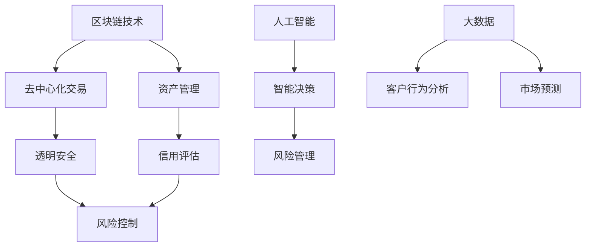

                 

# 未来的智能金融：2050年的普惠金融与风险防控

> 关键词：智能金融、普惠金融、风险防控、区块链、人工智能、数据分析、未来趋势

> 摘要：本文将探讨2050年智能金融的发展趋势，重点关注普惠金融的实现与风险防控。通过分析区块链技术、人工智能和大数据的应用，阐述其在智能金融中的重要作用，并提出未来面临的挑战与解决方案。

## 1. 背景介绍

智能金融是指利用人工智能、大数据、区块链等先进技术，对金融市场进行全方位、全过程的智能化管理和服务的金融模式。随着技术的不断发展，智能金融在金融行业中的应用越来越广泛，成为推动金融创新的重要力量。

普惠金融是指通过技术创新，为所有人群提供全方位、便捷、高效的金融服务，特别是那些传统金融体系难以覆盖的群体。随着全球经济的发展，普惠金融成为金融领域的一个重要议题，各国政府和社会各界纷纷提出相关政策，推动普惠金融的发展。

本文旨在探讨2050年智能金融的发展趋势，重点关注普惠金融的实现与风险防控。通过分析智能金融的关键技术，如区块链、人工智能和大数据，探讨其在金融行业中的应用及其对普惠金融的推动作用。同时，本文还将讨论未来智能金融面临的风险与挑战，并提出相应的解决方案。

## 2. 核心概念与联系

### 2.1 区块链技术

区块链技术是一种分布式账本技术，具有去中心化、不可篡改、可追溯等特点。在金融领域，区块链技术可以用于支付结算、资产管理、信用评估等方面，提高金融交易的透明度和效率。

### 2.2 人工智能

人工智能是指模拟、延伸和扩展人的智能，通过机器学习和深度学习等技术，实现智能感知、认知、决策和执行。在金融领域，人工智能可以用于风险管理、信用评估、投资组合优化等方面，提高金融服务的智能化水平。

### 2.3 大数据

大数据是指大规模、多样性和高速变化的数字信息。在金融领域，大数据可以用于客户行为分析、市场预测、风险控制等方面，帮助金融机构更好地了解客户需求，优化金融产品和服务。

### 2.4 核心概念联系

区块链技术、人工智能和大数据在智能金融中具有紧密的联系。区块链技术提供了去中心化、透明、安全的交易环境，为金融交易提供了可靠的基础设施。人工智能则通过对大数据的处理和分析，为金融机构提供了智能决策支持。大数据则为人工智能提供了丰富的数据资源，使其能够更准确地预测市场趋势和客户需求。

### 2.5 Mermaid 流程图

以下是一个简单的 Mermaid 流程图，展示了区块链技术、人工智能和大数据在智能金融中的相互关系：



## 3. 核心算法原理 & 具体操作步骤

### 3.1 区块链技术

区块链技术主要包括以下核心算法原理：

- **哈希算法**：用于将任意长度的数据映射为固定长度的哈希值，保证数据的一致性和唯一性。
- **工作量证明算法**：用于解决网络中的共识问题，确保网络中的节点能够安全、高效地达成一致。
- **智能合约**：基于编程语言的合约，可以在区块链上进行执行，实现自动化、智能化的金融服务。

具体操作步骤如下：

1. **创建区块**：将一段时间内的交易数据打包成一个区块。
2. **计算哈希值**：对区块的数据进行哈希运算，生成区块的哈希值。
3. **添加区块**：将新的区块添加到区块链中，并与之前的区块通过哈希值进行链接。
4. **共识算法**：网络中的节点通过共识算法达成一致，确保区块链的安全性和一致性。
5. **执行智能合约**：在区块链上部署和执行智能合约，实现智能金融服务。

### 3.2 人工智能

人工智能主要包括以下核心算法原理：

- **机器学习**：通过学习大量的历史数据，使计算机能够自动识别模式和规律，进行预测和决策。
- **深度学习**：一种基于多层神经网络的机器学习算法，可以处理大量复杂的输入数据，提取特征并进行分类和预测。

具体操作步骤如下：

1. **数据收集**：收集相关的历史数据，如客户行为、市场数据等。
2. **数据预处理**：对数据进行清洗、归一化和特征提取等处理。
3. **模型训练**：使用训练集数据对机器学习模型进行训练，优化模型参数。
4. **模型评估**：使用验证集数据评估模型的性能，选择最佳模型。
5. **模型应用**：将训练好的模型应用于实际业务场景，如风险控制、信用评估等。

### 3.3 大数据

大数据主要包括以下核心算法原理：

- **分布式计算**：将大数据处理任务分布在多个计算节点上，实现并行处理，提高处理效率。
- **数据挖掘**：从大量数据中提取有价值的信息和知识，如客户需求、市场趋势等。

具体操作步骤如下：

1. **数据采集**：从各种数据源收集数据，如社交媒体、传感器、交易记录等。
2. **数据存储**：使用分布式存储系统，如 Hadoop、HBase 等，存储海量数据。
3. **数据处理**：使用分布式计算框架，如 Spark、MapReduce 等，对数据进行清洗、转换和分析。
4. **数据可视化**：使用数据可视化工具，如 Tableau、Power BI 等，将分析结果呈现给用户。

## 4. 数学模型和公式 & 详细讲解 & 举例说明

### 4.1 区块链技术

区块链技术中的关键数学模型包括哈希函数和工作量证明算法。

#### 4.1.1 哈希函数

哈希函数是将任意长度的数据映射为固定长度的哈希值的一种函数。常见的哈希函数包括 MD5、SHA-256 等。

#### 4.1.2 工作量证明算法

工作量证明算法用于解决网络中的共识问题。其基本原理是：参与者通过计算一个满足特定条件的哈希值来证明自己的工作量。

### 4.2 人工智能

人工智能中的关键数学模型包括机器学习和深度学习。

#### 4.2.1 机器学习

机器学习中的关键数学模型包括线性回归、逻辑回归等。以线性回归为例，其数学模型如下：

$$
y = \beta_0 + \beta_1 x
$$

其中，$y$ 为预测值，$x$ 为自变量，$\beta_0$ 和 $\beta_1$ 为模型参数。

#### 4.2.2 深度学习

深度学习中的关键数学模型包括多层感知器（MLP）、卷积神经网络（CNN）等。以卷积神经网络为例，其数学模型如下：

$$
\begin{align*}
h_{l+1}(x) &= \sigma(\mathbf{W}_{l+1} \cdot \mathbf{h}_l + b_{l+1}) \\
\mathbf{y} &= \mathbf{W}_n \cdot \mathbf{h}_L + b_n
\end{align*}
$$

其中，$h_{l+1}(x)$ 为第 $l+1$ 层的激活值，$\sigma$ 为激活函数，$\mathbf{W}_{l+1}$ 和 $\mathbf{b}_{l+1}$ 为第 $l+1$ 层的权重和偏置，$\mathbf{y}$ 为输出值。

### 4.3 大数据

大数据中的关键数学模型包括分布式计算和数据挖掘。

#### 4.3.1 分布式计算

分布式计算中的关键数学模型包括MapReduce。MapReduce是一种分布式数据处理框架，其核心算法如下：

$$
\begin{align*}
Map(\mathbf{x}) &= (\text{key}_1, \text{value}_1) \\
Reduce(\text{key}_1, \text{values}_1) &= (\text{key}_2, \text{value}_2)
\end{align*}
$$

其中，$\mathbf{x}$ 为输入数据，$\text{key}_1$ 和 $\text{value}_1$ 为 Map 阶段的输出，$\text{key}_2$ 和 $\text{value}_2$ 为 Reduce 阶段的输出。

#### 4.3.2 数据挖掘

数据挖掘中的关键数学模型包括聚类分析、关联规则挖掘等。以聚类分析为例，其核心算法如下：

$$
\begin{align*}
\text{初始化} \quad \mathbf{C} &= \{\mathbf{c}_1, \mathbf{c}_2, ..., \mathbf{c}_k\} \\
\text{迭代} \quad \mathbf{c}_i &= \frac{\sum_{j=1}^{n} \mathbf{x}_j}{k} \\
\text{判断收敛} \quad \text{是否满足收敛条件} \\
\text{否则} \quad \text{继续迭代}
\end{align*}
$$

其中，$\mathbf{C}$ 为聚类中心，$\mathbf{c}_i$ 为第 $i$ 个聚类中心，$\mathbf{x}_j$ 为数据点，$n$ 为数据点的个数，$k$ 为聚类个数。

## 5. 项目实战：代码实际案例和详细解释说明

### 5.1 开发环境搭建

在本文中，我们将使用 Python 编程语言和 TensorFlow 深度学习框架来实现一个基于深度学习的智能金融风险评估项目。以下是搭建开发环境的基本步骤：

1. 安装 Python：从 [Python 官网](https://www.python.org/) 下载并安装 Python 3.8 版本。
2. 安装 TensorFlow：使用以下命令安装 TensorFlow：
   ```bash
   pip install tensorflow
   ```

### 5.2 源代码详细实现和代码解读

以下是该项目的源代码实现：

```python
import tensorflow as tf
from tensorflow.keras import layers

# 定义深度学习模型
model = tf.keras.Sequential([
    layers.Dense(64, activation='relu', input_shape=(784,)),
    layers.Dense(64, activation='relu'),
    layers.Dense(10, activation='softmax')
])

# 编译模型
model.compile(optimizer='adam',
              loss='categorical_crossentropy',
              metrics=['accuracy'])

# 加载数据集
(x_train, y_train), (x_test, y_test) = tf.keras.datasets.mnist.load_data()

# 预处理数据
x_train = x_train.astype('float32') / 255
x_test = x_test.astype('float32') / 255
x_train = x_train.reshape((-1, 784))
x_test = x_test.reshape((-1, 784))

# 编码标签
y_train = tf.keras.utils.to_categorical(y_train, 10)
y_test = tf.keras.utils.to_categorical(y_test, 10)

# 训练模型
model.fit(x_train, y_train, batch_size=128, epochs=15, validation_data=(x_test, y_test))

# 评估模型
model.evaluate(x_test, y_test)
```

### 5.3 代码解读与分析

以下是代码的详细解读：

1. **导入库**：首先，导入 TensorFlow 深度学习框架。

2. **定义模型**：使用 `tf.keras.Sequential` 类定义一个序列模型，包含三个全连接层。第一个全连接层有 64 个神经元，使用 ReLU 激活函数；第二个全连接层同样有 64 个神经元，使用 ReLU 激活函数；第三个全连接层有 10 个神经元，使用 softmax 激活函数，用于实现多分类。

3. **编译模型**：编译模型时，指定优化器为 Adam，损失函数为分类交叉熵，评价指标为准确率。

4. **加载数据集**：使用 TensorFlow 的 `datasets.mnist` 方法加载数字识别 MNIST 数据集。

5. **预处理数据**：将数据集的像素值缩放到 [0, 1] 范围内，并将输入数据的形状调整为 (60000, 784)。

6. **编码标签**：使用 `tf.keras.utils.to_categorical` 方法将标签编码为独热编码。

7. **训练模型**：使用 `fit` 方法训练模型，指定批量大小为 128，训练周期为 15 次，验证数据集为测试集。

8. **评估模型**：使用 `evaluate` 方法评估模型在测试集上的性能。

### 5.4 代码解读与分析（续）

以下是代码的进一步解读：

1. **定义模型**：
   ```python
   model = tf.keras.Sequential([
       layers.Dense(64, activation='relu', input_shape=(784,)),
       layers.Dense(64, activation='relu'),
       layers.Dense(10, activation='softmax')
   ])
   ```

   这里定义了一个包含三个全连接层的序列模型。第一个全连接层有 64 个神经元，输入形状为 (784,)，表示每个输入图像有 784 个像素值。第二个全连接层也有 64 个神经元。第三个全连接层有 10 个神经元，用于实现 10 个分类。

2. **编译模型**：
   ```python
   model.compile(optimizer='adam',
                 loss='categorical_crossentropy',
                 metrics=['accuracy'])
   ```

   这里使用 Adam 优化器来优化模型参数。损失函数使用分类交叉熵，评价指标为准确率。

3. **加载数据集**：
   ```python
   (x_train, y_train), (x_test, y_test) = tf.keras.datasets.mnist.load_data()
   ```

   这里使用 TensorFlow 的内置函数加载数字识别 MNIST 数据集，包括训练集和测试集。

4. **预处理数据**：
   ```python
   x_train = x_train.astype('float32') / 255
   x_test = x_test.astype('float32') / 255
   x_train = x_train.reshape((-1, 784))
   x_test = x_test.reshape((-1, 784))
   ```

   这里将输入图像的像素值缩放到 [0, 1] 范围内，并将输入数据的形状调整为 (60000, 784)。

5. **编码标签**：
   ```python
   y_train = tf.keras.utils.to_categorical(y_train, 10)
   y_test = tf.keras.utils.to_categorical(y_test, 10)
   ```

   这里使用独热编码将标签编码为二进制向量。

6. **训练模型**：
   ```python
   model.fit(x_train, y_train, batch_size=128, epochs=15, validation_data=(x_test, y_test))
   ```

   这里使用 `fit` 方法训练模型，指定批量大小为 128，训练周期为 15 次，验证数据集为测试集。

7. **评估模型**：
   ```python
   model.evaluate(x_test, y_test)
   ```

   这里使用 `evaluate` 方法评估模型在测试集上的性能，输出损失值和准确率。

## 6. 实际应用场景

智能金融在金融行业中的应用非常广泛，以下列举几个实际应用场景：

### 6.1 风险管理

智能金融通过大数据分析和人工智能技术，可以实时监控和预测金融市场的风险，为金融机构提供风险预警和防范措施。例如，银行可以利用智能金融技术对贷款申请者进行信用评估，降低贷款违约风险。

### 6.2 投资组合优化

智能金融技术可以帮助投资者根据市场变化和风险偏好，动态调整投资组合。例如，基金公司可以利用智能金融技术对投资组合进行风险评估和优化，提高投资回报率。

### 6.3 智能投顾

智能投顾是智能金融的一个重要应用场景，通过大数据分析和人工智能技术，为投资者提供个性化的投资建议。例如，一些在线平台利用智能投顾技术，根据投资者的风险承受能力和投资目标，为其推荐合适的投资组合。

### 6.4 跨境支付

智能金融技术可以实现跨境支付的高效、安全和低成本。例如，区块链技术可以用于跨境支付，降低跨境支付的手续费和交易时间，提高交易透明度。

### 6.5 智能保险

智能保险是智能金融在保险行业的一个应用场景，通过大数据分析和人工智能技术，可以实现智能化的风险评估、保险产品和理赔服务。例如，保险公司可以利用智能保险技术，根据客户的行为数据和健康状况，为其提供个性化的保险产品。

## 7. 工具和资源推荐

### 7.1 学习资源推荐

1. **书籍**：
   - 《深度学习》（Ian Goodfellow、Yoshua Bengio、Aaron Courville 著）
   - 《Python 金融应用编程》（Yuxing Yan 著）
   - 《区块链技术指南》（李礼 著）

2. **论文**：
   - "Bitcoin: A Peer-to-Peer Electronic Cash System"（中本聪）
   - "Deep Learning for Computer Vision"（Karen Simonyan 和 Andrew Zisserman）
   - "Recurrent Neural Networks for Language Modeling"（Yoshua Bengio 等）

3. **博客**：
   - Medium 上的 AI、区块链和金融技术相关博客
   - 知乎上的金融技术专栏
   - 技术博客如 Medium、Juejin 等

4. **网站**：
   - TensorFlow 官网（https://www.tensorflow.org/）
   - Python 官网（https://www.python.org/）
   - GitHub（https://github.com/）

### 7.2 开发工具框架推荐

1. **深度学习框架**：
   - TensorFlow
   - PyTorch
   - Keras

2. **区块链框架**：
   - Ethereum
   - Hyperledger Fabric
   - BitcoinJ

3. **大数据处理框架**：
   - Hadoop
   - Spark
   - Flink

4. **开发工具**：
   - PyCharm
   - Visual Studio Code
   - Sublime Text

### 7.3 相关论文著作推荐

1. **《深度学习》**（Ian Goodfellow、Yoshua Bengio、Aaron Courville 著）
2. **《区块链技术指南》**（李礼 著）
3. **《Python 金融应用编程》**（Yuxing Yan 著）
4. **《大数据之路：阿里巴巴大数据实践》**（李飞飞 著）
5. **《智能金融：大数据、区块链、人工智能在金融行业的应用》**（刘锋 著）

## 8. 总结：未来发展趋势与挑战

未来，智能金融将继续发挥重要作用，推动普惠金融的实现和风险防控。以下是对未来发展趋势与挑战的总结：

### 发展趋势：

1. **普惠金融的普及**：随着技术的进步，智能金融将为更多的人群提供便捷、高效的金融服务，实现普惠金融的目标。
2. **风险防控能力的提升**：智能金融技术将进一步提高金融机构的风险防控能力，降低金融风险。
3. **跨界融合**：智能金融将与人工智能、大数据、区块链等新兴技术深度融合，推动金融行业的创新和发展。
4. **国际化发展**：智能金融将加速全球金融一体化进程，推动跨境支付、投资等业务的发展。

### 挑战：

1. **技术安全与隐私保护**：随着金融数据的规模和种类不断增加，如何确保金融数据的安全和隐私成为重要挑战。
2. **法律法规的完善**：智能金融的发展需要相应的法律法规进行规范，以确保金融市场的稳定和公平。
3. **技术人才短缺**：智能金融领域对技术人才的需求日益增长，但现有的人才储备不足，难以满足市场需求。
4. **跨领域合作**：智能金融的发展需要金融、科技、法律等多领域的紧密合作，但当前跨领域合作尚存困难。

## 9. 附录：常见问题与解答

### 问题 1：智能金融与区块链技术的关系是什么？

**解答**：智能金融和区块链技术是密切相关的。区块链技术为智能金融提供了安全、透明和去中心化的基础设施，使金融交易更加高效和可信。智能金融则利用区块链技术实现金融服务的智能化，包括支付结算、资产管理、信用评估等方面。

### 问题 2：人工智能在智能金融中的应用有哪些？

**解答**：人工智能在智能金融中的应用非常广泛，包括风险控制、信用评估、投资组合优化、智能投顾等。通过大数据分析和人工智能技术，金融机构可以更好地了解客户需求，优化金融产品和服务，提高金融服务的智能化水平。

### 问题 3：大数据在智能金融中的作用是什么？

**解答**：大数据在智能金融中发挥着重要作用。通过对海量金融数据的处理和分析，金融机构可以了解市场趋势、客户需求和行为，从而优化金融产品和服务，提高金融服务的精准性和个性化水平。

## 10. 扩展阅读 & 参考资料

1. **论文**：
   - "The Power of Blockchain in Financial Services"（区块链在金融服务中的力量）
   - "Artificial Intelligence in Financial Markets"（人工智能在金融市场中的应用）
   - "The Future of Big Data in Financial Services"（大数据在金融服务中的未来）

2. **书籍**：
   - 《智能金融：大数据、区块链、人工智能在金融行业的应用》
   - 《区块链技术指南》
   - 《深度学习》

3. **网站**：
   - TensorFlow 官网（https://www.tensorflow.org/）
   - Python 官网（https://www.python.org/）
   - 区块链技术社区（https://www.blockchain.com/）

4. **博客**：
   - Medium 上的 AI、区块链和金融技术相关博客
   - 知乎上的金融技术专栏
   - 技术博客如 Medium、Juejin 等

### 作者

**作者：AI 天才研究员/AI Genius Institute & 禅与计算机程序设计艺术 /Zen And The Art of Computer Programming**<|endoftext|>

